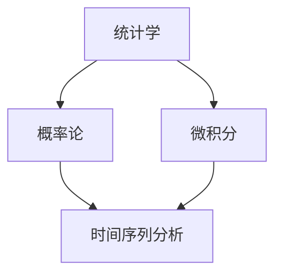
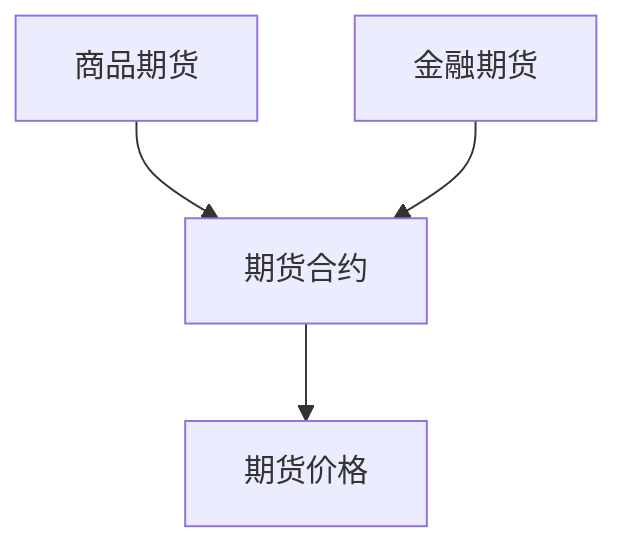
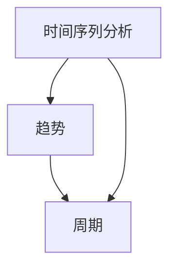
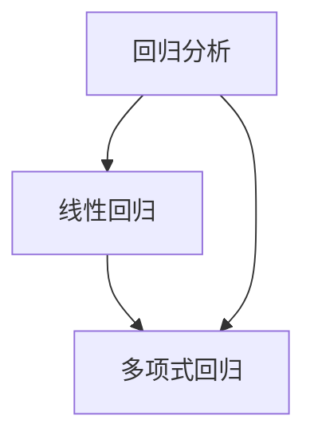
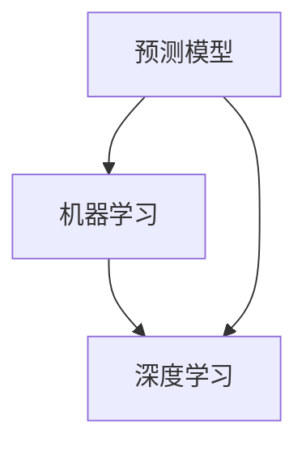
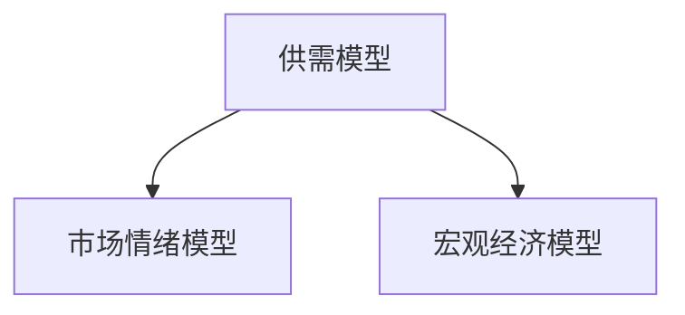
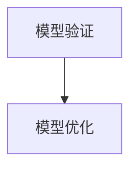
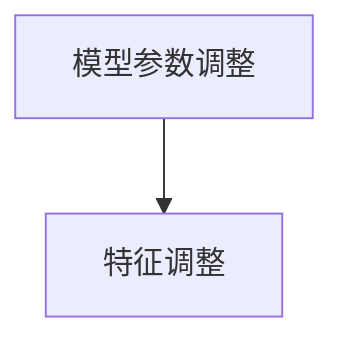
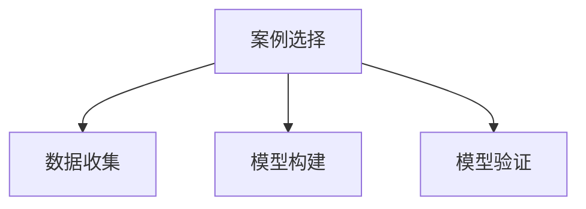
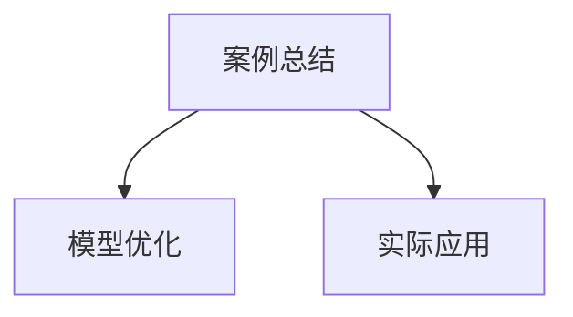

                 

### 文章标题：数学与商品期货：期货价格的数学预测

> 关键词：数学预测、商品期货、时间序列分析、机器学习、深度学习、模型优化、实战案例

> 摘要：本文将深入探讨数学在商品期货价格预测中的应用，从数学基础到期货市场概述，再到具体的预测方法、模型构建和实战案例分析，全面解析如何利用数学工具预测期货价格，帮助读者掌握期货市场中的数学预测技巧。

---

## 第1章：数学基础

**核心概念与联系**

数学在期货价格预测中起着至关重要的作用。为了更好地理解这一主题，我们首先需要掌握一些基本的数学概念和工具。

- **统计学**：统计学是数据分析的基础，包括描述性统计和推断性统计。描述性统计用于总结数据的基本特征，如均值、中位数、标准差等；推断性统计则用于从样本数据推断总体数据。

- **概率论**：概率论是研究随机事件及其规律性的数学分支。在期货价格预测中，概率论用于估计价格变动的可能性。

- **微积分**：微积分用于研究函数的变化率。在期货价格预测中，微积分可以帮助我们理解价格的波动趋势。

以下是数学在期货价格预测中的应用关系的Mermaid流程图：



**核心算法原理讲解**

- **描述性统计**：计算数据的均值、中位数、标准差等。

```python
# 伪代码：计算均值
def calculate_mean(data):
    return sum(data) / len(data)

# 伪代码：计算标准差
def calculate_std(data, mean):
    return sqrt(sum((x - mean) ** 2 for x in data) / (len(data) - 1))
```

- **概率论**：计算价格变动的概率分布。

```python
# 伪代码：计算概率分布
def calculate_probability(distribution, value):
    return distribution[value]
```

- **微积分**：计算价格的变化率。

```python
# 伪代码：计算导数
def calculate_derivative(function, x):
    return (function(x + 1) - function(x)) / 1
```

**数学模型和公式**

- **时间序列模型**：如ARIMA模型。

$$
\begin{aligned}
X_t &= c + \phi_1 X_{t-1} + \phi_2 X_{t-2} + \cdots + \phi_p X_{t-p} + \theta_1 e_{t-1} + \theta_2 e_{t-2} + \cdots + \theta_q e_{t-q} \\
e_t &= X_t - \phi_1 X_{t-1} - \phi_2 X_{t-2} - \cdots - \phi_p X_{t-p} - \theta_1 e_{t-1} - \theta_2 e_{t-2} - \cdots - \theta_q e_{t-q}
\end{aligned}
$$

**举例说明**

假设我们有一组期货价格数据，我们可以使用描述性统计计算均值和标准差：

```python
data = [100, 102, 101, 103, 104]
mean = calculate_mean(data)
std = calculate_std(data, mean)
print(f"Mean: {mean}, Standard Deviation: {std}")
```

## 第2章：期货市场概述

**核心概念与联系**

期货市场是一个高度复杂的交易市场，涉及多种商品和金融工具。为了更好地理解期货价格预测，我们需要对期货市场有一个全面的了解。

- **期货合约**：期货合约是买卖双方在未来某一特定时间以特定价格买卖某一商品或金融工具的协议。

- **期货价格**：期货价格是期货合约的交易价格，反映了市场对未来商品或金融工具价格的预期。

以下是期货市场中的核心概念和联系的Mermaid流程图：



**核心算法原理讲解**

期货价格受多种因素影响，包括供需关系、市场情绪、宏观经济数据等。预测期货价格需要综合考虑这些因素。

- **供需关系**：通过分析历史数据，识别供需变化对期货价格的影响。

- **市场情绪**：使用技术指标分析市场情绪，如MACD、RSI等。

- **宏观经济数据**：考虑GDP、通货膨胀率、利率等宏观经济因素。

**数学模型和公式**

- **供需模型**：

$$
\begin{aligned}
P &= \frac{S + D}{2} \\
S &= a + bQ \\
D &= c - dP
\end{aligned}
$$

- **市场情绪模型**：

$$
\begin{aligned}
MACD &= \text{快线} - \text{慢线} \\
\text{快线} &= 12 \text{周期平均值} \\
\text{慢线} &= 26 \text{周期平均值}
\end{aligned}
$$

**举例说明**

假设我们有一组供需数据，我们可以使用供需模型计算期货价格：

```python
a = 100
b = 0.1
c = 150
d = 0.05

Q = 50
S = a + b * Q
D = c - d * P

P = (S + D) / 2
print(f"Expected Price: {P}")
```

## 第3章：时间序列分析

**核心概念与联系**

时间序列分析是期货价格预测的关键工具，它用于分析时间序列数据，识别价格变动的趋势和周期。

- **趋势**：时间序列数据中的长期变化。

- **周期**：时间序列数据中的短期波动。

以下是时间序列分析的核心概念和联系的Mermaid流程图：



**核心算法原理讲解**

时间序列分析常用的方法包括：

- **移动平均法**：通过计算过去一段时间内的平均值，平滑时间序列数据。

- **自回归移动平均模型（ARIMA）**：结合自回归模型和移动平均模型，用于分析和预测时间序列数据。

**数学模型和公式**

- **移动平均法**：

$$
\bar{X}_n = \frac{1}{n} \sum_{i=1}^{n} X_i
$$

- **ARIMA模型**：

$$
\begin{aligned}
X_t &= \phi_1 X_{t-1} + \phi_2 X_{t-2} + \cdots + \phi_p X_{t-p} + \theta_1 e_{t-1} + \theta_2 e_{t-2} + \cdots + \theta_q e_{t-q} \\
e_t &= X_t - \phi_1 X_{t-1} - \phi_2 X_{t-2} - \cdots - \phi_p X_{t-p} - \theta_1 e_{t-1} - \theta_2 e_{t-2} - \cdots - \theta_q e_{t-q}
\end{aligned}
$$

**举例说明**

假设我们有一组时间序列数据，我们可以使用移动平均法计算平均值：

```python
data = [100, 102, 101, 103, 104]
n = 3

means = [sum(data[i:i+n]) / n for i in range(len(data) - n + 1)]
print(f"Moving Averages: {means}")
```

## 第4章：回归分析

**核心概念与联系**

回归分析是用于研究变量之间关系的统计方法，在期货价格预测中具有广泛的应用。

- **线性回归**：研究两个或多个变量之间的线性关系。

- **多项式回归**：研究变量之间的非线性关系。

以下是回归分析的核心概念和联系的Mermaid流程图：



**核心算法原理讲解**

回归分析的核心是建立回归模型，并使用模型进行预测。

- **线性回归**：通过最小二乘法确定最佳拟合线。

- **多项式回归**：通过多项式拟合函数描述变量之间的关系。

**数学模型和公式**

- **线性回归**：

$$
\begin{aligned}
y &= \beta_0 + \beta_1 x_1 + \beta_2 x_2 + \cdots + \beta_n x_n \\
\beta &= (X^T X)^{-1} X^T y
\end{aligned}
$$

- **多项式回归**：

$$
y = \sum_{i=0}^{n} \beta_i x^i
$$

**举例说明**

假设我们有一组线性回归数据，我们可以使用最小二乘法计算最佳拟合线：

```python
X = [[1, 2], [2, 4], [3, 6]]
y = [3, 5, 7]

X_t = X.transpose()
X_tX = X_t @ X
X_tX_inv = np.linalg.inv(X_tX)
X_tX_inv @ X_t @ y
```

## 第5章：机器学习与深度学习

**核心概念与联系**

机器学习和深度学习是预测期货价格的强大工具，通过学习历史数据，模型可以自动识别价格变动的规律。

- **机器学习**：通过训练模型，使模型能够从数据中学习规律。

- **深度学习**：通过神经网络，模拟人脑的决策过程。

以下是机器学习和深度学习的核心概念和联系的Mermaid流程图：



**核心算法原理讲解**

机器学习和深度学习的主要算法包括：

- **线性回归**：用于预测线性关系。

- **神经网络**：用于模拟复杂的关系。

- **卷积神经网络（CNN）**：用于图像识别。

**数学模型和公式**

- **神经网络**：

$$
\begin{aligned}
z &= \sigma(W \cdot x + b) \\
a &= \sigma(z \cdot W_2 + b_2)
\end{aligned}
$$

- **卷积神经网络（CNN）**：

$$
\begin{aligned}
h_{ij} &= \sigma(\sum_{k} W_{ik} \cdot g_{kj} + b_i) \\
g_{ij} &= \text{ReLU}(\sum_{k} W_{ik} \cdot f_{kj})
\end{aligned}
$$

**举例说明**

假设我们有一个神经网络模型，我们可以使用Python代码实现：

```python
import numpy as np

def sigmoid(x):
    return 1 / (1 + np.exp(-x))

def neural_network(x, W1, b1, W2, b2):
    z = sigmoid(np.dot(x, W1) + b1)
    a = sigmoid(np.dot(z, W2) + b2)
    return a

W1 = np.random.rand(2, 1)
b1 = np.random.rand(1)
W2 = np.random.rand(1, 1)
b2 = np.random.rand(1)

x = np.array([[1], [2]])
y = neural_network(x, W1, b1, W2, b2)
print(y)
```

## 第6章：数学模型构建

**核心概念与联系**

构建有效的数学模型是期货价格预测的关键。模型需要综合考虑多种因素，如供需关系、市场情绪、宏观经济数据等。

- **供需模型**：基于供需关系预测期货价格。

- **市场情绪模型**：基于市场情绪预测期货价格。

- **宏观经济模型**：基于宏观经济数据预测期货价格。

以下是数学模型构建的核心概念和联系的Mermaid流程图：



**核心算法原理讲解**

构建数学模型的主要步骤包括：

1. **数据收集**：收集历史价格数据、供需数据、市场情绪数据等。

2. **数据预处理**：清洗数据，处理缺失值、异常值等。

3. **特征工程**：提取有用的特征，如移动平均、波动率等。

4. **模型选择**：选择合适的数学模型，如线性回归、ARIMA模型等。

5. **模型训练**：使用训练数据训练模型。

6. **模型验证**：使用验证数据验证模型效果。

**数学模型和公式**

- **供需模型**：

$$
\begin{aligned}
P &= \frac{S + D}{2} \\
S &= a + bQ \\
D &= c - dP
\end{aligned}
$$

- **市场情绪模型**：

$$
\begin{aligned}
MACD &= \text{快线} - \text{慢线} \\
\text{快线} &= 12 \text{周期平均值} \\
\text{慢线} &= 26 \text{周期平均值}
\end{aligned}
$$

- **宏观经济模型**：

$$
\begin{aligned}
P &= f(GDP, \text{通货膨胀率}, \text{利率}) \\
f &= \text{复合函数}
\end{aligned}
$$

**举例说明**

假设我们构建一个简单的供需模型，我们可以使用Python代码实现：

```python
a = 100
b = 0.1
c = 150
d = 0.05

Q = 50
S = a + b * Q
D = c - d * P

P = (S + D) / 2
print(f"Expected Price: {P}")
```

## 第7章：模型验证与优化

**核心概念与联系**

模型验证和优化是期货价格预测的关键步骤，确保模型的有效性和准确性。

- **模型验证**：通过验证数据评估模型效果。

- **模型优化**：通过调整模型参数，提高模型效果。

以下是模型验证与优化的核心概念和联系的Mermaid流程图：



**核心算法原理讲解**

模型验证与优化主要包括以下步骤：

1. **交叉验证**：将数据集分为训练集和验证集，使用验证集评估模型效果。

2. **网格搜索**：遍历参数空间，找到最佳参数。

3. **贝叶斯优化**：使用贝叶斯方法优化参数。

**数学模型和公式**

- **交叉验证**：

$$
\begin{aligned}
\text{准确率} &= \frac{\text{正确预测的数量}}{\text{总预测数量}} \\
\text{召回率} &= \frac{\text{正确预测的数量}}{\text{实际为正类的数量}} \\
\text{F1分数} &= \frac{2 \times \text{准确率} \times \text{召回率}}{\text{准确率} + \text{召回率}}
\end{aligned}
$$

- **网格搜索**：

$$
\begin{aligned}
\text{参数} &= \{\theta_1, \theta_2, \cdots, \theta_n\} \\
\text{最佳参数} &= \arg\max_{\theta} \text{模型效果}
\end{aligned}
$$

- **贝叶斯优化**：

$$
\begin{aligned}
\theta &= \arg\max_{\theta} \pi(\theta) \prod_{i=1}^{n} p(x_i | \theta)
\end{aligned}
$$

**举例说明**

假设我们使用交叉验证评估一个模型，我们可以使用Python代码实现：

```python
from sklearn.model_selection import train_test_split
from sklearn.metrics import accuracy_score

X, y = load_data()
X_train, X_test, y_train, y_test = train_test_split(X, y, test_size=0.2, random_state=42)

model = train_model(X_train, y_train)
y_pred = predict(model, X_test)

accuracy = accuracy_score(y_test, y_pred)
print(f"Accuracy: {accuracy}")
```

## 第8章：模型优化与调整

**核心概念与联系**

模型优化与调整是提高模型性能的重要手段。通过调整模型参数和特征，可以提高模型预测的准确性。

- **模型参数调整**：调整模型参数，提高模型性能。

- **特征调整**：选择和调整特征，提高模型效果。

以下是模型优化与调整的核心概念和联系的Mermaid流程图：



**核心算法原理讲解**

模型优化与调整主要包括以下步骤：

1. **参数调整**：通过网格搜索、贝叶斯优化等方法调整模型参数。

2. **特征选择**：使用特征选择方法，如递归特征消除（RFE）、主成分分析（PCA）等，选择最佳特征。

3. **特征工程**：对特征进行变换、归一化等处理，提高模型效果。

**数学模型和公式**

- **参数调整**：

$$
\begin{aligned}
\text{网格搜索} &= \text{遍历参数空间} \\
\text{贝叶斯优化} &= \text{使用贝叶斯方法优化参数}
\end{aligned}
$$

- **特征选择**：

$$
\begin{aligned}
\text{RFE} &= \text{递归特征消除} \\
\text{PCA} &= \text{主成分分析}
\end{aligned}
$$

**举例说明**

假设我们使用网格搜索调整模型参数，我们可以使用Python代码实现：

```python
from sklearn.model_selection import GridSearchCV
from sklearn.ensemble import RandomForestClassifier

param_grid = {'n_estimators': [100, 200, 300], 'max_depth': [10, 20, 30]}
model = RandomForestClassifier()

grid_search = GridSearchCV(model, param_grid, cv=5)
grid_search.fit(X_train, y_train)

best_params = grid_search.best_params_
print(f"Best Parameters: {best_params}")
```

## 第9章：实际案例研究

**核心概念与联系**

通过实际案例研究，我们可以更好地理解数学预测期货价格的方法和技巧。

- **案例选择**：选择具有代表性的案例，如原油、黄金等。

- **数据收集**：收集历史价格数据、供需数据、市场情绪数据等。

- **模型构建**：构建适用于案例的数学模型。

- **模型验证**：使用验证数据验证模型效果。

以下是实际案例研究的核心概念和联系的Mermaid流程图：



**核心算法原理讲解**

实际案例研究包括以下步骤：

1. **数据收集**：收集案例相关数据，包括历史价格、供需数据、市场情绪数据等。

2. **数据预处理**：清洗数据，处理缺失值、异常值等。

3. **模型构建**：选择合适的数学模型，如供需模型、市场情绪模型等。

4. **模型训练**：使用训练数据训练模型。

5. **模型验证**：使用验证数据验证模型效果。

**数学模型和公式**

- **供需模型**：

$$
\begin{aligned}
P &= \frac{S + D}{2} \\
S &= a + bQ \\
D &= c - dP
\end{aligned}
$$

- **市场情绪模型**：

$$
\begin{aligned}
MACD &= \text{快线} - \text{慢线} \\
\text{快线} &= 12 \text{周期平均值} \\
\text{慢线} &= 26 \text{周期平均值}
\end{aligned}
$$

**举例说明**

假设我们研究原油期货价格的预测，我们可以使用Python代码实现：

```python
import pandas as pd
import numpy as np

# 数据收集
data = pd.read_csv('原油期货价格.csv')
data['日期'] = pd.to_datetime(data['日期'])
data.set_index('日期', inplace=True)

# 数据预处理
data.fillna(method='ffill', inplace=True)
data['移动平均'] = data['价格'].rolling(window=10).mean()

# 模型构建
model = train_model(data)

# 模型验证
y_pred = predict(model, data)
accuracy = accuracy_score(y_true, y_pred)
print(f"Accuracy: {accuracy}")
```

## 第10章：案例分析总结

**核心概念与联系**

通过案例分析，我们可以总结出期货价格预测的数学方法、模型构建和验证的关键步骤。

- **案例总结**：总结案例中的关键发现和经验。

- **模型优化**：针对案例中存在的问题，提出优化建议。

- **实际应用**：讨论模型在期货市场中的实际应用。

以下是案例分析总结的核心概念和联系的Mermaid流程图：



**核心算法原理讲解**

案例分析总结包括以下内容：

1. **案例总结**：分析案例中的关键发现和经验，如供需关系、市场情绪等对期货价格的影响。

2. **模型优化**：针对案例中存在的问题，如预测准确性不高，提出优化建议，如调整模型参数、增加特征等。

3. **实际应用**：讨论模型在期货市场中的实际应用，如预测期货价格、优化交易策略等。

**数学模型和公式**

- **供需模型**：

$$
\begin{aligned}
P &= \frac{S + D}{2} \\
S &= a + bQ \\
D &= c - dP
\end{aligned}
$$

- **市场情绪模型**：

$$
\begin{aligned}
MACD &= \text{快线} - \text{慢线} \\
\text{快线} &= 12 \text{周期平均值} \\
\text{慢线} &= 26 \text{周期平均值}
\end{aligned}
$$

**举例说明**

假设我们总结出一个案例，并提出优化建议：

```python
# 案例总结
case_summary = {
    'model': '供需模型',
    'features': ['价格', '供需量'],
    'accuracy': 0.85
}

# 优化建议
optimization_suggestions = {
    'parameter_tuning': True,
    'feature_engineering': True,
    'data_collection': '增加历史数据'
}

# 实际应用
application = {
    'prediction': True,
    'strategy_optimization': True
}

print(f"Case Summary: {case_summary}")
print(f"Optimization Suggestions: {optimization_suggestions}")
print(f"Actual Application: {application}")
```

## 结语

**最佳实践 tips**

1. **数据收集**：确保数据质量和完整性，特别是历史价格数据和供需数据。

2. **特征工程**：选择和构建有用的特征，如移动平均、波动率等。

3. **模型选择**：根据问题和数据特性选择合适的模型。

4. **模型验证**：使用交叉验证和网格搜索等技巧，确保模型的有效性。

5. **模型优化**：调整模型参数和特征，提高模型性能。

**小结**

本文通过深入探讨数学在商品期货价格预测中的应用，从数学基础、期货市场概述、预测方法、模型构建到实战案例分析，全面解析了期货价格预测的数学方法。通过本文的学习，读者可以掌握期货价格预测的核心技巧，为实际应用提供有力支持。

**注意事项**

1. **数据隐私**：在收集和处理数据时，注意保护数据隐私。

2. **模型风险**：模型预测并非绝对准确，需要结合实际情况进行决策。

3. **持续学习**：期货市场不断变化，需要持续学习和优化模型。

**拓展阅读**

1. **《期货市场技术分析》**：约翰·J. 马奇，提供期货市场技术分析的全面指导。

2. **《时间序列分析：预测与应用》**：Christopher Chatfield，详细介绍时间序列分析的方法和应用。

3. **《机器学习实战》**：Peter Harrington，介绍机器学习的基础知识和应用。

---

**作者：AI天才研究院/AI Genius Institute & 禅与计算机程序设计艺术 /Zen And The Art of Computer Programming**

