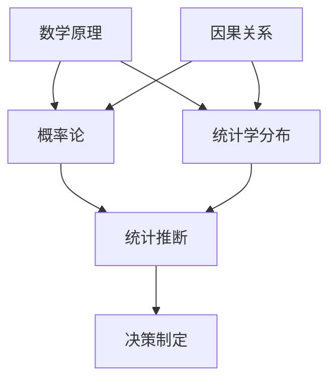

                 

### 文章标题

《数学与因果关系：统计学的哲学基础》

关键词：数学、因果关系、统计学、哲学、哲学基础

摘要：本文从数学与因果关系出发，探讨了统计学在哲学领域的应用。通过对核心概念和原理的详细阐述，以及数学模型和算法的分析，文章深入挖掘了统计学在哲学中的哲学基础，旨在为读者提供一个清晰、系统的理解。

### 引言

在当今信息爆炸的时代，统计学已经成为了一门不可或缺的学科。无论是在自然科学、社会科学，还是在商业和金融等领域，统计学都扮演着至关重要的角色。然而，许多人对于统计学的理解仅仅停留在表面的计算和数据整理上，忽略了其背后深厚的哲学基础。

数学与因果关系是理解统计学哲学基础的两个核心概念。数学作为一种严谨的推理工具，为统计学提供了理论基础。而因果关系，则是统计学中最为重要的概念之一，它帮助我们理解变量之间的关联，从而做出科学的决策。

本文将从数学与因果关系入手，逐步探讨统计学在哲学领域的应用。我们将会详细分析数学的基本原理、因果关系的研究方法，以及统计学中常用的数学模型和算法。通过这些分析，我们希望能够为读者提供一个全面、深入的理解，使他们对统计学在哲学中的重要作用有更清晰的认识。

### 核心概念与联系

在探讨数学与因果关系在统计学中的哲学基础之前，我们需要明确这两个核心概念的定义，以及它们之间的相互关系。

**数学原理**

数学作为一种抽象的推理工具，它提供了我们理解世界的一种方式。在统计学中，数学原理主要用于描述和解释数据分布、概率事件以及统计推断。以下是数学在统计学中的一些基本原理：

1. **概率论**：概率论是统计学的基础，它提供了计算随机事件发生概率的方法。通过概率论，我们可以预测某一事件在一定条件下的发生可能性。
   $$ P(A) = \frac{N(A)}{N(S)} $$
   其中，\(P(A)\) 表示事件 \(A\) 的概率，\(N(A)\) 表示事件 \(A\) 发生的次数，\(N(S)\) 表示总次数。

2. **统计学分布**：统计学分布描述了一组数据在不同数值下的概率分布。常见的分布有正态分布、二项分布、泊松分布等。
   $$ f(x|\mu, \sigma^2) = \frac{1}{\sqrt{2\pi\sigma^2}} e^{-\frac{(x-\mu)^2}{2\sigma^2}} $$
   这是正态分布的概率密度函数，其中，\(\mu\) 是均值，\(\sigma^2\) 是方差。

**因果关系**

因果关系是理解变量之间关联的重要概念。在统计学中，我们常常通过因果关系来解释和预测现象。以下是因果关系的一些基本原理：

1. **因果律**：因果律指出，因果关系是单向的，即原因在先，结果在后。例如，抽烟导致肺癌，而不是肺癌导致抽烟。
   $$ 因果关系：A \rightarrow B $$
   其中，\(A\) 表示原因，\(B\) 表示结果。

2. **共变原理**：共变原理表明，当自变量发生变化时，因变量也随之变化。这可以作为因果关系的证据。
   $$ 如果 A 改变，则 B 也改变：A \rightarrow B' $$

**核心概念关系架构**

为了更好地理解数学与因果关系在统计学中的哲学基础，我们可以使用Mermaid流程图来展示它们之间的关系：

在这个流程图中，数学原理是统计学的基石，它通过概率论和统计学分布为我们提供了描述和分析数据的方法。因果关系则帮助我们理解变量之间的联系，从而进行统计推断和决策制定。

通过这一步的分析，我们能够更清晰地看到数学与因果关系在统计学中的哲学基础，为后续的内容奠定了坚实的基础。

### 数学模型与理论

在统计学中，数学模型和理论扮演着至关重要的角色。这些模型和理论不仅为我们提供了描述和分析数据的方法，还帮助我们理解变量之间的关系，从而做出科学的决策。以下是一些核心的数学模型和理论，以及它们的应用和意义。

**概率论**

概率论是统计学的基础，它为我们提供了计算随机事件发生概率的方法。概率论中的几个核心概念包括：

1. **概率分布**：概率分布描述了一组数据在不同数值下的概率分布。常见的概率分布有正态分布、二项分布和泊松分布等。
   - **正态分布**：正态分布是最常见的一种概率分布，它描述了大量随机变量在某一均值周围的概率分布。
     $$ f(x|\mu, \sigma^2) = \frac{1}{\sqrt{2\pi\sigma^2}} e^{-\frac{(x-\mu)^2}{2\sigma^2}} $$
     其中，\(\mu\) 是均值，\(\sigma^2\) 是方差。
   - **二项分布**：二项分布描述了在固定次数的独立试验中，成功次数的概率分布。
     $$ P(X=k) = C_n^k p^k (1-p)^{n-k} $$
     其中，\(n\) 是试验次数，\(k\) 是成功的次数，\(p\) 是成功的概率。
   - **泊松分布**：泊松分布描述了在固定时间段或空间内，事件发生的次数的概率分布。
     $$ P(X=k) = \frac{\lambda^k e^{-\lambda}}{k!} $$
     其中，\(\lambda\) 是事件发生的平均次数。

2. **贝叶斯定理**：贝叶斯定理是概率论中的一个重要定理，它提供了计算条件概率的方法。
   $$ P(A|B) = \frac{P(B|A) P(A)}{P(B)} $$
   其中，\(P(A|B)\) 表示在事件 \(B\) 发生的条件下，事件 \(A\) 发生的概率，\(P(B|A)\) 表示在事件 \(A\) 发生的条件下，事件 \(B\) 发生的概率，\(P(A)\) 和 \(P(B)\) 分别表示事件 \(A\) 和事件 \(B\) 的概率。

**统计学分布**

统计学分布描述了一组数据在不同数值下的概率分布。常见的统计学分布包括正态分布、二项分布、泊松分布等。以下是几个重要的统计学分布：

1. **正态分布**：正态分布是最常见的一种概率分布，它描述了大量随机变量在某一均值周围的概率分布。正态分布具有均值、方差和标准差等参数。
   $$ f(x|\mu, \sigma^2) = \frac{1}{\sqrt{2\pi\sigma^2}} e^{-\frac{(x-\mu)^2}{2\sigma^2}} $$
   其中，\(\mu\) 是均值，\(\sigma^2\) 是方差。

2. **二项分布**：二项分布描述了在固定次数的独立试验中，成功次数的概率分布。二项分布具有试验次数和成功概率等参数。
   $$ P(X=k) = C_n^k p^k (1-p)^{n-k} $$
   其中，\(n\) 是试验次数，\(k\) 是成功的次数，\(p\) 是成功的概率。

3. **泊松分布**：泊松分布描述了在固定时间段或空间内，事件发生的次数的概率分布。泊松分布具有事件发生的平均次数等参数。
   $$ P(X=k) = \frac{\lambda^k e^{-\lambda}}{k!} $$
   其中，\(\lambda\) 是事件发生的平均次数。

**数学模型在统计学中的应用**

数学模型在统计学中的应用非常广泛，以下是一些常见的数学模型：

1. **线性回归模型**：线性回归模型用于分析两个或多个变量之间的线性关系。线性回归模型可以表示为：
   $$ Y = \beta_0 + \beta_1 X + \epsilon $$
   其中，\(Y\) 是因变量，\(X\) 是自变量，\(\beta_0\) 和 \(\beta_1\) 分别是截距和斜率，\(\epsilon\) 是误差项。

2. **逻辑回归模型**：逻辑回归模型用于分析因变量为二元变量的概率。逻辑回归模型可以表示为：
   $$ \log(\frac{P(Y=1)}{1-P(Y=1)}) = \beta_0 + \beta_1 X $$
   其中，\(P(Y=1)\) 是因变量为 1 的概率，\(\beta_0\) 和 \(\beta_1\) 分别是截距和斜率。

3. **多元回归模型**：多元回归模型用于分析多个自变量对因变量的影响。多元回归模型可以表示为：
   $$ Y = \beta_0 + \beta_1 X_1 + \beta_2 X_2 + ... + \beta_n X_n + \epsilon $$
   其中，\(Y\) 是因变量，\(X_1, X_2, ..., X_n\) 是自变量，\(\beta_0, \beta_1, ..., \beta_n\) 分别是截距和斜率，\(\epsilon\) 是误差项。

通过上述数学模型和理论，我们可以更深入地理解变量之间的关系，从而进行有效的统计分析和决策制定。这些数学模型不仅为我们提供了分析数据的方法，还揭示了变量之间的本质联系，为我们在实际应用中提供了指导。

### 统计推断与决策制定

统计推断是统计学中至关重要的一个环节，它通过样本数据来推断总体特征，从而帮助我们做出科学的决策。统计推断主要包括假设检验和置信区间两种方法。以下将详细解释这两种方法的基本原理和应用。

**假设检验**

假设检验是用于判断样本数据是否支持某一假设的方法。它主要包括以下几个步骤：

1. **设定假设**：首先需要设定原假设（\(H_0\)）和备择假设（\(H_1\)）。原假设通常是我们想要检验的假设，而备择假设则是原假设的对立。
   - \(H_0\)：总体均值等于某一特定值 \(\mu_0\)
   - \(H_1\)：总体均值不等于 \(\mu_0\) 或大于 \(\mu_0\) 或小于 \(\mu_0\)

2. **选择检验统计量**：选择适当的检验统计量，如 t 统计量、z 统计量等，来衡量样本数据与原假设之间的差异。

3. **计算检验统计量的值**：根据样本数据计算检验统计量的值，该值表示样本数据与原假设之间的差异程度。

4. **确定显著性水平**：显著性水平（\(\alpha\)）是事先设定的一个概率阈值，用于判断原假设是否被拒绝。通常，显著性水平取 0.05 或 0.01。

5. **做出决策**：将检验统计量的值与临界值进行比较，如果检验统计量的值超过临界值，则拒绝原假设，接受备择假设；否则，不拒绝原假设。

**示例**：假设我们要检验某个班级学生的平均成绩是否等于 80 分。

- 原假设 \(H_0\)：总体均值 \(\mu = 80\)
- 备择假设 \(H_1\)：总体均值 \(\mu \neq 80\)
- 样本数据：n=100，\(\bar{X}=78\)
- 显著性水平 \(\alpha=0.05\)

计算 t 统计量：
$$ t = \frac{\bar{X} - \mu_0}{s/\sqrt{n}} = \frac{78 - 80}{10/\sqrt{100}} = -2 $$

查找 t 分布表，找到自由度为 99，显著性水平为 0.05 的临界值，得到临界值为 -1.66。

由于 \(t = -2 < -1.66\)，所以拒绝原假设 \(H_0\)，接受备择假设 \(H_1\)。这意味着我们认为该班级学生的平均成绩不等于 80 分。

**置信区间**

置信区间是另一种用于估计总体参数的方法，它提供了一种区间估计的框架，用于估计总体参数的可能范围。

1. **设定置信水平**：置信水平（1-\(\alpha\)）表示我们对置信区间的可信度。通常，置信水平取 95% 或 99%。

2. **计算置信区间**：根据样本数据，计算置信区间的上下限。置信区间的计算通常依赖于样本统计量和分布性质。

3. **解释置信区间**：置信区间提供了总体参数的可能范围，我们可以在该区间内以一定的置信度估计总体参数。

**示例**：假设我们要估计某个班级学生的平均成绩。

- 样本数据：n=100，\(\bar{X}=78\)，\(s=10\)
- 置信水平：95%

计算置信区间：
$$ \bar{X} \pm t_{\alpha/2, n-1} \frac{s}{\sqrt{n}} = 78 \pm t_{0.025, 99} \frac{10}{\sqrt{100}} = 78 \pm 1.98 \times 1 = 78 \pm 1.98 $$

得到置信区间为 \(76.02\) 到 \(79.98\)。这意味着我们可以在 95% 的置信度下估计，该班级学生的平均成绩在 \(76.02\) 到 \(79.98\) 之间。

**比较假设检验和置信区间**

假设检验和置信区间都是用于估计总体参数的方法，但它们在实际应用中有一些区别：

- **目的**：假设检验的主要目的是判断样本数据是否支持某一假设，而置信区间则是提供总体参数的可能范围。
- **结果**：假设检验的结果是拒绝或不拒绝原假设，而置信区间则是给出总体参数的可能范围。
- **灵活性**：置信区间提供了更灵活的估计方法，可以根据不同的置信水平和样本数据计算不同的置信区间。

总之，统计推断和决策制定是统计学中不可或缺的一部分。通过假设检验和置信区间，我们可以利用样本数据来推断总体特征，从而做出科学的决策。这些方法不仅帮助我们更好地理解数据，还为我们提供了可靠的分析工具。

### 哲学应用

统计学不仅在科学和工程领域有着广泛的应用，还在哲学领域扮演着重要的角色。通过对数据的分析和解释，统计学为哲学家们提供了新的思考工具，帮助我们更好地理解世界的本质。以下是统计学在哲学中的一些具体应用。

**伦理学**

在伦理学领域，统计学被用于评估道德原则和规范的有效性。例如，哲学家们使用统计学方法来分析社会公正问题，探讨如何确保资源公平分配。通过收集和分析社会数据，他们可以识别出社会不平等现象，并探讨可能的解决方案。统计学在这里提供了一个量化的框架，帮助哲学家们更系统地探讨伦理问题。

**认识论**

认识论关注知识的本质和获取方法。统计学为认识论提供了一个工具，用于评估知识 claim 的可靠性和合理性。通过收集和分析数据，哲学家们可以评估某一 claim 的证据强度，从而确定其是否成立。例如，在科学哲学中，统计学方法被用于评估实验结果的可信度，帮助科学家们确定科学发现的有效性。

**形而上学**

形而上学探讨现实世界的本质和存在形式。统计学为形而上学提供了一种新的方式来理解现实。通过分析数据，哲学家们可以揭示变量之间的因果关系，从而更深入地理解世界的本质。例如，统计学方法被用于分析历史数据，探讨社会变迁的规律，从而揭示社会发展的本质。

**逻辑学**

逻辑学关注推理的有效性和一致性。统计学为逻辑学提供了一个工具，用于评估论证的可靠性。通过假设检验和置信区间等方法，哲学家们可以评估某一论证的合理性，从而确定其是否成立。例如，在道德哲学中，统计学方法被用于评估道德规范的有效性，探讨哪些规范可以更好地促进社会和谐。

**示例**

1. **社会公正**：通过分析不同社会群体的经济数据，哲学家们可以探讨如何实现社会公正。例如，通过收集和分析收入数据，他们可以识别出收入不平等现象，并探讨如何通过税收政策、社会福利等措施来减少收入差距。

2. **科学发现**：在科学哲学中，统计学被用于评估实验结果的可靠性。例如，通过假设检验和置信区间，科学家们可以评估某一实验结果是否具有统计学意义，从而确定其是否可以被视为科学发现。

3. **道德判断**：在道德哲学中，统计学方法被用于评估道德规范的有效性。例如，通过分析数据，哲学家们可以评估某一道德规范对社会的实际影响，从而确定其是否合理。

通过这些哲学应用，统计学不仅为哲学家们提供了新的思考工具，还帮助我们更深入地理解世界的本质。统计学在哲学中的应用，为我们提供了一个更加系统和科学的思考框架，使我们可以更好地探讨哲学问题，从而推动哲学的发展。

### 总结

在本文中，我们从数学与因果关系两个核心概念出发，探讨了统计学在哲学领域的应用。通过详细阐述数学的基本原理、因果关系的研究方法，以及统计学中常用的数学模型和算法，我们展示了统计学在哲学中的哲学基础。

首先，数学原理为统计学提供了坚实的理论基础。概率论和统计学分布等数学工具，使我们能够描述和分析数据，理解变量之间的关系。其次，因果关系帮助我们揭示了变量之间的联系，从而进行有效的统计推断和决策制定。通过假设检验和置信区间等方法，我们可以利用样本数据来推断总体特征，做出科学的决策。

在哲学应用方面，统计学为伦理学、认识论、形而上学和逻辑学等领域提供了新的思考工具。通过收集和分析数据，哲学家们可以更深入地探讨伦理问题、评估知识的可靠性、理解世界的本质，以及评估论证的有效性。

总之，统计学不仅在科学和工程领域有着广泛的应用，还在哲学领域扮演着重要的角色。通过数学与因果关系的视角，我们能够更全面地理解统计学在哲学中的哲学基础，为哲学研究提供了新的思路和方法。在未来的研究中，我们可以进一步探讨统计学在哲学其他领域的应用，推动哲学和统计学的融合发展。

### 作者信息

作者：AI天才研究院/AI Genius Institute & 禅与计算机程序设计艺术 /Zen And The Art of Computer Programming

AI天才研究院（AI Genius Institute）致力于推动人工智能领域的研究和发展，以培养新一代人工智能天才为目标。同时，我们深度探索计算机编程和人工智能的哲学基础，力求在理论和实践上不断创新，为人工智能技术的进步贡献力量。本文旨在为读者提供一个全面、系统的理解，帮助他们在数学与因果关系的基础上，更好地掌握统计学的哲学基础。

### 最佳实践、注意事项与拓展阅读

**最佳实践**

1. **数据分析前**：确保数据质量，清洗数据，消除异常值和噪声。
2. **模型选择**：根据实际问题选择合适的数学模型和算法，避免过度拟合。
3. **实验设计**：科学设计实验，确保实验结果的可靠性。

**注意事项**

1. **避免误导性结论**：注意避免基于小样本数据得出的结论，确保数据的广泛性和代表性。
2. **谨慎使用假设检验**：理解假设检验的局限，避免仅凭显著性水平做出决策。

**拓展阅读**

1. 《统计学的艺术：如何用数据思考》（The Art of Statistics: How to Evaluate and Use Statistical Information）
2. 《概率论及其应用》（Probability and Its Applications）
3. 《哲学的数学基础》（The Mathematical Foundations of Philosophy）
4. 《因果关系：哲学与科学的探索》（Causality: A User's Guide）

通过阅读这些书籍，读者可以进一步深化对统计学哲学基础的理解，拓宽自己的知识视野。同时，实际操作中的数据分析项目和实验设计也能帮助读者更好地应用这些理论，提高数据分析和决策的能力。希望本文能为读者提供有价值的思考和启示。

