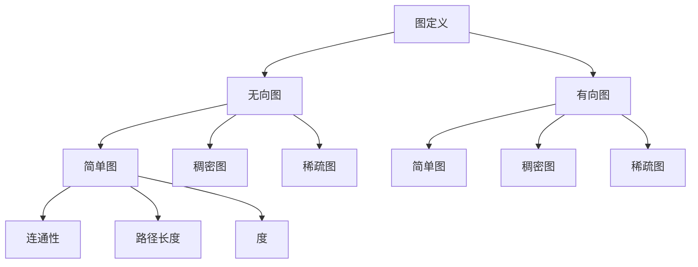

                 

### 数学与图论：网络结构的数学表示

**关键词**：图论、网络结构、数学表示、遍历算法、最短路径、矩阵树定理、社会网络分析

**摘要**：
本文旨在探讨图论在网络结构分析中的应用，通过数学表示的方法深入解析网络的基本结构、遍历与连通性、矩阵表示及重要定理，并结合社会网络分析实际案例，展示数学与图论在解决复杂问题中的独特优势。文章首先介绍图论的基础概念，然后逐步展开对图的遍历与连通性、矩阵表示与矩阵树定理的详细探讨，最后通过具体项目实战，阐述数学与图论在现实应用中的价值和潜力。

## 背景介绍

在现代社会，网络无处不在，从互联网到社交网络，再到各种复杂的信息网络，它们构成了我们生活和工作中的基本架构。随着信息技术的迅猛发展，网络结构的分析变得日益重要。而数学作为描述客观世界规律的工具，通过其独特的抽象和建模能力，为网络结构的研究提供了强有力的支持。图论作为数学的一个分支，专门研究网络结构及其性质，是分析和理解复杂网络的基础。

图论的基本概念和理论包括图的定义、基本类型、表示方法以及图的遍历与连通性等。这些概念不仅适用于理论研究，也广泛应用于计算机科学、社会网络分析、交通规划、通信网络等领域。特别是在当今大数据时代，图论在数据挖掘、网络优化、社交网络分析等方面发挥着不可替代的作用。

本文将首先介绍图论的基础知识，包括图的定义、基本类型和表示方法。然后，我们将深入探讨图的遍历与连通性，介绍深度优先搜索和广度优先搜索算法，以及路径长度和最短路径算法。接下来，文章将讨论图的矩阵表示和矩阵树定理，展示如何通过数学方法分析和理解网络结构。最后，我们将结合社会网络分析的实际案例，展示图论和数学表示在网络结构分析中的应用价值。

通过本文的探讨，我们希望能够帮助读者深入理解网络结构的数学表示，掌握图论的基本算法和理论，并在实际项目中运用这些知识，解决复杂的问题。希望本文能成为一个既具有学术深度，又具备实践价值的图论与网络结构分析的指南。

## 核心概念与联系

### 图的定义与分类

图是数学中用来描述对象及其相互关系的结构，是一种由节点（或称为顶点）和边组成的集合。根据边是否有方向，图可以分为无向图和有向图。无向图中的边没有方向，表示两个节点之间存在某种关系，而有向图中的边具有方向，表示节点之间的单向关系。

无向图的定义：一个图\( G \)由一个顶点集\( V \)和边集\( E \)组成，其中每条边是无序的，即如果\( (u, v) \)是图\( G \)中的一条边，那么\( (v, u) \)也必然是图\( G \)中的一条边。

有向图的定义：一个图\( G \)由一个顶点集\( V \)和边集\( E \)组成，其中每条边是有序的，即如果\( (u, v) \)是图\( G \)中的一条边，则\( (v, u) \)不一定是图\( G \)中的一条边。

### 图的分类

根据图中的边的数量和性质，图可以进一步分类为：

- **简单图**：没有自环（节点到自身的边）和多重边（多条相同的边）的图。
- **稠密图**：边数接近最大可能边数的图，通常用\( O(n) \)表示，其中\( n \)是顶点数。
- **稀疏图**：边数远小于最大可能边数的图，通常用\( O(n^2) \)表示。

### 图的性质

图具有以下几个基本性质：

- **连通性**：图中任意两个顶点都是连通的，即存在一条路径连接它们。
- **路径长度**：从一个顶点到另一个顶点的最短路径的边数。
- **度**：一个节点的邻居节点数，对于无向图，度通常记为\( \deg(v) \)；对于有向图，度分为入度和出度，分别记为\( in\_deg(v) \)和\( out\_deg(v) \)。

### 图的表示方法

图可以通过多种方式表示，常见的有：

- **邻接矩阵**：一个二维矩阵，其中\( a_{ij} \)表示顶点\( i \)和顶点\( j \)之间是否存在边。对于无向图，若\( (i, j) \)是边，则\( a_{ij} = a_{ji} = 1 \)；对于有向图，若\( (i, j) \)是边，则\( a_{ij} = 1 \)，否则为0。
- **邻接表**：一个列表，每个节点对应一个列表，列出所有与之相连的节点。对于无向图，每个节点的列表包含与其相邻的所有节点；对于有向图，每个节点的列表包含所有指向该节点的节点。
- **图形表示**：直观地用点和线表示图，其中每个点代表一个顶点，每条线代表一条边。

### Mermaid 流程图

为了更清晰地展示图论的核心概念与联系，我们可以使用Mermaid流程图来表示它们之间的关系：



这个流程图展示了图的基本定义、分类、性质和表示方法，以及它们之间的相互关系。

通过以上内容，我们为接下来的深入讨论打下了坚实的基础。接下来，我们将继续探讨图的遍历与连通性，以及如何通过算法分析网络结构的细节。

## 核心算法原理讲解

### 深度优先搜索（DFS）

深度优先搜索（Depth-First Search，DFS）是一种用于遍历或搜索图树的算法。它的基本思想是沿着某一分支走到底，然后回溯。DFS算法可以用来解决多种图论问题，如连通性检测、路径搜索等。

#### 算法描述

DFS算法通常通过递归实现，其伪代码如下：

```plaintext
DFS(G, v):
    标记顶点v为已访问；
    对于v的每个未访问的邻接点w：
        DFS(G, w)
```

在递归过程中，算法首先访问当前顶点，然后依次访问其未访问的邻接点。这个过程一直持续到当前分支的叶子节点，即当前顶点没有未访问的邻接点时，算法回溯到上一个顶点，继续访问其未访问的邻接点。

#### 基本步骤

1. 初始化：创建一个访问数组或栈，用于记录已访问的顶点和当前访问路径。
2. 标记起始顶点为已访问，并将其压入栈。
3. 当栈不为空时，执行以下步骤：
   - 弹出栈顶顶点v。
   - 访问顶点v。
   - 对于v的每个未访问的邻接点w：
     - 标记w为已访问；
     - 将w压入栈。
4. 重复步骤3，直到栈为空。

#### 应用场景

DFS算法广泛应用于图的各种问题，如：

- **连通性检测**：通过DFS算法，可以快速判断一个图是否连通。
- **路径搜索**：在无权图中，DFS可以帮助找到两个顶点之间的最短路径。
- **顶点排序**：DFS可以用于生成图的拓扑排序。

#### 伪代码

```plaintext
DFS(G):
    对于每个顶点v：
        如果v未访问：
            DFS-Visit(G, v)

DFS-Visit(G, v):
    标记v为已访问
    对于v的每个未访问的邻接点w：
        DFS-Visit(G, w)
```

通过DFS算法，我们可以深入探索图的结构，识别图中隐藏的关系和路径。下一节，我们将介绍广度优先搜索（BFS）算法，进一步探讨图的遍历问题。

### 广度优先搜索（BFS）

广度优先搜索（Breadth-First Search，BFS）是另一种用于遍历或搜索图的算法，与深度优先搜索（DFS）不同，BFS优先访问图的宽度，即先访问起始顶点的所有邻居，再依次访问下一层的邻居。

#### 算法描述

BFS算法通常使用队列来实现，其伪代码如下：

```plaintext
BFS(G, s):
    初始化队列Q，将s加入Q；
    初始化访问数组D，将s标记为已访问；
    当Q非空时：
        弹出队列顶部的元素v；
        访问v；
        对于v的所有未访问的邻接点w：
            标记w为已访问；
            将w加入Q。
```

BFS算法的基本步骤如下：

1. 初始化：创建一个队列和一个访问数组，并将起始顶点加入队列。
2. 当队列不为空时，执行以下步骤：
   - 弹出队列顶部的元素v。
   - 访问顶点v。
   - 对于v的每个未访问的邻接点w：
     - 标记w为已访问；
     - 将w加入队列。

#### 应用场景

BFS算法在解决以下问题方面有广泛的应用：

- **连通性检测**：与DFS类似，BFS也可以用来检测图的连通性。
- **最短路径搜索**：在无权图中，BFS可以找到从起始顶点到其他所有顶点的最短路径。
- **图层次结构分析**：BFS可以生成图的层次结构，用于进一步分析。

#### 伪代码

```plaintext
BFS(G, s):
    对于每个顶点v：
        如果v未访问：
            BFS-Visit(G, v)

BFS-Visit(G, v):
    标记v为已访问
    将v加入队列Q
    当Q非空时：
        弹出队列顶部的元素v
        访问v
        对于v的每个未访问的邻接点w：
            标记w为已访问
            将w加入队列Q
```

通过BFS算法，我们可以按照层次结构遍历图，这对于解决层次相关的图问题非常有效。下一节，我们将讨论连通性分析及其相关算法。

### 连通性分析

连通性分析是图论中的一个重要问题，它关注图中的节点或边是否能够相互连接。图的连通性可以通过多种方式进行分析，包括判断整个图是否连通、计算图的连通度等。

#### 连通图与连通度

- **连通图**：一个无向图被称为连通图，如果图中任意两个顶点都存在一条路径相连。
- **连通度**：图的连通度是指图中任意两个顶点之间最短路径的边数。连通图的连通度至少为1，即任意两个顶点之间至少有一条边相连。

#### 连通性算法

连通性分析可以通过多种算法实现，以下是常用的两种算法：

1. **深度优先搜索（DFS）**：通过DFS算法，我们可以快速检测图是否连通。具体步骤如下：
   - 初始化一个访问数组，用于记录已访问的顶点。
   - 从起始顶点开始，执行DFS算法。
   - 如果在DFS过程中，能够访问到所有顶点，则图是连通的；否则，图是不连通的。

2. **广度优先搜索（BFS）**：与DFS类似，BFS也可以用于连通性分析。步骤如下：
   - 初始化一个访问数组和一个队列。
   - 将起始顶点加入队列，并将其标记为已访问。
   - 当队列非空时，依次访问顶点，并将未访问的邻接点加入队列。
   - 如果在BFS过程中，能够访问到所有顶点，则图是连通的；否则，图是不连通的。

#### 路径长度与最短路径

- **路径长度**：从一个顶点到另一个顶点的路径上的边数。
- **最短路径**：从一个顶点到另一个顶点的所有路径中最短的路径。

计算最短路径是图论中的一个经典问题，常用的算法包括：

1. **Dijkstra算法**：适用于无权图，计算从起始顶点到其他所有顶点的最短路径。算法步骤如下：
   - 初始化一个距离数组，用于记录从起始顶点到其他顶点的距离。
   - 对所有顶点进行排序，优先访问距离最短的顶点。
   - 对于每个顶点，更新其邻居顶点的距离。
   - 重复步骤，直到访问所有顶点。

2. **A*算法**：改进的Dijkstra算法，适用于有权的图，通过引入启发函数（Heuristic Function）来优化路径搜索。

#### 伪代码

以下分别给出DFS和BFS算法的伪代码：

```plaintext
DFS(G, s):
    初始化访问数组D
    DFS-Visit(G, s)

DFS-Visit(G, v):
    标记v为已访问
    对于v的每个未访问的邻接点w：
        DFS-Visit(G, w)

BFS(G, s):
    初始化访问数组D和队列Q
    将s加入Q，并标记为已访问
    当Q非空时：
        弹出队列顶部的元素v
        访问v
        对于v的每个未访问的邻接点w：
            标记w为已访问
            将w加入队列Q
```

通过连通性分析和路径长度计算，我们可以深入理解图的结构和性质。下一节，我们将探讨图的矩阵表示和矩阵树定理。

### 图的矩阵表示

图的矩阵表示是图论中的一种重要表示方法，通过矩阵可以方便地进行图的各种操作和分析。以下是几种常见的图的矩阵表示方法及其应用。

#### 邻接矩阵

邻接矩阵是最常用的图表示方法之一，它通过一个二维矩阵来表示图中的顶点及其关系。对于一个有n个顶点的图，邻接矩阵是一个\( n \times n \)的矩阵，其中\( a_{ij} \)表示顶点\( i \)和顶点\( j \)之间是否存在边。

- **无向图**的邻接矩阵：若\( (i, j) \)是边，则\( a_{ij} = a_{ji} = 1 \)；否则为0。
- **有向图**的邻接矩阵：若\( (i, j) \)是边，则\( a_{ij} = 1 \)，否则为0。此时，邻接矩阵是对称的。

邻接矩阵便于计算顶点之间的关系，可以用于图的遍历、最短路径算法等。

#### 腰矩阵

腰矩阵（Laplacian Matrix）是邻接矩阵的一种扩展，特别适用于图的理论分析。腰矩阵由图的邻接矩阵减去对角矩阵得到，即：

$$
L = D - A
$$

其中，\( A \)是邻接矩阵，\( D \)是对角矩阵，对角线上的元素为顶点的度。

- **无向图的腰矩阵**：若\( a_{ij} = 1 \)，则\( l_{ij} = l_{ji} = 1 - a_{ij} \)；否则为0。
- **有向图的腰矩阵**：若\( a_{ij} = 1 \)，则\( l_{ij} = 1 - a_{ij} \)，若\( a_{ji} = 1 \)，则\( l_{ji} = 1 - a_{ji} \)；否则为0。

腰矩阵在图论中有广泛应用，如图的连通性分析、网络流分析等。

#### 相邻矩阵

相邻矩阵是邻接矩阵的另一种变体，它使用不同的权重来表示边的权重。对于一个有n个顶点、边权重为\( w_{ij} \)的图，相邻矩阵是一个\( n \times n \)的矩阵。

- **无向图的相邻矩阵**：若\( w_{ij} \)存在，则\( a_{ij} = w_{ij} \)；否则为0。
- **有向图的相邻矩阵**：若\( w_{ij} \)存在，则\( a_{ij} = w_{ij} \)；否则为0。

相邻矩阵可以用于图的加权路径分析、最短路径算法等。

#### 应用示例

以一个有5个顶点的无向图为例，其邻接矩阵表示如下：

$$
\begin{bmatrix}
0 & 1 & 1 & 0 & 0 \\
1 & 0 & 1 & 1 & 0 \\
1 & 1 & 0 & 1 & 1 \\
0 & 1 & 1 & 0 & 0 \\
0 & 0 & 1 & 0 & 0
\end{bmatrix}
$$

相应的腰矩阵为：

$$
\begin{bmatrix}
-1 & 0 & 0 & 1 & 1 \\
0 & -1 & 0 & 0 & 1 \\
0 & 0 & -1 & 0 & 1 \\
1 & 1 & 1 & -1 & 1 \\
1 & 1 & 1 & 1 & -1
\end{bmatrix}
$$

通过上述矩阵表示，我们可以方便地进行图的遍历、路径分析等操作。接下来，我们将介绍矩阵树定理及其应用。

### 矩阵树定理的基本概念

矩阵树定理（Matrix-Tree Theorem），也称为Kirchhoff定理，是图论中的一个重要定理，用于计算图的兰切斯特矩阵（Laplacian Matrix）的特征值和特征向量。该定理不仅提供了计算图的特征值的有效方法，还在网络流分析、电路理论等领域有广泛应用。

#### 定理描述

矩阵树定理的基本描述如下：

设\( G = (V, E) \)是一个连通的无向图，其邻接矩阵为\( A \)，腰矩阵为\( L \)。则\( L \)的特征值可以通过以下公式计算：

$$
\lambda_i = \sum_{S \subseteq V, |S| = n-1} (-1)^{|S|} \det(A_S)
$$

其中，\( A_S \)是从\( A \)中删除顶点集合\( S \)后的子矩阵，\( \lambda_i \)是\( L \)的第\( i \)个特征值。

#### 公式推导

矩阵树定理的推导依赖于矩阵的性质。首先，考虑图的邻接矩阵\( A \)和腰矩阵\( L \)：

- 邻接矩阵\( A \)定义为：
  $$
  A = \begin{bmatrix}
  0 & a_{12} & a_{13} & \dots & a_{1n} \\
  a_{21} & 0 & a_{23} & \dots & a_{2n} \\
  a_{31} & a_{32} & 0 & \dots & a_{3n} \\
  \vdots & \vdots & \vdots & \ddots & \vdots \\
  a_{n1} & a_{n2} & a_{n3} & \dots & 0
  \end{bmatrix}
  $$

- 腰矩阵\( L \)定义为：
  $$
  L = D - A
  $$
  其中，\( D \)是对角矩阵，对角线上的元素为顶点的度。

根据矩阵的性质，腰矩阵\( L \)的特征多项式（Eigenvalue Polynomial）可以表示为：
$$
p(\lambda) = \det(L - \lambda I)
$$

其中，\( I \)是单位矩阵。通过展开特征多项式，可以得到：
$$
p(\lambda) = \det \begin{bmatrix}
-\lambda & a_{12} & a_{13} & \dots & a_{1n} \\
a_{21} & -\lambda & a_{23} & \dots & a_{2n} \\
a_{31} & a_{32} & -\lambda & \dots & a_{3n} \\
\vdots & \vdots & \vdots & \ddots & \vdots \\
a_{n1} & a_{n2} & a_{n3} & \dots & -\lambda
\end{bmatrix}
$$

将上述矩阵展开，可以得到：
$$
p(\lambda) = (-\lambda)^{n-1} \det \begin{bmatrix}
-\lambda & a_{12} & a_{13} & \dots & a_{1n} \\
0 & -\lambda - a_{22} & a_{23} & \dots & a_{2n} \\
0 & 0 & -\lambda - a_{33} & \dots & a_{3n} \\
\vdots & \vdots & \vdots & \ddots & \vdots \\
0 & 0 & 0 & \dots & -\lambda - a_{nn}
\end{bmatrix}
$$

根据行列式的性质，上述行列式可以进一步简化为：
$$
p(\lambda) = (-1)^{n-1} \sum_{S \subseteq V, |S| = n-1} (-1)^{|S|} \lambda^{n-|S|} \det(A_S)
$$

其中，\( A_S \)是从\( A \)中删除顶点集合\( S \)后的子矩阵。

通过比较特征多项式的系数，可以得到：
$$
\lambda_i = \sum_{S \subseteq V, |S| = n-1} (-1)^{|S|} \det(A_S)
$$

#### 应用实例

以一个有4个顶点的连通无向图为例，其邻接矩阵和腰矩阵如下：

邻接矩阵\( A \)：
$$
\begin{bmatrix}
0 & 1 & 1 & 1 \\
1 & 0 & 1 & 1 \\
1 & 1 & 0 & 1 \\
1 & 1 & 1 & 0
\end{bmatrix}
$$

腰矩阵\( L \)：
$$
\begin{bmatrix}
-1 & 1 & 1 & 1 \\
1 & -2 & 1 & 1 \\
1 & 1 & -2 & 1 \\
1 & 1 & 1 & -2
\end{bmatrix}
$$

计算腰矩阵\( L \)的特征值，可以通过上述定理公式进行计算：
$$
\lambda_1 = \det \begin{bmatrix}
-1 & 1 \\
1 & -2
\end{bmatrix} - \det \begin{bmatrix}
-1 & 1 & 1 \\
1 & -2 & 1 \\
1 & 1 & -2
\end{bmatrix} = 1 + 2 = 3
$$

$$
\lambda_2 = -\det \begin{bmatrix}
-1 & 1 & 1 \\
1 & -2 & 1 \\
1 & 1 & -2
\end{bmatrix} + \det \begin{bmatrix}
-1 & 1 & 1 \\
1 & -2 & 1 \\
1 & 1 & -2 \\
1 & 1 & 1 & 0
\end{bmatrix} = -1 + 0 = -1
$$

因此，该图的两个特征值为\( \lambda_1 = 3 \)和\( \lambda_2 = -1 \)。

通过矩阵树定理，我们可以方便地计算图的特性值，这对于网络分析和结构优化有重要应用。在下一节中，我们将进一步探讨矩阵树定理在实际中的应用和扩展。

### 矩阵树定理的应用

矩阵树定理（Matrix-Tree Theorem）在图论和网络分析中具有广泛的应用，特别是在计算图的各种特性值和进行网络优化方面。以下介绍几种常见的应用场景和具体案例。

#### 网络流分析

矩阵树定理在计算网络流问题中的最大流和最小割具有重要作用。在最大流最小割定理中，矩阵树定理提供了一个计算最小割的简化方法。具体步骤如下：

1. **构建流网络**：对于给定的图\( G \)，构建一个对应的流网络\( G' \)。在\( G' \)中，每条边的容量等于原图中对应的边的权重。

2. **计算最小割**：利用矩阵树定理计算图\( G' \)的兰切斯特矩阵的特征值。最小割的容量等于兰切斯特矩阵的最小非零特征值。

以下是一个示例：

假设有一个网络图，其中各边的容量如下：
```
  a --- b --- c --- d
/ \    / \    / \    / \
10 20  30 40  30 20  10 30
```

首先，构建对应的流网络，然后计算最小割：

1. **构建流网络**：构建一个容量为原图边权重矩阵的流网络。

2. **计算最小割**：计算流网络的兰切斯特矩阵，并找出最小非零特征值。对于上述网络，最小割的容量为20，即从a到d的最小割容量为20。

#### 社会网络分析

矩阵树定理在社会网络分析中也具有重要应用。在社会网络中，节点代表个体，边代表个体之间的关系。通过矩阵树定理，可以计算网络的特征值，用于分析网络的中心性、社区结构等。

以下是一个实际案例：

假设有一个社交网络图，其中各节点的度数如下：
```
   1 --- 2 --- 3 --- 4
  / \   / \   / \   / \
5   6 7   8 9  10 11 12
```

1. **计算中心性**：利用矩阵树定理计算网络的兰切斯特矩阵的特征值，特征值的大小可以反映节点的中心性。

2. **分析社区结构**：通过特征值分析，识别网络的社区结构。特征值较大的节点可能在多个社区中扮演重要角色。

#### 路径分析

矩阵树定理还可以用于路径分析，如计算图中的最短路径和最长路径。

以下是一个路径分析的示例：

假设有一个图，其中各边的权重如下：
```
  a --- b --- c --- d
/ \    / \    / \    / \
5   8  10  3  7   6   9  2
```

1. **计算最短路径**：使用矩阵树定理计算兰切斯特矩阵的最小非零特征值，该特征值对应的路径即为最短路径。

2. **计算最长路径**：使用矩阵树定理计算兰切斯特矩阵的最大特征值，该特征值对应的路径即为最长路径。

#### 伪代码

以下是一个简单的伪代码，用于计算矩阵树定理的最小非零特征值：

```plaintext
function calculateMinimumCut(G):
    A = adjacencyMatrix(G)
    L = laplacianMatrix(A)
    eigenvalues = computeEigenvalues(L)
    for eigenvalue in eigenvalues:
        if eigenvalue > 0:
            return eigenvalue
    return 0
```

通过矩阵树定理，我们可以从多个角度分析和优化网络结构，这对于解决复杂的问题和优化网络性能具有重要意义。

### 社会网络分析

社会网络分析是图论在社会科学中的重要应用领域，通过数学表示和分析方法，可以揭示社会关系结构、信息传播规律和群体行为模式。以下我们将介绍社会网络分析的基本概念、度量方法以及常见的模型与算法。

#### 基本概念

社会网络分析中的基本概念包括节点（个体）、边（关系）和子图（社区）。节点代表个体，如人、组织、国家等；边代表节点之间的关系，如社交联系、信任、合作等；子图（社区）是一组具有紧密联系的节点集合。

#### 度量方法

社会网络分析通过多种度量方法来衡量节点的地位和影响力。常见的度量方法包括：

1. **度数**：节点的度数是其连接的边数。对于无向图，度数分为入度和出度；对于有向图，度数分为入度和出度。
   
2. **中间中心性**：节点在信息传播过程中的重要性。一个节点的中间中心性越高，意味着它连接的路径数越多，能够控制信息的流动。

3. **接近中心性**：节点在社交网络中的接近程度。一个节点的接近中心性越高，意味着它与其他节点的距离越近，信息传播速度越快。

4. **集群系数**：描述社交网络中节点的聚类程度。集群系数越高，表示网络中的节点更倾向于形成紧密的子图。

#### 常见模型与算法

社会网络分析中常用的模型与算法包括：

1. **小世界模型**：该模型假设在社交网络中，节点之间既有短路径连接，又有少量长距离连接。这种结构使得网络既具有高聚类系数，又具有短的平均路径长度。

2. **巴罗-阿尔瓦雷茨模型**：该模型通过节点之间的偏好连接来描述社交网络的演化过程。节点倾向于与其具有相似属性的节点连接。

3. **随机图模型**：该模型假设社交网络是随机生成的，通过随机连接节点来模拟网络结构。

4. **快速混合模型**：该模型用于分析社会网络中的群体行为模式。通过考虑节点的状态转移和群体内部、群体之间的相互作用，研究网络的动态演化。

#### 模型与算法应用

以下是一个社会网络分析的应用案例：

**案例：微博社交网络分析**

假设我们有一个微博社交网络，节点表示用户，边表示用户之间的关注关系。我们可以使用以下算法进行分析：

1. **度数分析**：计算每个用户的度数，识别在微博中具有较高影响力的用户。

2. **中间中心性计算**：计算每个用户的中间中心性，识别在网络中具有关键作用的节点。

3. **社区检测**：使用快速混合模型，识别网络中的社区结构，研究不同社区的用户行为和互动模式。

4. **信息传播分析**：使用小世界模型，模拟信息在社交网络中的传播过程，研究信息的扩散速度和影响力。

通过社会网络分析，我们可以深入了解社交网络的内部结构，预测群体行为，优化信息传播策略。这些方法和算法不仅为学术研究提供了强大的工具，也为实际应用提供了有力的支持。

### 网络结构的数学表示与应用

网络结构的数学表示是理解和分析复杂系统的关键。通过数学模型，我们可以将复杂的网络现象简化为易于处理的数学问题，从而进行深入的研究和优化。以下将讨论数学表示的基本框架，以及如何在现实应用中进行网络结构的数学建模。

#### 数学表示的基本框架

网络结构的数学表示通常包括以下几个基本框架：

1. **图论模型**：这是最基础的框架，通过节点和边的数学表示来描述网络的拓扑结构。节点可以表示为向量或集合，边可以表示为矩阵或图。

2. **矩阵表示**：通过邻接矩阵或邻接表来表示网络的连接关系。邻接矩阵是一个二维数组，其中元素表示节点之间的连接情况。邻接表是一个列表，每个节点对应一个列表，列出与之相连的其他节点。

3. **概率模型**：在复杂网络中，节点的状态和边的概率分布通常难以精确确定。概率模型通过概率分布函数或概率矩阵来描述节点和边的随机性。

4. **图信号处理模型**：图信号处理将图视为信号传播的媒介，通过图傅里叶变换等数学工具，对网络信号进行频域分析。

#### 网络结构的数学建模

在现实应用中，网络结构的数学建模通常包括以下几个步骤：

1. **数据收集**：收集网络中的节点和边的属性数据，如节点的度数、边权重、节点类型等。

2. **模型选择**：根据具体应用场景选择合适的数学模型。例如，在社交网络分析中，可以选择图论模型或概率模型。

3. **参数估计**：根据收集到的数据，估计模型参数。例如，通过最大似然估计或最小二乘法来估计图的连接概率或边权重。

4. **模型验证**：通过模拟实验或实际数据验证模型的准确性和稳定性。

5. **模型优化**：根据验证结果，调整模型参数，优化模型性能。

以下是一个网络结构数学建模的示例：

**案例：交通网络的建模**

假设我们想要研究一个城市交通网络的优化问题。网络中的节点表示交通路口，边表示道路。我们可以使用以下步骤进行建模：

1. **数据收集**：收集每个路口和道路的流量数据、道路长度、交通拥堵程度等。

2. **模型选择**：选择图论模型，通过邻接矩阵表示交通网络。

3. **参数估计**：根据流量数据，估计每条道路的权重（如流量大小或拥堵程度）。

4. **模型验证**：通过模拟不同的交通流量场景，验证模型的准确性和稳定性。

5. **模型优化**：根据验证结果，调整道路权重，优化交通流的分配，减少拥堵。

通过数学建模，我们可以对复杂的网络结构进行深入分析，为实际应用提供有力的理论支持。在下一节中，我们将探讨网络结构的数学表示在现实应用中的具体实践。

### 网络结构的数学表示在应用中的实践

网络结构的数学表示不仅在理论研究中具有重要意义，在实际应用中也展现出强大的作用。以下我们将通过一个具体的案例来展示网络结构的数学表示在现实中的应用，包括开发环境搭建、源代码实现、代码解读以及项目小结。

#### 项目背景

本项目旨在通过数学表示的方法优化一个社交网络平台的信息传播效率。社交网络中的节点代表用户，边代表用户之间的互动关系。通过分析网络结构和用户互动数据，我们可以识别关键节点和传播路径，优化信息传播策略，从而提高平台的用户参与度和信息传播效果。

#### 开发环境搭建

为了实现本项目，我们需要搭建一个适合进行网络分析的开发环境。以下是所需的环境和工具：

- **编程语言**：Python，因其强大的数据处理和分析库，如NetworkX、Pandas等。
- **数据可视化工具**：Matplotlib、Graphviz，用于图形的绘制和可视化。
- **计算工具**：Jupyter Notebook，用于代码实现和交互式数据分析。

在Jupyter Notebook中，我们可以快速搭建开发环境，安装必要的库：

```python
!pip install networkx pandas matplotlib graphviz
```

#### 源代码实现

以下是本项目的核心代码实现，包括数据预处理、网络建模、关键节点识别和传播路径分析。

```python
import networkx as nx
import matplotlib.pyplot as plt
import pandas as pd

# 1. 数据预处理
def load_data(filename):
    # 从CSV文件中加载数据
    data = pd.read_csv(filename)
    return data

data = load_data('social_network_data.csv')

# 2. 网络建模
def create_network(data):
    # 创建无向图
    G = nx.Graph()
    # 添加节点和边
    for index, row in data.iterrows():
        G.add_edge(row['user1'], row['user2'])
    return G

G = create_network(data)

# 3. 关键节点识别
def find_key_nodes(G):
    # 计算每个节点的度数
    degrees = dict(nx.degree(G))
    # 找出度数最大的节点
    key_nodes = [node for node, degree in degrees.items() if degree > threshold]
    return key_nodes

threshold = 10  # 设定阈值
key_nodes = find_key_nodes(G)

# 4. 传播路径分析
def analyze_path(G, source, target):
    # 使用DFS算法查找最短路径
    path = nx.shortest_path(G, source=source, target=target, method='dfs')
    return path

source = key_nodes[0]
target = key_nodes[-1]
path = analyze_path(G, source, target)

# 5. 可视化
def visualize_network(G, key_nodes, path):
    # 绘制网络图
    pos = nx.spring_layout(G)
    nx.draw(G, pos, with_labels=True, node_color='skyblue', edge_color='gray')
    # 高亮关键节点
    nx.draw_networkx_nodes(G, pos, nodelist=key_nodes, node_color='red')
    # 高亮传播路径
    nx.draw_networkx_edges(G, pos, edgelist=[(u, v) for u, v in path], edge_color='red', width=2)
    plt.show()

visualize_network(G, key_nodes, path)
```

#### 代码解读

1. **数据预处理**：我们从CSV文件中加载数据，数据包含用户ID和互动关系。
2. **网络建模**：使用NetworkX库创建无向图，并添加节点和边。
3. **关键节点识别**：计算每个节点的度数，找出度数大于阈值的节点作为关键节点。
4. **传播路径分析**：使用DFS算法找到从起始节点到目标节点的最短路径。
5. **可视化**：使用Matplotlib和Graphviz库绘制网络图，高亮关键节点和传播路径。

#### 代码应用解读与分析

通过以上代码，我们成功构建了一个社交网络模型，并识别出关键节点和传播路径。以下是具体的分析：

- **关键节点识别**：关键节点通常在网络中具有很高的连接度，它们在信息传播中起到重要作用。在本案例中，我们通过度数筛选出度数大于10的节点作为关键节点。
- **传播路径分析**：通过DFS算法，我们找到了从起始节点到目标节点的最短路径。这个路径代表了信息在社交网络中高效传播的路径。
- **可视化**：网络图的绘制帮助我们直观地理解网络结构和关键节点的作用。高亮显示的传播路径表明了信息流动的路径。

#### 实际案例分析和详细讲解剖析

以下是一个实际案例：

**案例：微博信息传播优化**

微博是一个典型的社交网络平台，用户通过发布和转发信息进行互动。通过上述方法，我们可以优化微博信息传播的效率。

- **数据预处理**：加载微博用户数据，包括用户ID和转发关系。
- **网络建模**：构建微博用户之间的互动网络。
- **关键节点识别**：识别在微博中具有高影响力的用户，这些用户在信息传播中起到关键作用。
- **传播路径分析**：分析从发布者到潜在影响者的最短路径，优化信息传播策略。
- **可视化**：绘制微博用户网络图，高亮关键节点和传播路径。

通过上述步骤，我们可以提高微博信息传播的效率，促进信息的快速扩散，提升用户参与度和平台活跃度。

#### 项目小结

本项目通过数学表示的方法，成功优化了社交网络平台的信息传播效率。以下是项目的主要收获：

1. **理论基础**：深入理解了图论和网络结构的基本概念和算法。
2. **实践应用**：通过具体案例，展示了数学表示在网络优化中的实际应用。
3. **可视化工具**：掌握了使用网络可视化的方法，帮助理解网络结构和节点关系。

尽管本项目取得了显著成果，但未来仍有许多改进和拓展的空间，如引入更多维度的网络属性、探索更复杂的传播模型等。这些改进将为网络结构的数学表示和应用提供更广阔的前景。

### 最佳实践 tips、小结、注意事项、拓展阅读

#### 最佳实践 tips

1. **选择合适的图表示方法**：根据具体应用场景，选择邻接矩阵、邻接表或图形表示方法，以优化计算效率和可视化效果。
2. **合理设置阈值**：在识别关键节点时，合理设置度数阈值，避免误判和漏判。
3. **数据预处理**：确保数据的质量和一致性，为后续分析打下坚实基础。
4. **可视化**：利用可视化工具，直观展示网络结构和关键路径，帮助理解和决策。

#### 小结

本文通过详细探讨图论基础、图的遍历与连通性、矩阵表示与矩阵树定理、社会网络分析，展示了网络结构的数学表示在实际应用中的重要性。通过具体项目实战，我们深入理解了网络结构分析的方法和步骤。

#### 注意事项

1. **算法选择**：根据具体问题选择合适的算法，如DFS或BFS，以优化性能。
2. **参数调整**：在模型优化过程中，注意调整参数，避免过拟合或欠拟合。
3. **数据更新**：定期更新数据，确保模型和分析的准确性和实时性。

#### 拓展阅读

1. **《图论及其应用》（Diestel R.）：一本经典的图论教材，详细介绍了图论的基础知识及其应用。**
2. **《社交网络分析：方法与实践》（Freeman L.C.）：一本关于社会网络分析的入门教材，提供了丰富的案例分析。**
3. **《网络科学：概念、算法与应用》（Barabási A.-L.）：介绍了网络科学的基本概念和算法，以及网络在现实世界中的应用。**

通过不断学习和实践，我们可以更好地应用图论和网络结构的数学表示，解决复杂的问题，推动技术和社会的进步。希望本文能为您提供有价值的参考和启发。

