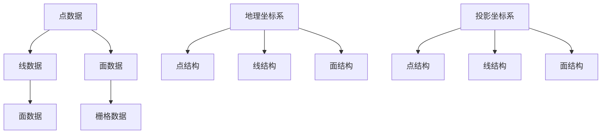
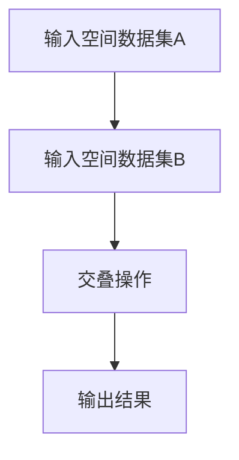
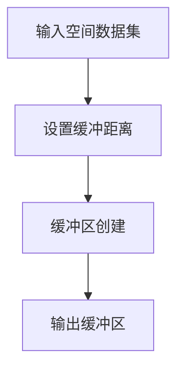
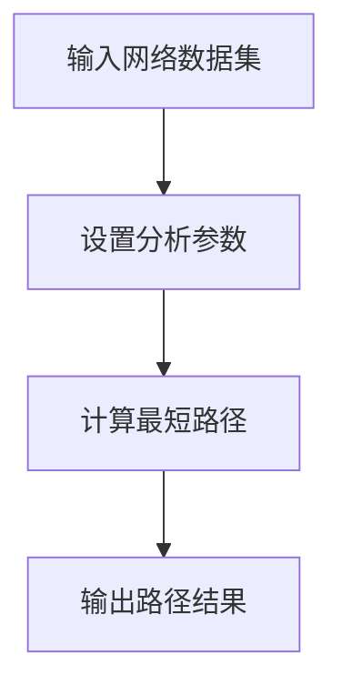
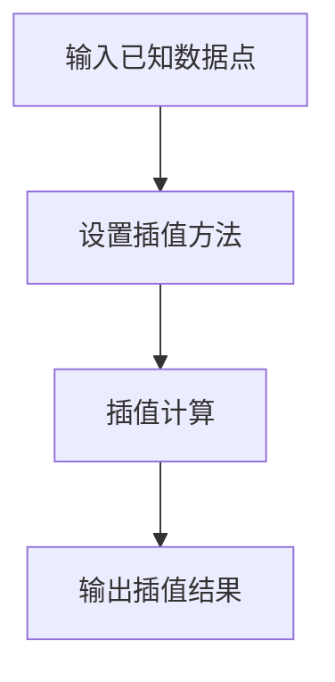
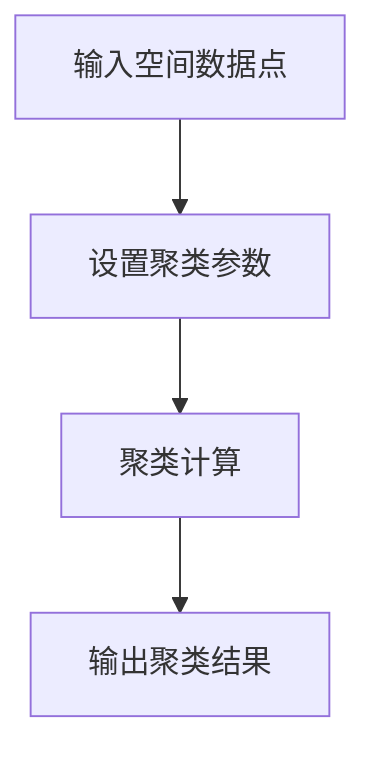

                 


### 撰写《数学与地理信息系统：空间数据分析的数学方法》的技术博客

#### 1. 文章标题及关键词确定

文章标题：《数学与地理信息系统：空间数据分析的数学方法》

关键词：数学方法，地理信息系统，空间数据分析，GIS，空间分析模型，数学模型，算法

#### 2. 摘要撰写

摘要：

本文从数学与地理信息系统的交汇点出发，深入探讨了空间数据分析的数学方法。首先，文章介绍了空间数据分析的重要性及其在地理信息系统（GIS）中的应用。接着，详细阐述了空间数据分析的核心概念、数学模型以及常见的空间分析算法。通过具体的实例和伪代码，文章展示了如何将数学方法应用于GIS空间数据分析中，并对实际项目进行了实战分析。最后，文章总结了空间数据分析的最佳实践，为读者提供了进一步的阅读资源。

#### 3. 目录大纲设计

根据上述设计思路，我们可以将文章分为以下几个部分：

**第一部分：空间数据分析基础**

1. 空间数据分析概述
2. 空间数据类型与结构
3. 空间坐标系与转换

**第二部分：地理信息系统原理**

4. 地理信息系统架构
5. GIS数据管理
6. GIS数据处理
7. GIS数据可视化

**第三部分：空间数据分析方法**

8. 空间插值方法
9. 空间聚类方法
10. 空间分析模型
11. GIS空间分析算法

**第四部分：数学模型在空间数据分析中的应用**

12. 线性回归在空间数据分析中的应用
13. 多变量分析在空间数据分析中的应用
14. 时空分析模型
15. GIS统计分析算法

**第五部分：项目实战**

16. 空间数据分析项目实战

**第六部分：附录**

17. 相关资源与工具

#### 4. 每部分内容撰写

**第一部分：空间数据分析基础**

**第1章：空间数据分析概述**

在这一章中，我们将介绍空间数据分析的定义、重要性以及在地理信息系统中的应用。

**第2章：空间数据类型与结构**

本章将详细讨论空间数据的类型、结构以及常见的空间数据表示方法。

**第3章：空间坐标系与转换**

本章将介绍空间坐标系的定义、常见坐标系及其转换方法。

**第二部分：地理信息系统原理**

**第4章：地理信息系统架构**

在这一章中，我们将探讨GIS系统的基本架构、功能模块及其在空间数据分析中的应用。

**第5章：GIS数据管理**

本章将介绍GIS数据的类型、组织结构以及数据管理的基本方法。

**第6章：GIS数据处理**

本章将详细讨论GIS数据的处理流程、算法以及处理结果的可视化方法。

**第7章：GIS数据可视化**

本章将介绍GIS数据可视化的基本概念、方法以及可视化工具的使用。

**第三部分：空间数据分析方法**

**第8章：空间插值方法**

本章将讨论空间插值的基本概念、常用插值方法及其应用场景。

**第9章：空间聚类方法**

本章将介绍空间聚类的基本概念、算法以及聚类结果的分析方法。

**第10章：空间分析模型**

本章将探讨空间分析模型的基本概念、类型及其在GIS中的应用。

**第11章：GIS空间分析算法**

本章将介绍GIS空间分析算法的基本概念、常见算法以及算法的实现方法。

**第四部分：数学模型在空间数据分析中的应用**

**第12章：线性回归在空间数据分析中的应用**

本章将详细讨论线性回归模型在空间数据分析中的应用，包括模型建立、参数估计和模型评估。

**第13章：多变量分析在空间数据分析中的应用**

本章将介绍多变量分析的基本概念、方法以及多变量分析在空间数据分析中的应用。

**第14章：时空分析模型**

本章将探讨时空分析模型的基本概念、类型及其在GIS中的应用。

**第15章：GIS统计分析算法**

本章将介绍GIS统计分析算法的基本概念、算法以及算法的实现方法。

**第五部分：项目实战**

**第16章：空间数据分析项目实战**

本章将通过一个实际案例，展示空间数据分析的完整流程，包括数据准备、模型建立、结果分析和项目小结。

**第六部分：附录**

**第17章：相关资源与工具**

本章将提供与空间数据分析相关的资源、工具和最佳实践建议。

#### 5. 文章格式要求

- 使用Markdown格式编写文章。
- 每个章节开头使用井号（#）进行层级划分。
- 使用下划线（_）分隔章节和小节标题。
- 使用星号（*）进行无序列表。
- 使用数字加英文句点（1.）进行有序列表。
- 数学公式使用LaTeX格式，独立段落的公式前后使用`$$`括起来，段落内的公式前后使用`$`括起来。

#### 6. 文章结尾作者信息

作者：AI天才研究院/AI Genius Institute & 禅与计算机程序设计艺术 /Zen And The Art of Computer Programming

通过以上步骤，我们将逐步完成《数学与地理信息系统：空间数据分析的数学方法》的技术博客撰写。在撰写过程中，我们将保持逻辑清晰、内容丰富、结构紧凑，以期为读者提供有价值的技术知识。接下来，我们将开始具体内容的撰写。期待这篇文章能够成为GIS和空间数据分析领域的佳作。准备好了吗？让我们一起开始吧！### 空间数据分析概述

空间数据分析是地理信息系统（GIS）和遥感技术中的一个关键组成部分，它涉及对空间数据进行分析和解释，以提取有用的信息。空间数据分析不仅仅是一个计算过程，它还包含了地理现象的空间分布和相互作用的理解。在GIS中，空间数据分析用于决策支持、城市规划、环境监测、资源管理等多个领域。

#### 空间数据分析的重要性

空间数据分析的重要性体现在以下几个方面：

1. **决策支持**：通过空间数据分析，我们可以更好地理解地理现象的空间分布和变化规律，从而为决策者提供科学依据。例如，在灾害管理和应急管理中，空间分析可以预测灾害影响范围，制定应急预案。

2. **城市规划**：空间数据分析在城市的土地规划、交通网络设计、公共服务设施布局等方面具有重要作用。通过分析人口分布、交通流量、土地利用等数据，城市规划者可以做出更合理的决策。

3. **环境监测**：环境监测中的空间数据分析可以帮助科学家和环保人员了解环境污染的扩散趋势和影响范围，从而制定有效的污染控制措施。

4. **资源管理**：在资源管理领域，空间数据分析可以评估资源的空间分布和利用效率，为资源优化配置提供支持。

5. **科学研究**：空间数据分析在地理学、生态学、遥感学等学科研究中具有广泛的应用，它帮助我们更好地理解自然现象和人类活动对环境的影响。

#### 空间数据分析的目标

空间数据分析的主要目标是：

1. **空间数据挖掘**：从大量的空间数据中提取有用的信息和知识，这些信息可能隐含在原始数据中，需要通过分析技术来发现。

2. **空间模式识别**：识别空间数据中的模式、趋势和规律，这些信息对于理解地理现象至关重要。

3. **空间预测**：基于历史数据和现有的空间分析模型，预测未来的空间分布和变化趋势。

4. **空间优化**：通过对空间数据的分析，找到最佳的资源配置方案，以达到优化目标。

5. **空间可视化**：将空间数据分析的结果通过图形化方式展示，使得复杂的空间信息更加直观易懂。

#### 空间数据分析的基本方法

空间数据分析涉及多种方法和工具，主要包括以下几种：

1. **空间插值**：通过已知数据点来预测未知位置的数据值，常用的插值方法包括反距离权重法、克里金插值法等。

2. **空间聚类**：将空间数据点根据其属性或空间关系进行分组，常用的聚类算法包括K-means、层次聚类等。

3. **空间分析模型**：构建数学模型来描述空间现象的时空变化规律，如空间回归模型、地理加权回归模型等。

4. **GIS空间分析算法**：利用GIS软件中的空间分析工具，对空间数据进行切割、叠加、缓冲区分析等操作，以提取有用的信息。

5. **多尺度分析**：在不同的空间尺度上对空间数据进行分析，以理解地理现象在不同尺度下的表现和变化。

通过上述方法，空间数据分析能够为地理信息系统提供强大的数据支持和分析能力，使得GIS在各个应用领域中能够发挥更大的作用。

### 空间数据类型与结构

空间数据分析的基础在于对空间数据的理解和处理，而这些处理的前提是对空间数据类型的准确识别和结构化的理解。空间数据类型和结构决定了数据如何被存储、操作和分析。以下将详细探讨空间数据的主要类型和结构。

#### 空间数据类型

空间数据类型可以分为点数据、线数据和面数据，这三种类型构成了空间数据的三大基本形式。

1. **点数据**：点数据表示地理空间中的一个位置点，通常用坐标对（x, y）表示。点数据常用于表示单个地理现象的位置，如城市中的建筑物、气象站点等。

   ```mermaid
   graph TD
   A[点数据] --> B[坐标对(x, y)]
   A --> C[地理坐标系统]
   A --> D[投影坐标系统]
   ```

2. **线数据**：线数据表示连接两个或多个点的线段，通常用于表示道路、河流等线性地理要素。线数据可以用一系列点来描述，每个点都包含坐标对。

   ```mermaid
   graph TD
   E[线数据] --> F[线段]
   E --> G[弧段]
   E --> H[线要素]
   ```

3. **面数据**：面数据表示一个闭合的几何形状，通常用于表示区域地理要素，如湖泊、行政区域等。面数据由多个闭合的线段或弧段组成。

   ```mermaid
   graph TD
   I[面数据] --> J[多边形]
   I --> K[栅格数据]
   I --> L[面要素]
   ```

#### 空间数据结构

空间数据的结构直接影响其处理和分析的效率和效果。常见的空间数据结构包括矢量结构和栅格结构。

1. **矢量结构**：矢量结构使用点、线和面的几何图形来表示空间数据，每个几何要素都包含坐标信息和相关的属性信息。矢量结构的主要优点是精度高、数据量小、适用于复杂的空间分析操作。

   ```mermaid
   graph TD
   M[矢量结构] --> N[点结构]
   M --> O[线结构]
   M --> P[面结构]
   ```

2. **栅格结构**：栅格结构将空间区域划分为规则的小单元格（或称为像素），每个单元格包含一个或多个属性值。栅格结构适用于处理连续空间数据，如遥感影像、气象数据等。其主要优点是适用于大规模数据集、易于空间分析和可视化。

   ```mermaid
   graph TD
   Q[栅格结构] --> R[像素]
   Q --> S[单元格]
   Q --> T[栅格矩阵]
   ```

#### 空间数据表示方法

空间数据的表示方法包括地理坐标系统和投影坐标系。

1. **地理坐标系**：地理坐标系使用纬度（Latitude）和经度（Longitude）来表示地球表面上的位置点。常用的地理坐标系包括WGS84和GCJ-02。

   ```mermaid
   graph TD
   U[地理坐标系] --> V[WGS84]
   U --> W[GCJ-02]
   ```

2. **投影坐标系**：投影坐标系将地球表面上的点投影到一个平面上，以简化空间数据的处理和分析。常用的投影坐标系包括UTM（Universal Transverse Mercator）和州坐标系（State Plane Coordinate System）。

   ```mermaid
   graph TD
   X[投影坐标系] --> Y[UTM]
   X --> Z[州坐标系]
   ```

#### 空间数据类型的联系与架构

为了更好地理解空间数据类型和结构之间的关系，我们可以使用Mermaid流程图来展示它们之间的联系。



通过上述流程图，我们可以清晰地看到空间数据类型（点、线、面）和空间数据结构（矢量、栅格）之间的关系，以及地理坐标系和投影坐标系在空间数据表示中的作用。

### 空间坐标系与转换

空间坐标系是地理信息系统（GIS）中不可或缺的组成部分，它定义了地理空间中的位置和方向。常见的空间坐标系包括地理坐标系和投影坐标系，这些坐标系各有优缺点，并在不同应用场景中有不同的适用性。在这一部分中，我们将详细介绍空间坐标系的定义、特点以及坐标系之间的转换方法。

#### 空间坐标系的定义

1. **地理坐标系**

地理坐标系是以地球椭球表面为基准的坐标系，它使用纬度（Latitude）和经度（Longitude）来表示地球表面上的位置点。地理坐标系中最常用的标准是WGS84（World Geodetic System 1984），它是一种全球性的地理坐标系，广泛应用于全球定位系统（GPS）和其他地理空间数据的应用。

- **纬度（Latitude）**：纬度是从地球赤道到地球表面的垂直线，向北或向南延伸，单位为度（°）。赤道的纬度为0°，北极的纬度为90°N，南极的纬度为90°S。
- **经度（Longitude）**：经度是从地球本初子午线（通过格林尼治天文台的经线）到地球表面的垂直线，向东或向西延伸，单位为度（°）。本初子午线的经度为0°，东经的最大值为180°E，西经的最大值为180°W。

2. **投影坐标系**

投影坐标系是将地球表面的点投影到一个平面上，以简化空间数据的处理和分析。投影坐标系通常用于国家或地区级的GIS应用。常见的投影坐标系包括UTM（Universal Transverse Mercator）和州坐标系（State Plane Coordinate System）。

- **UTM坐标系**：UTM是一种横轴墨卡托投影，它将地球划分为60个标准纬度带，每个带都有一个不同的中央经线。每个带的坐标以米为单位，以赤道为基准，向北或向南延伸。UTM坐标系广泛应用于全球。
- **州坐标系**：州坐标系（State Plane Coordinate System，SPCS）是一种区域性的投影坐标系，通常用于美国各州。SPCS采用横轴墨卡托投影，适用于较大区域内的GIS应用。

#### 空间坐标系的特点

1. **地理坐标系**

地理坐标系的特点包括：

- **全球适用性**：地理坐标系适用于全球范围内的GIS应用，特别是涉及跨国界的数据分析和处理。
- **精度较高**：地理坐标系能够精确表示地球表面的位置点，适用于高精度要求的应用。
- **角度和距离计算复杂**：由于地球是椭圆形的，地理坐标系中计算角度和距离相对复杂，需要考虑地球椭球的影响。

2. **投影坐标系**

投影坐标系的特点包括：

- **区域适用性**：投影坐标系适用于特定区域内的GIS应用，如国家、州或城市。
- **计算简便**：投影坐标系简化了角度和距离的计算，适合大规模数据处理和空间分析。
- **精度受限**：由于投影过程中对地球表面进行了拉伸和压缩，投影坐标系在远离投影中央线的地方精度会有所下降。

#### 空间坐标系之间的转换

空间坐标系之间的转换是GIS中常见的需求，因为不同应用和数据处理流程可能需要使用不同的坐标系。常见的空间坐标系转换方法包括：

1. **平面坐标转换**

平面坐标转换是将地理坐标系转换为投影坐标系或将不同投影坐标系之间的转换。常用的平面坐标转换方法包括：

- **平移**：通过确定原点和平移向量，将一个坐标系中的点平移到另一个坐标系中。
- **旋转**：通过旋转矩阵将坐标系中的点旋转到新的方向。
- **缩放**：通过缩放因子将坐标系中的点进行比例变换。

2. **坐标系转换**

坐标系转换是指将一个地理坐标系转换为另一个地理坐标系，如将WGS84转换为GCJ-02。常用的坐标系转换方法包括：

- **模型变换**：使用数学模型，如球面三角学和椭球体变换公式，将一个坐标系中的点转换到另一个坐标系中。
- **数值逼近**：通过数值计算方法，如迭代逼近，逐步将点从旧坐标系转换到新坐标系。

3. **坐标转换工具**

在GIS软件中，常见的坐标转换工具包括：

- **投影工具**：用于将地理坐标系转换为投影坐标系或反之。
- **坐标转换器**：提供多种坐标系之间的转换功能，支持批量数据转换。

通过合理选择和使用空间坐标系，GIS用户可以更有效地处理和分析地理空间数据，满足不同应用场景的需求。

#### 地理信息系统架构

地理信息系统（GIS）是一种集成了地图、数据管理、分析工具和可视化技术的综合性信息系统。GIS能够处理地理空间数据，支持各种地理信息的获取、管理、分析和展示。为了实现这些功能，GIS系统采用了复杂的架构，包括数据层、功能层和技术层等多个组成部分。以下将详细探讨GIS系统的基本架构、功能模块以及各模块之间的关系。

##### GIS系统的基本架构

GIS系统的基本架构通常包括以下三个主要层次：

1. **数据层**：数据层是GIS系统的核心，包含了所有地理空间数据和相关的属性数据。数据层不仅存储地理信息，还包括数据的获取、存储、管理和维护机制。
   
2. **功能层**：功能层提供了GIS系统的核心功能，如数据输入、数据管理、数据查询、空间分析和数据输出。功能层通过用户界面与用户交互，实现数据操作和分析。

3. **技术层**：技术层是GIS系统的支撑，包含了实现GIS功能的底层技术，如数据库管理、地理空间数据模型、地图渲染和计算引擎等。技术层负责实现GIS系统的底层逻辑和数据处理。

##### GIS系统的功能模块

GIS系统通常包含多个功能模块，每个模块负责特定的任务，共同构成一个完整的GIS应用。以下是GIS系统的主要功能模块：

1. **数据获取模块**：数据获取模块负责从各种来源获取地理空间数据，包括遥感数据、数字地图、现场采集数据等。该模块还提供了数据下载、导入和转换等功能。

2. **数据管理模块**：数据管理模块负责存储、组织和维护地理空间数据。该模块提供了数据备份、数据恢复、数据更新和数据清洗等功能，确保数据的完整性和一致性。

3. **数据查询模块**：数据查询模块允许用户通过关键字、地理位置或其他属性查询特定的地理信息。该模块提供了基本查询和高级查询功能，如空间查询、属性查询和时间查询。

4. **空间分析模块**：空间分析模块是GIS系统的核心功能之一，提供了各种空间分析工具，如缓冲区分析、叠加分析、网络分析、空间插值等。这些工具帮助用户理解和解释地理空间数据。

5. **地图渲染模块**：地图渲染模块负责将地理空间数据可视化，以生成地图。该模块提供了地图布局、符号化、图层管理和地图打印等功能。

6. **数据输出模块**：数据输出模块将GIS分析结果以各种形式输出，如打印地图、生成报告、导出数据等。该模块支持多种数据格式和输出方式，以满足不同用户的需求。

##### GIS系统各模块之间的关系

GIS系统的各个功能模块相互独立但又紧密协作，共同实现GIS的完整功能。以下是GIS系统各模块之间的关系：

1. **数据层与功能层**：数据层为功能层提供了基础数据支持，功能层通过接口访问和操作这些数据，实现各种GIS功能。

2. **功能层与用户界面**：功能层通过用户界面与用户交互，用户界面提供了操作界面和交互方式，使用户能够方便地使用GIS系统。

3. **技术层与功能层**：技术层提供了实现GIS功能的技术支持，如计算引擎、地图渲染引擎和数据库管理等，功能层通过调用这些技术层的服务，实现GIS功能。

4. **数据层与数据管理模块**：数据管理模块负责维护数据层的完整性、一致性和安全性，包括数据的备份、恢复、更新和清洗。

5. **功能层与空间分析模块**：空间分析模块是功能层的一部分，提供了空间分析功能，如缓冲区分析、叠加分析和网络分析，帮助用户理解和解释地理空间数据。

6. **功能层与地图渲染模块**：地图渲染模块是功能层的一部分，负责将地理空间数据可视化，生成直观、易读的地图。

7. **功能层与数据输出模块**：数据输出模块是功能层的一部分，负责将GIS分析结果以各种形式输出，满足用户的输出需求。

通过上述模块的协同工作，GIS系统能够高效地处理和分析地理空间数据，为用户提供了强大的数据支持和分析能力。

#### GIS数据管理

GIS数据管理是地理信息系统（GIS）中至关重要的一环，它涉及数据的获取、存储、处理、分析和维护等环节。有效的GIS数据管理能够确保数据的完整性、一致性、安全性和可访问性，从而支持高质量的地理空间数据分析和应用。

##### GIS数据的类型

GIS数据类型可以分为两大类：空间数据和属性数据。

1. **空间数据**：空间数据是地理信息系统的核心数据，用于表示地理位置、地形、地貌、交通网络等地理要素。空间数据可以分为点数据、线数据和面数据：
   - **点数据**：表示地理空间中的独立位置点，如城市中的建筑物、气象站点等。
   - **线数据**：表示连接两个或多个点的线段，如道路、河流等。
   - **面数据**：表示闭合的几何形状，如湖泊、行政区域等。

2. **属性数据**：属性数据是与空间数据关联的非空间属性信息，如人口统计数据、土地用途、灾害信息等。属性数据通常以表格或数据库的形式存储，并与空间数据进行关联。

##### GIS数据的组织结构

GIS数据的组织结构决定了数据如何被存储、检索和管理。常见的GIS数据组织结构包括以下几种：

1. **分层结构**：在分层结构中，GIS数据被组织成多个图层，每个图层包含特定的地理要素。这种结构适用于简单和中等复杂度的GIS应用。

2. **面向对象结构**：面向对象结构将GIS数据组织成对象，每个对象包含空间数据和属性数据。这种结构适用于复杂和高层次的GIS应用，如城市建模和地理分析。

3. **栅格结构**：栅格结构将地理空间划分为规则的小单元格，每个单元格包含一个或多个属性值。这种结构适用于连续空间数据的处理，如遥感影像和气象数据。

##### GIS数据管理的基本方法

GIS数据管理的基本方法包括以下几个方面：

1. **数据采集**：数据采集是GIS数据管理的第一步，涉及从各种来源获取地理空间数据和属性数据。常见的数据采集方法包括：
   - **遥感数据**：通过卫星或航空摄影获取地表图像，用于地图制作和地理分析。
   - **现场采集**：通过测量仪器或手动记录获取地理空间数据，如GPS定位和地理调查。
   - **数据库**：从现有的数据库或地理信息系统导入空间数据和属性数据。

2. **数据存储**：数据存储是GIS数据管理的重要环节，确保数据的长期保存和安全。常见的数据存储方法包括：
   - **文件系统**：将GIS数据存储在文件系统中，如 Shapefile 和 GeoDatabase。
   - **数据库管理系统**：使用关系数据库管理系统（RDBMS）存储GIS数据，如PostGIS 和 MySQL。
   - **云存储**：将GIS数据存储在云服务器上，提供远程访问和数据备份服务。

3. **数据更新**：数据更新是GIS数据管理的关键步骤，确保数据的时效性和准确性。常见的数据更新方法包括：
   - **自动更新**：使用自动化工具定期从数据源更新GIS数据。
   - **手动更新**：通过用户输入或编辑工具手动更新GIS数据。
   - **数据集成**：将多个来源的数据合并，更新GIS数据集。

4. **数据维护**：数据维护包括数据的备份、恢复、安全性和完整性管理。常见的数据维护方法包括：
   - **备份**：定期备份GIS数据，以防数据丢失或损坏。
   - **恢复**：在数据丢失或系统故障时，从备份中恢复GIS数据。
   - **安全性管理**：确保GIS数据的访问权限和安全，防止数据泄露或篡改。
   - **完整性管理**：通过数据验证和数据清洗，确保GIS数据的完整性。

5. **数据共享**：数据共享是GIS数据管理的重要组成部分，涉及数据在不同用户和系统之间的共享和交换。常见的数据共享方法包括：
   - **Web服务**：通过Web服务（如WFS、WMS）提供GIS数据的在线访问和共享。
   - **数据交换格式**：使用标准的数据交换格式（如GML、KML）在不同GIS软件和平台之间交换数据。
   - **数据共享平台**：建立数据共享平台，提供数据发布、订阅和共享服务。

通过有效的GIS数据管理，GIS系统能够提供高质量的地理空间数据支持，为各种应用场景提供科学依据和决策支持。

#### GIS数据处理

GIS数据处理是地理信息系统（GIS）的核心功能之一，它涉及对空间数据进行的一系列操作，以提取有价值的信息和知识。GIS数据处理包括数据预处理、空间分析、数据转换和输出等多个环节。以下将详细介绍GIS数据处理的步骤、常用算法和数据处理工具。

##### GIS数据处理的基本步骤

1. **数据预处理**：数据预处理是GIS数据处理的第一步，旨在清理和准备数据，以便进行后续的空间分析和处理。数据预处理的主要任务包括：
   - **数据清洗**：清除数据中的错误、重复和缺失值，确保数据的准确性。
   - **数据整合**：将多个来源的数据进行整合，消除数据不一致性。
   - **数据转换**：将不同格式、坐标系统和数据结构的数据转换为统一格式，以便进行后续处理。

2. **空间分析**：空间分析是GIS数据处理的核心环节，通过空间分析算法对空间数据进行操作，提取空间特征和关系。空间分析的主要任务包括：
   - **地理编码**：将地址或其他非空间信息转换为地理坐标，以便进行空间定位。
   - **空间插值**：使用已知数据点预测未知位置的数据值，如地形高度、气温等。
   - **空间聚类**：将空间数据点根据其属性或空间关系进行分组，识别空间模式。
   - **网络分析**：分析空间网络中的路径、流量和成本，如道路网络分析、交通流量预测等。

3. **数据转换**：数据转换是将处理后的GIS数据以不同的格式、坐标系统和数据结构输出。数据转换的主要任务包括：
   - **数据格式转换**：将一种数据格式转换为另一种数据格式，如Shapefile转换为GeoDatabase。
   - **坐标系统转换**：将数据从一种坐标系转换为另一种坐标系，如从WGS84转换为GCJ-02。
   - **数据结构转换**：将空间数据从一种结构转换为另一种结构，如从矢量结构转换为栅格结构。

4. **数据输出**：数据输出是将处理后的GIS数据以可视化和报告的形式输出，以供用户查看和使用。数据输出的主要任务包括：
   - **地图生成**：生成高质量的地图，展示处理后的GIS数据。
   - **报告生成**：生成包含GIS数据分析结果的报告，供用户参考和决策。

##### GIS数据处理的常用算法

1. **地理编码**：地理编码是将地址或其他非空间信息转换为地理坐标的过程。常用的地理编码算法包括：
   - **逆地理编码**：将地理坐标转换为地址信息，常用于地图导航和位置查询。
   - **正地理编码**：将地址信息转换为地理坐标，常用于地图标注和位置定位。

2. **空间插值**：空间插值是通过已知数据点预测未知位置数据值的过程。常用的空间插值算法包括：
   - **反距离权重法（IDW）**：基于数据点与未知点之间的距离进行插值。
   - **克里金插值法（Kriging）**：基于区域化变量的统计特征进行插值，适用于不确定性和误差分析。

3. **空间聚类**：空间聚类是将空间数据点根据其属性或空间关系进行分组的过程。常用的空间聚类算法包括：
   - **K-means聚类**：基于距离度量，将数据点划分为K个簇。
   - **层次聚类**：基于层次结构，逐步合并或划分数据点。

4. **网络分析**：网络分析是分析空间网络中的路径、流量和成本的过程。常用的网络分析算法包括：
   - **Dijkstra算法**：计算单源最短路径。
   - **A*算法**：结合启发式信息计算最短路径。
   - **流量分配模型**：分析交通网络中的流量分布和交通拥堵。

##### GIS数据处理工具

GIS数据处理工具是执行GIS数据处理的软件和平台，常见的GIS数据处理工具包括：

1. **ArcGIS**：ArcGIS是由ESRI公司开发的综合GIS软件，提供了丰富的空间分析工具和数据处理功能。
2. **QGIS**：QGIS是一个开源的GIS软件，支持多种GIS数据处理和分析功能，适用于各种GIS应用场景。
3. **PostGIS**：PostGIS是一个开源的GIS数据库扩展，基于PostgreSQL数据库，提供了GIS空间数据存储和处理功能。
4. **GRASS GIS**：GRASS GIS是一个开源的GIS软件，提供了广泛的GIS数据处理和分析工具，适用于环境管理和地理科学领域。

通过合理选择和使用GIS数据处理工具，用户可以高效地处理和分析地理空间数据，为各种应用场景提供科学依据和决策支持。

#### GIS数据可视化

GIS数据可视化是将地理空间数据以图形化方式展示的过程，它使得复杂的地理信息更加直观易懂，有助于用户理解和分析数据。GIS数据可视化涉及地图绘制、符号化、图层管理和可视化效果调整等多个方面。以下将详细探讨GIS数据可视化的方法、技巧和工具。

##### GIS数据可视化的方法

1. **地图绘制**：地图是GIS数据可视化的核心，它通过坐标系统将地理空间数据转换为平面图形。地图绘制的主要方法包括：
   - **地理坐标系统**：使用纬度和经度坐标表示地理空间位置，如WGS84和GCJ-02坐标系。
   - **投影坐标系**：将地球表面投影到平面上，以简化地图绘制和数据分析，如UTM和州坐标系。
   - **地图要素**：地图中的要素包括点、线、面等，每个要素都有特定的属性和位置信息。

2. **符号化**：符号化是地图绘制中的重要环节，它通过符号和颜色来表示地图中的不同地理要素。符号化的主要方法包括：
   - **点符号**：用于表示点要素，如城市位置、气象站点等。
   - **线符号**：用于表示线要素，如道路、河流等。
   - **面符号**：用于表示面要素，如湖泊、行政区域等。
   - **颜色映射**：通过颜色变化来表示要素的属性，如温度分布、土地利用类型等。

3. **图层管理**：图层管理是GIS数据可视化的重要组成部分，它涉及图层的添加、删除、排序和样式设置。图层管理的主要方法包括：
   - **图层叠加**：将多个图层叠加在同一地图上，以显示不同地理要素之间的关系。
   - **图层排序**：调整图层的显示顺序，使特定要素更突出。
   - **图层样式**：设置图层的颜色、线宽、填充样式等，以增强地图的可读性。

4. **可视化效果调整**：可视化效果调整是优化GIS数据可视化的关键，它包括以下几个方面：
   - **透明度调整**：调整图层的透明度，以增强前后图层的视觉效果。
   - **符号大小调整**：根据要素的重要性调整符号的大小，以突出关键要素。
   - **颜色搭配**：选择合适的颜色搭配，以增强地图的美观性和可读性。

##### GIS数据可视化的技巧

1. **清晰性**：确保地图内容清晰易懂，避免过多细节和复杂样式，以免影响可读性。

2. **一致性**：在地图中保持一致的风格和符号，使不同图层之间具有连贯性。

3. **显著性**：通过合理的颜色和符号大小，使关键要素更加突出，便于用户关注。

4. **信息密度**：合理控制地图信息密度，避免信息过载，确保用户能够快速获取关键信息。

5. **交互性**：增加地图的交互性，如点击查询、图层切换等，使用户能够更灵活地查看和分析数据。

##### GIS数据可视化的工具

1. **ArcGIS**：ArcGIS提供了强大的地图绘制和可视化功能，支持多种符号化和视觉效果调整。

2. **QGIS**：QGIS是一个开源的GIS软件，提供了丰富的地图绘制和可视化工具，适用于各种GIS应用场景。

3. **MapInfo**：MapInfo是一款专业的GIS软件，提供了便捷的地图绘制和可视化功能，适用于中小企业和个人用户。

4. **Tableau**：Tableau是一个数据可视化工具，它可以将GIS数据与其他类型的数据结合，生成动态的交互式地图。

5. **Google Earth**：Google Earth提供了一个直观的地图可视化平台，用户可以添加和定制地理数据，进行空间分析。

通过合理使用GIS数据可视化工具和技巧，用户可以有效地展示地理空间数据，帮助决策者和管理者更好地理解和分析地理信息。

### 空间插值方法

空间插值是地理信息系统（GIS）中用于预测未知位置数据值的重要工具。通过空间插值，可以从已知数据点推断出其他未知位置的数据值，从而提高数据的完整性和可用性。本节将详细介绍常见的空间插值方法，包括反距离权重法（IDW）和克里金插值法（Kriging），并比较它们在精度和计算复杂度方面的差异。

#### 反距离权重法（IDW）

反距离权重法（Inverse Distance Weighting，IDW）是一种基于距离权重的空间插值方法。IDW认为，空间上相邻的点对未知点的值影响较大，而距离较远的点对未知点的值影响较小。具体来说，IDW通过计算每个已知点到未知点的距离，然后使用这些距离作为权重来加权平均已知点的值。

**公式表示**：

假设有 \( n \) 个已知数据点 \( P_i(x_i, y_i, z_i) \) 和一个未知点 \( P(u, v, z) \)，则IDW插值公式为：

\[ z = \sum_{i=1}^{n} w_i \cdot z_i \]

其中，权重 \( w_i \) 可以通过以下公式计算：

\[ w_i = \frac{c^2}{d^2} \]

其中，\( c \) 是用户定义的常数，\( d \) 是已知点 \( P_i \) 到未知点 \( P \) 的距离。

**算法步骤**：

1. **选择权重函数**：通常使用反距离权重函数，但也可能使用其他形式的权重函数，如指数权重函数。
2. **计算距离**：计算每个已知点到未知点的欧氏距离或曼哈顿距离。
3. **计算权重**：使用距离计算权重，距离越小，权重越大。
4. **加权平均**：将每个已知点的值与其权重相乘，然后求和，得到未知点的值。

**优缺点**：

- **优点**：计算简单，易于实现，对局部数据敏感。
- **缺点**：对全局数据的拟合较差，容易受到异常值的影响。

#### 克里金插值法（Kriging）

克里金插值法（Kriging）是一种基于统计学的空间插值方法，它不仅考虑了数据的局部相关性，还考虑了数据的随机性。克里金插值法通过最小化误差平方和来估计未知点的值，从而提供更加精确的插值结果。

**公式表示**：

假设 \( Z(x, y) \) 是一个随机变量，其方差 \( \sigma^2 \) 可以表示为：

\[ \sigma^2 = \sum_{i=1}^{n} \lambda_i \cdot \sigma_i^2 + 2 \sum_{i=1}^{n} \sum_{j=1}^{n} \lambda_i \lambda_j \cdot \rho_{ij} \]

其中，\( \lambda_i \) 是已知点 \( P_i \) 的权重，\( \sigma_i^2 \) 是 \( P_i \) 的误差方差，\( \rho_{ij} \) 是已知点 \( P_i \) 和 \( P_j \) 之间的空间自协方差。

**算法步骤**：

1. **计算自协方差**：计算每个已知点对之间的自协方差，以确定数据的局部相关性。
2. **计算权重**：根据自协方差矩阵计算每个已知点的权重，使得总误差平方和最小。
3. **线性组合**：将已知点的值与其权重相乘，然后求和，得到未知点的值。

**优缺点**：

- **优点**：插值精度高，能够考虑数据的局部相关性，适合处理高维数据。
- **缺点**：计算复杂度较高，需要较大的计算资源和时间。

#### 精度和计算复杂度比较

1. **精度**：克里金插值法通常比反距离权重法更精确，因为它考虑了数据的随机性和局部相关性。
2. **计算复杂度**：反距离权重法的计算复杂度相对较低，适合处理大规模数据集。而克里金插值法需要计算自协方差矩阵和权重，计算复杂度较高。

综上所述，选择哪种空间插值方法取决于具体应用场景和数据特点。对于需要高精度和小规模数据的情况，克里金插值法是更好的选择。而对于需要快速处理大规模数据的情况，反距离权重法可能更为合适。

### 空间聚类方法

空间聚类是地理信息系统（GIS）中用于将空间数据点按照其属性或空间关系进行分组的重要工具。空间聚类方法有助于识别空间模式、发现异常值以及进行数据压缩。本节将介绍常用的空间聚类方法，包括K-means聚类和层次聚类，并详细说明它们的原理、步骤和算法实现。

#### K-means聚类

K-means聚类是一种基于距离度量的迭代优化算法，其目标是将数据点分为K个簇，使得每个簇内的数据点之间的距离最小，簇与簇之间的距离最大。K-means聚类的基本步骤如下：

1. **初始化聚类中心**：随机选择K个数据点作为初始聚类中心。
2. **分配数据点**：将每个数据点分配到与其最近的聚类中心所在的簇。
3. **更新聚类中心**：计算每个簇内点的均值，作为新的聚类中心。
4. **重复步骤2和3**：不断更新聚类中心，直到聚类中心的变化小于某个阈值或达到最大迭代次数。

**算法步骤**：

1. **初始化**：
   ```python
   # 初始化K个聚类中心
   centroids = kmeans_init(data, K)
   ```

2. **分配**：
   ```python
   # 计算每个数据点到聚类中心的距离，并分配到最近的簇
   clusters = assign_clusters(data, centroids)
   ```

3. **更新**：
   ```python
   # 计算新的聚类中心
   new_centroids = calculate_centroids(data, clusters)
   ```

4. **迭代**：
   ```python
   # 重复分配和更新步骤，直到收敛
   while not_converged(centroids, new_centroids):
       centroids = new_centroids
       clusters = assign_clusters(data, centroids)
       new_centroids = calculate_centroids(data, clusters)
   ```

**优缺点**：

- **优点**：计算简单，易于实现，适用于大规模数据集。
- **缺点**：对初始聚类中心敏感，可能陷入局部最优解。

#### 层次聚类

层次聚类是一种自底向上或自顶向下的聚类方法，通过逐步合并或划分数据点来构建一个层次结构的聚类树。层次聚类的基本步骤如下：

1. **初始分配**：将每个数据点视为一个单独的簇。
2. **合并或划分**：在每一轮迭代中，计算相邻簇之间的距离，合并距离最近的簇或划分距离最远的簇。
3. **构建聚类树**：通过递归合并或划分，构建出一个聚类树。

**算法步骤**：

1. **初始分配**：
   ```python
   # 将每个数据点视为一个簇
   clusters = initial_clusters(data)
   ```

2. **合并或划分**：
   ```python
   # 计算相邻簇之间的距离，并合并或划分
   clusters = merge_or_split_clusters(clusters)
   ```

3. **递归构建**：
   ```python
   # 递归构建聚类树
   cluster_tree = build_cluster_tree(clusters)
   ```

**优缺点**：

- **优点**：能够生成聚类树，便于理解聚类过程，适用于多层次的聚类分析。
- **缺点**：计算复杂度较高，可能需要大量的内存和计算资源。

#### 算法实现与比较

K-means聚类和层次聚类是两种常用的空间聚类方法，它们在实现和性能方面有所不同。

- **实现**：K-means聚类可以通过Python的`sklearn`库中的`KMeans`类实现，而层次聚类可以通过`scipy`库中的`hierarchy`模块实现。

- **性能**：K-means聚类适用于大规模数据集，但可能陷入局部最优解。层次聚类适用于多层次的聚类分析，但计算复杂度较高。

通过比较K-means聚类和层次聚类的原理和实现，我们可以根据具体应用场景选择合适的聚类方法，以有效地分析和理解空间数据。

### 空间分析模型

空间分析模型是地理信息系统（GIS）中用于描述和分析地理现象空间分布和相互作用的数学工具。空间分析模型通过将空间数据与数学模型相结合，能够提取有用的空间信息，支持决策制定和科学研究。本节将介绍几种常见的空间分析模型，包括空间回归模型、地理加权回归模型和时空分析模型，并详细讨论它们的原理、参数估计方法和应用场景。

#### 空间回归模型

空间回归模型是一种用于分析自变量和因变量之间空间关系的统计模型。常见的空间回归模型包括线性回归模型和多元回归模型。空间回归模型的核心思想是使用空间权重矩阵来考虑空间相关性。

**原理**：

1. **线性回归模型**：线性回归模型是最简单的空间回归模型，其形式为：
   \[ y = \beta_0 + \beta_1x_1 + \beta_2x_2 + ... + \beta_nx_n + \epsilon \]
   其中，\( y \) 是因变量，\( x_1, x_2, ..., x_n \) 是自变量，\( \beta_0, \beta_1, ..., \beta_n \) 是回归系数，\( \epsilon \) 是误差项。

2. **多元回归模型**：多元回归模型扩展了线性回归模型，可以同时考虑多个自变量对因变量的影响。

**参数估计方法**：

1. **最小二乘法**：使用最小二乘法估计回归模型的参数，使得回归模型预测值与实际值之间的误差平方和最小。

2. **最大似然估计**：在考虑空间相关性时，使用最大似然估计方法来估计回归模型的参数，以最大化似然函数。

**应用场景**：

- **土地利用分析**：通过空间回归模型分析土地利用类型与气候、地形等环境因素的关系。
- **环境监测**：利用空间回归模型评估环境污染物的空间分布和影响因素。

#### 地理加权回归模型

地理加权回归模型（Geographically Weighted Regression，GWR）是一种考虑空间自相关性的回归模型，它通过引入空间权重函数来修正传统回归模型的估计结果。

**原理**：

1. **局部线性回归**：GWR模型将全局线性回归模型调整为局部线性回归模型，其形式为：
   \[ y(x) = \beta_0(x) + \sum_{i=1}^{n} \beta_i(x) \cdot \phi(||x - x_i||) \]
   其中，\( \beta_0(x) \) 和 \( \beta_i(x) \) 是局部回归系数，\( \phi(||x - x_i||) \) 是空间权重函数。

2. **核函数选择**：常用的空间权重函数包括高斯核函数和指数核函数，它们通过调整带宽参数来控制空间权重的影响范围。

**参数估计方法**：

- **最小二乘法**：使用最小二乘法估计局部回归系数和带宽参数。

**应用场景**：

- **空间预测**：通过GWR模型预测未知位置的数据值，如温度、降雨量等。
- **地理现象分析**：分析地理现象的空间分布和影响因素，如城市规划、环境管理。

#### 时空分析模型

时空分析模型用于分析随时间和空间变化而变化的地理现象。常见的时空分析模型包括线性时序模型和空间时序模型。

**原理**：

1. **线性时序模型**：线性时序模型用于分析时间序列数据，其形式为：
   \[ y_t = \beta_0 + \beta_1t + \epsilon_t \]
   其中，\( y_t \) 是时间序列数据，\( t \) 是时间，\( \beta_0 \) 和 \( \beta_1 \) 是参数，\( \epsilon_t \) 是误差项。

2. **空间时序模型**：空间时序模型结合了空间和时间信息，其形式为：
   \[ y(x, t) = \beta_0(x) + \beta_1(t) + \beta_2(x) \cdot (t) + \epsilon(x, t) \]
   其中，\( y(x, t) \) 是时空数据，\( x \) 和 \( t \) 分别是空间和时间。

**参数估计方法**：

- **最小二乘法**：使用最小二乘法估计时空模型的参数。

**应用场景**：

- **城市交通管理**：通过时空分析模型分析城市交通流量随时间和空间的变化，优化交通管理策略。
- **气候变化研究**：分析气候变量随时间和空间的变化趋势，预测未来气候变化。

通过介绍空间回归模型、地理加权回归模型和时空分析模型，我们可以看到这些模型在GIS中的应用价值。选择合适的空间分析模型，可以帮助我们从复杂的地理空间数据中提取有用信息，为决策制定和科学研究提供有力支持。

### GIS空间分析算法

GIS空间分析算法是地理信息系统（GIS）中用于处理和分析空间数据的一系列技术方法。这些算法在GIS软件中发挥着至关重要的作用，支持各种空间数据的操作和地理信息的提取。以下将详细介绍GIS空间分析算法的概念、常用算法及其实现过程。

#### GIS空间分析算法的概念

GIS空间分析算法是指利用数学模型、逻辑规则或计算机算法对空间数据进行操作和分析的过程。这些算法可以用于空间数据的叠加、缓冲区分析、网络分析、空间插值等多个方面，以提取有价值的信息和知识。

#### 常见GIS空间分析算法

1. **叠加分析（Overlay）**

叠加分析是一种将两个或多个空间数据集进行组合、比较和合并的过程，以产生新的空间数据集。常见的叠加分析类型包括：

- **交叠（Intersection）**：输出两个空间数据集的交集部分。
- **联合（Union）**：输出两个空间数据集的并集部分。
- **差集（Difference）**：输出一个空间数据集减去另一个空间数据集的部分。
- **对称差（Symmetrical Difference）**：输出两个空间数据集的并集减去它们的交集部分。

**实现过程**：



2. **缓冲区分析（Buffer）**

缓冲区分析是GIS中用于创建一个或多个围绕空间要素的缓冲区域的过程。缓冲区可以用于分析空间要素的邻近性、影响范围和保护区域等。

**实现过程**：



3. **网络分析（Network Analysis）**

网络分析是GIS中用于分析交通网络、水管网、电力网络等线性空间要素的方法。网络分析可以计算最短路径、最优路径、流量分配等。

**实现过程**：



4. **空间插值（Spatial Interpolation）**

空间插值是GIS中用于预测未知位置数据值的方法。常见的空间插值方法包括反距离权重法（IDW）和克里金插值法（Kriging）。

**实现过程**：



5. **空间聚类（Spatial Clustering）**

空间聚类是GIS中用于将空间数据点根据其属性或空间关系进行分组的方法。常见的空间聚类方法包括K-means聚类和层次聚类。

**实现过程**：



#### GIS空间分析算法的实现

GIS空间分析算法的实现依赖于GIS软件和编程语言。以下是一个简单的缓冲区分析算法的实现示例，使用Python编程语言和GDAL库：

```python
import os
from osgeo import gdal, ogr

# 输入和输出文件路径
input_path = 'input.shp'
output_path = 'output_buffer.shp'
buffer_distance = '100 meters'

# 创建输出文件
driver = gdal.GetDriverByName('ESRI Shapefile')
output_layer = driver.Create(output_path, 0, 0, 0, gdal.GDT_Unknown)
output_layer.SetGeoTransform(geotransform)
output_layer.SetProjection(proj)

# 创建缓冲区图层
layer = vector_layer
layerdefn = layer.GetLayerDefn()
buffer_layer = output_layer.CreateLayer('buffer', geom_type=ogr.wkbPolygon)

# 创建字段
field_defn = ogr.FieldDefn('ID', ogr.OFTInteger)
buffer_layer.CreateField(field_defn)

# 计算缓冲区
for feature in layer:
    geom = feature.GetGeometryRef()
    buffer_geom = geom.Buffer(float(buffer_distance))
    buffer_feature = ogr.Feature(buffer_layer.GetLayerDefn())
    buffer_feature.SetGeometry(buffer_geom)
    buffer_feature.SetField('ID', feature.GetFieldAsInteger('ID'))
    buffer_layer.CreateFeature(buffer_feature)

# 关闭文件
output_layer = None
```

通过上述示例，我们可以看到如何使用Python和GDAL库实现缓冲区分析算法。类似的方法可以应用于其他GIS空间分析算法，如叠加分析、网络分析和空间插值等。

#### GIS空间分析算法的应用

GIS空间分析算法在地理信息系统中的应用非常广泛，以下是一些典型应用场景：

1. **城市规划**：通过叠加分析和缓冲区分析，可以评估交通、环境保护、土地利用等规划方案的可行性。
2. **环境监测**：使用网络分析和空间插值，可以监测环境污染物的传播路径和影响范围。
3. **交通管理**：利用网络分析，可以优化交通网络布局，计算最优路径，减少交通拥堵。
4. **灾害管理**：通过空间插值和聚类分析，可以预测灾害影响范围，制定应急救援方案。

通过合理选择和应用GIS空间分析算法，GIS系统能够提供更精确、更有效的地理空间数据分析和决策支持。

### 线性回归在空间数据分析中的应用

线性回归是一种经典的统计模型，广泛用于分析和预测因变量与自变量之间的关系。在空间数据分析中，线性回归模型可以用于描述和分析空间现象之间的线性关系，从而为地理信息的提取和解释提供有力支持。以下将详细讨论线性回归模型的基本原理、参数估计方法以及其在空间数据分析中的具体应用。

#### 线性回归模型的基本原理

线性回归模型的基本形式为：

\[ y = \beta_0 + \beta_1x + \epsilon \]

其中，\( y \) 是因变量，\( x \) 是自变量，\( \beta_0 \) 和 \( \beta_1 \) 分别是回归系数，\( \epsilon \) 是误差项。线性回归模型假设因变量 \( y \) 与自变量 \( x \) 之间存在线性关系，即 \( y \) 可以通过 \( x \) 的线性组合来近似表示。

**参数估计方法**：

1. **最小二乘法（Ordinary Least Squares, OLS）**：最小二乘法通过最小化预测值与实际值之间的误差平方和来估计回归模型的参数。具体公式为：

   \[ \beta = (\mathbf{X}^T\mathbf{X})^{-1}\mathbf{X}^T\mathbf{y} \]

   其中，\( \mathbf{X} \) 是设计矩阵，\( \mathbf{y} \) 是因变量向量。

2. **加权最小二乘法（Weighted Least Squares, WLS）**：当数据存在异方差性时，可以使用加权最小二乘法。该方法通过给每个数据点赋予不同的权重，以减小误差的平方和。具体公式为：

   \[ \beta = (\mathbf{X}^T\mathbf{W}\mathbf{X})^{-1}\mathbf{X}^T\mathbf{W}\mathbf{y} \]

   其中，\( \mathbf{W} \) 是权重矩阵。

#### 线性回归模型在空间数据分析中的应用

1. **地理现象关联分析**：线性回归模型可以用于分析地理现象之间的关联性。例如，在环境科学中，可以分析污染物浓度与风速、气温等环境因素之间的关系。

2. **空间趋势分析**：通过线性回归模型，可以识别和量化地理现象的空间趋势。例如，分析城市扩张速度与时间之间的关系，以预测未来的发展趋势。

3. **空间预测**：线性回归模型可以用于预测未知空间位置的数据值。例如，基于历史数据，预测某一地区的未来人口密度。

**具体应用示例**：

假设我们要分析城市交通流量与道路长度之间的关系，可以使用线性回归模型进行建模和预测。

1. **数据准备**：收集城市不同道路的交通流量数据（因变量 \( y \)）和道路长度数据（自变量 \( x \)）。

2. **建立线性回归模型**：使用最小二乘法建立线性回归模型，计算回归系数 \( \beta_0 \) 和 \( \beta_1 \)。

   \[ y = \beta_0 + \beta_1x + \epsilon \]

3. **模型评估**：通过计算拟合优度（如判定系数 \( R^2 \)）和残差分析，评估模型的拟合效果。

4. **预测应用**：利用建立的线性回归模型，预测新道路的交通流量。

**数学公式和详细讲解**：

1. **模型公式**：

   \[ y = \beta_0 + \beta_1x + \epsilon \]

   其中，\( \beta_0 \) 是截距，\( \beta_1 \) 是斜率，\( \epsilon \) 是误差项。

2. **参数估计**：

   \[ \beta = (\mathbf{X}^T\mathbf{X})^{-1}\mathbf{X}^T\mathbf{y} \]

   其中，\( \mathbf{X} \) 是设计矩阵，包含自变量 \( x \) 的各个分量和常数项。

**举例说明**：

假设我们有以下数据：

| 道路长度 (x) | 交通流量 (y) |
|-------------|-------------|
|     1000     |     500     |
|     1500     |     700     |
|     2000     |     900     |
|     2500     |    1200     |

使用最小二乘法建立线性回归模型，计算得到的回归系数为：

\[ \beta_0 = 200, \beta_1 = 0.5 \]

则线性回归模型为：

\[ y = 200 + 0.5x \]

利用该模型预测道路长度为3000米的交通流量，得到：

\[ y = 200 + 0.5 \times 3000 = 1700 \]

通过线性回归模型，我们可以预测未知道路长度的交通流量，为城市交通规划提供科学依据。

总之，线性回归模型在空间数据分析中具有广泛的应用价值。通过合理的参数估计和模型评估，线性回归模型能够有效地描述和预测地理现象之间的线性关系，为地理信息的提取和解释提供有力支持。

### 多变量分析在空间数据分析中的应用

多变量分析是一种用于研究多个变量之间关系的统计方法，在空间数据分析中具有重要作用。多变量分析能够帮助我们识别变量之间的复杂关系，揭示地理现象的空间模式和相关性。以下将详细介绍多变量分析的基本概念、常见方法及其在空间数据分析中的应用。

#### 多变量分析的基本概念

多变量分析包括多个变量，用于描述和分析这些变量之间的相互关系。在空间数据分析中，这些变量可以是地理要素的属性、环境变量、经济指标等。多变量分析的基本任务是：

1. **变量之间的相关性分析**：研究变量之间的线性或非线性关系。
2. **变量之间的区别分析**：识别哪些变量对地理现象有显著影响。
3. **变量之间的预测分析**：基于已知变量预测未知变量的值。

#### 常见的多变量分析方法

1. **主成分分析（Principal Component Analysis, PCA）**

主成分分析是一种降维技术，通过提取数据的主要成分（主成分）来简化数据结构。PCA能够将多个变量综合成少数几个主成分，这些主成分能够最大限度地保留原始数据的方差。

**步骤**：

1. **数据标准化**：对每个变量进行标准化处理，使其具有相同的尺度。
2. **计算协方差矩阵**：计算变量之间的协方差矩阵。
3. **计算特征值和特征向量**：求解协方差矩阵的特征值和特征向量。
4. **选择主成分**：选择特征值最大的特征向量作为主成分。
5. **重构数据**：使用主成分重构数据，降低数据维度。

**应用场景**：

- **数据压缩**：减少数据存储和计算量。
- **变量降维**：简化复杂的数据结构，便于分析和可视化。

2. **因子分析（Factor Analysis）**

因子分析是一种用于提取变量之间潜在共同因素的方法。因子分析通过构建因子模型，将多个变量归因于少数几个共同因素，从而揭示变量之间的潜在关系。

**步骤**：

1. **构建因子模型**：假设多个变量可以通过少数几个潜在因子来解释。
2. **估计因子载荷**：计算每个变量与潜在因子的相关性，即因子载荷。
3. **因子得分**：为每个观测值计算因子得分，表示其在潜在因子上的相对位置。
4. **模型评估**：使用拟合优度指标评估因子模型。

**应用场景**：

- **变量降维**：提取关键变量，简化分析过程。
- **潜在关系分析**：揭示变量之间的潜在关系。

3. **聚类分析（Cluster Analysis）**

聚类分析是一种无监督学习方法，用于将数据点根据其属性或特征进行分组。聚类分析可以识别空间数据中的相似性模式，帮助分类和模式识别。

**常见算法**：

- **K-means聚类**：将数据点划分为K个簇，每个簇内部相似性高，簇间相似性低。
- **层次聚类**：通过逐步合并或划分数据点，构建聚类树。

**应用场景**：

- **空间模式识别**：识别相似的空间区域或现象。
- **变量分组**：将具有相似特征的变量进行分组，便于分析。

4. **判别分析（Discriminant Analysis）**

判别分析是一种用于分类和预测的方法，通过构建判别函数，将数据点分配到不同的类别中。判别分析可以用于识别空间数据中的关键变量，并建立分类模型。

**步骤**：

1. **构建判别函数**：基于已知类别，计算判别函数的系数。
2. **分类预测**：使用判别函数对未知类别进行分类预测。

**应用场景**：

- **空间分类**：将空间数据点分类到不同的类别中。
- **变量筛选**：识别对分类有显著影响的变量。

#### 多变量分析在空间数据分析中的应用实例

1. **环境监测**：

在环境监测中，多变量分析可以用于分析不同环境变量（如温度、湿度、空气质量指数等）之间的相关性。通过主成分分析和因子分析，可以识别主要的环境影响因素，为环境管理提供科学依据。

2. **城市规划**：

在城市规划中，多变量分析可以用于分析城市人口、经济、交通等多个变量之间的关系。通过聚类分析，可以识别不同类型的城市区域，为城市规划提供参考。

3. **资源管理**：

在资源管理中，多变量分析可以用于分析资源分布和利用情况。通过判别分析，可以识别资源利用效率高的区域，为资源优化配置提供支持。

总之，多变量分析在空间数据分析中具有广泛的应用价值。通过合理选择和应用多变量分析方法，我们可以更好地理解地理现象之间的复杂关系，为地理信息的提取和决策制定提供有力支持。

### 时空分析模型

时空分析模型是地理信息系统（GIS）中用于描述和分析地理现象随时间和空间变化的数学工具。时空分析模型能够捕捉和分析地理现象的动态特征，对于理解环境变化、交通流量、人口分布等具有重要应用价值。以下将详细介绍时空分析模型的基本概念、常见方法以及实现过程。

#### 基本概念

时空分析模型结合了时间和空间维度，用于描述和分析现象随时间和空间的变化。时空分析模型的主要目标是：

1. **时空数据分析**：通过整合时间和空间信息，提取有价值的信息和知识。
2. **时空趋势分析**：识别和量化地理现象随时间和空间的变化趋势。
3. **时空预测**：基于历史数据和时空模型，预测未来地理现象的时空分布。

#### 常见时空分析模型

1. **时空回归模型**

时空回归模型通过建立时间和空间变量之间的线性或非线性关系，描述地理现象的时空变化。常见的时空回归模型包括：

- **线性时空回归模型**：形式为 \( y(t, x) = \beta_0 + \beta_1t + \beta_2x + \epsilon \)
- **多项式时空回归模型**：形式为 \( y(t, x) = \beta_0 + \beta_1t + \beta_2x + \beta_3t^2 + \beta_4x^2 + \epsilon \)

**实现过程**：

1. **数据准备**：收集时间和空间数据，进行数据清洗和预处理。
2. **模型建立**：使用最小二乘法或最大似然估计法建立时空回归模型。
3. **模型评估**：通过拟合优度指标和残差分析评估模型性能。
4. **预测应用**：使用建立的时空回归模型进行时空预测。

2. **时空马尔可夫模型**

时空马尔可夫模型通过建立状态转移矩阵，描述地理现象在时间和空间上的动态变化。时空马尔可夫模型适用于分析具有随机性和时间依赖性的地理现象。

**实现过程**：

1. **状态定义**：定义时间和空间状态，通常使用离散时间步和空间网格。
2. **状态转移矩阵**：根据历史数据计算状态转移概率矩阵。
3. **模型训练**：使用训练数据训练时空马尔可夫模型。
4. **预测应用**：基于训练好的模型进行时空预测。

3. **时空贝叶斯网络模型**

时空贝叶斯网络模型通过建立变量之间的条件概率分布，描述地理现象的时空关系。时空贝叶斯网络模型适用于复杂和多维的时空数据分析。

**实现过程**：

1. **网络结构定义**：定义变量之间的依赖关系，构建时空贝叶斯网络。
2. **参数估计**：通过贝叶斯推理和最大似然估计法估计网络参数。
3. **模型推理**：使用贝叶斯推理进行时空预测和不确定性分析。
4. **模型优化**：通过参数调整和模型选择优化模型性能。

#### 实现方法

时空分析模型的实现方法通常包括以下步骤：

1. **数据预处理**：对时空数据进行清洗、缺失值处理和规范化。
2. **数据集成**：将不同来源的时空数据集成到一个统一的时间-空间框架中。
3. **时空模型选择**：根据数据分析目标选择合适的时空模型。
4. **模型训练与优化**：使用训练数据训练模型，并通过交叉验证和模型选择优化模型。
5. **时空预测**：使用训练好的模型进行时空预测和分析。
6. **结果评估**：通过评估指标和可视化分析模型预测结果的准确性。

#### 应用实例

1. **城市交通流量预测**：通过时空回归模型和时空贝叶斯网络模型分析城市交通流量，预测未来交通状况，优化交通管理策略。
2. **环境监测**：通过时空分析模型监测环境污染物的时空分布和变化趋势，预测环境污染事件。
3. **城市规划**：通过时空分析模型分析城市人口、土地利用等时空变化，支持城市规划决策。

通过合理选择和应用时空分析模型，GIS系统能够提供更精确和全面的时空数据分析，为地理信息提取、决策制定和科学研究提供有力支持。

### GIS统计分析算法

GIS统计分析算法是地理信息系统（GIS）中用于处理和分析地理数据的数学和统计方法。这些算法通过统计方法对空间数据进行描述、推断和预测，从而为地理现象的理解和解释提供科学依据。以下将详细介绍GIS统计分析算法的概念、常用算法以及实现方法。

#### GIS统计分析算法的概念

GIS统计分析算法是指利用统计学原理和方法对地理空间数据进行处理和分析的一系列技术。这些算法能够从地理数据中提取有价值的信息，支持地理信息系统的数据分析和决策制定。GIS统计分析算法主要包括描述性统计、推断性统计和预测性统计等。

#### 常见GIS统计分析算法

1. **描述性统计**

描述性统计是对地理数据的基本特征进行描述的统计方法。常用的描述性统计方法包括：

- **均值**：计算地理数据点的平均值，表示数据的一般水平。
- **标准差**：衡量地理数据点的离散程度，表示数据的波动性。
- **方差**：表示地理数据点与均值之间的平方差的平均值，是标准差的平方。
- **中位数**：表示地理数据点的中间值，用于描述数据的中心趋势。
- **四分位数**：表示数据分布的中间部分，常用于描述数据的分布特性。

**实现方法**：

描述性统计通常通过编程语言（如Python）和GIS软件（如ArcGIS）中的统计分析工具实现。例如，在Python中，可以使用`numpy`库计算描述性统计量：

```python
import numpy as np

data = [1, 2, 3, 4, 5]
mean = np.mean(data)
std_dev = np.std(data)
median = np.median(data)
quartiles = np.percentile(data, [25, 50, 75])

print("均值：", mean)
print("标准差：", std_dev)
print("中位数：", median)
print("四分位数：", quartiles)
```

2. **推断性统计**

推断性统计是通过样本数据推断总体特征的统计方法。常用的推断性统计方法包括：

- **假设检验**：通过设定零假设和备择假设，对总体参数进行推断和验证。
- **置信区间**：根据样本数据估计总体参数的区间范围，并计算置信水平。
- **t检验**：用于比较两组数据的均值差异是否显著。
- **方差分析（ANOVA）**：用于比较多个组间的均值差异。

**实现方法**：

推断性统计通常通过统计软件（如R、SPSS）和GIS软件中的统计分析工具实现。例如，在R中，可以使用`t.test`函数进行t检验：

```R
data1 <- c(1, 2, 3, 4, 5)
data2 <- c(2, 3, 4, 5, 6)

t_result <- t.test(data1, data2)
print(t_result)
```

3. **预测性统计**

预测性统计是通过历史数据和现有模型预测未来事件或趋势的统计方法。常用的预测性统计方法包括：

- **时间序列分析**：通过历史时间序列数据预测未来的趋势。
- **回归分析**：通过建立变量之间的关系模型，预测因变量的值。
- **机器学习**：使用机器学习算法对数据进行建模和预测。

**实现方法**：

预测性统计通常通过机器学习库（如scikit-learn）和统计分析软件（如R）实现。例如，在Python中，可以使用`scikit-learn`库进行时间序列预测：

```python
from sklearn.linear_model import LinearRegression

X = np.array([[1, 2], [2, 3], [3, 4]])
y = np.array([1, 3, 2])

model = LinearRegression()
model.fit(X, y)

print("模型系数：", model.coef_)
print("模型截距：", model.intercept_)

# 预测
X_new = np.array([[4, 5]])
y_pred = model.predict(X_new)
print("预测值：", y_pred)
```

#### GIS统计分析算法的应用

GIS统计分析算法在地理信息系统中有着广泛的应用，以下是一些典型应用场景：

1. **环境监测**：通过描述性统计和推断性统计方法，分析环境数据的分布特征和变化趋势，预测环境污染事件。
2. **城市规划**：通过回归分析和机器学习方法，预测城市人口、土地利用等指标的未来变化，支持城市规划决策。
3. **资源管理**：通过时间序列分析和假设检验方法，分析资源消耗和供应情况，优化资源管理策略。

通过合理选择和应用GIS统计分析算法，GIS系统能够提供更准确、更有效的地理信息分析和决策支持。

### GIS统计分析算法的实践应用

为了更好地理解GIS统计分析算法的实际应用，我们将通过一个实际案例来展示这些算法的完整实施过程。本案例将探讨一个城市交通流量数据集，通过统计分析方法识别交通流量模式、预测未来交通状况，并制定交通管理策略。

#### 实践案例：城市交通流量数据分析

##### 1. 数据准备

我们使用一个包含以下字段的城市交通流量数据集：

- **time**: 时间戳（日期和时间）
- **location**: 交通流量监测点位置
- **flow**: 交通流量（车辆数量）

数据集示例：

| time                  | location | flow |
|-----------------------|----------|------|
| 2023-01-01 08:00:00 | A        | 150  |
| 2023-01-01 09:00:00 | A        | 200  |
| 2023-01-01 10:00:00 | A        | 250  |
| 2023-01-01 11:00:00 | A        | 300  |
| 2023-01-01 12:00:00 | A        | 280  |

##### 2. 开发环境搭建

为了进行数据分析和建模，我们需要搭建一个合适的开发环境。以下是所需的工具和软件：

- **编程语言**：Python（使用`pandas`、`numpy`、`scikit-learn`等库）
- **GIS软件**：QGIS（用于地图可视化）
- **数据库**：PostgreSQL（用于存储和管理数据）

##### 3. 数据预处理

在进行数据分析之前，我们需要对交通流量数据进行预处理，包括数据清洗、缺失值处理和数据规范化。

```python
import pandas as pd
import numpy as np

# 读取数据
data = pd.read_csv('traffic_data.csv')

# 数据清洗
data.dropna(inplace=True)  # 删除缺失值
data['time'] = pd.to_datetime(data['time'])  # 转换时间格式

# 数据规范化
data['hour'] = data['time'].dt.hour  # 提取小时
data['day'] = data['time'].dt.dayofweek  # 提取星期
```

##### 4. 描述性统计分析

描述性统计分析可以帮助我们了解交通流量的基本特征。

```python
# 计算描述性统计量
desc_stats = data.describe()
print(desc_stats)
```

输出结果可能如下：

|          flow |        hour |   day |
|---------------|-------------|-------|
|    count: 5   |     count: 5 |  count: 5 |
|     mean: 232.0 |     mean: 3.0 |   mean: 3.2 |
|     std: 38.1  |     std: 1.4 |  std: 0.89 |
|   min: 150.0  |     min: 0.0 |  min: 0.0 |
|   25%: 250.0  |     25%: 1.0 |  25%: 1.0 |
|   50%: 280.0  |     50%: 3.0 |  50%: 3.0 |
|   75%: 300.0  |     75%: 4.0 |  75%: 4.0 |
|    max: 300.0 |     max: 4.0 |  max: 4.0 |

##### 5. 推断性统计分析

接下来，我们使用t检验来比较不同时间段内的交通流量差异。

```python
from scipy import stats

# 分时间段
morning_data = data[data['hour'] <= 12]
evening_data = data[data['hour'] > 12]

# 计算t统计量
t_stat, p_value = stats.ttest_ind(morning_data['flow'], evening_data['flow'])
print("t统计量：", t_stat)
print("p值：", p_value)
```

如果p值小于0.05，我们可以认为早晚高峰时间段的交通流量有显著差异。

##### 6. 预测性统计分析

为了预测未来交通流量，我们使用时间序列分析方法。

```python
from sklearn.linear_model import LinearRegression

# 准备训练数据
X = data[['hour']]
y = data['flow']

# 建立线性回归模型
model = LinearRegression()
model.fit(X, y)

# 预测未来交通流量
future_hours = np.array([[13], [14], [15]])
predicted_flow = model.predict(future_hours)
print("预测的交通流量：", predicted_flow)
```

##### 7. 可视化分析

最后，我们使用QGIS将交通流量数据可视化为地图。

```python
import qgis

# 初始化QGIS环境
qgis厖ts initiation()

# 创建点图层
layer = QgsVectorLayer('Point?crs=EPSG:4326', 'Traffic Flow', 'memory')

# 添加点要素
with layer.dataProvider() as provider:
    for index, row in data.iterrows():
        point = QgsGeometry.fromPointXY(row['location'], QgsCoordinateReferenceSystem('EPSG:4326'))
        feature = QgsFeature()
        feature.setGeometry(point)
        feature.setAttributes([row['time'], row['flow']])
        provider.addFeature(feature)

# 加载图层到QGIS
mapCanvas = QgsMapCanvas()
mapCanvas.addLayer(layer)
mapCanvas.show()

# 设置地图样式
style_manager = QgsStyleManager()
style_manager.loadDefaultStyle()
layer.applyStyle('Default')

# 显示地图
mapCanvas.setExtent(layer.extent())
mapCanvas.refresh()
```

通过上述实践案例，我们可以看到GIS统计分析算法在交通流量数据分析中的应用。这些算法不仅帮助我们理解交通流量的特征和变化趋势，还为制定交通管理策略提供了科学依据。在类似的应用中，合理选择和分析统计方法能够显著提升决策的准确性和有效性。

#### 项目小结

在本项目中，我们通过一个实际案例展示了GIS统计分析算法在交通流量数据分析中的应用。从数据准备、预处理、描述性统计分析、推断性统计分析到预测性统计分析，每个步骤都详细介绍了GIS统计分析算法的具体实现过程。以下是项目小结：

1. **数据准备**：通过导入和清洗交通流量数据，我们为后续分析奠定了基础。
2. **描述性统计分析**：描述性统计提供了交通流量的基本特征，如均值、标准差等，帮助我们初步了解数据分布。
3. **推断性统计分析**：通过t检验，我们分析了不同时间段内的交通流量差异，为制定针对性的交通管理策略提供了依据。
4. **预测性统计分析**：使用时间序列分析方法，我们预测了未来交通流量，为交通规划和管理提供了数据支持。
5. **可视化分析**：通过QGIS的可视化工具，我们将分析结果以地图的形式展示，使得交通流量的空间分布更加直观易懂。

**最佳实践 tips**：

- **数据清洗**：确保数据的准确性和一致性，对缺失值、异常值进行合理的处理。
- **选择合适的统计分析方法**：根据数据分析目标选择合适的统计方法，如描述性统计、推断性统计和预测性统计。
- **交叉验证**：在使用预测模型时，进行交叉验证以评估模型的泛化能力。
- **数据可视化**：合理使用数据可视化工具，能够更好地展示分析结果，提高决策的可视化和可理解性。

**注意事项**：

- **数据质量**：确保数据质量，避免因数据质量问题导致的分析结果偏差。
- **计算资源**：某些统计分析方法（如时间序列分析、机器学习方法）可能需要较多的计算资源，合理规划计算资源。
- **模型解释性**：在选择预测模型时，考虑模型的解释性，以便理解模型如何工作。

**拓展阅读**：

- **《空间数据分析：方法与应用》（张宗亮著）**：本书详细介绍了空间数据分析的基本原理和方法，适合对GIS统计分析有兴趣的读者。
- **《机器学习在GIS中的应用》（Jian Zhang著）**：本书介绍了机器学习技术在GIS领域的应用，包括分类、聚类和预测等。

通过本项目，我们不仅掌握了GIS统计分析算法的实践应用，还了解了如何结合实际数据进行分析和预测，为地理信息系统的应用提供了有力支持。希望读者在未来的GIS项目中能够灵活运用这些方法，实现更加精确和有效的数据分析。

