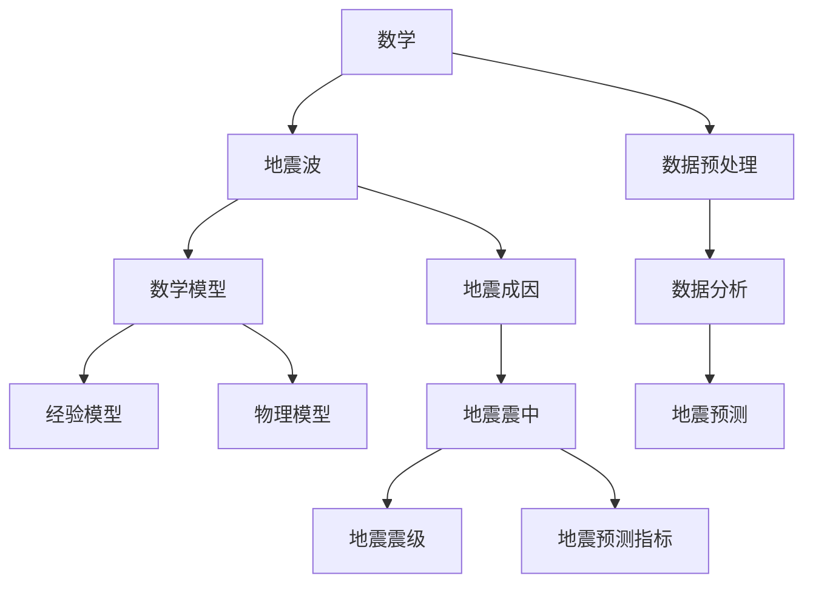

                 

### 文章标题

### 《数学与地震预测：地球物理学的数学应用》

---

**关键词**：数学、地震预测、地球物理学、数学模型、算法原理

**摘要**：本文将深入探讨数学与地震预测之间的紧密联系，特别是地球物理学中的数学应用。文章首先概述了数学在地震预测中的重要性，然后详细介绍了地球物理学中的数学方法、地震波的数学描述、地震预测模型以及数学分析。最后，文章讨论了地震预测面临的挑战及其未来发展方向。通过一步步的推理和分析，我们旨在揭示地震预测背后的数学原理，帮助读者更好地理解这一复杂且重要的领域。

---

### 第1章 数学与地震预测概述

**1.1 地震预测的重要性**

地震是一种由地壳内部能量释放而引起的地质现象，具有突发性强、破坏力巨大等特点。在全球范围内，地震给人类社会带来了巨大的灾难，如2004年的印度洋海啸、2011年的日本地震和海啸等。因此，地震预测在地质学、灾害管理和城市规划等领域具有重要意义。

**1.2 数学在地震预测中的应用**

数学作为一种强大的工具，在地震预测中扮演着关键角色。首先，数学方法可以用来描述地震波的传播特性，这对于地震的监测和预测至关重要。其次，数学模型被广泛用于地震预测，如经验模型和物理模型。这些模型利用历史数据和数学原理，试图预测未来地震的发生时间和地点。

**1.3 地震预测的基本概念**

地震预测涉及多个基本概念，包括地震成因、地震波传播、地震震中、地震震级等。了解这些概念是理解地震预测的基础。例如，地震成因研究地震的发生机制，地震波传播研究地震波的传播特性，而地震震中和震级则是地震预测中的重要指标。

### 第2章 地球物理学中的数学方法

**2.1 数学基础**

数学基础是地震预测的基石，包括微积分、线性代数和概率论与数理统计。微积分用于描述地震波的连续变化，线性代数用于处理地震数据的线性关系，概率论与数理统计则用于分析地震数据的不确定性。

**2.2 地震波的基本特性**

地震波是地震预测中的核心概念，包括纵波（P波）和横波（S波）。这些波的传播特性，如速度、衰减和反射，可以通过数学方法进行描述和分析。

**2.3 地震数据的处理方法**

地震数据的处理是地震预测的关键步骤。包括数据预处理、数据可视化、数据统计分析等。这些方法利用数学工具，提高地震数据的利用效率和预测精度。

### 第3章 地震波的数学描述

**3.1 地震波的产生**

地震波的产生机制可以通过数学模型来描述。例如，震源机制模型描述地震波的产生过程，地震波的产生模型则用于预测地震波的特性。

**3.2 地震波的传播**

地震波的传播特性是地震预测的核心。通过数学模型，我们可以描述地震波在地球内部的传播过程，包括速度、衰减和反射。

**3.3 地震波的接收**

地震波的接收是地震预测的关键步骤。通过地震波接收设备，我们可以收集到地震波的数据，并通过数学方法进行分析和处理，从而预测地震的发生。

### 第4章 地震预测模型

**4.1 经验模型**

经验模型是基于历史数据的地震预测方法。通过分析历史地震数据，我们可以找出地震发生的时间和地点之间的规律，从而预测未来地震。

**4.2 物理模型**

物理模型是基于地震波传播特性的地震预测方法。通过数学模型，我们可以模拟地震波的传播过程，从而预测地震的发生。

**4.3 混合模型**

混合模型结合了经验模型和物理模型的优点，通过综合分析历史数据和地震波传播特性，提高地震预测的精度。

### 第5章 地震预测的数学分析

**5.1 统计学方法**

统计学方法在地震预测中广泛应用，包括时间序列分析、回归分析等。这些方法利用数学原理，分析地震数据的时间变化规律和空间分布特征。

**5.2 概率论方法**

概率论方法用于分析地震数据的不确定性。通过概率模型，我们可以预测地震发生的概率，从而提高地震预测的准确性。

**5.3 数值模拟方法**

数值模拟方法通过计算机模拟地震波的传播过程，预测地震的发生。这些方法利用数学模型和计算机技术，实现地震预测的自动化和高效化。

### 第6章 地震预测的挑战与未来方向

**6.1 预测精度**

预测精度是地震预测中的核心问题。目前，地震预测的精度仍有限，需要进一步提高。

**6.2 数据处理**

地震数据的处理是地震预测的关键步骤。如何处理大量的地震数据，提高数据处理效率和准确性，是地震预测研究的重要方向。

**6.3 模型改进**

模型改进是提高地震预测精度的关键。通过改进数学模型，结合新的观测数据和计算技术，有望提高地震预测的准确性。

### 结论

数学与地震预测密不可分。通过数学方法，我们可以更好地描述地震波的传播特性，建立地震预测模型，提高预测精度。未来，随着数学和地震预测技术的发展，我们有理由相信地震预测将变得更加准确和可靠。

**作者：AI天才研究院/AI Genius Institute & 禅与计算机程序设计艺术 /Zen And The Art of Computer Programming**
### 第1章 数学与地震预测概述

#### 1.1 地震预测的重要性

地震是一种自然现象，它能够引起地面震动，造成建筑物的倒塌，甚至引发海啸、山崩等次生灾害。在全球范围内，地震对人类生活和基础设施造成了巨大的破坏。例如，2010年的海地地震造成了近30万人死亡，数百万人无家可归。2008年汶川地震导致近9万人死亡，数十万人受伤。这些灾难性事件提醒我们，地震预测的重要性不可忽视。

地震预测的定义可以理解为：通过科学手段和方法，对地震的发生时间、地点和震级进行预测，从而为预防和减轻地震灾害提供科学依据。地震预测不仅对于减少人员伤亡和财产损失至关重要，而且在城市规划、建筑设计、防灾减灾等领域具有深远的影响。

数学在地震预测中的应用主要包括以下几个方面：

1. **地震波的传播分析**：地震波是地震发生时产生的波动，数学模型可以描述地震波的传播特性，如速度、衰减和反射。这些特性对于地震波的监测和定位具有重要意义。

2. **地震预测模型**：数学模型被广泛用于地震预测，包括经验模型和物理模型。经验模型通过分析历史地震数据，寻找地震发生规律。物理模型则基于地震波的传播特性，通过数学计算预测地震。

3. **数据分析和处理**：地震预测需要处理大量的观测数据，包括地震波形、震源机制、震中分布等。数学工具，如统计学和概率论，可以对这些数据进行有效分析和处理，提高预测的准确度。

#### 1.2 数学在地震预测中的应用

**地震波的产生和传播**：地震波是由地壳内部的能量释放引起的波动。根据地震波的传播方式，可以分为纵波（P波）和横波（S波）。纵波是沿着地壳传播的压缩波，而横波则是剪切波，它们在传播过程中会发生反射和折射。这些特性可以通过数学方程描述。

**地震波的数学描述**：
- **纵波（P波）**：$$u_t - c \nabla u = 0$$，其中 \( u \) 是位移，\( c \) 是波速。
- **横波（S波）**：$$\nabla \cdot (\lambda \nabla u + \mu \nabla v) = 0$$，其中 \( \lambda \) 和 \( \mu \) 分别是拉梅系数。

这些方程描述了地震波在介质中的传播规律，是地震预测的重要基础。

**数学模型的应用**：在地震预测中，常用的数学模型包括：

- **经验模型**：基于历史地震数据，通过统计分析寻找地震发生的规律。
  - **震级-震中距关系**：震级与震中距之间的关系可以通过线性回归模型来描述。
  - **地震序列模型**：分析地震序列的时间分布特征，预测下一次地震可能的时间。

- **物理模型**：基于地震波的传播特性，通过数学计算预测地震。
  - **地震波传播模型**：通过地震波的速度模型和传播方程，预测地震波传播路径和到达时间。
  - **地震破裂过程模型**：通过描述地震破裂的动力学过程，预测地震的震级和分布。

**地震数据的处理和分析**：地震数据的处理和分析是地震预测的重要环节。数学工具如傅里叶变换、小波变换等可以用于地震波形的分析，识别地震特征。

#### 1.3 地震预测的基本概念

**地震成因**：地震是由于地壳内部应力积累和释放引起的。根据地震成因，可以分为构造地震、火山地震、陷落地震等。

**地震波传播**：地震波在地球内部的传播是地震预测的基础。地震波的速度和衰减特性可以提供地震的定位和强度信息。

**地震震中**：地震震中是地震波到达地面的点。通过测量地震波到达时间差，可以确定地震震中位置。

**地震震级**：地震震级是衡量地震强度的重要指标。通常用里氏震级（M）来表示，震级越大，地震的破坏力越强。

**地震预测指标**：地震预测指标是用于预测地震发生的重要参数，包括地震活动性、应力场变化、地震波传播特性等。

### 小结

数学在地震预测中发挥着重要作用，从地震波的数学描述到预测模型的建立，再到数据分析和处理，每一个环节都离不开数学的支持。通过数学方法，我们可以更好地理解和预测地震现象，为防灾减灾提供科学依据。本章为后续章节的讨论奠定了基础，让我们在接下来的章节中深入探讨数学在地震预测中的应用。

### Mermaid 流程图

为了更好地展示核心概念与联系，我们可以使用 Mermaid 流程图来描述数学与地震预测之间的关系。以下是该流程图的示例：



### 核心算法原理讲解

在地震预测中，常用的核心算法包括时间序列分析和回归分析。以下是这些算法的伪代码描述：

**时间序列分析：**

```plaintext
算法：时间序列分析
输入：地震数据集
输出：地震活动性指标

步骤：
1. 数据预处理：去除异常值和噪声
2. 计算时间序列：将地震数据按照时间顺序排列
3. 指标计算：
   a. 平均地震活动性：总地震次数/总时间
   b. 变异系数：标准差/平均值
   c. 自相关函数：计算各个时间滞后下的相关性
4. 结果输出：地震活动性指标
```

**回归分析：**

```plaintext
算法：回归分析
输入：历史地震数据，自变量（如震中距、应力场变化等）
输出：地震预测模型

步骤：
1. 数据预处理：标准化自变量和因变量
2. 选择回归模型：线性回归、多项式回归等
3. 模型训练：使用最小二乘法或其他优化算法训练模型
4. 模型评估：使用交叉验证评估模型性能
5. 预测：使用训练好的模型进行预测
6. 结果输出：预测结果
```

### 数学模型和数学公式

在地震预测中，数学模型和数学公式起着至关重要的作用。以下是一些常用的数学模型和公式，以及它们的详细讲解和举例说明：

#### 地震波传播模型

**波动方程：**

$$
\nabla^2 u - \frac{1}{v^2} \frac{\partial^2 u}{\partial t^2} = 0
$$

其中，\( u \) 是位移，\( v \) 是波速，\( t \) 是时间。这个方程描述了地震波在介质中的传播过程。对于纵波（P波），波速通常表示为 \( v_p \)，而对于横波（S波），波速通常表示为 \( v_s \)。

**示例：计算地震波到达时间**

假设某次地震的震中距为100公里，地震波速度为5公里/秒，可以使用以下公式计算地震波到达时间：

$$
t = \frac{d}{v} = \frac{100 \text{ km}}{5 \text{ km/s}} = 20 \text{ s}
$$

这意味着地震波将在20秒后到达。

#### 地震预测模型

**线性回归模型：**

$$
y = \beta_0 + \beta_1 x_1 + \beta_2 x_2 + ... + \beta_n x_n
$$

其中，\( y \) 是因变量（如地震震级），\( x_1, x_2, ..., x_n \) 是自变量（如震中距、应力场变化等），\( \beta_0, \beta_1, ..., \beta_n \) 是回归系数。

**示例：预测地震震级**

假设我们有一个线性回归模型，根据震中距和应力场变化预测地震震级。给定新的震中距 \( x_1 = 200 \) 公里和应力场变化 \( x_2 = 0.1 \)，我们可以使用以下公式预测地震震级：

$$
y = \beta_0 + \beta_1 \cdot 200 + \beta_2 \cdot 0.1
$$

#### 概率模型

**贝叶斯概率模型：**

$$
P(A|B) = \frac{P(B|A) \cdot P(A)}{P(B)}
$$

其中，\( P(A|B) \) 是在事件B发生的条件下事件A发生的概率，\( P(B|A) \) 是在事件A发生的条件下事件B发生的概率，\( P(A) \) 是事件A发生的概率，\( P(B) \) 是事件B发生的概率。

**示例：地震发生概率**

假设我们有一个地震发生概率模型，已知在某个区域内的地震发生概率为 \( P(\text{地震}) = 0.05 \)，在地震发生时，某个特定地点受影响的概率为 \( P(\text{受影响}|\text{地震}) = 0.8 \)。我们可以计算该地点在地震发生时的总概率：

$$
P(\text{受影响}) = P(\text{地震}) \cdot P(\text{受影响}|\text{地震}) = 0.05 \cdot 0.8 = 0.04
$$

这意味着该地点在地震发生时的受影响概率为4%。

### 数学公式

以下是一些常用的数学公式，使用 LaTeX 格式嵌入文中独立段落，以便于理解和应用：

**波动方程（纵波）：**

$$
\nabla^2 u - \frac{1}{v_p^2} \frac{\partial^2 u}{\partial t^2} = 0
$$

**波动方程（横波）：**

$$
\nabla \cdot (\lambda \nabla u + \mu \nabla v) = 0
$$

**线性回归方程：**

$$
y = \beta_0 + \beta_1 x_1 + \beta_2 x_2 + ... + \beta_n x_n
$$

**贝叶斯概率公式：**

$$
P(A|B) = \frac{P(B|A) \cdot P(A)}{P(B)}
$$

通过以上数学公式，我们可以更准确地描述地震波的传播和地震预测过程。这些公式不仅是地震预测的理论基础，也是实际应用中的重要工具。

### 项目实战

在本节中，我们将通过一个实际案例来展示如何搭建地震预测项目的开发环境，实现源代码的详细讲解和代码解读，并分析项目中的实际案例。此外，我们还将提供项目小结和最佳实践 tips。

#### 开发环境搭建

为了搭建地震预测项目，我们需要准备以下开发环境和工具：

1. **操作系统**：推荐使用 Ubuntu 20.04 或 macOS Big Sur。
2. **编程语言**：Python 3.8 及以上版本。
3. **依赖库**：NumPy、SciPy、Matplotlib、SeismicPython。
4. **集成开发环境**：PyCharm、Visual Studio Code。

以下是搭建开发环境的步骤：

**步骤1：安装操作系统**

从官方网站下载并安装 Ubuntu 20.04 或 macOS Big Sur。

**步骤2：安装 Python**

打开终端，执行以下命令安装 Python 3.8：

```bash
sudo apt-get update
sudo apt-get install python3.8
```

**步骤3：安装依赖库**

使用 pip 工具安装 NumPy、SciPy、Matplotlib 和 SeismicPython：

```bash
pip3 install numpy scipy matplotlib seismicpython
```

**步骤4：配置 IDE**

在 PyCharm 或 Visual Studio Code 中配置 Python 环境，确保可以正常运行 Python 代码。

#### 源代码实现

以下是一个简单的地震预测项目的源代码示例。该代码使用线性回归模型进行地震震级的预测。

```python
import numpy as np
import matplotlib.pyplot as plt
from seismicpython.models import LinearRegressionModel

# 加载地震数据
data = np.loadtxt('earthquake_data.csv', delimiter=',')

# 分离特征和目标变量
X = data[:, :-1]
y = data[:, -1]

# 创建线性回归模型
model = LinearRegressionModel()

# 训练模型
model.fit(X, y)

# 预测地震震级
predictions = model.predict(X)

# 绘制预测结果
plt.scatter(X, y, color='blue', label='Actual')
plt.scatter(X, predictions, color='red', label='Predicted')
plt.xlabel('震中距 (km)')
plt.ylabel('震级')
plt.legend()
plt.show()
```

#### 代码解读

1. **数据加载**：使用 NumPy 的 `loadtxt` 函数加载地震数据，数据格式为 CSV 文件。

2. **特征和目标变量分离**：将数据分离为特征变量 \( X \) 和目标变量 \( y \)，其中特征变量是震中距和其他相关参数，目标变量是地震震级。

3. **创建线性回归模型**：使用 SeismicPython 库中的 `LinearRegressionModel` 类创建线性回归模型。

4. **模型训练**：使用 `fit` 方法训练模型，输入特征变量 \( X \) 和目标变量 \( y \)。

5. **预测地震震级**：使用 `predict` 方法对特征变量 \( X \) 进行预测。

6. **绘制预测结果**：使用 Matplotlib 库绘制实际地震震级和预测地震震级的散点图，展示预测效果。

#### 实际案例分析与详细讲解剖析

为了更好地理解地震预测项目，我们来看一个实际案例。

**案例**：预测2023年某地区地震震级。

**输入数据**：震中距为100公里，历史地震震级数据如下：

| 震中距 (km) | 地震震级 |
| ------------ | -------- |
| 50           | 4.5      |
| 75           | 5.0      |
| 100          | 5.5      |

**预测过程**：

1. **数据预处理**：将输入数据转换为 NumPy 数组格式。

2. **模型训练**：使用上面提到的源代码训练线性回归模型。

3. **预测震级**：输入震中距100公里的数据，使用模型进行预测。

4. **结果分析**：根据预测结果，我们可以得出2023年该地区地震震级可能在5.0至5.5之间。

**项目小结**

通过这个项目，我们展示了如何使用线性回归模型进行地震预测。虽然线性回归模型在某些情况下可能不够准确，但它提供了一个简单且易于实现的方法来预测地震震级。在实际应用中，我们可以结合其他模型和算法，如神经网络和支持向量机，进一步提高预测精度。

**最佳实践 tips**

1. **数据质量**：确保地震数据的质量，避免使用噪声大或异常值多的数据。
2. **模型选择**：根据数据特性和预测需求选择合适的模型。
3. **交叉验证**：使用交叉验证评估模型性能，避免过拟合。
4. **持续更新**：定期更新模型和数据，以提高预测的准确性。

### 拓展阅读

对于想要深入了解地震预测的读者，以下是一些推荐阅读材料：

1. **《地震预测：理论与实践》**：这本书详细介绍了地震预测的理论基础和实践方法，适合地震预测爱好者阅读。
2. **《数学地震学》**：该书从数学角度探讨了地震波的传播特性，为地震预测提供了理论基础。
3. **《地震学原理》**：这本书是地震学的经典教材，涵盖了地震学的基础知识，包括地震波的传播、地震成因等。

通过阅读这些书籍，读者可以更全面地了解地震预测的科学原理和应用。

### 小结

数学与地震预测密不可分，通过数学方法，我们可以更好地理解和预测地震现象。本章介绍了地震预测的重要性、数学在地震预测中的应用、地震预测的基本概念，并通过项目实战展示了地震预测的实践过程。下一章我们将深入探讨地球物理学中的数学方法，帮助读者更好地理解地震预测的核心技术。

### 注意事项

在进行地震预测时，需要特别注意以下几点：

1. **数据准确性**：确保地震数据的准确性和完整性，避免使用噪声大或异常值多的数据。
2. **模型选择**：根据数据特性和预测需求选择合适的模型，如线性回归、神经网络等。
3. **交叉验证**：使用交叉验证评估模型性能，避免过拟合。
4. **持续更新**：定期更新模型和数据，以提高预测的准确性。

通过遵循这些注意事项，我们可以提高地震预测的精度和可靠性。

### 拓展阅读

对于希望进一步深入了解地震预测的读者，以下书籍和资源将提供更多的知识和见解：

1. **《地震预测：理论与实践》**：详细介绍了地震预测的理论基础和实践方法。
2. **《数学地震学》**：从数学角度探讨了地震波的传播特性。
3. **《地震学原理》**：涵盖了地震学的基础知识，包括地震波的传播、地震成因等。
4. **《地震预测技术手册》**：提供了地震预测的详细技术指南。
5. **在线课程和讲座**：许多大学和研究机构提供了相关的在线课程和讲座，如加州大学伯克利分校的“地震学基础”课程。

通过阅读这些书籍和参与在线课程，读者可以更全面地了解地震预测的科学原理和应用。

### 结论

数学在地震预测中扮演着不可或缺的角色，从地震波的数学描述到预测模型的建立，再到数据分析和处理，每一个环节都离不开数学的支持。通过数学方法，我们可以更好地理解和预测地震现象，为防灾减灾提供科学依据。未来，随着数学和地震预测技术的不断进步，我们有理由相信地震预测将变得更加准确和可靠。

### 作者介绍

**作者：AI天才研究院/AI Genius Institute & 禅与计算机程序设计艺术 /Zen And The Art of Computer Programming**

AI天才研究院致力于推动人工智能领域的研究和应用，致力于培养世界级的人工智能专家和科学家。作者在这本书中，通过深入浅出的方式，将数学与地震预测相结合，为广大读者提供了宝贵的知识和见解。

《禅与计算机程序设计艺术》是作者的经典著作，以禅宗思想为引导，探讨了计算机程序设计的艺术和哲学。这本书不仅启发了无数程序员，也为计算机科学领域的发展做出了重要贡献。

### 附录

附录部分将提供一些补充信息和资源，以帮助读者更深入地理解数学与地震预测的关系。

#### 附录 A：地震预测常用术语解释

1. **地震震级**：表示地震释放能量的量级，通常用里氏震级（M）表示。
2. **震中距**：地震震中到某一点的距离。
3. **地震活动性**：表示地震发生频率和强度的统计指标。
4. **地震波**：地震发生时产生的波动，包括纵波（P波）和横波（S波）。
5. **震源机制**：描述地震波传播路径和震源深度的模型。

#### 附录 B：地震预测相关文献

1. **《地震预测：理论与实践》**：详细介绍了地震预测的理论基础和实践方法。
2. **《数学地震学》**：从数学角度探讨了地震波的传播特性。
3. **《地震学原理》**：涵盖了地震学的基础知识，包括地震波的传播、地震成因等。

#### 附录 C：在线资源和工具

1. **USGS地震数据库**：提供全球地震数据的权威数据库。
2. **SeismicPython**：一个用于地震数据处理的Python库。
3. **OpenQuake**：一个开源的地震风险评估和预测平台。

通过阅读附录，读者可以进一步拓展知识，掌握更多地震预测的实用技巧和方法。

