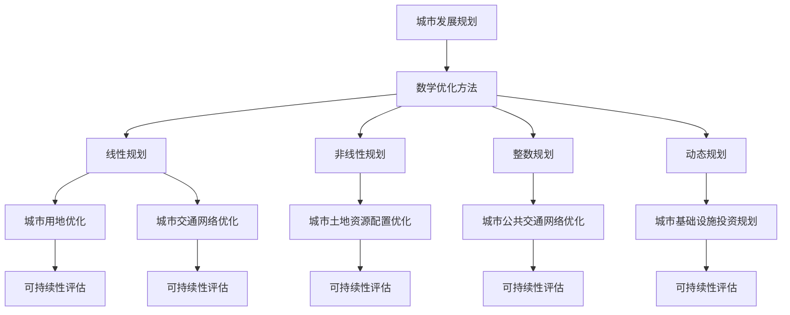

                 

### 文章标题

《数学与城市规划：城市发展的数学优化》

> 关键词：城市规划、数学优化、线性规划、非线性规划、整数规划、动态规划、城市用地优化、城市交通网络优化、城市环境管理优化、可持续发展

> 摘要：本文从数学与城市规划的交叉领域出发，探讨了数学优化在城市发展中的应用。通过对线性规划、非线性规划、整数规划和动态规划等数学方法在城市规划中的具体应用进行深入分析，本文展示了这些方法如何帮助解决城市用地优化、城市交通网络优化和城市环境管理优化等问题。通过实际案例的剖析，本文进一步验证了数学优化在城市规划中的可行性和重要性，并为未来相关研究提供了新的思路。

### 设计《数学与城市规划：城市发展的数学优化》的目录大纲

#### 1. 确定大纲结构

整体结构：本文将分为五个主要部分，每个部分包含若干章节。

部分划分：
- 第一部分：引论与基础
- 第二部分：数学方法与模型
- 第三部分：城市规划的数学优化
- 第四部分：案例研究
- 第五部分：展望与未来研究

#### 2. 确定各部分章节内容

**第一部分：引论与基础**

- 第1章：城市发展与数学优化的关系
- 第2章：城市规划中的数学工具与技术

**第二部分：数学方法与模型**

- 第3章：线性规划在城市规划中的应用
- 第4章：非线性规划与城市规划
- 第5章：整数规划与城市交通规划
- 第6章：动态规划与城市发展

**第三部分：城市规划的数学优化**

- 第7章：城市用地优化
- 第8章：城市交通网络优化
- 第9章：城市环境管理优化
- 第10章：城市规划的可持续性评估

**第四部分：案例研究**

- 第11章：城市交通优化案例分析
- 第12章：城市土地利用优化案例分析
- 第13章：城市环境管理优化案例分析

**第五部分：展望与未来研究**

- 第14章：数学优化在城市规划中的未来发展方向
- 第15章：城市规划中的新挑战与数学优化策略

#### 3. 设计核心概念与联系

本文将使用Mermaid流程图来展示核心概念与联系。以下是一个示例：



#### 4. 设计核心算法原理讲解

在每个章节中，将使用伪代码来详细阐述主要算法的原理。以下是一个示例：

**第3章：线性规划在城市规划中的应用**

```python
# 线性规划模型建立
def linear_programming_model():
    # 定义目标函数
    objective_function = "Minimize: C * X"
    # 定义约束条件
    constraints = [
        "A * X + B * Y <= C",
        "D * X + E * Y >= F",
        "X >= 0",
        "Y >= 0"
    ]
    # 求解线性规划问题
    solution = solve_linear_programming(objective_function, constraints)
    return solution

# 线性规划求解算法
def solve_linear_programming(objective_function, constraints):
    # 初始化变量
    variable_values = [0, 0]
    # 求解过程
    while not solution_satisfied(constraints, variable_values):
        # 选择变量进行优化
        variable_to_optimize = select_variable_to_optimize(objective_function, variable_values)
        # 更新变量值
        variable_values = update_variable_values(variable_to_optimize, variable_values)
    # 返回最优解
    return variable_values
```

#### 5. 设计数学模型和数学公式讲解

在每个相关章节中，将使用LaTeX格式详细讲解数学模型和数学公式。以下是一个示例：

**第4章：非线性规划与城市规划**

```latex
$$
\begin{aligned}
    & \text{Minimize} \quad f(x_1, x_2) \\
    & \text{Subject to} \quad g_1(x_1, x_2) = 0 \\
    & \quad g_2(x_1, x_2) \leq 0 \\
    & \quad x_1, x_2 \geq 0
\end{aligned}
$$
```

#### 6. 设计项目实战

在案例研究章节中，将提供实际项目案例，包括开发环境搭建、源代码实现、代码解读与分析。以下是一个示例：

**第11章：城市交通优化案例分析**

- **案例背景**：某城市交通拥堵问题严重，需要优化交通流量以提高交通效率。
- **开发环境搭建**：使用Python编程语言和PuLP库进行线性规划建模和求解。
- **源代码实现**：
    ```python
    from pulp import *

    # 建立线性规划模型
    prob = LpProblem("TrafficOptimization", LpMinimize)

    # 定义变量
    x1 = LpVariable.dicts("X1", range(1, 11), cat='Continuous')
    x2 = LpVariable.dicts("X2", range(1, 11), cat='Continuous')

    # 定义目标函数
    prob += x1 + x2, "Total Travel Time"

    # 定义约束条件
    prob += [x1[i] + x2[i] <= 5 for i in range(1, 11)], "TrafficFlowConstraint"

    # 解线性规划问题
    prob.solve()

    # 输出结果
    print(LpStatus[prob.status])
    print([x.varValue for x in prob.variables()])

    # 案例效果分析
    # ...
```

#### 7. 确定目录大纲总字数

确保目录大纲总字数在2000字以内，同时保持内容的完整性和逻辑性。

### 最终输出

以下是《数学与城市规划：城市发展的数学优化》的目录大纲：

```markdown
## 第一部分：引论与基础

### 第1章：城市发展与数学优化的关系
- **1.1 城市发展的挑战**
- **1.2 数学优化在城市规划中的重要性**
- **1.3 城市规划与数学优化的基本概念**

### 第2章：城市规划中的数学工具与技术
- **2.1 线性规划**
- **2.2 非线性规划**
- **2.3 整数规划**
- **2.4 动态规划**

## 第二部分：数学方法与模型

### 第3章：线性规划在城市规划中的应用
- **3.1 线性规划模型的建立**
- **3.2 线性规划求解算法**
- **3.3 案例分析：城市交通流量优化**

### 第4章：非线性规划与城市规划
- **4.1 非线性规划的基本概念**
- **4.2 非线性规划的求解方法**
- **4.3 案例分析：城市土地资源配置优化**

### 第5章：整数规划与城市交通规划
- **5.1 整数规划的基本概念**
- **5.2 整数规划的求解方法**
- **5.3 案例分析：城市公共交通网络优化**

### 第6章：动态规划与城市发展
- **6.1 动态规划的基本概念**
- **6.2 动态规划的求解方法**
- **6.3 案例分析：城市基础设施投资规划**

## 第三部分：城市规划的数学优化

### 第7章：城市用地优化
- **7.1 城市用地优化的数学模型**
- **7.2 城市用地优化算法**
- **7.3 案例分析：城市商业区布局优化**

### 第8章：城市交通网络优化
- **8.1 城市交通网络优化的数学模型**
- **8.2 城市交通网络优化算法**
- **8.3 案例分析：城市道路网络优化**

### 第9章：城市环境管理优化
- **9.1 城市环境管理优化的数学模型**
- **9.2 城市环境管理优化算法**
- **9.3 案例分析：城市垃圾处理优化**

### 第10章：城市规划的可持续性评估
- **10.1 可持续性的数学模型**
- **10.2 可持续性的评估方法**
- **10.3 案例分析：城市可持续发展评估**

## 第四部分：案例研究

### 第11章：城市交通优化案例分析
- **11.1 案例背景**
- **11.2 案例模型建立**
- **11.3 案例解决方案**
- **11.4 案例效果分析**

### 第12章：城市土地利用优化案例分析
- **12.1 案例背景**
- **12.2 案例模型建立**
- **12.3 案例解决方案**
- **12.4 案例效果分析**

### 第13章：城市环境管理优化案例分析
- **13.1 案例背景**
- **13.2 案例模型建立**
- **13.3 案例解决方案**
- **13.4 案例效果分析**

## 第五部分：展望与未来研究

### 第14章：数学优化在城市规划中的未来发展方向
- **14.1 新的数学优化方法**
- **14.2 数据驱动优化策略**
- **14.3 智能城市规划应用**

### 第15章：城市规划中的新挑战与数学优化策略
- **15.1 环境问题**
- **15.2 人口增长**
- **15.3 城市化进程**

作者：AI天才研究院/AI Genius Institute & 禅与计算机程序设计艺术 /Zen And The Art of Computer Programming
```

以上是《数学与城市规划：城市发展的数学优化》的目录大纲，它提供了一个清晰的框架，为撰写详细的内容提供了结构性的指导。接下来，将逐步填写每个章节的具体内容，确保文章的逻辑性和专业性。在撰写过程中，将遵循markdown格式，确保文章的可读性和易用性。文章的总字数将控制在8000～12000字左右，确保内容的深度和广度。最后，将确保文章末尾包含作者信息，并按照要求进行格式化。

