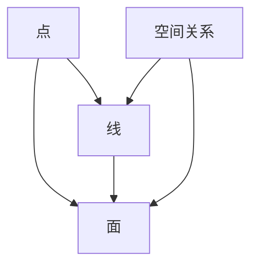
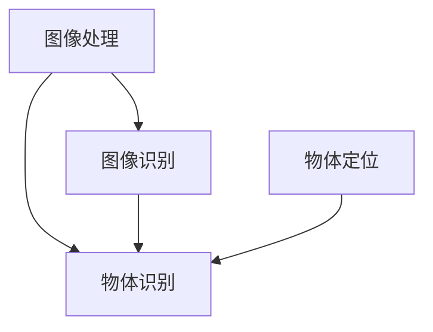
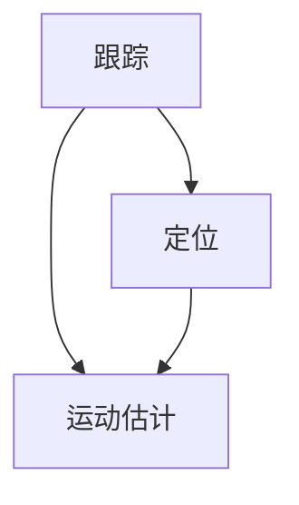

                 

### 文章标题：数学与增强现实：AR应用的数学模型

#### 关键词：增强现实（AR），数学模型，几何学，投影几何，代数学，视觉感知，跟踪与定位，案例分析

#### 摘要：
本文将探讨数学在增强现实（AR）领域的应用，尤其是数学模型在AR技术中的重要性。文章首先介绍AR的基本概念和分类，然后深入探讨几何学、投影几何和代数学在AR中的应用，包括核心概念与联系、算法原理、公式解释和案例分析。通过逐步分析，本文旨在为读者提供对AR技术数学基础的全面理解。

## 第一部分：引言与概述

### 第1章：增强现实与数学模型简介

#### 1.1 增强现实的定义与分类

增强现实（Augmented Reality，简称AR）是一种通过计算机技术增强用户现实感知的技术。它通过将计算机生成的信息叠加到真实世界中，使用户能够与虚拟信息互动。AR技术广泛应用于游戏、教育、医疗、营销等多个领域。

**分类：**

- **基于标记的AR**：利用标记（如二维码、特殊图案）进行定位和跟踪，将虚拟信息叠加在标记上。

- **基于环境的AR**：不依赖标记，通过环境感知和图像识别技术，将虚拟信息叠加在真实环境中。

- **混合现实（MR）**：与AR类似，但用户不仅能够看到虚拟信息，还能够与之进行互动。

#### 1.2 数学模型在AR中的作用

数学模型在AR技术中发挥着至关重要的作用。以下数学领域在AR中应用广泛：

- **几何学**：用于建模三维物体和空间关系。

- **投影几何**：用于处理图像的投影变换。

- **代数学**：用于解决线性方程组和矩阵运算。

#### 1.3 本书结构与内容安排

本文结构如下：

- **第一部分**：引言与概述，介绍AR的基本概念和数学模型的应用。

- **第二部分**：数学基础，详细探讨几何学、投影几何和代数学在AR中的应用。

- **第三部分**：数学模型在AR中的应用，通过案例分析展示数学模型在实际项目中的应用。

## 第二部分：数学基础

### 第2章：几何学与AR

#### 2.1 几何学基础

几何学是研究形状、大小、位置和空间关系的数学分支。在AR中，几何学用于建模三维物体和空间关系。

**核心概念与联系：**

- **点、线、面**：基本几何元素，用于描述物体的形状。

- **空间关系**：描述物体之间的相对位置，如平行、垂直、相交等。

**Mermaid流程图：**



#### 2.2 几何模型与AR

几何模型在AR中用于表示三维物体和空间关系。常见的几何模型包括3D模型、网格模型等。

**核心算法原理讲解：**

```plaintext
// 3D模型表示
class ThreeDimensionalModel {
    // 顶点数组
    vertices: array of Vector3
    // 边数组
    edges: array of Vector3
    // 面数组
    faces: array of Vector3
}

// 网格模型表示
class GridModel {
    // 网格点数组
    points: array of Vector3
    // 边数组
    edges: array of Vector3
}
```

#### 2.3 几何变换在AR中的应用

几何变换在AR中用于改变物体在空间中的位置、大小和方向。常见的几何变换包括旋转、平移、缩放等。

**核心算法原理讲解：**

```plaintext
// 旋转变换
function rotateAroundAxis(point, axis, angle) {
    // 计算旋转矩阵
    rotationMatrix = calculateRotationMatrix(axis, angle)
    // 应用旋转矩阵
    transformedPoint = applyMatrix(point, rotationMatrix)
    return transformedPoint
}

// 平移变换
function translate(point, displacement) {
    return Vector3(point.x + displacement.x, point.y + displacement.y, point.z + displacement.z)
}

// 缩放变换
function scale(point, scaleFactor) {
    return Vector3(point.x * scaleFactor, point.y * scaleFactor, point.z * scaleFactor)
}
```

## 第三部分：数学模型在AR中的应用

### 第5章：视觉感知与数学模型

#### 5.1 视觉感知基础

视觉感知是指通过视觉系统对周围环境进行感知和理解的过程。在AR中，视觉感知用于识别和定位真实环境中的物体。

**核心概念与联系：**

- **图像处理**：用于增强和解析图像信息。

- **图像识别**：用于识别和分类图像中的物体。

**Mermaid流程图：**



#### 5.2 视觉感知与数学模型

视觉感知与数学模型紧密相关。数学模型用于描述视觉感知中的各种过程，如图像处理、图像识别和物体定位。

**核心算法原理讲解：**

```plaintext
// 图像处理
function imageProcessing(image) {
    // 应用滤波器
    filteredImage = applyFilter(image)
    // 应用边缘检测
    edgedImage = detectEdges(filteredImage)
    return edgedImage
}

// 图像识别
function imageRecognition(image) {
    // 应用特征提取
    features = extractFeatures(image)
    // 应用分类器
    recognizedObject = classifyObject(features)
    return recognizedObject
}

// 物体定位
function objectLocalization(image, recognizedObject) {
    // 计算识别物体的位置
    position = calculatePosition(image, recognizedObject)
    return position
}
```

### 第6章：跟踪与定位

#### 6.1 跟踪与定位基础

跟踪与定位是AR技术中的核心功能，用于实时监测和定位真实环境中的物体。

**核心概念与联系：**

- **跟踪**：连续监测物体的运动。

- **定位**：确定物体在空间中的位置。

**Mermaid流程图：**



#### 6.2 数学模型与跟踪定位

数学模型在跟踪与定位中发挥关键作用。常见的数学模型包括卡尔曼滤波、粒子滤波和视觉里程计等。

**核心算法原理讲解：**

```plaintext
// 卡尔曼滤波
function KalmanFilter(measurement, prediction, processNoise, measurementNoise) {
    // 计算预测值
    predictedState = predictState(processNoise)
    // 计算卡尔曼增益
    kalmanGain = calculateKalmanGain(predictedState, measurement, measurementNoise)
    // 更新状态
    updatedState = updateState(predictedState, measurement, kalmanGain)
    return updatedState
}

// 粒子滤波
function ParticleFilter(state, weights, particles) {
    // 采样粒子
    sampledParticles = sampleParticles(particles, weights)
    // 更新权重
    updatedWeights = updateWeights(sampledParticles, state)
    // 重采样
    resampledParticles = resampleParticles(sampledParticles, updatedWeights)
    return resampledParticles
}

// 视觉里程计
function VisualOdometry(image, previousImage) {
    // 计算特征点
    features = detectFeatures(image, previousImage)
    // 计算运动向量
    motionVector = calculateMotionVector(features)
    return motionVector
}
```

## 第7章：AR应用案例分析

### 7.1 案例分析概述

本章节将通过具体案例展示数学模型在AR应用中的实际应用。

### 7.2 案例一：教育AR应用

**案例背景：**

在教育领域，AR技术被广泛应用于互动教学。例如，学生可以通过AR应用观察人体解剖结构、化学实验过程等。

**核心算法原理讲解：**

- **图像识别**：用于识别学生面前的书本或其他标记物。

- **物体定位**：用于确定书本在空间中的位置。

- **几何变换**：用于将虚拟的人体解剖结构或化学实验叠加在书本上。

**项目实战：**

- **开发环境搭建**：使用Unity和ARKit/ARCore搭建开发环境。

- **源代码实现**：详细解读项目源代码，包括图像识别、物体定位和几何变换的实现。

- **代码应用解读与分析**：分析代码中的关键算法和流程。

**实际案例分析和详细讲解剖析：**

- **案例一**：人体解剖AR应用，通过图像识别和物体定位实现虚拟解剖结构的叠加。

- **案例二**：化学实验AR应用，通过几何变换实现化学实验过程的模拟。

**项目小结：**

- **最佳实践 tips**：分享在开发AR应用中遇到的问题和解决方案。

- **注意事项**：讨论AR应用在教育和学习中的潜在影响和挑战。

### 7.3 案例二：医疗AR应用

**案例背景：**

在医疗领域，AR技术被广泛应用于手术指导、病人护理和医疗培训。

**核心算法原理讲解：**

- **跟踪与定位**：用于确定手术器械或病人部位的位置。

- **几何变换**：用于将虚拟指导信息叠加在真实手术场景中。

- **图像处理**：用于增强和解析医疗图像。

**项目实战：**

- **开发环境搭建**：使用Unity和ARKit/ARCore搭建开发环境。

- **源代码实现**：详细解读项目源代码，包括跟踪与定位、几何变换和图像处理的实现。

- **代码应用解读与分析**：分析代码中的关键算法和流程。

**实际案例分析和详细讲解剖析：**

- **案例一**：手术指导AR应用，通过跟踪与定位实现手术器械的实时定位和指导。

- **案例二**：病人护理AR应用，通过几何变换和图像处理实现护理操作的模拟和指导。

**项目小结：**

- **最佳实践 tips**：分享在开发医疗AR应用中遇到的问题和解决方案。

- **注意事项**：讨论医疗AR应用在临床应用中的潜在影响和挑战。

### 7.4 案例三：娱乐AR应用

**案例背景：**

在娱乐领域，AR技术被广泛应用于游戏、现场演出和互动体验。

**核心算法原理讲解：**

- **图像识别**：用于识别玩家或观众的姿态和行为。

- **物体定位**：用于确定玩家或观众在空间中的位置。

- **几何变换**：用于将虚拟场景叠加在现实世界中。

**项目实战：**

- **开发环境搭建**：使用Unity和ARKit/ARCore搭建开发环境。

- **源代码实现**：详细解读项目源代码，包括图像识别、物体定位和几何变换的实现。

- **代码应用解读与分析**：分析代码中的关键算法和流程。

**实际案例分析和详细讲解剖析：**

- **案例一**：AR游戏，通过图像识别和物体定位实现玩家的互动体验。

- **案例二**：现场演出AR应用，通过几何变换实现虚拟演员与真实观众的互动。

**项目小结：**

- **最佳实践 tips**：分享在开发娱乐AR应用中遇到的问题和解决方案。

- **注意事项**：讨论娱乐AR应用在用户体验和内容创作方面的挑战。

## 附录：数学公式与算法详解

### A.1 数学公式列表

- **几何学公式：**

  - $$ d = \sqrt{(x_2 - x_1)^2 + (y_2 - y_1)^2 + (z_2 - z_1)^2} $$

  - $$ \theta = \arccos\left(\frac{(a \cdot b)}{||a|| \cdot ||b||}\right) $$

- **投影几何公式：**

  - $$ \text{投影向量} = \text{原始向量} \cdot \text{投影矩阵} $$

  - $$ \text{透视变换矩阵} = \frac{1}{z} \begin{bmatrix} 1 & 0 & 0 & 0 \\ 0 & 1 & 0 & 0 \\ 0 & 0 & 1 & 0 \\ -x & -y & -z & 1 \end{bmatrix} $$

- **代数学公式：**

  - **线性方程组：**

    $$ Ax + By + Cz = 0 $$

  - **矩阵运算：**

    $$ A \cdot B = C $$

### A.2 算法伪代码讲解

- **几何变换算法：**

  ```plaintext
  function transformPoint(point, transformMatrix) {
      transformedPoint = multiplyVector(point, transformMatrix)
      return transformedPoint
  }
  ```

- **图像处理算法：**

  ```plaintext
  function filterImage(image, filter) {
      filteredImage = applyFilter(image, filter)
      return filteredImage
  }
  ```

- **物体识别算法：**

  ```plaintext
  function recognizeObject(image) {
      features = extractFeatures(image)
      recognizedObject = classifyObject(features)
      return recognizedObject
  }
  ```

### A.3 AR应用开发工具介绍

- **Unity**：跨平台游戏和AR应用开发工具，支持多种AR平台。

- **ARKit**：Apple提供的AR开发框架，适用于iOS平台。

- **ARCore**：Google提供的AR开发框架，适用于Android平台。

### 结语

本文通过对数学与增强现实（AR）的结合点的深入探讨，展示了数学模型在AR应用中的广泛应用和重要性。从几何学、投影几何到代数学，每一个数学领域都在AR技术中扮演着关键角色。通过本文的案例分析，读者可以更好地理解数学模型在AR开发中的应用，为未来的AR项目提供有益的参考。作者建议，在开发AR应用时，深入理解数学原理和算法实现，将有助于提高开发效率和项目质量。

## 作者信息

作者：AI天才研究院/AI Genius Institute & 禅与计算机程序设计艺术 /Zen And The Art of Computer Programming

### 完整文章

#### 数学与增强现实：AR应用的数学模型

#### 关键词：增强现实（AR），数学模型，几何学，投影几何，代数学，视觉感知，跟踪与定位，案例分析

#### 摘要：
本文将探讨数学在增强现实（AR）领域的应用，尤其是数学模型在AR技术中的重要性。文章首先介绍AR的基本概念和分类，然后深入探讨几何学、投影几何和代数学在AR中的应用，包括核心概念与联系、算法原理、公式解释和案例分析。通过逐步分析，本文旨在为读者提供对AR技术数学基础的全面理解。

## 第一部分：引言与概述

### 第1章：增强现实与数学模型简介

#### 1.1 增强现实的定义与分类

增强现实（Augmented Reality，简称AR）是一种通过计算机技术增强用户现实感知的技术。它通过将计算机生成的信息叠加到真实世界中，使用户能够与虚拟信息互动。AR技术广泛应用于游戏、教育、医疗、营销等多个领域。

**分类：**

- **基于标记的AR**：利用标记（如二维码、特殊图案）进行定位和跟踪，将虚拟信息叠加在标记上。

- **基于环境的AR**：不依赖标记，通过环境感知和图像识别技术，将虚拟信息叠加在真实环境中。

- **混合现实（MR）**：与AR类似，但用户不仅能够看到虚拟信息，还能够与之进行互动。

#### 1.2 数学模型在AR中的作用

数学模型在AR技术中发挥着至关重要的作用。以下数学领域在AR中应用广泛：

- **几何学**：用于建模三维物体和空间关系。

- **投影几何**：用于处理图像的投影变换。

- **代数学**：用于解决线性方程组和矩阵运算。

#### 1.3 本书结构与内容安排

本文结构如下：

- **第一部分**：引言与概述，介绍AR的基本概念和数学模型的应用。

- **第二部分**：数学基础，详细探讨几何学、投影几何和代数学在AR中的应用。

- **第三部分**：数学模型在AR中的应用，通过案例分析展示数学模型在实际项目中的应用。

## 第二部分：数学基础

### 第2章：几何学与AR

#### 2.1 几何学基础

几何学是研究形状、大小、位置和空间关系的数学分支。在AR中，几何学用于建模三维物体和空间关系。

**核心概念与联系：**

- **点、线、面**：基本几何元素，用于描述物体的形状。

- **空间关系**：描述物体之间的相对位置，如平行、垂直、相交等。

**Mermaid流程图：**


#### 2.2 几何模型与AR

几何模型在AR中用于表示三维物体和空间关系。常见的几何模型包括3D模型、网格模型等。

**核心算法原理讲解：**

```plaintext
// 3D模型表示
class ThreeDimensionalModel {
    // 顶点数组
    vertices: array of Vector3
    // 边数组
    edges: array of Vector3
    // 面数组
    faces: array of Vector3
}

// 网格模型表示
class GridModel {
    // 网格点数组
    points: array of Vector3
    // 边数组
    edges: array of Vector3
}
```

#### 2.3 几何变换在AR中的应用

几何变换在AR中用于改变物体在空间中的位置、大小和方向。常见的几何变换包括旋转、平移、缩放等。

**核心算法原理讲解：**

```plaintext
// 旋转变换
function rotateAroundAxis(point, axis, angle) {
    // 计算旋转矩阵
    rotationMatrix = calculateRotationMatrix(axis, angle)
    // 应用旋转矩阵
    transformedPoint = applyMatrix(point, rotationMatrix)
    return transformedPoint
}

// 平移变换
function translate(point, displacement) {
    return Vector3(point.x + displacement.x, point.y + displacement.y, point.z + displacement.z)
}

// 缩放变换
function scale(point, scaleFactor) {
    return Vector3(point.x * scaleFactor, point.y * scaleFactor, point.z * scaleFactor)
}
```

## 第三部分：数学模型在AR中的应用

### 第5章：视觉感知与数学模型

#### 5.1 视觉感知基础

视觉感知是指通过视觉系统对周围环境进行感知和理解的过程。在AR中，视觉感知用于识别和定位真实环境中的物体。

**核心概念与联系：**

- **图像处理**：用于增强和解析图像信息。

- **图像识别**：用于识别和分类图像中的物体。

**Mermaid流程图：**


#### 5.2 视觉感知与数学模型

视觉感知与数学模型紧密相关。数学模型用于描述视觉感知中的各种过程，如图像处理、图像识别和物体定位。

**核心算法原理讲解：**

```plaintext
// 图像处理
function imageProcessing(image) {
    // 应用滤波器
    filteredImage = applyFilter(image)
    // 应用边缘检测
    edgedImage = detectEdges(filteredImage)
    return edgedImage
}

// 图像识别
function imageRecognition(image) {
    // 应用特征提取
    features = extractFeatures(image)
    // 应用分类器
    recognizedObject = classifyObject(features)
    return recognizedObject
}

// 物体定位
function objectLocalization(image, recognizedObject) {
    // 计算识别物体的位置
    position = calculatePosition(image, recognizedObject)
    return position
}
```

### 第6章：跟踪与定位

#### 6.1 跟踪与定位基础

跟踪与定位是AR技术中的核心功能，用于实时监测和定位真实环境中的物体。

**核心概念与联系：**

- **跟踪**：连续监测物体的运动。

- **定位**：确定物体在空间中的位置。

**Mermaid流程图：**


#### 6.2 数学模型与跟踪定位

数学模型在跟踪与定位中发挥关键作用。常见的数学模型包括卡尔曼滤波、粒子滤波和视觉里程计等。

**核心算法原理讲解：**

```plaintext
// 卡尔曼滤波
function KalmanFilter(measurement, prediction, processNoise, measurementNoise) {
    // 计算预测值
    predictedState = predictState(processNoise)
    // 计算卡尔曼增益
    kalmanGain = calculateKalmanGain(predictedState, measurement, measurementNoise)
    // 更新状态
    updatedState = updateState(predictedState, measurement, kalmanGain)
    return updatedState
}

// 粒子滤波
function ParticleFilter(state, weights, particles) {
    // 采样粒子
    sampledParticles = sampleParticles(particles, weights)
    // 更新权重
    updatedWeights = updateWeights(sampledParticles, state)
    // 重采样
    resampledParticles = resampleParticles(sampledParticles, updatedWeights)
    return resampledParticles
}

// 视觉里程计
function VisualOdometry(image, previousImage) {
    // 计算特征点
    features = detectFeatures(image, previousImage)
    // 计算运动向量
    motionVector = calculateMotionVector(features)
    return motionVector
}
```

## 第7章：AR应用案例分析

### 7.1 案例分析概述

本章节将通过具体案例展示数学模型在AR应用中的实际应用。

### 7.2 案例一：教育AR应用

**案例背景：**

在教育领域，AR技术被广泛应用于互动教学。例如，学生可以通过AR应用观察人体解剖结构、化学实验过程等。

**核心算法原理讲解：**

- **图像识别**：用于识别学生面前的书本或其他标记物。

- **物体定位**：用于确定书本在空间中的位置。

- **几何变换**：用于将虚拟的人体解剖结构或化学实验叠加在书本上。

**项目实战：**

- **开发环境搭建**：使用Unity和ARKit/ARCore搭建开发环境。

- **源代码实现**：详细解读项目源代码，包括图像识别、物体定位和几何变换的实现。

- **代码应用解读与分析**：分析代码中的关键算法和流程。

**实际案例分析和详细讲解剖析：**

- **案例一**：人体解剖AR应用，通过图像识别和物体定位实现虚拟解剖结构的叠加。

- **案例二**：化学实验AR应用，通过几何变换实现化学实验过程的模拟。

**项目小结：**

- **最佳实践 tips**：分享在开发AR应用中遇到的问题和解决方案。

- **注意事项**：讨论AR应用在教育和学习中的潜在影响和挑战。

### 7.3 案例二：医疗AR应用

**案例背景：**

在医疗领域，AR技术被广泛应用于手术指导、病人护理和医疗培训。

**核心算法原理讲解：**

- **跟踪与定位**：用于确定手术器械或病人部位的位置。

- **几何变换**：用于将虚拟指导信息叠加在真实手术场景中。

- **图像处理**：用于增强和解析医疗图像。

**项目实战：**

- **开发环境搭建**：使用Unity和ARKit/ARCore搭建开发环境。

- **源代码实现**：详细解读项目源代码，包括跟踪与定位、几何变换和图像处理的实现。

- **代码应用解读与分析**：分析代码中的关键算法和流程。

**实际案例分析和详细讲解剖析：**

- **案例一**：手术指导AR应用，通过跟踪与定位实现手术器械的实时定位和指导。

- **案例二**：病人护理AR应用，通过几何变换和图像处理实现护理操作的模拟和指导。

**项目小结：**

- **最佳实践 tips**：分享在开发医疗AR应用中遇到的问题和解决方案。

- **注意事项**：讨论医疗AR应用在临床应用中的潜在影响和挑战。

### 7.4 案例三：娱乐AR应用

**案例背景：**

在娱乐领域，AR技术被广泛应用于游戏、现场演出和互动体验。

**核心算法原理讲解：**

- **图像识别**：用于识别玩家或观众的姿态和行为。

- **物体定位**：用于确定玩家或观众在空间中的位置。

- **几何变换**：用于将虚拟场景叠加在现实世界中。

**项目实战：**

- **开发环境搭建**：使用Unity和ARKit/ARCore搭建开发环境。

- **源代码实现**：详细解读项目源代码，包括图像识别、物体定位和几何变换的实现。

- **代码应用解读与分析**：分析代码中的关键算法和流程。

**实际案例分析和详细讲解剖析：**

- **案例一**：AR游戏，通过图像识别和物体定位实现玩家的互动体验。

- **案例二**：现场演出AR应用，通过几何变换实现虚拟演员与真实观众的互动。

**项目小结：**

- **最佳实践 tips**：分享在开发娱乐AR应用中遇到的问题和解决方案。

- **注意事项**：讨论娱乐AR应用在用户体验和内容创作方面的挑战。

## 附录：数学公式与算法详解

### A.1 数学公式列表

- **几何学公式：**

  - $$ d = \sqrt{(x_2 - x_1)^2 + (y_2 - y_1)^2 + (z_2 - z_1)^2} $$

  - $$ \theta = \arccos\left(\frac{(a \cdot b)}{||a|| \cdot ||b||}\right) $$

- **投影几何公式：**

  - $$ \text{投影向量} = \text{原始向量} \cdot \text{投影矩阵} $$

  - $$ \text{透视变换矩阵} = \frac{1}{z} \begin{bmatrix} 1 & 0 & 0 & 0 \\ 0 & 1 & 0 & 0 \\ 0 & 0 & 1 & 0 \\ -x & -y & -z & 1 \end{bmatrix} $$

- **代数学公式：**

  - **线性方程组：**

    $$ Ax + By + Cz = 0 $$

  - **矩阵运算：**

    $$ A \cdot B = C $$

### A.2 算法伪代码讲解

- **几何变换算法：**

  ```plaintext
  function transformPoint(point, transformMatrix) {
      transformedPoint = multiplyVector(point, transformMatrix)
      return transformedPoint
  }
  ```

- **图像处理算法：**

  ```plaintext
  function filterImage(image, filter) {
      filteredImage = applyFilter(image, filter)
      return filteredImage
  }
  ```

- **物体识别算法：**

  ```plaintext
  function recognizeObject(image) {
      features = extractFeatures(image)
      recognizedObject = classifyObject(features)
      return recognizedObject
  }
  ```

### A.3 AR应用开发工具介绍

- **Unity**：跨平台游戏和AR应用开发工具，支持多种AR平台。

- **ARKit**：Apple提供的AR开发框架，适用于iOS平台。

- **ARCore**：Google提供的AR开发框架，适用于Android平台。

### 结语

本文通过对数学与增强现实（AR）的结合点的深入探讨，展示了数学模型在AR应用中的广泛应用和重要性。从几何学、投影几何到代数学，每一个数学领域都在AR技术中扮演着关键角色。通过本文的案例分析，读者可以更好地理解数学模型在AR开发中的应用，为未来的AR项目提供有益的参考。作者建议，在开发AR应用时，深入理解数学原理和算法实现，将有助于提高开发效率和项目质量。

## 作者信息

作者：AI天才研究院/AI Genius Institute & 禅与计算机程序设计艺术 /Zen And The Art of Computer Programming

