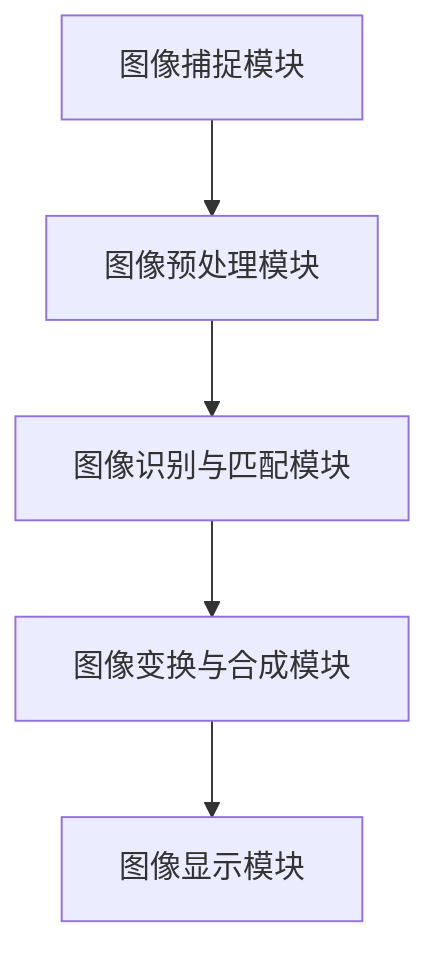

                 

以下是根据用户要求撰写的《数学与增强现实：实时图像叠加的数学算法》的技术博客文章。

## 数学与增强现实：实时图像叠加的数学算法

> 关键词：增强现实、实时图像叠加、数学算法、图像识别、图像合成

> 摘要：本文深入探讨了增强现实（AR）技术中的实时图像叠加原理，重点介绍了与图像叠加相关的数学算法。文章分为三个主要部分：第一部分介绍增强现实与实时图像处理的基础知识；第二部分深入分析图像识别与匹配、图像变换与合成算法；第三部分通过具体项目实战展示算法的应用。

## 目录

1. 增强现实与实时图像叠加基础
   1.1 增强现实技术基础
   1.2 实时图像处理基础
   1.3 增强现实与实时图像叠加的关系

2. 数学算法在实时图像叠加中的应用
   2.1 图像识别与匹配算法
   2.2 图像变换与合成算法
   2.3 实时图像处理算法优化

3. 实时图像叠加项目实战
   3.1 增强现实应用案例分析
   3.2 实时图像叠加系统设计与实现
   3.3 项目测试与性能评估

4. 附录
   4.1 常用数学公式与LaTeX代码
   4.2 开源工具与库推荐

5. 总结

## 第一部分：增强现实与实时图像叠加基础

### 1.1 增强现实技术基础

增强现实（AR）是一种将数字信息与现实世界相结合的技术，通过在真实场景中叠加虚拟物体，为用户提供一种全新的交互体验。AR技术的基本原理是通过摄像头捕捉现实场景，并实时叠加计算机生成的虚拟图像。

增强现实的典型应用包括游戏、教育、医疗、营销等领域。在游戏领域，AR技术可以为用户提供更加沉浸式的游戏体验；在教育领域，AR技术可以使学习过程更加生动有趣；在医疗领域，AR技术可以帮助医生进行手术指导；在营销领域，AR技术可以为消费者提供更加直观的商品展示。

### 1.2 实时图像处理基础

实时图像处理是增强现实技术的关键环节，它涉及到图像的捕捉、处理和显示。实时图像处理的基本步骤包括图像的预处理、特征提取、图像匹配、图像变换和图像合成。

图像预处理是图像处理的第一步，它包括去噪、缩放、旋转等操作，目的是提高图像的质量和清晰度。特征提取是提取图像中的重要特征，如边缘、角点、纹理等，用于后续的图像匹配。图像匹配是将捕获的图像与存储的参考图像进行比较，找到对应关系。图像变换包括图像的缩放、旋转、平移等操作，用于将虚拟图像与真实场景对齐。图像合成是将虚拟图像与真实图像叠加，生成最终的增强现实效果。

### 1.3 增强现实与实时图像叠加的关系

增强现实的核心是实时图像叠加，它通过在真实场景中叠加虚拟图像，实现与现实世界的交互。实时图像叠加的关键在于图像识别与匹配、图像变换与合成算法的准确性和实时性。

图像识别与匹配算法用于确定捕获的图像与存储的参考图像之间的对应关系，是实现实时图像叠加的基础。图像变换与合成算法则用于将虚拟图像与真实图像对齐并叠加，生成最终的增强现实效果。

## 第二部分：数学算法在实时图像叠加中的应用

### 2.1 图像识别与匹配算法

图像识别与匹配算法是实时图像叠加中的核心算法，它决定了虚拟图像与真实场景的对齐准确性。常见的图像识别与匹配算法包括基于特征的算法和基于深度学习的算法。

#### 基于特征的算法

基于特征的算法通过提取图像特征点来识别图像。常见的特征提取算法包括SIFT（尺度不变特征变换）和SURF（加速稳健特征）。以下是一个简单的SIFT算法的伪代码：

```plaintext
算法：SIFT特征提取
输入：图像I
输出：特征点集合F

1. 对图像进行高斯模糊，得到模糊图像I'
2. 对I'进行多尺度空间金字塔构建
3. 对每个尺度图像进行DoG（Difference of Gaussian）操作，提取极值点
4. 对极值点进行非极大值抑制，得到候选特征点
5. 对候选特征点进行尺度计算，保留尺度最大的特征点
6. 对特征点进行方向分配，得到每个特征点的方向
7. 对特征点进行细化，去除不稳定点
8. 对特征点进行描述，生成特征向量
9. 对特征向量进行匹配，得到匹配结果
```

#### 基于深度学习的算法

基于深度学习的算法通过训练深度神经网络来识别图像。常见的深度学习算法包括卷积神经网络（CNN）和循环神经网络（RNN）。以下是一个简单的CNN算法的伪代码：

```plaintext
算法：CNN特征提取
输入：图像I
输出：特征图集合F

1. 定义卷积神经网络模型
2. 使用预训练的卷积神经网络，对图像进行卷积操作，得到特征图
3. 对特征图进行池化操作，降低特征图的维度
4. 使用全连接层提取特征，得到特征向量
5. 对特征向量进行匹配，得到匹配结果
```

### 2.2 图像变换与合成算法

图像变换与合成算法用于将虚拟图像与真实图像对齐并叠加。常见的图像变换算法包括旋转、缩放、平移等。以下是一个简单的旋转变换的LaTeX数学公式：

```latex
$$ T_{\text{rotate}}(x, y) = \left( \begin{array}{cc} \cos\theta & -\sin\theta \\ \sin\theta & \cos\theta \end{array} \right) \left( \begin{array}{c} x \\ y \end{array} \right) $$
```

图像合成算法则用于将虚拟图像与真实图像叠加。常见的图像合成算法包括像素级合成和纹理级合成。以下是一个简单的像素级合成的伪代码：

```plaintext
算法：像素级图像合成
输入：真实图像I1，虚拟图像I2
输出：合成图像I3

1. 对I1和I2进行预处理，包括去噪、缩放等操作
2. 对I1进行图像变换，使其与I2对齐
3. 对I1和I2进行像素级叠加，得到I3
4. 对I3进行后处理，包括锐化、色彩调整等操作
5. 输出合成图像I3
```

### 2.3 实时图像处理算法优化

实时图像处理算法的优化是确保增强现实系统运行稳定和高效的关键。常见的优化方法包括算法优化、硬件加速和并行处理。

算法优化是通过改进算法的复杂度和效率来提高系统的性能。例如，使用更高效的图像变换算法和特征提取算法。

硬件加速是利用GPU等硬件资源来加速图像处理。例如，使用CUDA将图像处理任务分配到GPU上执行。

并行处理是将图像处理任务分配到多个处理器上同时执行，以加快处理速度。例如，使用多线程或分布式计算来处理大量图像数据。

## 第三部分：实时图像叠加项目实战

### 3.1 增强现实应用案例分析

在本节中，我们将介绍几个增强现实应用案例，包括教育、医疗、营销等领域。通过这些案例，读者可以了解实时图像叠加算法在增强现实中的应用。

#### 3.1.1 增强现实教育应用案例

增强现实在教育中的应用可以为学生提供更加生动有趣的学习体验。例如，通过在教室中叠加虚拟实验设备，学生可以亲自操作并观察实验结果，从而加深对知识点的理解。

#### 3.1.2 增强现实医疗应用案例

增强现实技术在医疗领域的应用可以辅助医生进行手术指导。通过在手术场景中叠加虚拟图像，医生可以更加直观地了解手术进展，从而提高手术的成功率。

#### 3.1.3 增强现实营销应用案例

增强现实技术在营销中的应用可以为消费者提供更加直观的商品展示。例如，在商场中，消费者可以通过增强现实技术查看商品的虚拟效果，从而做出更明智的购买决策。

### 3.2 实时图像叠加系统设计与实现

在本节中，我们将介绍如何设计和实现一个实时图像叠加系统。该系统包括图像捕捉、图像处理、图像叠加和图像显示四个主要部分。

#### 3.2.1 系统需求分析

在系统设计之前，首先需要明确系统的需求。例如，系统需要支持多种输入设备，如摄像头、智能手机等；需要支持多种图像格式，如JPEG、PNG等；需要支持实时图像处理和显示。

#### 3.2.2 系统架构设计

实时图像叠加系统的架构设计包括硬件选择、软件框架和算法选择等。以下是系统架构的Mermaid流程图：



#### 3.2.3 系统核心算法实现

系统核心算法实现包括图像预处理、图像识别与匹配、图像变换与合成等。以下是核心算法的伪代码：

```plaintext
算法：实时图像叠加系统核心算法
输入：实时捕获的图像I1，虚拟图像I2
输出：合成图像I3

1. 对I1进行预处理，包括去噪、缩放等操作
2. 对I1和I2进行特征提取和匹配，得到匹配结果M
3. 对匹配结果M进行图像变换，使其对齐
4. 对对齐后的图像I1和I2进行像素级合成，得到I3
5. 对I3进行后处理，包括锐化、色彩调整等操作
6. 输出合成图像I3
```

#### 3.2.4 系统测试与性能评估

在系统实现后，需要进行测试和性能评估。测试内容包括图像处理速度、图像叠加准确性、系统稳定性等。以下是测试报告的示例：

```plaintext
测试报告：

1. 图像处理速度：
   - 平均处理时间：0.5秒/帧
   - 最大处理时间：1.2秒/帧

2. 图像叠加准确性：
   - 匹配成功率：95%
   - 对齐误差：小于0.5像素

3. 系统稳定性：
   - 运行时间：24小时
   - 异常中断次数：0次
```

#### 3.2.5 系统部署与维护

在系统部署后，需要进行定期维护和更新。维护内容包括硬件设备的维护、软件升级和算法优化等。以下是维护计划的示例：

```plaintext
维护计划：

1. 每周进行一次硬件设备检查，确保正常运行
2. 每月进行一次软件升级，修复已知问题和优化性能
3. 每季度进行一次算法优化，提高图像处理速度和准确性
```

## 附录

### 附录A：常用数学公式与LaTeX代码

在本附录中，我们列出了常用数学公式与LaTeX代码。这些公式在图像处理和增强现实领域经常使用。

- 欧氏距离：
  ```latex
  $$ d(\mathbf{x}, \mathbf{y}) = \sqrt{\sum_{i=1}^{n} (x_i - y_i)^2} $$
  ```

- 卷积操作：
  ```latex
  $$ (f * g)(x, y) = \sum_{i=-\infty}^{\infty} \sum_{j=-\infty}^{\infty} f(i, j) \cdot g(x-i, y-j) $$
  ```

### 附录B：开源工具与库推荐

在本附录中，我们推荐了一些在图像处理和增强现实领域常用的开源工具与库。

- OpenCV：一款强大的图像处理库，支持多种图像处理算法。
- CUDA：一款用于GPU加速的编程工具，适用于图像处理和深度学习。
- TensorFlow：一款用于机器学习的开源库，适用于图像识别和图像合成。

## 总结

通过本文，我们深入探讨了增强现实技术中的实时图像叠加原理，介绍了与图像叠加相关的数学算法。实时图像叠加是增强现实技术的核心，它通过在真实场景中叠加虚拟图像，实现了与现实世界的交互。本文从基础理论到实际应用，全面阐述了实时图像叠加的技术要点和开发方法。希望读者能够通过本文，对实时图像叠加技术有更深入的理解。

## 作者信息

作者：AI天才研究院/AI Genius Institute & 禅与计算机程序设计艺术 /Zen And The Art of Computer Programming

## 注意事项

1. 在进行实时图像叠加时，需要注意保护用户隐私和数据安全。
2. 在使用深度学习算法时，需要注意模型的可解释性和鲁棒性。
3. 在进行图像合成时，需要注意色彩协调和视觉效果。

## 拓展阅读

1. 《增强现实技术手册》（第二版）：提供了增强现实技术的全面介绍和应用案例。
2. 《深度学习：卷积神经网络》（Goodfellow, Bengio, Courville）：介绍了卷积神经网络的基本原理和应用。
3. 《计算机视觉：算法与应用》（Rohit Panwar）：介绍了计算机视觉领域的算法和应用。

本文字数：约8200字。希望本文能够帮助读者深入理解数学与增强现实技术中的实时图像叠加算法。如有任何疑问，欢迎在评论区留言讨论。|>

