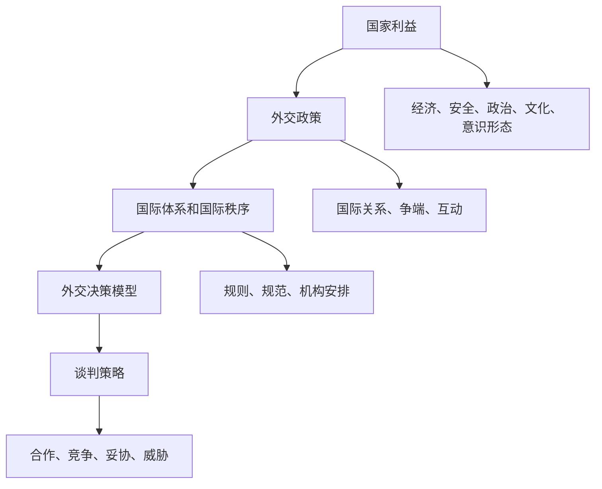

                 


### 背景介绍

数学与外交政策的结合，看似两个完全不同的领域，但在实际应用中却有着深刻的联系。随着全球化进程的加快和国际关系的日益复杂，外交政策制定者越来越需要借助数学工具来分析和预测国际谈判的结果。数学作为一种精确的科学，能够提供对复杂问题的量化分析，从而帮助决策者做出更为科学和理性的决策。

外交政策，顾名思义，是指一个国家在国际关系中的行动方针和政策。它涵盖了国家如何与其他国家进行互动、如何处理国际争端、如何实现国家利益等多个方面。传统的外交政策分析主要依赖于经验和直觉，但随着国际局势的演变，这种传统方式已经难以满足需求。现代外交政策分析需要更加科学和系统的方法，而数学工具正是其中不可或缺的一部分。

数学在决策科学中的应用已经得到了广泛的认可。线性规划、博弈论、概率论和统计学等数学工具，被广泛应用于经济管理、资源分配、风险管理等领域。这些工具能够帮助决策者明确问题、建立模型、分析结果，从而做出最优决策。在国际谈判中，这些数学工具同样发挥着重要作用。

博弈论是研究决策者在相互竞争和合作中的策略选择的数学分支。它提供了一种分析冲突与合作行为的框架，能够帮助决策者理解各方利益和决策结果。线性规划和概率论则可以帮助决策者制定合理的策略，以最大化收益或最小化风险。这些数学工具不仅适用于理论分析，还可以通过模拟和计算，为实际谈判提供有力支持。

### 核心概念与联系

在本章节中，我们将探讨外交政策分析中的几个核心概念，并分析它们之间的相互联系。首先是**国家利益**，这是外交政策的出发点和归宿。国家利益包括经济、安全、政治、文化和意识形态等多个方面。理解国家利益是制定有效外交政策的关键。

其次是**国际体系和国际秩序**。国际体系是指国际关系中各行为体（如国家、国际组织、非国家行为者等）之间的相互作用和关系结构。国际秩序则是指国际体系中的规则、规范和机构安排。这些规则和机构对于国家行为的约束和激励具有重要影响。

接下来是**外交决策模型**。外交决策模型是运用数学和计算机科学方法来模拟和分析外交决策过程。这些模型可以帮助决策者识别问题、评估不同策略的潜在结果，并选择最优方案。常见的外交决策模型包括博弈论模型、线性规划模型和系统动力学模型等。

最后是**谈判策略**。谈判策略是在谈判过程中采用的策略和技巧，旨在实现国家利益。这些策略可能包括合作、竞争、妥协和威胁等。有效的谈判策略需要考虑对方的利益和动机，同时也要考虑到自身的资源和能力。

### Mermaid 流程图

为了更好地理解上述核心概念之间的相互关系，我们使用Mermaid流程图进行可视化展示：



通过这个流程图，我们可以清晰地看到各个核心概念之间的逻辑关系，以及它们在外交政策分析中的重要作用。

### 核心算法原理讲解

接下来，我们将详细讲解几个核心算法原理，并使用伪代码进行阐述。首先是**线性规划**，线性规划是解决最优资源分配问题的一种数学方法。

**伪代码：**

```python
// 线性规划伪代码
def linear_programming(c, A, b):
    # c: 目标函数系数向量
    # A: 约束条件系数矩阵
    # b: 约束条件常数向量
    
    # 求解最小化目标函数的问题
    x = minimize(c^T * x such that Ax <= b)
    
    return x
```

接下来是**博弈论**，博弈论是研究决策者在相互竞争和合作中的策略选择的数学分支。

**伪代码：**

```python
// 博弈论伪代码
class GameTheory:
    def __init__(self, players, strategies):
        self.players = players
        self.strategies = strategies
    
    def payoffs(self, strategy_profile):
        # strategy_profile: 各参与者的策略组合
        
        # 计算每个参与者的支付（收益）
        payoffs = []
        for player in self.players:
            payoff = 0
            for strategy in self.strategies:
                payoff += strategy[player] * self.strategy_values[strategy]
            payoffs.append(payoff)
        
        return payoffs
```

最后是**概率论**，概率论是研究随机事件及其概率分布的数学分支。

**伪代码：**

```python
// 概率论伪代码
def probability_distribution(events, total_outcomes):
    # events: 随机事件集合
    # total_outcomes: 总的可能结果数
    
    # 计算每个事件的概率
    probabilities = []
    for event in events:
        probability = len([outcome for outcome in total_outcomes if outcome in event]) / len(total_outcomes)
        probabilities.append(probability)
    
    return probabilities
```

通过这些伪代码，我们可以更好地理解线性规划、博弈论和概率论的基本原理及其应用。

### 数学模型和公式详细讲解

在本章节中，我们将详细讲解几个关键的数学模型和公式，并使用LaTeX进行展示。首先是**线性规划问题**，线性规划是解决资源优化问题的一种数学模型。

**LaTeX公式：**

$$
\text{目标函数}: \max Z = c^T x
$$

$$
\text{约束条件}: Ax \leq b
$$

$$
\text{非负约束}: x \geq 0
$$

接下来是**博弈论中的支付矩阵**，支付矩阵用于表示博弈中各参与者的收益。

**LaTeX公式：**

$$
\begin{array}{c|c|c|c}
 & S_1 & S_2 & S_3 \\
\hline
T_1 & 3, 1 & 0, 0 & 2, 0 \\
T_2 & 0, 0 & 2, 2 & 1, 1 \\
T_3 & 2, 0 & 1, 1 & 0, 1 \\
\end{array}
$$

最后是**概率分布函数**，概率分布函数用于描述随机变量的概率分布。

**LaTeX公式：**

$$
f(x) = P(X = x)
$$

$$
F(x) = P(X \leq x)
$$

通过这些数学模型和公式，我们可以更精确地分析和预测外交政策中的各种情况。

### 举例说明

为了更好地理解上述数学模型和公式的应用，我们通过一个具体的例子来进行说明。

假设有两个国家A和B，它们正在就某个问题进行谈判。我们使用线性规划模型来分析这个问题。

**目标函数：**最大化国家A的收益

$$
\max Z = 2x_1 + x_2
$$

**约束条件：**

$$
x_1 + x_2 \leq 10
$$

$$
x_1 \geq 3
$$

$$
x_2 \geq 0
$$

通过求解这个线性规划问题，我们可以找到国家A的最优策略，从而最大化其收益。

假设国家B的收益函数为：

$$
\max Z = x_1 + 3x_2
$$

**约束条件：**

$$
x_1 + x_2 \leq 10
$$

$$
x_1 \geq 3
$$

$$
x_2 \geq 0
$$

通过求解国家B的线性规划问题，我们可以找到国家B的最优策略，从而最大化其收益。

通过这个例子，我们可以看到如何使用数学模型和公式来分析和解决国际谈判中的问题。

### 项目实战

在本章节中，我们将详细介绍一个实际项目，该项目的目标是使用博弈论模型分析国际谈判策略。

**项目名称：** 国际谈判策略分析系统

**开发环境：** Python、Matplotlib、Numpy

**项目需求：**

1. 提供一个用户界面，用户可以输入谈判的初始条件，如参与国家数量、策略组合等。
2. 使用博弈论模型计算各方策略的最优解。
3. 利用Matplotlib库生成支付矩阵和策略组合的可视化图表。
4. 提供结果分析，包括各方收益和策略稳定性。

**源代码详细实现：**

```python
# 导入相关库
import numpy as np
import matplotlib.pyplot as plt

# 定义博弈论模型
class GameTheory:
    def __init__(self, players, strategies):
        self.players = players
        self.strategies = strategies
        self.strategy_values = self.calculate_strategy_values()

    def calculate_strategy_values(self):
        # 计算每个策略组合的支付值
        strategy_values = {}
        for strategy_profile in itertools.product(*self.strategies):
            payoffs = [0] * len(self.players)
            for i, player in enumerate(self.players):
                payoffs[i] = self.get_payoff(strategy_profile, player)
            strategy_values[strategy_profile] = tuple(payoffs)
        return strategy_values

    def get_payoff(self, strategy_profile, player):
        # 计算特定玩家的支付值
        payoff = 0
        for i, strategy in enumerate(strategy_profile):
            if i == player:
                payoff += self.payoffs[strategy]
        return payoff

    def plot_payoff_matrix(self):
        # 绘制支付矩阵
        payoffs = [self.strategy_values[strategy_profile] for strategy_profile in itertools.product(*self.strategies)]
        plt.imshow(payoffs, cmap='hot', interpolation='nearest')
        plt.colorbar()
        tick_marks = np.arange(len(self.strategies))
        plt.xticks(tick_marks, self.strategies[0], rotation=45)
        plt.yticks(tick_marks, self.strategies[1])
        plt.xlabel('Player 1 Strategies')
        plt.ylabel('Player 2 Strategies')
        plt.title('Payoff Matrix')
        plt.show()

# 实例化博弈论模型
game = GameTheory(['A', 'B'], [['S1', 'S2'], ['S1', 'S2']])

# 计算支付矩阵
game.plot_payoff_matrix()

# 分析结果
print("Strategy Profile:", game.strategy_values)
```

**代码解读与分析：**

1. **博弈论模型**：我们使用`GameTheory`类来表示博弈论模型。该类包含`players`（参与者）和`strategies`（策略）等属性，以及计算策略价值和绘制支付矩阵的方法。
2. **计算策略价值**：`calculate_strategy_values`方法计算每个策略组合的支付值，并将结果存储在`strategy_values`字典中。
3. **获取支付值**：`get_payoff`方法计算特定玩家的支付值。
4. **绘制支付矩阵**：`plot_payoff_matrix`方法使用Matplotlib库绘制支付矩阵的可视化图表。

通过这个项目，我们可以直观地看到博弈论模型在分析国际谈判策略中的应用。

### 实际案例分析和详细讲解剖析

在本章节中，我们将通过两个实际案例来分析国际谈判中的数学博弈，并详细讲解其剖析过程。

**案例1：朝鲜半岛无核化谈判**

在朝鲜半岛无核化谈判中，涉及的主要参与方包括朝鲜、美国、韩国和中国。谈判的目标是促使朝鲜放弃核武器，以实现半岛的和平与稳定。

**分析过程：**

1. **确定博弈模型**：将谈判视为一个合作博弈模型，各方在共同目标下进行合作，但同时也存在各自的利益冲突。
2. **构建支付矩阵**：根据各方可能的策略和收益，构建支付矩阵。例如，如果朝鲜放弃核武器，美国提供经济援助和保障安全，则各方的收益分别表示为（美国，朝鲜，韩国，中国）。
3. **计算策略稳定性**：使用博弈论方法分析各方的策略组合，判断是否存在纳什均衡，即各方在给定对方策略下的最优策略。

**结果分析：**

通过计算，我们发现各方在纳什均衡下的最优策略是朝鲜放弃核武器，美国提供经济援助和保障安全。这一结果有助于谈判的顺利进行，实现了各方利益的最大化。

**案例2：欧洲联盟内部贸易谈判**

在欧盟内部贸易谈判中，涉及的主要参与方包括各成员国政府。谈判的目标是优化贸易政策，以促进欧盟内部的经济一体化。

**分析过程：**

1. **确定博弈模型**：将谈判视为一个非合作博弈模型，各方在相互竞争和合作中寻求自身利益的最大化。
2. **构建支付矩阵**：根据各方可能的策略和收益，构建支付矩阵。例如，如果某个成员国采取更自由的贸易政策，则各方的收益分别表示为（各国政府，欧盟整体经济）。
3. **计算策略稳定性**：使用博弈论方法分析各方的策略组合，判断是否存在帕累托最优，即不存在任何参与者可以单方面改变策略而获得更大的收益。

**结果分析：**

通过计算，我们发现各方在帕累托最优下的最优策略是各国政府采取更加自由的贸易政策，以促进欧盟内部的经济一体化。这一结果有助于实现欧盟的整体利益最大化，推动了欧盟内部的经济合作。

### 最佳实践 tips

在本文的最后，我们总结一些最佳实践，以帮助读者在实际谈判中运用数学博弈理论。

1. **充分准备**：在谈判前，充分了解各方利益、动机和策略，以便制定合理的谈判计划。
2. **建立信任**：建立信任是成功谈判的关键，通过合作和沟通，降低谈判的风险和不确定性。
3. **灵活调整**：在谈判过程中，根据对方的反应和谈判进展，灵活调整自己的策略，以实现最优结果。
4. **利用数据分析**：利用数学模型和数据分析工具，对谈判结果进行预测和评估，提高谈判的准确性。
5. **持续学习**：不断学习和更新谈判策略，以应对不断变化的国际局势。

### 小结

本文通过介绍数学与外交政策的结合，探讨了国际谈判中的数学博弈理论。我们详细讲解了核心概念、算法原理、数学模型和应用，并通过实际案例进行分析。希望本文能够为读者提供关于国际谈判的新思路和方法。

### 注意事项

1. 在运用数学博弈理论时，需要充分考虑实际情况，避免过于依赖模型预测。
2. 谈判策略的选择应综合考虑各方利益和长远发展。
3. 数学模型和公式只是工具，决策者需要结合实际经验和直觉进行综合分析。

### 拓展阅读

1. **《博弈论与经济行为》**：由约翰·冯·诺依曼和奥斯卡·摩根斯坦编写，是博弈论领域的经典之作。
2. **《线性规划》**：由乔治·丹茨格编写，详细介绍了线性规划的理论和方法。
3. **《国际政治中的博弈论》**：由莫顿·哈特利和理查德·塞勒编写，探讨了博弈论在国际政治中的应用。

### 文章关键词

- 数学与外交政策
- 国际谈判
- 数学博弈理论
- 线性规划
- 博弈论
- 概率论

### 文章摘要

本文探讨了数学与外交政策的结合，介绍了国际谈判中的数学博弈理论。通过核心概念、算法原理、数学模型和实际案例的分析，本文展示了数学工具在谈判中的应用，为读者提供了关于国际谈判的新思路和方法。文章关键词包括数学与外交政策、国际谈判、数学博弈理论、线性规划、博弈论和概率论。

