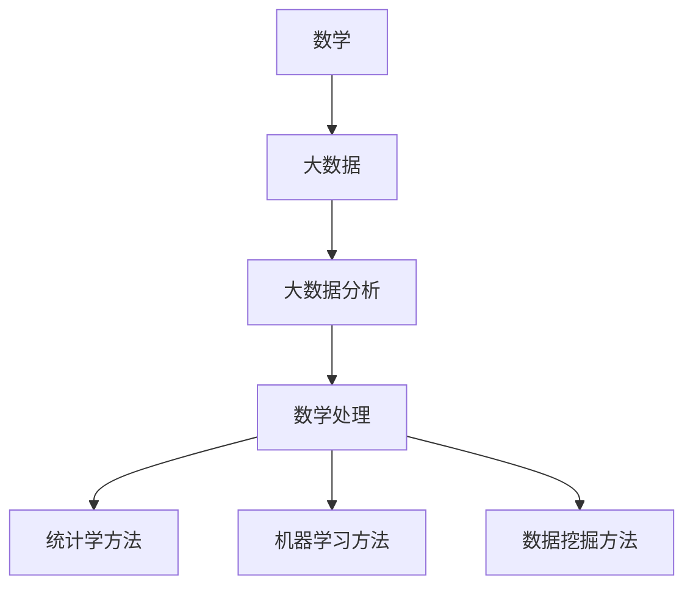
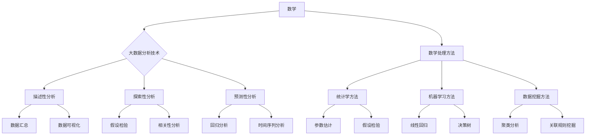

                 

### 文章标题

《数学与大数据分析：海量数据的数学处理》

### 关键词

- 数学
- 大数据分析
- 海量数据处理
- 统计学方法
- 机器学习
- 数据挖掘

### 摘要

本文旨在探讨数学在大数据分析中的应用，以及如何通过数学处理技术高效处理海量数据。文章首先介绍了数学、大数据及其分析的基本概念，随后详细阐述了大数据分析的各类技术，如描述性分析、探索性分析和预测性分析。通过统计学方法、机器学习方法和数据挖掘方法的讲解，本文展示了如何应用数学模型处理大数据。同时，通过实际案例和项目实战，读者可以深入了解大数据分析工具与平台的使用，以及如何进行数据处理的优化。最后，本文总结了一些最佳实践和注意事项，以期为读者提供有益的参考。

## 定义核心概念与联系

在探讨数学与大数据分析的关系之前，我们首先需要明确几个核心概念，并探讨它们之间的联系。以下是本文将讨论的核心概念：

### 数学

数学是一门研究数量、结构、变化和空间的学科，具有严密的逻辑和抽象的思维方式。在数据处理方面，数学提供了基础工具和方法，如代数、几何、微积分等，这些工具和方法被广泛应用于数据分析和建模。

### 大数据

大数据指的是那些数据量巨大、类型多样且生成速度极快的复杂数据集合。大数据具有4V特点：Volume（体量巨大）、Velocity（高速生成）、Variety（类型多样）和Value（数据价值密度低）。大数据的处理和分析需要高效且精确的数学方法。

### 大数据分析

大数据分析是指利用数学、统计学、机器学习和数据挖掘等方法对大数据进行深入分析和解释，以发现数据中的模式和关联，提取有价值的信息，并据此做出决策。大数据分析技术包括描述性分析、探索性分析和预测性分析。

### 数学处理

数学处理是指应用数学模型和算法对数据进行处理，以便更好地理解和解释数据。数学处理方法包括统计学方法、机器学习方法和数据挖掘方法等。

### 核心概念与联系

上述核心概念之间存在紧密的联系。数学为大数据分析提供了基础工具和方法，而大数据则为数学处理提供了研究对象。大数据分析技术，如描述性分析、探索性分析和预测性分析，利用数学模型和算法对大数据进行深入挖掘和解释。数学处理方法则进一步优化了数据分析过程，提高了数据处理的效率。

为了更清晰地展示这些概念之间的联系，我们可以使用Mermaid流程图来表示：



在这个流程图中，数学作为起点，通过大数据分析技术（C）和数学处理方法（D）将数学工具和方法应用于大数据（B），进而实现数据的深入分析和处理。统计学方法、机器学习方法和数据挖掘方法作为数学处理方法的子类别，分别应用于不同的数据分析场景，以实现数据的高效挖掘和解释。

### 2. 设计目录结构

为了系统地阐述数学与大数据分析的关系，我们将文章分为以下几个章节：

## 第1章：数学基础
### 1.1 数学基本概念
### 1.2 数学在数据处理中的应用
### 1.3 数学公式和符号解释

## 第2章：大数据基础
### 2.1 大数据定义与特点
### 2.2 大数据来源与类型
### 2.3 大数据处理技术

## 第3章：大数据分析技术
### 3.1 描述性数据分析
### 3.2 探索性数据分析
### 3.3 预测性数据分析

## 第4章：数学处理方法
### 4.1 统计学方法
### 4.2 机器学习方法
### 4.3 数据挖掘方法

## 第5章：大数据分析案例
### 5.1 案例一：电商用户行为分析
### 5.2 案例二：社交媒体数据挖掘
### 5.3 案例三：健康数据分析

## 第6章：数学模型与应用
### 6.1 数学模型介绍
### 6.2 数学模型应用场景
### 6.3 数学模型优化方法

## 第7章：大数据分析工具与平台
### 7.1 大数据分析工具
### 7.2 大数据平台架构
### 7.3 大数据平台应用案例

这个目录结构涵盖了数学与大数据分析的核心内容，从数学基础到大数据分析技术，再到实际应用和工具平台，形成了一个完整的知识体系。

### 3. 阐述每个章节的核心内容

在确定了目录结构后，我们接下来详细阐述每个章节的核心内容，以便读者能够全面了解数学与大数据分析的关系。

#### 第1章：数学基础

第1章将重点介绍数学基本概念，数学在数据处理中的应用，以及数学公式和符号的解释。以下是每个小节的核心内容：

- **1.1 数学基本概念**：介绍数学的基本概念，如代数、几何、微积分等，以及这些概念在数据处理中的应用。
- **1.2 数学在数据处理中的应用**：探讨数学在数据处理中的具体应用，如线性代数、概率论和统计学等。
- **1.3 数学公式和符号解释**：解释常用的数学公式和符号，如概率公式、统计公式等，以便读者在后续章节中能够更好地理解和应用。

#### 第2章：大数据基础

第2章将介绍大数据的定义、特点、来源和类型，以及大数据处理技术。以下是每个小节的核心内容：

- **2.1 大数据定义与特点**：详细阐述大数据的定义、特点，如4V特点等。
- **2.2 大数据来源与类型**：介绍大数据的来源和类型，如结构化数据、半结构化数据和非结构化数据等。
- **2.3 大数据处理技术**：探讨大数据处理的关键技术，如数据采集、数据存储、数据清洗和数据分析等。

#### 第3章：大数据分析技术

第3章将详细讲解大数据分析的三种技术：描述性分析、探索性分析和预测性分析。以下是每个小节的核心内容：

- **3.1 描述性数据分析**：介绍描述性数据分析的概念、方法和应用，如数据汇总、数据可视化等。
- **3.2 探索性数据分析**：探讨探索性数据分析的概念、方法和应用，如假设检验、相关性分析等。
- **3.3 预测性数据分析**：讲解预测性数据分析的概念、方法和应用，如回归分析、时间序列分析等。

#### 第4章：数学处理方法

第4章将介绍统计学方法、机器学习方法和数据挖掘方法，以及这些方法在大数据分析中的应用。以下是每个小节的核心内容：

- **4.1 统计学方法**：探讨统计学方法的概念、原理和应用，如参数估计、假设检验等。
- **4.2 机器学习方法**：介绍机器学习方法的概念、原理和应用，如线性回归、决策树等。
- **4.3 数据挖掘方法**：讲解数据挖掘方法的概念、原理和应用，如聚类分析、关联规则挖掘等。

#### 第5章：大数据分析案例

第5章将通过具体的案例，展示大数据分析在实际中的应用和效果。以下是每个小节的核心内容：

- **5.1 案例一：电商用户行为分析**：介绍如何利用大数据分析技术进行电商用户行为分析。
- **5.2 案例二：社交媒体数据挖掘**：探讨如何通过社交媒体数据挖掘获取有价值的信息。
- **5.3 案例三：健康数据分析**：讲解如何利用大数据分析技术进行健康数据分析。

#### 第6章：数学模型与应用

第6章将介绍数学模型的基本概念、应用场景和优化方法。以下是每个小节的核心内容：

- **6.1 数学模型介绍**：介绍数学模型的基本概念、类型和作用。
- **6.2 数学模型应用场景**：探讨数学模型在不同领域的应用场景，如经济学、物理学等。
- **6.3 数学模型优化方法**：讲解数学模型的优化方法和技巧，如梯度下降法、牛顿法等。

#### 第7章：大数据分析工具与平台

第7章将介绍大数据分析的工具和平台，以及它们的基本架构和应用案例。以下是每个小节的核心内容：

- **7.1 大数据分析工具**：介绍常见的大数据分析工具，如Python、R、Hadoop等。
- **7.2 大数据平台架构**：探讨大数据平台的基本架构，如Hadoop架构、Spark架构等。
- **7.3 大数据平台应用案例**：讲解大数据平台在实际应用中的案例，如电商大数据平台、金融大数据平台等。

通过以上详细阐述，读者可以全面了解数学与大数据分析的关系，掌握大数据分析的核心技术和方法，并能够应用于实际场景中。接下来，我们将进一步深入探讨数学与大数据分析的具体应用和案例。

### 4. 添加 Mermaid 流程图

为了更好地展示数学与大数据分析的核心概念和联系，我们可以添加一个 Mermaid 流程图。以下是可能的 Mermaid 流程图：



在这个流程图中，数学（A）作为基础，通过大数据分析技术（B）和数学处理方法（F）连接大数据分析的具体技术。描述性分析（C）、探索性分析（D）和预测性分析（E）是大数据分析的三种主要技术，分别对应不同的分析方法。数学处理方法包括统计学方法（G）、机器学习方法（H）和数据挖掘方法（I），这些方法分别应用于不同的数据分析场景。

### 5. 添加伪代码和数学公式

为了详细阐述核心算法原理，我们可以添加伪代码和数学公式。以下是可能的伪代码和数学公式：

```python
# 伪代码：描述性数据分析
def descriptive_analysis(data):
    mean = sum(data) / len(data)
    variance = sum((x - mean) ** 2 for x in data) / len(data)
    std_deviation = sqrt(variance)
    return mean, variance, std_deviation

# 数学公式：线性回归
$$ y = \beta_0 + \beta_1x + \epsilon $$
```

这个伪代码展示了如何计算描述性数据分析中的均值、方差和标准差。数学公式则用于描述线性回归模型，其中 \( y \) 是因变量，\( x \) 是自变量，\( \beta_0 \) 和 \( \beta_1 \) 是回归系数，\( \epsilon \) 是误差项。

### 6. 添加项目实战

为了更好地展示理论在实际中的应用，我们可以添加项目实战。以下是可能的项目实战：

- **项目一：电商用户行为分析**
  - **开发环境搭建**：配置Python环境，安装NumPy、Pandas、Matplotlib等库。
  - **源代码实现**：使用Pandas库读取电商用户数据，进行数据清洗和预处理，然后使用描述性数据分析方法分析用户行为。
  - **代码解读**：解释关键代码的作用，如数据读取、数据清洗和描述性数据分析等。
  - **应用解读**：分析用户行为，如购买频率、购买偏好等，为企业提供营销策略建议。
  - **案例剖析**：结合实际案例，详细讲解电商用户行为分析的具体步骤和结果。

- **项目二：社交媒体数据挖掘**
  - **开发环境搭建**：配置Python环境，安装Tweepy、Pandas、Matplotlib等库。
  - **源代码实现**：使用Tweepy库从Twitter等社交媒体平台获取数据，然后使用探索性数据分析方法挖掘用户兴趣和行为。
  - **代码解读**：解释关键代码的作用，如数据获取、数据清洗和探索性数据分析等。
  - **应用解读**：分析社交媒体用户的行为和兴趣，为营销活动提供支持。
  - **案例剖析**：结合实际案例，详细讲解社交媒体数据挖掘的具体步骤和结果。

- **项目三：健康数据分析**
  - **开发环境搭建**：配置Python环境，安装Pandas、NumPy、Matplotlib、Scikit-learn等库。
  - **源代码实现**：使用Pandas库读取健康数据，进行数据清洗和预处理，然后使用预测性数据分析方法预测健康指标。
  - **代码解读**：解释关键代码的作用，如数据读取、数据清洗和预测性数据分析等。
  - **应用解读**：分析健康数据，预测健康风险，为医疗机构提供参考。
  - **案例剖析**：结合实际案例，详细讲解健康数据分析的具体步骤和结果。

通过这些项目实战，读者可以深入理解数学与大数据分析在实际应用中的具体操作和方法，为后续的学习和实践提供参考。

### 7. 最佳实践 tips、小结、注意事项、拓展阅读等内容

#### 最佳实践 tips

在进行数学与大数据分析时，以下是一些最佳实践建议：

1. **数据质量保障**：确保数据的准确性和完整性，避免数据中的噪声和错误影响分析结果。
2. **选择合适的方法**：根据数据分析目标和数据特点选择合适的方法，如描述性分析适用于理解数据基本特征，预测性分析适用于预测未来趋势。
3. **数据可视化**：使用数据可视化工具和技巧，如散点图、折线图、热力图等，以直观地展示数据分析结果，帮助理解数据。
4. **模型优化**：通过交叉验证、参数调整等方法优化数学模型，提高预测准确性和效率。
5. **团队合作**：数据分析通常需要跨学科合作，如数学、计算机科学、统计学等，团队成员之间的沟通和协作至关重要。

#### 小结

本文系统地探讨了数学与大数据分析的关系，从核心概念、方法到实际应用，全面介绍了大数据分析的技术和方法。通过数学处理技术，大数据得以被有效分析和解释，从而为各个领域提供了有力的数据支持。

#### 注意事项

1. **数据处理过程**：在处理大数据时，需要注意数据清洗、数据集成和数据变换等步骤，确保数据的准确性和一致性。
2. **模型选择**：选择合适的数学模型和算法对于数据分析结果至关重要，需要根据数据特点和分析目标进行选择。
3. **数据隐私与安全**：在处理和分析大数据时，需要重视数据隐私和安全性，遵循相关法律法规和道德标准。

#### 拓展阅读

- **《大数据分析实战：从数据到决策》**：本书详细介绍了大数据分析的实战技巧和方法，适合希望深入了解大数据分析实践的读者。
- **《机器学习：实战与应用》**：本书涵盖了机器学习的基础知识、算法和应用，适合希望学习机器学习的读者。
- **《数据挖掘：概念与技术》**：本书介绍了数据挖掘的基本概念、技术和方法，适合希望了解数据挖掘技术的读者。

通过以上内容，读者可以全面了解数学与大数据分析的关系，掌握大数据分析的核心技术和方法，并为未来的学习和实践奠定坚实基础。

