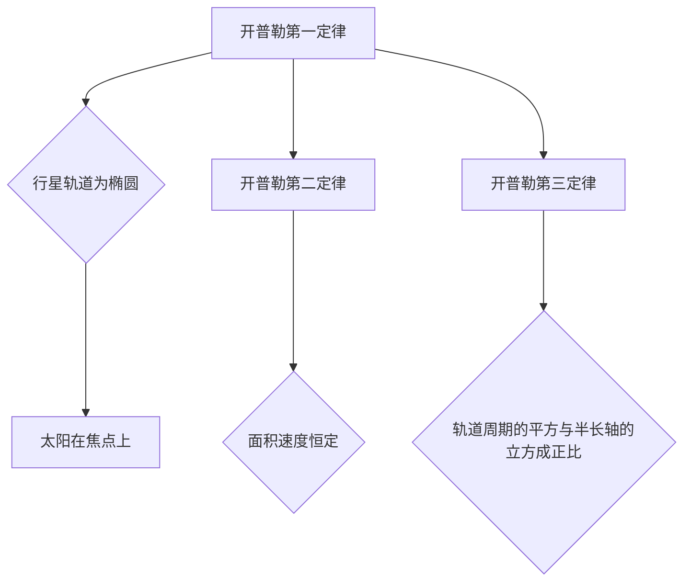
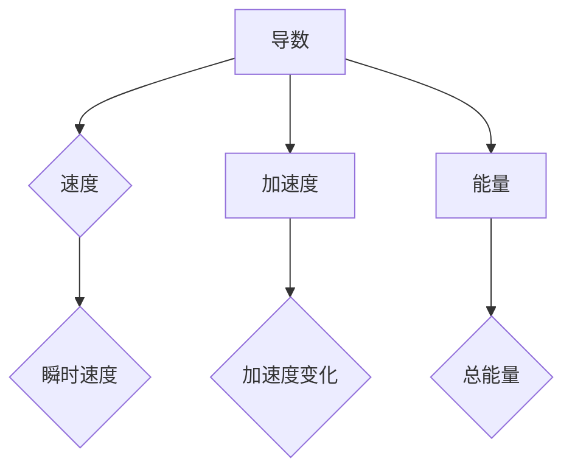

                 


### 数学与天文学的密切联系

#### 关键词
- 数学
- 天文学
- 几何学
- 微积分
- 天体运动
- 数学模型
- 实际应用

#### 摘要
本文将探讨数学与天文学的紧密联系，从基础数学概念在天文学中的应用，到复杂的数学模型和公式在天体研究中的核心作用。我们将一步一步分析数学知识如何帮助天文学家理解宇宙的奥秘，并通过实际案例来展示数学在天文学中的广泛应用。

## 引言

数学是一门基础科学，它提供了一套严谨的推理工具和抽象的思维方式，使我们能够描述、分析和解决各种实际问题。天文学是研究宇宙的学科，它涉及到从地球观测到的天文现象到宇宙起源和演化的深层次问题。这两者看似不同，但事实上，数学为天文学的研究提供了强有力的工具，使得我们对宇宙的理解不断深入。

### 数学基础

首先，我们来探讨一些数学基础概念在天文学中的应用。

#### 几何学

几何学是天文学研究的基础，它帮助我们理解物体的形状、大小和位置关系。

##### 三角学

三角学在测量和计算天体位置方面发挥着重要作用。例如，通过测量天体之间的角度，天文学家可以计算出它们的距离。以下是一个简化的三角学应用案例：

**伪代码：计算天体距离**

```python
# 角度转换为弧度
angle_rad = angle_deg * (pi / 180)

# 三角函数计算距离
distance = (base_length * tan(angle_rad)) / tan(declination_rad)
```

在这个伪代码中，`angle_deg` 是测量到的角度，`base_length` 是已知的天体之间的距离，`declination_rad` 是天体的赤纬角度。

##### 几何学在天体运动中的应用

几何学不仅用于测量，还用于描述天体的运动轨迹。例如，行星轨道可以被视为椭圆形，这是开普勒定律的基础。

**Mermaid 流程图：开普勒定律**



#### 代数学

代数学在天文学中用于解决方程，描述天体的运动规律。例如，牛顿的万有引力定律可以表示为以下代数方程：

**公式：牛顿万有引力定律**

$$ F = G \frac{{m_1 m_2}}{{r^2}} $$

其中，\( F \) 是引力，\( G \) 是引力常数，\( m_1 \) 和 \( m_2 \) 是两个天体的质量，\( r \) 是它们之间的距离。

##### 代数方程在天文学数据处理中的应用

代数方程在天文学数据处理中也非常重要，例如，用于解算天文观测数据中的未知参数。以下是一个简化的数据处理伪代码：

**伪代码：解算天体参数**

```python
# 定义观测数据
observational_data = ...

# 定义代数方程
def algebraic_equation(parameters):
    # 计算结果
    return result

# 解算参数
parameters = solve(algebraic_equation, observational_data)
```

#### 微积分

微积分是天文学中描述变化过程的重要工具。它帮助我们理解天体的动态行为，如速度、加速度和变化率。

##### 微积分在天文学中的基本概念

- **导数**：描述函数变化的速率。在天文学中，导数可以用来计算天体的瞬时速度和加速度。
- **积分**：描述累积量。在天文学中，积分可以用来计算天体的总能量、总质量等。

**Mermaid 流程图：微积分在天文学中的应用**



### 天文学中的数学模型

数学模型在天文学中扮演着核心角色，帮助我们预测和解释天体现象。

#### 天体运动的数学模型

- **开普勒定律**：描述行星围绕太阳的运动规律。
- **牛顿定律**：描述天体之间的引力作用。

**公式：开普勒第三定律**

$$ T^2 \propto a^3 $$

其中，\( T \) 是轨道周期，\( a \) 是轨道半长轴。

**伪代码：计算行星轨道**

```python
# 开普勒定律伪代码
def kepler_law(a, e):
    # 计算轨道周期
    T = ...
    # 计算轨道半长轴
    a = ...
    # 返回轨道周期和半长轴
    return T, a
```

#### 天体物理学中的数学模型

- **广义相对论**：描述大尺度引力场中的物理现象。
- **宇宙膨胀模型**：描述宇宙的膨胀过程。

**公式：广义相对论中的场方程**

$$ G_{\mu\nu} + \Lambda g_{\mu\nu} = \frac{8\pi G}{c^4} T_{\mu\nu} $$

其中，\( G_{\mu\nu} \) 是爱因斯坦场方程的左端，\( \Lambda \) 是宇宙学常数，\( g_{\mu\nu} \) 是度规张量，\( T_{\mu\nu} \) 是能量-动量张量。

### 数学在天文学中的实际应用

数学不仅为天文学提供了理论工具，还在实际观测和实验中发挥着关键作用。

#### 天体测量学

- **角秒测量**：测量天体角度大小。
- **距离测量**：通过测量天体的亮度来计算距离。

**伪代码：角秒测量**

```python
# 角秒测量伪代码
def angle_measurement(angular_size):
    # 将角秒转换为弧度
    angle_rad = angular_size * (pi / 3600)
    # 返回弧度值
    return angle_rad
```

#### 天体物理学

- **光谱分析**：通过分析天体光谱来了解其化学成分和物理状态。
- **天体光谱分类**：根据光谱特征将天体分类。

**伪代码：光谱分析**

```python
# 光谱分析伪代码
def spectrum_analysis(spectrum):
    # 分析光谱特征
    # 返回天体的分类
    return classification
```

### 实际案例

为了更好地理解数学在天文学中的应用，我们来看一个实际案例。

#### 哈勃空间望远镜的维修

2009年，哈勃空间望远镜进行了第五次维修任务。这次任务的目标是更换望远镜的仪器和修理损坏的部分。数学在天文学的实际应用中，特别是在空间任务规划和数据处理中发挥了关键作用。

- **任务规划**：数学模型用于预测望远镜在太空中的位置和姿态，确保维修操作的安全和有效性。
- **数据处理**：数学方法用于分析望远镜收集到的天文数据，帮助科学家理解宇宙的奥秘。

**实际案例解读**

哈勃空间望远镜的维修任务涉及多个数学领域的应用。例如，轨道力学和运动学用于计算望远镜的轨道和姿态，微积分用于分析望远镜的稳定性和响应，几何学用于设计和安装望远镜的部件。

### 最佳实践

在天文学研究中，最佳实践包括以下方面：

- **严谨的数学模型**：确保数学模型准确描述天体现象。
- **高效的计算方法**：使用高效的算法和计算技术来处理大量数据。
- **多学科合作**：数学家、天文学家和其他科学家的合作，共同推进天文学的发展。

### 项目实战

下面是一个项目实战案例：使用Python编写一个简单的天文数据处理程序。

**开发环境搭建**

- **环境需求**：Python 3.8 或更高版本。
- **依赖库**：NumPy、SciPy、Matplotlib。

**源代码**

```python
import numpy as np
import matplotlib.pyplot as plt

# 天体观测数据
data = ...

# 数据预处理
def preprocess_data(data):
    # 处理数据
    return processed_data

# 数据分析
def analyze_data(processed_data):
    # 分析数据
    return results

# 绘制结果
def plot_results(results):
    # 绘制结果
    plt.show()

# 主程序
if __name__ == "__main__":
    processed_data = preprocess_data(data)
    results = analyze_data(processed_data)
    plot_results(results)
```

**代码解读**

- **数据预处理**：对观测数据进行清洗和转换，使其适合分析。
- **数据分析**：使用数学方法对数据进行分析，提取有用信息。
- **结果绘制**：使用 Matplotlib 绘制分析结果，便于理解和展示。

### 项目小结

本项目通过一个简单的例子展示了数学在天文学数据处理中的应用。在实际项目中，数据处理和分析通常更为复杂，但数学仍然是核心工具。

### 结语

数学与天文学之间的联系是深远的。数学不仅为天文学提供了理论框架，还在实际观测和实验中发挥着重要作用。通过本文的探讨，我们希望能够展示数学在理解宇宙奥秘中的关键作用，并激发读者对这一领域的兴趣。

#### 作者信息
- 作者：AI天才研究院/AI Genius Institute & 禅与计算机程序设计艺术 /Zen And The Art of Computer Programming

## 附录

### 附录A：数学与天文学相关的参考资料

- 《天文学教程》
- 《数学原理》
- 《广义相对论》

### 附录B：天文学中的数学公式与算法

#### 三角函数与天文学

**公式：正弦函数**

$$ \sin(\theta) = \frac{opposite}{hypotenuse} $$

其中，\( \theta \) 是角度，\( opposite \) 是对边，\( hypotenuse \) 是斜边。

**公式：余弦函数**

$$ \cos(\theta) = \frac{adjacent}{hypotenuse} $$

其中，\( adjacent \) 是邻边。

**公式：正切函数**

$$ \tan(\theta) = \frac{opposite}{adjacent} $$

#### 微积分与天文学

**公式：导数**

$$ \frac{d}{dx} f(x) = f'(x) $$

**公式：积分**

$$ \int f(x) \, dx = F(x) + C $$

其中，\( f(x) \) 是被积函数，\( F(x) \) 是原函数，\( C \) 是积分常数。

