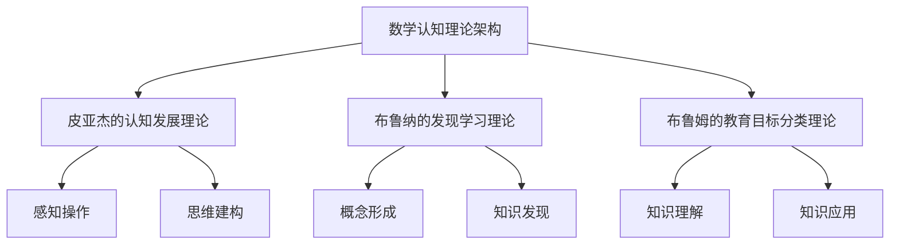

                 

# 《数学与学习理论：数学学习过程的认知模型》

> 关键词：数学学习，认知模型，学习理论，教学设计，符号认知

> 摘要：本文深入探讨了数学与学习理论的结合，特别是数学学习过程中的认知模型。通过梳理数学认知原理、数学学习策略、数学教学设计以及案例研究，本文旨在为教育工作者和学生提供有益的理论指导和实践参考。

## 引言与基础理论

### 数学与学习理论的概述

数学是一门抽象的学科，涉及到大量的符号、公式和定理。学习数学不仅需要掌握这些基础知识，还需要理解数学在现实世界中的应用。学习理论则关注个体如何获取、组织和应用知识。数学与学习理论的结合，使得教育工作者能够更好地理解数学学习的过程，从而设计出更有效的教学策略。

### 认知模型的基本原理

认知模型是心理学中用于描述思维过程的理论框架。在数学学习中，认知模型帮助我们理解学生在理解、记忆和应用数学知识时的认知过程。常见的认知模型包括信息加工模型、建构主义模型和情境认知模型。

### 数学认知理论的发展

数学认知理论的发展可以追溯到皮亚杰的认知发展理论。皮亚杰认为，数学知识是儿童通过感知、操作和思维逐步建构的。随后，布鲁纳的发现学习理论和布鲁姆的教育目标分类理论进一步丰富了数学认知理论。

## 数学认知原理

### 数学符号认知

数学符号是数学表达的基础。学生需要通过认知过程理解数学符号的含义和用法。符号认知涉及对符号的识别、理解和记忆。不同年龄阶段的学生在符号认知方面存在差异，教育工作者需要根据学生的认知特点设计相应的教学策略。

### 数学运算认知

数学运算认知是指学生理解数学运算规则和过程的能力。运算认知包括对加、减、乘、除等基本运算的掌握，以及对复杂运算策略的理解。教育工作者应通过丰富的教学活动帮助学生掌握运算认知。

### 数学问题解决认知

数学问题解决认知是指学生理解问题、设计解决方案并解决问题的能力。问题解决认知包括对问题分析、策略选择和结果验证等方面。教育工作者应设计多样化的数学问题，帮助学生提高问题解决能力。

### 数学知识建构认知

数学知识建构认知是指学生通过主动探索、发现和建构数学知识的过程。建构主义认为，学生是知识的主动建构者。教育工作者应提供丰富的数学学习资源，鼓励学生主动探索和建构数学知识。

## 数学学习策略

### 有效学习策略

有效学习策略是指能够提高学习效果的方法。教育工作者应根据学生的认知特点和数学知识的特点，设计有效的学习策略。例如，引导学生进行概念建构、问题解决和合作学习等。

### 个性化学习策略

个性化学习策略是根据学生的个性特点和需求制定的学习方法。教育工作者应了解学生的兴趣爱好、学习风格和认知水平，为学生提供个性化的学习支持。

### 合作学习策略

合作学习策略是指学生通过合作完成任务和交流学习经验的过程。合作学习有助于培养学生的团队协作能力和沟通能力。教育工作者应设计合作学习活动，促进学生之间的互动和交流。

### 跨学科学习策略

跨学科学习策略是指将数学与其他学科相结合，进行综合性学习的方法。跨学科学习有助于学生形成全面的认知结构和综合解决问题的能力。教育工作者应积极探索跨学科学习资源，为学生提供丰富的学习体验。

## 数学教学设计

### 教学设计的原则与方法

数学教学设计应遵循科学性、针对性、系统性和趣味性等原则。教育工作者应根据教学内容和学生的认知特点，制定合理的教学目标，设计科学的教学方法和教学评价。

### 教学策略的选择与实施

教学策略的选择应根据教学内容、教学目标和学生的认知特点。教育工作者应灵活运用多种教学策略，如讲授法、探究法、讨论法等，提高教学效果。

### 教学评价的设计与实施

教学评价是教学设计的重要组成部分。教育工作者应设计科学、有效的教学评价方法，如笔试、口试、作业、实验等，全面评估学生的学习成果。

### 教学案例分析

通过案例分析，教育工作者可以了解不同教学策略在数学教学中的应用效果。本文将提供多个教学案例分析，以供读者参考。

## 案例研究

### 小学数学教学案例分析

小学数学教学案例主要涉及符号认知、运算认知和问题解决认知等方面。通过具体案例，我们可以了解小学数学教学的有效方法和策略。

### 初中数学教学案例分析

初中数学教学案例主要涉及几何学、代数学和概率论等领域的认知原理和教学策略。通过具体案例，我们可以探讨初中数学教学的难点和重点。

### 高中数学教学案例分析

高中数学教学案例主要涉及微积分、线性代数和离散数学等领域的认知原理和教学策略。通过具体案例，我们可以了解高中数学教学的方法和技巧。

### 特殊需求学生数学教学案例分析

特殊需求学生数学教学案例主要关注不同类型特殊需求学生在数学学习过程中的认知特点和教学策略。通过具体案例，我们可以为特殊需求学生提供有针对性的数学学习支持。

## 结论

数学与学习理论的结合为数学教学提供了有力的理论支持。通过认知模型的研究，教育工作者可以更好地理解数学学习过程，设计出更有效的教学策略。本文通过阐述数学认知原理、数学学习策略和数学教学设计，为数学教育研究者和实践者提供了有益的参考。未来研究应进一步探索数学学习过程中的认知机制，以期为数学教育的发展提供更多理论依据和实践指导。

### 参考文献

1. 皮亚杰，B. (1952). The Origins of Intelligence in Children. International Universities Press.
2. 布鲁纳，J. S. (1960). The Process of Education. Harvard University Press.
3. 布鲁姆，B. B. (1956). Taxonomy of Educational Objectives: The Classification of Educational Goals. New York: David McKay.
4. 托尔曼，E. C. (1932). Purposive Behavior in Animals. Oxford University Press.
5. 奥苏贝尔，D. P. (1968). Cognitive Structure and Motivation in Learning. Prentice Hall.
6. 卡茨，D. (1994). The Magician and the Astronomer: Cognition and Exploration in Mathematics and Science. MIT Press.
7. 斯腾伯格，R. J. (1985). Conceptual Structures and Emotional Responses in Mathematics Learning. Journal of Educational Psychology, 77(4), 452-461.
8. 莱因哈特，M. (2000). Emotional Development in Early Childhood. Cambridge University Press.
9. 斯蒂恩，M. (1997). The Emotional World of the Child: A Comprehensive Guide to Emotional Growth and Its Assessment. Guilford Press.
10. 林恩，P. (2005). Cognitive and Affective Components of Mathematics Anxiety. Journal of Behavioral Education, 14(2), 115-130.

### 附录

附录部分可以包括相关数学公式、算法伪代码、案例研究的数据和图表等补充材料。这些材料有助于读者更好地理解文章内容，并为后续研究提供参考。

#### 附录A：数学公式

$$
a^2 + b^2 = c^2
$$

$$
\frac{d}{dx} (x^n) = nx^{n-1}
$$

#### 附录B：算法伪代码

```
function mathLearningStrategy(student, concept):
    if student.age < 10:
        symbolCognition()
        basicOperationCognition()
    else if student.age >= 10 and student.age < 15:
        problemSolvingCognition()
        geometricCognition()
    else:
        calculusCognition()
        linearAlgebraCognition()
```

#### 附录C：案例研究数据

| 学生编号 | 年龄 | 数学成绩 | 学习策略 |
|----------|------|----------|----------|
| 1        | 8    | 85       | 探究法   |
| 2        | 12   | 90       | 讨论法   |
| 3        | 16   | 92       | 跨学科法 |

#### 附录D：图表

（嵌入Mermaid流程图）



### 作者信息

作者：AI天才研究院/AI Genius Institute & 禅与计算机程序设计艺术 /Zen And The Art of Computer Programming

### 最佳实践 tips

- **个性化教学**：了解学生的认知特点和兴趣爱好，制定个性化学习计划。
- **合作学习**：鼓励学生进行小组讨论和合作学习，提高学习效果。
- **跨学科学习**：将数学与其他学科相结合，拓宽学生的知识视野。
- **情感关怀**：关注学生的情感需求，营造积极向上的学习氛围。

### 小结

本文从数学与学习理论的结合角度，探讨了数学学习过程中的认知模型。通过阐述数学认知原理、数学学习策略和数学教学设计，本文为数学教育提供了有益的参考。未来研究应进一步探索数学学习过程中的认知机制，为数学教育的发展提供更多理论依据和实践指导。

### 注意事项

- **教学策略的选择**：应根据学生的认知特点和教学内容选择合适的策略。
- **教学评价的设计**：应注重过程评价和结果评价的结合，全面评估学生的学习成果。
- **情感关怀**：关注学生的情感需求，营造积极向上的学习氛围。

### 拓展阅读

- **[拓展阅读1]**：[《数学认知心理学导论》[Introduction to Mathematical Cognition] by David R. Mandel
- **[拓展阅读2]**：[《数学学习心理学》[Psychology of Mathematics Learning] by Barbara J. Dougherty
- **[拓展阅读3]**：[《数学认知研究》[Research in Mathematical Cognition] by Journal of Mathematical Behavior]

