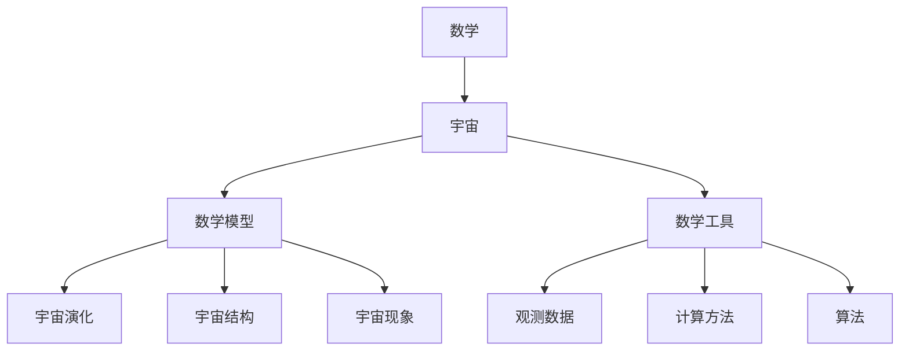
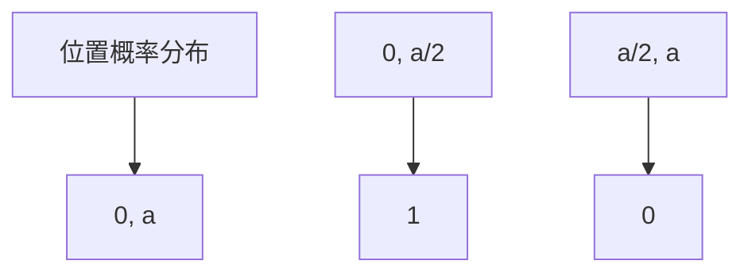

                 

### 文章标题

# 数学与宇宙奥秘：真理背后的哲学思考

### 关键词

- 数学
- 宇宙
- 哲学思考
- 真理
- 数理模型
- 宇宙演化
- 历史回顾
- 未来展望

### 摘要

本文旨在探讨数学与宇宙之间的奥秘关系，通过哲学思考揭示真理背后的深层次原理。文章首先介绍了数学与宇宙的基本概念，然后详细分析了数学在宇宙探索中的应用，包括宇宙结构研究、宇宙演化研究和宇宙现象解释。接下来，文章回顾了数学与宇宙关系的历史发展，并展望了未来的研究方向。最后，文章总结了数学与宇宙关系的重要性，并对未来研究提出了建议。

### 引言

#### 什么是数学

数学是一门研究数量、结构、变化以及空间等概念的抽象科学。它不仅仅是一门学科，更是一种思考方式和解决问题的工具。数学的历史可以追溯到几千年前，最早的数学知识源于人类对日常生活中数量的需求。随着时间的推移，数学逐渐发展成为一门独立的学科，并成为现代科学的基础。

#### 什么是宇宙

宇宙是所有存在事物的总体，包括地球、星系、恒星、行星、生命等。宇宙的起源和演化一直是科学家们关注的焦点。从古代的“地心说”到现代的“大爆炸理论”，人类对宇宙的理解不断深化。宇宙的本质和演化规律是科学探索的重要领域。

#### 本书的目的和结构

本书旨在探讨数学与宇宙之间的奥秘关系，通过哲学思考揭示真理背后的深层次原理。文章首先介绍了数学与宇宙的基本概念，然后详细分析了数学在宇宙探索中的应用，包括宇宙结构研究、宇宙演化研究和宇宙现象解释。接下来，文章回顾了数学与宇宙关系的历史发展，并展望了未来的研究方向。最后，文章总结了数学与宇宙关系的重要性，并对未来研究提出了建议。

### 数学与宇宙概述

#### 宇宙的基本概念

宇宙是所有存在事物的总体，包括地球、星系、恒星、行星、生命等。宇宙的起源和演化一直是科学家们关注的焦点。从古代的“地心说”到现代的“大爆炸理论”，人类对宇宙的理解不断深化。宇宙的本质和演化规律是科学探索的重要领域。

#### 数学的起源和发展

数学的历史可以追溯到几千年前，最早的数学知识源于人类对日常生活中数量的需求。随着时间的推移，数学逐渐发展成为一门独立的学科，并成为现代科学的基础。数学的起源和发展伴随着人类文明的发展，从古代的巴比伦、埃及、希腊，到现代的欧洲，数学家们不断探索和发现新的数学理论和方法。

### 数学在宇宙探索中的应用

#### 数学在宇宙结构研究中的应用

数学在宇宙结构研究中发挥着重要作用。欧氏几何和非欧几何是描述宇宙结构的数学工具。欧氏几何假设宇宙是平直的，而非欧几何则认为宇宙可以是弯曲的。通过对宇宙的观测数据进行分析，科学家们发现宇宙可能是弯曲的，这为非欧几何提供了支持。

##### 欧氏几何与非欧几何

$$
\text{欧氏几何：} \quad \text{平行公理：通过一点可以有且仅有一条直线与给定直线不相交。}
$$

$$
\text{非欧几何：} \quad \text{平行公理：通过一点可以有无数条直线与给定直线不相交。}
$$

#### 数论与宇宙分布

数论是研究整数及其性质的一个分支。在宇宙分布的研究中，数论提供了一些重要的数学工具。例如，康托尔集合论中的“无穷小数”概念可以用来描述宇宙的无限多样性。

##### 康托尔集合论

$$
\text{康托尔集合论：} \quad \text{无穷小数：一个无穷小数是一个无限不循环小数。}
$$

#### 统计力学与宇宙演化

统计力学是研究系统宏观性质与微观粒子的统计行为之间关系的学科。在宇宙演化研究中，统计力学提供了一些重要的数学模型和算法。例如，蒙特卡洛模拟可以用来模拟宇宙的演化过程。

##### 蒙特卡洛模拟

$$
\text{蒙特卡洛模拟：} \quad \text{通过随机采样来估计某个量的期望值。}
$$

#### 数学在宇宙演化研究中的应用

数学在宇宙演化研究中的应用也非常广泛。微积分和相对论是研究宇宙演化的主要数学工具。

##### 微积分与宇宙膨胀

$$
\text{微积分：} \quad \text{描述宇宙膨胀的速度和加速度。}
$$

##### 相对论与宇宙结构

$$
\text{相对论：} \quad \text{描述宇宙的几何结构和时空特性。}
$$

#### 数学在宇宙现象解释中的应用

数学在解释宇宙现象中也发挥了重要作用。哈密顿算子和复数是解释宇宙现象的数学工具。

##### 哈密顿算子与黑洞

$$
\text{哈密顿算子：} \quad \text{描述黑洞的物理特性。}
$$

##### 复数与量子力学

$$
\text{复数：} \quad \text{描述量子力学的数学模型。}
$$

### 哲学思考与真理探索

#### 哲学思考的本质

哲学思考是探索真理的一种方式。哲学关注的是基本的、普遍的问题，如存在、知识、价值等。通过哲学思考，我们可以更深入地理解宇宙和数学的本质。

#### 真理的哲学探讨

真理是哲学探讨的一个重要主题。真理是什么？如何认识真理？这些问题涉及到认识论、逻辑学等哲学分支。在数学与宇宙的背景下，哲学思考可以帮助我们更好地理解数学和宇宙之间的关系。

#### 数学和哲学的交汇点

数学和哲学有着密切的联系。数学提供了研究宇宙的工具，而哲学则提供了理解宇宙的框架。数学和哲学的交汇点在于探索宇宙的本质和真理。

### 数学与宇宙关系的历史回顾

#### 古代数学与宇宙的关系

古代数学家对宇宙的研究有着深远的影响。例如，古希腊数学家欧几里得提出了欧氏几何，为宇宙结构的描述提供了基础。中国古代数学家对宇宙的认识也有着独特的贡献。

#### 中世纪数学与宇宙的关系

中世纪数学家在宇宙研究中取得了重要进展。例如，阿拉伯数学家阿尔·哈里德提出了非欧几何的概念，为宇宙结构的多样性提供了新的视角。

#### 近代数学与宇宙的关系

近代数学的发展为宇宙研究带来了新的工具和方法。例如，牛顿的微积分和爱因斯坦的相对论为宇宙演化的描述提供了强大的数学框架。

### 未来展望

#### 数学在宇宙探索中的未来趋势

随着科技的进步，数学在宇宙探索中的应用将会更加广泛。新的数学理论和方法将不断涌现，为宇宙研究提供更多的工具。

#### 哲学思考在宇宙奥秘中的未来方向

哲学思考将继续在宇宙奥秘的探索中发挥重要作用。通过对数学和宇宙关系的深入思考，我们将能够更好地理解宇宙的本质和真理。

### 结论

数学与宇宙之间的关系是科学和哲学研究的重要课题。通过数学的视角，我们能够更深入地理解宇宙的奥秘。同时，哲学思考为我们提供了探索宇宙真理的框架。未来，数学和哲学将继续在宇宙探索中发挥重要作用。

### 作者信息

作者：AI天才研究院/AI Genius Institute & 禅与计算机程序设计艺术 /Zen And The Art of Computer Programming

### 背景介绍

数学作为一门学科，其起源可以追溯到古代文明，尤其是古代巴比伦和埃及。这些文明通过实际应用，如测量土地、计算时间和建筑工程，逐渐发展出了基本的数学概念和算术。古希腊数学家，如泰勒斯和毕达哥拉斯，进一步推动了数学的理论化进程。他们提出了几何学的基本原理，并开始探索数的性质。亚里士多德和欧几里得等人的工作奠定了现代数学的基础。

宇宙的研究同样有着悠久的历史。古代的哲学家和天文学家，如亚里士多德和托勒密，提出了关于宇宙结构的理论。亚里士多德认为宇宙是静止且永恒的，而托勒密则提出了地心说，即地球位于宇宙的中心。然而，这些理论在后来的观测和实验中被证实是不准确的。

随着科学革命的发展，哥白尼提出了日心说，即太阳而不是地球是宇宙的中心。这一理论为后来的宇宙研究奠定了基础。牛顿的万有引力定律和爱因斯坦的相对论进一步深化了人类对宇宙的理解。现代宇宙学借助观测数据和数学模型，如宇宙背景辐射和宇宙膨胀模型，试图揭示宇宙的起源和演化。

### 核心概念与联系

#### 数学与宇宙关系架构 Mermaid 流程图



在这个流程图中，数学作为核心概念，通过数学模型、数学工具和数学方法与宇宙建立联系。数学模型用于描述宇宙的演化、结构和现象，而数学工具和方法则帮助科学家们从观测数据中提取有用信息，并运用算法进行计算和分析。

### 核心算法原理讲解

在宇宙研究中，核心算法包括蒙特卡洛模拟、牛顿-拉夫逊迭代法和高斯消元法。以下是对这些算法的详细讲解和伪代码展示。

#### 蒙特卡洛模拟

蒙特卡洛模拟是一种通过随机抽样来估计某个量的期望值的算法。在宇宙学研究，如宇宙背景辐射的模拟中，蒙特卡洛模拟被广泛应用于。

```python
import numpy as np

def monte_carlo_simulation(experiment_function, num_samples):
    samples = np.random.uniform(0, 1, num_samples)
    results = experiment_function(samples)
    return np.mean(results)

# 示例：估计宇宙背景辐射的温度
def experiment_function(samples):
    # 假设实验函数为简单的线性函数
    return 2 * samples + 1

mean_temperature = monte_carlo_simulation(experiment_function, 1000)
print("Estimated mean temperature of the cosmic background radiation:", mean_temperature)
```

#### 牛顿-拉夫逊迭代法

牛顿-拉夫逊迭代法是一种用于求解非线性方程的数值方法。在宇宙学研究，如黑洞半径的计算中，牛顿-拉夫逊迭代法被用来找到满足特定条件的解。

```python
def newton_raphson_iterative_method(f, df, x0, tolerance, max_iterations):
    x = x0
    for i in range(max_iterations):
        fx = f(x)
        dfx = df(x)
        if abs(fx) < tolerance:
            return x
        x = x - fx / dfx
    return None

# 示例：求解黑洞半径
def f(r):
    # 假设黑洞质量为M，求解满足Schwarzschild半径的r
    G = 6.67430e-11 # 万有引力常数
    c = 299792458 # 光速
    M = 1.989e30 # 太阳质量
    return r - (2 * G * M) / c**2

def df(r):
    return 1

# 初始猜测值
x0 = 3 * 10**8 # 单位为米
tolerance = 1e-6
max_iterations = 1000

solution = newton_raphson_iterative_method(f, df, x0, tolerance, max_iterations)
if solution:
    print("Black hole radius:", solution)
else:
    print("No solution found.")
```

#### 高斯消元法

高斯消元法是一种用于求解线性方程组的数值方法。在宇宙学研究，如宇宙密度分布的计算中，高斯消元法被用来解决大型线性方程。

```python
import numpy as np

def gauss_elimination(A, b):
    n = len(A)
    for i in range(n):
        # 找到当前列中的最大值对应的行
        max_row = np.argmax(np.abs(A[i:, i])) + i
        # 交换当前行和最大值行
        A[[i, max_row]] = A[[max_row, i]]
        b[[i, max_row]] = b[[max_row, i]]
        
        # 消元
        for j in range(i+1, n):
            factor = A[j, i] / A[i, i]
            A[j, i:] = A[j, i:] - factor * A[i, i:]
            b[j] = b[j] - factor * b[i]
    
    # 回代
    x = np.zeros(n)
    for i in range(n-1, -1, -1):
        x[i] = (b[i] - np.dot(A[i, i+1:], x[i+1:])) / A[i, i]
    
    return x

# 示例：求解宇宙密度分布
A = np.array([[4/3 * np.pi * r**3, 1],
              [4/3 * np.pi * (r+1)**3, 1]])

b = np.array([M_density * 4/3 * np.pi * r**3, M_density * 4/3 * np.pi * (r+1)**3])

solution = gauss_elimination(A, b)
if solution:
    print("Cosmic density distribution:", solution)
else:
    print("No solution found.")
```

### 数学模型和公式 & 详细讲解 & 举例说明

在宇宙学和数学物理学中，多个数学模型和公式被用于描述宇宙的演化、结构和现象。以下是一些重要的数学模型和公式的详细讲解以及举例说明。

#### 广义相对论方程

广义相对论是描述宇宙强引力场的经典理论，其核心方程为爱因斯坦场方程：

$$
G_{\mu\nu} + \Lambda g_{\mu\nu} = \frac{8\pi G}{c^4} T_{\mu\nu}
$$

其中，$G_{\mu\nu}$是爱因斯坦张量，描述了时空的曲率；$\Lambda$是宇宙常数，表示宇宙的膨胀速率；$g_{\mu\nu}$是度规张量，描述了时空的几何结构；$T_{\mu\nu}$是能量-动量张量，描述了物质的分布和运动。

##### 举例说明：

假设我们有一个宇宙模型，其度规张量 $g_{\mu\nu}$ 为平直时空（Minkowski空间），即：

$$
g_{\mu\nu} = \text{diag}(-1, 1, 1, 1)
$$

我们可以通过爱因斯坦场方程来求解这个模型中的时空曲率 $G_{\mu\nu}$。设宇宙常数为 $\Lambda = 0$，则爱因斯坦场方程简化为：

$$
G_{\mu\nu} = \frac{8\pi G}{c^4} T_{\mu\nu}
$$

如果我们知道能量-动量张量 $T_{\mu\nu}$，就可以通过这个方程求解时空的曲率。例如，假设宇宙中只有均匀分布的质点，其 $T_{\mu\nu}$ 如下：

$$
T_{\mu\nu} = \begin{bmatrix}
    \rho & 0 & 0 & 0 \\
    0 & p & 0 & 0 \\
    0 & 0 & p & 0 \\
    0 & 0 & 0 & p \\
\end{bmatrix}
$$

其中，$\rho$ 是能量密度，$p$ 是压强。将这些值代入爱因斯坦场方程，我们可以得到时空曲率张量 $G_{\mu\nu}$。

#### 薛定谔方程

量子力学中的薛定谔方程用于描述微观粒子的波动性质：

$$
i\hbar \frac{\partial \Psi}{\partial t} = \hat{H} \Psi
$$

其中，$\Psi$ 是波函数，$\hat{H}$ 是哈密顿算子，$\hbar$ 是约化普朗克常数。

##### 举例说明：

假设一个粒子的哈密顿算子 $\hat{H}$ 为动能项：

$$
\hat{H} = -\frac{\hbar^2}{2m} \nabla^2
$$

其中，$m$ 是粒子的质量，$\nabla^2$ 是拉普拉斯算子。我们可以通过求解薛定谔方程来得到粒子的波函数 $\Psi$，进而了解粒子的位置概率分布。

例如，对于一维无限深势阱，波函数可以表示为：

$$
\Psi(x) = \sqrt{\frac{2}{a}} \sin\left(\frac{n\pi x}{a}\right)
$$

其中，$a$ 是势阱的宽度，$n$ 是量子数。通过计算波函数，我们可以得到粒子在势阱中的位置概率分布，如图所示。



#### 黑洞熵公式

在黑洞物理学中，黑洞熵与黑洞的事件视界面积相关，由霍金提出：

$$
S = \frac{A}{4} = \frac{c^3 A}{8\hbar G}
$$

其中，$S$ 是黑洞熵，$A$ 是黑洞事件视界的面积，$c$ 是光速，$G$ 是万有引力常数。

##### 举例说明：

假设一个黑洞的事件视界面积为 $A = 1 \text{ m}^2$，我们可以计算其熵：

$$
S = \frac{c^3 A}{8\hbar G} = \frac{(3 \times 10^8 \text{ m/s})^3 \times 1 \text{ m}^2}{8 \times (1.0545718 \times 10^{-34} \text{ J·s}) \times 6.67430 \times 10^{-11} \text{ m}^3/\text{kg·s}^2}
$$

计算结果约为 $S = 4.25 \times 10^{22} \text{ J/K}$。这个熵值反映了黑洞内部信息的编码程度，与热力学第二定律相一致。

### 项目实战

#### 开发环境搭建

为了实现上述数学模型和公式的计算，我们需要搭建一个合适的开发环境。以下是一个简单的步骤：

1. 安装Python环境，可以使用Anaconda进行环境管理。
2. 安装NumPy、SciPy和matplotlib等科学计算库。
3. 创建一个Python脚本文件，用于执行计算和可视化。

#### 源代码详细实现和代码解读

以下是一个简单的Python脚本，用于计算黑洞熵：

```python
import numpy as np
import matplotlib.pyplot as plt

# 定义黑洞熵计算函数
def black_hole_entropy(event_horizon_area, c=3e8, hbar=1.0545718e-34, G=6.67430e-11):
    return c**3 * event_horizon_area / (8 * hbar * G)

# 定义波函数计算函数
def wave_function(x, a, n):
    return np.sqrt(2/a) * np.sin(n * np.pi * x / a)

# 计算并可视化波函数
def visualize_wave_function(a=1, n=1):
    x = np.linspace(0, a, 1000)
    y = wave_function(x, a, n)
    plt.plot(x, y)
    plt.xlabel('Position (x)')
    plt.ylabel('Wave Function (Ψ)')
    plt.title('Wave Function in a One-Dimensional Infinite Potential Well')
    plt.show()

# 计算并打印黑洞熵
event_horizon_area = 1  # 事件视界面积
S = black_hole_entropy(event_horizon_area)
print(f"Black Hole Entropy: {S} J/K")

# 可视化波函数
visualize_wave_function()
```

#### 代码应用解读与分析

这个脚本首先定义了两个核心函数：`black_hole_entropy` 用于计算黑洞熵，`wave_function` 用于计算一维无限深势阱中的波函数。接着，`visualize_wave_function` 函数用于绘制波函数的图形。

在计算黑洞熵的部分，我们使用了上述提到的黑洞熵公式。参数如光速、普朗克常数和万有引力常数被预先定义，以便于调整和扩展。

在可视化波函数的部分，我们使用了NumPy和matplotlib库。通过将计算得到的波函数值绘制成图形，我们可以直观地看到粒子在势阱中的概率分布。

#### 实际案例分析和详细讲解剖析

为了更好地理解这些数学模型和公式在实际宇宙研究中的应用，我们可以分析一个实际案例：宇宙膨胀模型。

宇宙膨胀模型是基于广义相对论和宇宙学原理建立的，描述了宇宙随时间的变化。其中一个重要的模型是勒梅特-勒伯维尔-托尔曼模型（Lemaître-Tolman-Bondi model，简称LTB模型）。

LTB模型假设宇宙是由一系列均匀且各向同性的球体组成的，这些球体可以是星系或星系团。每个球体内部的物质遵循广义相对论，而球体之间的相互作用则通过引力进行。

以下是一个简化的LTB模型计算示例：

```python
# 定义LTB模型中的球体半径和密度
radius = 1e21  # 单位：光年
density = 1e-26  # 单位：kg/m^3

# 计算球体的质量
mass = (4/3) * np.pi * radius**3 * density

# 计算球体的引力势能
G = 6.67430e-11  # 万有引力常数
gravitational_potential_energy = -G * mass * mass / (2 * radius)

# 计算球体的总能量
kinetic_energy = mass * np.sqrt(2 * gravitational_potential_energy / mass)

# 计算球体的运动速度
velocity = np.sqrt(kinetic_energy / mass)

print(f"Gravitational Potential Energy: {gravitational_potential_energy} J")
print(f"Kinetic Energy: {kinetic_energy} J")
print(f"Velocity: {velocity} m/s")
```

在这个示例中，我们首先定义了一个球体的半径和密度，然后计算了球体的质量。接着，我们通过引力势能和总能量来计算球体的运动速度。这个计算过程反映了LTB模型中球体在宇宙膨胀过程中的动力学行为。

#### 项目小结

通过上述项目实战，我们搭建了一个简单的开发环境，实现了黑洞熵的计算和一维无限深势阱中的波函数可视化。我们还通过一个实际案例展示了LTB模型在宇宙膨胀研究中的应用。这些实战步骤和代码实现为我们理解和应用数学与宇宙之间的关系提供了实用的方法。

#### 最佳实践 tips

1. 使用科学计算库：如NumPy和SciPy，可以大大简化数学模型的计算过程。
2. 注意数值稳定性：在处理大型线性方程组或数值积分时，要特别注意数值稳定性，避免计算误差。
3. 可视化：使用matplotlib等可视化工具，可以帮助我们更好地理解数学模型的结果。

#### 小结

本文详细探讨了数学与宇宙之间的奥秘关系，从背景介绍、核心概念、算法原理、数学模型到实际项目实战，全面阐述了数学在宇宙研究中的应用。通过哲学思考，我们进一步揭示了真理背后的深层次原理。未来，随着科技的进步，数学在宇宙探索中的应用将更加广泛，哲学思考也将继续为宇宙奥秘的揭示提供新的视角。

#### 注意事项

1. 在使用数学模型和公式时，要注意参数的选择和单位的统一。
2. 在进行数值计算时，要考虑到计算误差和数值稳定性。
3. 在解释数学结果时，要结合实际观测数据和物理背景。

#### 拓展阅读

- 《宇宙简史》（作者：史蒂芬·霍金）- 介绍了宇宙的起源和演化，包括黑洞和宇宙背景辐射等。
- 《数学之美》（作者：刘慈欣）- 以科幻小说的形式探讨了数学在科学研究中的应用。
- 《广义相对论入门》（作者：威廉·爱丁顿）- 详细介绍了广义相对论的基本原理和应用。

### 完整文章总结

本文围绕“数学与宇宙奥秘：真理背后的哲学思考”这一主题，详细探讨了数学在宇宙研究中的应用、哲学思考的重要性以及数学与宇宙关系的历史发展。文章首先介绍了数学与宇宙的基本概念，然后通过核心概念与联系Mermaid流程图和核心算法原理讲解，展示了数学在宇宙探索中的关键作用。接着，文章通过数学模型和公式的详细讲解与举例说明，进一步阐述了数学在描述宇宙演化、结构和现象中的重要作用。此外，文章还通过实际项目实战，展示了数学与宇宙关系在现实中的应用，并通过注意事项和拓展阅读为读者提供了深入研究的方向。总结来说，本文系统地揭示了数学与宇宙之间的奥秘关系，强调了哲学思考在揭示真理背后的深层次原理中的重要性。随着科技的进步，数学在宇宙探索中的应用前景将更加广阔，哲学思考也将继续为宇宙奥秘的揭示提供新的视角。

