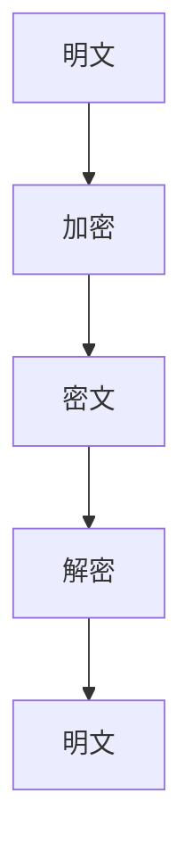
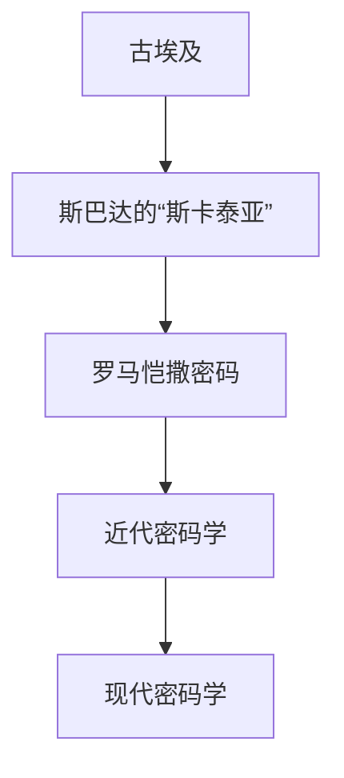
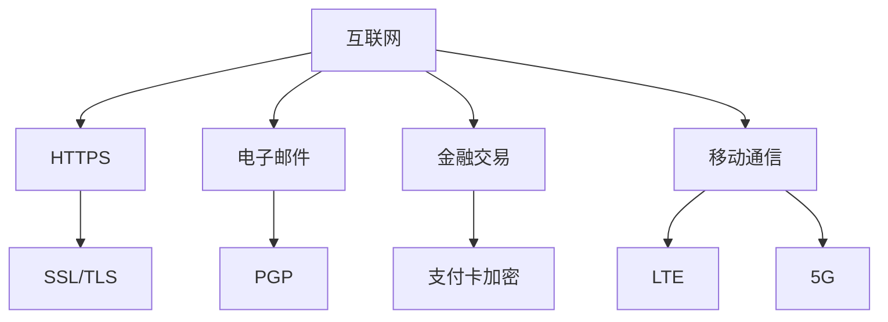
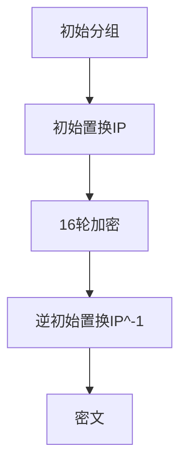
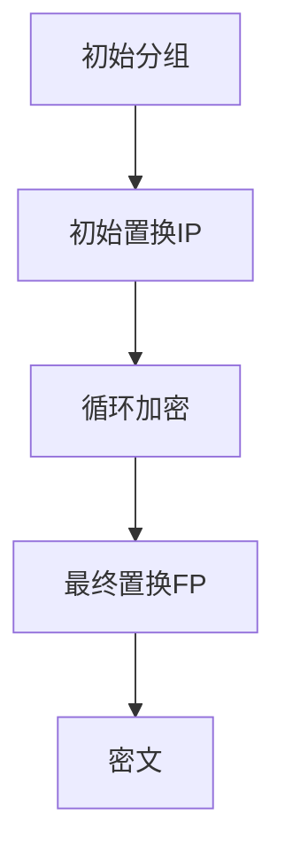
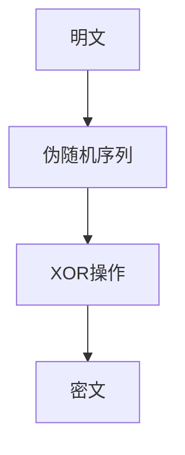

                 

### **文章标题**
数学与密码学：信息加密的数学原理

### **关键词**
密码学、信息加密、数学原理、对称加密、非对称加密、加密算法、信息安全

### **摘要**
本文将深入探讨密码学的数学原理，从基础概念到核心算法，全面解析信息加密的数学机制。我们将首先介绍密码学的基本概念和其在现代通信中的重要性，接着详细分析对称密码体制和非对称密码体制的原理与应用。随后，我们将讨论密码分析的方法及其在安全性评估中的作用。接着，我们将深入数学原理，包括代数结构基础、数论基础以及离散对数与指数。在此基础上，我们将详细讲解对称密码算法和非对称密码算法的工作原理，并通过具体的例子和伪代码来展示其实现过程。最后，我们将探讨密码学在实际应用中的案例，包括TLS/SSL协议、数字签名与认证、隐私保护等，并展望密码学的未来发展趋势。

### **正文**

## **第一部分：密码学基础**

### **1.1 密码学概述**

#### **1.1.1 密码学的基本概念**

密码学是研究信息加密和解密的一门科学，其目的是确保信息的保密性、完整性和真实性。在密码学中，加密（Encryption）是将明文（Plaintext）转换为密文（Ciphertext）的过程，而解密（Decryption）则是将密文转换为明文的过程。

**核心概念与联系：**

为了更好地理解密码学的基本概念，我们可以使用Mermaid流程图来展示其基本流程：

#### **1.1.2 密码学的历史发展**

密码学的历史可以追溯到古代，最早的密码学应用是斯巴达的“斯卡泰亚”（Scytale）密码，这是一种通过将纸卷在杆上绕圈来加密信息的方法。随着技术的发展，密码学经历了多次变革和演进。

**时间线图：**

**关键事件与人物：**

- **古埃及**：使用象形文字加密信息。
- **罗马恺撒**：提出了著名的恺撒密码，这是一种简单的替换密码。
- **近代密码学**：贝蒂斯·贝尔莱米（Beauregard Berlemy）提出了乘法密码，这是一种多表代替密码。
- **现代密码学**：艾伦·佩斯卡（Alfred Pescatore）和哈罗德·尤因（Harold Even）在1976年提出了RSA密码体制，这是第一个既能保证通信的保密性又能实现密钥分配的密码体制。

#### **1.1.3 密码学在现代通信中的重要性**

在现代通信中，密码学扮演着至关重要的角色。它确保了互联网、移动通信、金融交易等领域的信息安全。以下是密码学在现代通信中的几个关键应用：

- **互联网安全**：HTTPS协议通过使用SSL/TLS协议来确保Web通信的安全。
- **电子邮件加密**：PGP（GnuPG）和S/MIME协议用于加密电子邮件内容。
- **金融交易**：加密技术用于保护支付卡和在线交易的安全性。
- **移动通信**：LTE和5G网络使用AES和RSA等加密算法来保护用户数据。

**现代通信中的密码学应用：**

**密码学在网络安全中的地位：**

密码学是网络安全的核心技术，它不仅提供了数据的保密性，还确保了数据的完整性和真实性。没有强大的密码学支持，现代通信和网络基础设施将无法安全运行。

### **1.2 密码体制**

密码体制是密码学中的核心概念，根据加密和解密过程中密钥的使用方式，密码体制可以分为对称密码体制和非对称密码体制。

#### **1.2.1 对称密码体制**

对称密码体制使用相同的密钥进行加密和解密。在这种体制中，加密算法和解密算法是相互逆的。

##### **1.2.1.1 分组密码**

分组密码将明文分成固定大小的组，然后对每组进行加密。DES（数据加密标准）和AES（高级加密标准）是两种著名的分组密码算法。

**DES密码算法的结构：**

**AES算法的工作流程：**

##### **1.2.1.2 序列密码**

序列密码使用一个伪随机序列对明文进行加密。每个明文字符与序列中的字符进行异或操作，生成密文。例如，RC4是一种著名的序列密码算法。

**RC4算法的工作流程：**

#### **1.2.2 非对称密码体制**

非对称密码体制使用一对密钥，一个用于加密，另一个用于解密。这种体制基于数学难题，如大数分解和离散对数问题。

##### **1.2.2.1 RSA密码体制**

RSA密码体制是一种基于大数分解问题的非对称加密算法。它使用一对密钥，一个公钥用于加密，一个私钥用于解密。

**RSA算法的数学原理：**

设 \( p \) 和 \( q \) 是两个大素数，则 \( n = p \times q \) 是一个半素数。计算 \( \phi(n) = (p-1) \times (q-1) \)。选择一个与 \( \phi(n) \) 互质的整数 \( e \)，计算 \( d \) 使得 \( d \times e \equiv 1 \pmod{\phi(n)} \)。则 \( (e, n) \) 为公钥，\( (d, n) \) 为私钥。

**RSA算法的密钥生成与加密解密过程：**

- **密钥生成：**
  - 选择两个大素数 \( p \) 和 \( q \)。
  - 计算 \( n = p \times q \)。
  - 计算 \( \phi(n) = (p-1) \times (q-1) \)。
  - 选择一个与 \( \phi(n) \) 互质的整数 \( e \)。
  - 计算 \( d \) 使得 \( d \times e \equiv 1 \pmod{\phi(n)} \)。

- **加密：**
  - 公钥 \( (e, n) \) 用于加密。
  - 明文 \( M \) 被转换为 \( C = M^e \pmod{n} \)。

- **解密：**
  - 私钥 \( (d, n) \) 用于解密。
  - 密文 \( C \) 被转换为 \( M = C^d \pmod{n} \)。

##### **1.2.2.2 Diffie-Hellman密钥交换协议**

Diffie-Hellman密钥交换协议是一种用于两个通信方安全交换密钥的协议。它基于离散对数问题。

**Diffie-Hellman密钥交换的数学原理：**

设 \( p \) 是一个大素数，\( g \) 是 \( p \) 的一个原根。Alice选择一个秘密数 \( a \)，计算 \( A = g^a \pmod{p} \)。Bob选择一个秘密数 \( b \)，计算 \( B = g^b \pmod{p} \)。然后，Alice和Bob都可以计算出共同密钥 \( K = B^a \pmod{p} \)。

**Diffie-Hellman密钥交换的工作流程：**

1. Alice选择一个秘密数 \( a \)，计算 \( A = g^a \pmod{p} \) 并发送给Bob。
2. Bob选择一个秘密数 \( b \)，计算 \( B = g^b \pmod{p} \) 并发送给Alice。
3. Alice计算 \( K = B^a \pmod{p} \)。
4. Bob计算 \( K = A^b \pmod{p} \)。

双方最终都得到了相同的共同密钥 \( K \)。

##### **1.2.2.3 ElGamal密码体制**

ElGamal密码体制是一种基于离散对数问题的非对称加密算法。它不仅用于加密，还用于数字签名。

**ElGamal密码体制的数学原理：**

设 \( p \) 是一个大素数，\( g \) 是 \( p \) 的一个原根。Alice选择一个秘密数 \( a \)，计算 \( y = g^a \pmod{p} \)。然后，Alice计算公钥 \( (y, p, g) \) 并公开。Bob要发送一个消息 \( m \) 给Alice，他会选择一个临时密钥 \( k \)，计算加密消息 \( c_1 = g^k \pmod{p} \) 和 \( c_2 = m \times y^k \pmod{p} \)。然后，Bob发送 \( (c_1, c_2) \) 给Alice。Alice使用她的私钥 \( a \) 解密消息 \( m = c_2 \times g^{c_1} \pmod{p} \)。

**ElGamal算法的密钥生成与加密解密过程：**

- **密钥生成：**
  - 选择一个秘密数 \( a \)，计算 \( y = g^a \pmod{p} \)。

- **加密：**
  - 选择一个临时密钥 \( k \)，计算 \( c_1 = g^k \pmod{p} \) 和 \( c_2 = m \times y^k \pmod{p} \)。

- **解密：**
  - 使用私钥 \( a \) 解密消息 \( m = c_2 \times g^{c_1} \pmod{p} \)。

### **1.3 密码分析**

密码分析是密码学的一个重要分支，它研究如何破解加密信息。密码分析可以分为不同类型，如穷举攻击、选择明文攻击和选择密文攻击。

##### **1.3.1.1 穷举攻击**

穷举攻击是一种最简单的密码分析方法，它通过尝试所有可能的密钥来破解加密信息。这种方法在密钥空间较小的情况下是有效的，但在密钥空间较大时，计算量会非常巨大。

**穷举攻击的数学原理：**

设加密算法的密钥空间为 \( K \)，则穷举攻击的时间复杂度为 \( |K| \)。

##### **1.3.1.2 密码分析中的概率论与统计学**

密码分析中常常使用概率论和统计学方法来提高破解加密信息的概率。例如，通过分析加密数据的统计特性，可以推断出可能的密钥。

**概率论与统计学方法的应用：**

- **频率分析**：通过分析密文中字符的频率分布来猜测可能的密钥。
- **选择明文攻击**：攻击者可以选择明文并观察加密结果，从而推断出加密算法的某些特性。

##### **1.3.1.3 选择明文攻击与选择密文攻击**

选择明文攻击（Chosen-Plaintext Attack）和选择密文攻击（Chosen-Ciphertext Attack）是密码分析中的两种重要攻击方式。

**选择明文攻击：**

攻击者可以选择明文并观察加密结果，从而推断出加密算法的某些特性。例如，通过重复加密相同的明文，攻击者可以尝试推断出密钥的一部分。

**选择密文攻击：**

攻击者可以选择密文并请求解密结果，从而推断出加密算法的某些特性。例如，通过请求解密密文的某些部分，攻击者可以尝试推断出密钥的一部分。

### **第二部分：数学原理**

#### **2.1 代数结构基础**

代数结构是密码学中的基础，包括群、环和域。

##### **2.1.1 群、环、域的基本概念**

- **群（Group）**：一个集合 \( G \) 和一个二元运算 \( \cdot \) 构成的系统，满足结合律、单位元和逆元。
- **环（Ring）**：一个集合 \( R \) 和两个二元运算 \( + \) 和 \( \cdot \) 构成的系统，满足加法群和乘法半群的条件。
- **域（Field）**：一个集合 \( F \) 和两个二元运算 \( + \) 和 \( \cdot \) 构成的系统，满足加法群、乘法半群和无零因子。

##### **2.1.2 线性代数基础**

线性代数是密码学中的另一个基础，包括矩阵、向量、行列式等概念。

**线性代数的基本概念：**

- **矩阵（Matrix）**：由数字组成的矩形阵列。
- **向量（Vector）**：具有大小和方向的量。
- **行列式（Determinant）**：矩阵的一个数值属性，用于解决线性方程组和计算矩阵的逆。

##### **2.1.3 多项式环与理想**

多项式环是密码学中常用的一种代数结构，特别是在非对称密码体制中。

**多项式环的基本概念：**

- **多项式环（Polynomial Ring）**：由多项式构成的环。
- **理想（Ideal）**：环中的一个子集，满足某些特定的性质。

### **2.2 数论基础**

数论是密码学中的另一个基础，包括素数、模运算、中国剩余定理等概念。

##### **2.2.1 大数定律**

大数定律是数论中的一个重要定理，它描述了在重复实验中，某些概率事件的发生频率将接近其概率值。

**大数定律的数学原理：**

设 \( X_1, X_2, \ldots, X_n \) 是独立同分布的随机变量，\( \bar{X}_n = \frac{X_1 + X_2 + \ldots + X_n}{n} \) 是样本均值。则当 \( n \) 趋近于无穷大时，\( \bar{X}_n \) 趋近于 \( \mu \)，即样本均值的极限是总体均值的概率接近1。

##### **2.2.2 模运算**

模运算是一种基本的数论运算，用于计算两个整数的余数。

**模运算的基本原理：**

设 \( a \) 和 \( n \) 是两个整数，则 \( a \bmod n \) 是 \( a \) 除以 \( n \) 的余数。

##### **2.2.3 中国剩余定理**

中国剩余定理是一种解决同余方程组的方法，它在密码学中有着广泛的应用。

**中国剩余定理的基本原理：**

设 \( n_1, n_2, \ldots, n_k \) 是两两互质的整数，\( a_1, a_2, \ldots, a_k \) 是任意整数。则同余方程组

$$
x \equiv a_1 \pmod{n_1} \\
x \equiv a_2 \pmod{n_2} \\
\vdots \\
x \equiv a_k \pmod{n_k}
$$

有解，并且解是唯一的模 \( n_1n_2\ldots n_k \)。

### **2.3 离散对数与指数**

离散对数和指数在密码学中有着重要的应用，特别是在非对称密码体制中。

##### **2.3.1 离散对数的定义与性质**

离散对数是指数的逆运算，用于计算在模 \( n \) 下的指数。

**离散对数的定义：**

设 \( g \) 是 \( n \) 的一个原根，则对任意整数 \( a \)，\( \log_g a \) 是满足 \( g^{\log_g a} \equiv a \pmod{n} \) 的整数。

**离散对数的性质：**

- **单调性**：如果 \( a < b \pmod{n} \)，则 \( \log_g a < \log_g b \pmod{n-1} \)。
- **加法法则**：\( \log_g (a \times b) = \log_g a + \log_g b \pmod{n-1} \)。
- **乘法法则**：\( \log_g (a^b) = b \times \log_g a \pmod{n-1} \)。

##### **2.3.2 离散对数在密码学中的应用**

离散对数在密码学中有着广泛的应用，特别是在非对称密码体制中。例如，在RSA密码体制中，离散对数用于计算私钥 \( d \)。

##### **2.3.3 指数运算在密码学中的作用**

指数运算在密码学中也有着重要的应用，特别是在非对称密码体制中。例如，在ElGamal密码体制中，指数运算用于加密和解密消息。

### **2.4 模幂运算**

模幂运算是密码学中常用的一种运算，用于计算在模 \( n \) 下的幂。

**模幂运算的基本原理：**

设 \( a \) 和 \( n \) 是两个整数，则 \( a^b \pmod{n} \) 是 \( a \) 的 \( b \) 次幂除以 \( n \) 的余数。

**模幂运算的性质：**

- **单调性**：如果 \( a < b \pmod{n} \)，则 \( a^b < b^a \pmod{n} \)。
- **结合律**：\( (a^b)^c = a^{bc} \pmod{n} \)。
- **交换律**：\( a^b \equiv b^a \pmod{n} \)。

### **第三部分：密码学算法原理**

#### **3.1 对称密码算法原理**

对称密码算法是一类使用相同密钥进行加密和解密的密码算法。它们通常基于复杂的数学原理，使得破解变得非常困难。

##### **3.1.1 DES密码算法**

DES（数据加密标准）是一种经典的对称密码算法，由美国国家标准局（NBS）于1977年发布。

**DES算法的结构：**

DES算法由三个主要部分组成：初始置换IP、16轮加密和逆初始置换IP^-1。

- **初始置换IP**：将64位的明文进行初始置换，分为左右两部分。
- **16轮加密**：对左右两部分分别进行加密，每轮加密包括扩展置换、替换和置换。
- **逆初始置换IP^-1**：将加密后的64位密文进行逆置换，得到最终密文。

**DES算法的工作流程：**

1. 初始置换IP：将明文分为左右两部分。
2. 执行16轮加密：
   - 扩展置换：将每28位扩展为48位。
   - 替换：使用S-Box进行替换。
   - 置换：将替换后的结果进行置换。
3. 逆初始置换IP^-1：将加密后的64位密文进行逆置换，得到最终密文。

##### **3.1.2 AES密码算法**

AES（高级加密标准）是DES的后继，是一种更安全的对称密码算法。

**AES算法的特点：**

- **更短的密钥长度**：AES支持128、192和256位密钥长度。
- **更高效的实现**：AES使用固定的轮数和更简单的替换和置换操作，使得其计算速度更快。
- **更安全的结构**：AES采用了更复杂的密钥扩展和轮密钥生成机制。

**AES算法的工作流程：**

1. 初始置换：将128位的明文分为四块，每块32位。
2. 执行10-14轮加密（取决于密钥长度）：
   - 字节替换：使用S-Box进行替换。
   - 行移位：对每一行的字节进行循环左移。
   - 列混淆：对每一列进行混淆。
   - 轮密钥加：将当前轮密钥与状态进行异或操作。
3. 最终置换：执行逆初始置换，得到128位的密文。

#### **3.2 非对称密码算法原理**

非对称密码算法使用一对密钥，一个用于加密，一个用于解密。它们通常基于复杂的数学难题，如大数分解和离散对数问题。

##### **3.2.1 RSA密码算法**

RSA（Rivest-Shamir-Adleman）密码算法是一种著名的非对称密码算法。

**RSA算法的数学原理：**

设 \( p \) 和 \( q \) 是两个大素数，则 \( n = p \times q \) 是一个半素数。计算 \( \phi(n) = (p-1) \times (q-1) \)。选择一个与 \( \phi(n) \) 互质的整数 \( e \)，计算 \( d \) 使得 \( d \times e \equiv 1 \pmod{\phi(n)} \)。则 \( (e, n) \) 为公钥，\( (d, n) \) 为私钥。

**RSA算法的密钥生成与加密解密过程：**

- **密钥生成：**
  - 选择两个大素数 \( p \) 和 \( q \)。
  - 计算 \( n = p \times q \)。
  - 计算 \( \phi(n) = (p-1) \times (q-1) \)。
  - 选择一个与 \( \phi(n) \) 互质的整数 \( e \)。
  - 计算 \( d \) 使得 \( d \times e \equiv 1 \pmod{\phi(n)} \)。

- **加密：**
  - 公钥 \( (e, n) \) 用于加密。
  - 明文 \( M \) 被转换为 \( C = M^e \pmod{n} \)。

- **解密：**
  - 私钥 \( (d, n) \) 用于解密。
  - 密文 \( C \) 被转换为 \( M = C^d \pmod{n} \)。

##### **3.2.2 ElGamal密码算法**

ElGamal密码算法是一种基于离散对数问题的非对称加密算法。

**ElGamal密码体制的数学原理：**

设 \( p \) 是一个大素数，\( g \) 是 \( p \) 的一个原根。Alice选择一个秘密数 \( a \)，计算 \( y = g^a \pmod{p} \)。然后，Alice计算公钥 \( (y, p, g) \) 并公开。Bob要发送一个消息 \( m \) 给Alice，他会选择一个临时密钥 \( k \)，计算加密消息 \( c_1 = g^k \pmod{p} \) 和 \( c_2 = m \times y^k \pmod{p} \)。然后，Bob发送 \( (c_1, c_2) \) 给Alice。Alice使用她的私钥 \( a \) 解密消息 \( m = c_2 \times g^{c_1} \pmod{p} \)。

**ElGamal算法的密钥生成与加密解密过程：**

- **密钥生成：**
  - 选择一个秘密数 \( a \)，计算 \( y = g^a \pmod{p} \)。

- **加密：**
  - 选择一个临时密钥 \( k \)，计算 \( c_1 = g^k \pmod{p} \) 和 \( c_2 = m \times y^k \pmod{p} \)。

- **解密：**
  - 使用私钥 \( a \) 解密消息 \( m = c_2 \times g^{c_1} \pmod{p} \)。

### **3.3 哈希算法原理**

哈希算法是一种将任意长度的输入数据转换成固定长度的输出数据的算法。在密码学中，哈希算法用于确保数据的完整性和真实性。

##### **3.3.1 哈希算法的基本概念**

- **哈希函数**：一个从输入域映射到输出域的函数，通常输出是一个固定长度的字符串。
- **抗碰撞性**：对于一个哈希函数，给定任意两个不同的输入，它们的哈希值应该不相同。

##### **3.3.2 常见的哈希算法**

- **MD5**：一种广泛使用的哈希算法，输出为128位。
- **SHA-1**：一种安全哈希算法，输出为160位。
- **SHA-2**：包括SHA-256和SHA-512，输出分别为256位和512位。

### **3.4 数字签名**

数字签名是一种用于确保数据的完整性和真实性的技术。它使用非对称密码算法，结合哈希算法，确保只有拥有私钥的人才能生成签名。

##### **3.4.1 数字签名的基本概念**

- **签名**：一个消息和一个密钥的加密输出。
- **验证**：使用公钥验证签名是否有效。

##### **3.4.2 常见的数字签名算法**

- **RSA签名算法**：使用RSA密码算法生成签名和验证签名。
- **DSA（数字签名算法）**：一种基于椭圆曲线加密的数字签名算法。

### **3.5 公开密钥基础设施（PKI）**

公开密钥基础设施是一种用于管理公钥和私钥的框架，它确保了公钥的可靠性和安全性。

##### **3.5.1 公开密钥基础设施的基本概念**

- **证书**：一个包含公钥和身份信息的文件，由可信第三方（证书颁发机构）签发。
- **证书链**：一系列证书，从叶证书（用户证书）到根证书（信任根）。

##### **3.5.2 公开密钥基础设施的工作流程**

1. 用户生成密钥对。
2. 用户向证书颁发机构申请证书。
3. 证书颁发机构验证用户的身份并签发证书。
4. 用户使用证书进行加密和签名。

### **第四部分：密码学应用**

#### **4.1 TLS/SSL协议中的密码学应用**

TLS（传输层安全协议）和SSL（安全套接层协议）是用于确保网络通信安全的协议，它们使用密码学技术来保护数据传输。

##### **4.1.1 TLS/SSL协议的工作原理**

- **握手过程**：客户端和服务器通过握手过程建立安全连接。
- **加密算法协商**：客户端和服务器协商使用的加密算法和密钥交换协议。
- **密钥交换**：使用非对称密码算法交换密钥。
- **加密通信**：使用对称密码算法加密通信。

##### **4.1.2 TLS/SSL协议中的密码学机制**

- **对称加密**：如AES、DES等。
- **非对称加密**：如RSA、ECC等。
- **哈希算法**：如SHA-256、SHA-3等。
- **数字签名**：确保通信双方的身份和数据的完整性。

#### **4.2 数字签名与认证**

数字签名和认证是确保数据的完整性和真实性的重要技术。

##### **4.2.1 数字签名的基本概念**

- **签名过程**：发送方使用私钥对消息进行签名。
- **验证过程**：接收方使用公钥验证签名的有效性。

##### **4.2.2 常见的数字签名算法**

- **RSA签名算法**：基于RSA密码算法的签名算法。
- **DSA**：基于椭圆曲线加密的签名算法。
- **ECDSA**：基于椭圆曲线数字签名算法。

##### **4.2.3 认证的原理**

- **认证机构**：一个负责验证实体身份的第三方机构。
- **证书链**：从用户证书到根证书的验证过程。

#### **4.3 隐私保护与匿名通信**

隐私保护和匿名通信是确保个人隐私和数据安全的重要技术。

##### **4.3.1 隐私保护的挑战**

- **数据泄露**：未经授权的第三方访问敏感数据。
- **跟踪和监控**：通过网络通信行为追踪个人身份。

##### **4.3.2 隐私保护的密码学方法**

- **匿名通信协议**：如Tor、I2P等。
- **加密邮件协议**：如PGP、S/MIME等。
- **隐私保护浏览器**：如HTTPS Everywhere、Privacy Badger等。

### **4.4 密码学在实际应用中的案例**

密码学在许多实际应用中都有着广泛的应用，如网络安全、电子商务、金融交易、医疗数据保护等。

##### **4.4.1 网络安全**

- **VPN（虚拟专用网络）**：通过加密网络通信保护数据传输。
- **防火墙**：使用加密技术保护网络边界。

##### **4.4.2 电子商务**

- **数字证书**：确保电子商务交易的安全性和完整性。
- **支付卡加密**：保护支付卡信息不被窃取。

##### **4.4.3 金融交易**

- **安全套接层（SSL）**：确保金融交易的保密性和完整性。
- **数字签名**：确保交易数据的真实性和不可抵赖性。

##### **4.4.4 医疗数据保护**

- **电子健康记录（EHR）**：使用加密技术保护患者数据。
- **隐私保护算法**：如差分隐私、同态加密等。

### **第五部分：密码学展望**

#### **5.1 密码学的发展趋势**

密码学随着计算机科学和信息技术的发展也在不断进步。未来，密码学将面临新的挑战和机遇。

##### **5.1.1 量子计算对密码学的影响**

量子计算是一种具有巨大计算能力的计算模型，它可能会对传统密码学造成威胁。为了应对量子计算带来的挑战，研究者正在开发量子密码学和后量子密码学。

##### **5.1.2 未来密码学的挑战与机遇**

- **安全性**：确保密码系统能够抵御量子计算和其他新型攻击。
- **性能**：提高密码算法的效率，以适应高速数据传输和计算需求。
- **可扩展性**：开发能够处理大规模数据的密码学技术。
- **隐私保护**：确保个人隐私和数据安全。

### **附录**

#### **A.1 密码学常用工具与资源**

- **密码学工具**：如openssl、GPG等。
- **在线资源**：如NIST密码学标准、Cryptography Stack Exchange等。

## **参考文献**

- **[1]** **Introduction to Cryptography** by Doug Blake.
- **[2]** **Cryptography: Theory and Practice** by Douglas R. Stinson.
- **[3]** **The Handbook of Applied Cryptography** by Alfred J. Menezes, Paul C. van Oorschot, and Scott A. Vanstone.
- **[4]** **Quantum Computing and Cryptography** by Daniel J. Acosta and Paul G. Lewis.
- **[5]** **The TLS Protocol** by The TLS Working Group.

### **作者信息**

作者：AI天才研究院/AI Genius Institute & 禅与计算机程序设计艺术 /Zen And The Art of Computer Programming

### **文章小结**

本文深入探讨了密码学的数学原理，从基础概念到核心算法，全面解析了信息加密的数学机制。通过对对称密码体制和非对称密码体制的详细分析，我们了解了它们的工作原理和应用场景。我们还讨论了密码分析的方法及其在安全性评估中的作用。通过数学原理的深入讲解，我们了解了代数结构、数论基础、离散对数与指数等概念。最后，我们探讨了密码学在实际应用中的案例，包括TLS/SSL协议、数字签名与认证、隐私保护等。展望未来，密码学将面临新的挑战和机遇，我们需要不断创新和研究，确保信息的安全和隐私。

### **最佳实践 Tips**

- **使用强密码**：确保密码长度和复杂度足够，避免使用容易被猜到的密码。
- **定期更新密码**：定期更改密码，以防止密码泄露。
- **使用双因素认证**：在可能的情况下，启用双因素认证，以增加账户的安全性。
- **加密敏感数据**：确保敏感数据在存储和传输过程中都得到加密。
- **了解密码学最新动态**：关注密码学领域的最新研究和技术，确保使用最新的加密算法和机制。

### **注意事项**

- **密码学并非万能**：密码学技术虽然强大，但并不能解决所有安全问题。其他安全措施，如访问控制、安全审计等，也是必不可少的。
- **安全性与性能的平衡**：在确保安全性的同时，需要考虑系统的性能和可扩展性。
- **密码学知识的普及**：提高公众对密码学知识的了解，有助于提高整体信息安全水平。

### **拓展阅读**

- **[1]** **Introduction to Modern Cryptography** by Jonathan Katz and Yehuda Lindell.
- **[2]** **Cryptography Engineering** by Niels Ferguson and Bruce Schneier.
- **[3]** **Introduction to Public Key Cryptography** by Christof Paar and Jan Pelzl.
- **[4]** **Handbook of Cryptography** by Alfred J. Menezes, Paul C. van Oorschot, and Scott A. Vanstone.

