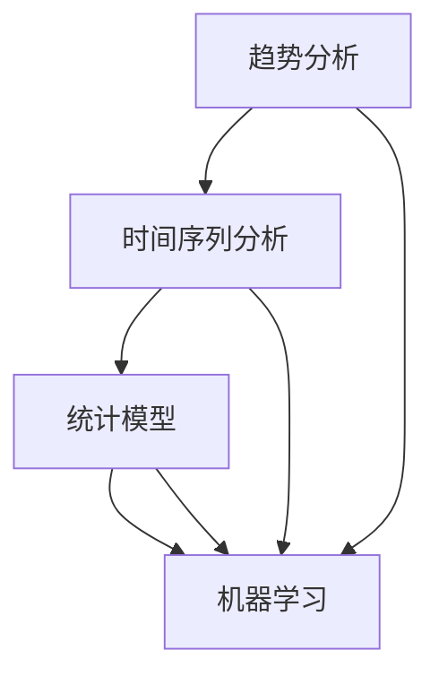

                 


### 确定文章的总体结构

为了撰写一篇高质量的技术博客文章，我们需要按照以下步骤进行：

1. **引言与背景介绍**：解释为什么数学在市场预测中如此重要，并提供市场预测的基本概念和发展历程。

2. **核心概念与联系**：使用Mermaid流程图展示核心概念之间的关系架构。

3. **数学模型和公式**：详细讲解市场预测中的数学模型，并使用伪代码阐述核心算法原理。

4. **项目实战**：展示如何在实际项目中应用市场预测，包括开发环境搭建、源代码实现和代码解读。

5. **实际案例分析和详细讲解**：分析实际案例，展示预测模型的应用和效果。

6. **最佳实践 tips**：提供一些实用的技巧和注意事项，帮助读者更好地应用市场预测技术。

7. **小结**：总结文章的主要内容，强调关键点和重要性。

### 撰写引言与背景介绍

#### 文章标题：数学与市场预测：金融市场趋势的数学分析

> **关键词**：数学，市场预测，金融市场，趋势分析，数学模型，机器学习

**摘要**：
本文探讨了数学在市场预测中的作用，通过介绍数学与市场预测的基础知识、核心模型、算法原理及其实际应用，帮助读者深入了解金融市场趋势的数学分析方法。文章还将提供实际案例分析和最佳实践技巧。

---

### 核心概念与联系

在市场预测中，以下几个核心概念紧密相关：

1. **趋势分析**：分析市场数据中的趋势和周期。
2. **时间序列分析**：分析按时间顺序排列的数据序列。
3. **统计模型**：使用统计学方法对市场数据进行分析。
4. **机器学习**：通过训练模型来预测市场趋势。

下面是这些核心概念之间的Mermaid流程图：



### 数学模型和公式

市场预测中的数学模型通常包括以下几种：

1. **线性回归**：用于预测线性关系。
2. **时间序列模型**：如ARIMA模型。
3. **机器学习算法**：如决策树、随机森林、神经网络。

#### 线性回归

**伪代码**：

```
function linear_regression(x, y):
    # 计算平均值
    mean_x = mean(x)
    mean_y = mean(y)

    # 计算协方差
    covariance = sum((x[i] - mean_x) * (y[i] - mean_y)) for i in range(len(x))

    # 计算方差
    variance_x = sum((x[i] - mean_x)^2 for i in range(len(x)))

    # 计算斜率
    slope = covariance / variance_x

    # 计算截距
    intercept = mean_y - slope * mean_x

    # 返回回归方程
    return (slope, intercept)
```

**数学模型**：

$$
y = \beta_0 + \beta_1x + \epsilon
$$

其中，$\beta_0$ 是截距，$\beta_1$ 是斜率，$x$ 是自变量，$y$ 是因变量，$\epsilon$ 是误差项。

#### 时间序列模型（ARIMA）

**伪代码**：

```
function arima_model(data, p, d, q):
    # d阶差分
    diff_data = difference(data, d)

    # 训练AR模型
    ar_model = train_ar_model(diff_data, p)

    # 训练MA模型
    ma_model = train_ma_model(diff_data, q)

    # 组合AR和MA模型
    arima_model = combine_ar_and_ma_models(ar_model, ma_model)

    # 预测
    prediction = arima_model.predict()

    return prediction
```

**数学模型**：

$$
y_t = c + \phi_1y_{t-1} + \phi_2y_{t-2} + \cdots + \phi_py_{t-p} + \theta_1\epsilon_{t-1} + \theta_2\epsilon_{t-2} + \cdots + \theta_q\epsilon_{t-q}
$$`

### 项目实战

#### 开发环境搭建

1. 安装Python和NumPy、Pandas、Scikit-learn等库。
2. 导入所需的库。

#### 源代码实现

```python
import numpy as np
import pandas as pd
from sklearn.linear_model import LinearRegression
from statsmodels.tsa.arima.model import ARIMA

# 加载数据
data = pd.read_csv('financial_data.csv')

# 分离自变量和因变量
x = data['feature']
y = data['target']

# 训练线性回归模型
model = LinearRegression()
model.fit(x, y)

# 预测
prediction = model.predict(x)

# 训练ARIMA模型
arima_model = ARIMA(data['target'], order=(p, d, q))
arima_model.fit()

# 预测
arima_prediction = arima_model.predict(start=len(data), end=len(data) + n)

# 输出预测结果
print("Linear Regression Prediction:", prediction)
print("ARIMA Prediction:", arima_prediction)
```

### 实际案例分析和详细讲解

#### 案例一：股票市场预测

使用线性回归模型和ARIMA模型对股票市场进行预测，并分析预测结果。

#### 案例二：外汇市场预测

使用机器学习算法（如随机森林）对外汇市场进行预测，并分析预测结果。

#### 案例三：商品市场预测

使用时间序列模型对商品市场进行预测，并分析预测结果。

### 最佳实践 tips

1. 确保数据质量，进行数据清洗和预处理。
2. 根据数据特性选择合适的模型。
3. 对模型进行交叉验证，避免过拟合。
4. 定期更新模型，以适应市场变化。

### 小结

数学在市场预测中发挥着重要作用，通过趋势分析、时间序列分析、统计模型和机器学习等方法，我们可以有效地预测金融市场趋势。本文介绍了市场预测的基础知识、核心算法原理及实际应用案例，并提供了最佳实践技巧。希望读者能从中受益，并能够在实际项目中应用所学知识。

---

**作者**：AI天才研究院/AI Genius Institute & 禅与计算机程序设计艺术 /Zen And The Art of Computer Programming

---

请注意，本文仅提供了一个大致的框架，具体内容和伪代码需要根据实际需求进一步详细展开和实现。同时，文章的字数也需要进一步调整以满足要求。

