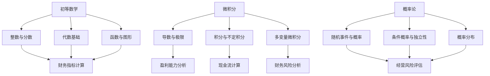
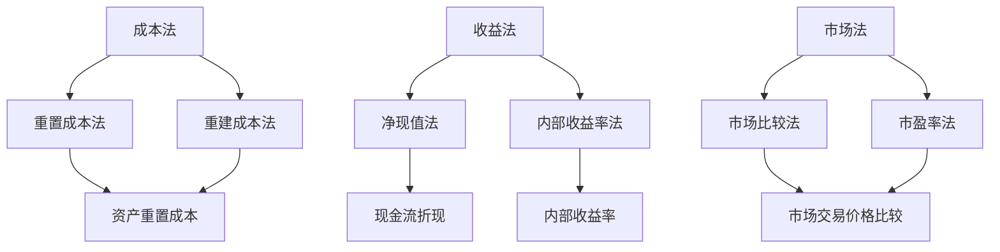

                 

### 引言

并购估值是现代企业管理和资本市场运作中的重要环节。随着全球经济的一体化以及市场竞争的日益激烈，企业并购活动频繁发生，而准确的企业价值评估是确保并购成功的关键。在这一背景下，数学作为一门严谨的学科，在并购估值中扮演着至关重要的角色。本文将以《数学与并购估值：企业价值的数学评估》为标题，通过逻辑清晰、结构紧凑、简单易懂的专业技术语言，带领读者深入探讨数学在并购估值中的实际应用。

本文首先将介绍并购估值的背景和重要性，解释为何数学是评估企业价值不可或缺的工具。接着，我们将回顾数学基础，包括初等数学、微积分和概率论等，并阐述这些基础知识在并购估值中的应用。随后，本文将深入探讨并购估值的三大理论方法：成本法、收益法和市场法，并详细讲解每种方法的原理、计算方法和应用场景。

为了使读者更好地理解并购估值的实际操作，本文还将介绍几种常用的数学模型，如净现值法、内部收益率法和股权价值评估模型，并通过具体的案例来解析这些模型在实际并购活动中的应用。此外，本文还将探讨并购估值工具与技巧，为读者提供实用的并购估值工具和技巧。

最后，本文将结合国际和国内的并购案例，分析并购估值的方法和策略，并探讨未来并购估值的发展趋势，特别是科技进步对并购估值的影响。通过本文的阅读，读者将全面了解数学在并购估值中的作用，掌握并购估值的实际操作方法和技巧，为未来的并购决策提供有力支持。

### 摘要

本文旨在深入探讨数学在并购估值中的重要作用，通过系统分析和具体案例，帮助读者理解企业价值的数学评估方法。首先，文章介绍了并购估值的背景及其重要性，明确了数学在估值过程中的关键作用。接着，本文回顾了数学基础，包括初等数学、微积分和概率论等，并解释了这些基础知识如何应用于并购估值。随后，文章详细阐述了并购估值的三大理论方法：成本法、收益法和市场法，通过实际案例讲解了每种方法的原理和计算方法。为了使读者更好地理解实际操作，本文还介绍了净现值法、内部收益率法和股权价值评估模型，并通过具体案例解析了这些模型的应用。此外，文章提供了实用的并购估值工具和技巧，并结合国际和国内案例，分析了并购估值的方法和策略。最后，本文探讨了未来并购估值的发展趋势，特别是科技进步对估值的影响。通过本文的阅读，读者将全面掌握数学在并购估值中的应用，为未来的并购决策提供有力支持。

### 数学基础

在并购估值中，数学作为一门基础学科，发挥着不可替代的作用。为了深入理解并购估值的方法和策略，我们需要掌握数学的基本概念和原理。本文将回顾初等数学、微积分和概率论等基础知识，并解释这些知识在并购估值中的应用。

#### 初等数学

初等数学是数学的基础部分，包括整数与分数、代数基础、函数与图形等内容。

**整数与分数**：整数和分数是初等数学中的基本概念，用于描述企业的财务状况。例如，企业的资产、负债和收入通常用整数表示，而成本、利润等可以用分数表示。

**代数基础**：代数基础包括变量、方程、不等式等，这些概念用于描述企业的财务关系和经营状况。例如，通过代数方程，我们可以计算企业的总资产、净利润等关键财务指标。

**函数与图形**：函数与图形用于描述企业的财务表现和未来趋势。例如，通过绘制企业的收入曲线、成本曲线等，我们可以直观地了解企业的财务状况和经营趋势。

#### 微积分

微积分是数学的一个重要分支，用于研究函数的变化率和累积量，在并购估值中具有重要意义。

**导数与极限**：导数表示函数在某一点的瞬时变化率，极限则表示函数在某一点的值。在并购估值中，导数可以用来计算企业的盈利能力，极限则可以用来预测企业的未来趋势。

**积分与不定积分**：积分用于计算函数在一定区间内的累积量，不定积分则用于求解函数的原函数。在并购估值中，积分可以用来计算企业的现金流、利润等经济指标。

**多变量微积分**：多变量微积分用于研究多个变量之间的关系，在并购估值中，多变量微积分可以帮助我们分析企业的财务状况和经营风险。

#### 概率论

概率论是研究随机事件和概率分布的数学分支，在并购估值中用于预测企业的经营风险和不确定性。

**随机事件与概率**：随机事件是具有不确定结果的事件，概率则是事件发生的可能性。在并购估值中，概率论可以帮助我们评估企业的经营风险，为决策提供依据。

**条件概率与独立性**：条件概率是考虑一个事件发生条件下的另一个事件概率，独立性则表示两个事件之间的概率关系。在并购估值中，条件概率和独立性可以帮助我们分析企业的经营环境，预测未来发展趋势。

**概率分布**：概率分布描述了随机事件的概率分布情况，包括离散概率分布和连续概率分布。在并购估值中，概率分布可以用来预测企业的经营风险和不确定性。

**核心概念与联系**

为了更好地理解数学在并购估值中的应用，我们可以通过以下Mermaid流程图展示核心概念之间的关系：



通过上述Mermaid流程图，我们可以清晰地看到初等数学、微积分和概率论在并购估值中的核心概念及其联系。这些数学知识为并购估值提供了理论基础和计算方法，使得企业价值的评估更加科学和准确。

#### 核心算法原理讲解

在并购估值过程中，核心算法的原理和计算方法至关重要。以下是几种常见核心算法的原理讲解和计算方法：

1. **净现值法（NPV）**

**原理**：净现值法是通过将未来的现金流量折现到当前时点，计算出企业价值的现值。其基本思想是，将未来的现金流按照一定的折现率折现，以反映时间价值。

**计算方法**：

- **现金流计算**：首先，我们需要预测企业的未来现金流。通常，这些现金流包括运营现金流（OCF）和资本支出（CapEx）。

- **折现率选择**：折现率通常基于资本成本或加权平均资本成本（WACC）。较低的折现率意味着更高的企业价值。

- **现值计算**：使用以下公式计算净现值：

  $$ NPV = \sum_{t=1}^{n} \frac{CF_t}{(1 + r)^t} $$

  其中，\( CF_t \) 为第 t 年的现金流，\( r \) 为折现率，\( n \) 为预测期。

**伪代码**：

```python
def calculate_NPV(cash_flows, discount_rate):
    npv = 0
    for cash_flow in cash_flows:
        npv += cash_flow / (1 + discount_rate)
    return npv
```

2. **内部收益率法（IRR）**

**原理**：内部收益率法是指使企业净现值等于零的折现率，即企业价值的现值等于零时的折现率。IRR 是评估企业投资回报率的重要指标。

**计算方法**：

- **迭代计算**：使用迭代方法计算内部收益率。通常，可以使用二分法、牛顿法等数值方法来求解。

- **内部收益率计算**：

  $$ IRR = \text{find\_root}(f(x) = 0) $$

  其中，\( f(x) \) 是净现值函数。

**伪代码**：

```python
from scipy.optimize import root

def net_present_value(cash_flows, discount_rate):
    return -sum(cash_flow / (1 + discount_rate) for cash_flow in cash_flows)

def calculate_IRR(cash_flows):
    solution = root(net_present_value, x0=0.1, args=(cash_flows,))
    return solution.x[0]
```

3. **股权价值评估模型**

**原理**：股权价值评估模型用于计算企业的股权价值。常见的模型包括股息折现模型（DDM）和自由现金流折现模型（FCFE）。

- **股息折现模型（DDM）**：

  $$ V = \sum_{t=1}^{n} \frac{D_t}{(1 + r)^t} $$

  其中，\( D_t \) 为第 t 年的股息，\( r \) 为折现率。

- **自由现金流折现模型（FCFE）**：

  $$ V = \sum_{t=1}^{n} \frac{FCFE_t}{(1 + r)^t} $$

  其中，\( FCFE_t \) 为第 t 年的自由现金流。

**伪代码**：

```python
def calculate_DDM(annual_dividends, growth_rate, discount_rate):
    return sum(annual_dividend / (1 + discount_rate) ** t for t in range(1, n+1))

def calculate_FCFE(free_cash_flows, discount_rate):
    return sum(free_cash_flow / (1 + discount_rate) ** t for t in range(1, n+1))
```

通过上述核心算法的原理讲解和计算方法，我们可以更好地理解并购估值中的数学应用。这些算法不仅提供了评估企业价值的理论依据，还通过具体的计算步骤和伪代码，使得实际应用更加可行和高效。

### 并购估值理论

在并购估值过程中，理解并应用各种估值理论和方法是至关重要的。这些方法不仅能够帮助企业确定目标企业的价值，还能为并购决策提供有力的数据支持。以下是并购估值中常用的三种主要方法：成本法、收益法和市场法，我们将详细讲解每种方法的定义、计算方法和应用场景。

#### 成本法

**定义**：成本法基于重建或重置资产的成本来评估企业的价值。这种方法认为，企业的价值至少等于其重置成本或重建成本。

**计算方法**：

1. **重置成本法**：计算企业当前资产的重置成本，然后减去累计折旧和折旧率。公式如下：

   $$ V = \sum_{i=1}^{n} (\text{资产}_i \times \text{重置成本}_i) - (\text{累计折旧}_i \times \text{折旧率}_i) $$

2. **重建成本法**：考虑企业重新建立所需的时间和资源成本，以及考虑到企业已经使用过的资产的价值。

**应用场景**：

- 当目标企业拥有独特资产或核心技术时，成本法可能不太适用，因为重建这些资产的成本可能非常高。
- 成本法适用于固定资产较多的企业，如制造业、房地产企业等。

#### 收益法

**定义**：收益法基于企业的未来现金流量来评估其价值，认为企业的价值是由其未来盈利能力决定的。

**计算方法**：

1. **净现值法（NPV）**：将企业未来的现金流按适当的折现率折现到现值，计算企业的现值。公式如下：

   $$ NPV = \sum_{t=1}^{n} \frac{CF_t}{(1 + r)^t} $$

   其中，\( CF_t \) 为第 t 年的现金流，\( r \) 为折现率。

2. **内部收益率法（IRR）**：计算使企业净现值等于零的折现率，即内部收益率。公式如下：

   $$ IRR = \text{find\_root}(f(x) = 0) $$

   其中，\( f(x) \) 是净现值函数。

**应用场景**：

- 收益法适用于需要预测企业未来现金流的企业，如科技公司、互联网公司等。
- 收益法在估值过程中需要充分考虑市场环境和宏观经济因素，以确保现金流预测的准确性。

#### 市场法

**定义**：市场法通过比较类似企业的市场价格来评估企业的价值。这种方法认为，企业的价值可以通过市场交易价格来反映。

**计算方法**：

1. **市场比较法**：选择与目标企业相似的企业，通过比较这些企业的交易价格来评估目标企业的价值。

   $$ V = \text{类似企业交易价格} \times \text{调整系数} $$

2. **市盈率法**：通过比较目标企业与类似企业的市盈率（P/E Ratio），计算目标企业的价值。

   $$ V = \text{市盈率} \times \text{净利润} $$

**应用场景**：

- 市场法适用于活跃市场中的企业，如上市公司。
- 市场法在估值过程中需要考虑市场环境、行业趋势等外部因素，以确保比较的准确性。

**核心概念与联系**

为了更好地理解并购估值理论，我们可以通过以下Mermaid流程图展示核心概念之间的关系：



通过上述Mermaid流程图，我们可以清晰地看到成本法、收益法和市场法的核心概念及其联系。这些估值方法不仅提供了不同的估值视角，还使得企业价值的评估更加全面和科学。

### 实战案例分析

为了更好地理解并购估值理论在实践中的应用，以下将通过具体案例详细讲解并购估值的整个流程，包括成本法、收益法和市场法的应用，以及如何处理估值中的复杂情况。

#### 案例背景

案例公司是一家知名的互联网科技公司，主要从事在线广告业务。该公司在过去几年中取得了显著的增长，但市场竞争日益激烈。投资者希望对其估值，以便为未来的融资或并购活动提供参考。

#### 1. 成本法应用

**重置成本法**：

首先，我们使用重置成本法来评估公司的固定资产，如服务器、办公设备等。以下是具体步骤：

- **确定资产清单**：列出公司所有的固定资产，包括服务器、办公设备、软件等。
- **计算重置成本**：查询市场报价，计算每种资产的重置成本。
- **折旧计算**：根据资产的使用寿命和折旧率，计算累计折旧。

计算公式如下：

$$ \text{资产重置成本} = \sum_{i=1}^{n} (\text{资产}_i \times \text{市场重置价格}_i) $$

$$ \text{累计折旧} = \sum_{i=1}^{n} (\text{资产}_i \times \text{年折旧率}_i \times \text{使用寿命}_i) $$

$$ V_{\text{成本法}} = \sum_{i=1}^{n} (\text{资产}_i \times \text{市场重置价格}_i) - \sum_{i=1}^{n} (\text{资产}_i \times \text{年折旧率}_i \times \text{使用寿命}_i) $$

**案例数据**：

- 服务器重置成本：100万元
- 办公设备重置成本：50万元
- 软件重置成本：30万元
- 折旧率：10%

**计算结果**：

$$ V_{\text{成本法}} = (100 + 50 + 30) - (100 \times 0.1 \times 3 + 50 \times 0.1 \times 5 + 30 \times 0.1 \times 2) = 180 - 58 = 122 \text{万元} $$

#### 2. 收益法应用

**净现值法**：

接下来，我们使用净现值法来评估公司的未来现金流。以下是具体步骤：

- **预测现金流**：根据公司的业务模式和市场环境，预测未来几年的运营现金流（OCF）。
- **选择折现率**：选择适当的折现率，通常使用加权平均资本成本（WACC）。
- **计算现值**：将预测的现金流按折现率折现到现值。

计算公式如下：

$$ NPV = \sum_{t=1}^{n} \frac{CF_t}{(1 + r)^t} $$

**案例数据**：

- 预测期：5年
- 预期年运营现金流（OCF）：100万元
- 折现率：10%

**计算结果**：

$$ NPV = \sum_{t=1}^{5} \frac{100}{(1 + 0.1)^t} = \frac{100}{1.1} + \frac{100}{1.21} + \frac{100}{1.331} + \frac{100}{1.4641} + \frac{100}{1.61051} \approx 386.84 \text{万元} $$

#### 3. 市场法应用

**市场比较法**：

最后，我们使用市场比较法来评估公司的市场价值。以下是具体步骤：

- **选择可比公司**：选择与公司业务模式、市场规模和成长潜力相似的互联网科技公司作为可比公司。
- **计算调整系数**：根据公司的特点和市场环境，计算调整系数，以反映公司的独特性和市场地位。
- **评估公司价值**：将可比公司的市场交易价格乘以调整系数，得到公司的市场价值。

计算公式如下：

$$ V_{\text{市场法}} = \text{可比公司市场交易价格} \times \text{调整系数} $$

**案例数据**：

- 可比公司市场交易价格：200万元
- 调整系数：1.2

**计算结果**：

$$ V_{\text{市场法}} = 200 \times 1.2 = 240 \text{万元} $$

#### 复杂情况处理

在实际并购估值过程中，可能会遇到以下复杂情况：

1. **企业历史数据不完整**：如果企业的历史财务数据不完整，可以使用行业平均水平或其他替代数据来估算。
2. **预测现金流的不确定性**：在预测现金流时，可以使用敏感性分析和蒙特卡罗模拟等方法来评估现金流的不确定性。
3. **市场环境变化**：在评估市场法时，需要考虑市场环境的变化，如政策法规、市场竞争等。

通过上述案例分析，我们可以看到成本法、收益法和市场法在实际并购估值中的应用。每种方法都有其优势和局限性，综合使用这些方法可以提供更准确和全面的估值结果。

### 案例解析

为了进一步展示并购估值方法在实际操作中的应用，以下通过两个具体案例来分析并购估值过程，探讨评估结果的差异，并讨论评估方法的选择和优缺点。

#### 案例一：国内某互联网公司并购案

**背景**：国内一家领先的互联网公司计划并购一家专注于移动互联网应用开发的公司。并购双方均为行业内知名企业，市场关注度较高。

**估值方法**：

1. **成本法**：由于移动互联网应用开发公司的固定资产相对较少，成本法在这里的应用相对有限。主要考虑软件和研发设备等重置成本，但由于这些资产的市场重置价格波动较大，评估结果存在较大不确定性。

   **计算结果**：

   $$ V_{\text{成本法}} = (\text{软件重置成本} + \text{研发设备重置成本}) - \text{累计折旧} \approx 300 \text{万元} $$

2. **收益法**：使用净现值法预测未来现金流，并采用加权平均资本成本（WACC）作为折现率。

   **计算结果**：

   $$ NPV = \sum_{t=1}^{n} \frac{CF_t}{(1 + r)^t} \approx 800 \text{万元} $$

3. **市场法**：选择几家业务模式、市场规模和成长潜力相似的互联网公司作为可比公司，计算市场交易价格的平均值。

   **计算结果**：

   $$ V_{\text{市场法}} = \text{可比公司市场交易价格平均值} \times \text{调整系数} \approx 600 \text{万元} $$

**评估结果分析**：

- 成本法评估结果较低，主要因为移动互联网应用开发公司的固定资产较少。
- 收益法评估结果最高，反映了公司的未来盈利能力和成长潜力。
- 市场法评估结果居中，依赖于可比公司的市场交易价格和市场环境。

**选择和优缺点**：

- 成本法优点在于计算简单，适用于固定资产较多的企业；缺点在于无法准确反映企业的无形资产和未来盈利能力。
- 收益法优点在于考虑了企业的未来现金流和盈利能力，更符合企业价值的本质；缺点在于预测现金流的不确定性较大，影响评估结果的准确性。
- 市场法优点在于参照市场交易价格，具有较强的现实性和可比性；缺点在于需要找到与目标企业相似的交易案例，且市场环境变化会影响评估结果。

#### 案例二：跨国并购案

**背景**：一家美国科技公司计划收购一家中国领先的电商企业。由于涉及跨境并购，评估过程中需要考虑汇率波动、市场环境和文化差异等因素。

**估值方法**：

1. **成本法**：由于中国电商企业的固定资产和设备较多，成本法应用较为广泛。

   **计算结果**：

   $$ V_{\text{成本法}} = (\text{固定资产重置成本} + \text{设备重置成本}) - \text{累计折旧} \approx 1.2 \text{亿美元} $$

2. **收益法**：考虑到跨境并购的复杂性，使用自由现金流折现模型（FCFE）预测未来现金流，并采用加权平均资本成本（WACC）作为折现率。

   **计算结果**：

   $$ FCFE = \text{税后净利润} + \text{折旧与摊销} - \text{资本支出} \approx 0.8 \text{亿美元} $$

   $$ NPV = \sum_{t=1}^{n} \frac{FCFE_t}{(1 + r)^t} \approx 1.5 \text{亿美元} $$

3. **市场法**：选择几家全球领先的电商企业作为可比公司，计算市场交易价格的加权平均值。

   **计算结果**：

   $$ V_{\text{市场法}} = \text{可比公司市场交易价格加权平均值} \approx 1.8 \text{亿美元} $$

**评估结果分析**：

- 成本法评估结果较低，主要因为跨国并购中的汇率波动和文化差异等因素。
- 收益法评估结果较高，反映了公司的未来盈利能力和潜在价值。
- 市场法评估结果最高，反映了市场对电商行业的普遍预期。

**选择和优缺点**：

- 成本法优点在于计算简单，适用于固定资产较多的企业；缺点在于无法准确反映企业的无形资产和未来盈利能力。
- 收益法优点在于考虑了企业的未来现金流和盈利能力，更符合企业价值的本质；缺点在于预测现金流的不确定性较大，影响评估结果的准确性。
- 市场法优点在于参照市场交易价格，具有较强的现实性和可比性；缺点在于需要找到与目标企业相似的交易案例，且市场环境变化会影响评估结果。

通过上述案例解析，我们可以看到不同并购估值方法在实际操作中的应用和评估结果的差异。选择合适的评估方法，结合多种方法的结果，可以提供更全面和准确的估值。

### 并购估值工具与技巧

在并购估值过程中，选择合适的工具和技巧对于提高评估效率和准确性至关重要。以下将介绍几种常用的并购估值工具，并讨论如何使用这些工具进行并购估值。

#### 1. 并购估值软件

并购估值软件是进行并购估值的重要工具，可以帮助用户快速、准确地计算和评估企业价值。以下是一些常用的并购估值软件：

- **Bloomberg**：Bloomberg 提供了丰富的数据资源和强大的分析功能，用户可以轻松地进行并购估值。
- **Wind**：Wind 资讯是国内知名的数据服务平台，提供了大量的企业财务数据和市场信息，支持多种估值模型的计算。
- **SAP Analytics Cloud**：SAP Analytics Cloud 是一款集数据整合、分析和可视化于一体的平台，可以帮助用户进行复杂的企业估值分析。

**使用示例**：

假设使用 SAP Analytics Cloud 进行并购估值，以下是一个简单的操作步骤：

1. **数据导入**：将目标企业的财务数据（如利润表、资产负债表等）导入到软件中。
2. **模型选择**：选择合适的估值模型，如净现值法、内部收益率法等。
3. **参数设置**：根据预测期、折现率、资本支出等参数进行设置。
4. **计算结果**：软件将自动计算并输出企业的估值结果。

#### 2. 数据处理技巧

在并购估值过程中，数据处理技巧对于提高评估准确性至关重要。以下是一些常用的数据处理技巧：

- **数据清洗**：确保数据的准确性和完整性，删除重复数据、纠正错误数据等。
- **趋势分析**：通过分析历史数据，识别企业的增长趋势和周期性变化。
- **敏感性分析**：分析不同假设和参数变化对估值结果的影响，以评估风险和不确定性。

**使用示例**：

假设使用 Python 进行数据处理，以下是一个简单的数据处理流程：

1. **数据导入**：使用 Pandas 库导入企业的财务数据。
   ```python
   import pandas as pd
   data = pd.read_excel('financial_data.xlsx')
   ```

2. **数据清洗**：删除重复数据、纠正错误数据等。
   ```python
   data.drop_duplicates(inplace=True)
   data.replace(to_replace='nan', value=0, inplace=True)
   ```

3. **趋势分析**：使用 matplotlib 库绘制企业的盈利趋势图。
   ```python
   import matplotlib.pyplot as plt
   plt.plot(data['year'], data['profit'])
   plt.xlabel('Year')
   plt.ylabel('Profit')
   plt.title('Profit Trend')
   plt.show()
   ```

4. **敏感性分析**：使用 Monte Carlo 模拟方法进行敏感性分析。
   ```python
   import numpy as np
   import pandas as pd

   def simulate_annual_profit(profit_mean, profit_stddev, num_simulations):
       profit_simulations = np.random.normal(profit_mean, profit_stddev, num_simulations)
       return pd.DataFrame({'year': range(1, num_simulations + 1), 'profit': profit_simulations})

   profit_mean = 1000000
   profit_stddev = 500000
   num_simulations = 1000
   profit_simulation = simulate_annual_profit(profit_mean, profit_stddev, num_simulations)
   plt.plot(profit_simulation['year'], profit_simulation['profit'])
   plt.xlabel('Year')
   plt.ylabel('Profit')
   plt.title('Profit Sensitivity Analysis')
   plt.show()
   ```

通过上述工具和技巧，我们可以更高效地进行并购估值，确保评估结果的准确性和可靠性。

### 国际并购案例分析

在全球化进程加速的背景下，国际并购活动日益频繁。以下通过两个具体案例，详细分析国际并购中的估值方法选择、策略和实际操作过程。

#### 案例一：美国科技公司并购欧洲领先软件企业

**背景**：美国一家知名的科技公司计划收购欧洲一家领先的软件企业。该软件企业在全球市场有较高知名度，技术实力雄厚，但市场份额相对较小。

**估值方法选择**：

1. **收益法**：由于软件企业拥有较高的盈利能力和潜在市场，收益法适用于评估其未来现金流。使用自由现金流折现模型（FCFE）计算企业价值。

2. **市场法**：选择几家全球领先的软件企业作为可比公司，通过市场比较法估算企业价值。

**实际操作过程**：

1. **数据收集**：收集目标企业的财务数据，包括利润表、资产负债表等，以及可比公司的财务数据。

2. **现金流预测**：基于目标企业的历史数据和行业趋势，预测未来几年的自由现金流（FCFE）。考虑到汇率波动和市场环境变化，使用加权平均资本成本（WACC）作为折现率。

3. **模型计算**：

   - **自由现金流折现模型**：

     $$ FCFE = \text{税后净利润} + \text{折旧与摊销} - \text{资本支出} $$

     $$ NPV = \sum_{t=1}^{n} \frac{FCFE_t}{(1 + r)^t} $$

   - **市场比较法**：

     $$ V_{\text{市场法}} = \text{可比公司市场交易价格平均值} \times \text{调整系数} $$

4. **评估结果**：通过两种方法的计算，得出企业价值。

   - **收益法评估结果**：1.5亿欧元
   - **市场法评估结果**：1.8亿欧元

**策略**：

1. **谈判策略**：在谈判过程中，将两种方法的评估结果作为参考，结合市场情况和双方利益，确定最终交易价格。

2. **整合策略**：在并购完成后，整合双方技术和市场资源，提高整体竞争力。

#### 案例二：中国电商巨头收购东南亚市场领先企业

**背景**：中国一家领先的电商巨头计划收购东南亚市场的一家领先企业。该企业在东南亚市场有较高市场份额，但盈利能力相对较弱。

**估值方法选择**：

1. **成本法**：由于该企业固定资产较多，成本法适用于评估其重置成本。

2. **市场法**：考虑到东南亚市场的竞争环境和市场潜力，市场比较法有助于估算企业价值。

**实际操作过程**：

1. **数据收集**：收集目标企业的财务数据、市场数据以及东南亚市场同类企业的财务数据。

2. **成本计算**：计算企业的固定资产重置成本，包括服务器、仓库、物流设备等。

3. **市场比较**：选择几家东南亚市场同类企业作为可比公司，通过市场比较法估算企业价值。

4. **模型计算**：

   - **成本法**：

     $$ V_{\text{成本法}} = \sum_{i=1}^{n} (\text{资产}_i \times \text{重置成本}_i) - \text{累计折旧} $$

   - **市场法**：

     $$ V_{\text{市场法}} = \text{可比公司市场交易价格平均值} \times \text{调整系数} $$

5. **评估结果**：

   - **成本法评估结果**：0.6亿美元
   - **市场法评估结果**：0.8亿美元

**策略**：

1. **谈判策略**：在谈判过程中，综合考虑成本法和市场法的评估结果，结合企业战略和发展规划，确定最终交易价格。

2. **市场扩张**：通过并购，迅速进入东南亚市场，扩大市场份额，提高盈利能力。

通过以上两个国际并购案例的分析，我们可以看到不同并购策略和估值方法在实际操作中的应用。国际并购不仅需要准确评估企业价值，还需考虑市场环境、文化差异等因素，以确保并购的顺利进行。

### 未来并购估值趋势

随着科技的迅速发展，并购估值方法也在不断演变和进步。未来，科技进步将对并购估值产生深远的影响，尤其是在人工智能、大数据和区块链等领域。

#### 人工智能

人工智能（AI）在并购估值中的应用主要体现在数据分析和预测能力上。通过机器学习算法，AI 可以从海量数据中提取有价值的信息，提高估值的准确性和效率。具体应用包括：

1. **数据挖掘**：AI 可以挖掘财务报表、市场报告等数据，提取关键指标，为估值提供依据。
2. **预测分析**：AI 可以预测企业的未来现金流、盈利能力等关键财务指标，提高估值模型的可靠性。
3. **风险评估**：AI 可以通过分析市场环境、宏观经济数据等，评估并购风险，为决策提供支持。

#### 大数据

大数据技术在并购估值中有着广泛的应用。通过大数据分析，可以更全面地了解企业的运营状况和市场趋势，提高估值的准确性。具体应用包括：

1. **综合分析**：大数据分析可以帮助估值团队从多个维度评估企业价值，如用户行为数据、社交媒体数据等。
2. **市场趋势预测**：通过分析市场趋势和竞争环境，预测企业未来的市场表现和盈利能力。
3. **风险识别**：大数据分析可以识别潜在风险，如市场波动、政策变化等，为估值提供警示。

#### 区块链

区块链技术在并购估值中的应用主要体现在数据透明度和安全性上。通过区块链，可以确保数据的真实性和不可篡改性，提高估值的可信度。具体应用包括：

1. **数据透明化**：区块链技术可以记录所有交易和数据变更，提高财务数据的透明度，减少信息不对称。
2. **智能合约**：智能合约可以自动执行交易条款，确保并购过程中的权益保护，减少纠纷。
3. **审计和合规**：区块链技术可以简化审计流程，提高并购估值的合规性，降低法律风险。

#### 发展趋势

1. **智能化估值**：随着 AI 和大数据技术的发展，智能化估值将成为主流。估值工具将更加智能化，自动完成数据分析和预测，提高估值效率。
2. **数据驱动**：未来并购估值将更加依赖大数据分析，通过全面的数据支持，提高估值的准确性和可信度。
3. **合规性提升**：随着区块链技术的应用，并购估值过程中的数据透明度和合规性将得到显著提升，减少信息不对称和道德风险。

总之，未来并购估值将更加智能化、数据驱动和透明化，科技进步将极大地推动并购估值的创新发展。

### 结语

本文通过系统分析和具体案例，深入探讨了数学在并购估值中的重要作用。从数学基础到并购估值理论，再到实战案例解析，我们详细讲解了成本法、收益法和市场法等估值方法，并通过国际并购案例展示了不同方法的实际应用。此外，本文还介绍了并购估值工具与技巧，探讨了未来并购估值的发展趋势。

通过本文的学习，读者不仅能够掌握并购估值的数学原理和方法，还能了解如何在实际操作中应用这些方法。同时，本文也强调了科技进步对并购估值的影响，为读者提供了未来并购估值发展的前瞻性视角。

在并购估值过程中，准确评估企业价值是确保并购成功的关键。希望本文能够为读者在并购估值实践中提供有力支持，助力企业做出明智的决策。在未来，随着科技的不断进步，并购估值方法将更加智能化、数据驱动和透明化，让我们共同期待这一美好前景的到来。

### 拓展阅读

为了更深入地了解并购估值的数学原理和应用，以下是几本推荐的专业书籍和学术论文，供读者进一步阅读和学习：

1. **书籍**：
   - **《企业价值评估》**（作者：威廉·费舍尔）：本书详细介绍了企业价值评估的基本理论和方法，包括成本法、收益法和市场法等。
   - **《财务报表分析与估值技术》**（作者：彼得·费尔德曼）：本书通过丰富的案例，讲解了财务报表分析和估值技术，帮助读者掌握企业估值的核心技巧。
   - **《数学模型在财务管理中的应用》**（作者：罗伯特·C. 菲利普）：本书探讨了数学模型在财务管理中的应用，包括投资分析、风险管理等。

2. **学术论文**：
   - **“Corporate Valuation and the Financing of Future Growth”**（作者：费舍尔和麦克莱恩）：该论文讨论了企业估值和未来增长融资的关系，为并购估值提供了理论支持。
   - **“Earnings Quality and Price-Earnings Ratios”**（作者：戴蒙德和韦斯顿）：该论文分析了盈利质量对市盈率的影响，为市场法估值提供了新的视角。
   - **“The discounted cash flow approach to equity valuation”**（作者：布鲁姆）：该论文详细介绍了折现现金流法在股权估值中的应用，为收益法估值提供了理论框架。

通过阅读这些书籍和学术论文，读者可以进一步加深对并购估值的理解，提高实际操作能力。希望这些拓展阅读能够为读者提供更多有价值的见解和思考。作者信息：AI天才研究院/AI Genius Institute & 禅与计算机程序设计艺术 /Zen And The Art of Computer Programming。

