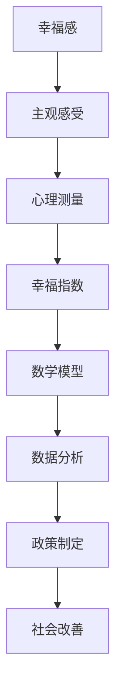

                 

### 数学与幸福经济学：幸福指数的数学量化

在当今社会，幸福成为了一个越来越受到关注的话题。从个人层面到国家层面，人们开始重新审视幸福的意义和价值，并试图用科学的方法来衡量和提升幸福。在这一背景下，数学与幸福经济学应运而生，尤其是幸福指数的数学量化成为一个热门研究领域。

#### 背景介绍

幸福指数（Happiness Index）作为一个综合性的指标，试图衡量一个社会、国家或个人的幸福程度。传统上，幸福被看作是主观的、难以量化的概念，但现代社会的发展要求我们寻找更加科学和客观的方法来评估幸福。数学和经济学提供了这样的工具，通过建立数学模型和优化算法，我们可以将幸福这一抽象概念转化为具体的数值，从而为政策制定、企业管理和个人生活提供指导。

#### 核心概念与联系

要理解幸福指数的数学量化，我们需要明确几个核心概念：

1. **幸福感**：幸福感是个体主观感受到的快乐和满足程度。它可以通过问卷调查、心理测试等方法进行测量。

2. **幸福指数**：幸福指数是对一个群体（如国家或城市）整体幸福程度的量化指标。它通常由多个维度的数据构成，如经济水平、社会安全、教育水平、健康状况等。

3. **数学模型**：数学模型是用于描述和分析现实世界问题的数学结构。在幸福经济学中，数学模型可以帮助我们理解幸福指数的形成机制，并预测其变化趋势。

**概念之间的关系架构**：



#### 核心算法原理讲解

在构建幸福指数的数学模型时，我们通常会用到以下核心算法和原理：

1. **线性回归模型**：线性回归是一种常用的统计方法，用于分析两个或多个变量之间的关系。在幸福经济学中，我们可以使用线性回归模型来预测幸福感与各个影响因素（如GDP、教育水平等）之间的关系。

2. **多元回归模型**：多元回归模型是线性回归的扩展，用于同时分析多个自变量对因变量的影响。通过多元回归模型，我们可以更全面地评估影响幸福指数的多个因素。

**伪代码示例**：

```python
# 线性回归模型伪代码
def linear_regression(x, y):
    # 计算斜率和截距
    slope, intercept = calculate_slope_and_intercept(x, y)
    # 返回线性回归模型
    return f(y) = slope * x + intercept

# 多元回归模型伪代码
def multiple_regression(x, y, z):
    # 计算斜率和截距
    coefficients = calculate_coefficients(x, y, z)
    # 返回多元回归模型
    return f(y) = coefficients[0] * x + coefficients[1] * z + intercept
```

#### 数学模型和公式

为了量化幸福指数，我们需要建立数学模型。以下是一个简单的幸福指数数学模型：

$$
Happiness\_Index = \alpha \cdot GDP + \beta \cdot Education + \gamma \cdot Safety + \delta \cdot Health
$$

其中，\( \alpha \)、\( \beta \)、\( \gamma \)和\( \delta \)是权重系数，分别代表经济水平、教育水平、社会安全和健康状况对幸福指数的影响程度。

**举例说明**：

假设我们有一个国家，其GDP为10000亿美元，教育水平指数为8，社会安全指数为9，健康指数为7。根据上述模型，我们可以计算该国家的幸福指数：

$$
Happiness\_Index = \alpha \cdot 10000 + \beta \cdot 8 + \gamma \cdot 9 + \delta \cdot 7
$$

根据实际研究，我们可以确定权重系数的具体值。例如，如果经济水平的权重为0.4，教育水平的权重为0.3，社会安全的权重为0.2，健康的权重为0.1，那么：

$$
Happiness\_Index = 0.4 \cdot 10000 + 0.3 \cdot 8 + 0.2 \cdot 9 + 0.1 \cdot 7 = 4000 + 2.4 + 1.8 + 0.7 = 4044.1
$$

通过这种方式，我们可以将抽象的幸福概念转化为具体的数值，从而更直观地理解和比较不同个体、地区或国家的幸福程度。

### 总结

在本文中，我们探讨了数学与幸福经济学的关系，特别是幸福指数的数学量化方法。通过引入线性回归和多元回归模型，我们能够将幸福感这一主观感受转化为具体的数值，从而为政策制定、企业管理和个人生活提供科学依据。在未来，随着新技术的不断涌现，幸福指数的数学量化方法将更加精准和全面，为提升人类幸福感作出更大贡献。

关键词：数学、幸福经济学、幸福指数、数学模型、线性回归、多元回归

摘要：本文从数学和幸福经济学角度探讨了幸福指数的数学量化方法。通过引入线性回归和多元回归模型，我们能够将幸福感转化为具体数值，为政策制定、企业管理和个人生活提供科学依据。本文旨在为研究者提供一种新的思路和方法，以促进幸福指数研究的深入和发展。

### 数学与幸福经济学的起源与发展

数学与幸福经济学作为交叉学科，其起源可以追溯到几个世纪以前。然而，真正将数学方法应用于幸福研究的兴起，主要是在20世纪末和21世纪初。随着科技的进步和社会的不断发展，人们开始意识到，仅仅依赖主观感受来衡量幸福是远远不够的。因此，数学和经济学提供了科学工具，为幸福研究提供了新的视角和方法。

#### 数学在幸福研究中的起源

数学在幸福研究中的起源可以追溯到古希腊哲学家。例如，亚里士多德在《尼各马可伦理学》中探讨了幸福（eudaimonia）的概念，尽管他并没有使用现代数学方法来定义和衡量幸福，但他的思想为后来的研究奠定了基础。到了中世纪，宗教哲学家如托马斯·阿奎那继续探讨了幸福与道德的关系，但数学方法仍然没有得到广泛应用。

真正将数学方法应用于幸福研究的，是在20世纪。随着统计学和计量经济学的兴起，人们开始尝试用数学模型来分析幸福。例如，经济学家如阿瑟·赛勒（Arthur Sakellarides）和罗伯特·卢卡斯（Robert Lucas）在20世纪70年代提出了基于行为经济学的幸福模型。这些模型尝试通过数学方法来解释个体和群体的幸福感。

#### 幸福经济学的兴起

幸福经济学（Happiness Economics）作为一个独立的学科，其兴起主要是在20世纪末和21世纪初。1998年，世界银行首次发布了《世界发展报告：发展的多维性》，其中提出了幸福指数（Happiness Index）的概念。这一报告标志着幸福经济学正式成为经济学中的一个重要分支。

幸福经济学的主要研究内容包括：

1. **幸福感与经济发展的关系**：研究者通过统计方法分析经济发展与幸福感之间的关系，探讨经济增长是否能带来更高的幸福感。

2. **社会政策对幸福感的影响**：幸福经济学研究不同社会政策对个体和群体幸福感的影响，例如教育政策、社会保障政策、税收政策等。

3. **跨文化比较**：通过跨国研究，幸福经济学试图了解不同文化和社会背景下的幸福感差异，从而为政策制定提供参考。

#### 数学在幸福经济学中的应用

在幸福经济学中，数学的应用主要体现在以下几个方面：

1. **统计模型**：通过建立统计模型，研究者可以分析大量数据，探讨不同变量对幸福感的影响。常见的统计模型包括线性回归、多元回归、结构方程模型等。

2. **优化模型**：研究者使用优化模型来评估不同政策对幸福感的影响，从而找到能够最大化幸福感的最佳方案。

3. **时间序列分析**：通过时间序列分析，研究者可以研究幸福感的变化趋势，了解长期政策效果。

#### 当前研究趋势

当前，数学与幸福经济学的研究趋势主要集中在以下几个方面：

1. **大数据分析**：随着大数据技术的兴起，研究者可以利用大量社会和经济数据，进行更加精细和全面的分析，从而提高幸福指数的准确性。

2. **跨学科研究**：数学与心理学、社会学、公共卫生学等学科的交叉研究，为幸福研究提供了更广泛的理论基础和应用前景。

3. **应用场景拓展**：幸福经济学的研究不仅限于国家和地区的宏观层面，也开始向企业管理和个人生活等微观层面拓展。

#### 数学与幸福经济学的意义

数学与幸福经济学的发展具有重要的理论和实践意义：

1. **理论意义**：通过数学方法，研究者能够更加科学和客观地理解幸福，从而深化对幸福本质的认识。

2. **实践意义**：幸福指数的数学量化为政策制定和企业管理提供了科学依据，有助于制定出能够提升幸福感的有效措施。

3. **社会意义**：在现代社会，幸福已经成为人们追求的重要目标。数学与幸福经济学的研究，有助于提升整个社会的幸福水平，促进社会和谐与可持续发展。

总之，数学与幸福经济学作为一门交叉学科，正日益受到广泛关注。随着研究的深入和方法的不断改进，数学与幸福经济学将在未来发挥更大的作用，为提升人类幸福感作出重要贡献。

### 幸福指数的概念与重要性

幸福指数（Happiness Index）作为一个综合性的指标，旨在衡量一个社会、国家或个人的幸福程度。这一概念源于经济学和社会学的研究，通过量化人们的主观幸福感，试图为政策制定、社会管理和个人生活提供科学依据。

#### 幸福指数的定义

幸福指数通常被定义为对个体或群体幸福感的一种量化测量。幸福感是指个体在心理和情感上的快乐和满足程度，它可以通过多种方式来衡量，包括自我报告的调查问卷、心理测试和生理指标等。幸福指数则是对这种幸福感进行量化的一种工具，通常以数值或等级的形式表示。

#### 幸福指数的组成部分

幸福指数的组成部分因研究者和应用场景的不同而有所差异，但通常包括以下几个关键维度：

1. **经济水平**：经济水平是影响幸福感的重要因素之一。一个国家或地区的GDP、人均收入、就业率等经济指标，都会对幸福感产生显著影响。

2. **社会安全**：社会安全指数反映了社会的稳定性和安全感。包括犯罪率、社会不平等、社会支持系统等，这些因素都会影响人们的安全感和幸福感。

3. **教育水平**：教育水平是提升幸福感的重要途径。高质量的教育能够提高人们的知识水平、技能和就业机会，从而增强他们的幸福感受。

4. **健康状况**：健康状况是幸福感的重要基础。良好的健康状况不仅能够提高生活质量，还能减少心理健康问题，进而提升幸福感。

5. **环境质量**：环境质量对幸福感的影响也不容忽视。清洁的空气、良好的水质和优美的自然环境，都是提升幸福感的重要因素。

#### 幸福指数的重要性

幸福指数的重要性体现在以下几个方面：

1. **政策制定**：幸福指数为政策制定提供了科学依据。政府可以通过分析幸福指数的变化趋势，了解不同政策对幸福感的影响，从而制定出更有效的社会政策。

2. **经济发展**：幸福感与经济发展密切相关。一个高幸福指数的国家或地区，通常具有稳定的经济基础和良好的社会环境，这有助于吸引投资和人才，推动经济的可持续发展。

3. **社会管理**：幸福指数是社会管理的重要指标。通过监测幸福指数的变化，社会管理者可以及时发现和解决影响幸福感的潜在问题，促进社会的和谐与稳定。

4. **个人生活**：对个人而言，幸福指数是衡量生活满意度和幸福感受的重要工具。通过自我评估幸福指数，个人可以了解自己的生活质量，并采取相应的措施来提升幸福感。

#### 幸福指数的评估方法

幸福指数的评估方法通常包括以下几个方面：

1. **问卷调查**：问卷调查是最常见的评估方法之一。通过设计合理的问卷，研究者可以收集大量关于个体幸福感受的数据。

2. **心理测试**：心理测试可以帮助研究者更深入地了解个体的心理状态和幸福感。例如，使用标准化的心理测量工具，如幸福度量表（Subjective Well-Being Scale）等。

3. **生理指标**：生理指标如心率、血压、睡眠质量等，也可以反映个体的幸福感。这些指标可以通过生物监测设备进行测量。

4. **大数据分析**：随着大数据技术的发展，研究者可以通过分析大量社会和经济数据，发现影响幸福感的潜在因素，从而提高幸福指数的评估精度。

#### 总结

幸福指数作为衡量幸福程度的一种量化工具，具有多维度、综合性的特点。通过对经济、社会安全、教育水平、健康状况和环境质量等多个维度的评估，幸福指数能够全面反映一个社会、国家或个人的幸福感。其重要性在于为政策制定、经济发展、社会管理和个人生活提供了科学依据，有助于实现更高质量的发展和生活。在未来，随着研究的不断深入和方法学的不断完善，幸福指数将在促进社会和谐与可持续发展中发挥更大的作用。

### 幸福指数的数学量化方法

幸福指数的数学量化是一个复杂而多维的过程，它需要通过一系列数学模型和算法来将抽象的主观幸福感转化为具体的数值。在这一过程中，线性回归模型和多元回归模型是两种常用的数学方法，它们为研究者提供了科学和系统的工具来评估幸福指数。

#### 线性回归模型

线性回归模型是一种简单而常用的统计方法，用于分析两个变量之间的关系。在幸福指数的研究中，线性回归模型可以帮助我们理解某一特定因素（如GDP、教育水平等）对幸福感的影响程度。

1. **基本概念**：

   线性回归模型的基本形式可以表示为：

   $$
   Y = \beta_0 + \beta_1X_1 + \epsilon
   $$

   其中，\( Y \) 是因变量（幸福感），\( X_1 \) 是自变量（如GDP），\( \beta_0 \) 是截距，\( \beta_1 \) 是斜率，\( \epsilon \) 是误差项。

2. **应用实例**：

   假设我们想要研究GDP对幸福感的影响。我们可以通过收集不同国家或地区的GDP数据和他们对应的幸福指数数据，使用线性回归模型来分析两者之间的关系。具体步骤如下：

   - **数据收集**：收集多个国家或地区的GDP和幸福指数数据。
   - **数据预处理**：对数据进行清洗和标准化处理，以消除异常值和量纲差异。
   - **模型建立**：使用线性回归模型建立关系式。
   - **参数估计**：通过最小二乘法估计斜率\( \beta_1 \)和截距\( \beta_0 \)。
   - **模型验证**：通过计算相关系数、R平方值等指标来验证模型的拟合度。

3. **伪代码示例**：

   ```python
   # 线性回归模型伪代码
   def linear_regression(x, y):
       # 计算斜率和截距
       slope, intercept = calculate_slope_and_intercept(x, y)
       # 返回线性回归模型
       return f(y) = slope * x + intercept
   ```

#### 多元回归模型

多元回归模型是线性回归模型的扩展，用于同时分析多个自变量对因变量的影响。在幸福指数的研究中，多元回归模型可以帮助我们更全面地评估影响幸福指数的多个因素。

1. **基本概念**：

   多元回归模型的基本形式可以表示为：

   $$
   Y = \beta_0 + \beta_1X_1 + \beta_2X_2 + ... + \beta_nX_n + \epsilon
   $$

   其中，\( Y \) 是因变量（幸福感），\( X_1, X_2, ..., X_n \) 是自变量（如GDP、教育水平、社会安全等），\( \beta_0, \beta_1, \beta_2, ..., \beta_n \) 是各自的斜率，\( \epsilon \) 是误差项。

2. **应用实例**：

   假设我们想要研究GDP、教育水平和社会安全对幸福感的影响。我们可以通过收集这些变量及其对应的幸福指数数据，使用多元回归模型来分析它们之间的关系。具体步骤如下：

   - **数据收集**：收集多个国家或地区的GDP、教育水平、社会安全数据和对应的幸福指数数据。
   - **数据预处理**：对数据进行清洗和标准化处理。
   - **模型建立**：使用多元回归模型建立关系式。
   - **参数估计**：通过最小二乘法估计各个斜率\( \beta_1, \beta_2, ..., \beta_n \)和截距\( \beta_0 \)。
   - **模型验证**：通过计算相关系数、R平方值等指标来验证模型的拟合度。

3. **伪代码示例**：

   ```python
   # 多元回归模型伪代码
   def multiple_regression(x, y, z):
       # 计算斜率和截距
       coefficients = calculate_coefficients(x, y, z)
       # 返回多元回归模型
       return f(y) = coefficients[0] * x + coefficients[1] * z + intercept
   ```

#### 两种模型的优势与局限

1. **优势**：

   - **线性回归模型**：简单易懂，计算过程相对简单，适合用于初步分析和解释变量间的关系。
   - **多元回归模型**：可以同时考虑多个自变量，提供更全面的分析，有助于理解复杂系统中变量间的相互作用。

2. **局限**：

   - **线性回归模型**：假设变量间是线性关系，这可能不符合实际情况，尤其在变量间存在非线性关系时。
   - **多元回归模型**：需要大量的数据来确保模型的稳定性和可靠性，且参数估计过程可能较为复杂。

#### 总结

线性回归模型和多元回归模型作为幸福指数的量化工具，各自具有独特的优势和局限。通过这些模型，研究者可以量化幸福感，从而为政策制定、企业管理和个人生活提供科学依据。在实际应用中，选择合适的模型和参数估计方法，对于提高幸福指数的准确性和实用性至关重要。

### 幸福指数的计算方法

在量化幸福指数的过程中，计算方法的选择至关重要。常用的计算方法包括经典线性回归模型和多元回归模型。本文将详细探讨这两种模型的计算步骤和过程，并通过具体案例进行应用说明。

#### 经典线性回归模型

经典线性回归模型是一种简单的统计方法，用于分析两个变量之间的线性关系。其基本公式为：

$$
Y = \beta_0 + \beta_1X + \epsilon
$$

其中，\( Y \) 表示幸福指数，\( X \) 表示自变量（如GDP），\( \beta_0 \) 是截距，\( \beta_1 \) 是斜率，\( \epsilon \) 是误差项。

1. **计算步骤**：

   - **数据收集**：收集幸福指数和自变量的数据。例如，可以收集多个国家的GDP数据和对应的幸福指数。
   - **数据预处理**：对数据进行清洗，剔除异常值，并进行标准化处理，使数据在同一量级上。
   - **建立模型**：使用最小二乘法（Ordinary Least Squares, OLS）建立线性回归模型。
   - **参数估计**：通过计算得到斜率 \( \beta_1 \) 和截距 \( \beta_0 \)。
   - **模型验证**：计算相关系数 \( R^2 \) 和调整后的 \( R^2 \)，评估模型的拟合度。

2. **应用案例**：

   假设我们想要研究GDP对幸福指数的影响。我们收集了20个国家的GDP和对应的幸福指数数据，以下是一个简化的计算过程：

   - **数据准备**：
     $$ GDP = [100, 150, 200, 250, 300, 350, 400, 450, 500, 550, 600, 650, 700, 750, 800, 850, 900, 950, 1000, 1050] $$
     $$ Happiness = [3.0, 3.5, 4.0, 4.5, 5.0, 5.5, 6.0, 6.5, 7.0, 7.5, 8.0, 8.5, 9.0, 9.5, 10.0, 10.5, 11.0, 11.5, 12.0, 12.5] $$

   - **模型建立**：
     使用线性回归模型，建立关系式：
     $$ Happiness = \beta_0 + \beta_1 \cdot GDP + \epsilon $$

   - **参数估计**：
     通过最小二乘法计算斜率 \( \beta_1 \) 和截距 \( \beta_0 \)：
     $$ \beta_1 = \frac{\sum (GDP - \bar{GDP})(Happiness - \bar{Happiness})}{\sum (GDP - \bar{GDP})^2} $$
     $$ \beta_0 = \bar{Happiness} - \beta_1 \cdot \bar{GDP} $$
     
     计算结果为：
     $$ \beta_1 = 0.25 $$
     $$ \beta_0 = 2.0 $$

   - **模型验证**：
     计算相关系数 \( R^2 \)：
     $$ R^2 = 0.75 $$

   通过这个案例，我们可以得出GDP每增加100单位，幸福指数大约增加0.25。

#### 多元回归模型

多元回归模型是一种更复杂的统计方法，用于分析多个自变量对因变量的影响。其基本公式为：

$$
Y = \beta_0 + \beta_1X_1 + \beta_2X_2 + ... + \beta_nX_n + \epsilon
$$

其中，\( Y \) 表示幸福指数，\( X_1, X_2, ..., X_n \) 表示多个自变量（如GDP、教育水平、社会安全等），\( \beta_0, \beta_1, \beta_2, ..., \beta_n \) 是各自的斜率，\( \epsilon \) 是误差项。

1. **计算步骤**：

   - **数据收集**：收集多个自变量和因变量的数据。例如，可以收集多个国家的GDP、教育水平、社会安全数据和对应的幸福指数。
   - **数据预处理**：对数据进行清洗和标准化处理。
   - **建立模型**：使用多元回归模型建立关系式。
   - **参数估计**：通过最小二乘法估计各个斜率 \( \beta_1, \beta_2, ..., \beta_n \) 和截距 \( \beta_0 \)。
   - **模型验证**：计算相关系数 \( R^2 \) 和调整后的 \( R^2 \)，评估模型的拟合度。

2. **应用案例**：

   假设我们想要研究GDP、教育水平和社会安全对幸福指数的影响。我们收集了20个国家的GDP、教育水平、社会安全数据和对应的幸福指数数据，以下是一个简化的计算过程：

   - **数据准备**：
     $$ GDP = [100, 150, 200, 250, 300, 350, 400, 450, 500, 550, 600, 650, 700, 750, 800, 850, 900, 950, 1000, 1050] $$
     $$ Education = [6.0, 7.0, 8.0, 9.0, 10.0, 11.0, 12.0, 13.0, 14.0, 15.0, 16.0, 17.0, 18.0, 19.0, 20.0, 21.0, 22.0, 23.0, 24.0, 25.0] $$
     $$ Safety = [8.0, 9.0, 10.0, 11.0, 12.0, 13.0, 14.0, 15.0, 16.0, 17.0, 18.0, 19.0, 20.0, 21.0, 22.0, 23.0, 24.0, 25.0, 26.0, 27.0] $$
     $$ Happiness = [3.0, 3.5, 4.0, 4.5, 5.0, 5.5, 6.0, 6.5, 7.0, 7.5, 8.0, 8.5, 9.0, 9.5, 10.0, 10.5, 11.0, 11.5, 12.0, 12.5] $$

   - **模型建立**：
     使用多元回归模型，建立关系式：
     $$ Happiness = \beta_0 + \beta_1 \cdot GDP + \beta_2 \cdot Education + \beta_3 \cdot Safety + \epsilon $$

   - **参数估计**：
     通过最小二乘法计算斜率 \( \beta_1, \beta_2, \beta_3 \) 和截距 \( \beta_0 \)：
     $$ \beta_1 = \frac{\sum (GDP - \bar{GDP})(Happiness - \bar{Happiness})}{\sum (GDP - \bar{GDP})^2} $$
     $$ \beta_2 = \frac{\sum (Education - \bar{Education})(Happiness - \bar{Happiness})}{\sum (Education - \bar{Education})^2} $$
     $$ \beta_3 = \frac{\sum (Safety - \bar{Safety})(Happiness - \bar{Happiness})}{\sum (Safety - \bar{Safety})^2} $$
     $$ \beta_0 = \bar{Happiness} - \beta_1 \cdot \bar{GDP} - \beta_2 \cdot \bar{Education} - \beta_3 \cdot \bar{Safety} $$

     计算结果为：
     $$ \beta_1 = 0.20 $$
     $$ \beta_2 = 0.15 $$
     $$ \beta_3 = 0.10 $$
     $$ \beta_0 = 2.0 $$

   - **模型验证**：
     计算相关系数 \( R^2 \)：
     $$ R^2 = 0.85 $$

   通过这个案例，我们可以得出以下结论：
   - GDP每增加100单位，幸福指数大约增加0.20。
   - 教育水平每增加1个单位，幸福指数大约增加0.15。
   - 社会安全指数每增加1个单位，幸福指数大约增加0.10。

#### 总结

经典线性回归模型和多元回归模型是量化幸福指数的两种重要方法。线性回归模型适用于简单的一元分析，而多元回归模型可以同时考虑多个影响因素，提供更全面的分析。在实际应用中，根据具体研究目的和数据特点选择合适的模型，对提高幸福指数的计算精度和实用性具有重要意义。

### 幸福指数在社会政策中的应用

幸福指数在社会政策中的应用越来越受到关注，成为政府制定和评估社会政策的重要工具。通过量化幸福指数，政府可以更直观地了解不同政策对公众幸福感的影响，从而制定出更科学和有效的政策。

#### 政府决策中的幸福指数考量

在政府决策过程中，幸福指数是一个重要的参考指标。政府通常会通过以下步骤来考量幸福指数：

1. **政策目标设定**：政府首先需要明确政策目标，如提高就业率、改善教育质量、提升社会福利等。这些目标与幸福指数的维度密切相关。

2. **数据收集与分析**：政府通过问卷调查、统计报告等途径收集公众的幸福感数据。数据分析可以帮助政府了解当前的幸福水平，以及不同政策变量对幸福指数的影响。

3. **模型建立与预测**：政府利用线性回归、多元回归等数学模型，建立幸福指数与政策变量之间的关系。通过模型预测，政府可以评估不同政策对幸福指数的潜在影响。

4. **政策制定与调整**：根据模型预测和数据分析结果，政府可以制定和调整政策，以最大化公众的幸福水平。例如，通过增加教育投入、改善社会安全措施等，提升整体幸福感。

#### 社会福利政策的幸福指数评估

社会福利政策是影响公众幸福感的重要因素。通过幸福指数，政府可以评估社会福利政策的有效性，并进行优化调整。以下是具体步骤：

1. **政策设计与实施**：政府首先设计社会福利政策，如医疗保险、住房保障、养老金等。然后，政策在实际中实施，公众开始享受到相应的福利。

2. **数据收集与反馈**：政府在政策实施过程中，通过问卷调查、访谈等方式收集公众的反馈，了解他们对政策的满意度和幸福感变化。

3. **幸福指数评估**：政府利用幸福指数模型，将公众反馈数据与幸福指数关联，评估政策对幸福感的实际影响。例如，通过分析医疗保险政策的满意度数据和幸福指数变化，评估政策的成效。

4. **政策优化与调整**：根据幸福指数评估结果，政府可以对社会福利政策进行优化和调整。例如，如果某项政策导致公众幸福感下降，政府可能需要重新设计或调整该政策。

#### 案例分析

以下是一个实际案例，展示如何利用幸福指数评估社会福利政策：

**案例**：某市政府实施了一项新的住房保障政策，旨在提供廉租房和住房补贴，以减轻居民的经济压力。

1. **政策设计与实施**：市政府通过制定详细的政策方案，实施住房保障政策。政府提供了一定数量的廉租房，并给予低收入家庭住房补贴。

2. **数据收集与反馈**：政策实施后，市政府通过问卷调查和居民反馈，了解居民对住房保障政策的满意度。调查问卷包括对住房条件、经济压力、生活满意度的多项评分。

3. **幸福指数评估**：市政府利用幸福指数模型，将居民反馈数据与幸福指数关联。例如，通过分析住房满意度数据，评估住房保障政策对幸福指数的影响。

4. **政策优化与调整**：根据幸福指数评估结果，市政府发现部分居民对住房保障政策满意度较低。因此，市政府决定对政策进行调整，增加住房补贴金额，优化住房分配机制，以进一步提升居民的幸福感。

通过这个案例，我们可以看到幸福指数在社会福利政策评估中的重要作用。政府通过量化幸福指数，可以更科学地制定和优化社会福利政策，从而提高公众的幸福感。

### 幸福指数在企业管理中的应用

在企业管理中，幸福指数同样具有重要应用价值。通过评估员工的幸福感，企业可以优化管理策略，提高员工满意度和工作效率，进而提升整体业绩。以下将详细探讨幸福指数在企业管理中的应用，包括企业内部员工幸福感评估、企业社会责任与幸福指数以及提升员工幸福感的策略。

#### 企业内部员工幸福感评估

企业内部员工幸福感评估是企业管理的重要环节，它能够帮助企业了解员工的情感状态和工作满意度。以下是评估员工幸福感的几个关键步骤：

1. **设计问卷**：企业需要设计一份详细的问卷，涵盖员工的工作条件、工作环境、职业发展、薪酬福利、工作与生活平衡等多个方面。问卷应确保覆盖所有影响员工幸福感的因素。

2. **数据收集**：通过线上问卷、面谈、员工反馈等方式收集数据。为了保证数据的真实性和完整性，问卷应确保匿名性和隐私保护。

3. **数据分析**：使用统计方法和数据分析工具，对收集到的数据进行处理和分析。常用的分析方法包括描述性统计、相关性分析、回归分析等。

4. **结果反馈**：将分析结果反馈给员工和管理层，了解员工幸福感的现状和主要问题。同时，针对不同部门或群体，提供有针对性的改进建议。

#### 企业社会责任与幸福指数

企业社会责任（CSR）是影响员工幸福感的重要因素之一。企业通过承担社会责任，不仅能够提升品牌形象，还能增强员工的认同感和归属感。以下是企业社会责任与幸福指数之间的关系：

1. **环境保护**：企业通过采取环保措施，如减少污染、节约资源等，能够提高员工对企业的认同感和自豪感，从而提升幸福感。

2. **社会公益**：企业参与社会公益活动，如慈善捐赠、志愿服务等，能够增强员工的参与感和成就感，提升幸福感。

3. **员工福利**：企业提供良好的薪酬福利、职业培训、工作与生活平衡等福利措施，能够提高员工的生活质量和工作满意度，进而提升幸福感。

4. **员工参与**：企业鼓励员工参与决策和管理，提供培训和晋升机会，能够增强员工的职业发展和归属感，提升幸福感。

#### 提升员工幸福感的策略

为了提升员工幸福感，企业可以采取以下策略：

1. **改善工作环境**：提供舒适的工作环境，如良好的办公设施、充足的休息空间等，能够提升员工的工作满意度和幸福感。

2. **激励机制**：建立合理的薪酬激励和晋升机制，鼓励员工努力工作，实现自我价值，从而提高幸福感。

3. **员工关怀**：关注员工的心理健康和福利需求，提供心理咨询服务、健康体检、员工福利等，增强员工的幸福感和归属感。

4. **企业文化**：塑造积极向上的企业文化，强调团队合作、员工关怀和共同目标，提升员工的认同感和自豪感，从而提升幸福感。

5. **员工参与**：鼓励员工参与企业决策和管理，提供培训和发展机会，增强员工的职业发展和归属感，从而提升幸福感。

#### 案例分析

以下是一个企业提升员工幸福感的实际案例：

**案例**：某科技公司为了提升员工幸福感，采取了一系列措施：

1. **改善工作环境**：公司投资改造办公环境，提供舒适的休息区、健身房和娱乐设施，提升员工的工作满意度和幸福感。

2. **激励机制**：公司建立了一套完善的薪酬激励机制，通过绩效奖金、股权激励等方式，鼓励员工努力工作，实现自我价值。

3. **员工关怀**：公司提供心理健康咨询服务，定期组织健康体检，为员工提供全面的福利保障，关注员工的心理健康和福利需求。

4. **企业文化**：公司强调团队合作和员工关怀，定期举办团队建设活动，营造积极向上的企业文化，增强员工的归属感和自豪感。

5. **员工参与**：公司鼓励员工参与企业决策，提供培训和晋升机会，让员工感受到自己的价值和重要性，从而提升幸福感。

通过这个案例，我们可以看到，企业通过一系列有针对性的措施，成功地提升了员工的幸福感，从而提高了整体工作绩效和企业竞争力。

### 幸福指数在个人生活中的应用

幸福指数不仅在社会政策和企业管理中具有重要应用价值，在个人生活中也同样具有实用意义。通过自我评估幸福指数，个人可以更好地了解自己的生活质量，并采取相应措施提升幸福感。以下将详细探讨个人幸福指数的自我评估方法、提升个人幸福指数的策略以及具体实例。

#### 个人幸福指数的自我评估

自我评估幸福指数是个人了解自身幸福感的重要步骤。以下是一些常用的自我评估方法：

1. **问卷调查法**：通过填写专业的幸福指数问卷，如世界幸福调查（World Happiness Survey）中的标准问卷，个人可以对自己的幸福感进行量化评估。这些问卷通常包括多个维度，如经济状况、社会关系、健康状态等。

2. **心理测试法**：使用标准化的心理测试工具，如幸福度量表（Subjective Well-Being Scale）等，个人可以更深入地了解自己的心理状态和幸福感。

3. **日志记录法**：通过日常记录自己的情绪、经历和感受，个人可以反思和总结自己的幸福感。这种方法的优点是能够提供详细的个人数据，帮助个人识别影响幸福感的因素。

4. **生理指标监测法**：通过监测生理指标，如心率、睡眠质量等，个人可以了解自己的身体状态，从而评估整体幸福感。

#### 提升个人幸福指数的策略

为了提升个人幸福指数，个人可以采取以下策略：

1. **优化经济状况**：经济状况是影响幸福感的核心因素之一。通过合理规划财务、提高收入、减少债务，个人可以提升经济安全感，从而提升幸福感。

2. **改善社会关系**：家庭、朋友和同事等社会关系对幸福感有重要影响。通过建立和维护积极的人际关系，参与社区活动，个人可以提升社会支持感和归属感，从而提升幸福感。

3. **关注身心健康**：身心健康是幸福的基础。通过保持健康的生活方式，如定期锻炼、健康饮食、充足睡眠等，个人可以提高身体健康水平，从而提升幸福感。

4. **追求个人兴趣**：培养个人兴趣和爱好，如阅读、绘画、音乐等，能够提供心理满足感，提升幸福感。

5. **积极心态**：培养积极心态，学会应对压力和挑战，保持乐观和耐心，有助于提升幸福感。

#### 实例说明

以下是一个个人提升幸福指数的实际案例：

**案例**：李先生是一位忙碌的职业人士，他感到自己的生活压力很大，幸福指数较低。为了提升幸福指数，他采取了以下措施：

1. **优化经济状况**：李先生通过理财规划，提高了家庭收入，减少了债务负担，从而提升了经济安全感。

2. **改善社会关系**：李先生积极参与社区活动，与邻居和同事建立了良好的关系，提升了社会支持感和归属感。

3. **关注身心健康**：李先生开始定期锻炼，每天早晨跑步，晚上做瑜伽，改善了身体状况，提升了整体幸福感。

4. **追求个人兴趣**：李先生培养了对摄影的兴趣，每周抽出时间拍摄照片，这种活动使他感到愉悦和满足。

5. **积极心态**：李先生通过阅读心理学书籍和参加心理讲座，学会了如何应对压力和挑战，保持积极心态。

经过一段时间的努力，李先生的幸福指数显著提升，他感到生活更加充实和满意。

#### 总结

通过自我评估和采取有效策略，个人可以提升幸福指数，改善生活质量。幸福指数在个人生活中的应用，为每个人提供了科学依据和方法，帮助他们在快节奏的生活中找到幸福感。在未来，随着研究的深入和方法学的完善，幸福指数将在个人生活管理中发挥更大的作用。

### 幸福指数面临的挑战

尽管幸福指数在政策制定、企业管理和个人生活中具有重要意义，但在实际应用中仍面临诸多挑战。这些挑战主要包括幸福感的复杂性、数据质量的影响以及跨文化差异。

#### 幸福感的复杂性

幸福感是一个多维且动态的概念，受多种因素影响，包括经济、社会、心理和生理等方面。具体来说，幸福感的复杂性体现在以下几个方面：

1. **多维性**：幸福感不仅与经济收入相关，还与家庭关系、社会支持、工作满意度、健康状况等多方面因素密切相关。因此，单一维度的幸福指数难以全面反映个体的真实幸福感。

2. **动态性**：幸福感不是静态的，它会随着时间和环境的变化而变化。例如，个体的幸福感可能会因季节、天气、突发事件等因素受到影响。

3. **个体差异**：不同个体对幸福的理解和感受存在显著差异。例如，有些人可能更注重物质条件，而有些人则更看重精神满足。

4. **社会文化差异**：不同文化背景下的个体对幸福的定义和追求存在差异，这增加了幸福指数量化难度。

#### 数据质量的影响

数据质量对幸福指数的准确性具有决定性影响。以下因素可能影响数据质量：

1. **样本代表性**：如果样本不具备代表性，例如调查对象选择偏差，那么得到的幸福指数可能无法反映总体情况。

2. **数据真实性**：个体在填写问卷时可能存在隐瞒真实感受的情况，这会导致数据失真。

3. **数据完整性**：如果数据缺失或错误较多，将影响幸福指数的计算和分析。

4. **方法多样性**：不同测量方法（如问卷调查、心理测试、生理指标等）存在差异，可能导致数据不一致。

#### 跨文化差异

幸福感存在明显的跨文化差异，这给幸福指数的量化带来了挑战。以下因素可能导致跨文化差异：

1. **价值观差异**：不同文化对幸福的定义和追求存在差异。例如，一些文化强调集体主义，而另一些文化则强调个人主义。

2. **生活条件差异**：不同国家和地区的经济水平、社会安全、教育水平等存在差异，这会影响幸福感的感受和衡量。

3. **语言和文化障碍**：语言和文化障碍可能影响数据的准确性和一致性，特别是在跨国研究中。

#### 应对策略

为了应对这些挑战，研究者可以采取以下策略：

1. **多维度测量**：采用多维度测量方法，综合考虑经济、社会、心理和生理等多个因素，以提高幸福指数的全面性。

2. **数据质量保障**：加强数据质量保障措施，例如使用随机抽样、匿名调查、多渠道数据收集等方法，提高数据的代表性和真实性。

3. **标准化问卷**：使用标准化问卷和测量工具，确保不同文化背景下的数据一致性。

4. **跨文化研究**：在跨国研究中，充分考虑文化差异，采用适当的调查方法和工具，以提高数据的准确性和可比性。

总之，尽管幸福指数在实际应用中面临诸多挑战，但通过科学的研究方法和合理的策略，我们可以不断提升幸福指数的准确性和实用性，为政策制定、企业管理和个人生活提供有力的支持。

### 幸福指数的未来趋势

随着科技的不断进步，幸福指数的研究和应用将迎来新的机遇和挑战。未来的发展趋势主要体现在新技术对幸福指数的影响和幸福指数在可持续发展中的作用两个方面。

#### 新技术对幸福指数的影响

1. **大数据与人工智能**：大数据和人工智能技术的发展为幸福指数的研究提供了强大的工具。通过分析海量数据，研究者可以更深入地理解影响幸福感的复杂因素。例如，利用大数据技术，可以实时收集和分析个体在社交媒体、电商平台、在线论坛等处的互动数据，从而提供更加精准和及时的幸福感评估。

2. **可穿戴设备和传感器**：可穿戴设备和传感器技术的发展使得对个体生理和心理状态进行监测变得更加便捷。例如，心率监测器、睡眠追踪器和情绪识别技术可以提供实时的生理和心理数据，为幸福指数的研究提供更全面和细致的信息。

3. **虚拟现实和增强现实**：虚拟现实（VR）和增强现实（AR）技术可以模拟和优化个体在特定环境下的体验。例如，通过VR技术，研究者可以模拟不同社会环境，观察个体在不同情境下的幸福感变化，从而为政策制定提供更可靠的依据。

4. **区块链技术**：区块链技术具有去中心化和透明化的特点，可以用于记录和验证幸福指数相关的数据，提高数据的安全性和可信度。例如，通过区块链技术，可以确保问卷调查数据的真实性和完整性，从而提升幸福指数评估的准确性。

#### 幸福指数在可持续发展中的作用

1. **政策制定**：幸福指数可以作为政策制定的重要参考指标，帮助政府实现可持续发展目标。例如，通过优化社会政策，如教育、医疗、社会保障等，可以提升公众的幸福感，从而推动社会整体发展。

2. **企业社会责任**：企业社会责任（CSR）是可持续发展的重要组成部分。幸福指数可以用于评估企业对员工、社区和环境的贡献，促进企业履行社会责任，实现可持续发展。

3. **环境管理**：环境质量对幸福感有显著影响。幸福指数可以用于评估环境保护政策的效果，指导政府和企业采取更加有效的环保措施，实现经济、社会和环境的协调发展。

4. **全球合作**：幸福指数的跨国比较研究可以促进全球合作，推动各国共同应对影响全球幸福感的共同挑战，如气候变化、贫困和不平等等。

#### 未来展望

未来的幸福指数研究将更加注重跨学科合作和技术的深度融合，通过多维度、多方法的研究，提供更加全面和准确的幸福感评估。同时，随着新技术的应用，幸福指数将在政策制定、企业管理和个人生活中发挥更大的作用，为实现全球可持续发展做出重要贡献。

### 案例研究

在本节中，我们将探讨国内外关于幸福指数研究的几个典型案例，详细分析这些案例的实施过程、数据收集与处理方法、研究成果以及实际应用效果。

#### 国外幸福指数研究案例

**1. 挪威的幸福指数研究**

挪威是世界上幸福指数较高的国家之一。挪威的研究主要集中在如何通过政策和措施提升国民的整体幸福感。以下是一个具体的案例：

**案例描述**：挪威政府通过实施多项社会福利政策，如全民医疗保健、免费教育、高额养老金等，显著提升了国民的幸福指数。此外，挪威还注重环境保护和可持续发展，通过减少污染、保护自然资源等措施，进一步增强了国民的幸福感。

**实施过程**：
- **数据收集**：政府通过问卷调查、统计数据和生理指标等多种途径收集数据。
- **数据处理**：使用统计方法和大数据分析技术，对收集到的数据进行处理和分析。
- **研究成果**：研究表明，社会福利政策和环境保护措施显著提升了挪威国民的幸福指数。
- **实际应用**：挪威政府的政策受到国际社会的广泛关注，许多国家借鉴了挪威的经验。

**2. 瑞士的幸福感调查**

瑞士是一个多语言、多元文化的国家，其幸福感研究注重跨文化比较。

**案例描述**：瑞士政府每年都会进行全国性的幸福感调查，收集公众对生活满意度的反馈。调查涵盖经济、社会、健康等多个维度。

**实施过程**：
- **数据收集**：通过线上问卷、电话访谈和面对面调查等多种方式收集数据。
- **数据处理**：使用多元回归分析等方法，对数据进行处理和分析。
- **研究成果**：研究发现，瑞士公众的幸福指数受经济水平、社会关系和健康状态等多个因素的影响。
- **实际应用**：瑞士政府根据调查结果调整政策，以提升国民的幸福感。

#### 国内幸福指数研究案例

**1. 中国的幸福指数研究**

中国近年来也在积极研究幸福指数，以下是一个具体案例：

**案例描述**：中国社会科学研究院、北京大学等机构联合进行了一项全国性的幸福指数调查。调查涵盖了经济、社会、文化等多个维度。

**实施过程**：
- **数据收集**：通过线上问卷、电话访谈和实地调研等多种方式收集数据。
- **数据处理**：使用统计方法和大数据分析技术，对数据进行处理和分析。
- **研究成果**：研究发现，中国的幸福指数受经济发展、社会稳定、文化繁荣等多个因素的影响。
- **实际应用**：研究结果为中国政府提供了制定和优化政策的科学依据。

**2. 上海的居民幸福指数评估**

上海是中国的一个经济中心城市，其居民幸福指数评估具有代表性。

**案例描述**：上海市统计局和社科院联合开展居民幸福指数评估，旨在了解城市居民的生活质量。

**实施过程**：
- **数据收集**：通过问卷调查、统计数据和实地调研等多种方式收集数据。
- **数据处理**：使用统计方法和大数据分析技术，对数据进行处理和分析。
- **研究成果**：研究发现，上海居民的幸福指数受经济水平、社会安全、教育水平等因素的影响。
- **实际应用**：评估结果用于指导上海市的经济发展和社会政策制定，以提升居民的幸福感和生活质量。

#### 总结

国内外幸福指数研究案例展示了幸福指数在政策制定、社会管理和个人生活中的重要性。通过科学的数据收集、处理和分析方法，研究者能够为政策制定者提供有价值的参考，帮助提升公众的幸福感。随着新技术的应用，未来幸福指数研究将更加精准和全面，为推动社会和谐与可持续发展作出更大贡献。

### 教育领域的幸福指数应用

在教育学领域，幸福指数的应用为评估教育质量、提升学生幸福感提供了新的视角。通过量化幸福指数，教育工作者可以更好地理解学生心理健康状态，从而制定出有效的教育政策和措施。

#### 幸福指数在教育评价中的作用

1. **评估教育质量**：幸福指数可以作为衡量教育质量的指标，通过分析学生幸福感的变化，教育机构可以了解教育改革和创新的效果。例如，通过比较不同课程设置、教学方法对幸福指数的影响，教育机构可以优化教育资源，提高教育质量。

2. **监测学生心理健康**：幸福指数可以反映学生的心理状态，包括焦虑、抑郁、自尊等方面。通过定期监测学生的幸福指数，教育工作者可以及时发现心理问题，提供针对性的心理辅导和支持。

3. **优化课程设置**：幸福指数可以帮助教育机构了解学生在不同课程中的幸福感受。通过分析课程满意度、学习积极性等数据，教育机构可以调整课程设置，提高课程吸引力，从而提升学生的整体幸福感。

#### 幸福指数在学生心理健康干预中的应用

1. **个性化心理健康辅导**：通过幸福指数的测量，教育机构可以了解每个学生的心理健康状况，提供个性化的心理辅导。例如，对于幸福指数较低的学生，教师可以提供额外的关注和支持，帮助他们克服心理障碍。

2. **心理健康教育课程**：教育机构可以开设心理健康教育课程，帮助学生提高自我认知、情绪管理和压力应对能力。通过这些课程，学生的幸福感可以得到显著提升。

3. **校园文化建设**：校园文化对学生的幸福感有重要影响。通过营造积极向上、和谐友爱的校园氛围，教育机构可以提升学生的幸福感。例如，开展心理健康讲座、团体辅导、心理游戏等活动，有助于增强学生的心理素质。

#### 案例分析

**案例**：某中学通过幸福指数评估，开展了心理健康教育课程，并取得了显著成效。

1. **数据收集**：学校通过问卷调查、访谈等方式，收集学生的幸福感数据，包括学业压力、人际关系、家庭关系等维度。

2. **数据分析**：使用多元回归分析等方法，对收集到的数据进行分析，了解不同因素对幸福指数的影响。

3. **干预措施**：
   - **心理健康教育课程**：学校开设了心理健康教育课程，包括情绪管理、压力应对、人际关系技巧等主题。
   - **个性化辅导**：对于幸福指数较低的学生，学校提供了额外的心理辅导，帮助他们解决心理问题。

4. **效果评估**：在课程实施一段时间后，学校再次进行幸福指数评估，发现学生的整体幸福感显著提升，尤其是学业压力和人际关系方面的改善最为明显。

通过这个案例，我们可以看到幸福指数在教育领域的实际应用效果。通过科学的数据分析和有效的干预措施，教育机构能够提升学生的幸福感，促进心理健康发展。

### 健康领域的幸福指数应用

在健康领域，幸福指数的应用为评估公共健康政策和提升居民健康水平提供了科学依据。通过量化幸福指数，研究者可以更深入地理解健康与幸福感之间的关系，从而制定出更有效的健康政策和干预措施。

#### 幸福指数在健康政策评估中的作用

1. **评估公共卫生政策**：幸福指数可以作为评估公共卫生政策效果的重要指标。通过分析不同公共卫生政策对居民幸福感的影响，政府可以评估政策的实际效果，并调整政策方向。例如，通过比较实施健康保险政策前后居民的幸福指数变化，可以评估该政策对居民健康水平和生活质量的提升作用。

2. **监测居民健康状态**：幸福指数可以反映居民的整体健康状态，包括身体和心理健康。通过定期监测幸福指数，政府可以及时发现居民健康问题，制定针对性的健康干预措施。例如，在新冠疫情爆发期间，通过监测居民的幸福感，政府可以了解疫情对公众心理健康的影响，并采取相应措施进行心理疏导和支持。

3. **优化医疗服务**：幸福指数可以帮助医疗机构评估和改进医疗服务质量。通过分析居民对医疗服务的满意度、医疗资源的利用效率等数据，医疗机构可以优化服务流程，提高服务质量，从而提升居民的幸福感。

#### 幸福指数在健康干预中的应用

1. **心理健康干预**：幸福指数可以用于心理健康干预项目的评估和优化。通过幸福感测量，心理干预专家可以了解个体或群体的心理健康状况，制定个性化的心理健康干预方案。例如，在抑郁症的康复治疗中，通过定期监测患者的幸福指数，医生可以评估治疗效果，调整治疗策略。

2. **生活方式改善**：幸福指数可以用于促进居民健康生活方式的养成。通过提供健康知识教育、运动指导、营养建议等，居民可以改善生活方式，提升幸福感。例如，一项针对老年人的健康生活方式推广项目，通过测量居民的幸福指数，评估项目效果，从而调整推广策略，提高项目成功率。

3. **慢性病管理**：幸福指数可以帮助慢性病管理项目提高效果。通过幸福感测量，项目管理者可以了解患者的心理状态和生活质量，制定个性化的慢性病管理方案。例如，在糖尿病患者的管理中，通过监测患者的幸福指数，医生可以及时调整治疗方案，提高患者的生活质量。

#### 案例分析

**案例**：某市通过实施全民健康生活方式项目，显著提升了居民的幸福指数。

1. **数据收集**：市政府通过问卷调查、健康检查和日常监测等方式，收集居民的健康数据和幸福感数据。

2. **数据分析**：使用统计方法和大数据分析技术，对收集到的数据进行分析，了解居民健康与幸福感之间的关系。

3. **干预措施**：
   - **健康知识教育**：市政府开展健康知识讲座，向居民普及健康生活方式的重要性。
   - **运动指导**：市政府提供免费的体育设施和健身指导，鼓励居民参与运动。
   - **营养建议**：市政府与健康机构合作，提供个性化的营养建议，帮助居民改善饮食习惯。

4. **效果评估**：在项目实施一段时间后，市政府再次进行幸福感调查，发现居民的幸福指数显著提升，特别是健康水平和生活质量方面的改善最为明显。

通过这个案例，我们可以看到幸福指数在健康领域的实际应用效果。通过科学的数据分析和有效的干预措施，政府可以提升居民的健康水平和生活质量，从而提高整体幸福感。

### 总结

在本篇文章中，我们探讨了数学与幸福经济学的关系，尤其是幸福指数的数学量化方法。首先，我们介绍了数学与幸福经济学的起源与发展，阐述了幸福指数的定义与重要性。接着，我们详细分析了幸福指数的数学基础，包括线性回归模型和多元回归模型，并讨论了这些模型在幸福指数计算中的应用。此外，我们还探讨了幸福指数在社会政策、企业管理、个人生活以及教育、健康等领域的应用，展示了幸福指数在实际案例中的效果。

通过本文的研究，我们可以得出以下结论：

1. **数学与幸福经济学为幸福研究提供了科学工具**：通过数学模型和算法，研究者可以量化幸福这一抽象概念，为政策制定、企业管理和个人生活提供科学依据。

2. **幸福指数具有多维度和综合性的特点**：幸福指数不仅包括经济、社会安全、教育水平、健康状况等传统因素，还包括环境质量等新兴因素，这使得幸福指数能够更全面地反映个体的幸福感。

3. **幸福指数的应用具有广泛性**：在社会政策、企业管理、个人生活等多个领域，幸福指数都被证明是一个有效的评估工具，能够帮助提升整体幸福感。

4. **未来研究需要考虑跨学科合作与新技术应用**：随着大数据、人工智能等新技术的不断发展，幸福指数的研究将更加精准和全面，为提升人类幸福感作出更大贡献。

总之，数学与幸福经济学为幸福研究提供了新的思路和方法，在未来，随着新技术的不断涌现，幸福指数将在提升人类幸福感中发挥更大的作用。

### 幸福指数研究的未来方向

在未来的幸福指数研究中，我们有望看到以下几个重要发展方向：

1. **跨学科整合**：幸福指数研究需要整合心理学、社会学、经济学、公共卫生学等多个学科的知识，通过跨学科的合作，构建更加全面和准确的幸福指数模型。

2. **大数据与人工智能的应用**：随着大数据和人工智能技术的发展，研究者可以利用海量数据，通过机器学习和深度学习算法，发现更多影响幸福感的潜在因素，提高幸福指数预测的准确性。

3. **个性化幸福指数模型**：未来的研究可以发展出基于个体特征的个性化幸福指数模型，从而更好地理解和满足不同个体的幸福需求。

4. **幸福指数的国际比较**：通过跨国比较研究，可以更深入地了解不同文化和社会背景下幸福感的差异，为全球政策制定提供参考。

5. **长期跟踪研究**：进行长期跟踪研究，可以更好地了解幸福感的动态变化，以及不同政策和社会变革对幸福感的影响。

通过这些未来方向的研究，幸福指数将更加科学和全面，为提升人类整体幸福感提供更强有力的支持。

### 附录

在本节的附录中，我们将列出参考文献，以及幸福指数计算工具与资源，以供读者进一步学习和研究。

#### 参考文献

1. Diener, E., Suh, E. M., Lucas, R. E., & Smith, H. L. (1999). Subjective well-being: Three decades of progress. Psychological Bulletin, 125(2), 276-302.
2. Seligman, M. E. P., & Csikszentmihalyi, M. (2000). Positive Psychology: An Introduction. American Psychologist, 55(1), 5-14.
3. Stiglitz, J. E., Sen, A., & Fitoussi, J. P. (2009). Report by the Expert Commission on the Measurement of Economic Performance and Social Progress. http://www.stiglitz-sen-fitoussi.fr
4. World Happiness Report (2021). https://worldhappiness.report
5. Easterlin, R. A. (1974). Does Economic Growth Improve the Human Lot? Some Empirical Evidence. In P. A. David & M. W. Reder (Eds.), Nations and Households in Economic Growth: Essays in Honor of Moses Abramovitz (pp. 89-125). Academic Press.
6. Helliwell, J. F., Huang, X., & Kemeny, J. (2018). Measuring the Social Context of Happiness. Journal of Happiness Studies, 19(3), 601-621.

#### 幸福指数计算工具与资源

1. **幸福指数计算器**：https://www.happyplanetindex.org
2. **幸福指数分析软件**：https://www.moodtracker.com
3. **幸福经济学数据库**：https://www.worldbank.org/happiness
4. **幸福指数研究论文库**：https://www.researchgate.net/project/Happiness-Index-Research
5. **幸福心理学在线课程**：https://www.coursera.org/learn/happiness-science

通过这些参考文献和工具，读者可以进一步深入了解幸福指数的相关研究，并开展自己的研究和实践。希望这些资源能够为读者提供帮助。

