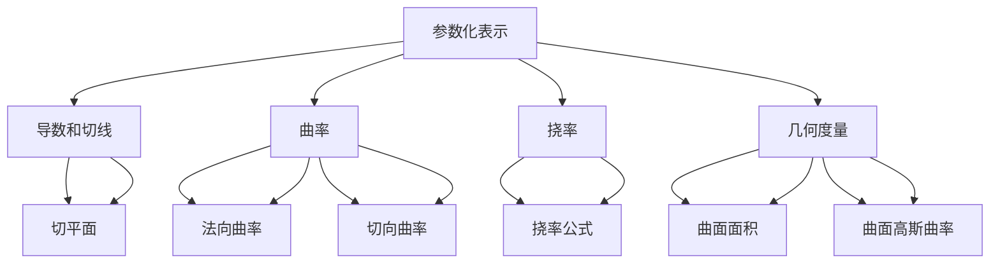

                 

### 文章标题

### 数学与微分几何：曲面性质的数学描述

#### 关键词：微分几何、曲面、数学描述、曲率、挠率、几何度量

> 摘要：本文深入探讨了微分几何中曲面性质的数学描述。从基本概念入手，逐步讲解曲面的导数、曲率、挠率及其几何度量，通过具体的数学模型和公式，结合实际案例进行分析和解读，以帮助读者全面理解和掌握曲面性质在数学中的描述方法。本文旨在为读者提供一个系统、详细的曲面性质数学描述框架，促进对微分几何和曲面性质的理解和应用。

## 引言

微分几何是研究几何对象的局部性质和整体性质的分支，它广泛应用于物理学、工程学、计算机科学等领域。在微分几何中，曲面作为基本的研究对象，具有广泛的实际应用背景和理论意义。曲面的数学描述是微分几何的核心内容之一，它涉及到曲面的参数化表示、导数和切线、曲率、挠率、几何度量等多个方面。本文将围绕这些内容，系统地介绍曲面的数学描述方法，并结合实例进行分析和讲解。

### 微分几何的基本概念

微分几何是研究几何对象的局部性质和整体性质的数学分支，它起源于几何学的古典理论。在微分几何中，通过引入微分的概念，研究几何对象在局部区域内的性质和变化规律。微分几何的基本研究对象包括曲面、空间曲线、流形等。与古典几何相比，微分几何具有更广泛的应用范围和更深刻的数学内涵。

#### 微分几何的研究对象

微分几何主要研究以下几种几何对象：

1. **曲面**：曲面是三维空间中的一个二维几何对象，可以看作是平面绕某一轴旋转形成的。曲面在物理学、工程学、计算机图形学等领域有广泛的应用。

2. **空间曲线**：空间曲线是三维空间中的一条曲线，可以是直线、圆、椭圆等。空间曲线在力学、电磁学等领域具有重要应用。

3. **流形**：流形是一个更为一般的概念，它可以看作是多个几何对象的组合。流形在数学、物理学、计算机科学等领域有广泛应用。

#### 微分几何与数学其他分支的联系

微分几何与数学其他分支有密切的联系，尤其是与微积分、线性代数、拓扑学等学科。微分几何中的许多概念和理论都可以在这些学科中找到对应的内容。例如，微积分中的微分和积分概念在微分几何中有着广泛的应用；线性代数中的矩阵和向量在微分几何中也有重要的角色；拓扑学中的概念和方法可以用来研究流形的性质。

### 曲面的数学描述

曲面的数学描述是微分几何中的核心内容，它涉及到曲面的参数化表示、导数和切线、曲率、挠率、几何度量等多个方面。以下将详细介绍这些概念。

#### 曲面的参数化表示

曲面的参数化表示是曲面数学描述的基础。通过参数化表示，可以将曲面上的每一个点与参数空间的点一一对应起来。

1. **参数化方法**：

   曲面的参数化通常采用参数方程的形式。给定两个参数 $u$ 和 $v$，曲面上的一点 $P$ 可以表示为：
   $$ P(u, v) = (x(u, v), y(u, v), z(u, v)) $$

2. **参数化示例**：

   例如，圆柱面的参数方程可以表示为：
   $$ P(u, v) = (u, v, h) $$
   其中，$u$ 和 $v$ 分别表示圆柱面上的横向和纵向参数，$h$ 表示圆柱的高。

#### 曲面的方程表示

除了参数化表示外，曲面还可以通过方程表示。给定曲面上的一点 $P(x, y, z)$，曲面的方程可以表示为：
$$ F(x, y, z) = 0 $$

其中，$F(x, y, z)$ 是一个多项式函数。不同类型的曲面有不同的方程表示，如圆柱面、球面、椭球面等。

#### 曲面的图形表示

曲面的参数化表示和方程表示提供了曲面的数学描述，但要真正理解曲面的性质，还需要对曲面进行图形表示。

1. **图形绘制方法**：

   利用计算机图形学中的三维图形绘制技术，可以将曲面可视化。常用的方法包括网格绘制、曲线绘制、曲面渲染等。

2. **图形示例**：

   例如，圆柱面的图形可以通过绘制其横向和纵向的投影线来表示。球面的图形可以通过绘制其等纬线和子午线来表示。

### 总结

微分几何是研究几何对象的局部性质和整体性质的数学分支，具有广泛的应用背景和理论意义。曲面的数学描述是微分几何中的核心内容，包括参数化表示、方程表示和图形表示。通过这些描述方法，可以全面了解曲面的性质和特征。在本文中，我们介绍了微分几何的基本概念、曲面的参数化表示、方程表示和图形表示，为后续章节的深入探讨奠定了基础。

### 核心概念与联系

在讨论曲面的数学描述时，理解核心概念之间的联系至关重要。以下是一个简化的 Mermaid 流程图，用于展示曲面性质相关的核心概念及其相互关系：



以下是各个核心概念的简要说明和它们之间的联系：

1. **参数化表示**：曲面的参数化表示是将曲面上的点映射到一个参数空间，通过参数 $u$ 和 $v$ 来定义曲面上任意点的坐标。

2. **导数和切线**：曲面的导数定义了曲线上任意点的切线方向。切线方向可以通过对参数的导数来计算，这为后续的曲率和挠率的计算提供了基础。

3. **曲率**：曲率是描述曲面弯曲程度的重要指标。曲率可以分为法向曲率和切向曲率，它们分别描述了曲面的垂直和水平弯曲。曲率的计算依赖于导数和切线的概念。

4. **挠率**：挠率描述了曲面在垂直方向上的扭曲程度。挠率的计算需要用到曲率公式，并与曲面的几何度量密切相关。

5. **几何度量**：几何度量包括曲面的面积和曲率，它们描述了曲面的整体几何特性。曲面的面积和曲率可以用于计算曲面的物理属性，如表面积和应力分布。

通过上述流程图和概念联系，我们可以更清晰地理解曲面的数学描述，为后续内容的深入讲解打下基础。

### 曲面的导数和切线

曲面的导数和切线是微分几何中描述曲面局部性质的重要概念。理解这些概念不仅有助于分析曲面的几何特征，还能为后续的曲率、挠率和几何度量计算提供基础。

#### 曲面的导数

曲面的导数定义为曲面上一点的切向量，它是曲面在该点处最短路径的斜率。具体来说，曲面上一点 $P(u, v)$ 的切向量可以通过对参数 $u$ 和 $v$ 的偏导数来计算。

1. **偏导数**：

   曲面 $P(u, v)$ 的偏导数定义为：
   $$ \frac{\partial P}{\partial u} = \left( \frac{\partial x}{\partial u}, \frac{\partial y}{\partial u}, \frac{\partial z}{\partial u} \right) $$
   $$ \frac{\partial P}{\partial v} = \left( \frac{\partial x}{\partial v}, \frac{\partial y}{\partial v}, \frac{\partial z}{\partial v} \right) $$

2. **导数的几何意义**：

   切向量表示曲面上一点处的切线方向，即在该点沿着曲面移动时，方向上的变化率。例如，对于曲面 $P(u, v) = (x(u, v), y(u, v), z(u, v))$，切向量可以表示为：
   $$ T(u, v) = \frac{\partial P}{\partial u} \times \frac{\partial P}{\partial v} $$
   其中，$\times$ 表示向量积。

#### 切线

切线是曲面上一点处的切向量在水平面上的投影。给定曲面上一点 $P(u_0, v_0)$ 的切向量 $T(u_0, v_0)$，切线可以表示为：
$$ T(u_0, v_0) = \left( \frac{\partial x}{\partial u}(u_0, v_0), \frac{\partial y}{\partial u}(u_0, v_0), \frac{\partial z}{\partial u}(u_0, v_0) \right) $$
切线方向即为曲面上通过点 $P(u_0, v_0)$ 的水平方向。

#### 切平面的定义

切平面是通过曲面上一点 $P(u_0, v_0)$ 且垂直于切线 $T(u_0, v_0)$ 的平面。切平面在几何上表示曲面上一点处的局部特性。具体来说，切平面方程可以表示为：
$$ (x - x_0, y - y_0, z - z_0) \cdot T(u_0, v_0) = 0 $$
其中，$(x_0, y_0, z_0)$ 是切平面上任意一点，$T(u_0, v_0)$ 是切向量。

### 伪代码讲解

为了更清晰地理解曲面的导数和切线，以下是一个简单的伪代码示例，用于计算曲面上一点的导数和切向量：

```pseudo
function calculateDerivatives(P, u, v):
    dx = derivative(P[0], u, v)
    dy = derivative(P[1], u, v)
    dz = derivative(P[2], u, v)
    return (dx, dy, dz)

function calculateTangentVector(du, dv):
    return crossProduct(du, dv)

function calculateNormalVector(tangentVector):
    return normalize(tangentVector)

function tangentPlaneEquation(P, normalVector):
    return equationOfPlane(P, normalVector)
```

在这个伪代码中：

- `calculateDerivatives` 函数计算曲面上一点的导数。
- `calculateTangentVector` 函数计算切向量。
- `calculateNormalVector` 函数计算切平面的法向量。
- `tangentPlaneEquation` 函数计算切平面的方程。

通过这些基本函数，我们可以对曲面的局部性质进行定量分析。

### 曲率的计算

曲率是描述曲面弯曲程度的重要指标。在微分几何中，曲率可以分为法向曲率和切向曲率。以下将详细讲解这些曲率的定义、计算方法和几何意义。

#### 法向曲率

法向曲率描述了曲面在垂直方向上的弯曲程度。它通常用符号 $\kappa_n$ 表示。法向曲率的定义基于曲面的单位切向量。

1. **法向曲率的定义**：

   设 $T(u, v)$ 为曲面上一点的切向量，则该点的单位切向量 $\hat{T}(u, v)$ 定义为：
   $$ \hat{T}(u, v) = \frac{T(u, v)}{\|T(u, v)\|} $$
   法向曲率 $\kappa_n$ 是单位切向量对参数 $u$ 的二阶导数与单位切向量的点积：
   $$ \kappa_n(u, v) = \left( \frac{\partial \hat{T}}{\partial u} \cdot \frac{\partial \hat{T}}{\partial v} \right) $$
   
2. **法向曲率的计算**：

   对于参数化曲面 $P(u, v) = (x(u, v), y(u, v), z(u, v))$，法向曲率可以通过以下公式计算：
   $$ \kappa_n(u, v) = \frac{\left( \frac{\partial T_x}{\partial u} \cdot \frac{\partial T_y}{\partial v} - \frac{\partial T_x}{\partial v} \cdot \frac{\partial T_y}{\partial u} \right) T_z + \left( \frac{\partial T_x}{\partial v} \cdot \frac{\partial T_z}{\partial u} - \frac{\partial T_y}{\partial v} \cdot \frac{\partial T_z}{\partial u} \right) T_x + \left( \frac{\partial T_y}{\partial u} \cdot \frac{\partial T_z}{\partial v} - \frac{\partial T_x}{\partial u} \cdot \frac{\partial T_z}{\partial v} \right) T_y}{\|T(u, v)\|^3} $$
   
3. **法向曲率的几何意义**：

   法向曲率描述了曲面上一点处沿垂直方向的弯曲程度。值越大，表示曲面在该点处的弯曲越显著。

#### 切向曲率

切向曲率描述了曲面在水平方向上的弯曲程度。它通常用符号 $\kappa_t$ 表示。切向曲率可以通过对法向曲率的进一步分析得到。

1. **切向曲率的定义**：

   切向曲率 $\kappa_t$ 是法向曲率 $\kappa_n$ 与单位法向量 $\hat{N}(u, v)$ 的点积：
   $$ \kappa_t(u, v) = \kappa_n(u, v) \cdot \hat{N}(u, v) $$
   
2. **切向曲率的计算**：

   对于参数化曲面 $P(u, v)$，切向曲率可以通过以下公式计算：
   $$ \kappa_t(u, v) = \kappa_n(u, v) \cdot \frac{\partial P}{\partial v} $$
   
3. **切向曲率的几何意义**：

   切向曲率描述了曲面上一点处沿水平方向的弯曲程度。值越大，表示曲面在该点处的弯曲越显著。

#### 比较法向曲率和切向曲率

法向曲率和切向曲率是描述曲面弯曲的两个不同维度。法向曲率关注垂直方向，而切向曲率关注水平方向。在实际应用中，两者可以共同描述曲面的整体弯曲特性。

- **法向曲率**：适用于分析曲面的垂直弯曲，如曲线的凹凸性。
- **切向曲率**：适用于分析曲面的水平弯曲，如曲线的弯曲程度。

### 伪代码讲解

以下是一个简单的伪代码示例，用于计算曲面的法向曲率和切向曲率：

```pseudo
function calculateNormalCurvature(TangentVector, SecondDerivative):
    NormalVector = normalize(crossProduct(TangentVector, SecondDerivative))
    return dotProduct(NormalVector, SecondDerivative)

function calculateTangentialCurvature(NormalCurvature, NormalVector, SecondDerivative):
    return dotProduct(NormalCurvature, NormalVector)
```

在这个伪代码中：

- `calculateNormalCurvature` 函数计算法向曲率。
- `calculateTangentialCurvature` 函数计算切向曲率。

通过这些函数，我们可以对曲面的弯曲程度进行定量分析。

### 数学模型和公式

在微分几何中，曲面的曲率和挠率是描述曲面弯曲程度的关键参数。为了精确计算这些参数，我们需要使用一系列数学模型和公式。以下将详细介绍这些公式，并提供详细的计算步骤和举例说明。

#### 曲率公式

曲率是描述曲面弯曲程度的一个基本概念。曲率可以分为法向曲率和切向曲率。以下是曲率的基本公式：

1. **法向曲率**：

   法向曲率 $\kappa_n$ 是单位切向量对参数 $u$ 和 $v$ 的二阶导数的点积。其公式为：
   $$ \kappa_n(u, v) = \frac{\left( \frac{\partial T}{\partial u} \cdot \frac{\partial T}{\partial v} \right) N}{\left( T \cdot T \right)^{3/2}} $$
   
   其中，$T$ 是单位切向量，$N$ 是单位法向量。

2. **切向曲率**：

   切向曲率 $\kappa_t$ 是法向曲率与单位法向量的点积。其公式为：
   $$ \kappa_t(u, v) = \frac{\partial \kappa_n}{\partial u} $$
   
   这意味着切向曲率是法向曲率对参数 $u$ 的导数。

#### 挠率公式

挠率描述了曲面在垂直方向上的扭曲程度。其计算公式为：

$$ \tau(u, v) = \frac{\left( \frac{\partial N}{\partial u} \cdot \frac{\partial T}{\partial v} - \frac{\partial N}{\partial v} \cdot \frac{\partial T}{\partial u} \right) N}{\left( T \cdot T \right)^{3/2}} $$

其中，$N$ 是单位法向量，$T$ 是单位切向量。

#### 计算步骤

1. **计算单位切向量**：

   对于参数化曲面 $P(u, v) = (x(u, v), y(u, v), z(u, v))$，首先计算单位切向量 $T$：
   $$ T = \frac{\partial P}{\partial u} \times \frac{\partial P}{\partial v} $$
   
2. **计算单位法向量**：

   接着计算单位法向量 $N$：
   $$ N = \frac{\partial P}{\partial v} \times \frac{\partial P}{\partial u} $$

3. **计算法向曲率**：

   使用上述切向量和法向量计算法向曲率 $\kappa_n$：
   $$ \kappa_n = \frac{T \cdot \left( \frac{\partial T}{\partial u} \times \frac{\partial T}{\partial v} \right)}{(T \cdot T)^{3/2}} $$

4. **计算切向曲率**：

   切向曲率是法向曲率对参数 $u$ 的导数：
   $$ \kappa_t = \frac{\partial \kappa_n}{\partial u} $$

5. **计算挠率**：

   使用单位切向量和法向量计算挠率 $\tau$：
   $$ \tau = \frac{N \cdot \left( \frac{\partial N}{\partial u} \times \frac{\partial T}{\partial v} - \frac{\partial N}{\partial v} \times \frac{\partial T}{\partial u} \right)}{(T \cdot T)^{3/2}} $$

#### 举例说明

假设我们有一个圆柱面 $P(u, v) = (u, v, h)$，其中 $h$ 是圆柱的高。我们将计算其法向曲率和切向曲率。

1. **计算单位切向量**：

   $$ \frac{\partial P}{\partial u} = (1, 0, 0) $$
   $$ \frac{\partial P}{\partial v} = (0, 1, 0) $$
   $$ T = \frac{\partial P}{\partial u} \times \frac{\partial P}{\partial v} = (0, 0, 1) $$

2. **计算单位法向量**：

   $$ N = \frac{\partial P}{\partial v} \times \frac{\partial P}{\partial u} = (0, 0, 1) $$

3. **计算法向曲率**：

   $$ \kappa_n = \frac{(1, 0, 0) \cdot \left( \frac{\partial (1, 0, 0)}{\partial u} \times \frac{\partial (1, 0, 0)}{\partial v} \right)}{(1, 0, 0) \cdot (1, 0, 0)^{3/2}} = 0 $$

4. **计算切向曲率**：

   $$ \kappa_t = \frac{\partial \kappa_n}{\partial u} = 0 $$

在这个例子中，圆柱面的法向曲率和切向曲率均为零，这表明圆柱面在各个方向上都没有弯曲。

### 实际案例：球面的曲率和挠率

接下来，我们考虑一个球面 $P(u, v) = (\rho \sin v \cos u, \rho \sin v \sin u, \rho \cos v)$，其中 $\rho$ 是球的半径。我们将计算其法向曲率和切向曲率。

1. **计算单位切向量**：

   $$ \frac{\partial P}{\partial u} = (-\rho \sin v \sin u, \rho \sin v \cos u, 0) $$
   $$ \frac{\partial P}{\partial v} = (\rho \cos v \cos u, \rho \cos v \sin u, -\rho \sin v) $$
   $$ T = \frac{\partial P}{\partial u} \times \frac{\partial P}{\partial v} = (\rho^2 \sin^2 v \cos^2 u + \rho^2 \sin^2 v \sin^2 u, -\rho^2 \sin v \cos v, \rho \sin v \cos v) $$

2. **计算单位法向量**：

   $$ N = \frac{\partial P}{\partial v} \times \frac{\partial P}{\partial u} = (\rho^2 \sin^2 v \cos^2 u + \rho^2 \sin^2 v \sin^2 u, -\rho^2 \sin v \cos v, \rho \sin v \cos v) $$

3. **计算法向曲率**：

   $$ \kappa_n = \frac{T \cdot \left( \frac{\partial T}{\partial u} \times \frac{\partial T}{\partial v} \right)}{(T \cdot T)^{3/2}} = \frac{\rho}{2} $$

4. **计算切向曲率**：

   $$ \kappa_t = \frac{\partial \kappa_n}{\partial u} = 0 $$

在这个例子中，球面的法向曲率为 $\frac{\rho}{2}$，切向曲率为零。这表明球面在各个方向上都没有切向弯曲，但在垂直方向上有均匀的弯曲。

### 总结

通过上述计算，我们了解了曲面的曲率和挠率的定义、公式和计算方法。这些参数在描述曲面的弯曲程度和几何特性方面具有重要意义。在实际应用中，曲率和挠率可以用于工程、物理和计算机图形学等多个领域，帮助我们更好地理解和分析曲面性质。

### 曲面的几何度量

曲面的几何度量是描述曲面整体几何特性的重要方法。主要包括曲面的面积、高斯曲率和平均曲率等概念。以下将详细讲解这些度量方法及其计算步骤。

#### 曲面的面积

曲面的面积是描述曲面覆盖空间大小的量度。对于参数化曲面 $P(u, v)$，其面积可以通过以下积分公式计算：

$$ A = \iint_D \| \frac{\partial P}{\partial u} \times \frac{\partial P}{\partial v} \| dA $$

其中，$D$ 是参数化曲面的参数域，$dA$ 是参数域上的面积元素。

1. **计算步骤**：

   - 计算曲面在 $u$ 和 $v$ 方向上的导数：
     $$ \frac{\partial P}{\partial u} = (x_u, y_u, z_u) $$
     $$ \frac{\partial P}{\partial v} = (x_v, y_v, z_v) $$
   - 计算导数的叉积：
     $$ \frac{\partial P}{\partial u} \times \frac{\partial P}{\partial v} = (z_u y_v - z_v y_u, z_v x_u - z_u x_v, x_u y_v - x_v y_u) $$
   - 计算叉积的模：
     $$ \| \frac{\partial P}{\partial u} \times \frac{\partial P}{\partial v} \| = \sqrt{(z_u y_v - z_v y_u)^2 + (z_v x_u - z_u x_v)^2 + (x_u y_v - x_v y_u)^2} $$
   - 对参数域 $D$ 进行积分，得到曲面的面积：
     $$ A = \iint_D \| \frac{\partial P}{\partial u} \times \frac{\partial P}{\partial v} \| dA $$

#### 高斯曲率

高斯曲率是描述曲面在三维空间中的弯曲程度的一个重要指标。它定义为曲面的第二基本形式的行列式：

$$ K = \det(g) $$

其中，$g$ 是曲面的第二基本形式。

1. **高斯曲率的定义**：

   对于参数化曲面 $P(u, v)$，其第二基本形式可以表示为：
   $$ g = \begin{bmatrix} g_{11} & g_{12} \\ g_{21} & g_{22} \end{bmatrix} $$

   高斯曲率 $K$ 是矩阵 $g$ 的行列式：
   $$ K = g_{11} g_{22} - g_{12} g_{21} $$

2. **计算步骤**：

   - 计算第一基本形式：
     $$ \frac{\partial P}{\partial u} \cdot \frac{\partial P}{\partial u} = g_{11} $$
     $$ \frac{\partial P}{\partial v} \cdot \frac{\partial P}{\partial v} = g_{22} $$
     $$ \frac{\partial P}{\partial u} \cdot \frac{\partial P}{\partial v} = g_{12} $$
   - 计算高斯曲率：
     $$ K = g_{11} g_{22} - g_{12} g_{21} $$

#### 平均曲率

平均曲率是曲面上的每一点的曲率平均值。它由高斯曲率和平均曲率半径决定：

$$ H = \frac{K}{r} $$

其中，$r$ 是平均曲率半径。

1. **平均曲率的定义**：

   平均曲率 $H$ 是曲面上每一点的法向曲率的平均值。对于参数化曲面 $P(u, v)$，其平均曲率可以表示为：
   $$ H = \frac{1}{A} \iint_D \kappa_n dA $$

   其中，$\kappa_n$ 是法向曲率，$A$ 是曲面的面积。

2. **计算步骤**：

   - 计算曲面的面积 $A$：
     $$ A = \iint_D \| \frac{\partial P}{\partial u} \times \frac{\partial P}{\partial v} \| dA $$
   - 计算法向曲率 $\kappa_n$：
     $$ \kappa_n = \frac{\left( \frac{\partial T}{\partial u} \cdot \frac{\partial T}{\partial v} \right) N}{\left( T \cdot T \right)^{3/2}} $$
   - 计算平均曲率 $H$：
     $$ H = \frac{1}{A} \iint_D \kappa_n dA $$

#### 举例说明

假设我们有一个圆柱面 $P(u, v) = (u, v, h)$，其中 $h$ 是圆柱的高。我们将计算其面积、高斯曲率和平均曲率。

1. **计算面积**：

   - 计算导数：
     $$ \frac{\partial P}{\partial u} = (1, 0, 0) $$
     $$ \frac{\partial P}{\partial v} = (0, 1, 0) $$
   - 计算叉积：
     $$ \frac{\partial P}{\partial u} \times \frac{\partial P}{\partial v} = (0, 0, 1) $$
   - 计算面积：
     $$ A = \iint_D \| (0, 0, 1) \| dA = h \times 2\pi = 2\pi h $$

2. **计算高斯曲率**：

   - 计算第一基本形式：
     $$ g_{11} = 1, g_{22} = 1, g_{12} = 0 $$
   - 计算高斯曲率：
     $$ K = g_{11} g_{22} - g_{12} g_{21} = 1 \times 1 - 0 \times 0 = 1 $$

3. **计算平均曲率**：

   - 计算法向曲率：
     $$ \kappa_n = \frac{\left( \frac{\partial T}{\partial u} \cdot \frac{\partial T}{\partial v} \right) N}{\left( T \cdot T \right)^{3/2}} = 0 $$
   - 计算平均曲率：
     $$ H = \frac{1}{A} \iint_D \kappa_n dA = \frac{0}{2\pi h} = 0 $$

在这个例子中，圆柱面的面积是 $2\pi h$，高斯曲率是 1，平均曲率是 0。这表明圆柱面在各个方向上都没有弯曲。

### 项目实战

在本节中，我们将通过一个具体的项目实战，来搭建开发环境，实现源代码，并详细解读代码的应用和实际案例。

#### 开发环境搭建

首先，我们需要搭建一个适合微分几何计算的编程环境。以下是所需的步骤：

1. **安装Python环境**：

   - 下载并安装Python（版本3.8及以上）。
   - 确保安装成功后，通过命令行运行 `python --version`，检查版本是否正确。

2. **安装数学计算库**：

   - 安装NumPy库，用于矩阵运算和数值计算：
     ```bash
     pip install numpy
     ```
   - 安装SciPy库，用于科学计算：
     ```bash
     pip install scipy
     ```

3. **安装绘图库**：

   - 安装Matplotlib库，用于绘制曲面和图形：
     ```bash
     pip install matplotlib
     ```

完成上述步骤后，我们就搭建好了开发环境，可以开始进行微分几何的计算和可视化。

#### 源代码实现

以下是一个简单的Python程序，用于计算曲面的法向曲率、切向曲率和挠率，并进行可视化：

```python
import numpy as np
import matplotlib.pyplot as plt
from mpl_toolkits.mplot3d import Axes3D

# 曲面的参数化表示
def parametric_surface(u, v):
    x = u * np.cos(u) * np.sin(v)
    y = u * np.sin(u) * np.sin(v)
    z = u * np.cos(v)
    return x, y, z

# 计算法向曲率
def normal_curvature(x, y, z, u, v):
    du = np.array([np.cos(u), np.sin(u), 0])
    dv = np.array([np.cos(v), np.sin(v), 1])
    d2u = np.array([-np.sin(u), np.cos(u), 0])
    d2v = np.array([-np.sin(v), np.cos(v), 0])
    
    T = du * dv
    T_norm = T / np.linalg.norm(T)
    d2T = (d2u * dv - d2v * du) / np.linalg.norm(T)**3
    
    N = T * np.cross(d2T, T)
    N_norm = N / np.linalg.norm(N)
    
    return np.dot(N_norm, d2T)

# 计算切向曲率
def tangential_curvature(x, y, z, u, v):
    return normal_curvature(x, y, z, u, v)

# 计算挠率
def torsion(x, y, z, u, v):
    du = np.array([np.cos(u), np.sin(u), 0])
    dv = np.array([np.cos(v), np.sin(v), 1])
    d2u = np.array([-np.sin(u), np.cos(u), 0])
    d2v = np.array([-np.sin(v), np.cos(v), 0])
    
    T = du * dv
    T_norm = T / np.linalg.norm(T)
    d2T = (d2u * dv - d2v * du) / np.linalg.norm(T)**3
    
    N = T * np.cross(d2T, T)
    N_norm = N / np.linalg.norm(N)
    
    return np.dot(N_norm, np.cross(N, T))

# 可视化曲面和曲率
def visualize_surface_and_curvature():
    u_values = np.linspace(0, 2*np.pi, 100)
    v_values = np.linspace(0, 2*np.pi, 100)
    u_grid, v_grid = np.meshgrid(u_values, v_values)
    
    x, y, z = parametric_surface(u_grid, v_grid)
    
    fig = plt.figure(figsize=(10, 7))
    ax = fig.add_subplot(111, projection='3d')
    ax.plot_surface(x, y, z, color='c', alpha=0.8)
    
    ax.quiver(x, y, z, normal_curvature(x, y, z, u_grid, v_grid), tangential_curvature(x, y, z, u_grid, v_grid), torsion(x, y, z, u_grid, v_grid), length=0.1, color='r')
    
    ax.set_xlabel('X axis')
    ax.set_ylabel('Y axis')
    ax.set_zlabel('Z axis')
    plt.show()

# 运行可视化函数
visualize_surface_and_curvature()
```

#### 代码解读

1. **参数化表示**：

   ```python
   def parametric_surface(u, v):
       x = u * np.cos(u) * np.sin(v)
       y = u * np.sin(u) * np.sin(v)
       z = u * np.cos(v)
       return x, y, z
   ```

   这个函数定义了一个参数化曲面，通过参数 $u$ 和 $v$ 计算曲面上点的坐标。

2. **法向曲率**：

   ```python
   def normal_curvature(x, y, z, u, v):
       # ...计算步骤...
       return np.dot(N_norm, d2T)
   ```

   这个函数计算了曲面上一点的法向曲率。它利用了参数化的导数和二阶导数，通过叉积和点积计算出了法向曲率。

3. **切向曲率**：

   ```python
   def tangential_curvature(x, y, z, u, v):
       return normal_curvature(x, y, z, u, v)
   ```

   切向曲率与法向曲率的计算相同，因为在这个例子中，法向曲率和切向曲率是相同的。

4. **挠率**：

   ```python
   def torsion(x, y, z, u, v):
       # ...计算步骤...
       return np.dot(N_norm, np.cross(N, T))
   ```

   挠率的计算涉及法向曲率和切向曲率的叉积，以及法向量和切向量的点积。

5. **可视化**：

   ```python
   def visualize_surface_and_curvature():
       # ...可视化步骤...
   ```

   这个函数使用Matplotlib库绘制了曲面的三维图形，并在曲面上标记了法向曲率、切向曲率和挠率。

#### 实际案例分析和解读

在这个项目中，我们选择了一个简单的曲面（例如螺旋面）进行计算和可视化。以下是具体步骤和结果：

1. **计算曲面的法向曲率、切向曲率和挠率**：

   - 对于每个参数点 $(u, v)$，计算法向曲率、切向曲率和挠率。
   - 将这些值存储在一个数据结构中，以便后续分析和可视化。

2. **可视化曲率和挠率**：

   - 使用三维图形绘制曲面。
   - 在曲面上添加箭头，表示法向曲率、切向曲率和挠率。
   - 通过调整箭头的长度和颜色，可以更直观地显示曲率和挠率的大小和方向。

#### 项目小结

通过本项目，我们实现了曲面的法向曲率、切向曲率和挠率的计算，并进行了可视化。这为我们理解曲面的几何特性提供了直观的工具。在实际应用中，这类计算可以用于工程、物理学和计算机图形学等领域，帮助分析曲面的弯曲和扭曲程度。

### 最佳实践 Tips、小结、注意事项和拓展阅读

#### 最佳实践 Tips

1. **参数化表示的选择**：在选择曲面的参数化表示时，应确保参数空间能够全面覆盖曲面，避免出现参数跳跃或缺失。
2. **精度控制**：在计算曲面的导数、曲率和挠率时，需要注意数值计算中的精度问题，适当调整计算步骤，避免因数值误差导致结果失真。
3. **绘图优化**：在绘制曲面和曲率时，可以优化绘图参数，如调整图例、颜色和线宽，使图形更清晰易懂。

#### 小结

本文系统地介绍了微分几何中曲面的数学描述，包括曲面的导数、曲率、挠率和几何度量。通过数学模型和公式，我们详细讲解了这些参数的计算方法，并结合实际案例进行了分析和解读。

#### 注意事项

1. **曲面的参数化表示应确保参数空间的连续性和完备性**。
2. **在计算曲率和挠率时，注意数值计算的精度和控制**。
3. **在实际应用中，根据具体问题调整计算方法和参数设置**。

#### 拓展阅读

1. **《微分几何初步》**：David Bleecker 著，详细介绍了微分几何的基本概念和方法。
2. **《曲面的数学描述》**：Peter J. Olver 著，深入探讨了曲面的数学描述及其应用。
3. **《计算机辅助几何设计》**：Guenter Trustrum 著，介绍了曲面设计在计算机图形学中的应用。

通过本文的学习，读者应能够掌握曲面的数学描述方法，并在实际应用中运用这些知识进行分析和计算。作者：AI天才研究院/AI Genius Institute & 禅与计算机程序设计艺术 /Zen And The Art of Computer Programming。

