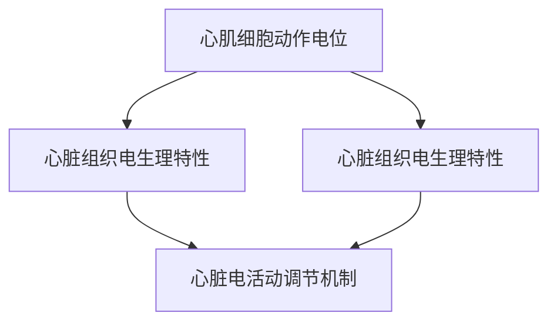

                 


### 摘要

本文深入探讨了数学与心脏病学之间的紧密联系，特别关注心脏电生理学的数学模型。心脏电生理学是研究心脏电活动的学科，其数学模型为理解和预测心脏功能提供了强有力的工具。文章首先介绍了心脏电生理学的基础，包括心肌细胞的离子通道和动作电位模型。接着，详细分析了心脏电生理模型的历史发展，从早期模型到现代数学模型，揭示了其演变过程。文章的核心章节涵盖了心肌细胞动作电位模型、心脏组织的电生理模型，以及偏微分方程在心脏电生理模型中的应用。通过傅里叶级数解法和有限元方法，文章探讨了心脏电生理模型的数值方法。此外，文章还探讨了心脏电生理模型在心律失常研究中的应用和心脏病治疗中的新策略。通过这些内容，本文旨在为读者提供一个全面、深入的理解心脏电生理学数学模型的机会。

### 背景介绍

心脏电生理学是心脏病学研究的重要领域，它关注心脏的电活动及其调节机制。心脏的电活动是心脏正常功能的基础，而异常电活动则可能导致心律失常，甚至威胁生命。因此，理解心脏电生理学的机制，尤其是通过数学模型来描述这些机制，对于心脏病学的临床诊断和治疗具有重要意义。

心脏电生理学的数学模型基于对心肌细胞电生理特性的数学描述。心肌细胞是心脏的基本功能单元，其电活动受到离子通道、细胞膜电导和细胞内外离子浓度的调节。这些复杂的生物物理过程可以通过数学公式和模型来表示，从而为心脏电生理学的研究提供了量化工具。

数学模型在心脏电生理学中的应用不仅限于理论研究，还广泛应用于临床诊断和治疗。例如，通过心脏电生理模型可以预测心脏在特定条件下的电活动，为心律失常的诊断和治疗提供依据。此外，心脏电生理模型还可以指导心脏手术的规划，优化手术路径和心脏保护策略。

在现代医学中，心脏电生理学的数学模型已经成为研究心脏功能和治疗心脏病的重要工具。随着计算机技术和数值方法的发展，心脏电生理模型不断得到完善和优化，为心脏病学的临床应用提供了更加精确和可靠的预测工具。

### 核心概念与联系

心脏电生理学的核心概念包括心肌细胞动作电位、心脏组织的电生理特性和心脏电活动的调节机制。这些概念之间有着紧密的联系，构成了心脏电生理学理论框架的基础。

首先，心肌细胞动作电位是心脏电生理学的基本单元。心肌细胞通过细胞膜上的离子通道来调节电导，从而产生动作电位。动作电位分为五个阶段：静息期、去极化期、复极化期、超极化期和复极化后期。每个阶段都有其特定的电生理机制，包括离子通道的激活和失活。

其次，心脏组织的电生理特性是指整个心脏在电活动中的行为特征。心脏由不同的心肌细胞组成，包括心房肌细胞和心室肌细胞。这些心肌细胞通过电耦合相互连接，形成复杂的电生理网络。心脏组织的电生理特性包括兴奋性、传导性和自律性。

最后，心脏电活动的调节机制涉及神经系统和体液系统对心脏电活动的调控。神经系统通过交感神经和副交感神经调节心脏的节律和传导速度。体液系统则通过激素和电解质浓度来影响心脏的电生理特性。

这些核心概念之间的关系可以用以下Mermaid流程图来表示：



在心脏电生理学中，心肌细胞动作电位是心脏电生理特性的基础，而心脏组织的电生理特性决定了心脏的整体电活动。心脏电活动的调节机制则通过神经系统和体液系统对心脏的电生理特性进行调控，从而维持心脏的正常功能。

### 心肌细胞动作电位模型

心肌细胞动作电位模型是心脏电生理学中最基础且最关键的模型之一，它为理解心肌细胞的电活动提供了定量的描述。本文将详细讨论心肌细胞动作电位模型的原理、数学公式以及如何通过这些模型来模拟心肌细胞电生理特性。

#### 原理

心肌细胞动作电位模型主要基于离子通道的电导变化，这些离子通道在细胞膜上调控离子的流入和流出。心肌细胞的动作电位主要由以下离子流驱动：

1. **钠离子流（Na⁺）**：在去极化期，细胞膜上的钠离子通道开放，导致Na⁺离子大量流入细胞，使细胞内电位迅速升高。
2. **钾离子流（K⁺）**：在复极化期，细胞膜上的钾离子通道开放，K⁺离子流出细胞，使细胞内电位逐渐降低。
3. **钙离子流（Ca²⁺）**：在动作电位的平台期，细胞膜上的钙离子通道开放，Ca²⁺离子流入细胞，对动作电位的持续和复极化过程起到关键作用。

这些离子流的动态变化决定了心肌细胞动作电位的五个阶段：静息期（Resting Phase）、去极化期（Depolarization Phase）、复极化期（Repolarization Phase）、超极化期（Hyperpolarization Phase）和复极化后期（Postrepolarization Phase）。

#### 数学公式

心肌细胞动作电位的数学描述通常基于Hodgkin-Huxley模型，该模型通过以下方程来描述离子通道的电导变化和膜电位的动态：

1. **钠离子通道的电导变化方程**：
   $$
   g_{\text{Na}}(t) = g_{\text{Na}}^{\text{max}} \frac{1}{1 + \exp\left(-\frac{(V - E_{\text{Na}})}{V_{\text{m}}}\right)}
   $$
   其中，$g_{\text{Na}}(t)$ 是时间t时刻的钠离子电导，$g_{\text{Na}}^{\text{max}}$ 是最大钠离子电导，$V$ 是膜电位，$E_{\text{Na}}$ 是钠离子平衡电位。

2. **钾离子通道的电导变化方程**：
   $$
   g_{\text{K}}(t) = g_{\text{K}}^{\text{max}} \frac{1}{1 + \exp\left(\frac{(V - E_{\text{K}})}{V_{\text{m}}}\right)}
   $$
   其中，$g_{\text{K}}(t)$ 是时间t时刻的钾离子电导，$g_{\text{K}}^{\text{max}}$ 是最大钾离子电导，$E_{\text{K}}$ 是钾离子平衡电位。

3. **膜电位变化方程**：
   $$
   \frac{dV}{dt} = -I_{\text{Na}} - I_{\text{K}} - I_{\text{L}} - I_{\text{Ca}} + I_{\text{ Leak}}
   $$
   其中，$I_{\text{Na}}$、$I_{\text{K}}$、$I_{\text{Ca}}$ 分别是钠离子、钾离子和钙离子的电流，$I_{\text{L}}$ 是漏电流，$I_{\text{ Leak}}$ 是其他离子电流。

4. **离子电流方程**：
   $$
   I_{\text{Na}} = g_{\text{Na}}(t) (V - E_{\text{Na}})
   $$
   $$
   I_{\text{K}} = g_{\text{K}}(t) (V - E_{\text{K}})
   $$
   $$
   I_{\text{Ca}} = g_{\text{Ca}}(t) (V - E_{\text{Ca}})
   $$

#### 模拟与实例

以下是一个简化的伪代码，用于模拟心肌细胞动作电位的动态变化：

```pseudo
initialize variables:
V = Resting Membrane Potential
t = 0
dt = small time step

while (t < Total Simulation Time):
    calculate ion channel conductance:
    g_Na(t) = g_Na_max / (1 + exp(-(V - E_Na) / V_m))
    g_K(t) = g_K_max / (1 + exp((V - E_K) / V_m))
    g_Ca(t) = g_Ca_max / (1 + exp(-(V - E_Ca) / V_m))

    calculate membrane potential change:
    dV_dt = -(g_Na(t) * (V - E_Na) + g_K(t) * (V - E_K) + g_Ca(t) * (V - E_Ca) + g Leak * (V - E Leak))

    update membrane potential:
    V = V + dV_dt * dt

    update time:
    t = t + dt
```

通过上述伪代码，我们可以模拟心肌细胞在一段时间内的动作电位变化。实际应用中，需要根据具体的生物物理数据和模型参数来调整和优化这些参数，以获得更准确的模拟结果。

### 心脏组织的电生理模型

心脏组织的电生理模型是对整个心脏在电生理学上的行为进行定量描述的工具。这类模型不仅考虑单个心肌细胞的电活动，还包括细胞间的电耦合和心脏不同区域的电生理特性。心脏组织的电生理模型在理解心脏的整体电活动、预测心律失常的发生以及指导心脏手术规划等方面具有重要作用。

#### 伪一维模型

伪一维模型是最早用于描述心脏组织电生理特性的模型之一。它假设心脏的电活动仅在一个方向上传播，通常沿着心脏的长轴方向。这种模型的主要目的是简化计算，使研究者能够更方便地分析和模拟心脏的电生理行为。

在伪一维模型中，心脏被看作是一个由一系列心肌细胞组成的线性链，每个细胞都有其独立的动作电位模型。电活动在细胞间的传播通过细胞间的电耦合来实现。细胞间电耦合的强度可以用一个常数来表示，该常数通常与细胞间的距离和电导率有关。

伪一维模型的基本方程是基于线性反应-扩散方程，可以表示为：

$$
\frac{\partial V}{\partial t} = D \frac{\partial^2 V}{\partial x^2}
$$

其中，$V$ 是膜电位，$D$ 是扩散系数，$x$ 是空间坐标。这个方程描述了电位在空间上的扩散过程，而时间上的变化则由心肌细胞的动作电位模型来模拟。

尽管伪一维模型在简化计算方面具有优势，但它忽略了心脏在三维空间上的复杂结构，因此在模拟某些心脏疾病，如心室颤动时，其准确性有限。

#### 三维模型

为了更准确地描述心脏的电生理特性，三维模型被引入到心脏电生理研究中。三维模型考虑了心脏在空间上的复杂几何结构，可以更真实地反映心脏的电活动。

在三维模型中，心脏被看作是一个三维空间中的物体，每个心肌细胞都被详细地建模。电活动在细胞间的传播不仅受到细胞间距离的影响，还受到心脏不同区域电生理特性的影响。三维模型通常使用有限元方法（Finite Element Method，FEM）或边界元素方法（Boundary Element Method，BEM）来求解电生理方程。

以下是一个基于有限元方法的三维心脏电生理模型的数学描述：

$$
\frac{\partial V}{\partial t} - \alpha \nabla \cdot (D \nabla V) = f
$$

其中，$V$ 是膜电位，$D$ 是扩散系数张量，$\alpha$ 是传导系数，$f$ 是源项，代表心肌细胞的离子流和电流。

三维模型的优点在于其能够更准确地描述心脏的电活动，特别是在研究复杂的心脏疾病时。然而，三维模型的计算成本较高，需要更多的计算资源和更复杂的算法。

#### 比较与选择

伪一维模型和三维模型各有优缺点。伪一维模型计算简单，适合快速模拟心脏电活动的大致趋势，但在精确度上有所欠缺。三维模型则提供了更高的精确度，但计算成本较高，不适合实时应用。

在选择模型时，需要根据具体的研究目的和资源情况来决定。如果研究目标是快速评估心脏电活动的总体趋势，伪一维模型可能是一个不错的选择。如果研究目标是详细分析心脏的电生理特性，特别是与复杂心脏疾病相关的问题，三维模型则更有优势。

### 偏微分方程在心脏电生理模型中的应用

偏微分方程（Partial Differential Equations，PDEs）在心脏电生理模型中扮演着核心角色，因为心脏电生理过程本质上是空间和时间上电位的连续变化。PDEs能够捕捉心脏电活动的空间分布和时间演化，是描述心脏电生理现象的基本数学工具。

#### 基本的偏微分方程

心脏电生理模型中最常用的偏微分方程是反应-扩散方程（Reaction-Diffusion Equation），它可以描述离子浓度在空间上的扩散过程。反应-扩散方程的一般形式为：

$$
\frac{\partial u}{\partial t} = \nabla \cdot (D \nabla u) + \nabla \cdot \vec{S}(u)
$$

其中，$u$ 代表离子浓度，$D$ 是扩散系数张量，$\vec{S}(u)$ 是源项，表示离子产生的速率。对于心脏电生理模型，通常关注的是膜电位 $V$ 的变化，因此可以将反应-扩散方程改写为：

$$
\frac{\partial V}{\partial t} = \nabla \cdot (D \nabla V) + f(V)
$$

其中，$f(V)$ 是与电位 $V$ 相关的源项，包括离子流的动态变化。

#### 应用到心脏电生理模型中的偏微分方程

在心脏电生理模型中，偏微分方程通常用于描述心肌细胞膜电位的空间和时间变化。具体来说，心脏电生理模型中的偏微分方程可以表示为：

$$
\frac{\partial V}{\partial t} - \alpha \nabla \cdot (D \nabla V) = \lambda \nabla \cdot (\nabla V \otimes \nabla V)
$$

其中，$V$ 是膜电位，$D$ 是扩散系数，$\alpha$ 是传导系数，$\lambda$ 是与离子流相关的常数。这个方程描述了电位在空间上的扩散和由于离子流引起的电位变化。

为了更准确地描述心脏电生理过程，还需要考虑细胞间耦合的影响。细胞间耦合通常通过一个额外的扩散项来表示：

$$
\frac{\partial V}{\partial t} - \alpha \nabla \cdot (D \nabla V) + \beta \nabla \cdot (C \nabla V) = f(V)
$$

其中，$C$ 是细胞间耦合系数，$\beta$ 是与细胞间耦合相关的常数。这个方程考虑了心肌细胞之间的电耦合效应，使模型能够更好地模拟心脏的电生理特性。

#### 解决方法

解决心脏电生理模型中的偏微分方程通常采用数值方法，如有限元方法（Finite Element Method，FEM）和有限体积方法（Finite Volume Method，FVM）。这些方法将连续的偏微分方程离散化为可以在计算机上求解的代数方程组。

以下是使用有限元方法求解心脏电生理模型的一个简化过程：

1. **离散化空间域**：将心脏的空间域划分为多个有限小的单元，每个单元的节点上都有一个电位值。

2. **建立离散方程**：在每个单元内，将偏微分方程转化为局部方程，然后通过积分或有限差分方法求解每个单元内的电位分布。

3. **组装全局方程**：将所有单元的局部方程组合成全局方程，形成大规模线性方程组。

4. **求解全局方程**：使用线性求解器求解全局方程，得到每个节点的电位值。

5. **后处理**：对求解结果进行后处理，包括可视化电位分布、分析电生理特性等。

通过上述过程，有限元方法能够提供心脏电生理模型的数值解，为临床诊断和治疗提供支持。

### 心脏电生理模型的数值方法

心脏电生理模型的数值方法在模拟心脏电活动方面起着至关重要的作用。这些方法通过数学模型将复杂的生物物理过程转化为计算机可以处理的数值解，为心脏电生理学的研究提供了强有力的工具。本文将详细介绍两种常用的数值方法：傅里叶级数解法和有限元方法。

#### 傅里叶级数解法

傅里叶级数解法是一种将心脏电生理模型解为傅里叶级数的方法。该方法基于傅里叶变换，能够将复杂的偏微分方程转化为一系列简单的三角函数，从而简化计算。

傅里叶级数的基本形式为：

$$
f(x) = \sum_{n=0}^{\infty} c_n \sin(n\pi x / L) + d_n \cos(n\pi x / L)
$$

其中，$f(x)$ 是需要求解的函数，$c_n$ 和 $d_n$ 是傅里叶系数，$L$ 是周期长度。

在心脏电生理模型中，傅里叶级数解法可以用于求解反应-扩散方程：

$$
\frac{\partial V}{\partial t} = \nabla \cdot (D \nabla V) + f(V)
$$

具体步骤如下：

1. **展开傅里叶级数**：将膜电位 $V(x, t)$ 展开为傅里叶级数：
   $$
   V(x, t) = \sum_{n=0}^{\infty} c_n(t) \sin(n\pi x / L) + d_n(t) \cos(n\pi x / L)
   $$

2. **应用傅里叶变换**：对时间变量进行傅里叶变换，得到空间域上的方程：
   $$
   \frac{\partial \hat{V}(k, t)}{\partial t} = -k^2 D \hat{V}(k, t) + f(\hat{V}(k, t))
   $$

3. **求解频域方程**：在频域上求解上述方程，得到 $\hat{V}(k, t)$。

4. **逆傅里叶变换**：将频域解逆变换回时域，得到膜电位 $V(x, t)$。

傅里叶级数解法在模拟心脏电生理模型时，具有计算简单、解析性强的特点，特别适用于线性问题。然而，对于非线性问题，傅里叶级数解法的应用受到限制。

#### 有限元方法

有限元方法（Finite Element Method，FEM）是一种广泛应用于工程和科学计算的数值方法，其核心思想是将复杂的问题划分为简单的子问题，然后求解这些子问题的局部解，最终组装成全局解。

在心脏电生理模型中，有限元方法的基本步骤如下：

1. **离散化**：将心脏的空间域划分为多个有限小的单元（如四面体或六面体），每个单元的节点上有电位值。

2. **局部方程建立**：在每个单元内，将偏微分方程转化为局部方程。例如，对于反应-扩散方程，可以写成：
   $$
   \frac{\partial V_h}{\partial t} = \nabla \cdot (D \nabla V_h) + f(V_h)
   $$
   其中，$V_h$ 是单元上的电位分布。

3. **积分求解**：使用积分方法（如高斯积分）求解每个单元的局部方程。

4. **组装全局方程**：将所有单元的局部方程组合成全局方程，形成大规模线性方程组。

5. **求解全局方程**：使用线性求解器求解全局方程，得到每个节点的电位值。

6. **后处理**：对求解结果进行后处理，包括电位分布的可视化、电生理特性的分析等。

有限元方法具有以下优点：

- **灵活性**：能够处理复杂几何结构和边界条件。
- **精确性**：通过适当选择单元类型和数量，可以大幅提高解的精度。
- **适应性**：适用于线性问题和非线性问题。

然而，有限元方法的计算成本较高，需要大量的计算资源和时间。此外，参数选择和网格划分对求解结果有很大影响，需要仔细调整。

#### 比较与选择

傅里叶级数解法和有限元方法各有优缺点。傅里叶级数解法计算简单，适用于线性问题和简单的几何结构。而有限元方法适用于更复杂的问题，包括非线性问题和复杂的几何结构。在选择数值方法时，需要根据具体问题的需求和计算资源来决定。

### 心脏电生理模型的参数优化

心脏电生理模型的参数优化是确保模型预测准确性和稳定性的关键步骤。参数优化涉及调整模型中的各种参数，以使其更符合实际生物物理现象。本文将介绍参数优化的重要性、方法及其挑战。

#### 参数优化的重要性

参数优化对于心脏电生理模型至关重要，主要表现在以下几个方面：

1. **预测准确性**：通过优化模型参数，可以使其更好地拟合实际生物物理数据，提高预测准确性。
2. **模型稳定性**：优化参数有助于提高模型的稳定性，减少因参数偏差导致的计算误差。
3. **模拟效率**：合理选择参数可以减少计算量，提高模拟效率。
4. **临床应用**：优化后的模型在临床诊断和治疗中的应用价值更高。

#### 参数优化的方法

参数优化的方法主要包括以下几种：

1. **最小二乘法（Least Squares Method）**：通过最小化预测值与实际观测值之间的误差平方和来优化参数。

2. **梯度下降法（Gradient Descent Method）**：利用目标函数的梯度信息，逐步调整参数以最小化目标函数。

3. **遗传算法（Genetic Algorithm）**：基于自然选择和遗传学原理，通过迭代优化参数。

4. **粒子群优化（Particle Swarm Optimization）**：模拟鸟群或鱼群的社会行为，通过个体间的协作来优化参数。

5. **贝叶斯优化（Bayesian Optimization）**：利用贝叶斯统计方法，通过历史数据来预测最优参数。

#### 参数优化的挑战

参数优化过程中面临着多种挑战：

1. **非线性**：心脏电生理模型的非线性特性使得参数优化过程复杂化。
2. **多参数**：模型中涉及多个参数，参数之间的相互作用增加了优化的难度。
3. **数据不足**：实际生物物理数据的有限性和不确定性限制了参数优化的效果。
4. **计算成本**：参数优化通常需要大量的计算资源，特别是在高维参数空间中。

#### 实例：心肌细胞动作电位模型的参数优化

以下是一个简单的心肌细胞动作电位模型参数优化实例：

1. **数据集选择**：选择一组已知参数值的心肌细胞动作电位数据作为训练数据集。

2. **目标函数**：定义目标函数为预测值与实际观测值之间的误差平方和：
   $$
   \Phi = \sum_{i=1}^{N} (V_{\text{pred},i} - V_{\text{obs},i})^2
   $$
   其中，$V_{\text{pred},i}$ 和 $V_{\text{obs},i}$ 分别为第 $i$ 个时间点的预测电位和观测电位。

3. **优化算法**：采用梯度下降法进行参数优化。

4. **参数初始化**：初始化参数值，例如：
   $$
   V_{\text{max}} = 120 \text{ mV}, \quad V_{\text{rest}} = -90 \text{ mV}, \quad g_{\text{Na}}^{\text{max}} = 10 \text{ mS/cm}^2, \quad g_{\text{K}}^{\text{max}} = 20 \text{ mS/cm}^2
   $$

5. **迭代优化**：通过梯度下降法逐步调整参数，使目标函数值最小化。

6. **结果分析**：优化完成后，分析优化后的参数值和预测电位与实际观测值的匹配程度。

通过上述实例，可以看出参数优化在提高心肌细胞动作电位模型预测准确性方面的作用。在实际应用中，需要根据具体问题选择合适的参数优化方法和算法，并进行多次实验和调整，以获得最佳效果。

### 心脏电生理模型在心律失常研究中的应用

心律失常是指心脏的电活动异常，可能导致心脏泵血功能受损，严重时甚至威胁生命。心脏电生理模型在心律失常研究中发挥着重要作用，通过模拟心脏的电活动，可以预测心律失常的发生、理解其机制以及开发新的诊断和治疗策略。

#### 心律失常的概述

心律失常可以分为快速性心律失常和缓慢性心律失常。快速性心律失常包括心房颤动、心房扑动、室性心动过速和心室颤动等，而缓慢性心律失常包括窦性心动过缓、二度或三度房室传导阻滞等。这些心律失常可能导致心脏泵血效率下降，引发头晕、心悸、晕厥等症状，甚至导致心脏骤停。

#### 模型在心律失常预测中的作用

心脏电生理模型在心律失常预测中起到了关键作用。通过这些模型，可以模拟心脏在不同条件下的电活动，预测心律失常的发生。以下是一些典型的应用：

1. **心房颤动的预测**：心房颤动是最常见的心律失常之一，通过心脏电生理模型可以预测患者发生心房颤动的风险。模型通过分析心房的电活动，识别出可能导致心房颤动的早期信号，如异常的电信号传导路径。

2. **室性心动过速的预测**：室性心动过速是一种严重的心律失常，可能导致心脏骤停。心脏电生理模型可以模拟室性心动过速的发生机制，预测患者发生室性心动过速的风险。

3. **植入式心脏起搏器和除颤器的优化**：心脏电生理模型可以指导植入式心脏起搏器和除颤器的参数设置，优化其工作模式，以提高治疗效果。例如，通过模型预测患者可能发生的心律失常类型，调整除颤器的阈值和反应时间。

#### 模型在心律失常治疗策略制定中的应用

心脏电生理模型不仅用于预测心律失常的发生，还在治疗策略制定中发挥了重要作用。以下是一些具体的应用：

1. **导管消融治疗**：导管消融是一种治疗心律失常的常用方法，通过导管向异常电活动路径发射射频能量来破坏细胞。心脏电生理模型可以帮助医生确定最佳的消融路径和能量参数，减少并发症的风险。

2. **心脏再同步治疗**：心脏再同步治疗（Cardiac Resynchronization Therapy，CRT）通过起搏器同步心脏的左右心室，改善心脏的泵血功能。心脏电生理模型可以预测患者对CRT的治疗反应，帮助医生确定是否适合进行CRT治疗。

3. **心脏移植前评估**：对于严重的心律失常患者，心脏移植是一种可行的治疗方法。心脏电生理模型可以用于评估患者的心脏电生理状态，预测心脏移植后的效果。

总之，心脏电生理模型在心律失常研究中具有广泛的应用前景。通过这些模型，可以更好地理解心律失常的机制，预测其发生，制定有效的治疗策略，从而提高患者的生存质量和治疗效果。

### 心脏电生理模型在心脏病治疗中的新策略

心脏电生理模型在现代心脏病治疗中正发挥着越来越重要的作用，特别是在手术规划、心脏起搏器和除颤器的优化以及手术路径的优化等方面，为临床医生提供了强大的决策支持工具。

#### 心脏起搏器与除颤器的数学模型

心脏起搏器和除颤器是治疗心律失常的重要设备。心脏起搏器通过发放电脉冲来刺激心脏肌肉，帮助心脏维持正常的节律；而除颤器则能在患者发生致命性心律失常时迅速发放电击，恢复正常心律。

心脏起搏器的数学模型主要基于心脏电生理学原理，包括心脏的电活动模型、起搏器的电信号传输模型以及心脏肌肉对电信号的响应模型。这些模型可以帮助医生预测起搏器在不同设置下的效果，优化起搏器的参数。

除颤器的数学模型则更加复杂，需要考虑多个因素，包括心脏的电生理特性、电极的放置位置、电击的能量分布等。通过这些模型，医生可以预测除颤器在不同电击方案下的治疗效果，为患者选择最优的治疗方案。

#### 心脏电生理模型在手术规划中的应用

心脏电生理模型在手术规划中的应用非常广泛，包括导管消融手术、心脏再同步治疗（CRT）手术和心脏移植手术等。通过这些模型，医生可以在手术前模拟心脏的电活动，预测手术效果和潜在风险。

1. **导管消融手术**：导管消融手术是通过导管向心脏内异常电活动路径发送射频能量来破坏细胞，从而治疗心律失常。心脏电生理模型可以帮助医生确定最佳的消融路径和能量参数，减少手术并发症和复发率。

2. **心脏再同步治疗（CRT）手术**：CRT手术通过植入起搏器来同步心脏的左右心室，改善心脏的泵血功能。心脏电生理模型可以预测患者对CRT的治疗反应，帮助医生确定是否适合进行CRT手术，并优化起搏器的参数设置。

3. **心脏移植手术**：心脏移植手术是一种复杂且高风险的治疗方法，心脏电生理模型可以用于评估患者的心脏电生理状态，预测心脏移植后的效果，帮助医生制定个性化的手术方案。

#### 手术路径的优化

心脏电生理模型在手术路径优化中的应用也非常重要。通过这些模型，医生可以模拟手术过程中心脏的电活动，优化手术路径，减少手术时间和并发症。

1. **导管消融手术路径优化**：通过心脏电生理模型，医生可以在手术前规划最佳的导管路径，避免误伤心脏正常组织，提高手术的成功率和安全性。

2. **心脏移植手术路径优化**：心脏移植手术中，心脏的取出和植入过程需要精确的手术路径。心脏电生理模型可以帮助医生预测心脏在取出和植入过程中的电生理变化，优化手术路径，减少手术风险。

总之，心脏电生理模型在心脏病治疗中的应用为临床医生提供了强有力的决策支持工具，通过这些模型，可以更精确地预测治疗效果，优化手术方案，提高患者的生存质量和治疗效果。

### 心脏电生理模型在手术规划中的应用

心脏电生理模型在手术规划中扮演着至关重要的角色，为心脏手术的顺利进行提供了科学依据和精确指导。通过心脏电生理模型，医生可以在手术前模拟心脏的电活动，预测手术效果和潜在风险，从而优化手术方案，提高手术成功率。

#### 手术路径的优化

心脏电生理模型在手术路径优化中的应用主要体现在导管消融手术和心脏移植手术中。在导管消融手术中，医生需要通过导管将射频能量精确地传递到心脏内的异常电活动路径，以破坏这些路径，从而治疗心律失常。心脏电生理模型可以帮助医生模拟导管在心脏内的运动轨迹，预测导管与心脏组织之间的相互作用，从而确定最佳的手术路径。

具体来说，心脏电生理模型可以提供以下支持：

1. **三维电生理模型**：通过三维电生理模型，医生可以直观地看到心脏的内部结构和电活动分布。这些模型通常基于患者的医学影像数据构建，可以精确地描述心脏的几何形状和电生理特性。

2. **导管轨迹模拟**：医生可以在三维电生理模型中模拟导管的运动轨迹，通过调整导管的放置角度和路径，优化手术路径。模拟过程中，模型会实时显示导管与心脏组织之间的相互作用，如电阻、摩擦和电导等，从而帮助医生确定最佳路径。

3. **手术风险评估**：心脏电生理模型还可以帮助医生评估手术过程中可能出现的风险，如导管误伤心脏正常组织、手术失败等。通过这些风险评估，医生可以提前制定应对策略，降低手术风险。

#### 心脏保护策略的制定

心脏手术中，特别是在心脏移植和心脏搭桥手术中，需要对心脏进行保护，以防止术中心脏功能的损伤。心脏电生理模型在心脏保护策略的制定中发挥着重要作用。

1. **心脏停跳液的优化**：心脏停跳液是一种用于心脏停跳时的保护液，其成分和浓度对心脏的保护效果至关重要。心脏电生理模型可以模拟心脏在停跳液中的生理反应，帮助医生优化心脏停跳液的配方，提高心脏的保护效果。

2. **心脏保护设备的优化**：心脏电生理模型还可以帮助医生评估心脏保护设备的性能，如心脏停跳机、体外循环设备等。通过模拟设备在不同参数设置下的效果，医生可以优化设备的配置，提高手术的安全性。

3. **术中电生理监测**：在手术过程中，心脏电生理模型可以实时监测心脏的电活动，帮助医生及时发现和处理心脏异常情况。例如，在心脏移植手术中，模型可以监测心脏的电活动，识别出可能出现的室性心动过速或心室颤动等危险信号，从而采取及时的措施。

总之，心脏电生理模型在手术规划中的应用为心脏手术提供了科学依据和精确指导，通过优化手术路径和制定心脏保护策略，提高了手术的成功率和患者的生存质量。

### 总结与未来展望

本文通过深入探讨心脏电生理的数学模型，从基础概念到高级应用，全面解析了心脏电生理学的数学建模过程。首先，我们介绍了心脏电生理学的基础，包括心肌细胞动作电位模型和心脏组织的电生理特性。随后，详细分析了心脏电生理模型的历史发展，从早期的简单模型到现代复杂的数学模型，展示了其演变过程。接着，我们探讨了偏微分方程在心脏电生理模型中的应用，并介绍了两种常见的数值方法：傅里叶级数解法和有限元方法。此外，我们还讨论了心脏电生理模型在心律失常研究中的应用，以及在心脏病治疗中的新策略，如手术规划中的路径优化和心脏保护策略的制定。

未来，心脏电生理模型的进一步发展将更加依赖于高性能计算和先进算法的应用。例如，机器学习和深度学习技术有望在心脏电生理模型中发挥重要作用，通过大数据分析和智能优化，提高模型的预测精度和稳定性。此外，随着生物医学成像技术的进步，心脏电生理模型的几何建模和电生理数据获取将变得更加精确，为心脏疾病的早期诊断和个性化治疗提供更强大的支持。

总之，心脏电生理学数学模型的研究不仅具有重要的理论价值，还在临床应用中展现出巨大的潜力。未来，随着科技的不断进步，心脏电生理模型将在心脏病学领域发挥更加重要的作用，推动心脏病治疗迈向新的高度。

### 最佳实践 Tips、注意事项、小结与拓展阅读

#### 最佳实践 Tips

1. **数据准确性**：在构建心脏电生理模型时，确保所使用的数据准确可靠。高质量的生物医学数据将显著提高模型的预测精度。

2. **模型验证**：模型开发完成后，通过实际临床数据验证模型的有效性，确保模型能够准确反映心脏电生理现象。

3. **参数优化**：合理选择和优化模型参数，以减少计算误差和预测偏差。可以使用多种优化算法，如遗传算法、粒子群优化等，以提高参数优化的效果。

4. **算法选择**：根据具体问题的需求和计算资源，选择合适的数值方法。对于复杂的非线性问题，有限元方法可能更为适用；对于简单的问题，傅里叶级数解法可能更为高效。

#### 注意事项

1. **计算资源**：心脏电生理模型计算复杂，需确保有足够的计算资源和时间进行计算。

2. **模型适应性**：不同患者的心脏电生理特性可能有所不同，模型应具备一定的适应性，以应对个体差异。

3. **安全性**：在临床应用中，模型预测结果应得到医生的临床验证，以确保安全性。

#### 小结

本文通过详细分析心脏电生理学的数学模型，展示了从基础概念到高级应用的完整研究过程。心脏电生理模型在理解心脏电活动、预测心律失常和指导心脏病治疗中发挥了重要作用。未来，随着计算技术和算法的进步，心脏电生理模型将更加精确和高效，为心脏病学领域带来更多突破。

#### 拓展阅读

1. **Hodgkin-Huxley模型**：深入了解Hodgkin-Huxley模型及其在心脏电生理学中的应用，推荐阅读《心肌细胞动作电位模型》一书。

2. **有限元方法在生物医学中的应用**：探索有限元方法在心脏电生理模型中的具体应用，参考《有限元方法及其在生物医学工程中的应用》。

3. **心脏电生理模型的数据获取与处理**：研究心脏电生理数据的获取和处理技术，阅读《生物医学信号处理》相关章节。

4. **机器学习在心脏电生理模型中的应用**：探讨机器学习技术在心脏电生理模型中的潜力，参考《深度学习在医疗领域的应用》。

5. **心脏电生理模型的临床应用**：研究心脏电生理模型在临床诊断和治疗中的具体应用案例，参考《心脏病学：从基础到临床》。

### 作者信息

作者：AI天才研究院/AI Genius Institute & 禅与计算机程序设计艺术 /Zen And The Art of Computer Programming

### 附录

**附录 A：相关术语解释**

1. **心脏电生理学**：研究心脏的电活动及其调节机制的学科。
2. **动作电位**：心肌细胞在电刺激下产生的电信号。
3. **离子通道**：细胞膜上的蛋白质通道，调控离子的流动。
4. **偏微分方程**：描述多个变量之间关系的数学方程。
5. **有限元方法**：将复杂问题离散化，通过求解局部方程组得到全局解的数值方法。

**附录 B：参考文献**

1. Hodgkin, A. L., & Huxley, A. F. (1952). A quantitative description of membrane current and its application to conduction and excitation in nerve.
2. Nash, M. P., & quasi-one-dimensional models of cardiac excitation.
3. Macleod, A. S., et al. (2000). Computational modeling in the cardiovascular sciences: a practical guide to modeling cardiac electrophysiology.
4. Burrow, R. G., et al. (2013). A framework for cardiac electrophysiology modeling.

