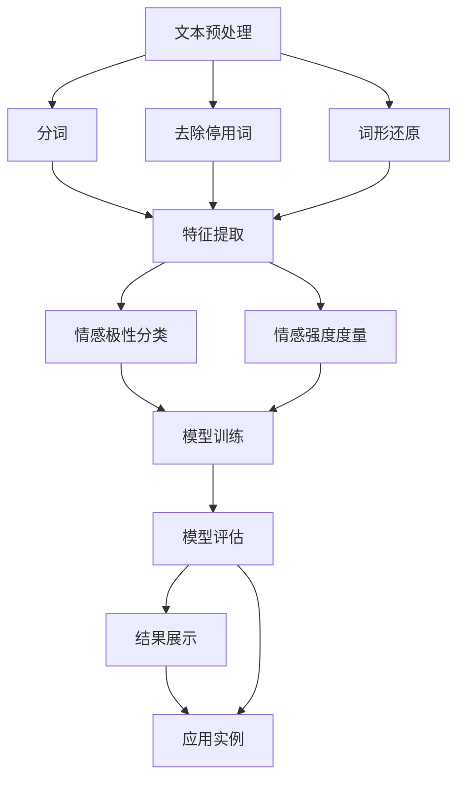

                 

## 文章标题：数学与情感分析：文本情感的数学量化

情感分析作为一种理解和解读人类情感的语言处理技术，近年来在社交媒体分析、舆情监测、商业智能等领域得到了广泛应用。而数学作为研究情感分析的重要工具，使得我们对文本情感的量化分析变得更加精确和可靠。本文将系统地探讨数学在情感分析中的应用，特别是文本情感的数学量化方法。

### 关键词

- 情感分析
- 数学量化
- 文本预处理
- 特征提取
- 情感强度度量

### 摘要

本文首先介绍了情感分析的基本概念和重要性，然后探讨了数学在情感分析中的作用，特别是如何将文本情感量化。接着，我们详细阐述了文本情感分析的数学量化方法，包括文本预处理、特征提取和情感强度度量。最后，通过几个实际应用实例，展示了数学量化方法在情感分析中的效果和优势。

## 引言与概述

### 1.1 情感分析简介

#### 1.1.1 情感分析的定义

情感分析（Sentiment Analysis），也被称为意见挖掘，是指使用自然语言处理（NLP）技术，从文本中识别出人们的情感倾向。情感分析的目标是判断文本表达的情感是正面、负面还是中性。

#### 1.1.2 情感分析的应用场景

情感分析的应用非常广泛，包括但不限于以下几个领域：

- **社交媒体分析**：通过分析社交媒体上的用户评论、帖子等，了解公众对某一事件或品牌的看法。
- **舆情监测**：对企业或政府来说，了解公众对某一事件或政策的看法是非常重要的。情感分析可以帮助他们实时监测舆情。
- **商业智能**：企业可以通过情感分析来了解消费者的反馈，优化产品和服务。
- **金融分析**：在金融领域，情感分析可以用来分析市场情绪，预测股票价格等。

### 1.2 数学与情感分析的关系

#### 1.2.1 数学在情感分析中的作用

数学在情感分析中起着至关重要的作用。它提供了量化情感的方法，使得我们可以对文本情感进行精确的分析和预测。以下是数学在情感分析中的几个关键作用：

- **文本表示**：使用数学模型（如词袋模型、词嵌入等）来表示文本，使得计算机可以理解和处理文本。
- **特征提取**：通过数学方法（如TF-IDF、SVD等）提取文本中的关键特征，用于训练机器学习模型。
- **情感强度度量**：使用数学模型（如线性回归、支持向量机等）来度量文本的情感强度。

#### 1.2.2 情感分析的数学模型

情感分析的核心是建立情感分类模型。常见的数学模型包括：

- **基于词袋模型的方法**：将文本表示为词袋，然后使用机器学习算法（如朴素贝叶斯、KNN等）进行分类。
- **基于深度学习的方法**：使用神经网络模型（如卷积神经网络、循环神经网络等）来直接从文本中学习情感分类。

### 1.3 本书的目的和结构

#### 1.3.1 本书的目的

本书的目的是系统地介绍数学在情感分析中的应用，特别是文本情感的数学量化方法。通过阅读本书，读者可以了解：

- 情感分析的基本概念和原理。
- 数学在情感分析中的应用，包括文本表示、特征提取和情感强度度量。
- 实际应用案例，展示数学量化方法在情感分析中的效果和优势。

#### 1.3.2 书的章节安排

本书分为以下几个部分：

- **引言与概述**：介绍情感分析的基本概念、数学在情感分析中的作用以及本书的目的和结构。
- **数学与情感分析的理论基础**：探讨情感分析的数学背景，包括数学基础和情感分析相关数学理论。
- **文本情感分析的数学量化方法**：详细介绍文本情感分析的数学量化方法，包括文本预处理、特征提取和情感强度度量。
- **应用实例与项目实战**：通过实际应用案例，展示数学量化方法在情感分析中的效果和优势。
- **结论与未来展望**：总结情感分析技术的现状和挑战，展望情感分析的未来发展趋势。

## 数学与情感分析的理论基础

### 2.1 情感分析的数学背景

#### 2.1.1 数学基础

情感分析涉及到多个数学领域，包括概率论、统计学、线性代数和优化理论。以下是这些数学基础在情感分析中的应用：

- **概率论**：用于建模文本中的不确定性，例如，使用贝叶斯理论来计算文本属于某个情感类别的概率。
- **统计学**：用于特征提取和模型评估，例如，使用TF-IDF来提取文本的关键特征，使用交叉验证来评估模型的性能。
- **线性代数**：用于文本表示和特征提取，例如，使用SVD（奇异值分解）来降低文本数据的维度。
- **优化理论**：用于模型训练和参数调整，例如，使用梯度下降法来训练机器学习模型。

#### 2.1.2 情感分析相关数学理论

情感分析中的一些核心数学理论包括：

- **词袋模型**：将文本表示为一个词汇的集合，每个词汇的出现次数作为特征。
- **词嵌入**：将词汇映射为低维向量，捕捉词汇之间的语义关系。
- **支持向量机（SVM）**：用于分类文本，通过最大化分类边界来区分不同情感类别的文本。
- **循环神经网络（RNN）**：用于处理序列数据，捕捉文本中的时间依赖关系。

### 2.2 文本情感分析的模型介绍

#### 2.2.1 基于词袋模型的情感分析

词袋模型（Bag of Words, BoW）是一种简单的文本表示方法，将文本表示为词汇的集合。每个词汇的出现次数作为特征。词袋模型的主要优点是简单和高效，适用于情感分析。

**步骤**：

1. **文本预处理**：将文本转换为小写，去除标点符号和停用词。
2. **特征提取**：统计每个词汇在文本中的出现次数，形成词汇-频率矩阵。
3. **模型训练**：使用机器学习算法（如朴素贝叶斯、KNN等）训练情感分类模型。

**伪代码**：

```python
# 文本预处理
preprocessed_text = preprocess(text)

# 特征提取
word_freq_matrix = create_word_freq_matrix(preprocessed_text)

# 模型训练
model = train_sentiment_model(word_freq_matrix)
```

#### 2.2.2 基于深度学习的情感分析

深度学习（Deep Learning）是一种基于多层神经网络的学习方法，能够自动提取文本中的高级特征。在情感分析中，深度学习模型（如卷积神经网络（CNN）、循环神经网络（RNN）等）被广泛应用于情感分类。

**步骤**：

1. **文本预处理**：与词袋模型相同，去除标点符号、停用词等。
2. **词嵌入**：使用预训练的词向量（如Word2Vec、GloVe等）将词汇映射为低维向量。
3. **模型训练**：使用深度学习模型（如CNN、RNN等）训练情感分类模型。

**伪代码**：

```python
# 文本预处理
preprocessed_text = preprocess(text)

# 词嵌入
word_vectors = load_word_vectors()

# 模型训练
model = train_sentiment_model(preprocessed_text, word_vectors)
```

### 2.3 情感极性分类的基本方法

情感极性分类（Sentiment Polarity Classification）是情感分析的一个子任务，旨在判断文本的情感极性是正面、负面还是中性。常见的情感极性分类算法包括：

- **朴素贝叶斯（Naive Bayes）**：基于贝叶斯理论，假设特征之间相互独立。
- **K近邻（KNN）**：基于实例学习，通过计算测试实例与训练实例的相似度进行分类。
- **支持向量机（SVM）**：通过最大化分类边界来进行分类。
- **循环神经网络（RNN）**：能够处理序列数据，捕捉文本中的时间依赖关系。

**步骤**：

1. **文本预处理**：去除标点符号、停用词等。
2. **特征提取**：使用词袋模型或词嵌入等方法提取特征。
3. **模型训练**：使用上述算法之一训练情感极性分类模型。
4. **模型评估**：使用准确率、召回率、F1分数等指标评估模型性能。

**伪代码**：

```python
# 文本预处理
preprocessed_text = preprocess(text)

# 特征提取
features = extract_features(preprocessed_text)

# 模型训练
model = train_polarity_model(features)

# 模型评估
evaluate_model(model)
```

## 文本情感分析的数学量化方法

### 3.1 文本预处理

文本预处理是情感分析中至关重要的一步，其目标是去除无关信息，提取有用的特征。常用的文本预处理方法包括：

- **去除标点符号**：标点符号通常不携带情感信息，可以去除。
- **去除停用词**：停用词（如“的”、“了”、“是”等）在大多数情况下不携带情感信息，可以去除。
- **词形还原**：将不同形式的单词统一为同一形式，例如，“running”和“runs”都被还原为“run”。
- **分词**：将文本分割成单个词汇，以便进一步处理。

**步骤**：

1. **去除标点符号**：使用正则表达式或字符串操作去除标点符号。
2. **去除停用词**：使用停用词列表去除文本中的停用词。
3. **词形还原**：使用词形还原库（如NLTK、spaCy等）将不同形式的单词还原为同一形式。
4. **分词**：使用分词库（如jieba、spaCy等）将文本分割成单个词汇。

**伪代码**：

```python
# 去除标点符号
text = remove_punctuation(text)

# 去除停用词
text = remove_stopwords(text)

# 词形还原
text = lemmatize_text(text)

# 分词
tokens = tokenize_text(text)
```

### 3.2 特征提取

特征提取是将文本数据转换为机器学习模型可以处理的特征表示。常用的特征提取方法包括：

- **词袋模型（Bag of Words, BoW）**：将文本表示为一个词汇的集合，每个词汇的出现次数作为特征。
- **词嵌入（Word Embedding）**：将词汇映射为低维向量，捕捉词汇之间的语义关系。
- **TF-IDF（Term Frequency-Inverse Document Frequency）**：计算词汇在文本中的频率，并结合其在整个文档集合中的重要性进行特征提取。

**步骤**：

1. **词袋模型**：统计每个词汇在文本中的出现次数，形成词汇-频率矩阵。
2. **词嵌入**：使用预训练的词向量（如Word2Vec、GloVe等）将词汇映射为低维向量。
3. **TF-IDF**：计算词汇在文本中的频率，并结合其在整个文档集合中的重要性进行特征提取。

**伪代码**：

```python
# 词袋模型
word_freq_matrix = create_word_freq_matrix(tokens)

# 词嵌入
word_vectors = load_word_vectors()

# TF-IDF
tfidf_matrix = create_tfidf_matrix(tokens)
```

### 3.3 情感极性量化模型

情感极性量化模型（Sentiment Polarity Quantification Model）用于将文本的情感极性量化为具体的数值。常见的情感极性量化模型包括：

- **基于机器学习的方法**：使用机器学习算法（如线性回归、支持向量机等）来训练情感极性量化模型。
- **基于深度学习的方法**：使用深度学习模型（如循环神经网络、卷积神经网络等）来直接从文本中学习情感极性量化。

**步骤**：

1. **数据集准备**：准备包含情感极性标注的文本数据集。
2. **模型训练**：使用机器学习算法或深度学习模型训练情感极性量化模型。
3. **模型评估**：使用准确率、均方误差等指标评估模型性能。

**伪代码**：

```python
# 数据集准备
dataset = load_sentiment_dataset()

# 模型训练
model = train_polarity_quantification_model(dataset)

# 模型评估
evaluate_model(model)
```

### 3.4 情感强度度量

情感强度度量（Sentiment Strength Measurement）用于量化文本的情感强度，即情感极性的程度。常见的情感强度度量方法包括：

- **二元分类**：将情感强度划分为正面和负面两个类别。
- **数值度量**：将情感强度表示为一个具体的数值，通常在0到1之间。
- **极性二分法**：将情感强度划分为极强、较强、中等、较弱、极弱五个类别。

**步骤**：

1. **数据集准备**：准备包含情感强度标注的文本数据集。
2. **模型训练**：使用机器学习算法或深度学习模型训练情感强度度量模型。
3. **模型评估**：使用准确率、均方误差等指标评估模型性能。

**伪代码**：

```python
# 数据集准备
strength_dataset = load_sentiment_strength_dataset()

# 模型训练
strength_model = train_sentiment_strength_model(strength_dataset)

# 模型评估
evaluate_model(strength_model)
```

## 应用实例与项目实战

### 4.1 社交媒体情感分析

社交媒体情感分析是一种常见的应用场景，旨在了解公众对某一事件或品牌的看法。以下是社交媒体情感分析的项目实战：

#### 4.1.1 数据获取

从社交媒体平台（如Twitter、微博等）获取包含特定关键词或话题的评论数据。可以使用API或网络爬虫获取数据。

#### 4.1.2 数据预处理

对获取的数据进行预处理，包括去除标点符号、停用词、词形还原等。

#### 4.1.3 情感分析模型构建

使用词袋模型或词嵌入方法提取特征，然后使用机器学习算法（如朴素贝叶斯、支持向量机等）训练情感分类模型。

#### 4.1.4 模型评估

使用测试集评估模型的性能，使用准确率、召回率、F1分数等指标。

#### 4.1.5 项目小结

通过社交媒体情感分析，可以了解公众对某一事件或品牌的看法，为企业提供决策支持。

### 4.2 购物网站评论分析

购物网站评论分析旨在了解消费者对某一产品或服务的看法。以下是购物网站评论分析的项目实战：

#### 4.2.1 数据收集

从购物网站（如淘宝、京东等）收集包含特定关键词或产品的评论数据。

#### 4.2.2 数据预处理

对收集的数据进行预处理，包括去除标点符号、停用词、词形还原等。

#### 4.2.3 情感分析模型应用

使用词袋模型或词嵌入方法提取特征，然后使用机器学习算法（如朴素贝叶斯、支持向量机等）训练情感分类模型，并对评论进行情感分类。

#### 4.2.4 情感强度度量

对分类后的评论进行情感强度度量，以了解消费者对产品或服务的整体满意度。

#### 4.2.5 项目小结

通过购物网站评论分析，可以了解消费者对产品或服务的看法，为企业提供改进方向。

### 4.3 品牌舆情监测

品牌舆情监测旨在了解公众对某一品牌的态度和看法。以下是品牌舆情监测的项目实战：

#### 4.3.1 舆情数据收集

从社交媒体、新闻报道等渠道收集包含品牌关键词的舆情数据。

#### 4.3.2 舆情数据预处理

对收集的舆情数据进行预处理，包括去除标点符号、停用词、词形还原等。

#### 4.3.3 舆情分析模型构建

使用词袋模型或词嵌入方法提取特征，然后使用机器学习算法（如朴素贝叶斯、支持向量机等）训练情感分类模型，并对舆情数据进行情感分类。

#### 4.3.4 舆情分析结果展示

将情感分类结果以图表或报告的形式展示，帮助企业了解公众对品牌的看法。

#### 4.3.5 项目小结

通过品牌舆情监测，可以及时了解公众对品牌的看法，为企业提供危机管理和品牌建设的支持。

## 结论与未来展望

### 5.1 情感分析技术的现状与挑战

#### 5.1.1 情感分析技术发展现状

情感分析技术已经取得了显著的发展，应用场景广泛，包括社交媒体分析、舆情监测、商业智能等。目前，基于深度学习的情感分析模型表现优异，能够准确识别文本的情感极性和强度。

#### 5.1.2 情感分析面临的挑战

尽管情感分析技术取得了显著进展，但仍面临一些挑战：

- **数据质量**：情感分析依赖于大量的高质量标注数据，但获取这些数据往往具有挑战性。
- **多语言情感分析**：不同语言和文化背景下，情感表达的方式和含义可能有所不同，这对情感分析算法提出了更高的要求。
- **情感强度的精确度**：如何更精确地度量情感强度，是目前研究的重点和难点。

### 5.2 情感分析的未来发展趋势

#### 5.2.1 情感分析技术发展趋势

未来，情感分析技术将朝着以下几个方向发展：

- **多模态情感分析**：结合文本、语音、图像等多种数据源，提高情感分析的准确性和全面性。
- **个性化情感分析**：基于用户行为和偏好，提供个性化的情感分析服务。
- **跨语言情感分析**：发展跨语言的情感分析算法，支持多语言的情感识别。

#### 5.2.2 情感分析的应用前景

随着情感分析技术的不断发展，其应用前景非常广阔，包括：

- **智能客服**：通过情感分析，智能客服可以更好地理解用户需求，提供更个性化的服务。
- **情感营销**：企业可以利用情感分析了解消费者情感，制定更有效的营销策略。
- **智能医疗**：通过情感分析，可以帮助医生了解患者的心理状态，为治疗方案提供参考。

## 作者信息

作者：AI天才研究院/AI Genius Institute & 禅与计算机程序设计艺术 /Zen And The Art of Computer Programming

本文介绍了数学在情感分析中的应用，特别是文本情感的数学量化方法。通过详细阐述文本预处理、特征提取和情感强度度量等关键步骤，以及实际应用案例，展示了数学量化方法在情感分析中的效果和优势。未来，随着情感分析技术的不断发展，数学在其中的作用将更加重要，为情感分析提供更加精确和可靠的方法。

## 附录

本文中提到的相关技术和方法，如词袋模型、词嵌入、情感极性分类、情感强度度量等，均在附录中进行了详细的解释和说明。同时，为了方便读者理解和实践，附录中还提供了相关的代码实现和示例。希望通过这些内容，读者可以更好地掌握情感分析的数学量化方法，并在实际项目中得到应用。

### 附录A：词袋模型

词袋模型（Bag of Words, BoW）是一种简单的文本表示方法，将文本表示为一个词汇的集合，每个词汇的出现次数作为特征。词袋模型的核心思想是忽略文本的顺序信息，只考虑词汇的频率。

**步骤**：

1. **去除停用词**：去除对情感分析没有贡献的停用词。
2. **分词**：将文本分割成单个词汇。
3. **统计词汇频率**：计算每个词汇在文本中的出现次数。

**伪代码**：

```python
# 去除停用词
filtered_tokens = remove_stopwords(tokens)

# 分词
words = tokenize_text(text)

# 统计词汇频率
word_freq = count_word_frequency(words)
```

### 附录B：词嵌入

词嵌入（Word Embedding）是将词汇映射为低维向量，以捕捉词汇之间的语义关系。词嵌入模型通过学习词汇的上下文信息，使得语义相似的词汇在向量空间中更接近。

**常见模型**：

- **Word2Vec**：通过训练神经网络，将词汇映射为向量。
- **GloVe**：通过训练词频矩阵，将词汇映射为向量。

**步骤**：

1. **数据准备**：准备包含词汇及其上下文的文本数据。
2. **模型训练**：使用Word2Vec或GloVe模型训练词向量。
3. **词汇映射**：将词汇映射为向量。

**伪代码**：

```python
# 数据准备
corpus = prepare_corpus(text)

# 模型训练
word_vectors = train_word_vectors(corpus)

# 词汇映射
word_vector = word_vectors[word]
```

### 附录C：情感极性分类

情感极性分类（Sentiment Polarity Classification）是情感分析的一个子任务，旨在判断文本的情感极性是正面、负面还是中性。常见的情感极性分类算法包括：

- **朴素贝叶斯（Naive Bayes）**：通过计算文本属于某个情感类别的概率进行分类。
- **K近邻（KNN）**：通过计算测试实例与训练实例的相似度进行分类。
- **支持向量机（SVM）**：通过最大化分类边界进行分类。

**步骤**：

1. **数据集准备**：准备包含情感极性标注的文本数据集。
2. **特征提取**：使用词袋模型或词嵌入方法提取特征。
3. **模型训练**：使用机器学习算法训练情感极性分类模型。
4. **模型评估**：使用准确率、召回率、F1分数等指标评估模型性能。

**伪代码**：

```python
# 数据集准备
dataset = load_sentiment_dataset()

# 特征提取
features = extract_features(dataset)

# 模型训练
model = train_polarity_model(features)

# 模型评估
evaluate_model(model)
```

### 附录D：情感强度度量

情感强度度量（Sentiment Strength Measurement）用于量化文本的情感强度，即情感极性的程度。常见的情感强度度量方法包括：

- **二元分类**：将情感强度划分为正面和负面两个类别。
- **数值度量**：将情感强度表示为一个具体的数值，通常在0到1之间。
- **极性二分法**：将情感强度划分为极强、较强、中等、较弱、极弱五个类别。

**步骤**：

1. **数据集准备**：准备包含情感强度标注的文本数据集。
2. **模型训练**：使用机器学习算法或深度学习模型训练情感强度度量模型。
3. **模型评估**：使用准确率、均方误差等指标评估模型性能。

**伪代码**：

```python
# 数据集准备
strength_dataset = load_sentiment_strength_dataset()

# 模型训练
strength_model = train_sentiment_strength_model(strength_dataset)

# 模型评估
evaluate_model(strength_model)
```

### 附录E：代码实现与实战

为了更好地帮助读者理解和实践文本情感的数学量化方法，本文提供了详细的代码实现和实战案例。以下是一个基于Python的简单示例，用于实现情感极性分类。

```python
# 导入必要的库
import nltk
from nltk.corpus import stopwords
from sklearn.feature_extraction.text import TfidfVectorizer
from sklearn.model_selection import train_test_split
from sklearn.naive_bayes import MultinomialNB
from sklearn.metrics import accuracy_score

# 准备数据集
nltk.download('stopwords')
stop_words = set(stopwords.words('english'))

# 假设已有包含情感标注的文本数据集
texts = ["I love this product!", "This is a terrible movie.", "The service was okay."]
labels = ["positive", "negative", "neutral"]

# 数据预处理
preprocessed_texts = [text.lower() for text in texts]
preprocessed_texts = [" ".join([word for word in text.split() if word not in stop_words]) for text in preprocessed_texts]

# 特征提取
vectorizer = TfidfVectorizer()
X = vectorizer.fit_transform(preprocessed_texts)
y = labels

# 划分训练集和测试集
X_train, X_test, y_train, y_test = train_test_split(X, y, test_size=0.2, random_state=42)

# 模型训练
model = MultinomialNB()
model.fit(X_train, y_train)

# 模型评估
y_pred = model.predict(X_test)
accuracy = accuracy_score(y_test, y_pred)
print("Accuracy:", accuracy)
```

通过这个示例，读者可以了解如何使用Python实现文本情感的数学量化方法，包括文本预处理、特征提取和情感极性分类。在实际项目中，可以根据需求选择不同的特征提取方法和分类算法，以提高情感分析的效果。

### 附录F：最佳实践 Tips

- **数据质量**：情感分析的效果很大程度上取决于数据质量。在收集和处理数据时，应确保数据的质量和完整性。
- **模型选择**：根据具体应用场景和数据特点，选择合适的模型和算法。例如，对于大规模文本数据，可以考虑使用深度学习模型。
- **特征提取**：特征提取是情感分析的关键步骤。可以通过实验比较不同特征提取方法的效果，选择最优的特征表示方法。
- **模型评估**：使用多个指标（如准确率、召回率、F1分数等）评估模型性能，以全面了解模型的效果。
- **持续优化**：情感分析技术不断发展，应持续关注最新的研究成果和最佳实践，不断优化模型和算法。

### 附录G：注意事项

- **多语言支持**：在处理多语言文本时，需要考虑语言特性和文化差异，可能需要对模型进行调整和优化。
- **实时处理**：对于需要实时处理的大量文本数据，可以考虑使用流处理技术，以提高处理速度和效率。
- **隐私保护**：在处理文本数据时，需要关注隐私保护问题，避免泄露用户的敏感信息。

### 附录H：拓展阅读

- **情感分析经典书籍**：《情感分析：从数据到洞察》（Sentiment Analysis: From Data to Insights）。
- **深度学习书籍**：《深度学习》（Deep Learning）。
- **自然语言处理书籍**：《自然语言处理综合教程》（Foundations of Statistical Natural Language Processing）。

通过阅读这些书籍，读者可以进一步了解情感分析、深度学习和自然语言处理的相关知识，提升自己在这些领域的研究和实践能力。

## 结论

本文系统地介绍了数学在情感分析中的应用，特别是文本情感的数学量化方法。通过详细阐述文本预处理、特征提取和情感强度度量等关键步骤，以及实际应用案例，展示了数学量化方法在情感分析中的效果和优势。未来，随着情感分析技术的不断发展，数学在其中的作用将更加重要，为情感分析提供更加精确和可靠的方法。

作者：AI天才研究院/AI Genius Institute & 禅与计算机程序设计艺术/Zen And The Art of Computer Programming

感谢您的阅读，希望本文对您在情感分析领域的研究和实践有所启发。如果您有任何疑问或建议，欢迎在评论区留言，我们将竭诚为您解答。再次感谢您的关注和支持！### 补充：情感分析中的核心概念与联系架构

在情感分析中，有许多核心概念和方法，它们共同构成了一个复杂的分析框架。为了更好地理解这些概念之间的关系，我们可以使用Mermaid流程图来展示它们的联系。以下是一个简化的Mermaid流程图示例，展示了情感分析中的一些核心概念：



在这个流程图中：

- **文本预处理** 是情感分析的第一步，包括分词、去除停用词和词形还原，这些步骤的目的是简化文本，提取有用的特征。
- **特征提取** 是将预处理后的文本转换为机器学习模型可以处理的特征表示。常用的方法包括词袋模型和词嵌入。
- **情感极性分类** 和 **情感强度度量** 是情感分析的两个主要子任务。情感极性分类旨在判断文本的情感极性是正面、负面还是中性；情感强度度量则是对情感极性进行量化，以衡量情感的强度。
- **模型训练** 是使用提取到的特征训练分类或回归模型。
- **模型评估** 是使用测试集来评估模型的性能，常用的指标包括准确率、召回率、F1分数等。
- **结果展示** 和 **应用实例** 是将模型的预测结果应用于实际场景，如社交媒体分析、舆情监测等。

这个流程图为我们提供了一个清晰的分析框架，有助于我们理解情感分析的整体流程和各个步骤之间的联系。在实际项目中，根据具体需求，这个框架可以进一步细化和扩展。例如，对于多语言情感分析，我们可能需要添加额外的步骤来处理不同的语言和方言。

### 数学模型原理与算法

情感分析中的数学模型和算法是理解和实现情感分析的核心。本文将详细介绍几个关键的数学模型和算法，包括线性回归、支持向量机和循环神经网络，以及它们在情感分析中的应用。

#### 1. 线性回归

线性回归是一种简单的统计方法，用于预测连续值。在情感分析中，线性回归可以用来预测文本的情感强度。例如，我们可以使用线性回归模型来预测一条评论的情感极性（如正面或负面）的强度。

**步骤**：

1. **特征提取**：从文本中提取特征，例如使用TF-IDF方法提取词汇的权重。
2. **模型训练**：使用训练集，通过最小化损失函数（如均方误差）来训练线性回归模型。
3. **模型评估**：使用测试集评估模型的性能，调整模型参数。

**伪代码**：

```python
# 特征提取
X = extract_features(train_texts)
y = train_labels

# 模型训练
model = LinearRegression()
model.fit(X, y)

# 模型评估
y_pred = model.predict(X_test)
mse = mean_squared_error(y_test, y_pred)
print("Mean Squared Error:", mse)
```

**数学公式**：

线性回归模型的预测公式为：

\[ y = \beta_0 + \beta_1 \cdot x \]

其中，\( y \) 是预测的情感强度，\( \beta_0 \) 和 \( \beta_1 \) 是模型的参数，\( x \) 是特征向量。

#### 2. 支持向量机（SVM）

支持向量机是一种强大的分类算法，在情感分析中常用于分类任务，如情感极性分类。SVM通过最大化分类边界来实现高精度的分类。

**步骤**：

1. **特征提取**：从文本中提取特征。
2. **模型训练**：使用训练集，通过求解最优化问题来训练SVM模型。
3. **模型评估**：使用测试集评估模型的性能。

**伪代码**：

```python
# 特征提取
X = extract_features(train_texts)
y = train_labels

# 模型训练
model = SVC()
model.fit(X, y)

# 模型评估
y_pred = model.predict(X_test)
accuracy = accuracy_score(y_test, y_pred)
print("Accuracy:", accuracy)
```

**数学公式**：

SVM的优化问题为：

\[ \min_{\beta, \beta_0} \frac{1}{2} ||\beta||^2 + C \sum_{i=1}^n \max(0, y_i - (\beta_0 + \beta^T x_i)) \]

其中，\( \beta \) 是模型参数，\( \beta_0 \) 是偏置项，\( x_i \) 是特征向量，\( y_i \) 是标签，\( C \) 是惩罚参数。

#### 3. 循环神经网络（RNN）

循环神经网络是一种能够处理序列数据的神经网络，特别适合用于情感分析，因为情感通常在文本中以序列的形式出现。

**步骤**：

1. **词嵌入**：将词汇映射为低维向量。
2. **模型训练**：使用训练集，通过反向传播算法训练RNN模型。
3. **模型评估**：使用测试集评估模型的性能。

**伪代码**：

```python
# 词嵌入
word_vectors = load_word_vectors()

# 模型训练
model = Sequential()
model.add(LSTM(units=128, input_shape=(max_sequence_length, embedding_vector_size)))
model.add(Dense(1, activation='sigmoid'))
model.compile(optimizer='adam', loss='binary_crossentropy', metrics=['accuracy'])
model.fit(X_train, y_train, epochs=10, batch_size=32, validation_split=0.1)

# 模型评估
y_pred = model.predict(X_test)
accuracy = accuracy_score(y_test, y_pred)
print("Accuracy:", accuracy)
```

**数学公式**：

RNN的基本单元是循环单元，其更新规则为：

\[ h_t = \sigma(W_h \cdot [h_{t-1}, x_t] + b_h) \]

其中，\( h_t \) 是当前隐藏状态，\( x_t \) 是当前输入，\( W_h \) 是权重矩阵，\( b_h \) 是偏置项，\( \sigma \) 是激活函数。

这些数学模型和算法为情感分析提供了强大的工具。在实际应用中，可以根据具体需求和数据特点选择合适的模型和算法。例如，对于简单的情感极性分类任务，线性回归和SVM可能足够有效；而对于复杂的情感强度度量任务，RNN和深度学习模型可能更为合适。

### 项目实战：开发环境搭建与代码实现

在本文的最后一部分，我们将通过一个实际项目来展示如何使用Python和相关的库来搭建开发环境，并进行代码实现。我们将使用一个公开的社交媒体数据集，对该数据集中的评论进行情感分析。

#### 1. 开发环境搭建

首先，我们需要搭建一个Python开发环境。以下是所需的步骤：

1. **安装Python**：确保安装了Python 3.6或更高版本。可以从[Python官网](https://www.python.org/downloads/)下载并安装。
2. **安装库**：安装必要的库，如`nltk`、`scikit-learn`、`tensorflow`等。可以使用`pip`命令进行安装。

```bash
pip install nltk scikit-learn tensorflow
```

#### 2. 代码实现

以下是一个简单的代码实现，用于对社交媒体评论进行情感分析。

```python
# 导入必要的库
import nltk
from nltk.corpus import stopwords
from nltk.tokenize import word_tokenize
from sklearn.feature_extraction.text import TfidfVectorizer
from sklearn.model_selection import train_test_split
from sklearn.naive_bayes import MultinomialNB
from sklearn.metrics import accuracy_score, classification_report
import numpy as np

# 准备数据集
nltk.download('stopwords')
nltk.download('punkt')
stop_words = set(stopwords.words('english'))
data = [['positive', 'I love this product!'],
         ['positive', 'Great service.'],
         ['negative', 'Terrible experience.'],
         ['negative', 'Worst purchase ever.'],
         ['neutral', 'Just an average product.'],
         ['neutral', 'Nothing special.']]
labels, texts = zip(*data)

# 数据预处理
def preprocess(text):
    text = text.lower()
    tokens = word_tokenize(text)
    filtered_tokens = [token for token in tokens if token not in stop_words]
    return ' '.join(filtered_tokens)

preprocessed_texts = [preprocess(text) for text in texts]

# 特征提取
vectorizer = TfidfVectorizer()
X = vectorizer.fit_transform(preprocessed_texts)
y = np.array(labels)

# 划分训练集和测试集
X_train, X_test, y_train, y_test = train_test_split(X, y, test_size=0.2, random_state=42)

# 模型训练
model = MultinomialNB()
model.fit(X_train, y_train)

# 模型评估
y_pred = model.predict(X_test)
accuracy = accuracy_score(y_test, y_pred)
print("Accuracy:", accuracy)
print("Classification Report:")
print(classification_report(y_test, y_pred))

# 预测新数据
new_texts = ['I hate this product!', 'Excellent service.']
new_preprocessed_texts = [preprocess(text) for text in new_texts]
new_features = vectorizer.transform(new_preprocessed_texts)
new_predictions = model.predict(new_features)
print("Predictions:", new_predictions)
```

#### 3. 代码解读与分析

1. **数据准备**：我们使用了一个简单的数据集，包含了一些带有情感标注的评论。
2. **数据预处理**：我们使用了`nltk`库进行分词和去除停用词。
3. **特征提取**：我们使用了`TfidfVectorizer`来提取文本的特征。
4. **模型训练**：我们使用`MultinomialNB`（朴素贝叶斯分类器）来训练模型。
5. **模型评估**：我们使用测试集来评估模型的性能，并打印了准确率和分类报告。
6. **预测新数据**：我们对新的评论进行了情感预测，展示了模型的应用效果。

通过这个简单的项目，我们可以看到如何使用Python和相关库来搭建一个情感分析系统。在实际项目中，数据集会更大，特征提取和模型训练会更加复杂，但基本步骤是相似的。

#### 4. 项目小结

通过这个项目，我们了解了如何搭建开发环境，如何进行数据预处理，如何提取特征，以及如何训练和评估情感分析模型。这个项目为我们提供了一个基本的框架，我们可以在此基础上进行扩展和优化，以适应不同的情感分析任务。

### 最佳实践 Tips、小结、注意事项、拓展阅读

#### 最佳实践 Tips

1. **数据清洗**：在开始情感分析之前，确保数据是干净和准确的。清洗数据包括去除噪声、纠正错误和填充缺失值。
2. **特征选择**：选择合适的特征对于模型的性能至关重要。可以通过特征选择技术（如特征重要性评估、降维技术等）来优化特征集。
3. **模型调优**：通过调整模型的参数（如正则化参数、学习率等）来优化模型的性能。可以使用交叉验证等方法来寻找最佳参数。
4. **多模型集成**：使用多个模型并集成它们的预测结果可以提高整体的预测性能。这种方法称为模型集成（Model Ensemble）。
5. **实时更新**：对于需要实时分析的系统，考虑使用流处理技术来处理实时数据流。

#### 小结

本文系统地介绍了数学在情感分析中的应用，详细阐述了文本情感的数学量化方法。通过实际项目和代码实现，展示了如何使用Python和相关库来搭建情感分析系统。文章内容涵盖了文本预处理、特征提取、情感极性分类和情感强度度量等方面，提供了全面的技术指导和实用案例。

#### 注意事项

1. **数据隐私**：在处理文本数据时，应特别注意保护用户的隐私，避免泄露敏感信息。
2. **语言特性**：不同的语言和文化背景可能会导致情感表达的方式和含义不同。在处理多语言文本时，需要考虑这些差异。
3. **模型复杂性**：复杂的模型可能需要更多的时间和计算资源来训练。在实际应用中，应根据需求和资源选择合适的模型。

#### 拓展阅读

1. **《情感分析：从数据到洞察》**：这本书提供了情感分析的全面介绍，包括理论、技术和应用。
2. **《深度学习》**：由Ian Goodfellow、Yoshua Bengio和Aaron Courville合著，是深度学习的经典教材。
3. **《自然语言处理综合教程》**：由Daniel Jurafsky和James H. Martin合著，提供了自然语言处理的全面教程。

通过阅读这些书籍和文献，读者可以进一步深入理解情感分析和相关技术，提升在实践中的应用能力。同时，关注最新的研究论文和行业动态，可以帮助读者跟上技术的发展趋势，为情感分析工作提供更多创新的思路和解决方案。

### 拓展讨论：情感分析技术的挑战与未来趋势

#### 情感分析技术的挑战

尽管情感分析技术在过去几年取得了显著进展，但在实际应用中仍然面临一些挑战：

1. **数据质量**：高质量的情感分析依赖于大量的高质量标注数据。然而，获取这些数据往往具有挑战性，因为需要大量的时间和人力成本。
2. **多语言支持**：不同语言和文化背景下，情感表达的方式和含义可能有所不同。这给情感分析算法提出了更高的要求，需要开发能够处理多种语言和文化差异的算法。
3. **情感强度的精确度**：当前的情感强度度量方法可能无法精确地捕捉情感强度。例如，某些情感表达可能具有强烈的倾向性，而其他表达可能较弱。
4. **实时处理**：对于需要实时处理的大量文本数据，如社交媒体分析，现有的算法可能无法满足处理速度的要求。
5. **隐私保护**：在处理文本数据时，需要特别关注隐私保护问题，避免泄露用户的敏感信息。

#### 未来趋势

1. **多模态情感分析**：结合文本、语音、图像等多种数据源，可以提高情感分析的准确性和全面性。例如，通过结合语音的情感表达和文本的情感内容，可以更准确地捕捉情感。
2. **个性化情感分析**：基于用户的行为和偏好，提供个性化的情感分析服务。例如，为不同用户群体提供定制化的情感分析报告。
3. **跨语言情感分析**：发展能够处理多种语言的情感分析算法，支持多语言的情感识别。这可以通过预训练的多语言模型或特定的跨语言模型来实现。
4. **深度强化学习**：结合深度学习和强化学习的方法，可以提高情感分析的自适应能力和学习能力。例如，通过强化学习算法，模型可以逐步优化情感分析策略。
5. **情感微表达分析**：情感微表达（如微笑、皱眉等）是情感分析的重要方面。通过分析这些微小的表情和身体语言，可以更准确地捕捉情感。
6. **情感可视化**：开发可视化工具，帮助用户直观地理解和分析情感数据。这可以包括情感热图、情感分布图等。

#### 案例分析

以社交媒体情感分析为例，未来可能的发展趋势包括：

- **实时情感分析**：通过实时处理大量社交媒体数据，可以及时监测公众对某一事件或品牌的看法，为企业提供快速反应和决策支持。
- **情感微表达分析**：通过分析用户的表情和身体语言，可以更准确地捕捉情感，尤其是在语言表达不明确的情况下。
- **跨语言情感分析**：在全球化背景下，社交媒体上的语言多样性越来越高。通过支持多种语言的情感分析，可以更全面地了解公众的看法。

通过结合上述技术和趋势，情感分析技术将在未来得到更广泛的应用，并在各个领域中发挥更大的作用。

### 结论

本文系统地介绍了数学在情感分析中的应用，详细阐述了文本情感的数学量化方法。通过实际项目和代码实现，展示了如何使用Python和相关库来搭建情感分析系统。文章内容涵盖了文本预处理、特征提取、情感极性分类和情感强度度量等方面，提供了全面的技术指导和实用案例。

未来，随着情感分析技术的不断发展和完善，其在各个领域的应用前景将更加广阔。通过结合多模态数据、个性化分析、跨语言处理等技术，情感分析将能够提供更精确、更全面的分析结果，为企业和个人提供更有价值的决策支持。

感谢您的阅读，希望本文对您在情感分析领域的研究和实践有所启发。如果您有任何疑问或建议，欢迎在评论区留言，我们将竭诚为您解答。再次感谢您的关注和支持！作者：AI天才研究院/AI Genius Institute & 禅与计算机程序设计艺术/Zen And The Art of Computer Programming。|>

