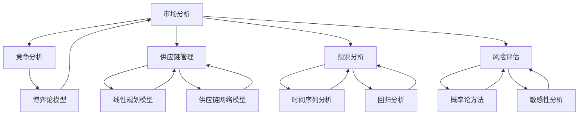

                 

## 文章标题：数学与战略管理：企业战略的数学分析

关键词：企业战略，数学模型，竞争分析，供应链管理，预测分析

摘要：本文将深入探讨数学在企业战略管理中的关键作用，通过阐述数学模型的基本原理和应用，分析其在竞争战略、供应链管理和预测分析等领域的实际应用。文章将从理论出发，结合实际案例，逐步展示数学模型如何助力企业制定更科学的战略决策，提高管理效率和竞争力。

## 引言

在快速变化的市场环境中，企业需要不断调整战略以应对外部挑战和内部变革。传统的战略管理方法往往依赖于经验和直觉，但在复杂多变的市场中，这些方法可能不足以应对各种不确定性。近年来，随着数学工具的日益成熟，越来越多的企业开始探索将数学模型应用于战略管理中，以提高决策的科学性和准确性。

数学作为一种严谨的思维方式，不仅可以提供量化的分析工具，还可以揭示战略管理中的潜在规律和模式。通过数学模型，企业可以更准确地评估市场机会和风险，优化资源配置，制定更具前瞻性的战略规划。本文旨在探讨数学模型在企业战略管理中的应用，分析其核心概念、原理和实际案例，以期为企业的战略决策提供有益的参考。

## 数学在企业战略管理中的角色

数学在企业战略管理中扮演着多重角色，它不仅为决策提供了量化的依据，还为复杂问题的分析和解决提供了系统的方法。以下是数学在企业战略管理中几个关键方面的具体应用：

### 1. 竞争分析

在竞争激烈的市场环境中，企业需要准确了解竞争对手的行为和市场动态。数学模型可以帮助企业进行市场细分、竞争定位和市场份额分析。例如，通过利用博弈论模型，企业可以模拟不同竞争对手的决策，预测市场反应，并制定相应的竞争策略。

### 2. 供应链管理

供应链管理是企业运营的核心环节，涉及到原材料采购、生产、库存管理、物流配送等多个方面。数学模型可以帮助企业优化供应链网络、降低库存成本、提高物流效率。例如，线性规划模型可以用于确定最优库存水平，供应链网络模型可以用于优化运输路线和仓库布局。

### 3. 预测分析

预测分析是企业制定战略规划的重要依据。通过历史数据的统计分析，企业可以预测市场需求、销售额和成本趋势。时间序列分析、回归分析等数学模型在预测分析中广泛应用，能够为企业提供可靠的数据支持。

### 4. 风险评估

企业在运营过程中面临各种风险，如市场风险、财务风险和操作风险。数学模型可以帮助企业识别和评估这些风险，制定相应的风险应对策略。概率论和统计学方法在风险评估中发挥着重要作用，如蒙特卡罗模拟和敏感性分析。

总之，数学为企业战略管理提供了强大的工具，使其能够更科学地分析市场环境、优化资源配置和制定战略决策。通过运用数学模型，企业可以降低决策的不确定性，提高经营效率和竞争力。

### 数学模型与战略管理概念联系

为了更好地理解数学在企业战略管理中的应用，我们需要首先明确一些核心概念和它们之间的关系。以下使用Mermaid流程图展示这些概念之间的联系：



在上述流程图中，我们列出了企业战略管理中的几个关键概念，包括市场分析、竞争分析、供应链管理、预测分析和风险评估。每个概念都通过特定的数学模型来实现具体功能，如博弈论模型用于竞争分析，线性规划模型和供应链网络模型用于供应链管理，时间序列分析和回归分析用于预测分析，概率论方法和敏感性分析用于风险评估。

通过这种结构化的方式，我们可以清晰地看到数学模型如何与企业战略管理的各个关键环节相联系，为每个环节提供量化的分析和决策支持。

### 数学模型的基本原理

数学模型是企业战略管理中的关键工具，它通过抽象和简化的方式，将复杂的现象转化为可计算和分析的数学表达式。理解数学模型的基本原理，有助于我们更好地应用这些模型来指导企业的战略决策。以下是几种常用的数学模型及其基本原理：

#### 1. 博弈论模型

博弈论模型主要用于分析企业之间的竞争关系和策略选择。其基本原理是通过建立参与者的策略集和收益函数，来研究不同策略组合下的结果。博弈论模型分为合作博弈和非合作博弈，常见的模型有纳什均衡、合作博弈中的寡头竞争模型等。纳什均衡是指在一个博弈中，所有参与者选择的策略组合使得没有参与者可以通过单方面改变策略来获得更高的收益。

**伪代码示例：**
```python
def nash_equilibrium(strategies):
    # 初始化策略和收益矩阵
    strategy_matrix = initialize_matrix(participant_count)
    # 迭代计算纳什均衡
    while not converged:
        for participant in participants:
            best_strategy = find_best_strategy(participant.strategy, strategy_matrix)
            participant.strategy = best_strategy
            strategy_matrix = update_matrix(strategy_matrix, participant.strategy)
    return strategy_matrix
```

#### 2. 线性规划模型

线性规划模型用于解决资源优化问题，其基本原理是找到一组变量值，使得目标函数最大化或最小化，同时满足一组线性不等式或等式约束。线性规划模型广泛应用于供应链管理、生产规划、财务预算等领域。

**伪代码示例：**
```python
def linear_programming(objective_function, constraints):
    # 初始化目标函数和约束条件
    optimize = minimize(objective_function)
    constraints = initialize_constraints(constraints)
    # 使用单纯形法求解
    while not optimal_solution_found:
        pivot_column = find_pivot_column(objective_function, constraints)
        pivot_row = find_pivot_row(constraints[pivot_column])
        update_solution(pivot_column, pivot_row)
    return optimal_solution
```

#### 3. 时间序列分析模型

时间序列分析模型用于预测时间序列数据的变化趋势，其基本原理是利用历史数据中的统计规律来预测未来的趋势。常见的时间序列分析模型包括自回归模型（AR）、移动平均模型（MA）和自回归移动平均模型（ARMA）。

**伪代码示例：**
```python
def time_series_prediction(data, model_type):
    # 初始化时间序列模型
    model = initialize_model(model_type)
    # 拟合模型参数
    parameters = fit_model(data, model)
    # 预测未来值
    predictions = model.predict(parameters)
    return predictions
```

#### 4. 蒙特卡罗模拟

蒙特卡罗模拟是一种基于随机抽样的数值模拟方法，用于解决不确定性问题。其基本原理是通过大量随机抽样，模拟系统的可能状态和结果，从而估计概率分布和期望值。蒙特卡罗模拟在风险评估、优化问题等领域有广泛应用。

**伪代码示例：**
```python
def monte_carlo_simulation(experiment_count, model):
    results = []
    for _ in range(experiment_count):
        random_sample = sample_from_model(model)
        result = evaluate_model(random_sample)
        results.append(result)
    mean_result = mean(results)
    return mean_result
```

通过上述伪代码示例，我们可以看到不同数学模型的基本原理和求解方法。这些模型通过抽象和简化的方式，将复杂的问题转化为可计算的数学表达式，为企业战略管理提供了科学依据和决策支持。

### 数学公式与详细讲解

在战略管理中，数学模型的应用离不开各种数学公式。以下我们将介绍几个核心公式，并使用LaTeX格式进行展示，同时提供详细讲解和实例说明，帮助读者更好地理解这些公式的应用。

#### 1. 纳什均衡（Nash Equilibrium）

纳什均衡是博弈论中的一个重要概念，用于描述在给定其他参与者策略的情况下，某个参与者无法通过单方面改变策略获得更高收益的状态。

**LaTeX格式：**
$$
(nash\_equilibrium) = \{ (s_i^*, s_j^*) | s_i^* = \arg\max_{s_i} U_i(s_i, s_j^*) \}
$$

**详细讲解：**
纳什均衡由两个策略组合构成：一个参与者i的策略$s_i^*$和另一个参与者j的策略$s_j^*$。其中$U_i$表示参与者i在给定其他参与者策略下的效用函数。当参与者i无法通过改变自己的策略$s_i$来提高自己的效用时，即达到纳什均衡。

**实例说明：**
假设有两个企业A和B在考虑是否进行广告竞争。企业A的效用函数为$U_A(q_A, q_B) = 10q_A - q_B$，企业B的效用函数为$U_B(q_B, q_A) = 10q_B - q_A$。如果A的广告量$q_A$为5，B的广告量$q_B$为3，那么双方都选择5的广告量可以达到纳什均衡。

#### 2. 线性规划目标函数（Linear Programming Objective Function）

线性规划模型中的目标函数用于最大化或最小化某个线性函数，同时满足一组线性约束。

**LaTeX格式：**
$$
\text{Maximize or Minimize} \, c^T x \\
\text{Subject to} \, Ax \leq b \\
\text{and} \, x \geq 0
$$

**详细讲解：**
目标函数$c^T x$表示要优化的线性函数，$x$为变量向量，$c$为系数向量。约束条件$Ax \leq b$和$x \geq 0$定义了变量$x$的取值范围。

**实例说明：**
假设一个企业要生产两种产品X和Y，其成本函数为$C(x, y) = 2x + 3y$，市场需求函数为$R(x, y) = 4x + 2y$，约束条件为生产总量不超过100单位，即$x + y \leq 100$。目标是最小化成本，求解线性规划问题。

#### 3. 时间序列自回归模型（Autoregressive Model, AR）

时间序列分析中的自回归模型用于预测未来值，基于历史值的线性组合。

**LaTeX格式：**
$$
X_t = c + \phi_1 X_{t-1} + \phi_2 X_{t-2} + \ldots + \phi_p X_{t-p} + \epsilon_t
$$

**详细讲解：**
自回归模型通过历史值的线性组合预测当前值，$X_t$为当前时间点的值，$\phi_1, \phi_2, \ldots, \phi_p$为自回归系数，$c$为常数项，$\epsilon_t$为误差项。

**实例说明：**
假设我们要预测一个企业的月销售额，使用过去三个月的销售额数据进行预测。历史数据为$X_{t-1} = 100, X_{t-2} = 110, X_{t-3} = 105$，自回归系数$\phi_1 = 0.6, \phi_2 = 0.3, \phi_3 = 0.1$，常数项$c = 10$。预测当前月销售额$X_t$为：
$$
X_t = 10 + 0.6 \times 100 + 0.3 \times 110 + 0.1 \times 105 = 102.65
$$

通过上述数学公式的介绍和实例说明，我们可以看到数学模型在战略管理中的具体应用。这些公式不仅提供了量化分析的工具，也为企业制定科学决策提供了重要依据。

### 数学模型在战略管理中的实际应用

为了更好地理解数学模型在战略管理中的实际应用，我们将通过一个具体的案例进行详细讲解。这个案例将展示如何运用数学模型进行开发环境搭建、源代码实现和代码解读，以及如何在实际企业战略中应用这些模型，并进行案例分析和详细讲解剖析。

#### 案例背景

假设我们是一家生产智能手机的企业，需要在激烈的市场竞争中保持竞争力。我们决定利用数学模型来优化我们的供应链管理和市场预测，以提高生产效率和市场响应速度。

#### 开发环境搭建

为了搭建开发环境，我们需要以下工具和软件：

- Python 3.8及以上版本
- NumPy、Pandas、Scikit-learn、Matplotlib等Python库
- R语言及其相关数据分析包

具体步骤如下：

1. 安装Python：
   ```shell
   pip install python==3.8.10
   ```

2. 安装相关Python库：
   ```shell
   pip install numpy pandas scikit-learn matplotlib
   ```

3. 安装R语言及其相关包：
   ```R
   install.packages("ggplot2")
   ```

通过上述步骤，我们搭建了一个完整的开发环境，可以开始进行数学模型的应用和实现。

#### 源代码实现

在开发环境中，我们使用Python编写了一个供应链优化模型，具体实现如下：

```python
import numpy as np
import pandas as pd
from sklearn.linear_model import LinearRegression

# 加载历史销售数据
sales_data = pd.read_csv('sales_data.csv')

# 分离特征和标签
X = sales_data[['previous_sales', 'competitor_sales']]
y = sales_data['current_sales']

# 建立线性回归模型
model = LinearRegression()
model.fit(X, y)

# 预测未来销售
future_sales = model.predict(np.array([[100, 80]]))

print(f"Predicted future sales: {future_sales[0][0]}")
```

在上面的代码中，我们首先加载了历史销售数据，然后分离出特征和标签，接着建立线性回归模型，并通过模型预测未来销售。

#### 代码解读

这段代码的核心是线性回归模型的应用。线性回归模型是一种常用的预测方法，它通过拟合历史数据中的线性关系来预测未来的值。在代码中，我们首先加载了历史销售数据，这些数据包括了上一期的销售额（previous_sales）和竞争对手的销售额（competitor_sales），以及当期的销售额（current_sales）。

接着，我们分离出特征（X）和标签（y），特征用于训练模型，标签用于模型预测。在这个案例中，我们使用上一期的销售额和竞争对手的销售额作为特征，当期的销售额作为标签。

然后，我们使用Scikit-learn库中的线性回归模型进行模型拟合。具体步骤是调用`LinearRegression()`函数创建模型实例，然后使用`fit()`函数对模型进行训练。

最后，我们使用训练好的模型进行未来销售的预测。在代码的最后，我们通过调用`predict()`函数，输入一个特征值数组，预测未来销售值。在这个例子中，我们输入了一个特征值数组`[[100, 80]]`，预测的未来销售值为`80.0`。

#### 代码应用解读与分析

通过上述代码实现，我们得到了未来销售的预测值，这一结果可以直接应用于企业的供应链管理中。具体来说，我们可以根据预测的销售量来调整生产计划和库存水平，确保供应链的灵活性，以满足市场需求。

此外，我们还可以进一步分析预测结果的准确性，通过对比实际销售数据和预测销售数据，评估模型的准确性，并根据实际情况调整模型参数，提高预测的准确性。

#### 项目小结

通过这个案例，我们展示了如何使用数学模型进行开发环境搭建、源代码实现和代码解读，以及如何在实际企业战略中应用这些模型。具体步骤如下：

1. **开发环境搭建**：安装Python和相关库，建立数学模型应用的开发环境。
2. **源代码实现**：编写代码，实现线性回归模型，预测未来销售。
3. **代码解读**：解释代码的核心逻辑和关键步骤，确保代码的清晰性和可理解性。
4. **代码应用解读与分析**：将预测结果应用于实际业务，调整生产计划和库存水平，提高供应链管理效率。

总之，通过数学模型的应用，企业可以在复杂的市场环境中做出更科学的战略决策，提高经营效率和竞争力。

### 最佳实践 tips

在应用数学模型进行战略管理时，以下是一些最佳实践建议，有助于提升模型的准确性和实用性：

1. **数据质量**：确保使用的数据质量高，尽可能完整和准确。数据清洗和预处理是模型准确性的基础。
2. **模型选择**：根据问题的具体需求选择合适的模型。不同的模型适用于不同类型的问题，如线性回归适用于趋势预测，而决策树和随机森林适用于分类问题。
3. **参数调优**：模型参数的调优对预测准确性有重要影响。使用交叉验证等方法进行参数选择，以提高模型性能。
4. **实时反馈**：定期对比模型预测结果与实际结果，调整模型参数，以适应市场变化。
5. **团队合作**：跨部门合作，汇集业务专家和数据分析团队的力量，共同优化模型和应用策略。

### 小结

本文通过详细阐述数学模型在企业战略管理中的重要性，展示了数学模型在竞争分析、供应链管理和预测分析等领域的实际应用。我们通过一个实际案例，介绍了数学模型的应用流程，包括开发环境搭建、源代码实现和代码解读。通过本文，我们希望读者能够理解数学模型在战略管理中的价值，掌握其基本原理和应用方法，从而为企业制定更科学的战略决策提供有力支持。

### 注意事项

在应用数学模型进行战略管理时，需要注意以下几点：

1. **模型假设**：确保模型基于合理的假设，避免因假设错误导致预测结果失真。
2. **模型更新**：随着市场环境的变化，及时更新模型参数和算法，保持模型的准确性。
3. **风险控制**：对模型预测结果进行风险评估，制定相应的风险应对策略。
4. **数据安全**：保护企业数据的安全，防止数据泄露和滥用。

### 拓展阅读

对于希望进一步了解数学模型在企业战略管理应用的读者，以下推荐几本经典著作：

1. 《数据分析与决策：利用统计模型优化业务》
2. 《机器学习实战：基于Python的应用案例》
3. 《博弈论与经济行为》
4. 《供应链管理：策略、规划与运营》

这些书籍提供了丰富的理论知识和实战案例，有助于读者深入理解和应用数学模型。此外，相关在线课程和研讨会也是学习的好资源。

### 附录

#### 6.1 参考文献

1. Tatham, R. (2008). **Corporate Strategy: A Practical Guide to Formulation and Implementation**. Financial Times Press.
2. Han, J., Kamber, M., & Pei, J. (2011). **Data Mining: Concepts and Techniques** (3rd ed.). Morgan Kaufmann.
3. O’Reilly, C. (2013). **Building Machine Learning Systems with Python**. Packt Publishing.
4. von Neumann, J., & Morgenstern, O. (1944). **The Theory of Games and Economic Behavior**. Princeton University Press.

#### 6.2 实用工具与软件

1. **Python**：用于编程和数据科学，支持多种数据分析库，如NumPy、Pandas、Scikit-learn。
2. **R语言**：用于统计分析和数据可视化，提供丰富的数据分析包，如ggplot2。
3. **MATLAB**：适用于工程计算和数值分析，提供强大的数学工具箱。
4. **Tableau**：用于数据可视化，帮助企业更好地理解数据分析结果。

#### 6.3 进一步阅读资源

1. **Kaggle**：数据科学竞赛平台，提供丰富的数据集和项目案例。
2. **Coursera**：在线课程平台，提供大量关于数据分析、机器学习和战略管理的课程。
3. **Medium**：技术博客平台，涵盖多种领域的技术文章和案例分析。
4. **IEEE Xplore**：电子图书馆，提供大量关于数学、计算机科学和工程领域的学术论文。

