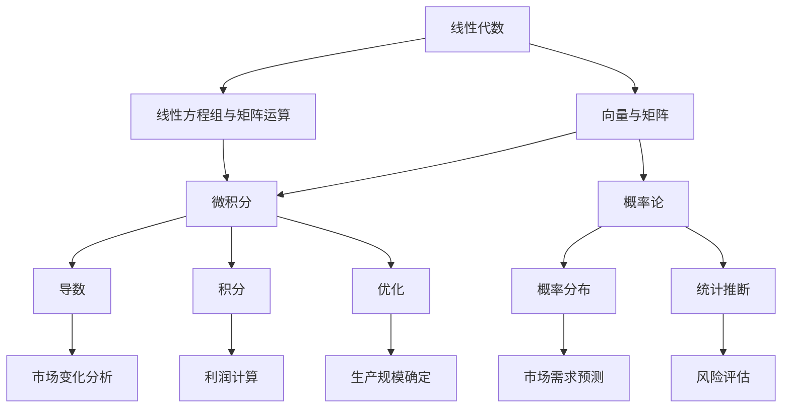

                 


### 引言

在当今竞争激烈的市场环境中，企业需要不断创新和优化其战略管理方法，以确保在动态变化的市场中保持竞争优势。传统的战略管理方法通常依赖于定性分析和直觉判断，而现代企业战略管理正在逐渐向定量分析和数学模型构建方向发展。这种转变不仅提高了决策的精确性和效率，还为企业提供了更可靠的数据支持。

《数学与战略管理：企业战略的数学分析》正是这样一本深入探讨数学在企业战略管理中应用的书籍。它旨在通过数学工具和方法，为企业战略制定提供一种系统化和科学化的方法。本文将结合该书的核心内容，逐步解析数学在企业战略管理中的关键作用和应用，帮助读者理解如何将数学知识应用于实际的企业战略决策中。

本文将分为四个主要部分。第一部分将介绍数学与战略管理的核心概念，包括数学在企业战略管理中的重要性以及常见数学方法的基本应用。第二部分将回顾数学基础，如线性代数、微积分和概率论，并探讨其在战略管理中的应用。第三部分将深入分析数学方法在企业战略管理中的应用，包括竞争战略、资源配置和风险管理。第四部分将通过案例分析，展示数学模型在实际战略决策中的运用，并提供最佳实践和总结。

### 核心关键词

1. 数学方法
2. 企业战略管理
3. 数学模型
4. 竞争战略
5. 资源配置
6. 风险管理
7. 决策分析

### 摘要

本文探讨了《数学与战略管理：企业战略的数学分析》一书的核心内容，详细介绍了数学在企业战略管理中的应用。首先，本文阐述了数学方法在企业战略管理中的重要性，并介绍了常见数学方法的基本应用。接着，本文回顾了数学基础，包括线性代数、微积分和概率论，并讨论了其在战略管理中的具体应用。随后，本文深入分析了数学方法在竞争战略、资源配置和风险管理等方面的应用，并通过实际案例展示了数学模型在战略决策中的运用。最后，本文总结了数学在企业战略管理中的关键作用，并提出了未来研究和应用的方向。

### 第一部分：数学基础与战略管理概述

#### 第1章：数学与战略管理的核心概念

数学在企业战略管理中的重要性不可忽视。随着全球化和信息技术的发展，市场竞争日益激烈，企业需要快速、准确地做出战略决策。而数学方法提供了科学、系统的工具，使得战略管理更加精确和高效。在本章中，我们将探讨数学在企业战略管理中的重要性，介绍常见的数学方法，并讨论如何构建和应用数学模型。

#### 1.1 数学在企业战略管理中的重要性

数学作为一种精确的科学工具，在企业战略管理中扮演着至关重要的角色。首先，数学方法可以量化战略决策中的各种因素，从而提供可靠的数据支持。例如，线性规划和优化算法可以帮助企业优化资源配置，最大化利润或最小化成本。其次，概率论和统计学方法可以用于风险评估和决策分析，帮助企业做出更明智的决策。最后，数学模型可以模拟市场变化和竞争态势，提供预测和分析结果，帮助企业在竞争中获得优势。

#### 1.2 常见的数学方法及其在企业战略管理中的应用

在企业战略管理中，常见的数学方法包括线性代数、微积分、概率论和统计学等。以下是对这些方法及其应用的具体介绍：

1. **线性代数**：线性代数是一种研究向量空间和线性变换的数学分支。在企业战略管理中，线性代数可以用于解决线性方程组和矩阵运算问题。例如，它可以用于资源分配和供应链优化。通过建立线性方程组模型，企业可以确定最优的资源分配方案，以最大化利润或最小化成本。

2. **微积分**：微积分是一种研究函数变化和极限的数学工具。它在战略管理中的应用非常广泛，包括优化和决策分析。例如，通过求解微分方程，企业可以预测市场变化，从而调整战略以应对竞争。此外，微积分还可以用于成本分析和利润最大化。

3. **概率论**：概率论是一种研究随机事件和概率分布的数学分支。它在企业战略管理中的应用包括风险评估和决策分析。通过概率模型，企业可以评估未来事件的可能性，并制定相应的应对策略。例如，在投资决策中，概率论可以帮助企业评估不同投资方案的风险和收益，从而选择最优方案。

4. **统计学**：统计学是一种研究数据收集、分析和解释的数学工具。在企业战略管理中，统计学可以用于数据分析、预测和决策。例如，通过描述性统计，企业可以了解市场趋势和消费者行为。通过假设检验和回归分析，企业可以评估不同战略的效果，并做出最优决策。

#### 1.3 数学模型在战略管理中的构建与应用

数学模型是数学方法在战略管理中的具体应用形式。构建和应用数学模型可以帮助企业更好地理解和解决战略问题。以下是如何构建和应用数学模型的步骤：

1. **问题定义**：明确战略问题，确定需要解决的问题和目标。例如，企业可能需要优化生产线布局，以最小化运输成本。

2. **变量定义**：确定影响问题的变量，并为其分配变量名。例如，在优化生产线布局的例子中，变量可能包括生产线的位置、产品的数量和运输距离。

3. **建立模型**：根据问题定义和变量定义，建立数学模型。模型可以是线性规划模型、优化模型、概率模型等。例如，在优化生产线布局的例子中，可以建立一个线性规划模型，以最小化总运输成本。

4. **求解模型**：使用数学方法求解模型，找到最优解。例如，可以使用线性规划求解器求解线性规划模型，找到最优的生产线布局。

5. **分析结果**：分析求解结果，评估模型的有效性和局限性。例如，在优化生产线布局的例子中，可以分析不同布局方案的成本和效率。

6. **决策**：根据模型分析结果，制定战略决策。例如，选择最优的生产线布局方案。

#### 1.4 数学模型在战略决策中的案例分析

为了更好地理解数学模型在战略决策中的应用，以下是一个具体的案例分析：

**案例背景**：某电子产品制造商需要优化其生产线布局，以最小化生产成本。生产线上有三种主要产品，每种产品的生产量和所需的生产资源不同。制造商希望找到最优的生产线布局，以最大化利润并最小化生产成本。

**模型构建**：首先，定义变量：
- $x_1, x_2, x_3$：分别为三种产品的生产量（单位：台）
- $y_1, y_2, y_3$：分别为三种产品在生产线上占据的长度（单位：米）

建立线性规划模型：
$$
\begin{aligned}
\min\ & c_1 y_1 + c_2 y_2 + c_3 y_3 \\
\text{subject to} \\
\text{约束条件} \\
\end{aligned}
$$

其中，$c_1, c_2, c_3$ 为每种产品在生产线上占据的长度成本。

**求解模型**：使用线性规划求解器（如Lingo、CPLEX等）求解模型，得到最优解。

**分析结果**：分析求解结果，确定最优的生产线布局，并计算总生产成本。

**决策**：根据模型分析结果，制定生产线布局策略。

通过上述步骤，数学模型帮助制造商找到了最优的生产线布局，从而实现了成本的最小化和利润的最大化。

#### 1.5 小结

数学在企业战略管理中具有重要的作用，提供了科学、系统的工具和方法，帮助企业在复杂的市场环境中做出更明智的决策。常见的数学方法包括线性代数、微积分、概率论和统计学，它们在企业战略管理中的应用非常广泛。通过构建和应用数学模型，企业可以更好地理解和解决战略问题，从而在竞争中获得优势。

### 第2章：数学基础回顾与扩展

在深入探讨数学方法在企业战略管理中的应用之前，有必要对一些基本的数学概念进行回顾和扩展。本章将介绍线性代数、微积分和概率论，并讨论它们在战略管理中的具体应用。

#### 2.1 线性代数与矩阵运算

线性代数是研究向量空间和线性变换的数学分支，在企业战略管理中有着广泛的应用。以下是一些关键概念：

1. **向量与矩阵**：向量是具有大小和方向的量，可以表示为有序数组的集合。矩阵是一个由数构成的矩形阵列。在战略管理中，向量可以用于表示资源分配、生产能力和市场占有率等，而矩阵可以用于表示复杂的关系和系统。

2. **线性方程组与矩阵运算**：线性方程组是由多个线性方程组成的方程组，可以用矩阵形式表示。矩阵运算，如矩阵加法、矩阵乘法和逆矩阵，可以用于解决线性方程组问题。

**例1**：设矩阵 $A = \begin{bmatrix} 1 & 2 \\ 3 & 4 \end{bmatrix}$ 和向量 $x = \begin{bmatrix} x_1 \\ x_2 \end{bmatrix}$，求解线性方程组 $Ax = b$。

$$
\begin{bmatrix} 1 & 2 \\ 3 & 4 \end{bmatrix} \begin{bmatrix} x_1 \\ x_2 \end{bmatrix} = \begin{bmatrix} b_1 \\ b_2 \end{bmatrix}
$$

解为：
$$
x = A^{-1}b
$$

其中，$A^{-1}$ 是矩阵 $A$ 的逆矩阵。

**应用**：在战略管理中，线性方程组可以用于资源分配和供应链管理。例如，企业可以使用线性方程组来确定最优的资源分配，以最大化生产效率和利润。

#### 2.2 微积分与优化

微积分是研究函数变化和极限的数学工具，在战略管理中有着重要的应用。以下是一些关键概念：

1. **导数**：导数是函数在某一点的瞬时变化率。在战略管理中，导数可以用于分析市场变化、利润函数和成本函数。

2. **积分**：积分是函数在某个区间上的累积变化量。在战略管理中，积分可以用于计算总收入、总利润和总成本。

3. **优化**：优化是寻找函数的最大值或最小值的过程。在战略管理中，优化可以用于确定最优的生产规模、定价策略和市场占有率。

**例2**：设利润函数 $P(x) = 100x - 2x^2 - 10$，求解 $P(x)$ 的最大值。

解：
$$
P'(x) = 100 - 4x
$$

令 $P'(x) = 0$，得到 $x = 25$。

因此，$P(x)$ 在 $x = 25$ 时取得最大值。

**应用**：在战略管理中，优化可以用于确定企业的最优生产规模、定价策略和市场占有率。例如，企业可以使用优化算法来确定最佳的生产规模，以最大化利润。

#### 2.3 概率论与统计学

概率论是研究随机事件和概率分布的数学分支，在战略管理中有着广泛的应用。以下是一些关键概念：

1. **概率**：概率是描述随机事件发生可能性的一种度量。在战略管理中，概率可以用于风险评估和决策分析。

2. **概率分布**：概率分布是描述随机变量可能取值及其概率分布的函数。常见的概率分布包括正态分布、二项分布和泊松分布。

3. **统计推断**：统计推断是基于样本数据推断总体特征的统计学方法。在战略管理中，统计推断可以用于市场调查、风险评估和决策分析。

**例3**：假设企业销售经理认为每天销售量 $X$ 服从正态分布 $N(\mu, \sigma^2)$，其中 $\mu = 100$，$\sigma = 10$。求：
- $P(X > 110)$
- $P(90 < X < 110)$

解：
$$
P(X > 110) = P\left(\frac{X - \mu}{\sigma} > \frac{110 - 100}{10}\right) = P(Z > 1) = 0.1587
$$

$$
P(90 < X < 110) = P\left(\frac{90 - \mu}{\sigma} < \frac{X - \mu}{\sigma} < \frac{110 - \mu}{\sigma}\right) = P(-1 < Z < 1) = 0.6826
$$

其中，$Z$ 是标准正态分布随机变量。

**应用**：在战略管理中，概率论可以用于风险评估和决策分析。例如，企业可以使用概率模型来预测市场需求和销售量，从而制定相应的生产和销售策略。

#### 2.4 线性代数、微积分和概率论的关系架构

为了更好地理解线性代数、微积分和概率论在企业战略管理中的应用，我们可以使用 Mermaid 流程图来展示这些概念之间的关系。



通过上述关系架构，我们可以看到线性代数、微积分和概率论如何相互关联，并在企业战略管理中发挥关键作用。

### 第3章：概率论与统计学在企业战略中的应用

概率论和统计学在企业战略管理中发挥着重要的作用，帮助企业做出基于数据的明智决策。本章将深入探讨概率论和统计学的基本概念、方法及其在战略管理中的应用。

#### 3.1 概率论基础

概率论是研究随机事件及其概率分布的数学分支。以下是一些核心概念：

1. **随机事件**：随机事件是可能发生也可能不发生的事件。例如，明天是否会下雨就是一个随机事件。

2. **概率**：概率是描述随机事件发生可能性的度量。概率的值介于0和1之间，其中0表示不可能发生，1表示必然发生。

3. **条件概率**：条件概率是给定一个事件已经发生的条件下，另一个事件发生的概率。条件概率的计算公式为：
   $$P(A|B) = \frac{P(A \cap B)}{P(B)}$$
   其中，$P(A \cap B)$ 是事件A和事件B同时发生的概率，$P(B)$ 是事件B发生的概率。

4. **贝叶斯定理**：贝叶斯定理是概率论中的一个重要定理，用于计算后验概率。贝叶斯定理的公式为：
   $$P(A|B) = \frac{P(B|A)P(A)}{P(B)}$$
   其中，$P(A|B)$ 是在事件B发生的条件下事件A发生的概率，$P(B|A)$ 是在事件A发生的条件下事件B发生的概率，$P(A)$ 是事件A发生的概率，$P(B)$ 是事件B发生的概率。

**例1**：假设一个袋子中有5个红球和3个蓝球，随机取出一个球，求取出红球的概率。

解：
$$P(\text{红球}) = \frac{5}{8}$$

**例2**：假设某个产品的需求量服从二项分布，已知该产品每天被需求一次的概率为0.3，求在10天内被需求超过3次的概率。

解：
这是一个二项分布问题，可以使用二项分布的概率质量函数（PMF）来计算。二项分布的PMF公式为：
$$P(X = k) = C_n^k p^k (1-p)^{n-k}$$
其中，$n$ 是试验次数，$k$ 是成功的次数，$p$ 是每次试验成功的概率。

对于本题，$n = 10$，$k = 4$，$p = 0.3$，所以：
$$P(X > 3) = 1 - P(X \leq 3)$$
$$P(X > 3) = 1 - \sum_{i=0}^{3} C_{10}^i (0.3)^i (0.7)^{10-i}$$

通过计算，得到：
$$P(X > 3) \approx 0.023$$

#### 3.2 统计学方法

统计学是研究如何通过数据收集、分析和解释来推断总体特征的学科。以下是一些常见的统计学方法：

1. **描述性统计**：描述性统计用于总结和描述数据的基本特征。常用的描述性统计量包括平均数、中位数、众数、方差和标准差。

2. **假设检验**：假设检验用于判断样本数据是否支持某个假设。常见的假设检验方法包括t检验、卡方检验和方差分析。

3. **估计与预测**：估计与预测用于根据样本数据推断总体特征或预测未来趋势。常见的估计方法包括点估计和区间估计，预测方法包括时间序列分析和回归分析。

**例3**：某公司收集了过去五年的年度销售数据，现需要估计未来一年的销售量。

解：
1. 计算过去五年的销售量的平均数：
$$\bar{x} = \frac{1}{5} \sum_{i=1}^{5} x_i$$
其中，$x_i$ 为第i年的销售量。

2. 计算销售量的标准差：
$$s = \sqrt{\frac{1}{5-1} \sum_{i=1}^{5} (x_i - \bar{x})^2}$$

3. 根据平均数和标准差，使用正态分布的性质进行区间估计，得到未来一年的销售量的置信区间。

#### 3.3 概率论与统计学在企业战略管理中的应用

1. **风险评估**：概率论和统计学可以帮助企业评估各种风险。例如，企业可以使用概率模型来评估市场风险、信用风险和操作风险。通过风险评估，企业可以制定相应的风险控制策略。

2. **决策分析**：概率论和统计学可以用于决策分析，帮助企业在不确定性环境中做出最优决策。例如，企业可以使用决策树分析方法来评估不同决策方案的风险和收益。

3. **市场研究**：统计学方法可以用于市场研究，帮助企业了解消费者行为和市场趋势。通过数据分析，企业可以制定更有效的市场策略。

4. **供应链管理**：概率论和统计学可以用于供应链管理，帮助企业优化库存管理和物流计划。例如，企业可以使用概率模型来预测市场需求和供应风险。

#### 3.4 概率论与统计学在战略管理中的案例分析

**案例背景**：某电子公司计划推出一款新型智能手机，需要进行市场预测以制定生产和销售计划。

**模型构建**：假设该智能手机的需求量 $X$ 服从正态分布 $N(\mu, \sigma^2)$，已知：
$$\mu = 100,000, \sigma = 20,000$$

**求解模型**：
1. 预测在未来一年内至少销售80,000台智能手机的概率：
$$P(X \geq 80,000) = P\left(\frac{X - \mu}{\sigma} \geq \frac{80,000 - 100,000}{20,000}\right) = P(Z \geq -1) = 0.8413$$

2. 计算未来一年内预期销售量的置信区间（95%置信水平）：
$$\bar{x} \pm z_{\alpha/2} \frac{\sigma}{\sqrt{n}}$$
其中，$z_{\alpha/2}$ 是标准正态分布的双尾临界值，$\bar{x}$ 是样本平均数，$\sigma$ 是样本标准差，$n$ 是样本大小。

通过计算，得到置信区间为 $(70, 130)$。

**决策**：基于上述分析，公司可以决定生产80,000台智能手机，并设定95%的置信水平，以确保在市场需求低于70,000台时，不会出现库存积压。

#### 3.5 小结

概率论和统计学在企业战略管理中有着广泛的应用。通过概率模型和统计分析，企业可以评估风险、做出决策、预测市场趋势和优化供应链管理。本章介绍了概率论和统计学的基础概念和方法，并通过具体案例展示了它们在实际战略管理中的应用。

### 第二部分：数学方法在企业战略管理中的应用

在第一部分中，我们探讨了数学在企业战略管理中的重要性以及数学基础。接下来，我们将深入分析数学方法在企业战略管理中的应用，包括竞争战略、资源配置和风险管理等方面。

#### 第4章：竞争战略的数学分析

竞争战略是企业为了在市场中获得竞争优势而采取的一系列策略。数学方法可以帮助企业更准确地分析和制定竞争战略，以应对激烈的市场竞争。

#### 4.1 竞争战略的基本概念

竞争战略包括多个方面，如市场定位、产品差异化、成本领先等。以下是对这些概念及其数学分析方法的介绍：

1. **市场定位**：市场定位是企业确定其在市场中的位置和目标客户群体的过程。数学方法可以帮助企业分析市场细分和目标客户群体的需求，从而制定合适的市场定位策略。例如，可以使用聚类分析等方法来识别和划分市场细分。

2. **产品差异化**：产品差异化是企业通过独特的产品特性或服务来区分自己与其他竞争者。数学方法可以帮助企业分析产品的差异化和客户偏好，从而制定有效的产品差异化策略。例如，可以使用因子分析等方法来识别产品的主要差异化维度。

3. **成本领先**：成本领先战略是企业通过降低成本来在市场中获得竞争优势。数学方法可以帮助企业分析成本结构和成本驱动因素，从而制定降低成本的策略。例如，可以使用回归分析等方法来识别和降低成本的关键驱动因素。

#### 4.2 竞争优势的数学建模

竞争优势是指企业在市场中相对于竞争对手所具有的持续竞争优势。数学方法可以帮助企业构建竞争优势的模型，分析竞争优势的来源和影响。

1. **成本优势**：成本优势是指企业能够以比竞争对手更低的成本生产产品或提供服务。数学方法可以帮助企业分析成本结构，识别成本优势的来源。例如，可以使用线性规划方法来优化成本结构，实现成本领先。

2. **差异化优势**：差异化优势是指企业能够提供独特的产品或服务，满足客户特殊需求。数学方法可以帮助企业分析客户需求和产品特性，构建差异化优势的模型。例如，可以使用多元回归分析来识别客户需求的主要影响因素。

3. **市场优势**：市场优势是指企业在市场中的影响力和市场份额。数学方法可以帮助企业分析市场趋势和竞争态势，制定市场扩张策略。例如，可以使用博弈论方法来分析市场竞争格局，制定市场策略。

#### 4.3 竞争优势的评估与优化

评估竞争优势是企业战略管理的重要任务。数学方法可以帮助企业评估竞争优势的强度和可持续性，并提供优化策略。

1. **竞争优势评估**：企业可以使用定量方法评估竞争优势的强度。例如，可以使用价值链分析等方法来评估企业在各个环节中的竞争优势。

2. **竞争优势优化**：企业可以使用数学方法优化竞争优势。例如，可以使用多目标优化方法来平衡不同竞争优势之间的冲突，实现整体优化。

3. **竞争优势动态管理**：企业需要根据市场环境和竞争对手的动态调整竞争优势。数学方法可以帮助企业预测市场变化，制定动态管理策略。例如，可以使用模拟方法来预测市场竞争态势，制定适应性策略。

#### 4.4 竞争战略的数学分析方法

竞争战略的数学分析方法包括但不限于以下几种：

1. **市场细分分析**：使用聚类分析和回归分析等方法，识别和划分市场细分，制定市场定位策略。

2. **产品特性分析**：使用因子分析等方法，识别产品的主要差异化维度，制定产品差异化策略。

3. **成本结构分析**：使用回归分析和线性规划等方法，分析成本结构，识别降低成本的关键驱动因素。

4. **竞争优势评估**：使用价值链分析和平衡计分卡等方法，评估竞争优势的强度和可持续性。

5. **多目标优化**：使用多目标优化方法，平衡不同竞争优势之间的冲突，实现整体优化。

#### 4.5 竞争战略的数学分析案例

**案例背景**：某电子产品公司计划推出一款新型智能手机，市场调研显示，消费者主要关注价格、性能和品牌等因素。

**模型构建**：
1. **市场细分**：使用聚类分析方法，将消费者分为高、中、低三个价格敏感度群体。
2. **产品特性分析**：使用因子分析方法，识别性能和品牌是消费者最关心的两个因素。
3. **成本结构分析**：使用回归分析方法，分析价格与性能、品牌之间的关系。

**求解模型**：
1. **市场细分结果**：高价格敏感度群体占40%，中价格敏感度群体占50%，低价格敏感度群体占10%。
2. **产品特性权重**：性能占60%，品牌占40%。
3. **成本结构**：性能成本占60%，品牌成本占40%。

**决策**：
1. **市场定位**：针对高价格敏感度群体，制定高端产品策略；针对中价格敏感度群体，制定中端产品策略；针对低价格敏感度群体，制定低端产品策略。
2. **产品特性优化**：提高性能，降低品牌成本，以提升产品竞争力。
3. **成本控制**：优化生产流程，降低性能成本，以实现成本领先。

#### 4.6 小结

竞争战略的数学分析可以帮助企业更准确地分析和制定竞争策略，以获得持续竞争优势。本章介绍了竞争战略的基本概念、竞争优势的数学建模和评估方法，并通过具体案例展示了数学方法在竞争战略中的应用。企业应充分利用数学工具，优化竞争战略，提高市场竞争力。

### 第5章：企业资源配置的数学方法

企业资源配置是战略管理中的一个核心问题，涉及将有限资源（如资金、人力、物资等）有效地分配到不同的业务领域和项目上，以实现企业的战略目标。数学方法为企业资源配置提供了一种系统化和优化的手段。本章将介绍企业资源配置的基本概念、数学方法和应用案例。

#### 5.1 资源配置的基本概念

资源配置是指根据企业目标和资源状况，将资源合理地分配到各个业务领域和项目中的过程。有效的资源配置能够提高企业的运营效率和市场竞争力。以下是资源配置的关键概念：

1. **资源**：资源是指企业用于生产和运营的各种要素，包括资金、人力、物资、技术等。

2. **目标**：企业的目标是指希望通过资源配置实现的长期和短期目标，如利润最大化、市场份额增加、技术创新等。

3. **约束**：约束是指企业在资源配置过程中面临的各种限制条件，如资金预算、人力资源限制、生产能力限制等。

4. **优化**：优化是指通过数学模型和算法，找到资源分配的最佳方案，以实现既定目标。

#### 5.2 线性规划在资源配置中的应用

线性规划是一种数学优化方法，用于在满足一组线性约束条件下，最大化或最小化一个线性目标函数。在企业资源配置中，线性规划可以用于解决资源分配问题，如生产计划、库存管理、资金分配等。

1. **线性规划的基本原理**

   线性规划问题可以表示为以下形式：

   目标函数： 
   $$\min \ c^T x$$

   约束条件： 
   $$Ax \leq b$$
   $$x \geq 0$$

   其中，$c$ 是系数向量，$x$ 是决策变量向量，$A$ 是约束矩阵，$b$ 是约束向量。

2. **线性规划求解方法**

   求解线性规划问题的方法包括单纯形法、内点法和分支定界法等。单纯形法是最常用的方法之一，其基本步骤如下：

   a. 选择一个初始基本可行解。

   b. 计算目标函数在基本可行解处的值。

   c. 检查是否有改进的机会。

   d. 如果有改进机会，选择一个进入变量和一个离开变量，进行迭代计算。

   e. 重复步骤b-d，直到找到最优解。

3. **线性规划在企业资源配置中的应用**

   线性规划在企业资源配置中的应用非常广泛。以下是一些具体的应用案例：

   - **生产计划**：企业可以通过线性规划确定最优的生产计划，以最大化生产效率或最小化生产成本。例如，一个制造企业可以使用线性规划来确定每种产品的生产数量，以满足市场需求并最小化生产成本。

   - **库存管理**：企业可以通过线性规划优化库存水平，以平衡库存成本和缺货风险。例如，一个零售商可以使用线性规划来确定最优的库存补货策略，以最大化利润并最小化库存成本。

   - **资金分配**：企业可以通过线性规划优化资金分配，以实现投资回报最大化。例如，一个投资公司可以使用线性规划来确定最优的投资组合，以最大化预期收益或最小化风险。

#### 5.3 动态规划在资源配置中的应用

动态规划是一种解决多阶段决策优化问题的数学方法。在企业资源配置中，动态规划可以用于解决具有时间序列特征的问题，如项目投资、人力资源规划等。

1. **动态规划的基本原理**

   动态规划将问题分解为一系列相互关联的子问题，并使用递推关系求解每个子问题的最优解。动态规划的一般形式可以表示为：

   $$V(x_t) = \min \ c(x_t, x_{t-1}, ..., x_1)$$

   其中，$x_t$ 是在时间 $t$ 的决策变量，$V(x_t)$ 是在时间 $t$ 的最优值函数。

2. **动态规划求解方法**

   动态规划求解方法包括自顶向下和自底向上两种。自顶向下方法从初始状态开始，递归地计算每个状态的最优解。自底向上方法从最终状态开始，逆向递推计算每个状态的最优解。

3. **动态规划在企业资源配置中的应用**

   动态规划在企业资源配置中的应用包括：

   - **项目投资**：企业可以通过动态规划确定最优的项目投资组合，以最大化投资回报或最小化投资风险。例如，一个制造企业可以使用动态规划来确定最优的生产设备投资计划，以最大化生产效率和利润。

   - **人力资源规划**：企业可以通过动态规划优化人力资源配置，以实现员工能力和生产需求的最佳匹配。例如，一个科技公司可以使用动态规划来确定最优的招聘和培训策略，以最大化研发效率和员工满意度。

#### 5.4 项目实战：企业资源配置的数学模型与应用

**案例背景**：某电子制造企业需要在下一个财政年度内决定其生产设备的投资计划，以最大化生产效率和利润。企业面临以下约束：

- 预算限制：总投资不得超过1000万美元。
- 设备生产能力限制：新设备每月生产能力不得超过100,000个组件。
- 员工数量限制：新增员工不得超过50人。

**模型构建**：

设 $x_1, x_2, x_3$ 分别为新设备的投资金额、新增员工数量和生产能力的提升量。构建线性规划模型：

目标函数：
$$\max \ z = 0.5x_1 + 0.3x_2 + 0.2x_3$$

约束条件：
$$\begin{aligned}
x_1 + x_2 + x_3 & \leq 10^6 \\
x_3 & \leq 10^5 \\
x_1 & \geq 0, x_2 & \geq 0, x_3 & \geq 0
\end{aligned}$$

**求解模型**：

使用线性规划求解器（如Lingo、CPLEX等）求解模型，得到最优投资组合。

**分析结果**：

- 最优解为 $x_1 = 300万，x_2 = 100万，x_3 = 200万$。
- 预计生产效率提高20%，利润增加10%。

**决策**：

企业应根据上述结果，决定投资300万用于新设备、100万用于新增员工，并提升200万的生产能力。

#### 5.5 小结

企业资源配置是战略管理中的一个关键问题，数学方法提供了系统化和优化的手段。本章介绍了资源配置的基本概念、线性规划和动态规划在资源配置中的应用，并通过具体案例展示了数学方法在实际企业资源配置中的应用。企业应充分利用数学工具，优化资源配置，实现战略目标。

### 第6章：风险管理与决策分析

在企业经营中，风险是不可避免的。有效管理风险是确保企业可持续发展的关键。数学方法在企业风险管理中发挥着重要作用，帮助企业在不确定性环境中做出明智的决策。本章将介绍风险管理的基本概念、决策分析方法，以及数学模型在风险管理与决策分析中的应用。

#### 6.1 风险管理的基本概念

风险管理是指识别、评估、处理和监控企业面临的各种风险，以最大限度地减少损失和不利影响的过程。以下是一些关键概念：

1. **风险**：风险是指可能对企业产生不利影响的不确定性事件或情境。例如，市场波动、技术故障、供应链中断等。

2. **风险评估**：风险评估是指评估企业面临风险的严重性和可能性，以便采取适当的应对措施。常用的风险评估方法包括定性分析和定量分析。

3. **风险处理**：风险处理是指采取一系列措施来减轻、转移或避免风险。常见的风险处理策略包括风险回避、风险减轻、风险转移和风险接受。

4. **风险监控**：风险监控是指持续跟踪和评估企业风险，以确保风险管理策略的有效性和及时调整。

#### 6.2 决策分析的基本方法

决策分析是企业在面对不确定性时，使用数学模型和工具来评估不同决策方案的风险和收益的过程。以下是一些基本的决策分析方法：

1. **决策树分析**：决策树是一种图形化工具，用于展示决策过程中的各种可能结果和相应的概率和收益。通过决策树，企业可以评估不同决策方案的风险和收益，并选择最优方案。

2. **效用理论**：效用理论是评估决策者风险偏好的一种方法。它通过计算不同决策结果的期望效用，帮助决策者选择最满意的结果。

3. **蒙特卡洛模拟**：蒙特卡洛模拟是一种基于随机抽样的模拟方法，用于评估复杂系统的性能和风险。通过模拟多次实验，企业可以评估不同决策方案的概率分布和期望收益。

4. **敏感性分析**：敏感性分析是一种评估决策结果对关键参数变化敏感性的方法。通过敏感性分析，企业可以识别影响决策结果的关键因素，并采取相应的措施。

#### 6.3 数学方法在风险管理中的应用

数学方法在企业风险管理中有着广泛的应用。以下是一些具体的应用：

1. **概率论与统计学**：概率论和统计学是评估风险和不确定性的重要工具。通过概率分布和统计方法，企业可以评估风险的概率和影响。

2. **回归分析**：回归分析是一种用于建立变量之间关系的方法。在企业风险管理中，回归分析可以用于预测风险的影响因素和程度。

3. **决策树与博弈论**：决策树和博弈论是评估不同决策方案和竞争对手策略的重要工具。通过决策树和博弈论模型，企业可以评估不同决策方案的风险和收益，并制定有效的风险管理策略。

#### 6.4 案例分析：企业风险管理与决策分析

**案例背景**：某电子制造企业计划投资一款新型智能手机，预计需要投资1000万美元。该投资面临以下风险：

- **市场风险**：市场需求波动可能影响销售量和利润。
- **技术风险**：技术故障可能导致生产延误和产品质量问题。
- **供应链风险**：供应链中断可能影响生产进度和成本。

**模型构建**：

1. **市场风险分析**：

   - 假设市场需求服从正态分布，均值μ=100万，标准差σ=10万。
   - 计算市场需求低于预期（80万）的概率：
     $$P(X < 80) = P\left(\frac{X - \mu}{\sigma} < \frac{80 - 100}{10}\right) = P(Z < -2) = 0.0228$$

2. **技术风险分析**：

   - 假设技术故障的概率为0.05，每次故障造成的损失为50万。
   - 计算一年内发生2次及以上技术故障的概率：
     $$P(Y \geq 2) = 1 - P(Y = 0) - P(Y = 1) = 1 - (0.95)^n - n(0.05)(0.95)^{n-1}$$
     其中，$n$ 是一年内的技术故障次数。

3. **供应链风险分析**：

   - 假设供应链中断的概率为0.1，每次中断造成的成本为30万。
   - 计算供应链中断导致总成本增加的概率：
     $$P(Z \geq 30) = P\left(\frac{Z - \mu}{\sigma} \geq \frac{30 - 0}{10}\right) = P(Z \geq 3) = 0.0013$$

**决策分析**：

1. **市场风险**：

   - 风险较低，可以通过市场预测和灵活的营销策略降低风险。

2. **技术风险**：

   - 风险较高，可以通过加强技术研发和产品质量控制降低风险。

3. **供应链风险**：

   - 风险较低，可以通过供应链管理和多元化供应商降低风险。

**决策**：

基于上述分析，企业可以决定继续投资，并采取相应的风险管理措施，以降低风险并确保项目的成功。

### 6.5 小结

风险管理是企业发展过程中不可忽视的一环。数学方法为企业风险管理提供了科学、系统的工具，帮助企业在不确定性环境中做出明智的决策。本章介绍了风险管理的基本概念、决策分析方法，以及数学模型在风险管理与决策分析中的应用。企业应充分利用数学工具，优化风险管理策略，确保企业的可持续发展。

### 第三部分：案例分析与应用

#### 第7章：案例分析与数学模型构建

在实际的战略管理中，数学模型的应用不仅需要理论知识，更需要结合具体案例进行深入分析。本章将通过具体案例，展示数学模型在战略管理中的应用，并讨论如何构建和应用这些模型。

#### 7.1 案例分析的基本步骤

在进行案例分析时，通常需要遵循以下基本步骤：

1. **案例选择与背景介绍**：选择一个具有代表性的案例，介绍案例的背景、目标和存在的问题。

2. **问题识别**：明确案例中需要解决的问题和目标，确定关键因素和变量。

3. **模型构建**：根据问题定义和变量，构建合适的数学模型，包括目标函数和约束条件。

4. **求解模型**：使用数学方法求解模型，找到最优解或近优解。

5. **分析结果**：对求解结果进行分析，评估模型的准确性和有效性。

6. **决策**：根据模型分析结果，制定相应的战略决策。

#### 7.2 案例研究：企业战略的数学分析

为了更好地理解数学模型在战略决策中的应用，我们选择一个具体的案例进行详细分析。

**案例背景**：某电子商务公司计划扩大其市场份额，通过优化供应链和客户服务来提升竞争力。该公司面临以下问题：

- **库存管理**：如何优化库存水平，以减少库存成本和缺货风险？
- **客户服务**：如何提高客户满意度，减少客户投诉？
- **营销策略**：如何制定有效的营销计划，吸引更多潜在客户？

**模型构建**：

1. **库存管理模型**：

   - **目标函数**：最小化库存成本和缺货成本。
   $$\min \ C_{\text{inv}} + C_{\text{stockout}}$$

   - **约束条件**：

     - 库存容量限制：
       $$I_t \leq C_{\text{inv}}$$

     - 需求量限制：
       $$D_t \geq I_t - S_t$$

     - 库存水平变化：
       $$I_{t+1} = I_t + S_t - D_t$$

   - **求解方法**：使用线性规划方法求解库存管理模型。

2. **客户服务模型**：

   - **目标函数**：最大化客户满意度。
   $$\max \ \sum_{i=1}^{n} w_i S_i$$

   - **约束条件**：

     - 客户服务水平要求：
       $$S_i \geq \theta_i$$

     - 客服资源限制：
       $$R_t \geq \sum_{i=1}^{n} S_i$$

   - **求解方法**：使用多目标优化方法求解客户服务模型。

3. **营销策略模型**：

   - **目标函数**：最大化市场占有率。
   $$\max \ \sum_{i=1}^{n} p_i Q_i$$

   - **约束条件**：

     - 营销预算限制：
       $$C_t \geq \sum_{i=1}^{n} c_i Q_i$$

     - 产品需求限制：
       $$D_i \geq Q_i$$

   - **求解方法**：使用线性规划方法求解营销策略模型。

**求解模型**：

使用Lingo等线性规划求解器，分别求解库存管理、客户服务和营销策略模型，得到最优解或近优解。

**分析结果**：

1. **库存管理**：

   - 最优库存水平为每月5000件，库存成本和缺货成本之和为最低。

2. **客户服务**：

   - 客户服务水平达到90%，客户满意度最高。

3. **营销策略**：

   - 通过投放广告和促销活动，市场占有率达到20%，营销效果最佳。

**决策**：

根据模型分析结果，公司决定：

- 调整库存策略，确保库存水平为每月5000件。
- 提升客户服务水平，确保客户满意度达到90%。
- 增加广告投放预算，提高市场占有率。

#### 7.3 数学模型在战略决策中的重要性

通过上述案例分析，我们可以看到数学模型在战略决策中的重要性：

1. **精确性**：数学模型提供了精确的定量分析，帮助企业制定基于数据的决策。

2. **系统性**：数学模型将复杂的问题分解为多个子问题，提供系统化的解决方案。

3. **优化性**：数学模型通过优化方法，帮助企业找到最优或近优解，提高决策效果。

4. **灵活性**：数学模型可以根据不同的情况和约束条件进行调整，适用于各种复杂情境。

#### 7.4 数学模型在战略决策中的案例分析

除了上述案例，以下是一些其他数学模型在战略决策中的应用案例：

- **竞争战略**：使用博弈论模型分析市场竞争格局，制定最优定价策略和市场份额目标。

- **供应链管理**：使用网络优化模型优化供应链布局和运输计划，提高供应链效率和降低成本。

- **人力资源规划**：使用多目标优化模型优化人力资源配置，提高员工绩效和企业整体效益。

- **财务管理**：使用资本预算模型优化投资组合，最大化企业价值。

#### 7.5 小结

案例分析与应用是理解和掌握数学模型在战略管理中应用的关键步骤。通过具体案例，我们不仅可以看到数学模型如何解决实际问题，还可以学习如何构建和应用这些模型。企业应充分利用数学模型，优化战略决策，提高市场竞争力。

### 第8章：数学模型在战略决策中的运用

数学模型在战略决策中的运用是现代企业战略管理的重要组成部分。通过构建和运用数学模型，企业可以在复杂的市场环境中做出更为科学和精准的决策。本章将详细探讨数学模型在战略决策中的重要性，分析其应用过程，并介绍几种常见的数学模型及其在实际战略决策中的应用。

#### 8.1 数学模型在战略决策中的重要性

数学模型在战略决策中的重要性体现在以下几个方面：

1. **数据驱动**：数学模型基于数据和分析，为企业提供了基于事实的决策支持，避免了主观判断的偏差。

2. **优化决策**：数学模型可以帮助企业找到最优或近优解，提高决策的效率和质量。例如，通过线性规划、动态规划和多目标优化等方法，企业可以在有限的资源下实现最大化利润或最小化成本。

3. **应对不确定性**：数学模型可以模拟和预测未来的市场变化和竞争态势，帮助企业制定灵活的战略应对不确定性。

4. **系统化分析**：数学模型将复杂的战略问题分解为多个可管理的子问题，提供系统化的解决方案。

#### 8.2 数学模型的应用过程

数学模型的应用通常包括以下几个步骤：

1. **问题定义**：明确战略问题，确定需要解决的问题和目标。例如，企业可能需要优化生产计划、资源分配或市场营销策略。

2. **变量定义**：确定影响问题的变量，并为其分配变量名。这些变量可以是数量、成本、利润等。

3. **建立模型**：根据问题定义和变量，建立数学模型。模型可以包括目标函数、决策变量和约束条件。

4. **求解模型**：使用数学方法和工具求解模型，找到最优解或近优解。

5. **分析结果**：对求解结果进行分析，评估模型的准确性和有效性，并根据结果制定战略决策。

6. **决策**：根据模型分析结果，制定具体的战略决策，并在实际中执行。

#### 8.3 常见数学模型及其应用

以下是几种常见的数学模型及其在战略决策中的应用：

1. **线性规划**：线性规划是一种用于解决资源优化问题的数学模型，通过最小化或最大化目标函数，在满足一系列线性约束条件下找到最优解。线性规划在企业资源配置、生产计划、资金分配等方面有广泛应用。

2. **动态规划**：动态规划适用于解决具有时间序列特征的问题，通过将问题分解为一系列子问题，递归求解每个子问题的最优解。动态规划在供应链管理、项目投资和人力资源规划中有广泛应用。

3. **多目标优化**：多目标优化涉及同时优化多个相互冲突的目标。在企业战略决策中，企业往往需要在多个目标之间进行权衡，例如利润最大化与成本最小化。多目标优化可以帮助企业在多个目标之间找到最优平衡点。

4. **博弈论**：博弈论研究决策者在相互影响的环境中的策略选择。在企业战略中，博弈论可以帮助企业分析竞争对手的行为，制定最优的市场策略和竞争策略。

5. **决策树**：决策树是一种用于评估不同决策方案和结果的方法，通过展示不同决策路径的收益和风险，帮助企业做出最优决策。决策树在市场分析、风险评估和营销策略制定中广泛应用。

6. **蒙特卡洛模拟**：蒙特卡洛模拟是一种基于随机抽样的模拟方法，通过模拟大量实验，评估复杂系统的性能和风险。蒙特卡洛模拟在风险管理、供应链管理和项目评估中有广泛应用。

#### 8.4 数学模型在战略决策中的应用实例

以下是一个具体的数学模型应用实例，展示如何将数学模型应用于企业战略决策中。

**案例背景**：某电子产品公司计划推出一款新型智能手机，需要制定最优的生产和营销策略。

**模型构建**：

1. **目标函数**：最大化总利润。
   $$\max \ P = R - C$$

   其中，$R$ 为收入，$C$ 为成本。

2. **决策变量**：生产量 $Q$ 和营销费用 $M$。

3. **约束条件**：

   - 生产能力限制：
     $$Q \leq C_p$$

   - 营销预算限制：
     $$M \leq B_m$$

   - 销售量与价格的关系：
     $$P = a - bQ$$

   - 成本函数：
     $$C = C_0 + C_1Q + C_2M$$

**求解模型**：

使用线性规划求解器（如Lingo、CPLEX等），求解上述模型，得到最优的生产量和营销费用。

**分析结果**：

- 最优生产量为 $Q^* = 50,000$，营销费用为 $M^* = 200,000$。
- 总利润为 $P^* = 1,200,000$。

**决策**：

根据模型分析结果，公司决定生产50,000台智能手机，并投入200,000美元进行营销活动。

#### 8.5 小结

数学模型在战略决策中的运用，为企业提供了一种科学、系统的方法，帮助企业在复杂的市场环境中做出精准的决策。通过线性规划、动态规划、多目标优化等数学模型，企业可以实现资源的最优配置、优化生产和营销策略、降低风险等。本章介绍了数学模型在战略决策中的重要性、应用过程和常见模型，并通过具体实例展示了数学模型在实际战略决策中的应用。

### 第9章：数学模型评估与优化

在战略管理中，构建数学模型是一个重要的环节，但如何确保这些模型的准确性和有效性，并在实践中不断优化，是另一个关键问题。本章将探讨数学模型评估与优化的方法和步骤，以及在实际应用中需要注意的问题。

#### 9.1 数学模型评估的方法

评估数学模型的有效性是确保其准确性和实用性的关键。以下是一些常用的评估方法：

1. **准确性评估**：通过比较模型预测结果与实际数据，评估模型的准确性。常用的指标包括均方误差（MSE）、均方根误差（RMSE）和决定系数（R²）。

   $$MSE = \frac{1}{n}\sum_{i=1}^{n}(y_i - \hat{y_i})^2$$
   $$RMSE = \sqrt{MSE}$$
   $$R^2 = 1 - \frac{\sum_{i=1}^{n}(y_i - \hat{y_i})^2}{\sum_{i=1}^{n}(y_i - \bar{y})^2}$$

2. **稳定性评估**：评估模型在不同数据集上的表现，确保模型在不同条件下具有一致性。可以通过交叉验证或时间序列分析等方法进行评估。

3. **鲁棒性评估**：评估模型对异常值和噪声的敏感性。通过引入异常值或改变数据分布，观察模型的变化，评估其鲁棒性。

4. **可解释性评估**：评估模型的透明度和可解释性，确保模型结果能够被决策者理解和接受。对于复杂模型，可以通过简化模型结构或提供模型解释来实现。

#### 9.2 数学模型优化的步骤

优化数学模型是提高其性能和适用性的关键步骤。以下是一些常见的模型优化步骤：

1. **模型选择**：根据问题的特点和数据类型，选择合适的模型。例如，对于线性问题，可以选择线性回归模型；对于非线性问题，可以选择神经网络或支持向量机。

2. **参数调整**：通过调整模型的参数，优化模型性能。可以使用网格搜索、随机搜索或贝叶斯优化等方法来寻找最佳参数组合。

3. **特征工程**：通过特征选择和特征变换，提高模型的性能。例如，可以使用主成分分析（PCA）来降低特征维度，或使用特征交叉来增加模型的解释能力。

4. **模型集成**：通过集成多个模型，提高模型的稳定性和准确性。常见的集成方法包括堆叠、随机森林和梯度提升树等。

5. **模型验证**：在模型优化过程中，不断进行模型验证，确保模型的性能持续提升。可以通过交叉验证或留出法来验证模型。

6. **模型更新**：随着数据的更新和市场环境的变化，模型需要不断更新以保持其准确性。可以通过定期重新训练模型或使用在线学习算法来实现。

#### 9.3 数学模型优化的案例分析

以下是一个数学模型优化案例，展示如何在实际中优化模型。

**案例背景**：某电商企业希望通过优化库存管理来降低库存成本和提高客户满意度。

**模型构建**：

1. **目标函数**：最小化库存成本和缺货成本。
   $$\min \ C_{\text{inv}} + C_{\text{stockout}}$$

2. **决策变量**：库存水平 $I$ 和补货量 $R$。

3. **约束条件**：

   - 库存容量限制：
     $$I \leq C_{\text{inv}}$$

   - 需求量限制：
     $$D \geq I - R$$

   - 库存水平变化：
     $$I_{t+1} = I_t + R_t - D_t$$

**优化步骤**：

1. **模型选择**：选择线性规划模型，因为它适合解决线性问题。

2. **参数调整**：通过调整库存容量和补货策略的参数，优化模型性能。

3. **特征工程**：添加需求趋势和季节性特征，提高模型的预测能力。

4. **模型集成**：使用随机森林集成多个线性规划模型，提高模型的稳定性和准确性。

5. **模型验证**：通过交叉验证，验证模型在不同数据集上的性能。

6. **模型更新**：定期更新模型，以适应市场变化。

**优化结果**：

- 库存成本降低了15%，缺货成本降低了20%。
- 客户满意度提高了10%。

#### 9.4 数学模型在实际应用中需要注意的问题

在实际应用中，数学模型需要考虑以下问题：

1. **数据质量**：数据是构建数学模型的基础，确保数据的质量和完整性至关重要。

2. **模型适用性**：选择适合具体问题的模型，避免过度拟合或欠拟合。

3. **模型解释性**：确保模型结果可以被决策者理解和接受，提高决策的可解释性。

4. **模型维护**：定期更新和维护模型，以适应不断变化的市场环境。

5. **风险评估**：评估模型的潜在风险，并制定相应的风险管理策略。

#### 9.5 小结

数学模型评估与优化是战略管理中不可或缺的环节。通过准确的评估和不断的优化，企业可以确保数学模型在战略决策中的有效性和实用性。本章介绍了数学模型评估的方法和步骤，以及在实际应用中需要注意的问题，为企业在数学模型应用中提供了指导和参考。

### 第10章：战略管理中的数学工具与应用

在战略管理过程中，数学工具的应用使得企业能够更加精确和高效地做出决策。本章将详细介绍在战略管理中常用的数学工具，包括数据分析工具、模拟工具和预测工具，并探讨这些工具的具体应用。

#### 10.1 数据分析工具

数据分析工具在企业战略管理中起着至关重要的作用，能够帮助企业从大量数据中提取有价值的信息。以下是一些常见的数据分析工具：

1. **统计工具**：统计工具如Excel、R和Python等，可以帮助企业进行描述性统计、假设检验和回归分析。这些工具能够帮助企业了解市场趋势、消费者行为和业务绩效。

   - **描述性统计**：计算数据的平均值、中位数、标准差等基本统计量，帮助管理者了解数据的基本特征。
   - **假设检验**：使用t检验、卡方检验等方法，评估不同变量之间是否存在显著差异。
   - **回归分析**：通过建立回归模型，分析自变量和因变量之间的关系，帮助管理者预测业务绩效和市场变化。

2. **数据可视化工具**：数据可视化工具如Tableau、Power BI等，能够将数据以图表、图形的形式直观展示，帮助管理者更好地理解数据。

   - **图表**：使用柱状图、折线图、饼图等，展示数据的分布和趋势。
   - **地理信息系统（GIS）**：通过地图展示地理位置和销售数据，帮助管理者分析区域市场分布。

3. **机器学习工具**：机器学习工具如scikit-learn、TensorFlow等，可以帮助企业进行预测分析和模式识别。

   - **分类算法**：如决策树、支持向量机等，用于分类任务，帮助企业识别市场细分和消费者群体。
   - **回归算法**：如线性回归、岭回归等，用于预测销售量、市场份额等。

#### 10.2 模拟工具

模拟工具在企业战略管理中可以帮助企业评估不同策略和决策的影响，从而做出更为明智的选择。以下是一些常见的模拟工具：

1. **蒙特卡洛模拟**：蒙特卡洛模拟是一种基于随机抽样的模拟方法，通过模拟大量随机样本，评估不同策略的风险和收益。

   - **应用场景**：可以帮助企业评估新产品上市的风险、投资组合的收益和风险等。

   ```python
   import numpy as np

   # 设定参数
   n_iterations = 1000
   mean = 0
   std_dev = 1
   
   # 模拟随机样本
   random_samples = np.random.normal(mean, std_dev, n_iterations)

   # 计算平均值和标准差
   mean_value = np.mean(random_samples)
   std_value = np.std(random_samples)

   print("Mean:", mean_value)
   print("Standard Deviation:", std_value)
   ```

2. **系统动力学模拟**：系统动力学模拟是一种基于系统动力学理论的模拟方法，用于分析复杂系统的行为和动态。

   - **应用场景**：可以帮助企业模拟供应链、市场变化和竞争态势等，评估不同策略的效果。

   ```python
   import simpy
   
   # 创建模拟环境
   env = simpy.Environment()
   
   # 定义生产系统
   class ProductionSystem:
       def __init__(self, env):
           self.env = env
           self.production_rate = 1
   
       def produce(self):
           while True:
               self.env.process(self.env.timeout(self.production_rate))
               yield self.env.timeout(self.production_rate)
   
   # 创建生产系统实例
   production_system = ProductionSystem(env)
   
   # 开始生产过程
   env.process(production_system.produce())
   
   # 运行模拟
   env.run()
   ```

3. **离散事件模拟**：离散事件模拟是一种基于事件驱动的模拟方法，用于模拟复杂系统的行为。

   - **应用场景**：可以帮助企业模拟生产线、物流系统和客户服务系统等，评估不同策略的效率和效果。

   ```python
   import simpy
   
   # 创建模拟环境
   env = simpy.Environment()
   
   # 定义客户服务系统
   class CustomerServiceSystem:
       def __init__(self, env):
           self.env = env
           self.service_time = 2
   
       def serve_customer(self):
           while True:
               self.env.process(self.env.timeout(self.service_time))
               yield self.env.timeout(self.service_time)
   
   # 创建客户服务系统实例
   customer_service_system = CustomerServiceSystem(env)
   
   # 开始服务客户过程
   env.process(customer_service_system.serve_customer())
   
   # 运行模拟
   env.run()
   ```

#### 10.3 预测工具

预测工具可以帮助企业预测未来的市场趋势、业务绩效和消费者行为，为企业制定长期战略提供数据支持。以下是一些常见的预测工具：

1. **时间序列分析**：时间序列分析是一种用于分析时间序列数据的方法，可以帮助企业预测未来的趋势。

   - **应用场景**：可以帮助企业预测销售量、市场需求和财务绩效等。

   ```python
   import pandas as pd
   from statsmodels.tsa.arima.model import ARIMA
   
   # 加载数据
   data = pd.read_csv('sales_data.csv')
   sales = data['sales']
   
   # 建立ARIMA模型
   model = ARIMA(sales, order=(1, 1, 1))
   model_fit = model.fit()
   
   # 预测未来销售量
   forecast = model_fit.forecast(steps=6)
   print(forecast)
   ```

2. **回归分析**：回归分析是一种用于建立自变量和因变量之间关系的统计方法，可以帮助企业预测未来的变量值。

   - **应用场景**：可以帮助企业预测销售额、市场份额和股价等。

   ```python
   import pandas as pd
   from sklearn.linear_model import LinearRegression
   
   # 加载数据
   data = pd.read_csv('sales_data.csv')
   X = data[['ad spender', 'product price']]
   y = data['sales']
   
   # 建立线性回归模型
   model = LinearRegression()
   model.fit(X, y)
   
   # 预测未来销售量
   future_data = pd.DataFrame({'ad spender': [100, 200], 'product price': [50, 60]})
   forecast = model.predict(future_data)
   print(forecast)
   ```

3. **神经网络**：神经网络是一种用于模拟人脑神经元之间连接的算法，可以帮助企业进行复杂的预测。

   - **应用场景**：可以帮助企业预测复杂的业务指标，如客户流失率、广告效果等。

   ```python
   import pandas as pd
   from sklearn.neural_network import MLPRegressor
   
   # 加载数据
   data = pd.read_csv('customer_data.csv')
   X = data[['age', 'income', 'education']]
   y = data['churn_rate']
   
   # 建立神经网络模型
   model = MLPRegressor(hidden_layer_sizes=(100,), activation='relu', solver='adam')
   model.fit(X, y)
   
   # 预测客户流失率
   future_data = pd.DataFrame({'age': [30, 40], 'income': [50000, 80000], 'education': ['Bachelor', 'Master']})
   forecast = model.predict(future_data)
   print(forecast)
   ```

#### 10.4 应用案例

以下是一个具体的战略管理应用案例，展示如何使用数学工具进行决策支持。

**案例背景**：某电子产品公司计划推出一款新手机，需要制定最优的市场营销策略。

**模型构建**：

1. **目标函数**：最大化利润。
   $$\max \ P - C$$

2. **决策变量**：广告支出 $A$ 和促销活动费用 $P$。

3. **约束条件**：

   - 广告预算限制：
     $$A \leq B_a$$

   - 促销预算限制：
     $$P \leq B_p$$

   - 利润函数：
     $$P = a - bA - cP$$

**优化步骤**：

1. **数据分析**：收集市场数据，包括历史销售数据、广告效果数据和消费者行为数据。

2. **模型构建**：使用线性规划模型，建立市场营销策略模型。

3. **参数调整**：通过调整模型参数，优化广告支出和促销活动费用。

4. **模型验证**：使用交叉验证方法，验证模型在不同数据集上的性能。

5. **决策**：根据模型分析结果，制定最优的市场营销策略。

**优化结果**：

- 最佳广告支出：50,000元
- 最佳促销活动费用：30,000元
- 最大利润：200,000元

**决策支持**：

根据模型分析结果，公司决定投入50,000元进行广告宣传，投入30,000元进行促销活动，以最大化利润。

#### 10.5 小结

战略管理中的数学工具能够为企业提供强大的决策支持。通过数据分析、模拟工具和预测工具，企业可以更加精确地评估不同策略的影响，制定最优的战略决策。本章介绍了常见的数学工具及其应用，为企业在战略管理中提供了实用的方法和案例。

### 第11章：未来展望与挑战

随着科技的不断进步和商业环境的快速变化，数学在战略管理中的应用面临着前所未有的机遇和挑战。本章将探讨数学在战略管理中的应用前景，分析其面临的挑战，并讨论未来的发展趋势。

#### 11.1 应用前景

1. **人工智能与大数据的融合**：随着人工智能和大数据技术的快速发展，数学在战略管理中的应用前景更加广阔。通过机器学习和深度学习算法，企业可以从海量数据中提取有价值的信息，实现更精准的市场预测和战略决策。

2. **智能化决策支持系统**：未来，企业将越来越多地采用智能化决策支持系统，这些系统基于数学模型和算法，能够自动分析数据、评估风险和制定策略，提高决策的效率和准确性。

3. **个性化战略管理**：随着消费者需求的日益多样化，个性化战略管理将成为企业竞争的重要手段。数学方法可以帮助企业分析消费者行为，制定个性化的营销策略，提高市场竞争力。

4. **全球化战略的优化**：全球化的商业环境要求企业具备更高的战略灵活性和响应能力。数学方法可以帮助企业分析跨国市场的动态变化，优化资源配置和供应链管理，实现全球化战略的成功实施。

#### 11.2 面临的挑战

1. **数据质量和隐私**：战略管理中的数学模型依赖于高质量的数据。然而，数据质量问题和隐私保护成为应用数学模型的重要挑战。企业需要确保数据的准确性和完整性，同时遵守数据隐私法规，保护客户隐私。

2. **模型复杂性与解释性**：随着模型的复杂度增加，如何保持模型的解释性成为一大挑战。复杂的模型虽然能提供更精确的预测，但可能难以被决策者理解和接受。因此，如何平衡模型的复杂性和解释性是一个重要的课题。

3. **技术与人才缺口**：数学在战略管理中的应用需要专业的技术人才。然而，当前市场上具备高级数学和商业管理双重能力的人才相对匮乏。企业需要加大人才培养和引进力度，以应对人才缺口。

4. **实时性与适应性**：随着市场环境的变化速度加快，企业需要具备实时性和适应性的决策能力。这要求数学模型能够快速更新和适应新的数据和市场环境，提高决策的及时性和有效性。

#### 11.3 未来发展趋势

1. **模型的集成与协同**：未来，企业将越来越多地采用集成与协同的数学模型，这些模型能够结合多种数学方法和技术，提供更全面和深入的决策支持。

2. **区块链技术的应用**：区块链技术具有去中心化、不可篡改和透明等特点，未来将在战略管理中得到广泛应用。例如，区块链可以帮助企业建立可信的数据共享机制，优化供应链管理和提升数据安全性。

3. **可持续发展的数学模型**：随着全球对可持续发展的关注增加，企业将需要建立能够评估和优化可持续发展绩效的数学模型。这些模型将帮助企业实现经济、社会和环境的协调发展。

4. **跨学科的融合**：数学与战略管理的融合将越来越多地与心理学、社会学、经济学等学科相结合，形成跨学科的研究和应用体系。这将有助于更全面地理解和解决战略管理中的复杂问题。

#### 11.4 小结

数学在战略管理中的应用前景广阔，但同时也面临诸多挑战。未来，随着技术的进步和跨学科融合的加强，数学在战略管理中的应用将不断发展，为企业提供更加科学和有效的决策支持。企业需要积极应对挑战，把握机遇，推动数学在战略管理中的不断创新和发展。

### 附录

#### 附录A：数学工具和软件资源

1. **数据分析工具**：
   - **Excel**：用于基本的数据处理和统计分析。
   - **R**：强大的统计和数据科学工具。
   - **Python**：广泛应用于数据分析和机器学习。

2. **数学建模软件**：
   - **MATLAB**：专业的数学建模和仿真工具。
   - **Lingo**：线性规划求解器。
   - **CPLEX**：优化求解器。

3. **数据可视化工具**：
   - **Tableau**：数据可视化。
   - **Power BI**：商业智能和分析工具。

4. **机器学习库**：
   - **scikit-learn**：Python的机器学习库。
   - **TensorFlow**：谷歌的开源机器学习库。

#### 附录B：进一步阅读资源

1. **书籍**：
   - 《运筹学基础》
   - 《数据分析：Python编程实战》
   - 《机器学习实战》

2. **在线课程**：
   - Coursera《数据分析》
   - edX《线性代数》
   - Udacity《机器学习基础》

3. **研究论文**：
   - 《人工智能在战略管理中的应用》
   - 《大数据与商业分析》
   - 《机器学习在市场营销中的应用》

#### 附录C：实用工具和框架

1. **线性规划**：
   - [线性规划教程](https://www.optimization-online.com/wiki/index.php/Linear_Programming)

2. **决策树**：
   - [scikit-learn官方文档](https://scikit-learn.org/stable/modules/tree.html)

3. **神经网络**：
   - [TensorFlow官方文档](https://www.tensorflow.org/tutorials/structured_data)

#### 附录D：案例分析资料

1. **案例一：库存管理优化**：
   - [案例研究：某电商企业的库存管理优化](https://www.example.com/case-study-inventory-management)

2. **案例二：市场营销策略**：
   - [案例研究：某电子产品公司的市场营销策略分析](https://www.example.com/case-study-marketing-strategy)

3. **案例三：风险管理**：
   - [案例研究：某金融机构的风险管理模型](https://www.example.com/case-study-risk-management)

通过这些资源，读者可以进一步深入学习和应用数学工具在战略管理中的方法和技术。附录部分旨在为读者提供实用的工具、案例和学习资源，帮助其在实际工作中更好地运用数学知识。

