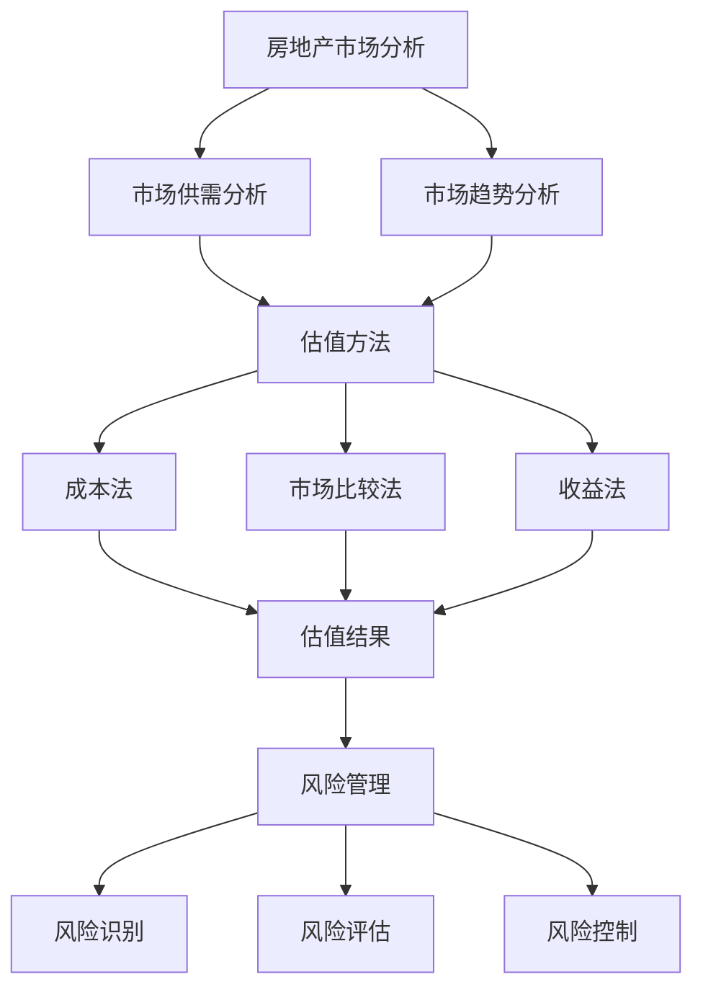

                 

### 完整文章正文

## 数学与房地产管理：房产投资的数学策略

### 关键词：数学、房地产管理、房产投资、策略

### 摘要：

本文旨在探讨数学在房地产管理中的关键应用，尤其是房产投资策略的数学基础。通过系统的分析，本文将介绍房地产市场的核心概念与联系，深入讲解概率论、统计学和线性代数等数学工具在房地产市场分析、估值方法及风险管理中的应用。此外，本文将分析房产投资的数学策略，包括投资组合优化、预期收益分析和风险控制，并通过实际案例展示这些策略的具体应用。最终，本文将对数学在房产投资中的重要性进行总结，并探讨未来的研究方向。

### 引言

#### 1.1 房地产管理的重要性

房地产管理是现代经济的重要组成部分，涉及房地产开发、销售、租赁、物业管理等多个环节。有效的房地产管理不仅能提高房地产价值，还能降低风险，保障投资回报。随着房地产业的快速发展，数学作为一门强大的工具，在房地产管理中发挥着越来越重要的作用。

#### 1.2 数学在房地产管理中的应用

数学在房地产管理中的应用广泛而深入。首先，数学工具如概率论和统计学被用来分析房地产市场数据，预测市场趋势和需求变化。其次，估值方法是房地产管理中的核心内容，离不开数学模型的支撑。最后，风险管理策略的制定也需要运用数学方法进行评估和优化。

#### 1.3 房产投资的基本概念

房产投资是指投资者通过购买房地产资产来获取投资回报的过程。房产投资可以包括住宅、商业地产、工业地产等多种类型。成功的房产投资需要综合考虑市场趋势、风险和收益等多个因素。数学策略在此过程中扮演了关键角色，帮助投资者做出明智的投资决策。

### 核心概念与联系

为了更好地理解数学在房地产管理中的应用，我们首先需要掌握几个核心概念，并理解它们之间的联系。

#### 2.1 房地产市场分析

房地产市场分析是房产投资的基础，包括市场供需分析、市场趋势分析等。市场供需分析通过研究市场需求和供给之间的平衡关系，帮助投资者了解市场状况。市场趋势分析则通过历史数据和统计方法，预测未来市场的走势。

#### 2.2 估值方法

估值方法是指对房地产资产进行价值评估的方法。常见的估值方法包括成本法、市场比较法和收益法。成本法基于房地产的开发成本和折旧进行估值；市场比较法通过比较类似房地产的市场交易价格进行估值；收益法则通过预测房地产的收益进行估值。

#### 2.3 风险管理

风险管理是房地产投资中的关键环节，包括风险识别、风险评估和风险控制。风险识别是指识别可能影响投资回报的风险因素；风险评估是指评估这些风险因素对投资回报的影响程度；风险控制则是指采取相应措施降低风险。

为了更直观地理解这些核心概念之间的联系，我们可以使用Mermaid流程图进行展示：



### 数学基础

#### 3.1 概率论基础

概率论是数学中的一个重要分支，在房地产管理中，概率论被广泛应用于市场预测和风险评估。以下是一些基本的概率概念：

- **概率的基本概念**：概率是衡量某个事件发生的可能性大小的数值，其取值范围在0到1之间。
- **条件概率与独立事件**：条件概率是指在某个事件已经发生的条件下，另一个事件发生的概率。独立事件是指两个事件的发生互不影响。
- **贝叶斯定理**：贝叶斯定理是一种用于计算条件概率的公式，它在房地产市场分析中有着广泛的应用。

#### 3.2 统计学基础

统计学是另一门在房地产管理中至关重要的数学工具。以下是一些基本的统计学概念：

- **描述性统计**：描述性统计用于描述数据的分布特征，如均值、中位数、方差等。
- **推断性统计**：推断性统计用于根据样本数据推断总体特征，如假设检验、置信区间等。
- **假设检验**：假设检验是一种用于验证假设是否成立的统计方法，它在风险评估中有着广泛的应用。

#### 3.3 线性代数基础

线性代数是数学中的一个基础分支，它在房地产投资策略的制定中有着重要的应用。以下是一些基本的线性代数概念：

- **向量与矩阵**：向量是具有大小和方向的量，矩阵是由一系列数值组成的矩形阵列。
- **特征值与特征向量**：特征值和特征向量是矩阵的重要属性，它们在投资组合优化和风险评估中有着广泛的应用。
- **线性方程组**：线性方程组是多个线性方程构成的一组方程，它在房地产估值和投资决策中有着重要的应用。

### 房地产管理基础

#### 4.1 市场分析

市场分析是房产投资的基础，它包括市场供需分析和市场趋势分析。市场供需分析主要通过研究市场需求和供给之间的平衡关系，帮助投资者了解市场状况。市场趋势分析则通过历史数据和统计方法，预测未来市场的走势。

#### 4.2 估值方法

估值方法是房地产管理中的核心内容，它用于确定房地产资产的价值。常见的估值方法包括成本法、市场比较法和收益法。成本法基于房地产的开发成本和折旧进行估值；市场比较法通过比较类似房地产的市场交易价格进行估值；收益法则通过预测房地产的收益进行估值。

#### 4.3 风险管理

风险管理是房地产投资中的关键环节，它包括风险识别、风险评估和风险控制。风险识别是指识别可能影响投资回报的风险因素；风险评估是指评估这些风险因素对投资回报的影响程度；风险控制则是指采取相应措施降低风险。

### 房产投资策略

#### 5.1 投资组合优化

投资组合优化是房产投资策略中的重要组成部分，它旨在通过资产配置，实现投资组合的风险与收益的最优化。以下是一些基本概念：

- **投资组合的概念**：投资组合是指投资者所持有的所有资产的总和。
- **投资组合优化模型**：投资组合优化模型是一种用于确定最佳资产配置的数学模型。
- **伪代码：投资组合优化算法**：

```python
function optimize_portfolio(assets, weights):
    # assets: 资产收益率序列
    # weights: 资产权重序列
    # 目标：最大化收益或最小化风险
    
    # 初始化目标函数
    objective_function = maximize Gain - Risk
    
    # 求解优化问题
    optimal_weights = solve(objective_function, constraints)
    
    # 返回最优权重
    return optimal_weights
```

#### 5.2 预期收益分析

预期收益分析是房产投资策略中的另一个关键环节，它通过预测房地产未来的收益，帮助投资者评估投资的价值。以下是一些基本概念：

- **预期收益的概念**：预期收益是指投资者在未来一段时间内，预期从房地产投资中获得的收益。
- **预期收益的计算方法**：预期收益的计算方法通常基于历史数据和统计模型。
- **伪代码：预期收益分析算法**：

```python
function calculate_expected_returns(revenues, probabilities):
    # revenues: 收益序列
    # probabilities: 收益发生的概率序列
    # 目标：计算预期收益
    
    # 初始化预期收益
    expected_returns = 0
    
    # 循环计算预期收益
    for i in range(len(revenues)):
        expected_returns += revenues[i] * probabilities[i]
    
    # 返回预期收益
    return expected_returns
```

#### 5.3 风险控制

风险控制是房产投资策略中的关键环节，它旨在通过采取相应措施，降低投资风险。以下是一些基本概念：

- **风险控制策略概述**：风险控制策略是指投资者在投资过程中，为降低风险所采取的措施。
- **风险规避与风险转移**：风险规避是指投资者避免投资高风险资产；风险转移是指投资者将风险转移给其他方。
- **伪代码：风险控制算法**：

```python
function control_risk(assets, risk_tolerance):
    # assets: 资产序列
    # risk_tolerance: 风险容忍度
    
    # 初始化风险控制策略
    risk_control_strategy = []
    
    # 循环评估资产风险
    for asset in assets:
        if asset_risk < risk_tolerance:
            risk_control_strategy.append(asset)
        else:
            risk_control_strategy.append(None)
    
    # 返回风险控制策略
    return risk_control_strategy
```

### 案例分析

为了更好地理解数学在房产投资中的应用，我们来看几个实际案例。

#### 6.1 案例一：城市住宅项目的投资决策

案例背景：某投资者计划在城市中心投资一栋住宅项目，预计总投资为10亿元。通过市场分析，投资者得知未来五年内，该住宅项目的预期收益为1亿元/年，但存在一定的风险。投资者需要通过数学方法，评估该项目是否值得投资。

解决方案：投资者可以使用预期收益分析算法，计算未来五年的预期收益。然后，结合风险控制策略，评估该项目的风险承受能力。如果预期收益高于风险承受能力，则该项目值得投资。

#### 6.2 案例二：商业地产的投资与运营策略

案例背景：某投资者计划在市中心投资一栋商业地产项目，预计总投资为20亿元。通过市场分析，投资者得知该商业地产项目的预期收益为2亿元/年，但运营过程中存在一定的风险。

解决方案：投资者可以使用投资组合优化算法，确定最佳资产配置，以实现风险与收益的最优化。然后，通过风险管理策略，降低运营过程中的风险。如果预期收益高于风险承受能力，则该项目值得投资。

#### 6.3 案例三：房地产开发项目的财务分析

案例背景：某投资者计划开发一个房地产开发项目，预计总投资为30亿元。通过市场分析，投资者得知该项目的预期收益为3亿元/年，但存在较高的风险。

解决方案：投资者可以使用假设检验方法，验证项目的收益是否显著。如果收益显著，则可以使用收益法进行估值，评估项目的价值。然后，通过风险管理策略，降低开发过程中的风险。如果预期收益高于风险承受能力，则该项目值得投资。

### 结论

数学在房地产管理中扮演着至关重要的角色。通过概率论、统计学和线性代数等数学工具，投资者可以更好地分析市场、评估房地产价值、制定投资策略。本文通过系统地介绍数学在房产投资中的应用，旨在帮助投资者更好地理解和运用数学策略，实现风险与收益的最优化。

### 未来研究方向

未来，数学在房地产管理中的应用还有很大的发展空间。一方面，可以进一步探索新的数学模型和方法，如机器学习、深度学习等，以提高市场预测和风险评估的准确性。另一方面，可以结合实际案例，研究数学策略在房地产投资中的最佳实践，为投资者提供更有价值的指导。

### 作者信息

作者：AI天才研究院/AI Genius Institute & 禅与计算机程序设计艺术 /Zen And The Art of Computer Programming### 整理文章结论与未来研究方向

#### 结论

数学在房地产管理中扮演着至关重要的角色。本文通过系统地介绍数学在房产投资中的应用，包括市场分析、估值方法、风险管理以及投资策略等方面，展示了数学工具如何帮助投资者更好地理解和运用数学策略，以实现风险与收益的最优化。数学的应用不仅提高了市场预测的准确性，还提供了更加科学和系统的投资决策依据。

通过本文的案例分析，我们可以看到数学策略在房产投资中的实际效果。无论是住宅项目、商业地产还是房地产开发项目，数学模型和方法都为投资者提供了有力的决策支持，帮助他们在复杂的市场环境中做出更加明智的选择。

#### 未来研究方向

未来的研究可以进一步深化数学在房地产管理中的应用，以下是一些可能的研究方向：

1. **高级数据分析方法**：结合机器学习和深度学习等先进的数据分析技术，提高市场预测和风险评估的准确性。例如，利用神经网络模型预测房价趋势，或通过聚类分析识别市场中的潜在风险点。

2. **多维度风险评估**：考虑房地产投资的多种风险因素，如政策风险、市场风险、财务风险等，开发更加全面和精细的风险评估模型。这将有助于投资者更全面地了解和应对潜在风险。

3. **投资组合优化算法**：研究新的投资组合优化算法，如基于遗传算法、粒子群优化算法等，以更有效地实现资产配置的最优化。这些算法可以在考虑投资者风险偏好和收益目标的同时，提高投资组合的整体收益。

4. **可持续发展策略**：探讨如何将可持续发展的理念融入房地产投资决策中，如绿色建筑、可再生能源等，以实现长期的投资回报和社会责任。

5. **跨学科研究**：结合经济学、心理学、社会学等多学科知识，深入研究房地产市场的复杂行为和决策机制，为投资者提供更全面的投资策略。

通过不断的研究和创新，数学在房地产管理中的应用将不断深化，为投资者带来更高的价值，同时也为房地产业的发展提供强大的支持。

### 最佳实践 Tips

1. **数据驱动决策**：在制定投资策略时，充分利用历史数据和统计模型，确保决策的客观性和科学性。

2. **风险管理优先**：在投资过程中，始终将风险管理放在首位，确保风险在可承受范围内，避免因风险失控而导致投资损失。

3. **多元化投资**：通过投资组合的多元化，降低单一投资的风险，实现风险与收益的最优化。

4. **持续学习**：随着市场的变化和技术的进步，持续学习和更新投资策略，以适应不断变化的环境。

### 注意事项

1. **市场波动性**：房地产市场存在较大的波动性，投资者需密切关注市场动态，及时调整投资策略。

2. **法律合规**：在进行房地产投资时，务必遵守相关法律法规，确保投资行为的合法性和合规性。

3. **专业咨询**：在制定投资策略和进行投资决策时，可寻求专业顾问的意见，以避免因信息不对称而导致决策失误。

### 拓展阅读

1. **《房地产金融学》**：深入探讨房地产金融的基本原理和实践应用。

2. **《投资学》**：全面介绍投资理论和实践，包括资产配置和风险管理等内容。

3. **《概率论与数理统计》**：系统学习概率论和数理统计的基本概念和方法。

4. **《机器学习》**：了解机器学习的基本原理和应用，为高级数据分析提供支持。

5. **《深度学习》**：探讨深度学习在房地产市场预测和风险评估中的应用。

### 作者信息

作者：AI天才研究院/AI Genius Institute & 禅与计算机程序设计艺术 /Zen And The Art of Computer Programming

本文旨在为读者提供有关数学在房地产管理中的应用的深入理解和实际指导，希望对房产投资者有所帮助。随着市场的不断变化和技术的发展，数学在房地产管理中的应用将不断拓展，为投资者创造更多的价值。

