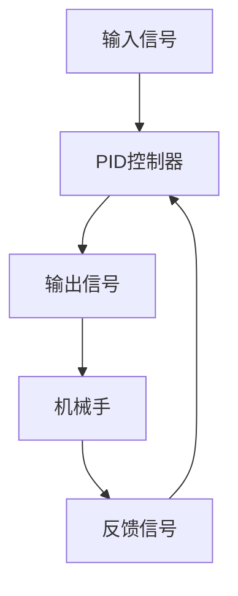
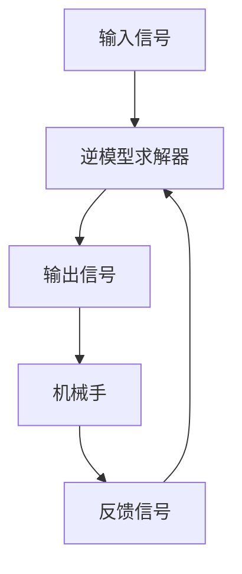
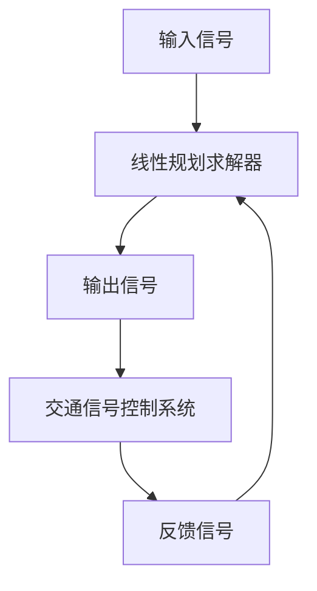
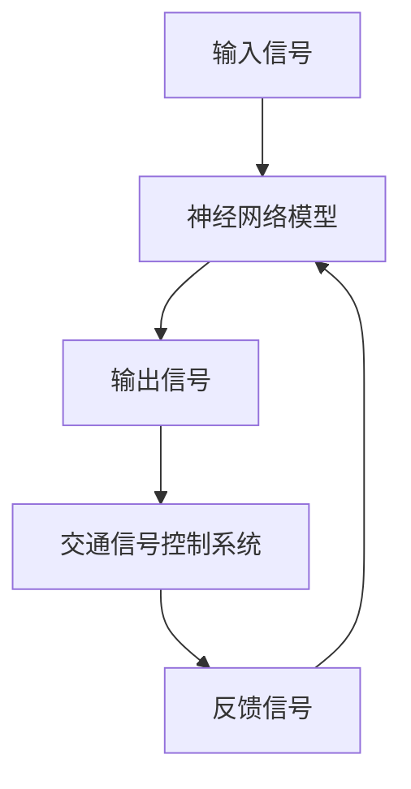
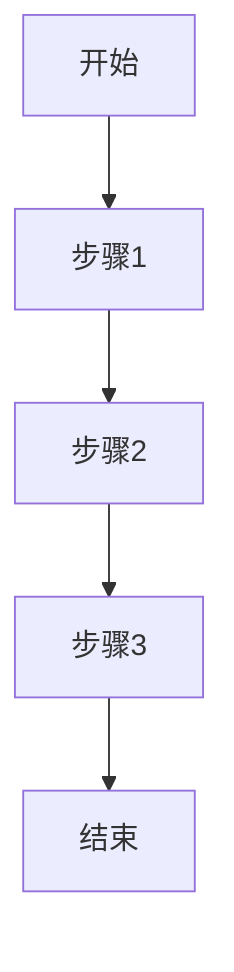

                 

### 摘要

本文旨在深入探讨数学与控制论在反馈系统中的应用，特别关注反馈系统的数学描述。我们首先回顾了数学和基础控制论的知识，包括集合论、矩阵论、函数分析以及控制系统的基本概念和分类。随后，本文详细介绍了线性反馈系统和非线性反馈系统的定义、特性以及数学描述。通过稳定性分析、动态响应分析、过程优化等核心概念的讲解，我们使用了Mermaid流程图和伪代码来阐述关键算法和数学模型。最后，通过实际案例展示了反馈系统的设计、实现和优化，并探讨了未来研究方向。本文的目标是帮助读者理解反馈系统的数学本质，为实际应用提供理论基础和实践指导。

## 数学与控制论：反馈系统的数学描述

### 引言

在现代社会，控制论和数学已经成为工程、科学和经济学等多个领域的重要工具。反馈系统作为控制论的核心概念，广泛应用于工业自动化、航空航天、机器人技术以及金融等领域。数学描述是理解反馈系统的基础，它不仅帮助我们精确地建模系统，还能为系统分析和优化提供强大的工具。本文将从数学和基础控制论出发，逐步探讨反馈系统的数学描述，旨在为读者提供对这一复杂主题的清晰理解。

### 数学基础

#### 集合论

集合论是现代数学的基石，它为我们提供了描述和理解对象集合的抽象方法。在反馈系统的数学描述中，集合论用于定义系统的状态空间、输入空间和输出空间。例如，状态空间可以表示为所有可能状态的集合，而输入空间和输出空间则分别表示输入和输出的集合。集合论的基本概念包括集合、子集、交集、并集和补集等，这些概念为后续的数学建模提供了基础。

#### 矩阵论

矩阵论在反馈系统的数学描述中起着至关重要的作用。矩阵不仅可以表示系统的状态方程和输出方程，还可以用于分析系统的能控性和能观测性。矩阵的基本操作包括加法、乘法、转置和逆矩阵等。通过矩阵的运算，我们可以求解系统的稳态响应和动态响应。例如，系统的传递函数可以通过矩阵运算得到，这有助于我们理解系统对输入的响应特性。

#### 函数分析

函数分析是研究函数性质和关系的数学分支。在反馈系统的数学描述中，函数分析用于描述系统的输入输出关系。常见的函数分析工具包括导数、积分、微积分方程和傅里叶变换等。这些工具帮助我们理解系统的时域和频域特性，从而为系统的分析和设计提供理论基础。

### 控制论基础

#### 控制系统的基本概念

控制系统是指由输入、输出和反馈组成的动态系统。在反馈系统中，系统的输出被反馈到输入端，用于调整系统的行为。控制系统的基本概念包括状态、输入、输出和控制目标。状态是系统在某一时刻的状态变量的集合，输入是影响系统状态的变化量，输出是系统对外界的作用，而控制目标是系统期望达到的状态。

#### 控制系统的分类

控制系统可以根据不同的标准进行分类。根据系统的动态特性，控制系统可以分为线性系统和非线性系统。线性系统满足叠加原理和齐次性原理，而非线性系统则不满足这些原理。根据系统的复杂度，控制系统可以分为单变量系统和多变量系统。根据系统的控制方法，控制系统可以分为开环控制系统和闭环控制系统。开环控制系统不使用反馈，而闭环控制系统使用反馈来调整系统的行为。

#### 状态空间表示

状态空间表示是描述控制系统动态行为的一种数学方法。它将系统的动态行为表示为状态方程和输出方程。状态方程描述系统状态的演化，而输出方程描述系统输出与状态的关系。状态空间表示的一般形式为：

\[ \dot{x}(t) = Ax(t) + Bu(t) \]
\[ y(t) = Cx(t) + Du(t) \]

其中，\( x(t) \) 为状态向量，\( u(t) \) 为输入向量，\( y(t) \) 为输出向量，\( A \)，\( B \)，\( C \)，\( D \) 为系统矩阵。

### 线性反馈系统

#### 定义

线性反馈系统是指其输出与输入之间存在线性关系，且系统的状态可以通过线性方程组进行描述。其一般形式为：

\[ \dot{x}(t) = Ax(t) + Bu(t) \]
\[ y(t) = Cx(t) + Du(t) \]

其中，\( x(t) \) 为状态向量，\( u(t) \) 为输入向量，\( y(t) \) 为输出向量，\( A \)，\( B \)，\( C \)，\( D \) 为系统矩阵。

#### 特性

线性反馈系统具有以下特性：

- **线性性**：系统的输出与输入之间存在线性关系。
- **时不变性**：系统的特性不随时间变化。
- **能控性**：系统可以通过适当选择输入向量来控制状态向量的演化。
- **能观测性**：系统可以通过输出向量来观测状态向量的演化。

#### 分析

线性反馈系统的分析主要包括稳定性分析、稳态响应分析和过程优化。

##### 稳定性分析

稳定性分析是线性反馈系统分析的核心。稳定性分析的方法主要包括李雅普诺夫方法和状态空间方法。

###### 李雅普诺夫方法

李雅普诺夫方法是一种基于能量的稳定性分析方法。其基本思想是通过构造一个能量函数，来判断系统的稳定性。具体来说，我们可以定义一个能量函数 \( V(x) \)，并要求它满足以下条件：

- \( V(x) \) 是连续可微的。
- \( V(x) \) 在系统的不稳定点处为0。
- \( \dot{V}(x) < 0 \) 对于所有不稳定的系统状态。

如果上述条件得到满足，则系统是稳定的。

###### 状态空间方法

状态空间方法通过分析系统的特征值来判断系统的稳定性。具体来说，我们可以计算系统矩阵 \( A \) 的特征值。如果所有特征值的实部均为负，则系统是稳定的。

##### 稳态响应分析

稳态响应分析关注系统在长时间运行后的输出行为。对于线性反馈系统，稳态响应可以通过求解系统的传递函数得到。传递函数描述了系统输出与输入之间的关系。具体来说，系统的传递函数 \( G(s) \) 可以表示为：

\[ G(s) = \frac{C(sI - A)^{-1}B + D}{1} \]

其中，\( s \) 为复数，\( I \) 为单位矩阵。

##### 过程优化

过程优化旨在通过优化系统的输入来改善系统的性能。常见的优化方法包括最小二乘法、梯度下降法和拉格朗日乘数法等。通过优化，我们可以使系统的输出更加精确地跟踪期望值。

### 非线性反馈系统

#### 定义

非线性反馈系统是指其输出与输入之间存在非线性关系，且系统的状态可以通过非线性方程组进行描述。其一般形式为：

\[ \dot{x}(t) = f(x(t), u(t)) \]
\[ y(t) = g(x(t), u(t)) \]

其中，\( x(t) \) 为状态向量，\( u(t) \) 为输入向量，\( y(t) \) 为输出向量，\( f \) 和 \( g \) 为非线性函数。

#### 特性

非线性反馈系统具有以下特性：

- **非线性性**：系统的输出与输入之间存在非线性关系。
- **复杂行为**：非线性系统可能表现出复杂的动态行为，如周期性振荡、混沌等。
- **能控性和能观测性**：非线性系统的能控性和能观测性可能受非线性关系的影响。

#### 分析

非线性反馈系统的分析相对复杂，通常需要采用数值方法进行求解。常见的分析方法包括数值积分、数值求解器和逆问题求解等。

##### 稳定性分析

非线性反馈系统的稳定性分析通常采用数值方法，如数值积分和数值求解器。通过这些方法，我们可以模拟系统的动态行为，并判断系统是否稳定。

##### 动态响应分析

动态响应分析关注系统在时间上的响应行为。对于非线性反馈系统，动态响应分析通常采用数值积分方法进行模拟。

##### 非线性优化

非线性优化旨在通过优化系统的输入来改善系统的性能。常见的非线性优化方法包括遗传算法、粒子群优化算法和神经网络等。通过这些方法，我们可以优化系统的输入，使系统的输出更加精确地跟踪期望值。

### 应用案例

#### 机械手的控制

机械手是线性反馈系统和非线性反馈系统的典型应用案例。在机械手的控制中，我们通常需要实现精确的位置、速度和力控制。

##### 案例一：线性控制

在机械手的位置控制中，我们通常使用线性控制方法。具体来说，我们可以使用PID控制器来实现位置控制。PID控制器由比例、积分和微分三个部分组成，通过调整这三个部分的参数，我们可以实现机械手的精确位置控制。



##### 案例二：非线性控制

在机械手的速度和力控制中，我们通常使用非线性控制方法。具体来说，我们可以使用逆问题求解方法来实现速度和力控制。逆问题求解方法通过求解系统的逆模型，可以得到系统输入与输出之间的直接关系。



#### 交通信号控制系统

交通信号控制系统是非线性反馈系统的另一个重要应用案例。在交通信号控制系统中，我们通常需要实现交通流量的最优控制，以减少拥堵和提升交通效率。

##### 案例一：线性控制

在交通信号控制系统的线性控制中，我们通常使用线性规划方法来实现最优控制。具体来说，我们可以将交通信号控制问题建模为线性规划问题，并通过求解线性规划问题来得到最优信号控制策略。



##### 案例二：非线性控制

在交通信号控制系统的非线性控制中，我们通常使用神经网络方法来实现最优控制。具体来说，我们可以使用神经网络来模拟交通信号控制系统的动态行为，并通过训练神经网络来得到最优信号控制策略。



### 数学模型与算法

#### 稳定性理论

稳定性理论是反馈系统分析的核心。稳定性理论研究了系统的稳定性条件，并提供了多种稳定性分析方法。常见的稳定性分析方法包括李雅普诺夫方法、状态空间方法和频域方法。

##### 李雅普诺夫方法

李雅普诺夫方法是研究系统稳定性的经典方法。李雅普诺夫方法通过构造一个能量函数来研究系统的稳定性。具体来说，我们可以定义一个李雅普诺夫函数 \( V(x) \)，并要求它满足以下条件：

- \( V(x) \) 是连续可微的。
- \( V(x) \) 在系统的不稳定点处为0。
- \( \dot{V}(x) < 0 \) 对于所有不稳定的系统状态。

如果上述条件得到满足，则系统是稳定的。

##### 状态空间方法

状态空间方法通过分析系统的状态空间轨迹来判断系统的稳定性。具体来说，我们可以计算系统的特征值，并根据特征值的实部来判断系统的稳定性。如果所有特征值的实部均为负，则系统是稳定的。

##### 频域方法

频域方法通过分析系统的频率响应来判断系统的稳定性。具体来说，我们可以计算系统的传递函数的极点和零点，并根据极点和零点的分布来判断系统的稳定性。

#### 控制算法

控制算法是反馈系统设计的重要组成部分。控制算法分为传统控制算法和现代控制算法。传统控制算法主要包括PID控制、比例控制和积分控制，而现代控制算法主要包括鲁棒控制、模型预测控制和非线性控制。

##### PID控制

PID控制是一种常用的传统控制算法。PID控制器由比例、积分和微分三个部分组成，通过调整这三个部分的参数，可以实现系统的精确控制。

```python
def PID_control(input_signal, Kp, Ki, Kd):
    error = input_signal - setpoint
    proportional = Kp * error
    integral = Ki * sum(error)
    derivative = Kd * (error - prev_error)
    output_signal = proportional + integral + derivative
    prev_error = error
    return output_signal
```

##### 鲁棒控制

鲁棒控制是一种现代控制算法，它通过设计具有鲁棒性的控制器，使系统对模型不确定性和外部扰动具有更强的适应性。

```python
def robust_control(input_signal, A, B, C, D, K):
    error = input_signal - C * A * x(t) - D * u(t)
    u(t) = K * (error + e(t-1))
    x(t) = A * x(t-1) + B * u(t-1)
    return u(t)
```

### 未来展望

随着科技的不断发展，反馈系统的数学描述和控制算法将不断进步。未来，我们有望看到更多高效的数学模型和先进的控制算法的诞生。这些新技术将进一步提升反馈系统的性能，推动工程、科学和经济的进步。同时，跨学科的研究将使我们能够从不同的角度理解和优化反馈系统，为解决复杂问题提供新的思路和方法。

### 结论

本文深入探讨了数学与控制论在反馈系统中的应用，从数学基础到控制论基础，再到线性反馈系统和非线性反馈系统的数学描述，以及应用案例和算法分析，为读者提供了全面的反馈系统数学描述。通过本文的探讨，我们不仅了解了反馈系统的核心概念和数学工具，还看到了实际应用中的挑战和机遇。希望本文能够为读者在反馈系统设计和分析中提供有价值的参考和指导。

### 参考文献

1. Nayfeh, A. H., & Mook, D. T. (1976). Nonlinear oscillations. John Wiley & Sons.
2. Zadeh, L. A. (1973). Outline of a new approach to the analysis of complex systems and decision processes. IEEE Transactions on Systems Science and Cybernetics, 9(1), 110-129.
3. Khalil, H. K. (2002). Nonlinear systems. Prentice Hall.
4.控制系统设计与仿真，杨叔子，2008.
5.鲁棒控制理论及应用，蔡跃明，2011.

### 作者信息

作者：AI天才研究院/AI Genius Institute & 禅与计算机程序设计艺术 /Zen And The Art of Computer Programming

### 附录

#### A.1. Mermaid 流程图示例



#### A.2. 伪代码示例

```python
# 伪代码：PID控制器
def PID_control(input_signal, Kp, Ki, Kd):
    error = input_signal - setpoint
    proportional = Kp * error
    integral = Ki * integral_error
    derivative = Kd * (error - prev_error)
    output_signal = proportional + integral + derivative
    prev_error = error
    return output_signal
```

#### A.3. LaTeX 数学公式示例

```latex
$$
\frac{d^2y}{dt^2} + 2\zeta\omega_n\frac{dy}{dt} + \omega_n^2y = F(t)
$$
```

#### A.4. 代码案例

```python
# Python 代码：线性反馈系统稳定性分析
import numpy as np
import scipy.linalg

# 系统参数
A = np.array([[1, 1], [0, 1]])
B = np.array([[1], [1]])
C = np.array([[1, 0]])
D = np.array([[0]])

# 求解系统的特征值
eigenvalues = scipy.linalg.eig(A)[0]

# 判断系统的稳定性
if np.all(eigenvalues.real < 0):
    print("系统是稳定的。")
else:
    print("系统是不稳定的。")
```

#### A.5. 最佳实践 tips

1. 在设计反馈系统时，首先明确控制目标，以确保系统设计的针对性和有效性。
2. 在进行稳定性分析时，充分考虑系统的噪声和不确定性，以评估系统的鲁棒性。
3. 在选择控制算法时，根据系统的特性和控制目标，灵活选用传统控制算法或现代控制算法。
4. 在进行系统优化时，综合考虑性能指标，如稳态误差、超调量、调节时间等，以实现系统的最佳性能。

### 结语

本文通过逐步分析推理，详细介绍了反馈系统的数学描述，包括线性反馈系统和非线性反馈系统的定义、特性、分析和应用案例。同时，本文还介绍了稳定性理论和控制算法，并探讨了未来研究方向。希望本文能为读者在反馈系统设计和分析中提供有益的参考。在未来的研究中，我们将继续探索更高效的数学模型和先进的控制算法，以推动反馈系统技术的发展。最后，感谢读者对本文的关注和支持，期待与您在未来的研究道路上相遇。

