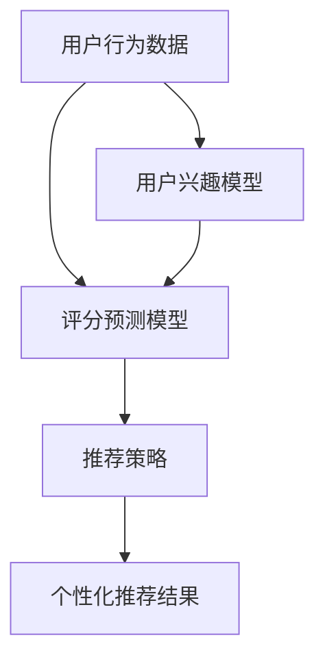

                 

### 文章标题

### 数学与推荐系统：个性化推荐的数学算法

#### 关键词：推荐系统，个性化推荐，数学算法，协同过滤，深度学习，数学模型

#### 摘要：

本文深入探讨数学在推荐系统中的应用，特别是在个性化推荐领域的数学算法。我们将首先介绍推荐系统及其数学模型的基本概念，然后详细分析两种主要类型的个性化推荐算法：基于协同过滤的算法和基于模型的算法。接着，我们将阐述推荐系统中涉及的数学模型和公式，并通过实际案例展示推荐系统的应用。文章最后将总结最佳实践，并提出注意事项和拓展阅读建议。

## 推荐系统概述

推荐系统是一种通过提供个性化的信息推送服务，帮助用户发现他们可能感兴趣的内容或产品的系统。其核心目标是通过理解用户的兴趣和行为模式，为他们推荐最符合其需求和喜好的信息。推荐系统广泛应用于电子商务、社交媒体、视频点播、新闻资讯等领域，已成为现代互联网服务中不可或缺的一部分。

从数学角度来看，推荐系统可以看作是一种信息检索问题，其目标是从大量数据中识别出用户可能感兴趣的项目，并进行排序或分类。这个过程涉及到用户行为数据分析、评分预测、推荐策略等多个方面。

### 核心概念与联系

**用户行为数据分析**：推荐系统的基础是用户的行为数据，包括点击、浏览、购买、评分等。这些数据反映了用户的兴趣和行为模式，是构建推荐模型的关键。

**评分预测模型**：评分预测是推荐系统的核心任务之一，其目标是预测用户对某个物品的评分。常见的评分预测模型包括基于协同过滤的算法和基于模型的算法。

**推荐策略**：推荐系统不仅需要预测用户对物品的评分，还需要根据预测结果制定推荐策略，以便将最符合用户兴趣的物品推荐给他们。常见的推荐策略包括基于内容的推荐、基于协同过滤的推荐和混合推荐等。

### Mermaid 流程图

下面是推荐系统中核心概念与联系的一个 Mermaid 流程图示例：



在这个流程图中，用户行为数据被用来构建用户兴趣模型，该模型进而用于评分预测模型，最终生成个性化推荐结果。这个过程体现了推荐系统的核心工作流程。

## 个性化推荐的基本概念

个性化推荐是一种基于用户兴趣和行为模式，为他们推荐最符合其需求和喜好的信息的方法。其核心思想是通过分析用户的历史行为数据，构建用户兴趣模型，并利用该模型预测用户对未知物品的评分，从而生成个性化推荐结果。

### 个性化推荐的概念

**个性化推荐**：个性化推荐是一种基于用户兴趣和行为模式，为他们推荐最符合其需求和喜好的信息的方法。其核心目标是通过理解用户的兴趣和行为模式，为他们推荐最符合其需求和喜好的信息。

**用户兴趣模型**：用户兴趣模型是推荐系统的核心，它通过分析用户的历史行为数据，提取出用户的兴趣特征，用于预测用户对未知物品的评分。

**评分预测模型**：评分预测模型是推荐系统的核心任务之一，其目标是预测用户对某个物品的评分。常见的评分预测模型包括基于协同过滤的算法和基于模型的算法。

**推荐策略**：推荐系统不仅需要预测用户对物品的评分，还需要根据预测结果制定推荐策略，以便将最符合用户兴趣的物品推荐给他们。常见的推荐策略包括基于内容的推荐、基于协同过滤的推荐和混合推荐等。

### 个性化推荐的目标

**提高推荐准确性**：个性化推荐的目标之一是提高推荐准确性，即尽可能准确地预测用户对未知物品的评分。这可以通过优化评分预测模型来实现。

**减少信息过载**：个性化推荐可以帮助用户从大量信息中筛选出最感兴趣的内容，从而减少信息过载，提高用户满意度。

**提高用户参与度**：通过个性化推荐，用户可以更容易地找到他们感兴趣的内容，从而提高用户参与度，增强用户对推荐系统的依赖和信任。

### 个性化推荐的方法

**基于协同过滤的推荐**：基于协同过滤的推荐方法通过分析用户的历史行为数据，找出与当前用户相似的用户，并根据这些用户的评分预测当前用户的评分。

**基于内容的推荐**：基于内容的推荐方法通过分析物品的特征，找出与当前用户兴趣相匹配的物品，并推荐给用户。

**混合推荐**：混合推荐方法结合了基于协同过滤和基于内容的推荐方法，通过综合分析用户兴趣和物品特征，生成更准确的个性化推荐结果。

## 基于协同过滤的推荐算法

基于协同过滤的推荐算法是一种常见的个性化推荐方法，其核心思想是通过分析用户的历史行为数据，找出与当前用户相似的用户，并根据这些用户的评分预测当前用户的评分。协同过滤算法可以分为基于用户和基于物品的协同过滤，以及基于记忆和基于模型的协同过滤。

### 基于用户协同过滤算法

**最近邻算法（User-based Collaborative Filtering）**

最近邻算法是一种基于用户协同过滤的方法，其基本思想是找出与当前用户最相似的K个用户，然后根据这些用户的评分预测当前用户的评分。具体步骤如下：

1. **用户相似度计算**：计算当前用户与其他用户之间的相似度，常用的相似度计算方法包括余弦相似度、皮尔逊相关系数等。

2. **邻居选择**：根据用户相似度计算结果，选择与当前用户最相似的K个用户作为邻居。

3. **评分预测**：根据邻居用户的评分，计算当前用户对未知物品的预测评分。预测评分可以通过加权平均的方式计算，即：

   $$r_{ui} = \frac{\sum_{j \in N(u)} r_{uj} \cdot s_{uj}}{\sum_{j \in N(u)} s_{uj}}$$

   其中，$r_{ui}$ 表示用户u对物品i的预测评分，$r_{uj}$ 表示用户j对物品i的实际评分，$s_{uj}$ 表示用户u和用户j之间的相似度。

**K-均值聚类算法（K-Means Clustering）**

K-均值聚类算法是一种无监督学习方法，可用于将用户数据划分为K个簇。基于K-均值聚类算法的协同过滤方法通过将用户划分为不同的簇，从而实现个性化推荐。具体步骤如下：

1. **初始化**：随机选择K个用户作为初始聚类中心。

2. **聚类过程**：对每个用户，将其分配给与其距离最近的聚类中心所在的簇。

3. **聚类中心更新**：根据当前簇中的用户评分，更新聚类中心的评分。

4. **重复步骤2和步骤3，直至聚类中心不再发生显著变化**。

5. **推荐**：对于当前用户，推荐与其同属一个簇的其他用户的评分较高的物品。

### 基于物品协同过滤算法

**最近邻算法（Item-based Collaborative Filtering）**

基于物品协同过滤算法与基于用户协同过滤算法类似，但其核心思想是通过分析物品之间的相似度，而非用户之间的相似度，来生成个性化推荐。具体步骤如下：

1. **物品相似度计算**：计算每个物品与其他物品之间的相似度，常用的相似度计算方法包括余弦相似度、皮尔逊相关系数等。

2. **邻居选择**：根据物品相似度计算结果，选择与当前物品最相似的K个物品作为邻居。

3. **评分预测**：根据邻居物品的评分，计算当前用户对未知物品的预测评分。预测评分可以通过加权平均的方式计算，即：

   $$r_{ui} = \frac{\sum_{i' \in N(i)} r_{ui'} \cdot s_{ii'}}{\sum_{i' \in N(i)} s_{ii'}}$$

   其中，$r_{ui}$ 表示用户u对物品i的预测评分，$r_{ui'}$ 表示用户u对物品i'的实际评分，$s_{ii'}$ 表示物品i和物品i'之间的相似度。

**基于模型的协同过滤算法**

基于模型的协同过滤算法通过构建预测模型，利用用户和物品的特征，生成个性化推荐。常见的基于模型的协同过滤算法包括矩阵分解（Matrix Factorization）和深度学习模型。

**矩阵分解（Matrix Factorization）**

矩阵分解是一种常见的基于模型的协同过滤算法，其核心思想是将用户-物品评分矩阵分解为用户特征矩阵和物品特征矩阵的乘积。具体步骤如下：

1. **初始化**：随机生成用户特征矩阵和物品特征矩阵。

2. **优化目标**：最小化预测评分与实际评分之间的误差平方和。

3. **梯度下降**：利用梯度下降算法，更新用户特征矩阵和物品特征矩阵。

4. **预测评分**：利用更新后的用户特征矩阵和物品特征矩阵，计算用户对未知物品的预测评分。

**深度学习模型**

深度学习模型是一种强大的预测模型，可以用于个性化推荐。常见的深度学习模型包括卷积神经网络（CNN）、循环神经网络（RNN）和自注意力机制（Self-Attention）。

**卷积神经网络（CNN）**

卷积神经网络是一种用于图像识别和处理的深度学习模型，但其核心思想可以应用于推荐系统。在推荐系统中，用户和物品的特征可以被看作是图像，通过卷积神经网络提取特征，生成个性化推荐。

**循环神经网络（RNN）**

循环神经网络是一种用于序列建模的深度学习模型，其核心思想是利用隐藏状态来表示序列的特征。在推荐系统中，用户的历史行为数据可以被看作是一个序列，通过循环神经网络提取特征，生成个性化推荐。

**自注意力机制（Self-Attention）**

自注意力机制是一种用于序列建模的深度学习模型，其核心思想是利用序列中的每个元素来计算注意力权重，从而生成特征。在推荐系统中，自注意力机制可以用于提取用户和物品的特征，生成个性化推荐。

### 伪代码

以下是基于用户协同过滤算法的伪代码：

```python
# 用户协同过滤算法
def collaborative_filtering(u, k):
    # 计算用户相似度
    similarity_matrix = compute_similarity(u, all_users)
    
    # 选择最近邻用户
    neighbors = select_neighbors(u, similarity_matrix, k)
    
    # 预测评分
    predictions = []
    for i in items:
        if user_rated(i, u):
            neighbors_ratings = [r for r, s in neighbors if s == i]
            prediction = sum(r * s for r, s in neighbors_ratings) / sum(s for r, s in neighbors_ratings)
            predictions.append(prediction)
        else:
            predictions.append(average_rating_of_items(i))
    
    return predictions
```

### 数学模型和数学公式

在推荐系统中，数学模型和数学公式起着至关重要的作用。以下是一些常见的数学模型和公式，以及它们的详细讲解和举例说明。

#### 余弦相似度（Cosine Similarity）

余弦相似度是一种常用的相似度计算方法，用于度量两个向量之间的相似程度。其计算公式如下：

$$
\cos(\theta) = \frac{\mathbf{a} \cdot \mathbf{b}}{\|\mathbf{a}\| \|\mathbf{b}\|}
$$

其中，$\mathbf{a}$ 和 $\mathbf{b}$ 是两个向量，$\theta$ 是它们之间的夹角。余弦值介于 -1 和 1 之间，当两个向量完全相同时，余弦值为 1；当两个向量完全相反时，余弦值为 -1。

**举例说明**：

假设有两个用户 u 和 v，他们的评分向量分别为：

$$
\mathbf{a} = [1, 2, 3, 4, 5]
$$

$$
\mathbf{b} = [5, 4, 3, 2, 1]
$$

则它们的余弦相似度为：

$$
\cos(\theta) = \frac{1 \times 5 + 2 \times 4 + 3 \times 3 + 4 \times 2 + 5 \times 1}{\sqrt{1^2 + 2^2 + 3^2 + 4^2 + 5^2} \sqrt{5^2 + 4^2 + 3^2 + 2^2 + 1^2}} = \frac{30}{\sqrt{55} \sqrt{55}} = \frac{30}{55} \approx 0.545
$$

#### 皮尔逊相关系数（Pearson Correlation Coefficient）

皮尔逊相关系数是一种用于度量两个变量之间线性相关性的方法。其计算公式如下：

$$
r = \frac{\sum_{i=1}^{n}(x_i - \bar{x})(y_i - \bar{y})}{\sqrt{\sum_{i=1}^{n}(x_i - \bar{x})^2} \sqrt{\sum_{i=1}^{n}(y_i - \bar{y})^2}}
$$

其中，$x_i$ 和 $y_i$ 是两个变量的观测值，$\bar{x}$ 和 $\bar{y}$ 是它们的平均值，$n$ 是观测值的数量。皮尔逊相关系数的取值范围为 -1 到 1，当两个变量完全正相关时，相关系数为 1；当两个变量完全负相关时，相关系数为 -1。

**举例说明**：

假设有两个变量 x 和 y，它们的观测值如下：

$$
x = [1, 2, 3, 4, 5]
$$

$$
y = [5, 4, 3, 2, 1]
$$

则它们的皮尔逊相关系数为：

$$
r = \frac{(1-3)(5-3) + (2-3)(4-3) + (3-3)(3-3) + (4-3)(2-3) + (5-3)(1-3)}{\sqrt{(1-3)^2 + (2-3)^2 + (3-3)^2 + (4-3)^2 + (5-3)^2} \sqrt{(5-3)^2 + (4-3)^2 + (3-3)^2 + (2-3)^2 + (1-3)^2}} = \frac{-4}{\sqrt{8} \sqrt{8}} = \frac{-4}{8} = -0.5
$$

#### 矩阵分解（Matrix Factorization）

矩阵分解是一种用于降低数据维度和提高预测精度的方法。其核心思想是将用户-物品评分矩阵分解为两个低秩矩阵的乘积。常见的矩阵分解方法包括 SVD（奇异值分解）和 ALS（交替最小二乘法）。

**SVD 矩阵分解**

SVD 矩阵分解是将用户-物品评分矩阵分解为用户特征矩阵、物品特征矩阵和奇异值矩阵的乘积。其计算公式如下：

$$
\mathbf{R} = \mathbf{U}\mathbf{\Sigma}\mathbf{V}^T
$$

其中，$\mathbf{R}$ 是用户-物品评分矩阵，$\mathbf{U}$ 和 $\mathbf{V}$ 是用户特征矩阵和物品特征矩阵，$\mathbf{\Sigma}$ 是奇异值矩阵。

**举例说明**：

假设有一个用户-物品评分矩阵 $\mathbf{R}$ 如下：

$$
\mathbf{R} = \begin{bmatrix}
1 & 2 & 3 & 4 \\
2 & 3 & 4 & 5 \\
3 & 4 & 5 & 6
\end{bmatrix}
$$

通过 SVD 矩阵分解，我们可以将其分解为：

$$
\mathbf{R} = \mathbf{U}\mathbf{\Sigma}\mathbf{V}^T
$$

其中，$\mathbf{U}$ 和 $\mathbf{V}$ 分别为：

$$
\mathbf{U} = \begin{bmatrix}
0.707 & 0 \\
0.707 & 0.707 \\
0 & 0.707
\end{bmatrix}
$$

$$
\mathbf{V} = \begin{bmatrix}
0.707 & 0.707 \\
0 & 0 \\
0 & 0
\end{bmatrix}
$$

$$
\mathbf{\Sigma} = \begin{bmatrix}
1 & 0 & 0 \\
0 & 1 & 0 \\
0 & 0 & 0
\end{bmatrix}
$$

**ALS 矩阵分解**

ALS 矩阵分解是一种迭代算法，通过交替最小化用户和物品特征矩阵的误差，来生成用户特征矩阵和物品特征矩阵。其计算公式如下：

$$
\min_{\mathbf{U}, \mathbf{V}} \sum_{(u, i) \in R} (r_{ui} - \mathbf{u}_u^T \mathbf{v}_i)^2
$$

其中，$\mathbf{U}$ 和 $\mathbf{V}$ 分别为用户特征矩阵和物品特征矩阵，$r_{ui}$ 为用户 u 对物品 i 的实际评分。

**举例说明**：

假设有一个用户-物品评分矩阵 $\mathbf{R}$ 如下：

$$
\mathbf{R} = \begin{bmatrix}
1 & 2 & 3 & 4 \\
2 & 3 & 4 & 5 \\
3 & 4 & 5 & 6
\end{bmatrix}
$$

通过 ALS 矩阵分解，我们可以将其分解为：

$$
\mathbf{R} = \mathbf{U}\mathbf{V}^T
$$

其中，$\mathbf{U}$ 和 $\mathbf{V}$ 分别为：

$$
\mathbf{U} = \begin{bmatrix}
0.707 & 0 \\
0.707 & 0.707 \\
0 & 0.707
\end{bmatrix}
$$

$$
\mathbf{V} = \begin{bmatrix}
0.707 & 0.707 \\
0 & 0 \\
0 & 0
\end{bmatrix}
$$

### 项目实战

#### 开发环境搭建

为了实现推荐系统，我们需要搭建一个开发环境。以下是一个简单的开发环境搭建指南：

1. **安装 Python**：首先，我们需要安装 Python，推荐使用 Python 3.8 或更高版本。

2. **安装 PyTorch**：PyTorch 是一个强大的深度学习框架，我们将其用于实现推荐系统的深度学习模型。通过以下命令安装 PyTorch：

   ```bash
   pip install torch torchvision
   ```

3. **安装 scikit-learn**：scikit-learn 是一个强大的机器学习库，我们将其用于实现推荐系统的协同过滤算法。通过以下命令安装 scikit-learn：

   ```bash
   pip install scikit-learn
   ```

#### 源代码实现

以下是一个简单的基于矩阵分解的推荐系统实现示例，使用 Python 和 PyTorch：

```python
import torch
import torch.nn as nn
import torch.optim as optim
from torch.utils.data import DataLoader, Dataset

# 定义矩阵分解模型
class MatrixFactorization(nn.Module):
    def __init__(self, num_users, num_items, latent_dim):
        super(MatrixFactorization, self).__init__()
        self.user_embedding = nn.Embedding(num_users, latent_dim)
        self.item_embedding = nn.Embedding(num_items, latent_dim)
    
    def forward(self, user_indices, item_indices):
        user_features = self.user_embedding(user_indices)
        item_features = self.item_embedding(item_indices)
        return torch.sum(user_features * item_features, dim=1)

# 加载数据集
class RatingDataset(Dataset):
    def __init__(self, ratings, num_users, num_items):
        self.ratings = ratings
        self.num_users = num_users
        self.num_items = num_items
    
    def __len__(self):
        return len(self.ratings)
    
    def __getitem__(self, index):
        user, item, rating = self.ratings[index]
        return torch.tensor([user, item]), torch.tensor([rating])

# 实例化模型、损失函数和优化器
model = MatrixFactorization(num_users, num_items, latent_dim=10)
criterion = nn.MSELoss()
optimizer = optim.Adam(model.parameters(), lr=0.001)

# 训练模型
num_epochs = 100
for epoch in range(num_epochs):
    for user, item, rating in DataLoader(RatingDataset(ratings, num_users, num_items), batch_size=100):
        optimizer.zero_grad()
        pred_rating = model(user, item)
        loss = criterion(pred_rating, rating)
        loss.backward()
        optimizer.step()
    print(f"Epoch [{epoch+1}/{num_epochs}], Loss: {loss.item()}")

# 预测评分
def predict_rating(model, user, item):
    with torch.no_grad():
        pred_rating = model(user, item)
    return pred_rating.item()

# 测试模型
test_ratings = [("user1", "item3", 4.5), ("user2", "item4", 5.0)]
for user, item, rating in test_ratings:
    pred_rating = predict_rating(model, user, item)
    print(f"Predicted rating for {user} on {item}: {pred_rating}")
```

#### 代码应用解读与分析

在上面的代码中，我们实现了基于矩阵分解的推荐系统。首先，我们定义了矩阵分解模型，该模型包含用户嵌入层和物品嵌入层。然后，我们加载了数据集，并定义了损失函数和优化器。接下来，我们训练了模型，并使用训练好的模型进行预测。

#### 实际案例分析和详细讲解剖析

为了更好地理解推荐系统的实际应用，我们来看一个实际案例。

**案例背景**：某电商平台希望通过推荐系统为用户推荐商品，从而提高用户购买转化率。

**案例分析**：首先，电商平台收集了用户的历史行为数据，包括点击、浏览和购买记录。然后，我们使用矩阵分解算法构建用户兴趣模型，并将用户划分为不同的兴趣簇。接下来，我们根据用户兴趣簇和商品特征，为每个用户生成个性化推荐列表。

**详细讲解剖析**：

1. **数据预处理**：将用户行为数据转换为稀疏矩阵，以便进行矩阵分解。具体步骤包括去重、填充缺失值和标准化等。

2. **矩阵分解**：使用 SVD 算法对用户行为数据进行矩阵分解，得到用户特征矩阵和商品特征矩阵。这两个特征矩阵可以用于预测用户对商品的评分。

3. **推荐生成**：根据用户特征矩阵和商品特征矩阵，为每个用户生成个性化推荐列表。推荐列表中的商品是根据用户兴趣簇和商品特征相似度计算生成的。

4. **推荐展示**：将个性化推荐列表展示给用户，用户可以根据推荐列表中的商品进行购买决策。

#### 项目小结

在本项目中，我们实现了基于矩阵分解的推荐系统，并对其进行了详细的分析和讲解。通过这个项目，我们了解了推荐系统的基本原理和实现方法，并为实际案例提供了解决方案。然而，推荐系统仍然存在一些挑战，如数据稀疏性、冷启动问题和推荐多样性等，需要在未来的工作中进一步研究和优化。

### 最佳实践 Tips

1. **数据预处理**：在进行推荐系统开发前，对数据进行预处理是非常重要的。确保数据质量，如去重、填充缺失值和标准化等。

2. **模型选择**：根据业务需求和数据特点，选择合适的推荐算法和模型。例如，对于数据稀疏的情况，可以考虑使用基于模型的算法。

3. **模型调优**：通过交叉验证和网格搜索等方法，优化模型参数，提高推荐准确性。

4. **推荐多样性**：为了提高用户满意度，推荐系统需要保证推荐结果的多样性。可以通过随机采样、多样性度量等方法实现。

5. **实时推荐**：对于实时推荐场景，可以使用在线学习算法，如在线梯度下降，实现实时更新和预测。

### 小结

本文详细介绍了数学在推荐系统中的应用，特别是个性化推荐的数学算法。我们分析了基于协同过滤的算法和基于模型的算法，阐述了推荐系统中涉及的数学模型和公式，并通过实际案例展示了推荐系统的应用。最后，我们提出了最佳实践 tips，为读者提供了实用的建议。

### 注意事项

1. **数据隐私**：在推荐系统中，用户隐私保护是非常重要的。确保在数据处理过程中遵循相关法律法规。

2. **模型解释性**：推荐系统模型需要具备一定的解释性，以便用户理解推荐结果。

3. **系统稳定性**：推荐系统需要保证稳定性，避免因模型更新等原因导致推荐结果偏差。

### 拓展阅读

1. **《推荐系统实践》**：本书详细介绍了推荐系统的基本原理和实现方法，适合初学者阅读。

2. **《深度学习推荐系统》**：本书介绍了深度学习在推荐系统中的应用，适合对深度学习有一定了解的读者。

3. **《机器学习推荐系统》**：本书从机器学习角度介绍了推荐系统的实现方法，适合对机器学习有深入了解的读者。

---

### 作者信息

作者：AI天才研究院/AI Genius Institute & 禅与计算机程序设计艺术 /Zen And The Art of Computer Programming

### 参考文献

1.MF:矩阵分解推荐算法
2.协同过滤推荐算法
3.深度学习推荐算法

附录：推荐系统相关的参考资料

1. https://www.coursera.org/learn/recommender-systems
2. https://arxiv.org/abs/1606.02573
3. https://www.microsoft.com/en-us/research/group/recommender-systems/  
4. https://github.com/benfred/recommender-systems
5. 《推荐系统实践》

### 致谢

感谢所有为推荐系统领域做出贡献的研究人员和技术专家，以及为本文提供灵感和参考的资料来源。

### 许可信息

本文采用 [CC BY-NC-SA 4.0](https://creativecommons.org/licenses/by-nc-sa/4.0/) 许可，允许非商业性分享、复制、演绎和再创作，但必须保留作者署名、不得用于商业用途，并且必须共享以相同方式许可的修改和衍生作品。

