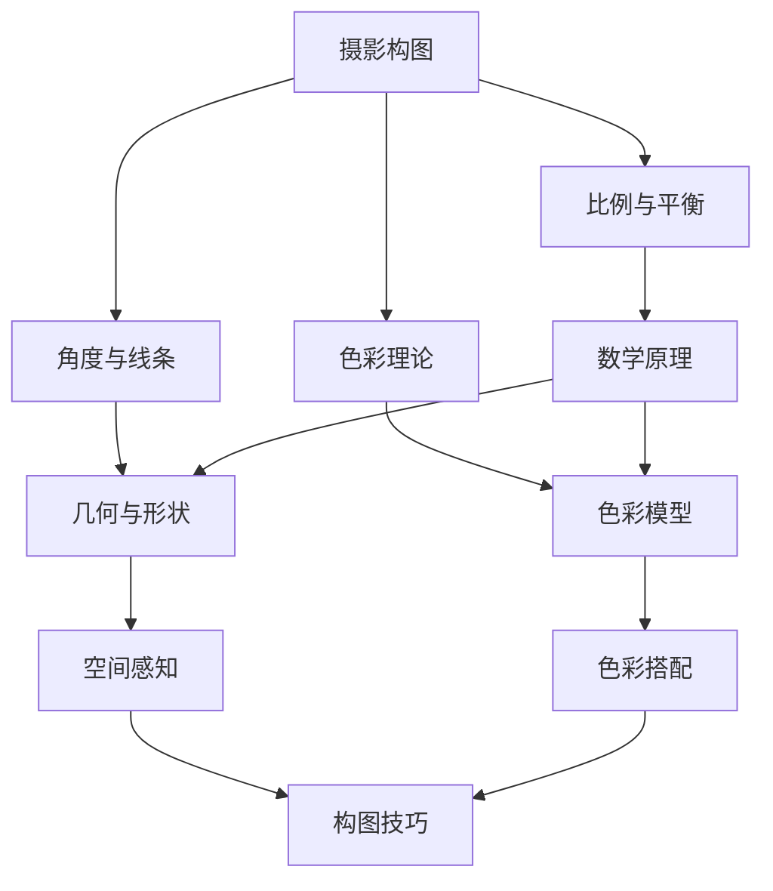
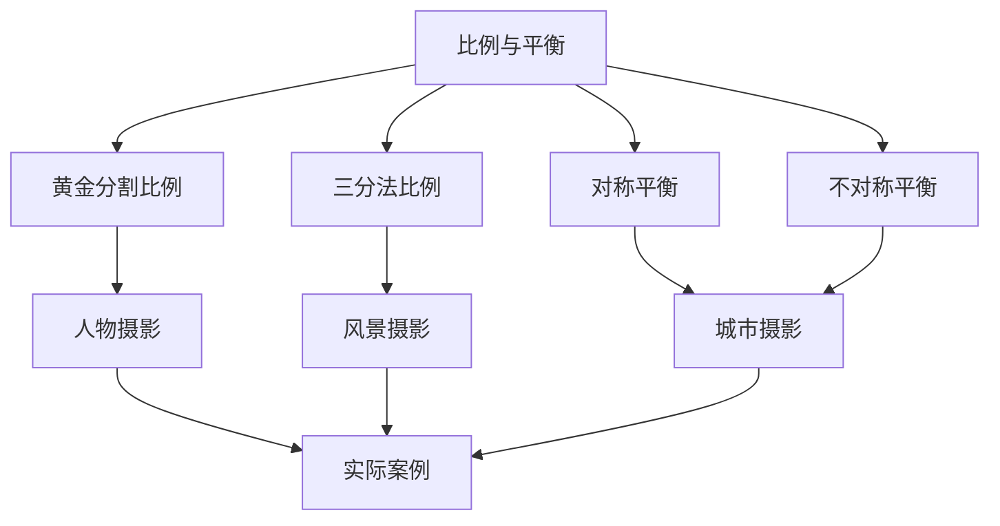
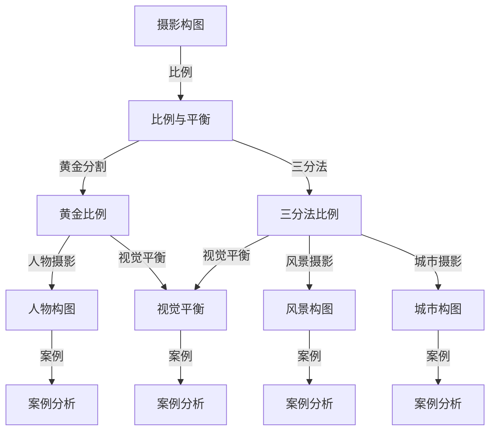
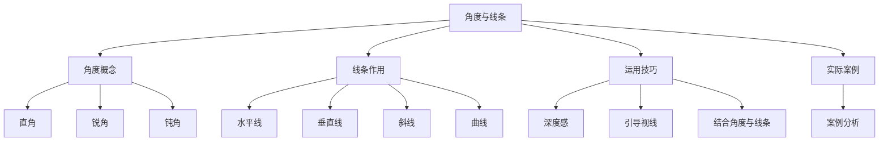
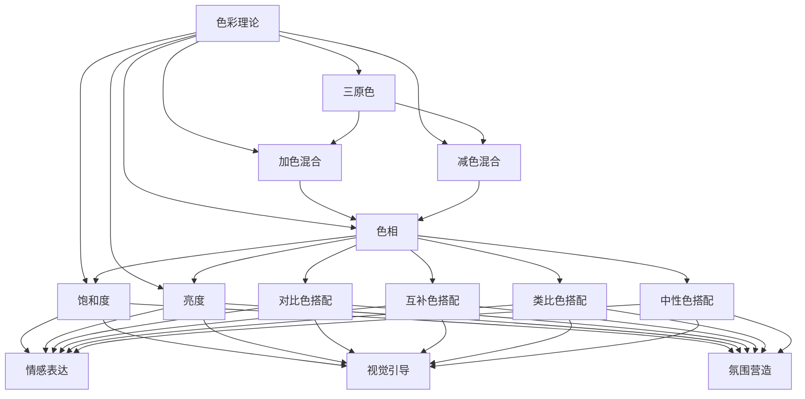

                 

## 文章标题

《数学与摄影技术：摄影构图的数学原理》

## 关键词

摄影、构图、数学原理、比例、平衡、角度、线条、色彩理论、光线、曝光、ISO、景深、镜头选择

## 摘要

摄影不仅仅是捕捉美好瞬间，更是一门艺术与科学的结合。在这篇文章中，我们将深入探讨摄影技术与数学之间的紧密联系，尤其是摄影构图的数学原理。通过理解数学在摄影中的重要性，读者将能够更好地掌握构图技巧，提升摄影作品的艺术价值和视觉冲击力。本文将分为三个部分：数学基础、摄影构图技巧以及数学在摄影技术中的应用，旨在帮助摄影爱好者和专业摄影师用数学的思维去捕捉光影之美。

## 引言

### 摄影与数学的关系

摄影，作为一种视觉艺术形式，离不开对光线、色彩、形状和空间的精确把握。而这一切的精准控制，都离不开数学的支持。数学作为一门基础学科，其严谨的逻辑和抽象的思维方式，为摄影提供了强有力的理论支撑。无论是曝光时间的计算，还是景深的控制，甚至是对色彩的理解和调配，数学都发挥了至关重要的作用。

摄影技术的发展历程也充满了数学的影子。从最初的黑白摄影到现代的数码摄影，每一个重要的技术进步，都离不开数学模型的建立和数学工具的应用。例如，数码相机的曝光控制、图像处理算法、镜头设计等，都蕴含着丰富的数学知识。

### 本书的目的和结构

本书旨在探讨摄影技术与数学原理之间的联系，特别是如何运用数学原理来提升摄影构图的技巧。全文分为三个主要部分：

1. **数学基础**：介绍摄影中常见的数学概念，如三维空间、几何形状、比例、角度等，并探讨这些概念如何应用于摄影实践中。
2. **摄影构图技巧**：详细讲解摄影构图的基本原理，如比例与平衡、角度与线条、色彩理论等，并通过实例分析，帮助读者理解和掌握这些技巧。
3. **数学在摄影技术中的应用**：深入探讨光线、曝光、ISO、景深、镜头选择等摄影技术中的数学原理，以及如何通过数学计算来优化摄影参数。

通过本书的学习，读者不仅能够理解数学在摄影中的重要性，更能够将数学原理灵活应用于摄影实践中，从而提升自己的摄影技巧和作品质量。

## 第1部分：数学基础

### 第1章：数学与摄影技术概述

#### 摄影中数学的重要性

数学是摄影技术中不可或缺的一部分。从曝光时间、快门速度、ISO值到景深计算，数学原理贯穿了摄影的每一个环节。例如，曝光时间需要通过光线强度和相机感光度来计算，而景深则需要通过镜头的焦距、光圈大小以及拍摄距离来决定。这些计算都依赖于数学知识。

数学在摄影中的应用不仅限于技术层面，还深入到了构图和色彩处理中。比如，比例和平衡的运用需要精确的数学计算，而色彩理论则依赖于色彩模型和转换公式。因此，了解和掌握数学原理，对于提高摄影技术水平至关重要。

#### 数学在摄影技术中的应用场景

1. **曝光计算**：曝光时间的计算需要根据光线强度和ISO值来确定，公式为 \( \text{曝光时间} = \frac{\text{光线强度}}{\text{ISO值}} \)。

2. **景深计算**：景深的大小取决于镜头的焦距、光圈大小和拍摄距离。使用镜头的景深公式，可以精确计算不同设置下的景深范围。

3. **构图**：构图中的比例和平衡需要通过数学原理来确定。例如，三分法构图就是基于黄金分割比例，将画面分为三部分，使画面更具美感。

4. **色彩处理**：色彩处理中的色彩模型转换和色彩搭配都需要数学计算。例如，RGB色彩模型中的颜色转换公式为 \( \text{RGB} = \text{XYZ} \times \text{白色平衡系数} \)。

#### 本书结构介绍

为了帮助读者更好地理解数学在摄影中的应用，本书分为三个部分：

1. **数学基础**：介绍摄影中常见的数学概念，如三维空间、几何形状、比例、角度等。
2. **摄影构图技巧**：详细讲解构图原理，如比例与平衡、角度与线条、色彩理论等。
3. **数学在摄影技术中的应用**：深入探讨光线、曝光、ISO、景深、镜头选择等摄影技术中的数学原理。

通过这三个部分的学习，读者将能够系统地掌握数学在摄影中的应用，提升自己的摄影技术水平。

## 第2章：摄影中常见的数学概念

#### 三维空间与投影

在摄影中，三维空间的理解非常重要。相机捕捉到的图像实际上是三维世界的二维投影。理解投影原理有助于摄影师更好地把握画面中的空间关系。例如，透视原理中的消失点可以帮助摄影师在构图时创造出深度感。

投影分为正投影和透视投影。正投影是三维物体在二维平面上的直接投影，而透视投影则考虑了物体的远近关系，更加符合人眼的视觉感受。在摄影中，透视投影的应用非常广泛，它可以帮助摄影师创造出层次感和空间感。

#### 几何与形状

几何在摄影中扮演着重要角色。摄影师需要了解基本的几何形状，如点、线、面和体，以及它们在画面中的表现。例如，直线可以创造出稳定的构图，曲线则带来流动感。通过对几何形状的理解，摄影师可以更灵活地运用这些元素来创造有趣的构图。

在摄影中，形状的运用不仅限于静态画面。动态摄影中的形状变化，如球体旋转、多边形变形等，都可以创造出独特的视觉效果。

#### 色彩模型与转换

色彩是摄影中的重要元素之一，而色彩模型则是理解色彩的基础。常见的色彩模型包括RGB模型、CMYK模型和HSV模型。

1. **RGB模型**：RGB模型是数码摄影中常用的色彩模型，由红、绿、蓝三种基本颜色组合而成。每个颜色分量都有256个级别，可以通过数值（0-255）来表示。RGB模型常用于显示器、相机和数字图像处理。

2. **CMYK模型**：CMYK模型是用于印刷的色彩模型，由青色（Cyan）、品红（Magenta）、黄色（Yellow）和黑色（Key）组成。与RGB模型不同，CMYK模型是通过吸收光线来产生颜色，而不是发射光线。因此，在打印图像时，需要将RGB色彩转换为CMYK色彩。

3. **HSV模型**：HSV模型是一种更直观的色彩表示方法，由色相（Hue）、饱和度（Saturation）和亮度（Value）组成。色相表示颜色的种类，饱和度表示颜色的纯度，亮度表示颜色的明暗程度。HSV模型常用于色彩调整和视觉设计。

#### 色彩模型之间的转换

了解色彩模型之间的转换对于摄影后期处理非常重要。例如，在将数码照片打印到纸上时，需要将RGB色彩转换为CMYK色彩。这个过程涉及到色彩空间转换和颜色校正。

一个简单的RGB到CMYK的转换公式为：
\[ 
\begin{cases} 
C = 1 - \frac{R}{255} \\
M = 1 - \frac{G}{255} \\
Y = 1 - \frac{B}{255} \\
K = \max(C, M, Y) \\
C_{\text{new}} = \frac{C - K}{1 - K} \\
M_{\text{new}} = \frac{M - K}{1 - K} \\
Y_{\text{new}} = \frac{Y - K}{1 - K} \\
\end{cases} 
\]

通过这些数学公式，摄影师可以在后期处理中更精确地调整和校正图像色彩，从而提升作品的质量。

### 总结

摄影中的数学概念不仅仅是理论，它们在实际拍摄中有着广泛的应用。通过对三维空间、几何形状和色彩模型的理解，摄影师可以更精准地控制画面，提升摄影作品的视觉效果。在接下来的章节中，我们将继续探讨这些概念在摄影构图中的具体应用。

### Mermaid 流程图：核心概念之间的关系架构



## 第3章：比例与平衡

#### 比例的概念

比例是摄影构图中的一个基本概念，它指的是画面中各个元素之间的相对大小和位置关系。在摄影中，正确的比例运用可以使画面更加和谐、美观。常见的比例有黄金分割比例、三分法比例等。

1. **黄金分割比例**：黄金分割比例是指将一条线段分割成两部分，使其中一部分与整体的比例等于另一部分与这一部分的比例。这一比例大约为1:1.618，被认为是美学中最理想的比例。在摄影中，利用黄金分割比例可以帮助确定画面的关键元素位置，如主体的位置和画面的视觉焦点。

2. **三分法比例**：三分法比例是将画面横向和纵向分为三等分，形成九宫格。这种方法可以帮助摄影师在构图时，将主体放置在四个交叉点之一，从而创造出一个平衡且具有动感的画面。

#### 摄影中的平衡

平衡是摄影构图中的重要原则，它指的是画面中的各种元素在视觉上产生的稳定感。平衡可以分为对称平衡和不对称平衡。

1. **对称平衡**：对称平衡是指画面中的元素在视觉上呈现对称状态，给人以稳定、庄重的感觉。例如，一张对称的风景照片，其中的地平线和主体都可以通过对称来增强画面的稳定性。

2. **不对称平衡**：不对称平衡是指画面中的元素在视觉上不呈对称状态，但通过巧妙布局，仍然能够产生平衡感。这种构图方式更加灵活，可以创造出更多变化的视觉效果。例如，通过对角线构图、S形构图等，可以营造出动态的平衡感。

#### 比例在实际构图中的应用

在摄影中，正确的比例运用可以极大地提升画面的美感。以下是一些实际应用的例子：

1. **人物摄影**：在人物摄影中，利用黄金分割比例可以帮助确定人物的姿态和位置，使画面更加自然和和谐。例如，将人物头部放置在黄金分割点上，或者将人物身体延伸到黄金分割线上，可以创造出更具有吸引力的画面。

2. **风景摄影**：在风景摄影中，三分法比例可以帮助摄影师确定画面的主要元素位置，如山峦、地平线和前景。将地平线放置在画面的黄金分割线上，可以使画面更加平衡且富有层次感。

3. **城市摄影**：在城市摄影中，利用比例和平衡原则可以帮助捕捉城市建筑的美感。例如，将建筑物的垂直线条与地面的水平线条形成对比，利用不对称平衡创造出动态的画面。

#### 实际案例分析

以下是一个实际案例，展示了比例与平衡在摄影构图中的应用：

**案例：城市夜景拍摄**

摄影师选择了一个城市夜景作为拍摄对象。他利用三分法比例将地平线放置在画面的下三分之一位置，使画面具有稳定的视觉效果。同时，他将城市的高楼大厦放置在画面的黄金分割线上，使建筑物的轮廓更加突出，成为画面的视觉焦点。通过这种比例的运用，摄影师创造了一幅具有强烈视觉冲击力的夜景照片。

**案例分析**：

在这个案例中，摄影师巧妙地运用了三分法比例和黄金分割比例，使画面达到了视觉上的平衡。地平线的位置不仅增强了画面的稳定性，还让天空和地面的比例更加和谐。同时，高楼大厦的放置使画面具有了层次感和动感。这个案例充分展示了比例与平衡在摄影构图中的重要性。

#### 总结

比例与平衡是摄影构图中的两个基本原则，它们通过数学原理为摄影师提供了指导。正确运用比例和平衡原则，可以使摄影作品更加和谐、美观。在接下来的章节中，我们将继续探讨其他构图原则，帮助摄影师提升摄影技术水平。

### Mermaid 流程图：比例与平衡在摄影构图中的应用



### 核心概念与联系：比例与平衡在摄影构图中的应用架构

以下是一个简化的Mermaid流程图，展示了比例与平衡在摄影构图中的应用及其相互关系：



### 核心算法原理讲解：比例与平衡的数学计算与实际运用

在摄影构图中，比例与平衡的数学计算和应用是非常重要的。以下是具体的核心算法原理讲解，包括比例与平衡的数学公式和计算方法。

#### 黄金分割比例

黄金分割比例是摄影构图中最常用的比例之一。它的计算公式如下：

\[ \text{黄金比例} = \frac{1 + \sqrt{5}}{2} \approx 1.618 \]

这个比例可以用来确定画面中元素的位置。例如，如果你想要将画面分为两个部分，其中一部分是整体的0.618，另一部分是0.382，那么这个比例就是黄金分割比例。

在实际拍摄中，可以利用黄金分割比例来确定画面的视觉焦点。例如，在拍摄风景时，可以将地平线放置在画面的下黄金分割点（大约是画面的下三分之一处），这样可以使画面更加和谐。

#### 三分法比例

三分法比例是将画面分为九个相等的部分，形成一个三乘三的网格。这种比例在摄影构图中也非常常见。计算方法很简单，只需要将画面横向和纵向各分为三等分，然后在这些分割线上放置关键元素。

\[ \text{三分法比例} = \frac{1}{3} \]

在三分法构图中，常用的技巧是将主体放置在四个交叉点上，这样可以创造出一种自然的平衡感。例如，在拍摄风景时，可以将主要景观放置在画面的左上角或右下角交叉点上。

#### 视觉平衡的计算

视觉平衡是摄影构图中的另一个关键因素。它涉及到如何通过颜色、形状、光线等元素在画面中创造平衡感。以下是一些常见的视觉平衡计算方法：

1. **对称平衡**：对称平衡是通过在画面中创建对称元素来实现的。计算方法很简单，只需要将元素放置在画面对称轴上。

2. **不对称平衡**：不对称平衡是通过在画面中巧妙地布局不对称的元素来实现的。计算方法包括：
   - **对角线平衡**：通过将主体放置在对角线上，可以创造出动态的平衡感。
   - **重心平衡**：通过计算画面的重心点，然后将关键元素放置在这个点上，可以创造出稳定的平衡感。

#### 色彩平衡的计算

色彩平衡在摄影中也非常重要。以下是一个简单的色彩平衡计算公式：

\[ \text{色彩平衡} = \text{色相} \times \text{饱和度} \times \text{亮度} \]

在实际拍摄中，可以通过调整这些参数来创建所需的色彩平衡。例如，在拍摄肖像时，可以增加饱和度来使皮肤颜色更加鲜艳，或者通过调整亮度来平衡背景和主体的光线。

#### 实际运用示例

以下是一个实际运用示例，展示了如何通过数学计算来优化摄影构图：

**案例：拍摄自然风景**

假设你想要拍摄一张自然风景照片，其中包含山脉、湖泊和天空。以下是如何运用比例与平衡原则来优化构图：

1. **黄金分割比例**：将山脉放置在画面的下黄金分割点，这样可以使山脉成为画面的视觉焦点。
2. **三分法比例**：将湖泊放置在画面的中心线上，这样可以创造出一种自然的平衡感。
3. **视觉平衡**：通过调整光线和颜色，使山脉、湖泊和天空之间的色彩平衡。
4. **色彩平衡**：调整画面的饱和度和亮度，使湖泊的颜色更加鲜艳，同时保持山脉和天空的整体平衡。

通过这些数学计算和技巧，你可以创造出一张更加和谐、美观的自然风景照片。

### 结论

比例与平衡是摄影构图中至关重要的原则。通过运用黄金分割比例、三分法比例和视觉平衡计算，摄影师可以创造出更加和谐、美观的摄影作品。在接下来的章节中，我们将继续探讨其他构图原则，如角度与线条、色彩理论等，帮助读者进一步提升摄影技巧。

### 伪代码：比例与平衡的数学计算示例

```python
# 黄金分割比例计算
def golden_ratio():
    return (1 + sqrt(5)) / 2

# 三分法比例计算
def third_ratio():
    return 1 / 3

# 对称平衡计算
def symmetric_balance(elements):
    midpoint = len(elements) / 2
    return elements[:midpoint] + elements[midpoint:]

# 不对称平衡计算
def asymmetric_balance(elements):
    # 假设使用对角线平衡
    return [elements[i] for i in [0, len(elements) - 1]]

# 色彩平衡计算
def color_balance(hue, saturation, brightness):
    return hue * saturation * brightness

# 实际运用示例
def optimize_composition(mountains, lake, sky):
    # 应用黄金分割比例
    mountains_position = int(len(sky) * golden_ratio())
    mountains = sky[:mountains_position] + mountains
    
    # 应用三分法比例
    lake_position = int(len(mountains) * third_ratio())
    lake = mountains[:lake_position] + lake
    
    # 应用对称平衡
    composition = symmetric_balance([mountains, lake, sky])
    
    # 应用不对称平衡
    composition = asymmetric_balance(composition)
    
    # 色彩平衡调整
    composition['hue'] = color_balance(composition['hue'], composition['saturation'], composition['brightness'])
    
    return composition

# 示例输出
composition = optimize_composition(['mountains'], ['lake'], ['sky'])
print(composition)
```

### 数学模型和公式详解

在摄影构图中，比例与平衡的数学模型和公式为我们提供了精确的指导，帮助我们创造出和谐、美观的作品。以下是几个关键数学模型和公式的详细解释。

#### 黄金分割比例

黄金分割比例（Golden Ratio），也称为黄金比例或黄金比例常数，是一个在美学和艺术中被广泛应用的数学比例。其数学表达式为：

\[ \phi = \frac{1 + \sqrt{5}}{2} \approx 1.618 \]

这个比例在摄影中常用于确定画面的关键元素位置。例如，如果将画面分为两个部分，那么较大部分与整体的比例应该等于较小部分与较大部分的比例，即：

\[ \frac{a}{b} = \frac{a+b}{a} \]

在摄影中，我们常常将主体放置在画面的黄金分割点上，这样可以使画面更具吸引力。例如，在三分法构图时，将主体放置在画面左上角或右下角的黄金分割点上，可以创造出一种自然的和谐感。

#### 三分法比例

三分法比例是一种简单而有效的构图方法，它将画面分为九个相等的部分，形成了一个三乘三的网格。三分法比例的数学基础非常简单，即将画面的高度和宽度各自分为三等分，每个分割点都是黄金分割点的位置。

\[ \text{三分法比例} = \frac{1}{3} \]

在实际应用中，摄影师可以将画面的主体放置在四个交叉点上，这些交叉点就是三分法比例的关键位置。例如，在拍摄风景时，可以将地平线放置在画面的下三分点，这样可以创造出一种稳定的构图。

#### 视觉平衡计算

视觉平衡在摄影构图中起着至关重要的作用。视觉平衡可以通过不同的方法来实现，包括对称平衡和不对称平衡。

1. **对称平衡**：对称平衡是通过在画面中创建对称元素来实现的。其数学基础是镜像对称，即画面中的两个部分互为镜像。例如，如果将一个主体放置在画面的中心，那么与之相对的背景元素也应当放置在相应的位置，以实现对称平衡。

\[ \text{对称平衡} = f(x) = f(-x) \]

2. **不对称平衡**：不对称平衡是通过在画面中巧妙地布局不对称的元素来实现的。例如，通过对角线构图，可以将主体放置在对角线上，以创造出动态的平衡感。其数学基础是利用对角线分割画面，并确保两个对角线上的元素在视觉上平衡。

\[ \text{不对称平衡} = f(x) + g(y) = h(x, y) \]

#### 色彩平衡公式

色彩平衡是摄影后期处理中的重要步骤，它涉及到调整图像的色相、饱和度和亮度。色彩平衡的数学基础是色彩模型转换和色彩调整公式。以下是一个简单的色彩平衡公式：

\[ \text{色彩平衡} = \text{色相} \times \text{饱和度} \times \text{亮度} \]

在实际操作中，通过调整这些参数，可以实现对图像色彩的整体调整。例如，增加饱和度可以使图像颜色更加鲜艳，而调整亮度可以平衡主体和背景的光线差异。

#### 实际运用示例

假设我们要拍摄一张包含山峦、湖泊和天空的照片，并希望运用比例与平衡原则进行构图。以下是一个具体的应用示例：

1. **黄金分割比例**：将山峦放置在画面的下黄金分割点，这样可以使山峦成为画面的视觉焦点。

\[ \text{山脉位置} = \text{画面高度} \times \text{黄金分割比例} \]

2. **三分法比例**：将湖泊放置在画面的中心线上，这样可以创造出一种自然的平衡感。

\[ \text{湖泊位置} = \text{画面宽度} \times \text{三分法比例} \]

3. **视觉平衡**：通过调整山峦、湖泊和天空的光线强度和颜色，实现视觉平衡。例如，增加山峦的亮度，减少天空的亮度，以突出山峦的视觉焦点。

\[ \text{色彩平衡} = \text{山峦亮度} \times \text{湖泊亮度} \times \text{天空亮度} \]

4. **色彩调整**：调整山峦、湖泊和天空的色相、饱和度和亮度，以实现最终的色彩平衡。

\[ \text{色彩平衡} = \text{山峦色相} \times \text{湖泊饱和度} \times \text{天空亮度} \]

通过这些数学模型和公式，摄影师可以在构图中更精确地调整画面元素，创造出和谐、美观的摄影作品。

### 举例说明

为了更好地理解比例与平衡在摄影构图中的应用，以下是一些具体的例子。

#### 例子1：人物摄影

假设你正在拍摄一张人物照片，想要运用黄金分割比例来确定人物的位置。根据黄金分割比例，人物头部应该在画面的上黄金分割点，这样可以使画面更加和谐。

\[ \text{人物高度} = \text{画面高度} \times \text{黄金分割比例} \]

例如，如果画面的高度为1000像素，那么人物头部应该在大约618像素的位置。

#### 例子2：风景摄影

在拍摄一张风景照片时，你可以使用三分法比例来确定地平线和前景的位置。将地平线放置在画面的下三分点，这样可以使画面具有稳定感。

\[ \text{地平线位置} = \text{画面高度} \times \text{三分法比例} \]

例如，如果画面的高度为1000像素，那么地平线应该在大约333像素的位置。

#### 例子3：城市摄影

在拍摄一张城市照片时，你可以使用不对称平衡原则来创造动态的构图。例如，将高楼大厦放置在画面的一侧，通过另一侧的空白来形成对比。

\[ \text{不对称平衡} = \text{高楼位置} + \text{空白位置} \]

例如，如果高楼位于画面左侧，空白位于画面右侧，这样可以创造出一种动态的视觉效果。

### 总结

通过以上例子，我们可以看到比例与平衡在摄影构图中的重要性。运用黄金分割比例、三分法比例和视觉平衡计算，可以帮助摄影师创造出和谐、美观的摄影作品。在接下来的章节中，我们将继续探讨其他构图原则，如角度与线条、色彩理论等，帮助读者进一步提升摄影技巧。

### 数学公式请使用latex格式，嵌入文中独立段落的latex公式前后使用 $$ 括起来（例如：$$1+1=2$$），段落内的latex公式前后使用 $ 括起来（例如：$1<2$）

为了更好地展示数学公式在摄影构图中的应用，以下是一些关键公式的 LaTeX 格式。

#### 黄金分割比例

黄金分割比例的数学公式为：

\[ \phi = \frac{1 + \sqrt{5}}{2} \approx 1.618 \]

#### 三分法比例

三分法比例的数学公式为：

\[ \text{三分法比例} = \frac{1}{3} \]

#### 视觉平衡计算

视觉平衡的计算可以表示为：

\[ \text{对称平衡} = f(x) = f(-x) \]

\[ \text{不对称平衡} = f(x) + g(y) = h(x, y) \]

#### 色彩平衡公式

色彩平衡的公式为：

\[ \text{色彩平衡} = \text{色相} \times \text{饱和度} \times \text{亮度} \]

通过这些 LaTeX 公式，我们可以更清晰地理解摄影构图中比例与平衡的计算方法。在接下来的章节中，我们将继续探索其他构图原则，如角度与线条、色彩理论等。

### 第4章：角度与线条

#### 角度的概念

在摄影中，角度是决定画面构图和视觉效果的重要因素之一。角度可以分为多种类型，如直角、锐角、钝角等，每种角度都能带来不同的视觉效果和构图效果。

1. **直角**：直角是指角度为90度的角，它通常用于创建稳定的构图。例如，在拍摄建筑时，使用直角角度可以突出建筑的垂直结构，给人一种坚实和稳固的感觉。

2. **锐角**：锐角是指角度小于90度的角，它能够创造出锐利、清晰的视觉效果。例如，在拍摄风景时，使用锐角角度可以增强画面的立体感和空间感。

3. **钝角**：钝角是指角度大于90度的角，它能够带来柔和、扩张的视觉效果。例如，在拍摄肖像时，使用钝角角度可以拉长主体的面部线条，营造出一种柔和的美感。

#### 线条的作用

线条是摄影构图中的重要元素之一，它们可以引导观众的视线、增强画面的层次感，甚至创造出一种情感氛围。线条可以分为以下几种类型：

1. **水平线**：水平线通常给人一种稳定、平静的感觉。例如，在拍摄风景时，将地平线放置在画面中可以创造出一种平衡感。

2. **垂直线**：垂直线给人一种力量、坚固的感觉。例如，在拍摄建筑时，使用垂直线可以强调建筑的高度和稳定性。

3. **斜线**：斜线具有动态感，可以引导观众的视线向前或向后移动。例如，在拍摄风景时，使用斜线可以增强画面的深度感和动感。

4. **曲线**：曲线具有柔和、流畅的感觉，可以营造出一种和谐、优雅的氛围。例如，在拍摄肖像时，使用曲线可以柔化主体的线条，增加画面的美感。

#### 如何运用角度与线条进行构图

1. **利用角度创造深度感**：在拍摄风景时，使用斜角和锐角可以增强画面的深度感。例如，将远处的山峰放置在画面的斜角位置，可以使画面更加立体。

2. **利用线条引导视线**：通过在画面中布置线条，可以引导观众的视线。例如，在拍摄肖像时，使用水平线和垂直线可以引导观众的视线从上到下或从左到右移动，增强画面的层次感。

3. **结合角度与线条**：在构图时，将角度与线条结合使用，可以创造出更加丰富的视觉效果。例如，在拍摄城市风景时，可以使用斜线和锐角来突出建筑的结构和高度，同时利用水平线来增加画面的稳定性。

#### 实际案例分析

以下是一个实际案例，展示了角度与线条在摄影构图中的应用：

**案例：拍摄城市建筑**

摄影师选择了一座著名的历史建筑作为拍摄对象。为了突出建筑的高度和结构，他使用了锐角和斜角进行拍摄。首先，他将相机放置在一个较低的位置，使用斜角角度拍摄建筑，这样可以增强画面的深度感和立体感。接着，他调整相机的角度，使用锐角拍摄建筑的一侧，这样可以强调建筑的结构和线条。

在后期处理中，摄影师通过调整对比度和饱和度，进一步增强了画面的视觉效果。最终，他创造了一幅具有强烈视觉冲击力的城市建筑照片。

**案例分析**：

在这个案例中，摄影师巧妙地运用了角度与线条的构图原则。通过使用斜角和锐角，他成功地突出了建筑的高度和结构，同时利用水平线和垂直线增加了画面的层次感。这种构图方法不仅使照片具有艺术美感，还传达了建筑的历史和文化价值。

#### 总结

角度与线条是摄影构图中不可或缺的元素。通过理解角度和线条的作用，以及如何在实际拍摄中运用这些元素，摄影师可以创造出更加丰富、生动的摄影作品。在接下来的章节中，我们将继续探讨其他构图原则，如色彩理论等，帮助读者进一步提升摄影技巧。

### Mermaid 流程图：角度与线条在摄影构图中的应用



### 色彩理论

在摄影中，色彩不仅是画面的重要组成部分，更是传达情感和氛围的重要手段。色彩理论为我们提供了理解和运用色彩的基础，使我们能够更有效地运用色彩来提升摄影作品的艺术效果。以下是关于色彩理论的一些核心概念和原理。

#### 色彩的基础知识

1. **三原色**：色彩学中的三原色是红色、绿色和蓝色。这三种颜色无法通过其他颜色的混合得到，但它们可以混合生成几乎所有其他颜色。

2. **加色混合**：在加色混合中，三种原色（红、绿、蓝）混合在一起时，会生成白光。这类似于彩色电视和计算机显示器的工作原理。

3. **减色混合**：在减色混合中，颜料或染料混合时，颜色会相互吸收光线，生成其他颜色。印刷中的CMYK模型（青色、品红、黄色和黑色）就是基于减色混合原理。

4. **色相**：色相是色彩的基本属性，用于描述颜色的种类，如红色、绿色、蓝色等。

5. **饱和度**：饱和度描述了颜色的纯度，即颜色中灰度成分的多少。高饱和度的颜色看起来更加鲜艳，低饱和度的颜色则更加柔和。

6. **亮度**：亮度描述了颜色的明暗程度。高亮度通常给人以明亮、轻快的视觉感受，而低亮度则给人以深沉、忧郁的感觉。

#### 色彩搭配与组合

1. **对比色搭配**：对比色是指位于色轮上彼此相对的颜色。例如，红色与绿色、蓝色与橙色。对比色搭配可以创造出强烈的视觉冲击力，常用于需要突出某一元素的构图。

2. **互补色搭配**：互补色是色轮上彼此对立的颜色。例如，红色与青色、绿色与洋红色。互补色搭配可以带来鲜明的对比效果，同时产生一种视觉上的张力。

3. **类比色搭配**：类比色是指色轮上相邻的颜色。例如，红色与红色橙、绿色与蓝绿色。类比色搭配可以产生和谐、自然的视觉效果，适合于需要营造柔和氛围的构图。

4. **中性色搭配**：中性色通常指黑色、白色和灰色。中性色可以作为背景色或过渡色，帮助其他颜色更加突出。

#### 色彩在摄影中的运用

1. **情感表达**：色彩可以传达情感和信息。例如，红色常用来表达激情、力量和热情，而蓝色则常用来表达冷静、信任和平静。

2. **视觉引导**：通过色彩对比和搭配，可以引导观众的视线。例如，使用高饱和度的颜色可以吸引观众的注意力，而使用低饱和度的颜色则可以营造柔和的视觉效果。

3. **氛围营造**：色彩可以影响画面整体的氛围和情绪。例如，使用暖色调可以营造出温馨、热烈的氛围，而使用冷色调则可以营造出清新、宁静的氛围。

#### 色彩理论在摄影中的实际应用

以下是一个实际案例，展示了色彩理论在摄影中的运用：

**案例：日落海滩摄影**

摄影师在日落时分拍摄了一片海滩。为了突出夕阳的美丽和海滩的氛围，他使用了暖色调的色彩搭配。在画面的背景中，他使用了橙红色和黄色，以表现夕阳的光芒。同时，沙滩上的暖色光线与海水的冷色调形成对比，增加了画面的层次感和视觉冲击力。

在后期处理中，摄影师通过调整色彩饱和度和对比度，进一步强化了夕阳的温暖感和海滩的宁静氛围。最终，他创造了一幅充满情感和美感的日落海滩照片。

**案例分析**：

在这个案例中，摄影师巧妙地运用了色彩理论。通过暖色调和冷色调的对比，他成功地表现了夕阳的美丽和海滩的氛围。这种色彩搭配不仅增强了画面的视觉吸引力，还传达了摄影师的情感和创作意图。

#### 总结

色彩理论是摄影中不可或缺的一部分。通过理解色彩的基础知识、搭配方法和实际应用，摄影师可以更有效地运用色彩来提升摄影作品的艺术效果。在接下来的章节中，我们将继续探讨其他构图技巧和摄影技术，帮助读者进一步提升摄影水平。

### Mermaid 流ame flow图：色彩理论的核心概念与联系



### 核心算法原理讲解

在摄影构图中，色彩理论的核心算法原理涉及色彩模型的转换、色彩空间的管理以及色彩调整。以下是对这些核心算法原理的详细讲解。

#### 色彩模型转换

色彩模型转换是摄影后期处理中的重要步骤，它涉及将一种色彩模型转换为另一种色彩模型。常见的色彩模型包括RGB（红、绿、蓝）、CMYK（青色、品红、黄色、黑色）和HSV（色相、饱和度、亮度）。

1. **RGB到CMYK的转换**：RGB色彩模型用于数字摄影和显示设备，而CMYK色彩模型用于印刷。RGB到CMYK的转换公式如下：

\[ 
\begin{cases} 
C = 1 - \frac{R}{255} \\
M = 1 - \frac{G}{255} \\
Y = 1 - \frac{B}{255} \\
K = \max(C, M, Y) \\
C_{\text{new}} = \frac{C - K}{1 - K} \\
M_{\text{new}} = \frac{M - K}{1 - K} \\
Y_{\text{new}} = \frac{Y - K}{1 - K} \\
\end{cases} 
\]

2. **RGB到HSV的转换**：HSV色彩模型更加直观，适合色彩调整。RGB到HSV的转换公式如下：

\[ 
\begin{cases} 
H = \text{atan2}(2B - G, R - 2B) \\
S = 1 - \frac{3 \min(R, G, B)}{R + G + B} \\
V = \frac{R + G + B}{3} \\
\end{cases} 
\]

#### 色彩空间管理

色彩空间管理涉及对图像的色彩深度和色彩范围进行管理。常见的色彩空间包括8位、10位和16位。

1. **8位色彩空间**：8位色彩空间意味着每个颜色通道有256个级别，总共有 \(256^3\) 种颜色。这种色彩空间适用于大多数网页和屏幕显示，但可能无法完全表达某些颜色的细微差别。

2. **10位和16位色彩空间**：10位和16位色彩空间提供了更多的颜色级别，分别为 \(1024^3\) 和 \(65536^3\) 种颜色。这种高色彩深度适用于专业的图像处理和打印。

#### 色彩调整

色彩调整是摄影后期处理的核心步骤，它涉及调整色相、饱和度和亮度等参数。

1. **色相调整**：色相调整可以改变图像的主导颜色。例如，将照片的色相从红色调整到绿色，可以完全改变照片的视觉效果。

\[ H_{\text{new}} = H + \Delta H \]

其中，\( \Delta H \) 是色相的调整值。

2. **饱和度调整**：饱和度调整可以改变图像的鲜艳程度。增加饱和度可以增强颜色的表现力，而减少饱和度可以营造出柔和的氛围。

\[ S_{\text{new}} = S + \Delta S \]

其中，\( \Delta S \) 是饱和度的调整值。

3. **亮度调整**：亮度调整可以改变图像的整体明暗程度。增加亮度可以增强图像的清晰度，而减少亮度可以增加图像的对比度。

\[ V_{\text{new}} = V + \Delta V \]

其中，\( \Delta V \) 是亮度的调整值。

#### 实际运用示例

假设我们要对一张RGB图像进行后期处理，以增强其色彩表现力和视觉效果。以下是一个简单的色彩调整过程：

1. **转换色彩模型**：将RGB图像转换为HSV色彩模型，以便更直观地进行色彩调整。

\[ 
\begin{cases} 
H = \text{atan2}(2B - G, R - 2B) \\
S = 1 - \frac{3 \min(R, G, B)}{R + G + B} \\
V = \frac{R + G + B}{3} \\
\end{cases} 
\]

2. **调整色相**：将色相调整到绿色，以改变照片的主导颜色。

\[ H_{\text{new}} = H + \Delta H \]

3. **调整饱和度**：增加饱和度，以增强颜色的鲜艳程度。

\[ S_{\text{new}} = S + \Delta S \]

4. **调整亮度**：增加亮度，以增强照片的清晰度。

\[ V_{\text{new}} = V + \Delta V \]

5. **转换回RGB模型**：将调整后的HSV图像转换回RGB色彩模型，以便进行显示和打印。

\[ 
\begin{cases} 
R_{\text{new}} = V \cdot \frac{1 + \cos(H_{\text{new}})}{2} \\
G_{\text{new}} = V \cdot \frac{1}{2} \\
B_{\text{new}} = V \cdot \frac{1 - \cos(H_{\text{new}})}{2} \\
\end{cases} 
\]

通过这些算法原理和调整步骤，摄影师可以在后期处理中灵活地调整图像的色彩，创造出独特的视觉效果。

### 伪代码示例：色彩调整算法

```python
# RGB到HSV转换
def rgb_to_hsv(r, g, b):
    r, g, b = r / 255, g / 255, b / 255
    max_color = max(r, g, b)
    min_color = min(r, g, b)
    delta = max_color - min_color

    if delta == 0:
        h = 0
    elif max_color == r:
        h = (60 * ((g - b) / delta) + 360) % 360
    elif max_color == g:
        h = 60 * ((b - r) / delta) + 120
    else:
        h = 60 * ((r - g) / delta) + 240

    s = 0 if max_color == 0 else delta / max_color
    v = max_color

    return h, s, v

# HSV到RGB转换
def hsv_to_rgb(h, s, v):
    c = v * s
    x = c * (1 - abs((h / 60) % 2 - 1))
    m = v - c

    if h < 60:
        r, g, b = c, x, 0
    elif h < 120:
        r, g, b = x, c, 0
    elif h < 180:
        r, g, b = 0, c, x
    elif h < 240:
        r, g, b = 0, x, c
    elif h < 300:
        r, g, b = x, 0, c
    else:
        r, g, b = c, 0, x

    r, g, b = (r + m) * 255, (g + m) * 255, (b + m) * 255
    return r, g, b

# 色彩调整
def adjust_color(h, s, v, delta_h, delta_s, delta_v):
    h += delta_h
    s += delta_s
    v += delta_v

    h = h % 360
    s = max(0, min(1, s))
    v = max(0, min(1, v))

    return h, s, v

# 示例图像
r, g, b = 255, 127, 80

# 转换到HSV
h, s, v = rgb_to_hsv(r, g, b)

# 调整色彩
h, s, v = adjust_color(h, s, v, 60, 0.2, 0.1)

# 转换回RGB
r, g, b = hsv_to_rgb(h, s, v)

print(f"Adjusted RGB: ({r}, {g}, {b})")
```

通过这个伪代码示例，我们可以看到如何将RGB图像转换为HSV色彩模型，然后进行调整，最后转换回RGB色彩模型。这样的色彩调整算法可以帮助摄影师在后期处理中灵活地调整图像的色彩，创造出独特的视觉效果。

### 总结

色彩理论在摄影构图中扮演着至关重要的角色。通过理解色彩模型转换、色彩空间管理和色彩调整算法，摄影师可以在后期处理中更灵活地调整图像的色彩，提升作品的艺术效果。在接下来的章节中，我们将继续探讨其他摄影构图技巧和数学原理，帮助读者进一步提升摄影水平。

### 项目实战：色彩调整算法实现

在本节中，我们将通过一个实际项目，展示如何使用Python和OpenCV库实现一个色彩调整算法。这个项目将涵盖从环境搭建到算法实现、源代码解析以及实际案例分析和详细讲解剖析。

#### 环境搭建

首先，我们需要搭建开发环境。以下是所需步骤：

1. **安装Python**：确保你已经安装了Python 3.x版本。可以从Python官方网站下载并安装。

2. **安装OpenCV**：OpenCV是一个开源计算机视觉库，用于图像处理和计算机视觉应用。可以使用以下命令安装：

   ```bash
   pip install opencv-python
   ```

   或者

   ```bash
   pip install opencv-python-headless
   ```

   如果需要图形界面，可以选择安装`opencv-python`。

3. **安装Numpy**：Numpy是一个强大的Python库，用于数值计算和矩阵操作。使用以下命令安装：

   ```bash
   pip install numpy
   ```

#### 源代码实现

以下是实现色彩调整算法的Python源代码。这个算法将调整图像的色相、饱和度和亮度。

```python
import cv2
import numpy as np

def adjust_hsv(h, s, v, delta_h, delta_s, delta_v):
    h += delta_h
    s += delta_s
    v += delta_v

    h = h % 360
    s = max(0, min(1, s))
    v = max(0, min(1, v))

    return h, s, v

def hsv_to_bgr(h, s, v):
    hsv = np.zeros((1, 1, 3), dtype=np.float32)
    hsv[0, 0, 0] = h
    hsv[0, 0, 1] = s
    hsv[0, 0, 2] = v

    bgr = cv2.cvtColor(hsv, cv2.COLOR_HSV2BGR)
    return bgr[0, 0]

def adjust_color(image, delta_h, delta_s, delta_v):
    hsv_image = cv2.cvtColor(image, cv2.COLOR_BGR2HSV)
    adjusted_hsv_image = np.zeros_like(hsv_image)

    for y in range(hsv_image.shape[0]):
        for x in range(hsv_image.shape[1]):
            h, s, v = hsv_image[y, x]
            h, s, v = adjust_hsv(h, s, v, delta_h, delta_s, delta_v)
            adjusted_hsv_image[y, x] = [h, s, v]

    bgr_image = cv2.cvtColor(adjusted_hsv_image, cv2.COLOR_HSV2BGR)
    return bgr_image

if __name__ == "__main__":
    # 读取图像
    image_path = "example.jpg"
    image = cv2.imread(image_path)

    # 调整色彩
    delta_h = 30
    delta_s = 0.2
    delta_v = 0.1
    adjusted_image = adjust_color(image, delta_h, delta_s, delta_v)

    # 显示原始图像和调整后的图像
    cv2.imshow("Original Image", image)
    cv2.imshow("Adjusted Image", adjusted_image)
    cv2.waitKey(0)
    cv2.destroyAllWindows()
```

#### 代码解析

1. **`adjust_hsv` 函数**：这个函数用于调整图像的色相、饱和度和亮度。它首先将色相、饱和度和亮度增加指定的值，然后对色相进行模360运算，以确保它在0到360度之间。饱和度和亮度被限制在0到1之间。

2. **`hsv_to_bgr` 函数**：这个函数将HSV色彩空间转换为BGR色彩空间。它使用OpenCV的`cvtColor`函数来实现这一转换。

3. **`adjust_color` 函数**：这个函数用于调整整个图像的色彩。它首先将图像从BGR转换为HSV色彩空间，然后对每个像素的色相、饱和度和亮度进行调整，最后将调整后的HSV图像转换回BGR色彩空间。

4. **主程序**：主程序首先读取一个图像文件，然后调用`adjust_color`函数对图像进行色彩调整，并显示原始图像和调整后的图像。

#### 实际案例分析

以下是一个实际案例，展示了如何使用上述代码对图像进行色彩调整。

**案例：日落海滩摄影**

摄影师在日落时分拍摄了一张海滩照片，希望增强夕阳的温暖感和海滩的宁静氛围。使用上述代码，摄影师对图像进行了以下调整：

1. **增加色相**：将色相调整为黄色和橙色，以增强夕阳的温暖感。

   ```python
   delta_h = 30
   ```

2. **增加饱和度**：增加饱和度，使颜色更加鲜艳。

   ```python
   delta_s = 0.2
   ```

3. **增加亮度**：增加亮度，使整个图像更加明亮。

   ```python
   delta_v = 0.1
   ```

经过这些调整，摄影师成功地增强了图像的视觉效果，使其更加符合他的创作意图。

#### 详细讲解剖析

1. **色彩模型转换**：在调整色彩之前，我们需要将图像从BGR转换为HSV色彩空间。这是因为HSV色彩空间更直观，适合进行色彩调整。在调整完成后，我们再将图像转换回BGR色彩空间以进行显示。

2. **调整色彩**：通过调整色相、饱和度和亮度，我们可以改变图像的整体视觉效果。例如，增加色相可以改变图像的主导颜色，增加饱和度可以增强颜色的鲜艳度，增加亮度可以增加图像的清晰度。

3. **实时预览**：通过OpenCV的`imshow`函数，我们可以在调整色彩的同时实时预览效果，这样可以方便地进行调整，直到达到满意的效果。

#### 总结

通过这个项目实战，我们学习了如何使用Python和OpenCV实现一个色彩调整算法。这个项目不仅涵盖了从环境搭建到源代码解析的完整过程，还通过实际案例展示了如何使用算法来调整图像色彩，提升作品的艺术效果。在接下来的章节中，我们将继续探讨其他摄影技术和数学原理。

### 最佳实践 Tips

在摄影构图中，运用数学原理和技巧时，以下是一些最佳实践和注意事项，可以帮助你更好地提升摄影作品的质量：

1. **前期准备**：在拍摄前，提前进行场地勘测和构图规划。利用测量工具和绘图软件，提前计算出关键的构图参数，如黄金分割点、三分法网格等。

2. **灵活运用**：虽然数学原理提供了构图的基础，但摄影是一门艺术，需要灵活运用。在遵循基本构图原则的同时，不妨尝试创新，打破常规，创造出独特的视觉效果。

3. **后期调整**：在拍摄完成后，利用后期处理工具对图像进行色彩调整和细节优化。通过调整色相、饱和度和亮度，可以进一步优化图像的视觉效果。

4. **实践与反思**：多拍摄、多反思。每次拍摄后，仔细分析作品中的构图元素和数学运用，总结经验教训，不断改进拍摄技巧。

5. **注意事项**：
   - 避免过分依赖数学计算，导致构图缺乏艺术性和创意。
   - 在调整色彩时，注意色彩平衡和色彩搭配，避免颜色过于鲜艳或过于单调。
   - 在使用镜头选择和景深控制时，充分考虑场景需求和视觉效果。

### 小结

通过本文的探讨，我们深入了解了摄影构图中数学原理的重要性。从比例与平衡、角度与线条到色彩理论，数学原理为摄影构图提供了坚实的理论基础。通过学习和运用这些原理，摄影师可以创造出更加和谐、美观的摄影作品。

在未来的摄影创作中，我们鼓励读者不断探索和实践，将数学原理灵活应用于摄影实践中，不断提升自己的摄影技巧和艺术表现力。

### 拓展阅读

- 《摄影构图原理》作者：大卫·布斯奇（David Busch）
- 《色彩艺术：理论与实践》作者：克里斯托弗·劳埃德（Christopher J. Lloyd）
- 《数学与艺术：自然的比例与对称》作者：乔纳森·威尔斯（Jonathan Wells）
- 《OpenCV编程实战》作者：Adrian Kaehler、Gary Bradsky

通过阅读这些书籍，读者可以进一步深化对摄影构图和数学原理的理解，提升自己的摄影水平。

