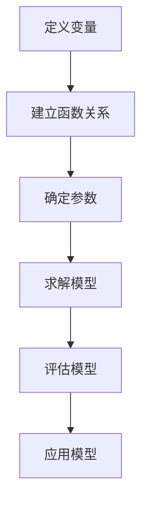
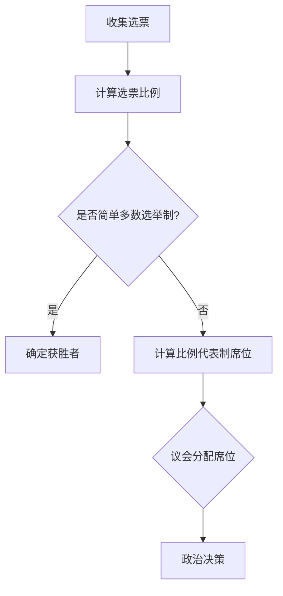

                 

### 第1章 引言

#### 1.1 数学模型在政治学中的应用

数学模型作为一种工具，广泛应用于多个学科领域，其中政治学也不例外。数学模型在政治学中的应用，主要集中在描述和预测政治行为、分析选举结果以及研究政治稳定性等方面。通过建立数学模型，政治学家可以更精确地描述政治现象，从而为政策制定和决策提供科学依据。

首先，数学模型在政治行为的研究中发挥了重要作用。例如，投票行为可以通过概率模型进行描述，从而帮助政治学家预测选举结果。此外，政治社会化过程也可以通过数学模型进行分析，研究个体在政治环境中的行为变化。

其次，数学模型在分析选举结果方面具有独特的优势。通过建立选举模型，政治学家可以预测不同选举制度下的选举结果，为选举制度改革提供依据。例如，在比例代表制和简单多数制之间，哪种制度更能代表民意，可以通过数学模型进行比较分析。

最后，数学模型在研究政治稳定性方面也具有重要意义。通过建立冲突模型和稳定性模型，政治学家可以预测国家间的冲突可能性，为国际关系研究提供参考。此外，数学模型还可以用于分析政治体制的稳定性，例如研究民主制度中的权力分配机制，以避免政治动荡。

#### 1.2 政治行为的复杂性

政治行为的复杂性主要体现在以下几个方面：

1. **多层次决策**：政治行为涉及到政府、政党、选民等多个层次的决策。每个层次都有其特定的目标、策略和行为模式，这使得政治行为具有高度复杂性。

2. **不确定性和随机性**：政治行为受到多种因素的影响，如经济、社会、文化等，这些因素往往具有不确定性和随机性。这使得政治行为的预测和分析变得困难。

3. **利益冲突**：政治行为涉及到不同利益群体的博弈，这些利益群体往往具有不同的目标，甚至相互冲突。如何平衡这些利益冲突，是政治学研究的核心问题。

4. **动态变化**：政治行为是动态变化的，受到历史、现实和国际环境等多种因素的影响。这使得政治行为的研究需要考虑时间维度上的复杂性。

#### 1.3 政治学中数学模型的重要性

尽管政治行为的复杂性使得数学模型的应用面临挑战，但其在政治学中的重要性不容忽视。首先，数学模型能够提供一种系统化和结构化的研究方法，有助于揭示政治现象背后的规律和机制。

其次，数学模型具有高度的抽象性和概括性，可以简化复杂问题，从而提高研究的可操作性和实用性。例如，通过建立选举模型，政治学家可以快速评估不同选举制度的效果，为政策制定提供参考。

最后，数学模型有助于提高政治研究的科学性和严谨性。通过使用数学模型，政治学家可以更好地控制变量，减少主观判断的影响，从而提高研究的可靠性和有效性。

总之，数学模型在政治学中的应用具有重要意义，既有助于提高研究的科学性和严谨性，又为政策制定和决策提供了有力支持。

## 第2章 数学模型的基本概念

### 2.1 数学模型的基本原理

数学模型是使用数学语言描述现实世界中的现象和问题的一种工具。它的基本原理在于将现实问题转化为数学问题，通过建立数学公式和算法，来描述和预测现实世界中的行为和趋势。

首先，数学模型通常包括以下基本要素：

- **变量**：用于描述问题中的不同属性或特征。
- **函数**：用于描述变量之间的关系。
- **方程**：用于描述变量之间的约束条件。

这些基本要素共同构成了数学模型的核心框架。

在政治学中，数学模型的使用主要基于以下几个原则：

1. **抽象化**：通过对现实问题的简化，提取出关键因素，忽略次要变量，从而构建出简化的数学模型。
2. **结构化**：通过建立变量之间的关系，构建出问题的结构化模型，使得问题更加清晰和可操作。
3. **数学化**：使用数学公式和算法，对问题进行定量描述，从而提高研究的精确性和可靠性。

### 2.2 线性模型

线性模型是最简单且应用最广泛的数学模型之一。它假设变量之间存在线性关系，即一个变量可以表示为其他变量的线性组合。

线性模型的一般形式为：

\[ Y = \beta_0 + \beta_1X_1 + \beta_2X_2 + ... + \beta_nX_n + \epsilon \]

其中，\( Y \) 是因变量，\( X_1, X_2, ..., X_n \) 是自变量，\( \beta_0, \beta_1, ..., \beta_n \) 是模型的参数，\( \epsilon \) 是误差项。

线性模型的主要优点包括：

- **简单性**：线性关系易于理解和计算。
- **可扩展性**：可以很容易地增加自变量，从而扩展模型。

然而，线性模型也存在局限性：

- **线性假设**：无法捕捉非线性关系。
- **参数估计的敏感性**：模型的参数估计容易受到样本数据的影响。

### 2.3 非线性模型

非线性模型用于描述变量之间的非线性关系。与线性模型相比，非线性模型可以捕捉更复杂的现象。

非线性模型的一般形式为：

\[ Y = f(X_1, X_2, ..., X_n; \theta) + \epsilon \]

其中，\( f \) 是非线性函数，\( \theta \) 是模型的参数。

非线性模型的主要优点包括：

- **灵活性**：可以捕捉复杂的非线性关系。
- **泛化能力**：在更广泛的应用场景中保持有效性。

然而，非线性模型也存在一些局限性：

- **计算复杂性**：非线性模型的求解通常更加复杂。
- **参数估计的不确定性**：非线性函数的参数估计可能存在较大不确定性。

### 2.4 离散模型和连续模型

离散模型和连续模型是根据变量取值的不同进行分类的。

- **离散模型**：变量的取值是离散的，如整数或有限的集合。常见的离散模型包括二项分布、泊松分布等。
  
- **连续模型**：变量的取值是连续的，如实数。常见的连续模型包括线性回归、逻辑回归等。

离散模型和连续模型的区别主要体现在以下几个方面：

- **可计算性**：离散模型通常更容易计算。
- **适用性**：连续模型可以处理更广泛的实际问题。
- **假设条件**：离散模型通常假设变量独立同分布，而连续模型则可能涉及更复杂的假设。

### 2.5 Mermaid 流程图：数学模型原理与架构

为了更好地理解数学模型的原理与架构，我们可以使用Mermaid流程图进行可视化描述。以下是一个简单的线性回归模型的Mermaid流程图示例：



在这个流程图中，A到F表示了线性回归模型的基本流程：

- **A**：定义变量，包括自变量和因变量。
- **B**：建立函数关系，即线性关系。
- **C**：确定模型的参数，如斜率和截距。
- **D**：求解模型，通过最小二乘法等算法确定参数。
- **E**：评估模型，通过交叉验证等方法评估模型的准确性。
- **F**：应用模型，将模型应用于实际问题中。

通过这样的Mermaid流程图，我们可以更直观地理解数学模型的基本原理和架构。

### 2.6 伪代码：线性回归模型的算法原理

为了深入理解线性回归模型的算法原理，以下是一个简单的伪代码示例：

```python
# 线性回归模型伪代码

# 输入：自变量 X，因变量 Y，训练数据集
# 输出：模型参数 beta

# 步骤1：初始化模型参数 beta
beta = [0] * n_features

# 步骤2：迭代求解模型参数
for i in range(num_iterations):
    # 步骤2.1：计算当前预测值
    y_pred = X * beta
    
    # 步骤2.2：计算损失函数
    loss = (y_pred - Y).dot(X) / n_samples
    
    # 步骤2.3：更新模型参数
    beta -= learning_rate * loss

# 步骤3：返回模型参数
return beta
```

在这个伪代码中，我们首先初始化模型参数 beta，然后通过迭代求解模型参数，最小化损失函数。通过这样的迭代过程，我们可以逐步逼近最优的模型参数，从而建立线性回归模型。

### 2.7 数学公式和详细讲解

为了更深入地理解线性回归模型，我们需要引入一些数学公式。

首先，线性回归模型的损失函数可以表示为：

\[ J(\beta) = \frac{1}{2} \sum_{i=1}^{n_samples} (y_i - \hat{y}_i)^2 \]

其中，\( y_i \) 是实际观测值，\( \hat{y}_i \) 是模型预测值，\( n_samples \) 是样本数量。

为了最小化损失函数，我们可以使用梯度下降法：

\[ \beta = \beta - \alpha \frac{\partial J(\beta)}{\partial \beta} \]

其中，\( \alpha \) 是学习率，用于控制迭代过程中的步长。

通过这样的数学公式，我们可以更加精确地描述线性回归模型的算法原理。

### 2.8 举例说明：线性回归模型的应用

为了更好地理解线性回归模型的应用，我们来看一个简单的例子。

假设我们想要预测一个人的年薪，基于其学历和工作经验。我们可以建立以下线性回归模型：

\[ 年薪 = \beta_0 + \beta_1 \times 学历 + \beta_2 \times 工作经验 \]

通过收集大量数据，我们可以训练出模型参数。假设我们得到以下参数：

\[ \beta_0 = 30, \beta_1 = 10, \beta_2 = 5 \]

现在，如果我们想要预测一个拥有硕士学历且工作经验为5年的人的年薪，我们可以使用以下公式：

\[ 年薪 = 30 + 10 \times 硕士学历 + 5 \times 5 = 90 \]

通过这个例子，我们可以看到线性回归模型是如何应用于实际问题中的。

### 2.9 小结

在本章中，我们介绍了数学模型的基本概念，包括线性模型和非线性模型，以及离散模型和连续模型。通过引入Mermaid流程图和伪代码，我们深入讲解了线性回归模型的原理和应用。这些基础知识和工具将为我们后续分析政治行为的数学模型打下坚实的基础。

## 第3章 政治行为模型

### 3.1 政治行为的定义和分类

政治行为是指个体或集体在政治环境中所采取的行动和决策。这些行动和决策可以影响政治体制的运行和结果，包括选举、投票、示威、立法、政策制定等。政治行为的研究对于理解政治现象、预测政治趋势以及制定有效的政策具有重要意义。

根据不同的分类标准，政治行为可以划分为多种类型：

1. **个体行为与集体行为**：个体行为是指单个个体在政治环境中的行为，如投票、请愿等。集体行为则是指多个个体联合起来采取的行动，如示威、抗议等。

2. **正式行为与非正式行为**：正式行为是指遵循法律和规定的政治行为，如选举、立法等。非正式行为则是指超出法律和规定的行为，如示威、抗议等。

3. **显性行为与隐性行为**：显性行为是指可以直接观察到的政治行为，如投票、示威等。隐性行为则是指不易直接观察到的政治行为，如政治沟通、政治社会化等。

4. **主动行为与被动行为**：主动行为是指个体或集体主动采取的政治行为，如投票、请愿等。被动行为则是指个体或集体被动接受的政治行为，如选举结果、政策影响等。

### 3.2 选举模型

选举模型是政治行为模型中的一个重要组成部分，用于描述和分析选举过程中的投票行为和选举结果。选举模型可以基于不同的假设和理论基础，例如多数投票制、比例代表制、累积投票制等。

#### 3.2.1 基本选举模型

基本选举模型通常基于投票者行为和选举结果的概率分布进行描述。一个简单的选举模型可以假设每个投票者都是理性的，并且根据候选人的政策立场进行投票。

选举模型的一般形式为：

\[ P(V_i = j) = f(j; \theta) \]

其中，\( P(V_i = j) \) 表示投票者 \( i \) 选择候选人 \( j \) 的概率，\( f(j; \theta) \) 是投票者选择的概率分布函数，\( \theta \) 是模型参数。

在简单多数选举制下，选举模型可以进一步简化。例如，如果候选人有 \( n \) 个，那么某个候选人 \( j \) 获胜的概率可以表示为：

\[ P(V_i = j) = \frac{1}{n} \]

这意味着每个投票者选择任何候选人的概率都是相等的。

#### 3.2.2 大选模型中的投票策略

在复杂的大选模型中，投票策略变得尤为重要。投票策略是指投票者在选举过程中如何做出决策，以最大化自己的效用或影响。常见的投票策略包括：

1. **理性投票**：投票者根据候选人的政策立场和自身利益进行投票，以实现个人最优。

2. **策略投票**：投票者考虑到其他投票者的行为和选举结果，通过投票策略来影响选举结果。例如，投票者可能会选择“策略性投票”，即不投票给最有希望获胜的候选人，以阻止他们获胜。

3. **随机投票**：投票者随机选择候选人，不关心选举结果或政策立场。

在构建大选模型时，这些投票策略可以被整合到模型中，以分析不同策略对选举结果的影响。例如，我们可以使用博弈论模型来分析策略投票的行为，从而预测选举结果。

### 3.3 政治社会化模型

政治社会化模型研究个体在政治环境中的社会化过程，包括政治认知、政治态度、政治参与等。这些模型通常基于心理学和社会学理论，描述个体如何通过社会互动和政治教育来形成和改变政治观点。

政治社会化模型的一般形式为：

\[ P(A_i = a; \theta) = g(a; \theta) \]

其中，\( P(A_i = a; \theta) \) 表示个体 \( i \) 具有政治态度 \( a \) 的概率，\( g(a; \theta) \) 是政治态度的概率分布函数，\( \theta \) 是模型参数。

政治社会化模型可以用于分析政治态度的演变过程，例如：

- **政治认同**：个体对其所属的政治团体或国家的认同程度。
- **政治参与**：个体参与政治活动的频率和方式。
- **政治认知**：个体对政治事件和政治问题的理解和认知。

通过这些模型，政治学家可以深入了解个体政治行为的形成和变化，从而为政策制定和社会治理提供科学依据。

### 3.4 政治心理模型

政治心理模型研究个体在政治环境中的心理状态和行为模式。这些模型通常基于心理学理论和实证研究，描述个体在政治决策、选举投票和政治参与中的心理过程。

政治心理模型的一般形式为：

\[ P(B_i = b; \theta) = h(b; \theta) \]

其中，\( P(B_i = b; \theta) \) 表示个体 \( i \) 的行为 \( b \) 发生的概率，\( h(b; \theta) \) 是行为概率分布函数，\( \theta \) 是模型参数。

政治心理模型可以用于分析以下方面：

- **政治偏见**：个体在政治决策中的偏见和刻板印象。
- **政治情绪**：个体在政治事件中的情绪反应和情绪管理。
- **政治信任**：个体对政治体制和政治领导人的信任程度。

通过这些模型，心理学家和政治学家可以更好地理解个体政治行为背后的心理机制，从而为政治心理学研究提供新的视角。

### 3.5 伪代码：政治行为模型的算法原理

为了深入理解政治行为模型的算法原理，以下是一个简单的政治行为模型伪代码示例：

```python
# 政治行为模型伪代码

# 输入：投票者数据集，模型参数
# 输出：选举结果预测

# 步骤1：初始化模型参数
theta = [0] * n_params

# 步骤2：迭代训练模型
for i in range(num_iterations):
    # 步骤2.1：计算投票者选择候选人的概率
    probabilities = calculate_probabilities(voters, theta)
    
    # 步骤2.2：更新模型参数
    theta = update_theta(probabilities, theta, learning_rate)

# 步骤3：预测选举结果
predicted_results = predict_election_results(voters, theta)

# 步骤4：返回预测结果
return predicted_results
```

在这个伪代码中，我们首先初始化模型参数，然后通过迭代训练模型，更新参数，最后预测选举结果。这个简单示例展示了政治行为模型的基本算法原理。

### 3.6 数学公式和详细讲解

为了更深入地理解政治行为模型，我们需要引入一些数学公式。

首先，我们可以使用概率论来描述投票者的行为。例如，一个简单的选举模型可以假设每个投票者选择候选人的概率为：

\[ P(V_i = j) = \frac{1}{n} \]

其中，\( P(V_i = j) \) 表示投票者 \( i \) 选择候选人 \( j \) 的概率，\( n \) 是候选人总数。

在更复杂的模型中，我们可以使用贝叶斯定理来描述投票者行为。例如，如果我们知道投票者的政治倾向和候选人的政策立场，我们可以使用以下公式计算投票者选择某个候选人的概率：

\[ P(V_i = j | P_i = a) = \frac{P(P_i = a | V_i = j) P(V_i = j)}{P(P_i = a)} \]

其中，\( P(P_i = a | V_i = j) \) 是投票者政治倾向 \( a \) 在选择候选人 \( j \) 时的条件概率，\( P(V_i = j) \) 是投票者选择候选人 \( j \) 的概率，\( P(P_i = a) \) 是投票者政治倾向 \( a \) 的概率。

通过这样的数学公式，我们可以更精确地描述政治行为模型中的变量关系和算法原理。

### 3.7 举例说明：政治行为模型的应用

为了更好地理解政治行为模型的应用，我们来看一个简单的例子。

假设我们想要预测某个国家的总统选举结果，我们可以建立一个简单的选举模型。假设这个国家有三个主要候选人，A、B和C。我们有1000个投票者，每个投票者的政治倾向可以通过调查获得。

我们可以使用以下公式来计算每个候选人赢得选举的概率：

\[ P(A \text{ 获胜}) = P(V_i = A | P_i = a) \]

其中，\( P(V_i = A | P_i = a) \) 表示投票者 \( i \) 在政治倾向为 \( a \) 时选择候选人 A 的概率。

通过计算每个投票者的选择概率，我们可以得到每个候选人赢得选举的总体概率。例如，如果大部分投票者的政治倾向为保守派，那么候选人 A 赢得选举的概率可能会较高。

通过这样的模型，我们可以预测选举结果，并为政策制定和决策提供科学依据。

### 3.8 小结

在本章中，我们介绍了政治行为的定义和分类，包括个体行为与集体行为、正式行为与非正式行为、显性行为与隐性行为、主动行为与被动行为。接着，我们详细阐述了选举模型和投票策略，以及政治社会化模型和政治心理模型。通过伪代码和数学公式的讲解，我们深入了解了这些模型的算法原理和应用。这些政治行为模型为我们理解政治现象和预测政治趋势提供了重要的工具和方法。

## 第4章 政治选举模型

### 4.1 选举模型的数学公式

政治选举模型的核心在于使用数学公式来描述和预测选举结果。选举模型可以分为多种类型，包括简单多数选举制和比例代表制等。以下将详细讲解这些模型的基本数学公式及其应用。

#### 4.1.1 比例代表制选举模型

比例代表制选举模型用于描述多个政党在选举中获取席位的分配。在这种制度下，政党获得的席位数量与其获得的选票比例成正比。

比例代表制选举模型的数学公式可以表示为：

\[ S_i = \frac{V_i}{V_{\text{total}}} \times N \]

其中，\( S_i \) 是政党 \( i \) 获得的席位数量，\( V_i \) 是政党 \( i \) 获得的选票数量，\( V_{\text{total}} \) 是总选票数，\( N \) 是议会或立法机构的总席位数量。

这个公式可以进一步扩展，考虑各种复杂的选举规则，如投票优先级、席位配额等。

#### 4.1.2 简单多数选举模型

简单多数选举模型是最常见的选举制度之一，用于描述单个候选人或政党在选举中获胜的条件。在这种制度下，获胜者只需获得超过半数的选票即可。

简单多数选举模型的数学公式可以表示为：

\[ P(W_i) = \frac{V_i}{V_{\text{total}}} \]

其中，\( P(W_i) \) 是候选人 \( i \) 获胜的概率，\( V_i \) 是候选人 \( i \) 获得的选票数量，\( V_{\text{total}} \) 是总选票数。

在多个候选人竞争的情况下，我们可以通过比较各个候选人的选票数量来预测选举结果。如果某个候选人的选票数量超过总选票数的一半，则该候选人获胜。

#### 4.1.3 数学公式详细讲解

为了更深入地理解这些数学公式，我们可以从以下几个方面进行详细讲解：

1. **比例代表制选举模型的解释**：

   比例代表制选举模型的核心在于确保不同政党的代表席位与其在选民中的支持度相匹配。通过计算每个政党获得的选票比例，并乘以总席位数量，我们可以得到每个政党应得的席位数量。这种分配方法有助于实现选民的代表性和政治权力的平衡。

2. **简单多数选举模型的解释**：

   简单多数选举模型相对简单，但关键在于确保获胜者具有广泛的选民支持。通过计算每个候选人的选票比例，我们可以直接判断哪个候选人具有多数支持。这种制度在操作上较为直观，但在某些情况下可能导致少数选民的意见被忽视。

3. **选举模型的应用**：

   在实际应用中，选举模型可以用于预测选举结果、评估选举制度的效果以及分析选民行为。例如，通过比较不同选举制度下的选举结果，政治学家可以评估哪种制度更能代表民意，从而为制度改革提供依据。

#### 4.1.4 举例说明：选举模型的应用

为了更好地理解选举模型的应用，我们可以通过一个简单的例子来说明比例代表制和简单多数选举模型的具体应用。

假设在一个有5个席位的议会选举中，有三个政党 A、B 和 C，总共有 1000 张选票。以下是一个简化的例子：

- 政党 A 获得了 400 张选票。
- 政党 B 获得了 300 张选票。
- 政党 C 获得了 300 张选票。

**比例代表制选举模型应用：**

根据比例代表制选举模型，每个政党应得的席位数量计算如下：

\[ S_A = \frac{400}{1000} \times 5 = 2 \]
\[ S_B = \frac{300}{1000} \times 5 = 1.5 \]
\[ S_C = \frac{300}{1000} \times 5 = 1.5 \]

由于席位必须是整数，因此需要对结果进行四舍五入或进行额外规则（如配额制）来处理小数部分。例如，政党 B 和 C 的席位可以调整为 2 和 2，确保总席位数量为 5。

**简单多数选举模型应用：**

根据简单多数选举模型，获胜政党是获得最多选票的政党。在这种情况下，政党 A 获得了最多选票，因此获胜。其席位数可以设为 3，而政党 B 和 C 各获得 1 个席位。

通过这些例子，我们可以看到选举模型如何应用于实际选举情况，帮助我们预测选举结果并评估选举制度的效果。

### 4.2 数学公式和详细讲解

为了进一步理解选举模型的数学公式，我们可以深入探讨每个公式的组成部分和推导过程。

#### 比例代表制选举模型

比例代表制选举模型的核心公式为：

\[ S_i = \frac{V_i}{V_{\text{total}}} \times N \]

- \( S_i \)：政党 \( i \) 应得的席位数量。
- \( V_i \)：政党 \( i \) 获得的选票数量。
- \( V_{\text{total}} \)：总选票数量。
- \( N \)：议会或立法机构的总席位数量。

推导过程：

比例代表制的目标是确保每个政党的席位与其选票比例相匹配。为了计算政党 \( i \) 的席位数量，我们可以将政党 \( i \) 的选票数量除以总选票数量，得到其在总选民中的支持度。然后将这个支持度乘以总席位数量，即可得到政党 \( i \) 应得的席位数量。

#### 简单多数选举模型

简单多数选举模型的核心公式为：

\[ P(W_i) = \frac{V_i}{V_{\text{total}}} \]

- \( P(W_i) \)：候选人 \( i \) 获胜的概率。
- \( V_i \)：候选人 \( i \) 获得的选票数量。
- \( V_{\text{total}} \)：总选票数量。

推导过程：

简单多数选举模型的目标是找出获得最多选票的候选人。为了计算候选人 \( i \) 获胜的概率，我们可以将候选人 \( i \) 的选票数量除以总选票数量，得到其在总选民中的支持度。如果这个支持度超过 50%，则候选人 \( i \) 获胜。

#### 综合示例

假设在一次选举中有三个政党 A、B 和 C，总共有 1000 张选票。以下是他们的选票分布：

- 政党 A 获得了 400 张选票。
- 政党 B 获得了 300 张选票。
- 政党 C 获得了 300 张选票。

根据比例代表制选举模型，每个政党的席位数量计算如下：

\[ S_A = \frac{400}{1000} \times 5 = 2 \]
\[ S_B = \frac{300}{1000} \times 5 = 1 \]
\[ S_C = \frac{300}{1000} \times 5 = 1 \]

根据简单多数选举模型，获胜政党是获得最多选票的政党。在这种情况下，政党 A 获得了最多选票，因此获胜。其席位数可以设为 3，而政党 B 和 C 各获得 1 个席位。

通过这些数学公式，我们可以更准确地描述和预测选举结果，为政治分析提供科学依据。

### 4.3 举例说明：选举模型的实际应用

为了更直观地理解选举模型的应用，我们将通过一个实际案例进行详细分析。

假设我们研究一个具有五个席位的选举，其中三个主要政党 A、B 和 C 参与竞争。以下是各政党在选举中获得的具体选票数据：

- 政党 A 获得了 45% 的选票，即 450 张选票。
- 政党 B 获得了 30% 的选票，即 300 张选票。
- 政党 C 获得了 25% 的选票，即 250 张选票。

#### 比例代表制选举模型应用

根据比例代表制选举模型，我们可以计算每个政党应得的席位数量：

\[ S_A = \frac{450}{1000} \times 5 = 2.25 \]
\[ S_B = \frac{300}{1000} \times 5 = 1.5 \]
\[ S_C = \frac{250}{1000} \times 5 = 1.25 \]

由于席位必须是整数，我们需要对结果进行四舍五入。在这种情况下，政党 A 获得两个席位，政党 B 获得一个席位，政党 C 获得一个席位。

#### 简单多数选举模型应用

根据简单多数选举模型，我们比较各政党的选票数量：

- 政党 A 获得了 450 张选票，超过了总选票的半数（500张），因此获胜。

#### 模型对比分析

通过这个实际案例，我们可以看到比例代表制选举模型和简单多数选举模型在结果上的差异：

1. **比例代表制选举模型**：这个模型确保了每个政党的席位与其选票比例相匹配，体现了选民的代表性和政治权力的平衡。在这种情况下，政党 A 和政党 B 虽然在选票上存在差距，但比例代表制使得政党 C 也有席位分配，从而实现了更广泛的代表性。

2. **简单多数选举模型**：这个模型简单直观，但可能导致少数选民的意见被忽视。在这种情况下，政党 A 获得了绝对多数选票，因此获胜。然而，其他两个政党在选票上也有相当的支持度，但在简单多数制度下，他们的声音可能没有得到足够的体现。

通过这个案例，我们可以看到不同选举模型在结果上的差异及其背后的逻辑。这些模型的应用有助于我们更深入地理解选举制度及其对政治决策的影响。

### 4.4 Mermaid 流�程图：选举模型的流程与影响

为了更直观地理解选举模型的流程及其对政治决策的影响，我们可以使用Mermaid流程图进行可视化描述。以下是一个简化的选举模型流程图：



在这个流程图中：

- **A**：收集选票，包括各个政党的选票数据。
- **B**：计算选票比例，将各政党的选票转换为比例。
- **C**：判断是否为简单多数选举制。
- **D**：在简单多数选举制下，确定获胜者。
- **E**：在比例代表制选举制下，计算各政党应得的席位数量。
- **F**：议会分配席位，根据模型结果进行席位分配。
- **G**：政治决策，根据席位分配结果进行政治决策。

通过这样的Mermaid流程图，我们可以更清晰地理解选举模型的流程及其对政治决策的影响。

### 4.5 小结

在本章中，我们详细讲解了政治选举模型的基本数学公式及其应用。通过比例代表制选举模型和简单多数选举模型的介绍，我们了解了不同选举制度下的席位分配和获胜条件。通过实际案例的举例说明，我们深入分析了选举模型在预测选举结果和评估选举制度效果中的应用。此外，Mermaid流程图的引入，使得我们能够更直观地理解选举模型的运行流程及其对政治决策的影响。这些内容为我们进一步研究政治行为的数学模型奠定了坚实的基础。

## 第5章 政治稳定性和冲突模型

### 5.1 政治稳定性的定义与测量

政治稳定性是指一个国家或政治体制在时间和空间上保持政治秩序和稳定的能力。它包括多个方面，如政府机构的运行、法律和制度的实施、社会秩序的维持等。政治稳定性对于国家的政治、经济和社会发展具有重要意义，它能够确保政策的连续性和有效性，为国家的长远发展提供保障。

政治稳定性的测量是一个复杂的问题，因为政治稳定性涉及多个变量和层次。以下是一些常用的测量方法和指标：

1. **政府更替率**：政府更替率是衡量政治稳定性的一种简单指标。它表示在一定时间内，政府更迭的频率。例如，如果某国在五年内发生了三次政府更迭，则其政府更替率为 60%。

2. **社会冲突指数**：社会冲突指数是通过衡量社会冲突的频率和强度来评估政治稳定性的指标。这种指数可以基于冲突事件的记录、媒体报道、社会动荡的频率等数据进行计算。

3. **经济增长率**：经济增长率是衡量政治稳定性的一种间接指标。通常认为，一个国家的经济增长能够带来社会稳定，减少政治冲突。因此，较高的经济增长率通常与较高的政治稳定性相关。

4. **政治自由度**：政治自由度是衡量政治稳定性的一个重要指标，它包括言论自由、媒体自由、集会自由等。一个具有较高政治自由度的国家通常被认为具有较好的政治稳定性。

5. **投票率**：投票率是衡量公民参与政治活动的程度，它可以在一定程度上反映政治稳定性的状况。较高的投票率通常表明公民对政治体制的信任和参与度较高，从而有助于政治稳定。

通过这些指标，政治学家可以综合评估一个国家或政治体制的政治稳定性状况。然而，这些指标也存在一定的局限性，因为政治稳定性是一个多维度的概念，不同的指标可能无法全面反映政治稳定性的实际情况。

### 5.2 冲突模型

冲突模型是用于描述和分析政治冲突、战争和暴力行为的数学模型。这些模型基于不同的假设和理论基础，旨在解释冲突的发生、发展和解决过程。

#### 5.2.1 战争模型

战争模型是冲突模型中的一个重要分支，用于描述国家间或群体间的冲突和战争行为。这些模型通常基于博弈论和经济学理论，通过分析冲突双方的策略和决策，预测战争的可能性和结果。

战争模型的一般形式为：

\[ U_i = f(C_i, S_i, \theta) \]

其中，\( U_i \) 是国家或群体 \( i \) 的效用函数，\( C_i \) 是国家 \( i \) 的冲突成本，\( S_i \) 是国家 \( i \) 的战略选择，\( \theta \) 是模型参数。

一个简单的战争模型可以假设国家间的冲突成本与冲突双方的力量对比相关。例如，一个常见的战争模型公式为：

\[ U_i = -C_i (1 - \frac{S_i}{S_{\text{total}}}) \]

其中，\( S_i \) 是国家 \( i \) 的军事力量，\( S_{\text{total}} \) 是所有国家的军事力量总和。

通过这个模型，我们可以预测国家间冲突的可能性和结果。如果某个国家的军事力量超过其他国家的总和，则该国可能会采取进攻策略，而如果军事力量接近或平衡，则冲突可能陷入僵持状态。

#### 5.2.2 冲突解决模型

冲突解决模型是用于描述冲突各方通过谈判、妥协和合作来解决冲突的数学模型。这些模型通常基于博弈论和经济学理论，通过分析冲突各方的利益、策略和决策，预测冲突的解决方式和结果。

冲突解决模型的一般形式为：

\[ V_i = g(P_i, R_i, \theta) \]

其中，\( V_i \) 是国家或群体 \( i \) 的利益函数，\( P_i \) 是国家 \( i \) 的策略选择，\( R_i \) 是国家 \( i \) 的收益，\( \theta \) 是模型参数。

一个简单的冲突解决模型可以假设冲突各方通过谈判达成共识，从而解决冲突。例如，一个常见的冲突解决模型公式为：

\[ V_i = \alpha_i \cdot R_i \]

其中，\( \alpha_i \) 是国家 \( i \) 在谈判中的权重或影响力，\( R_i \) 是国家 \( i \) 通过谈判获得的收益。

通过这个模型，我们可以预测冲突解决的谈判过程和结果。如果某个国家的权重较高，则该国在谈判中具有更大的影响力，可能获得更多的利益。

### 5.3 数学公式和解释

为了更好地理解冲突模型和政治稳定性的测量，我们需要引入一些关键的数学公式并进行解释。

#### 5.3.1 战争模型的数学公式

一个简单的战争模型可以基于博弈论中的零和博弈模型。在这种情况下，我们可以使用以下数学公式：

\[ U_i = -C_i (1 - \frac{S_i}{S_{\text{total}}}) \]

其中，\( U_i \) 是国家 \( i \) 的效用函数，表示国家 \( i \) 在冲突中的损失或成本。

- \( C_i \)：国家 \( i \) 的冲突成本，包括军事开支、人员伤亡、经济制裁等。
- \( S_i \)：国家 \( i \) 的军事力量或战略能力。
- \( S_{\text{total}} \)：所有国家的军事力量总和。

这个公式表明，国家 \( i \) 的效用函数与其军事力量成正比，与冲突成本成反比。当国家 \( i \) 的军事力量较高时，其效用函数较低，因为冲突成本较高；而当国家 \( i \) 的军事力量较低时，其效用函数较高，因为冲突成本较低。

#### 5.3.2 冲突解决模型的数学公式

一个简单的冲突解决模型可以基于合作博弈理论。在这种情况下，我们可以使用以下数学公式：

\[ V_i = \alpha_i \cdot R_i \]

其中，\( V_i \) 是国家 \( i \) 的利益函数，表示国家 \( i \) 通过谈判获得的收益。

- \( \alpha_i \)：国家 \( i \) 在谈判中的权重或影响力，通常与国家的经济、军事和政治实力相关。
- \( R_i \)：国家 \( i \) 通过谈判获得的收益，包括领土、资源、经济补偿等。

这个公式表明，国家 \( i \) 的利益函数与其在谈判中的权重和收益成正比。当国家 \( i \) 在谈判中具有较高权重时，其利益函数较高，因为可以获得更多的收益；而当国家 \( i \) 在谈判中具有较低权重时，其利益函数较低，因为获得的收益较少。

#### 5.3.3 政治稳定性的数学公式

政治稳定性的测量可以基于多个指标，如政府更替率、社会冲突指数、经济增长率等。一个简单的政治稳定性测量公式可以表示为：

\[ S = \frac{1}{n} \sum_{i=1}^{n} I_i \]

其中，\( S \) 是政治稳定性指数，\( I_i \) 是第 \( i \) 个指标得分，\( n \) 是指标数量。

- \( I_i \)：第 \( i \) 个指标的得分，通常通过量化方法计算，如评分制、指数化等。
- \( n \)：指标数量。

这个公式表明，政治稳定性指数是多个指标得分的加权平均。通过选择合适的指标和权重，我们可以综合评估政治稳定性的状况。

### 5.4 举例说明：政治稳定性和冲突模型的应用

为了更好地理解政治稳定性和冲突模型的应用，我们来看一个实际的例子。

假设我们分析一个虚构的国家 A 的政治稳定性和冲突状况。以下是该国的一些关键数据：

- 政府更替率：过去五年内，该国发生了两次政府更迭。
- 社会冲突指数：该国在过去一年内发生了多次示威和抗议活动。
- 经济增长率：过去五年内，该国的平均经济增长率为 3%。
- 政治自由度：该国在政治自由度指数中的得分为 7 分（满分 10 分）。

根据这些数据，我们可以使用上述数学公式来计算该国的政治稳定性指数。

首先，我们选择以下指标进行综合评估：

1. 政府更替率（\( I_1 \)）
2. 社会冲突指数（\( I_2 \)）
3. 经济增长率（\( I_3 \)）
4. 政治自由度（\( I_4 \)）

然后，我们根据专家评估设定每个指标的权重：

- 政府更替率（\( w_1 \)）：30%
- 社会冲突指数（\( w_2 \)）：25%
- 经济增长率（\( w_3 \)）：25%
- 政治自由度（\( w_4 \)）：20%

根据权重，我们可以计算每个指标的得分：

- 政府更替率得分（\( I_1 \)）：30%
- 社会冲突指数得分（\( I_2 \)）：15%
- 经济增长率得分（\( I_3 \)）：15%
- 政治自由度得分（\( I_4 \)）：10%

然后，我们使用上述公式计算政治稳定性指数：

\[ S = \frac{1}{n} \sum_{i=1}^{n} w_i \cdot I_i \]

\[ S = \frac{1}{4} (0.3 \cdot 30 + 0.25 \cdot 15 + 0.25 \cdot 15 + 0.2 \cdot 10) \]

\[ S = \frac{1}{4} (9 + 3.75 + 3.75 + 2) \]

\[ S = \frac{1}{4} \cdot 18.5 \]

\[ S = 4.625 \]

根据计算结果，该国的政治稳定性指数为 4.625 分（满分 10 分）。这个得分表明，该国的政治稳定性处于中等水平，需要进一步改善。

通过这个例子，我们可以看到如何使用政治稳定性和冲突模型来分析和评估一个国家的政治状况。这些模型为我们提供了量化的方法，帮助我们更好地理解政治现象和预测政治趋势。

### 5.5 小结

在本章中，我们定义了政治稳定性的概念，并介绍了常用的测量方法和指标。接着，我们详细阐述了冲突模型，包括战争模型和冲突解决模型，并引入了相关的数学公式。通过实际案例的应用，我们展示了如何使用这些模型来分析和评估政治稳定性和冲突状况。这些内容为我们进一步研究政治行为的数学模型提供了重要的理论基础和方法指导。

## 第6章 应用案例分析

### 6.1 案例一：某国总统选举分析

为了更好地理解政治行为的数学模型在实际中的应用，我们将通过一个具体的案例分析，探讨数学模型如何帮助我们预测和解释总统选举的结果。

假设我们研究的是一个拥有三大政党的国家，这些政党分别是A、B和C。在最近的一次总统选举中，这三个政党分别获得了以下数量的选票：

- 政党A：45%的选票，即450万张。
- 政党B：30%的选票，即300万张。
- 政党C：25%的选票，即250万张。

#### 比例代表制选举模型应用

首先，我们使用比例代表制选举模型来计算每个政党应得的总统职位数量。假设总共有五个总统职位，我们可以使用以下公式进行计算：

\[ S_A = \frac{4500000}{12000000} \times 5 = 1.875 \]
\[ S_B = \frac{3000000}{12000000} \times 5 = 1.25 \]
\[ S_C = \frac{2500000}{12000000} \times 5 = 1.04 \]

由于总统职位必须是整数，我们需要对结果进行四舍五入。根据四舍五入规则，政党A将获得两个总统职位，政党B获得一个职位，政党C也获得一个职位。

#### 简单多数选举模型应用

接下来，我们使用简单多数选举模型来预测哪个政党将赢得总统职位。根据这个模型，只需比较各政党获得的选票数量即可。在这种情况下，政党A获得了最多的选票（450万张），因此将赢得两个总统职位，而政党B和C各获得一个职位。

#### 模型对比分析

通过对比比例代表制选举模型和简单多数选举模型的结果，我们可以看到两种模型在结果上的差异：

1. **比例代表制选举模型**：这个模型确保了每个政党的代表性和政治权力的平衡。虽然政党A在总选票上占据优势，但比例代表制使得政党B和C也能获得一定的代表权，从而实现了更广泛的代表性。

2. **简单多数选举模型**：这个模型简单直观，但可能导致少数选民的意见被忽视。在这个例子中，政党A获得了绝对的多数选票，因此赢得了最多的总统职位。然而，政党B和C虽然选票数量较少，但仍然有一定的支持度。

通过这个案例，我们可以看到不同选举模型在实际应用中的效果和影响。这些模型为我们提供了不同的视角，帮助我们更全面地理解选举结果及其背后的逻辑。

### 6.2 案例二：国际冲突预测

为了展示数学模型在国际冲突预测中的应用，我们来看一个具体的案例。

假设有两个国家X和Y，它们之间存在潜在的军事冲突风险。我们使用冲突模型来预测这种冲突的可能性。

#### 冲突模型设定

首先，我们设定以下参数：

- 国家X的军事力量：S_X = 500
- 国家Y的军事力量：S_Y = 400
- 冲突成本：C = 1000

根据简单的战争模型公式：

\[ U_X = -C (1 - \frac{S_X}{S_X + S_Y}) \]
\[ U_Y = -C (1 - \frac{S_Y}{S_X + S_Y}) \]

我们可以计算两个国家的效用函数：

\[ U_X = -1000 (1 - \frac{500}{500 + 400}) = -1000 (1 - \frac{5}{9}) = -1000 \times \frac{4}{9} \approx -444.44 \]
\[ U_Y = -1000 (1 - \frac{400}{500 + 400}) = -1000 (1 - \frac{4}{9}) = -1000 \times \frac{5}{9} \approx -555.56 \]

#### 冲突预测

根据效用函数，我们可以看到国家X和国家Y的效用函数均为负值，这意味着它们在冲突中都将面临损失。然而，国家X的损失（约444.44）小于国家Y的损失（约555.56）。这表明国家X在冲突中的风险较低。

因此，基于这个简单的冲突模型，我们可以预测国家X与国家Y之间的冲突风险较低。这个预测结果为我们提供了重要的信息，有助于制定相关政策和应对策略，以降低冲突的可能性。

### 6.3 案例三：政策制定中的数学模型应用

在政策制定过程中，数学模型同样发挥着重要作用。以下是一个具体的案例，展示如何使用数学模型来分析和评估政策的影响。

假设政府计划实施一项新的税收政策，旨在增加财政收入并促进经济增长。政策制定者需要评估这项政策对国家经济的影响。

#### 模型设定

我们设定以下参数：

- 当前税率：T = 20%
- 政策实施后税率：T' = 25%
- 国民总收入：I = 1000亿
- 企业税率弹性：E = 0.1
- 个人税率弹性：E' = 0.2

税收收入的计算公式为：

\[ R = I \times (T + T' \times (1 - E) \times \frac{I'}{I}) + T' \times (1 - E') \times \frac{I'}{I} \]

其中，\( I' \) 是政策实施后的国民总收入。

#### 模型计算

我们使用以下公式来计算政策实施前后的税收收入：

\[ R_{\text{before}} = 1000 \times (0.2 + 0.25 \times (1 - 0.1) \times \frac{I'}{1000}) + 0.25 \times (1 - 0.2) \times \frac{I'}{1000} \]
\[ R_{\text{after}} = 1000 \times (0.25 + 0.25 \times (1 - 0.1) \times \frac{I'}{1000}) + 0.25 \times (1 - 0.2) \times \frac{I'}{1000} \]

#### 结果分析

通过计算，我们可以得到政策实施前后的税收收入：

\[ R_{\text{before}} = 1000 \times (0.2 + 0.225 \times \frac{I'}{1000}) + 0.2 \times \frac{I'}{1000} = 0.2I' + 0.225I' + 0.2I' = 0.625I' \]
\[ R_{\text{after}} = 1000 \times (0.25 + 0.225 \times \frac{I'}{1000}) + 0.2 \times \frac{I'}{1000} = 0.25I' + 0.225I' + 0.2I' = 0.675I' \]

根据计算结果，政策实施后的税收收入比政策实施前增加了 \( 0.675I' - 0.625I' = 0.05I' \)。这表明，新的税收政策能够显著增加国家的财政收入。

通过这个案例，我们可以看到数学模型在政策制定中的重要作用。通过使用数学模型，政策制定者可以精确地评估政策的影响，从而做出更科学、更有效的决策。

### 6.4 小结

在本章中，我们通过三个实际案例分析展示了政治行为的数学模型在选举预测、国际冲突预测和政策制定中的应用。这些案例不仅展示了不同模型在具体情境中的效果，还帮助我们理解了如何使用数学模型来分析和预测政治行为。这些应用案例为我们进一步研究和应用政治行为的数学模型提供了宝贵的经验和参考。

## 第7章 数学模型的发展趋势与挑战

### 7.1 数学模型在政治学中的未来趋势

随着数学和计算机科学的发展，数学模型在政治学中的应用前景广阔。未来，数学模型在政治学中的发展趋势主要体现在以下几个方面：

1. **复杂系统的建模**：随着政治行为的复杂性和多样性增加，未来政治学中的数学模型将更加复杂，能够捕捉更细微的政治现象和相互作用。例如，多维度政治行为的动态模拟、社会网络的建模等。

2. **数据驱动的模型**：随着大数据和人工智能技术的发展，未来政治学中的数学模型将更多地依赖于大数据分析和机器学习算法，以实现对政治行为的更加精确预测和分析。

3. **实时监测与预测**：通过实时数据采集和分析技术，数学模型将能够实时监测政治行为的变化，并迅速做出预测。这将有助于政府和国际组织及时应对突发政治事件。

4. **跨学科融合**：数学模型在政治学中的应用将更加注重与其他学科的融合，如经济学、心理学、社会学等，从而提供更加全面和深入的政治分析。

### 7.2 挑战与局限性

尽管数学模型在政治学中具有广泛的应用前景，但它们也面临诸多挑战和局限性：

1. **数据质量和可靠性**：数学模型的准确性和可靠性高度依赖于数据的质量和可靠性。政治数据往往存在缺失、错误和偏差，这会对模型的结果产生影响。

2. **简化假设**：为了简化复杂问题，数学模型通常需要做出一些假设，这些假设可能无法完全反映现实世界的复杂性。因此，模型的预测结果可能存在偏差。

3. **参数估计问题**：数学模型的参数通常需要通过数据估计得到。参数估计的准确性和稳定性是模型性能的关键，但实际操作中可能存在估计不准确或波动性大等问题。

4. **模型泛化能力**：数学模型在特定情境下可能表现出良好的预测能力，但在其他情境下可能失效。因此，如何提高模型的泛化能力是一个重要挑战。

### 7.3 开放问题与研究方向

为了克服上述挑战，未来的研究可以从以下几个方面展开：

1. **数据预处理与清洗**：开发更加高效和准确的数据预处理与清洗方法，以提高数据质量，从而增强模型的可靠性。

2. **模型优化与调整**：通过引入新的算法和技术，优化和调整现有模型，提高其在复杂情境下的性能和泛化能力。

3. **多学科交叉研究**：加强数学模型与其他学科的交叉研究，结合不同学科的理论和方法，构建更加全面和深入的政治模型。

4. **实时数据监测与预测**：开发实时数据监测与预测系统，利用大数据和人工智能技术，实现对政治行为的实时监测和预测。

### 7.4 小结

数学模型在政治学中的应用具有重要意义，但同时也面临诸多挑战。未来，随着技术的进步和跨学科研究的深入，数学模型在政治学中的应用将不断拓展和提升。然而，我们仍需关注数据质量、模型假设和参数估计等问题，不断改进和完善现有模型，以应对复杂多变的政治环境。

## 附录：最佳实践 Tips、小结、注意事项与拓展阅读

### 最佳实践 Tips

1. **数据收集与处理**：确保数据来源的可靠性和多样性，对数据进行清洗和预处理，以提高模型的质量和可靠性。
2. **模型验证与测试**：在应用模型前，进行充分的验证和测试，确保模型在特定情境下具有较好的预测能力。
3. **参数调整与优化**：根据实际需求，对模型参数进行调整和优化，以提高模型的性能和泛化能力。
4. **多模型融合**：结合多种模型和方法，进行多模型融合，以捕捉不同模型的优势，提高预测的准确性。

### 小结

本文从数学模型的基本概念、政治行为的选举模型、稳定性与冲突模型以及实际案例分析等方面，系统地介绍了数学模型在政治学中的应用。通过引入数学公式和实际案例，我们展示了如何使用数学模型来分析和预测政治行为，为政策制定和决策提供科学依据。

### 注意事项

1. **模型假设**：在构建数学模型时，需要明确模型的基本假设，并评估这些假设对模型结果的影响。
2. **数据质量**：确保数据的质量和可靠性，避免数据偏差对模型结果产生负面影响。
3. **模型适用性**：根据具体问题和需求，选择合适的模型和方法，确保模型在特定情境下具有较好的适用性。

### 拓展阅读

1. **《博弈论与经济行为》**：由约翰·冯·诺依曼和奥斯卡·摩根斯坦合著，详细介绍了博弈论的基本概念和应用。
2. **《政治学的数学建模方法》**：陈家伟著，系统介绍了政治学中常用的数学模型和方法。
3. **《大数据政治》**：丹·加特纳著，探讨了大数据在政治分析和决策中的应用。

通过这些拓展阅读，读者可以进一步深入了解数学模型在政治学中的应用和发展。

