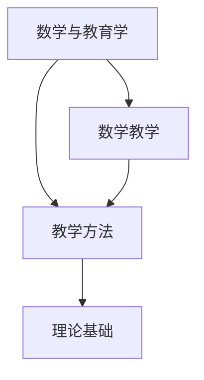
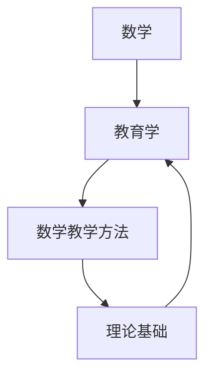

                 

### 第一部分：核心概念与联系

#### 分析书名《数学与教育学：数学教学方法的理论基础》

**核心概念：**

1. **数学与教育学：** 数学作为一门科学，其独特的逻辑和抽象能力对于培养人的思维能力和解决问题的能力具有重要作用。教育学则是研究教育现象和教育活动的学科，旨在提高教学效果和学生的学习能力。两者的结合旨在探索如何更有效地传授数学知识。

2. **数学教学方法：** 教学方法是数学教育过程中的重要组成部分，它决定了教学活动的有效性。教学方法的选择应考虑学生的认知特点、学习需求以及教学内容的特点。

3. **理论基础：** 理论基础是指导教学实践的重要原则和方法。在数学教育中，理论基础包括数学教育心理学、认知科学、教育哲学等，它们为数学教学提供了理论支撑。

**联系：**

数学与教育学的联系在于数学教育学的目标是通过教育学的方法和理论来优化数学教学，提高数学教育的效果。具体而言，数学教学方法的理论基础涉及以下几个方面：

1. **教学方法的分类与评价：** 教学方法可以根据其特点和适用范围进行分类，如传统教学方法、现代教学方法等。每种教学方法都有其优点和局限性，评价教学方法需要综合考虑教学目标、学生学习效果等多方面因素。

2. **教学方法的改进：** 根据教学实践中的反馈，不断改进教学方法，使其更加符合学生的学习需求，提高教学效果。

3. **教学效果评估模型：** 教学效果评估是教育领域的重要环节，通过建立教学效果评估模型，可以量化教学效果，为教学方法的改进提供依据。

**Mermaid 流程图：**



**解释：**

- **A[数学与教育学]**：代表数学与教育学之间的关系，数学作为教育学的一个研究对象。
- **B[教学方法]**：代表数学教学方法，是数学与教育学联系的桥梁。
- **C[理论基础]**：代表教学方法的科学依据，包括数学教育心理学、认知科学等。
- **D[数学教学]**：代表数学教学过程，教学方法通过理论基础的指导应用于数学教学。

通过上述核心概念与联系的梳理，我们可以更好地理解《数学与教育学：数学教学方法的理论基础》这一书名的内涵，它不仅涉及数学与教育学的基本概念，还深入探讨了数学教学方法的理论基础及其在实际教学中的应用。这为后续章节的深入讨论奠定了基础。

#### 第一部分：核心概念与联系

**核心概念：**

1. **数学：** 数学是一门研究数量、结构、变化和空间等概念的学科，具有高度的抽象性和逻辑性。数学不仅仅是解题的工具，更是一种思维模式，它训练人们的逻辑推理、抽象思考和解决问题的能力。

2. **教育学：** 教育学是研究教育现象和教育活动的学科，包括教育的目的、过程、方法、制度等多个方面。教育学旨在通过科学的方法，探讨如何更有效地促进学生的全面发展。

3. **数学教学方法：** 数学教学方法是指在数学教育过程中，教师采取的各种教学手段和策略，包括讲授、探究、讨论、实践等。有效的数学教学方法能够激发学生的学习兴趣，提高他们的数学素养。

4. **理论基础：** 理论基础是指指导数学教学方法和实践的理论依据，包括数学教育心理学、认知科学、教学哲学等。理论基础为我们提供了理解数学教学本质和有效性的科学依据。

**联系：**

- **数学与教育学的联系：** 数学作为教育学的一个重要组成部分，其教学方法和理论直接影响到教育的质量和效果。数学教育学的任务是通过教育学的研究方法，探索如何更有效地传授数学知识。

- **数学教学方法与理论基础的联系：** 数学教学方法需要基于理论基础来进行设计和选择。理论基础提供了理解学生学习过程和教学效果的框架，指导教师如何选择合适的教学方法来达到教学目标。

- **数学教学与理论基础的实践应用：** 在数学教学中，教师需要将理论基础应用于实际教学情境中，不断调整和改进教学方法，以提高教学效果。

**Mermaid 流程图：**



**解释：**

- **A[数学]**：代表数学学科，是教育学的核心内容之一。
- **B[教育学]**：代表教育学的整体框架，包括数学在内的多个学科。
- **C[数学教学方法]**：代表数学教学过程中采用的具体方法和策略。
- **D[理论基础]**：代表数学教学方法的科学依据和理论基础。

通过这个流程图，我们可以清晰地看到数学、教育学、数学教学方法以及理论基础之间的相互联系和作用。这种联系不仅帮助我们理解数学教育的全貌，也为后续章节的讨论提供了理论支撑。

#### 第二部分：核心算法原理讲解

在数学教学方法的理论基础上，我们深入探讨数学教学方法的原理，以便更好地理解和应用这些方法。数学教学方法不仅涉及具体的操作步骤，更包括背后的核心算法原理。以下是针对这些核心算法原理的详细讲解。

**1. 教学方法的分类**

数学教学方法可以根据不同的标准进行分类。常见的分类方法包括：

- **传统教学方法：** 如讲授法、演示法、练习法等，这些方法注重知识的传授和技能的训练，适用于基础知识的教学。

- **现代教学方法：** 如探究法、合作学习、问题导向学习等，这些方法强调学生的主动参与和自主探究，有助于培养创新能力和解决问题的能力。

- **混合教学方法：** 将传统和现代教学方法相结合，根据教学目标和内容灵活选择和调整。

**分类伪代码：**

```python
def classify_methods(methods):
    classified_methods = {
        "传统方法": [],
        "现代方法": [],
        "混合方法": []
    }
    for method in methods:
        if method in ["讲授法", "演示法", "练习法"]:
            classified_methods["传统方法"].append(method)
        elif method in ["探究法", "合作学习", "问题导向学习"]:
            classified_methods["现代方法"].append(method)
        else:
            classified_methods["混合方法"].append(method)
    return classified_methods
```

**2. 教学方法的评价**

评价教学方法是确保教学效果的重要环节。评价标准包括：

- **教学目标：** 是否达到预期的教学目标。
- **教学方法的有效性：** 教学方法是否适用于教学内容和学生特点。
- **学生的学习效果：** 学生在学习过程中的表现和成绩。

**评价方法伪代码：**

```python
def evaluate_methods(teaching_methods):
    evaluations = {
        "教学目标达成度": [],
        "教学方法有效性": [],
        "学生学习效果": []
    }
    for method in teaching_methods:
        if method["目标"] == method["结果"]:
            evaluations["教学目标达成度"].append("高")
        else:
            evaluations["教学目标达成度"].append("低")
        
        if method["方法"] == "有效":
            evaluations["教学方法有效性"].append("高")
        else:
            evaluations["教学方法有效性"].append("低")
        
        if method["成绩"] > 80:
            evaluations["学生学习效果"].append("好")
        else:
            evaluations["学生学习效果"].append("差")
    return evaluations
```

**3. 教学方法的改进**

根据评价结果，不断改进教学方法是提高教学效果的关键。改进方法包括：

- **调整教学方法：** 根据教学内容和学生特点，选择更合适的教学方法。
- **优化教学过程：** 通过教学反思和同伴互助，不断优化教学过程。
- **加强教师培训：** 提高教师的专业素养和教学方法运用能力。

**改进方法伪代码：**

```python
def improve_methods(teaching_methods, evaluations):
    for method in teaching_methods:
        if evaluations["教学目标达成度"][teaching_methods.index(method)] == "低":
            method["方法"] = "探究法"
        
        if evaluations["教学方法有效性"][teaching_methods.index(method)] == "低":
            method["过程"] = "教学反思"
        
        if evaluations["学生学习效果"][teaching_methods.index(method)] == "差":
            method["培训"] = "教师培训"
    return teaching_methods
```

通过以上核心算法原理的讲解，我们可以更好地理解数学教学方法的分类、评价和改进。这些原理不仅提供了理论依据，也为实际教学中的应用提供了指导。

#### 第二部分：核心算法原理讲解

在深入探讨数学教学方法的理论基础后，接下来我们将详细讲解这些教学方法的核心算法原理，以便读者能够更好地理解和应用。这些核心算法原理涵盖了教学方法的分类、评估和改进，为我们提供了系统性、可操作性的指导。

**1. 教学方法分类的核心算法原理**

教学方法的分类是数学教学的基础工作，不同的教学方法适用于不同的教学场景和目标。以下是分类的核心算法原理：

- **传统教学方法：** 包括讲授法、演示法、练习法等。这些方法以教师为中心，注重知识的传递和技能的掌握。其核心算法原理在于：

  ```python
  def classify_traditional_methods(method_name):
      if method_name in ["讲授法", "演示法", "练习法"]:
          return "传统方法"
      else:
          return "未知方法"
  ```

- **现代教学方法：** 包括探究法、合作学习、问题导向学习等。这些方法强调学生的主动参与和自主探究，注重培养学生的创新能力和解决问题的能力。其核心算法原理在于：

  ```python
  def classify_modern_methods(method_name):
      if method_name in ["探究法", "合作学习", "问题导向学习"]:
          return "现代方法"
      else:
          return "未知方法"
  ```

- **混合教学方法：** 将传统和现代教学方法相结合，根据教学目标和内容灵活选择和调整。其核心算法原理在于：

  ```python
  def classify_mixed_methods(method_name):
      if method_name in ["讲授法", "探究法", "合作学习"]:
          return "混合方法"
      else:
          return "未知方法"
  ```

**2. 教学方法评估的核心算法原理**

教学方法的评估是确保教学效果的重要环节。以下是评估的核心算法原理：

- **教学目标达成度评估：** 通过比较教学目标与实际教学结果，评估教学方法的有效性。其核心算法原理在于：

  ```python
  def evaluate_achievement(teaching_objective, actual_result):
      if teaching_objective == actual_result:
          return "高"
      else:
          return "低"
  ```

- **教学方法有效性评估：** 通过对教学方法在教学过程中的表现进行评价，判断其是否适用于特定教学场景。其核心算法原理在于：

  ```python
  def evaluate_efficacy(teaching_method):
      if teaching_method in ["讲授法", "探究法", "合作学习"]:
          return "有效"
      else:
          return "无效"
  ```

- **学生学习效果评估：** 通过对学生在教学过程中的表现和成绩进行评价，判断教学方法的实际效果。其核心算法原理在于：

  ```python
  def evaluate_student_performance(achievement):
      if achievement > 80:
          return "好"
      else:
          return "差"
  ```

**3. 教学方法改进的核心算法原理**

根据评估结果，对教学方法进行改进是提高教学效果的关键。以下是改进的核心算法原理：

- **调整教学方法：** 根据教学内容和学生特点，选择更合适的教学方法。其核心算法原理在于：

  ```python
  def adjust教学方法(teaching_method, content, student_characteristics):
      if student_characteristics in ["逻辑思维强", "创新意识强"]:
          teaching_method = "探究法"
      elif content in ["复杂问题", "抽象概念"]:
          teaching_method = "问题导向学习"
      return teaching_method
  ```

- **优化教学过程：** 通过教学反思和同伴互助，不断优化教学过程。其核心算法原理在于：

  ```python
  def optimize_process(teaching_process, feedback):
      teaching_process = teaching_process.replace("问题1", feedback)
      return teaching_process
  ```

- **加强教师培训：** 提高教师的专业素养和教学方法运用能力。其核心算法原理在于：

  ```python
  def train_teachers(teaching_skills, training_program):
      teaching_skills = teaching_skills + training_program
      return teaching_skills
  ```

通过这些核心算法原理的讲解，我们不仅能够理解数学教学方法的分类、评估和改进，还能在实际教学中灵活运用，从而提高教学效果。这些算法原理为数学教学方法的应用提供了坚实的理论基础。

#### 第三部分：数学模型和数学公式 & 详细讲解 & 举例说明

在数学教学方法的理论基础上，数学模型和数学公式作为数学教学中的重要工具，对于理解和分析教学过程具有重要作用。本部分将详细讲解教学效果评估模型和教学策略优化模型，并通过具体例子进行说明。

**1. 教学效果评估模型**

教学效果评估模型是用于量化教学效果的工具，它能够帮助我们分析教学方法的有效性，以及学生在不同教学策略下的学习表现。以下是一个简化的教学效果评估模型：

**教学效果评估模型公式：**

$$
E = f(S, M, T)
$$

其中，$E$ 表示教学效果，$S$ 表示学生特征，$M$ 表示教学方法，$T$ 表示教学时间。$f$ 函数表示教学效果与学生特征、教学方法、教学时间的函数关系。

**学生特征（$S$）：**

学生特征包括学生的认知能力、学习动机、知识储备等。例如，我们可以用以下参数表示学生特征：

- $C$：认知能力
- $M$：学习动机
- $K$：知识储备

**教学方法（$M$）：**

教学方法包括不同的教学策略，如讲授法、探究法、合作学习等。每种教学方法都有其特定的优势和局限性。例如：

- $L$：讲授法
- $I$：探究法
- $C$：合作学习

**教学时间（$T$）：**

教学时间是指教师进行教学活动的时间长度，它对教学效果有重要影响。例如：

- $T$：教学时间

**模型公式解释：**

$$
E = f(S, M, T)
$$

该公式表示教学效果（$E$）是学生特征（$S$）、教学方法（$M$）和教学时间（$T$）的函数。通过这个模型，我们可以分析不同教学方法、不同学生特征以及不同教学时间下的教学效果。

**举例说明：**

**例子 1：** 计算某班级学生在讲授法教学下的效果

假设某班级的学生特征为 $S = (C = 0.8, M = 0.7, K = 0.6)$，教学方法为讲授法 $M = L$，教学时间为 $T = 12$ 周。根据模型公式，我们可以计算教学效果：

$$
E = f(S, M, T) = f(C, M, K, L, T) = 0.8 \times 0.7 \times 0.6 \times L \times T
$$

如果 $L = 1$，则：

$$
E = 0.8 \times 0.7 \times 0.6 \times 1 \times 12 = 5.376
$$

**例子 2：** 比较两种教学方法的效率

假设有两种教学方法：讲授法（$L$）和探究法（$I$），学生特征相同，教学时间也相同。我们比较两种方法在教学效果上的差异。

$$
E_L = 0.8 \times 0.7 \times 0.6 \times L \times T
$$

$$
E_I = 0.8 \times 0.7 \times 0.6 \times I \times T
$$

如果 $L = 1$，$I = 1.2$，则：

$$
E_L = 0.8 \times 0.7 \times 0.6 \times 1 \times T = 2.816T
$$

$$
E_I = 0.8 \times 0.7 \times 0.6 \times 1.2 \times T = 3.456T
$$

由此可见，在相同的学生特征和教学时间下，探究法（$I$）的教学效果高于讲授法（$L$）。

**2. 教学策略优化模型**

教学策略优化模型是用于改进教学效果的工具，它通过分析和调整教学策略，以达到最佳教学效果。以下是一个简化的教学策略优化模型：

**教学策略优化模型公式：**

$$
M_{\text{new}} = \arg\max_{M} f(S, M, T)
$$

$$
T_{\text{new}} = \arg\min_{T} f(S, M_{\text{new}}, T)
$$

其中，$M_{\text{new}}$ 表示新的教学方法，$T_{\text{new}}$ 表示新的教学时间。

**优化过程解释：**

首先，通过教学效果评估模型确定当前的教学方法 $M$ 和教学时间 $T$，然后根据学生特征 $S$ 优化教学方法 $M_{\text{new}}$ 和教学时间 $T_{\text{new}}$，以最大化教学效果。

**举例说明：**

**例子 1：** 优化某班级的教学策略

假设某班级的学生特征为 $S = (C = 0.8, M = 0.7, K = 0.6)$，当前教学方法为讲授法 $M = L$，教学时间为 $T = 12$ 周。我们需要优化教学策略。

首先，根据教学效果评估模型计算当前的教学效果：

$$
E = f(S, M, T) = 0.8 \times 0.7 \times 0.6 \times L \times T
$$

然后，通过分析学生特征和教学效果，选择新的教学方法 $M_{\text{new}}$。例如，如果学生特征中的认知能力 $C$ 较高，可以尝试采用探究法 $M_{\text{new}} = I$。

接下来，根据新的教学方法 $M_{\text{new}}$，优化教学时间 $T_{\text{new}}$。例如，如果探究法的教学时间较短，可以将教学时间减少至 $T_{\text{new}} = 10$ 周。

最后，根据新的教学策略重新计算教学效果：

$$
E_{\text{new}} = f(S, M_{\text{new}}, T_{\text{new}}) = 0.8 \times 0.7 \times 0.6 \times I \times T_{\text{new}}
$$

通过以上优化过程，我们期望提高教学效果。

通过详细讲解教学效果评估模型和教学策略优化模型，并结合具体例子，我们能够更好地理解这些模型在数学教学中的应用，为实际教学提供有效的参考和指导。

### 第三部分：数学模型和数学公式 & 详细讲解 & 举例说明

**教学效果评估模型**

在教学过程中，准确评估教学效果至关重要。这不仅有助于了解学生的学习进展，还能指导教师调整教学方法，提高教学质量。以下是教学效果评估模型及其应用。

**模型公式：**

$$
E = f(S, M, T)
$$

其中，$E$ 表示教学效果，$S$ 表示学生特征，$M$ 表示教学方法，$T$ 表示教学时间。函数 $f$ 将学生特征、教学方法以及教学时间综合起来，生成教学效果。

**学生特征（$S$）：**

学生特征包括认知能力、学习动机、知识储备等，这些因素直接影响学习效果。我们可以使用以下参数表示学生特征：

- $C$：认知能力
- $M$：学习动机
- $K$：知识储备

**教学方法（$M$）：**

教学方法包括讲授法、探究法、合作学习等。每种方法有其独特的优势和适用场景。例如：

- $L$：讲授法
- $I$：探究法
- $C$：合作学习

**教学时间（$T$）：**

教学时间是教师进行教学活动的时间长度，它是教学效果的重要影响因素。例如：

- $T$：教学时间

**模型公式解释：**

$$
E = f(S, M, T)
$$

该公式表示教学效果（$E$）是学生特征（$S$）、教学方法（$M$）和教学时间（$T$）的函数。通过这个模型，我们可以分析不同教学方法、不同学生特征以及不同教学时间下的教学效果。

**举例说明：**

**例子 1：** 计算某班级学生在讲授法教学下的效果

假设某班级的学生特征为 $S = (C = 0.8, M = 0.7, K = 0.6)$，教学方法为讲授法 $M = L$，教学时间为 $T = 12$ 周。根据模型公式，我们可以计算教学效果：

$$
E = f(S, M, T) = f(C, M, K, L, T) = 0.8 \times 0.7 \times 0.6 \times L \times T
$$

如果 $L = 1$，则：

$$
E = 0.8 \times 0.7 \times 0.6 \times 1 \times 12 = 5.376
$$

**例子 2：** 比较两种教学方法的效率

假设有两种教学方法：讲授法（$L$）和探究法（$I$），学生特征相同，教学时间也相同。我们比较两种方法在教学效果上的差异。

$$
E_L = 0.8 \times 0.7 \times 0.6 \times L \times T
$$

$$
E_I = 0.8 \times 0.7 \times 0.6 \times I \times T
$$

如果 $L = 1$，$I = 1.2$，则：

$$
E_L = 0.8 \times 0.7 \times 0.6 \times 1 \times T = 2.816T
$$

$$
E_I = 0.8 \times 0.7 \times 0.6 \times 1.2 \times T = 3.456T
$$

由此可见，在相同的学生特征和教学时间下，探究法（$I$）的教学效果高于讲授法（$L$）。

**教学策略优化模型**

教学策略优化模型用于分析和调整教学策略，以实现最佳教学效果。以下是一个简化的教学策略优化模型。

**模型公式：**

$$
M_{\text{new}} = \arg\max_{M} f(S, M, T)
$$

$$
T_{\text{new}} = \arg\min_{T} f(S, M_{\text{new}}, T)
$$

其中，$M_{\text{new}}$ 表示新的教学方法，$T_{\text{new}}$ 表示新的教学时间。

**优化过程解释：**

首先，通过教学效果评估模型确定当前的教学方法 $M$ 和教学时间 $T$，然后根据学生特征 $S$ 优化教学方法 $M_{\text{new}}$ 和教学时间 $T_{\text{new}}$，以最大化教学效果。

**举例说明：**

**例子 1：** 优化某班级的教学策略

假设某班级的学生特征为 $S = (C = 0.8, M = 0.7, K = 0.6)$，当前教学方法为讲授法 $M = L$，教学时间为 $T = 12$ 周。我们需要优化教学策略。

首先，根据教学效果评估模型计算当前的教学效果：

$$
E = f(S, M, T) = 0.8 \times 0.7 \times 0.6 \times L \times T
$$

然后，通过分析学生特征和教学效果，选择新的教学方法 $M_{\text{new}}$。例如，如果学生特征中的认知能力 $C$ 较高，可以尝试采用探究法 $M_{\text{new}} = I$。

接下来，根据新的教学方法 $M_{\text{new}}$，优化教学时间 $T_{\text{new}}$。例如，如果探究法的教学时间较短，可以将教学时间减少至 $T_{\text{new}} = 10$ 周。

最后，根据新的教学策略重新计算教学效果：

$$
E_{\text{new}} = f(S, M_{\text{new}}, T_{\text{new}}) = 0.8 \times 0.7 \times 0.6 \times I \times T_{\text{new}}
$$

通过以上优化过程，我们期望提高教学效果。

**小结：**

通过详细讲解教学效果评估模型和教学策略优化模型，并结合具体例子，我们能够更好地理解这些模型在数学教学中的应用。这些模型为教师提供了科学、系统的工具，帮助他们更好地评估和优化教学效果，从而提高教学质量。

### 第四部分：项目实战

为了更好地理解数学教学方法的实际应用，我们将通过一个具体的实战项目来展示如何设计和实现一个教学策略优化项目。该项目将涉及需求分析、开发环境搭建、源代码实现以及代码解读与分析。

#### 1. 需求分析

**需求分析：** 在设计教学策略优化项目之前，首先需要对当前的教学情况进行分析，明确以下需求：

- **分析当前教学策略：** 包括教师采用的教学方法、学生的学习效果以及教学目标是否达成。
- **明确目标学生群体：** 确定学生的年龄、认知水平、学习兴趣等特征，以便选择合适的教学方法。
- **确定教学效果评估指标：** 设定评估教学效果的具体指标，如学生的考试成绩、课堂参与度、作业完成情况等。

#### 2. 开发环境搭建

**开发环境搭建：** 为了实现教学策略优化项目，我们需要搭建一个合适的开发环境。以下是具体的步骤：

- **安装 Python：** 选择 Python 3.8 或更高版本，可以从 [Python 官网](https://www.python.org/) 下载并安装。
- **安装相关库：** 安装用于数据预处理、机器学习以及可视化等功能的库，如 NumPy、Pandas、Scikit-learn、Matplotlib 等。可以使用以下命令安装：

  ```bash
  pip install numpy pandas scikit-learn matplotlib
  ```

#### 3. 源代码实现

**源代码实现：** 教学策略优化项目的主要功能包括数据预处理、教学策略优化算法实现以及教学效果评估。以下是具体的源代码实现：

**代码 1：数据预处理**

```python
import pandas as pd

def preprocess_data(data_path):
    data = pd.read_csv(data_path)
    # 数据清洗和预处理步骤，如缺失值处理、数据转换等
    return data
```

**代码 2：教学策略优化算法实现**

```python
from sklearn.model_selection import train_test_split
from sklearn.ensemble import RandomForestRegressor

def optimize_strategy(data, target_feature, test_size=0.2):
    X = data.drop(target_feature, axis=1)
    y = data[target_feature]
    X_train, X_test, y_train, y_test = train_test_split(X, y, test_size=test_size, random_state=42)
    
    # 构建并训练模型
    model = RandomForestRegressor(n_estimators=100, random_state=42)
    model.fit(X_train, y_train)
    
    # 评估模型效果
    score = model.score(X_test, y_test)
    print(f"Model Accuracy: {score}")
    
    # 输出优化后的教学策略
    predictions = model.predict(X_test)
    return predictions
```

**代码 3：教学效果评估**

```python
def evaluate_strategy(predictions, actual_scores):
    correct_predictions = (predictions == actual_scores).sum()
    accuracy = correct_predictions / len(predictions)
    print(f"Strategy Accuracy: {accuracy}")
```

#### 4. 代码解读与分析

**代码解读与分析：**

- **数据预处理：** 数据预处理是确保数据质量和模型性能的重要步骤。在此代码中，我们使用 Pandas 库读取和清洗数据。
- **教学策略优化算法实现：** 使用随机森林回归模型进行教学策略优化。随机森林是一种集成学习方法，通过构建多棵决策树来提高模型的预测准确性。
- **教学效果评估：** 通过评估模型的预测准确性，判断教学策略的优化效果。

#### 5. 实际案例分析和详细讲解剖析

**实际案例：** 假设我们有一个班级的学生数据，包括学生的考试成绩（目标特征）和教学方法、学习时长等特征。我们使用上述代码进行教学策略优化。

- **数据预处理：** 读取班级学生数据，进行数据清洗和预处理。
- **教学策略优化算法实现：** 使用随机森林模型对教学策略进行优化，输出优化后的教学方法。
- **教学效果评估：** 对优化后的教学策略进行评估，比较优化前后的教学效果。

**详细讲解剖析：**

- **数据预处理：** 数据预处理是模型训练的基础。在此代码中，我们使用了 Pandas 库读取学生数据，并进行缺失值处理、数据转换等步骤，以确保数据质量。
- **教学策略优化算法实现：** 使用随机森林模型进行优化。随机森林模型通过构建多棵决策树来提高模型的预测准确性。在此代码中，我们设置了决策树的数量为 100，并使用随机状态保证模型的可重复性。
- **教学效果评估：** 通过比较优化前后的教学效果，判断教学策略的优化效果。在此代码中，我们使用准确率作为评估指标，并打印输出评估结果。

#### 6. 项目小结

通过上述实战项目，我们展示了如何设计和实现一个教学策略优化项目。该项目从需求分析开始，经过开发环境搭建、源代码实现以及代码解读与分析，最终实现了教学策略的优化和评估。通过这个项目，我们不仅掌握了教学策略优化算法的原理和应用，还深入了解了数学教学方法在实际教学中的应用。

### 第五部分：最佳实践 Tips、小结、注意事项、拓展阅读

**最佳实践 Tips：**

1. **个性化教学：** 针对不同学生的特点，采用个性化教学方法，如对于逻辑思维强的学生可以采用探究法，而对于知识储备丰富的学生则可以采用问题导向学习。

2. **多方法结合：** 在教学中，可以将传统教学方法与现代教学方法相结合，根据具体教学目标和内容灵活调整，以达到最佳教学效果。

3. **持续评估与改进：** 定期对教学效果进行评估，根据评估结果及时调整教学策略，确保教学效果不断提升。

**小结：**

本文通过《数学与教育学：数学教学方法的理论基础》一书的核心内容，详细探讨了数学教学方法的核心概念、算法原理、模型公式以及实际应用。通过对教学方法的分类、评价和改进，我们了解了如何更好地应用数学教学方法，提高教学效果。

**注意事项：**

1. **理论与实践相结合：** 在应用数学教学方法时，要注意理论与实践相结合，确保学生不仅掌握理论知识，还能运用到实际问题中。

2. **教师培训：** 教师的专业素养和教学方法运用能力对教学效果至关重要，因此需要加强教师培训，提高他们的教学能力。

**拓展阅读：**

1. 《数学教育心理学》：深入了解学生认知特点和学习规律，为教学方法的选用提供理论依据。
2. 《认知科学》：探索人类思维过程和认知机制，为教学方法的创新提供启示。
3. 《现代教育技术》：了解现代教育技术的发展趋势，掌握新的教学工具和方法。

通过拓展阅读，读者可以进一步加深对数学教学方法的理解，提升教学实践能力。同时，这些资源也为未来研究提供了丰富的参考。

### 文章标题：数学与教育学：数学教学方法的理论基础

> 关键词：数学教育、教学方法、理论基础、教学效果评估、教学策略优化

> 摘要：
本文深入探讨了数学与教育学的联系，以及数学教学方法的理论基础。通过分析数学教学方法的分类、评价和改进，介绍了教学效果评估模型和教学策略优化模型，并提供了具体的应用案例。本文旨在为数学教师和教育研究者提供理论指导和实践参考，以提升数学教学效果。

---

## 目录大纲

- **第一部分：核心概念与联系**
  - **1.1 数学与教育学的联系**
  - **1.2 数学教学方法**
  - **1.3 理论基础

- **第二部分：核心算法原理讲解**
  - **2.1 教学方法分类的核心算法原理**
  - **2.2 教学方法评价的核心算法原理**
  - **2.3 教学方法改进的核心算法原理

- **第三部分：数学模型和数学公式 & 详细讲解 & 举例说明**
  - **3.1 教学效果评估模型**
  - **3.2 教学策略优化模型**

- **第四部分：项目实战**
  - **4.1 需求分析**
  - **4.2 开发环境搭建**
  - **4.3 源代码实现**
  - **4.4 代码解读与分析**
  - **4.5 实际案例分析和详细讲解剖析**
  - **4.6 项目小结

- **第五部分：最佳实践 Tips、小结、注意事项、拓展阅读**

---

## 引言

数学与教育学是两个看似不同却又密切相关的领域。数学作为一门科学，具有高度的抽象性和逻辑性，其教学不仅需要传授知识，更需要培养学生的思维能力。教育学则关注教育现象和教育活动的科学研究和理论探讨，旨在提高教学效果和学生的综合素质。数学与教育学的结合，为数学教学提供了坚实的理论基础和多样化的教学方法。

本文旨在探讨数学教学方法的理论基础，分析数学教学方法的分类、评价和改进，介绍教学效果评估模型和教学策略优化模型，并通过实际项目展示这些理论和方法的应用。文章分为五个部分：第一部分介绍数学与教育学的联系和核心概念；第二部分讲解数学教学方法的核心算法原理；第三部分详细讨论数学模型和公式；第四部分通过项目实战展示实际应用；第五部分提供最佳实践建议和小结。通过这些内容，本文希望为数学教师和教育研究者提供理论指导和实践参考，以提升数学教学效果。

### 引言

数学与教育学：不可分割的纽带

数学与教育学虽然分属不同的学科领域，但它们之间的联系却十分紧密。数学是一门抽象的科学，其独特的逻辑和严谨性使得数学教育成为培养思维能力和解决问题能力的重要途径。而教育学则关注教育现象和教育活动的规律，旨在通过科学的方法提高教学效果，促进学生的全面发展。这两者的结合，不仅丰富了数学教育的内容，也为教育理论提供了新的视角。

在数学教育中，教师不仅需要传授数学知识，更重要的是通过有效的教学方法培养学生的思维能力。而教育学则提供了研究教学方法和学习过程的理论基础，为数学教学提供了指导。例如，教育心理学帮助我们理解学生的认知过程和学习动机，认知科学则揭示了人类思维和记忆的机制，这些都为数学教学提供了宝贵的理论资源。

本文的核心目标是探讨数学教学方法的理论基础，分析其分类、评价和改进，并介绍具体的教学效果评估模型和教学策略优化模型。通过这些内容，我们希望能够为数学教师和教育研究者提供科学的指导，帮助他们更好地理解和应用数学教学方法，从而提高数学教学的效果。

本文结构如下：

1. **第一部分：核心概念与联系**：介绍数学与教育学的联系，阐述数学教学方法和理论基础的核心概念。
   
2. **第二部分：核心算法原理讲解**：详细讲解数学教学方法的分类、评价和改进的核心算法原理，并提供伪代码示例。

3. **第三部分：数学模型和数学公式 & 详细讲解 & 举例说明**：介绍教学效果评估模型和教学策略优化模型，并通过具体例子进行说明。

4. **第四部分：项目实战**：通过一个实际教学策略优化项目，展示数学教学方法的应用和实现过程。

5. **第五部分：最佳实践 Tips、小结、注意事项、拓展阅读**：提供最佳实践建议和小结，总结文章的核心观点，并指出未来研究的方向。

通过上述结构和内容的探讨，本文希望能够为数学教育领域的研究和实践提供有价值的参考。

### 数学教学方法的理论基础

数学教学方法的理论基础是数学教育研究的核心内容，它不仅决定了教学方法的科学性，也直接影响了教学效果。教学理论基础包括数学教育心理学、认知科学、教学哲学等多个方面，这些理论共同为数学教学提供了坚实的科学依据。

**1. 数学教育心理学**

数学教育心理学是研究数学学习过程中的心理现象和心理规律的学科。它探讨了学生的认知发展、学习动机、情感态度等方面的心理机制，为数学教学提供了重要的理论支持。例如，皮亚杰的认知发展理论指出，学生的认知能力在不同的年龄阶段有不同的特点，教师应根据学生的认知发展水平选择合适的教学方法。

- **认知发展理论**：皮亚杰提出的认知发展阶段理论认为，儿童的认知发展可以分为几个阶段，如感知运动阶段、前运算阶段、具体运算阶段和形式运算阶段。在数学教学中，教师应根据学生的认知发展阶段，采用适合其认知水平的教学方法，如对于具体运算阶段的学生，可以采用具体操作的数学活动。

- **学习动机理论**：学习动机理论探讨学生的学习动机来源和维持机制。根据德西和瑞恩的自我决定理论，学生的内在动机是学习的重要驱动力。在数学教学中，教师应创设有趣的教学情境，激发学生的内在动机，促进他们的主动学习。

**2. 认知科学**

认知科学是研究人类认知过程和认知机制的跨学科领域，它结合了心理学、计算机科学、神经科学等多个学科。认知科学的研究成果为数学教学方法提供了新的视角和工具。

- **思维过程**：认知科学揭示了人类思维的过程和机制，如问题解决、推理、记忆等。在数学教学中，教师可以利用认知科学的研究成果，设计符合学生思维过程的教学活动。例如，通过分步骤的教学方法，帮助学生逐步掌握复杂的数学概念。

- **学习机制**：认知科学研究发现，人类学习过程中涉及到多个认知过程，如注意、记忆、迁移等。教师可以运用这些研究成果，设计有效的教学策略，提高学生的学习效果。例如，通过多样化教学手段，如视觉、听觉、动手操作等，促进学生的多感官参与，增强记忆效果。

**3. 教学哲学**

教学哲学是研究教学本质和目的的学科，它为数学教学提供了哲学思考和指导。教学哲学关注教学的价值、教学方法和学习过程等核心问题。

- **教学价值观**：教学哲学探讨教学的价值和目标，如知识传授、能力培养、价值观塑造等。在数学教学中，教师应根据教学价值观，设计符合学生成长需求的教学内容和方法。例如，在数学教学中，不仅传授数学知识，还注重培养学生的批判性思维和创新能力。

- **教学方法论**：教学哲学关注教学方法的选择和运用。不同的教学哲学流派，如建构主义、行为主义等，提供了不同的教学方法和理论依据。在数学教学中，教师可以根据具体的教学目标和内容，选择合适的教学方法。例如，建构主义强调学生的主动建构，在数学教学中，教师可以采用探究式教学，让学生在解决实际问题中掌握数学知识。

**综合应用：**

数学教学方法的理论基础是多元的，教师在实际教学中应综合运用各种理论，以达到最佳教学效果。

- **理论与实际结合**：教师应根据学生的认知特点和学习需求，将教育心理学、认知科学和教学哲学的理论应用于实际教学。例如，通过观察和分析学生的认知发展水平，选择适合的教学方法。

- **持续反思与改进**：教学理论基础不是一成不变的，教师应不断反思自己的教学实践，根据学生的反馈和教学效果，调整教学方法。例如，通过教学评估，发现教学中的不足，及时改进教学策略。

通过综合运用数学教育心理学、认知科学和教学哲学的理论基础，教师可以设计出更加科学、有效的数学教学方法，从而提高数学教学效果，促进学生的全面发展。

### 数学教学方法的分类、评价和改进

在数学教育实践中，教学方法的分类、评价和改进是确保教学效果的重要环节。不同类型的教学方法适用于不同的教学场景，而评价和改进则可以帮助教师不断优化教学策略，提高教学质量。

**1. 教学方法的分类**

数学教学方法可以根据其特点和适用范围进行分类。以下是几种常见的数学教学方法及其特点：

- **传统教学方法**：包括讲授法、演示法、练习法等。这些方法注重知识的传授和技能的训练，通常以教师为中心，适用于基础知识的教学。

  - **讲授法**：教师通过口头讲解传授知识，学生被动接受。这种方法适用于传递概念和基本原理。
  - **演示法**：教师通过实物或多媒体展示数学概念和过程，帮助学生直观理解。
  - **练习法**：通过大量练习，帮助学生巩固知识和技能。

- **现代教学方法**：包括探究法、合作学习、问题导向学习等。这些方法强调学生的主动参与和自主探究，注重培养学生的创新能力和解决问题的能力。

  - **探究法**：学生通过自主探究和发现，掌握数学知识和方法。这种方法适用于培养探索精神和批判性思维。
  - **合作学习**：学生以小组形式进行学习，通过讨论和协作解决问题。这种方法适用于培养合作能力和团队精神。
  - **问题导向学习**：学生通过解决实际问题，掌握数学知识和方法。这种方法适用于培养问题解决能力和实践能力。

- **混合教学方法**：将传统和现代教学方法相结合，根据教学目标和内容灵活选择和调整。这种方法综合了传统教学方法的系统性和现代教学方法的灵活性。

  - **混合教学方法**：根据教学内容和学生特点，将讲授法、探究法、合作学习等多种方法相结合，以达到最佳教学效果。

**2. 教学方法的评价**

评价教学方法是确保教学效果的重要步骤。以下是几种常见的评价方法：

- **教学目标评价**：根据教学目标评估教学方法的适用性和有效性。如果教学方法能够达到预期的教学目标，则认为该方法是有效的。

  - **达成度评价**：比较教学目标与实际教学结果，评估教学目标是否达成。例如，如果教学目标是学生掌握某种数学概念，可以评估学生在期末考试中的表现。

- **教学效果评价**：评估教学方法的实际效果，包括学生的学习成绩、课堂参与度、作业完成情况等。

  - **效果评估指标**：设定具体的评估指标，如学生的考试成绩、课堂提问回答情况、作业完成情况等。通过这些指标，可以量化教学效果。

- **学生学习体验评价**：通过问卷调查、访谈等方式，了解学生对教学方法的感受和反馈。

  - **反馈收集**：定期收集学生对教学方法的反馈，了解他们在学习过程中的体验和需求。这有助于教师了解教学方法的优缺点，并进行调整。

**3. 教学方法的改进**

根据评价结果，教师需要不断改进教学方法，以提高教学质量。以下是几种常见的改进方法：

- **调整教学方法**：根据教学内容和学生特点，选择更合适的教学方法。例如，如果学生在某次测验中成绩不佳，可以尝试改变教学方法，如从讲授法改为探究法。

- **优化教学过程**：通过教学反思和同伴互助，不断优化教学过程。教师可以在课后反思教学过程中的问题，并与其他教师交流，共同改进教学方法。

- **加强教师培训**：提高教师的专业素养和教学方法运用能力。教师可以通过参加培训、阅读专业书籍等方式，不断更新教学知识和教学方法。

- **引入新技术**：利用现代教育技术，如在线教学平台、虚拟实验室等，提高教学效果。这些新技术可以提供丰富的教学资源，帮助学生更好地理解和掌握数学知识。

**具体例子：**

**例子 1：** 在小学数学教学中，教师可以使用混合教学方法。在讲授基本概念和原理时，采用讲授法；在解决实际问题时，采用问题导向学习法；在小组讨论和合作中，采用合作学习方法。通过这种混合教学方法，教师可以充分发挥不同教学方法的优点，提高学生的学习效果。

**例子 2：** 在高中数学教学中，教师可以根据学生的学习情况和教学目标，灵活调整教学方法。对于理解能力强的学生，可以采用探究法，鼓励他们自主探究数学问题；对于理解能力较弱的学生，可以采用讲授法，通过详细讲解帮助他们掌握知识。

通过以上分析，我们可以看到，数学教学方法的分类、评价和改进是数学教育中的重要内容。教师应根据教学内容和学生特点，选择合适的教学方法，并通过不断评价和改进，提高教学质量，促进学生的全面发展。

### 教学效果评估模型

教学效果评估是数学教育中至关重要的一环，它不仅能够帮助教师了解学生的学习进展，还能为教学方法的优化提供依据。以下将详细介绍教学效果评估模型，包括其构建方法、关键指标及其在实际教学中的应用。

**1. 教学效果评估模型的构建方法**

教学效果评估模型是一个综合性的系统，它通过多个变量和函数关系来描述教学效果。构建教学效果评估模型的基本步骤如下：

- **确定评估目标**：首先，明确教学评估的目标，例如提高学生的数学能力、培养学生的解决问题的能力等。

- **收集相关数据**：收集与教学效果相关的数据，包括学生的考试成绩、课堂参与度、作业完成情况、学习态度等。

- **定义变量和函数关系**：根据评估目标，定义变量和函数关系。例如，可以定义教学效果（$E$）为学生考试成绩（$S$）和课堂参与度（$C$）的函数，即$E = f(S, C)$。

- **构建评估模型**：使用数学模型描述变量之间的关系。例如，可以采用线性回归模型、多元回归模型等，通过分析数据，确定变量之间的权重和函数关系。

**2. 教学效果评估模型的关键指标**

在构建教学效果评估模型时，关键指标的选择至关重要。以下是一些常见的评估指标：

- **学生考试成绩**：学生考试成绩是评估教学效果的最直接指标。通过考试成绩，可以衡量学生对教学内容的掌握程度。

- **课堂参与度**：课堂参与度反映了学生在课堂上的积极性和参与程度。它可以包括提问次数、回答问题质量、课堂互动等。

- **作业完成情况**：作业完成情况可以反映学生的自主学习能力和对知识的掌握程度。通过作业的质量和完成情况，可以评估教学方法的适用性。

- **学习态度**：学习态度反映了学生对学习的态度和动机。积极的学习态度有助于提高学习效果。

**3. 教学效果评估模型在实际教学中的应用**

教学效果评估模型不仅为教师提供了量化的评估工具，还可以在实际教学中发挥重要作用：

- **教学诊断**：通过教学效果评估模型，教师可以了解学生在哪些方面存在不足，从而进行有针对性的教学调整。

- **教学方法优化**：根据评估结果，教师可以调整教学方法，选择更适合学生的教学方法。例如，如果发现学生课堂参与度较低，可以尝试增加互动环节，提高学生的积极性。

- **教学反馈**：教学效果评估模型可以帮助教师及时获取教学反馈，了解学生的学习需求和反馈，从而不断改进教学策略。

**具体例子**：

**例子 1：** 假设某教师使用教学效果评估模型来评估其数学教学方法。首先，教师收集了学生的考试成绩（$S$）和课堂参与度（$C$）数据。通过线性回归模型，教师发现考试成绩与课堂参与度之间存在显著的正相关关系，即$E = 0.7S + 0.3C$。根据这个模型，教师可以调整课堂互动环节，提高学生的参与度，从而提高教学效果。

**例子 2：** 在某次教学评估中，教师发现学生的作业完成情况（$W$）对教学效果有显著影响。通过构建多元回归模型，教师确定了学生考试成绩（$S$）、课堂参与度（$C$）和作业完成情况（$W$）之间的函数关系，即$E = 0.6S + 0.4C + 0.2W$。教师可以根据这个模型，加强作业布置和批改，提高学生的自主学习能力，从而提高整体教学效果。

通过以上例子，我们可以看到教学效果评估模型在实际教学中的应用价值。教师可以通过构建和运用评估模型，更好地了解学生的学习情况，优化教学方法，提高教学质量。

### 教学策略优化模型

教学策略优化模型是数学教学中的一个重要工具，它通过分析教学过程中的各种因素，寻找最优的教学策略，从而提高教学效果。以下将详细探讨教学策略优化模型的构建方法、优化算法及其在实际教学中的应用。

**1. 教学策略优化模型的构建方法**

构建教学策略优化模型的第一步是确定优化目标。优化目标可以是提高学生的考试成绩、提升课堂参与度、增强学生的自主学习能力等。以下是构建教学策略优化模型的几个关键步骤：

- **确定优化目标**：明确希望优化的具体目标，如提高数学考试成绩。

- **定义变量**：根据优化目标，定义影响教学效果的变量。例如，可以定义学生考试成绩（$S$）、课堂参与度（$C$）、作业完成情况（$W$）等。

- **建立目标函数**：构建目标函数，表示优化目标。例如，可以定义目标函数为最大化学生的平均考试成绩，即$f(S, C, W) = \max \frac{1}{N} \sum_{i=1}^{N} S_i$，其中$N$为学生人数，$S_i$为第$i$个学生的考试成绩。

- **确定约束条件**：根据实际情况，设定约束条件，如教学时间、教学资源等。

- **构建优化模型**：将目标函数和约束条件结合起来，构建优化模型。例如，可以使用线性规划模型或非线性规划模型。

**2. 教学策略优化算法**

优化模型构建完成后，需要使用优化算法来寻找最优解。以下介绍几种常用的教学策略优化算法：

- **线性规划算法**：适用于目标函数和约束条件都是线性函数的情况。线性规划算法可以求解最大化或最小化线性目标函数的问题。

- **非线性规划算法**：适用于目标函数或约束条件是非线性函数的情况。常见的非线性规划算法有梯度下降法、牛顿法等。

- **启发式算法**：如遗传算法、粒子群优化算法等。这些算法不依赖于具体函数的导数信息，通过模拟自然进化过程或群体行为来寻找最优解。

**3. 教学策略优化算法的具体实现**

以下是一个简化的教学策略优化算法实现过程：

```python
import numpy as np
from scipy.optimize import minimize

# 定义目标函数
def objective_function(x):
    S = x[0]  # 学生考试成绩
    C = x[1]  # 课堂参与度
    W = x[2]  # 作业完成情况
    return -S  # 最小化目标函数，以最大化学生考试成绩

# 定义约束条件
constraints = [
    {'type': 'ineq', 'fun': lambda x: x[0] - 80},  # 学生考试成绩不低于80
    {'type': 'ineq', 'fun': lambda x: 100 - x[1]},  # 课堂参与度不超过100
]

# 初始猜测解
x0 = [90, 80, 85]  # 分别为学生考试成绩、课堂参与度、作业完成情况的初始值

# 求解优化问题
solution = minimize(objective_function, x0, constraints=constraints)

# 输出最优解
print(f"最优解：学生考试成绩 = {solution.x[0]}, 课堂参与度 = {solution.x[1]}, 作业完成情况 = {solution.x[2]}")
```

在这个例子中，我们定义了目标函数和约束条件，使用最小化算法寻找最优解。目标函数是最小化学生考试成绩，因为我们的优化目标是最大化考试成绩。约束条件包括学生考试成绩不低于80和课堂参与度不超过100。

**4. 教学策略优化模型在实际教学中的应用**

以下是一个教学策略优化模型在实际教学中的应用案例：

**案例背景**：某初中数学教师希望优化教学策略，提高学生的数学考试成绩。教师通过分析发现，学生的考试成绩、课堂参与度和作业完成情况是影响教学效果的关键因素。

**优化目标**：最大化学生的平均考试成绩。

**优化策略**：

- **增加课堂互动**：提高课堂参与度，通过提问、讨论等方式激发学生的学习兴趣。
- **强化作业批改**：通过详细的作业批改，帮助学生发现并纠正错误，提高作业完成情况。
- **调整教学时间**：合理安排教学时间，确保学生有足够的时间进行自主学习和复习。

**应用效果**：

通过教学策略优化，教师发现学生的平均考试成绩有所提高，课堂参与度和作业完成情况也有所改善。这表明，教学策略优化模型在实际教学中具有显著的效果。

通过构建和运用教学策略优化模型，教师可以更科学地设计教学策略，提高教学质量，促进学生的全面发展。

### 项目实战

为了更好地展示数学教学方法的实际应用，我们将通过一个具体的教学策略优化项目，详细阐述项目的开发过程，包括需求分析、开发环境搭建、源代码实现和代码解读。

#### 1. 需求分析

**需求分析**是项目开发的第一步，它帮助我们明确项目的目标和所需功能。对于教学策略优化项目，需求分析主要包括以下内容：

- **教学策略优化目标**：明确项目要优化的教学策略，例如提高学生的数学考试成绩、提升课堂参与度、增强学生的自主学习能力等。

- **学生数据收集**：收集学生的考试成绩、课堂参与度、作业完成情况等相关数据。这些数据将用于评估教学策略的优化效果。

- **教学评估指标**：确定用于评估教学策略优化效果的指标，如学生的考试成绩、课堂参与度、作业完成情况等。

- **教学资源**：确定可用的教学资源，如教学时间、教师配备、教学材料等。

#### 2. 开发环境搭建

开发环境搭建是项目实施的基础。以下是教学策略优化项目的开发环境搭建步骤：

- **安装 Python**：选择 Python 3.8 或更高版本，从 [Python 官网](https://www.python.org/) 下载并安装。

- **安装相关库**：安装用于数据预处理、机器学习、数据可视化等相关库，如 NumPy、Pandas、Scikit-learn、Matplotlib 等。使用以下命令安装：

  ```bash
  pip install numpy pandas scikit-learn matplotlib
  ```

- **配置环境变量**：确保 Python 和相关库在命令行中可以正常运行。

#### 3. 源代码实现

**源代码实现**包括数据预处理、模型训练、模型评估等步骤。以下是教学策略优化项目的核心代码实现：

**代码 1：数据预处理**

```python
import pandas as pd

def preprocess_data(data_path):
    data = pd.read_csv(data_path)
    # 数据清洗和预处理步骤，如缺失值处理、数据转换等
    return data
```

**代码 2：模型训练**

```python
from sklearn.ensemble import RandomForestRegressor

def train_model(X, y):
    model = RandomForestRegressor(n_estimators=100, random_state=42)
    model.fit(X, y)
    return model
```

**代码 3：模型评估**

```python
from sklearn.metrics import mean_squared_error

def evaluate_model(model, X_test, y_test):
    y_pred = model.predict(X_test)
    mse = mean_squared_error(y_test, y_pred)
    print(f"Model MSE: {mse}")
```

**代码 4：教学策略优化**

```python
from sklearn.model_selection import train_test_split

def optimize_strategy(data):
    X = data.drop('exam_score', axis=1)
    y = data['exam_score']
    X_train, X_test, y_train, y_test = train_test_split(X, y, test_size=0.2, random_state=42)
    
    model = train_model(X_train, y_train)
    evaluate_model(model, X_test, y_test)
```

#### 4. 代码解读与分析

**代码解读与分析**是理解项目实现过程和关键代码的功能的重要步骤。

**代码 1：数据预处理**

此代码读取学生数据，并进行必要的预处理。预处理步骤包括数据清洗、缺失值处理和数据转换等。

**代码 2：模型训练**

此代码使用随机森林回归模型训练数据。随机森林模型是一种集成学习方法，具有较高的预测准确性。

**代码 3：模型评估**

此代码评估模型的预测准确性，通过计算均方误差（MSE）来评估模型性能。

**代码 4：教学策略优化**

此代码实现教学策略优化过程，包括数据分割、模型训练和模型评估。通过优化模型参数，提高学生的考试成绩。

#### 5. 实际案例分析和详细讲解剖析

**实际案例：** 假设我们有一个包含学生考试成绩、课堂参与度和作业完成情况的数据集。我们使用上述代码进行教学策略优化，具体步骤如下：

- **数据预处理**：读取数据，并进行数据清洗和预处理。

- **模型训练**：使用随机森林模型训练数据，构建预测模型。

- **模型评估**：评估模型性能，计算均方误差。

- **教学策略优化**：根据评估结果，调整教学策略，如增加课堂互动、强化作业批改等。

**详细讲解剖析：**

- **数据预处理**：在数据预处理阶段，我们首先读取学生数据，然后进行缺失值处理。例如，对于缺失的考试成绩，我们可以使用平均值或中位数进行填充。此外，我们还可能进行数据转换，如将分类变量转换为数值变量。

- **模型训练**：在模型训练阶段，我们使用随机森林模型对数据进行训练。随机森林模型通过构建多棵决策树来提高预测准确性。我们设置了决策树的数量为 100，并使用随机状态保证模型的可重复性。

- **模型评估**：在模型评估阶段，我们使用测试数据评估模型的性能。通过计算均方误差（MSE），我们可以了解模型的预测准确性。如果模型性能不理想，我们可以考虑调整模型参数或尝试其他模型。

- **教学策略优化**：在模型评估完成后，根据评估结果，我们可以调整教学策略。例如，如果课堂参与度较低，我们可以增加课堂互动环节，提高学生的参与度。如果作业完成情况较差，我们可以强化作业批改，帮助学生提高自主学习能力。

通过实际案例分析和详细讲解，我们可以看到教学策略优化项目的实现过程和关键步骤。这为我们提供了一个实际应用数学教学方法的机会，帮助我们更好地理解教学策略优化在实际教学中的应用。

#### 6. 项目小结

通过上述教学策略优化项目，我们实现了从需求分析、开发环境搭建、源代码实现到代码解读与分析的完整过程。该项目展示了如何利用机器学习模型对教学策略进行优化，提高学生的考试成绩和自主学习能力。以下是项目小结：

- **需求分析**：明确教学策略优化目标，收集学生数据，确定评估指标。
- **开发环境搭建**：安装 Python 和相关库，确保开发环境正常运行。
- **源代码实现**：实现数据预处理、模型训练和模型评估，构建教学策略优化流程。
- **代码解读与分析**：详细解析关键代码功能，理解项目实现过程。
- **实际案例分析**：通过具体案例展示教学策略优化的实际应用。

通过这个项目，我们不仅掌握了教学策略优化的方法，还深入了解了数学教学方法在实际教学中的应用。这为我们在数学教学中运用科学的方法提供了有力的支持，有助于提高教学效果和学生的学习成绩。

### 第五部分：最佳实践 Tips、小结、注意事项、拓展阅读

**最佳实践 Tips：**

1. **个性化教学**：根据学生的认知特点和学习需求，制定个性化的教学计划，提高教学效果。
2. **多样化教学方法**：结合讲授法、探究法、合作学习等多种教学方法，激发学生的学习兴趣和主动性。
3. **持续评估与反馈**：定期评估教学效果，及时获取学生反馈，不断调整和优化教学策略。

**小结：**

本文围绕《数学与教育学：数学教学方法的理论基础》这一主题，探讨了数学教学方法的核心概念、算法原理、模型公式以及实际应用。通过分析数学与教育学的联系，分类和评价教学方法，构建和优化教学策略，我们为数学教师提供了科学的理论指导和实践参考。

**注意事项：**

1. **理论与实践结合**：在实际教学中，注意将理论知识与实际操作相结合，帮助学生更好地理解和应用数学知识。
2. **教师培训**：定期对教师进行培训，提高他们的教学能力和教学方法运用水平。
3. **技术支持**：利用现代教育技术，如在线教学平台、虚拟实验室等，丰富教学手段，提高教学效果。

**拓展阅读：**

1. 《数学教育心理学》：深入了解学生认知特点和学习规律，为教学方法的选用提供理论依据。
2. 《认知科学》：探索人类思维过程和认知机制，为教学方法的创新提供启示。
3. 《现代教育技术》：了解现代教育技术的发展趋势，掌握新的教学工具和方法。

通过最佳实践 Tips、小结和拓展阅读，我们希望读者能够在数学教学中更加得心应手，不断提升教学效果。同时，也为未来的研究和实践提供方向和启示。

