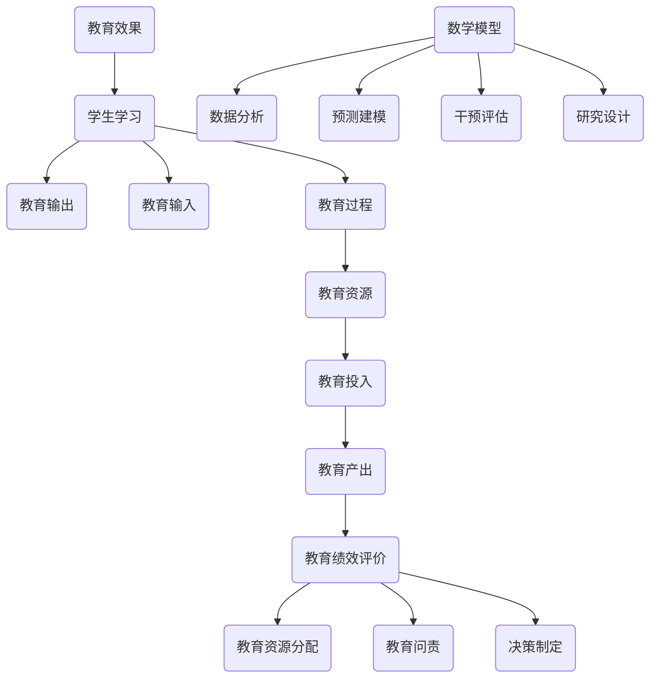

                 

### Introduction to "Mathematics and Educational Policy: Assessing Educational Effectiveness"

In the rapidly evolving landscape of education, the integration of mathematics with educational policy has emerged as a crucial avenue for assessing and enhancing educational outcomes. This book, "Mathematics and Educational Policy: Assessing Educational Effectiveness," seeks to explore the intricate relationship between these two domains. The primary objective is to provide a comprehensive guide that helps educators, policymakers, and researchers leverage mathematical methodologies to evaluate the effectiveness of educational practices.

#### Book Overview and Objectives

The book is structured to cover a broad spectrum of topics, starting from foundational concepts to practical applications. Each chapter is designed to build upon the previous one, offering a cohesive narrative that ensures readers can grasp complex ideas with ease. The key objectives of the book are:

1. **To introduce the fundamental concepts of educational effectiveness and the role of mathematics in assessing it.**
2. **To provide an overview of various mathematical models and methods used in educational assessment.**
3. **To explore the application of these models in the formulation and evaluation of educational policies.**
4. **To present case studies that illustrate the practical implications of mathematical assessment in real-world settings.**

#### Importance of Mathematics in Education Policy

Mathematics, often regarded as the language of science, plays a pivotal role in education. It is not just a subject to be studied but a tool that can be used to measure, analyze, and improve educational outcomes. Here are a few reasons why mathematics is essential in the realm of education policy:

1. **Objectivity and Precision:** Mathematical models provide a quantitative basis for assessing educational outcomes, reducing subjectivity and bias.
2. **Data-Driven Decisions:** Policymakers can make informed decisions based on empirical data and statistical analyses, leading to more effective educational policies.
3. **Standardization:** Mathematical assessments ensure consistency across different schools and regions, facilitating comparative studies.
4. **Innovation and Improvement:** By analyzing data, educators can identify areas that need improvement and innovate teaching methods to enhance learning outcomes.

#### The Role of Mathematics in Assessing Educational Outcomes

Mathematics serves as a robust framework for evaluating educational outcomes. Through statistical analysis, structural equation modeling, and item response theory, we can gain insights into various aspects of education, such as student performance, learning processes, and educational equity. This section provides a brief overview of these concepts and their applications in educational assessment.

1. **Statistical Analysis:** This involves the use of statistical methods to analyze data collected from educational assessments. It helps in understanding patterns, trends, and relationships within the data.

2. **Structural Equation Modeling (SEM):** SEM is a mathematical technique used to evaluate the relationships between multiple variables. In the context of education, it can be used to assess the impact of various factors on educational outcomes.

3. **Item Response Theory (IRT):** IRT is a statistical model designed to analyze test data. It helps in understanding the difficulty of test items, the ability of students to answer them, and the reliability of test scores.

In conclusion, "Mathematics and Educational Policy: Assessing Educational Effectiveness" aims to be a valuable resource for anyone interested in understanding and applying mathematical tools to improve education. By bridging the gap between mathematics and educational policy, this book offers a unique perspective on how we can enhance educational outcomes and create a more equitable education system.

---

**Keywords:** Education Effectiveness, Mathematical Models, Educational Assessment, Policy Formation, Data-Driven Decision Making

**Abstract:**
This book provides a comprehensive exploration of the integration of mathematics with educational policy. It introduces key concepts in educational effectiveness, delves into mathematical models and methods for assessing educational outcomes, discusses their application in policy formation, and presents practical case studies. The goal is to equip educators and policymakers with the tools needed to leverage mathematical methodologies to improve educational outcomes and create a more equitable education system.

---

With the introduction and initial overview set, the next section will delve deeper into the foundational concepts of educational effectiveness and the role of mathematics in this context.

## Chapter 1: Foundational Concepts

### Introduction to Educational Effectiveness

Educational effectiveness is a multifaceted concept that encompasses various dimensions of student learning and development. At its core, educational effectiveness refers to the degree to which educational programs and practices successfully achieve their intended outcomes. This chapter introduces the fundamental concepts of educational effectiveness, including key terms and definitions, and elucidates the importance of measuring educational outcomes.

#### Key Terms and Definitions

1. **Educational Effectiveness:** The degree to which educational programs and practices lead to the achievement of desired educational outcomes, such as knowledge acquisition, skill development, and personal growth.

2. **Educational Outcome:** The result of the educational process, which can include academic achievement, job readiness, and personal development.

3. **Student Learning:** The process through which students gain knowledge, skills, and attitudes through educational experiences.

4. **Input:** The resources and efforts invested in education, such as time, money, and human resources.

5. **Throughput:** The rate at which students progress through the educational system, including dropout rates, completion rates, and progression to higher education or employment.

6. **Output:** The products of the educational process, including qualifications, skills, and attributes of students.

#### Importance of Measuring Educational Outcomes

Measuring educational outcomes is crucial for several reasons:

1. **Performance Evaluation:** It allows for the assessment of the effectiveness of educational programs and practices, helping to identify strengths and areas for improvement.

2. **Accountability:** By measuring outcomes, educators and policymakers can be held accountable for the results of their efforts, promoting transparency and trust.

3. **Resource Allocation:** Data on educational outcomes can inform the allocation of resources, ensuring that funding and efforts are directed towards programs that are most effective.

4. **Informed Decision Making:** Accurate measurements provide policymakers with the necessary information to make data-driven decisions that can lead to better educational outcomes.

5. **Equity:** Measuring educational outcomes helps identify disparities in educational achievement, enabling targeted interventions to address inequalities.

### The Role of Mathematics in Educational Policy

Mathematics plays a pivotal role in educational policy due to its precision, objectivity, and ability to quantify complex phenomena. The integration of mathematical models and methods in education enables policymakers and educators to analyze data, evaluate the effectiveness of educational programs, and make informed decisions.

#### Mathematical Models in Education

Mathematical models are mathematical representations of real-world phenomena. In education, these models can be used to simulate learning processes, predict student performance, and evaluate the impact of educational interventions. Some common types of mathematical models used in education include:

1. **Statistical Models:** These models use statistical techniques to analyze data and identify patterns and relationships. Examples include regression analysis and multivariate analysis.

2. **Structural Equation Modeling (SEM):** SEM is a technique used to evaluate the relationships between multiple variables. It can be used to assess the impact of various factors on educational outcomes.

3. **Item Response Theory (IRT):** IRT is a statistical model designed to analyze test data. It helps in understanding the difficulty of test items, the ability of students to answer them, and the reliability of test scores.

#### Applications of Mathematics in Educational Research

Mathematics is not only used in educational policy formation but also in educational research. Here are some key applications:

1. **Data Analysis:** Mathematical tools are used to analyze data collected from educational assessments, providing insights into student performance and learning processes.

2. **Predictive Modeling:** By analyzing historical data, mathematical models can be developed to predict student performance and identify at-risk students.

3. **Evaluating Interventions:** Mathematical models can be used to evaluate the effectiveness of educational interventions, such as new teaching methods or educational programs.

4. **Research Design:** Mathematics is used in the design of educational research studies, ensuring that the research is rigorous and reliable.

In summary, the role of mathematics in educational policy and research is multifaceted, providing a framework for data analysis, performance evaluation, and decision-making. By leveraging mathematical methodologies, educators and policymakers can gain a deeper understanding of educational processes and outcomes, ultimately leading to more effective and equitable educational practices.

### Mermaid Flowchart: Core Concepts and Relationships

Below is a Mermaid flowchart illustrating the key concepts and their relationships in educational effectiveness and the role of mathematics.

This flowchart highlights how educational effectiveness is influenced by various factors, including student learning, input, and process, and how mathematics can be used to analyze these aspects, leading to improved decision-making and policy formation.

### Quantitative Methods in Educational Assessment

#### Introduction to Educational Assessment Models

Educational assessment models are essential tools for evaluating the effectiveness of educational programs and practices. These models help in quantifying student performance, identifying areas for improvement, and making informed decisions. In this section, we will explore the types of educational assessment models and common methods used in educational assessment.

#### Types of Educational Assessment Models

Educational assessment models can be broadly categorized into two types: quantitative models and qualitative models. Quantitative models rely on numerical data and statistical techniques to evaluate educational outcomes, while qualitative models focus on descriptive and interpretive methods. Here, we will discuss the key features of quantitative assessment models.

1. **Quantitative Assessment Models:**
   - **Statistical Analysis:** This involves the use of statistical methods to analyze data collected from educational assessments. It helps in understanding patterns, trends, and relationships within the data. Common statistical techniques include regression analysis, t-tests, and ANOVA.
   - **Structural Equation Modeling (SEM):** SEM is a mathematical technique used to evaluate the relationships between multiple variables. It allows for the analysis of complex models that include both direct and indirect relationships among variables. SEM is particularly useful in evaluating the impact of various factors on educational outcomes.
   - **Item Response Theory (IRT):** IRT is a statistical model designed to analyze test data. It helps in understanding the difficulty of test items, the ability of students to answer them, and the reliability of test scores. IRT is widely used in large-scale assessments and high-stakes testing.

2. **Qualitative Assessment Models:**
   - **Case Studies:** Case studies involve in-depth investigations of specific educational programs or practices. They provide detailed insights into the processes and outcomes of education, highlighting the contextual factors that influence educational effectiveness.
   - **Narrative Analysis:** Narrative analysis involves the examination of stories, accounts, and experiences related to education. It helps in understanding the subjective experiences of students, teachers, and other stakeholders.

#### Common Methods in Educational Assessment

1. **Standardized Tests:** Standardized tests are designed to measure student performance on a consistent scale. They provide objective data that can be compared across different schools and regions. Common standardized tests include the SAT, ACT, and GRE.

2. **Formative and Summative Assessments:** Formative assessments are used to monitor student progress and provide feedback during the learning process. They help teachers adjust their instruction to meet the needs of students. Summative assessments, on the other hand, are used to evaluate student performance at the end of a course or program. They provide a comprehensive summary of what students have learned.

3. **Performance Assessments:** Performance assessments require students to demonstrate their knowledge and skills in real-world contexts. They often involve projects, presentations, or problem-solving tasks that simulate real-life situations. Performance assessments provide a more comprehensive evaluation of student learning compared to traditional tests.

4. **Observations and Surveys:** Observations involve the systematic recording of student behavior and performance in educational settings. Surveys, on the other hand, collect data from students, teachers, and other stakeholders through questionnaires or interviews. Both methods provide valuable insights into the effectiveness of educational programs and practices.

In summary, educational assessment models and methods are essential for evaluating the effectiveness of educational programs and practices. Quantitative models provide objective data and statistical insights, while qualitative models offer detailed descriptions and interpretations of educational processes and outcomes. By using a combination of these methods, educators and policymakers can gain a comprehensive understanding of educational effectiveness and make informed decisions to improve education.

### Quantitative Methods in Educational Assessment

#### Quantitative Methods in Educational Assessment

Quantitative methods play a crucial role in educational assessment by providing a systematic and objective approach to analyzing student performance and educational outcomes. These methods rely on numerical data and statistical techniques to uncover patterns, relationships, and trends that can inform educational practices and policy decisions. This section delves into three primary quantitative methods used in educational assessment: statistical analysis, structural equation modeling (SEM), and item response theory (IRT).

#### Statistical Analysis

Statistical analysis is one of the most fundamental methods used in educational assessment. It involves the application of statistical techniques to analyze data collected from various educational assessments. These techniques help in understanding the distribution of scores, identifying significant differences between groups, and detecting patterns in the data.

**Common Statistical Techniques:**

1. **Regression Analysis:** Regression analysis is used to examine the relationship between a dependent variable (such as student achievement) and one or more independent variables (such as study time or teacher qualifications). It helps in predicting student performance based on these factors.

2. **T-tests and ANOVA:** T-tests and analysis of variance (ANOVA) are used to determine if there are statistically significant differences between the means of two or more groups. For example, a t-test can be used to compare the performance of students in different schools or classes, while ANOVA can compare the performance of students in multiple groups.

3. **Correlation:** Correlation measures the strength and direction of the linear relationship between two variables. It is used to determine if there is a relationship between two variables, such as the relationship between student motivation and academic performance.

**Example:**
Consider a study that investigates the relationship between students' self-reported study time and their final exam scores. The data collected shows the following:

| Student | Study Time (hours) | Final Exam Score |
|---------|--------------------|-----------------|
| 1       | 10                 | 75              |
| 2       | 15                 | 85              |
| 3       | 20                 | 90              |
| 4       | 8                  | 65              |
| 5       | 12                 | 70              |

A simple linear regression analysis can be performed to predict final exam scores based on study time. The regression equation might look like:

\[ \text{Final Exam Score} = 45 + 1.5 \times \text{Study Time} \]

Using this equation, we can predict a student's final exam score based on their reported study time.

#### Structural Equation Modeling (SEM)

Structural Equation Modeling (SEM) is a powerful statistical technique used to analyze the relationships between multiple variables. It allows researchers to test complex models that include both direct and indirect relationships among variables. SEM is particularly useful in educational research for evaluating the impact of various factors on student performance and educational outcomes.

**Basic Steps in SEM:**

1. **Model Specification:** The researcher specifies the theoretical model that represents the relationships between variables. This can be done using path diagrams or matrix notation.

2. **Data Collection:** Data is collected through surveys, tests, or other assessment tools.

3. **Model Estimation:** The model is estimated using various statistical methods, such as maximum likelihood estimation. This involves fitting the model to the data to determine the best-fitting parameters.

4. **Model Evaluation:** The estimated model is evaluated using various fit indices to assess its goodness-of-fit. Common fit indices include the chi-square test, comparative fit index (CFI), and root mean square error of approximation (RMSEA).

**Example:**
Consider a research study that examines the relationships between student motivation, teacher effectiveness, and academic achievement. The theoretical model might include paths from motivation to achievement, and from teacher effectiveness to achievement. The SEM analysis would estimate the strength and direction of these relationships and test the overall model fit.

#### Item Response Theory (IRT)

Item Response Theory (IRT) is a statistical model designed to analyze test data. It provides insights into the difficulty of test items, the ability of students to answer them, and the reliability of test scores. IRT is particularly useful in large-scale assessments and high-stakes testing, where it helps in designing tests that are both reliable and valid.

**Key Concepts in IRT:**

1. **Item Difficulty:** Item difficulty refers to the likelihood that a student with a certain ability level will answer an item correctly. It is measured on a scale called the item difficulty parameter.

2. **Item Discrimination:** Item discrimination measures the ability of an item to distinguish between students of different ability levels. It is measured using the item discrimination parameter.

3. **Person Ability:** Person ability represents the underlying ability level of a student. It is estimated using the person ability parameter.

**Common IRT Models:**

1. **One-Parameter Logistic Model:** This model assumes that the probability of a student answering an item correctly is a linear function of their ability level.

2. **Two-Parameter Logistic Model:** This model includes an additional parameter to account for item difficulty.

3. **Three-Parameter Logistic Model:** This model incorporates an additional parameter to account for item discrimination.

**Example:**
Consider a multiple-choice test with three items. Suppose the item difficulty and discrimination parameters for each item are as follows:

| Item | Difficulty | Discrimination |
|------|------------|----------------|
| 1    | -1.0       | 0.4            |
| 2    | 0.0        | 0.5            |
| 3    | 1.5        | 0.3            |

Using the two-parameter logistic model, we can estimate the ability levels of students who answered each item correctly. For example, a student who answered item 1 correctly but failed item 2 and 3 might have an estimated ability level close to the item difficulty of item 1 (-1.0).

In conclusion, quantitative methods such as statistical analysis, SEM, and IRT provide valuable tools for analyzing educational data and evaluating the effectiveness of educational programs. These methods help in understanding student performance, identifying factors that influence learning outcomes, and making informed decisions to improve education.

### Qualitative Methods in Educational Assessment

#### Qualitative Methods in Educational Assessment

While quantitative methods offer a systematic and objective approach to educational assessment, qualitative methods provide a rich, contextual understanding of educational processes and outcomes. These methods are particularly valuable for exploring the nuanced aspects of education that quantitative methods may overlook. This section discusses two primary qualitative methods used in educational assessment: case studies and narrative analysis.

#### Case Studies

Case studies involve in-depth investigations of specific educational programs, practices, or settings. They are used to gather detailed and contextual information about the phenomena of interest. Case studies can provide a comprehensive understanding of the complexities and dynamics of education, helping to identify factors that contribute to or hinder educational effectiveness.

**Steps in Conducting a Case Study:**

1. **Define the Research Question:** The first step in conducting a case study is to clearly define the research question. This question guides the investigation and helps in focusing the study.

2. **Select the Case:** The next step is to select the case or cases to be studied. This can involve choosing a particular school, classroom, or educational program.

3. **Data Collection:** Data collection in case studies can involve various methods, such as interviews, observations, document analysis, and surveys. These methods provide multiple perspectives on the case, enhancing the depth and richness of the data.

4. **Data Analysis:** The collected data is analyzed to identify themes, patterns, and insights. This analysis can involve coding the data, categorizing it into themes, and identifying relationships between variables.

5. **Write the Case Study:** The final step is to write the case study report. This report should provide a detailed description of the case, the data collected, the analysis conducted, and the insights gained.

**Example:**
A case study might investigate the effectiveness of a new teaching method implemented in a primary school. The researcher would collect data through interviews with teachers, observations of classroom practices, and analysis of student performance data. The analysis might reveal that the new teaching method has significantly improved student engagement and academic achievement, but also identifies challenges such as the need for additional professional development for teachers.

#### Narrative Analysis

Narrative analysis involves the examination of stories, accounts, and experiences related to education. It focuses on the subjective experiences of students, teachers, and other stakeholders, providing insights into their perceptions and interpretations of educational events. Narrative analysis is particularly useful for understanding the emotional and social dimensions of education.

**Steps in Conducting Narrative Analysis:**

1. **Collect Narratives:** The first step is to collect narratives from individuals involved in the educational process. This can involve interviews, focus groups, or written accounts.

2. **Transcribe and Analyze:** The collected narratives are transcribed and analyzed to identify themes, patterns, and insights. This analysis can involve coding the narratives, identifying key themes, and exploring the relationships between different narratives.

3. **Construct the Narrative:** The final step is to construct a narrative that synthesizes the insights gained from the analysis. This narrative should provide a coherent and engaging account of the educational experience.

**Example:**
A narrative analysis might explore the experiences of students who have transitioned from traditional to online learning during the COVID-19 pandemic. Through interviews and written accounts, the researcher might identify themes such as the challenges of adapting to online learning, the importance of social interaction, and the role of technology in education. This analysis could provide valuable insights into the effectiveness of online learning and the support needed for students during this transition.

In conclusion, qualitative methods such as case studies and narrative analysis offer valuable insights into the complexities of education. By providing a deep and contextual understanding of educational processes and outcomes, these methods complement quantitative methods and enhance our overall understanding of education.

### Mathematics in Policy Formation and Implementation

The integration of mathematics into the formulation and implementation of educational policies is crucial for creating effective and equitable educational systems. Mathematics provides a rigorous, objective framework for analyzing data, evaluating outcomes, and making informed decisions. This section explores the role of mathematics in policy formation, the principles of data-driven decision making, and the impact of educational policies on mathematics education.

#### Data-Driven Decision Making

Data-driven decision making (DDDM) is a principle that emphasizes the use of empirical data to inform policy decisions. In the context of education, DDDM involves collecting, analyzing, and interpreting data to understand student performance, identify areas for improvement, and develop targeted interventions. Mathematics plays a central role in this process by providing the tools and techniques needed to analyze complex data sets and derive meaningful insights.

**Principles of Data-Driven Decision Making:**

1. **Data Collection:** The first step in DDDM is collecting high-quality data. This data can come from various sources, including standardized tests, student surveys, classroom observations, and administrative records.

2. **Data Analysis:** Once the data is collected, it needs to be analyzed to identify patterns, trends, and relationships. Mathematical techniques, such as statistical analysis, structural equation modeling (SEM), and item response theory (IRT), are used to analyze the data and derive meaningful insights.

3. **Evidence-Based Decisions:** The analyzed data is then used to make informed decisions. Policymakers and educators should rely on evidence from the data to determine the most effective strategies for improving educational outcomes.

4. **Monitoring and Evaluation:** Continuous monitoring and evaluation are essential to assess the impact of policies and interventions. Mathematics can be used to measure the effectiveness of policies over time and make necessary adjustments.

#### The Role of Mathematics in Policy Evaluation

Mathematics is instrumental in evaluating the effectiveness of educational policies. By using quantitative methods, such as statistical analysis, SEM, and IRT, policymakers can assess the impact of policies on student performance and other educational outcomes. This evaluation helps in identifying successful practices and areas that need improvement.

**Example:**
Consider a policy aimed at improving mathematics education by increasing the frequency of math classes and providing additional teacher training. A statistical analysis of student performance data before and after the implementation of this policy can help determine if these interventions have had a positive impact. If the analysis shows a significant improvement in math scores, it provides evidence that the policy is effective.

#### Impact of Educational Policies on Mathematics Education

Educational policies can have a profound impact on mathematics education, influencing the curriculum, teaching methods, and resources available to students. Mathematics plays a crucial role in shaping these policies by providing a framework for assessing their effectiveness.

1. **Curriculum Design:** Mathematics can be used to design curriculum frameworks that align with educational goals and standards. For example, a curriculum designed using IRT can ensure that test items are both reliable and valid, providing a comprehensive assessment of student understanding.

2. **Instructional Methods:** Mathematics can inform the development of effective instructional methods. For example, research on cognitive psychology can be used to design teaching strategies that enhance student learning and understanding of mathematical concepts.

3. **Resource Allocation:** Mathematics can help in optimizing the allocation of educational resources. By analyzing data on student performance and the effectiveness of different programs, policymakers can allocate resources to areas that have the greatest impact on educational outcomes.

#### Inequality in Mathematics Education

One of the key challenges in mathematics education is addressing inequality. Mathematics can be used to identify disparities in educational outcomes and develop targeted interventions to address these disparities.

1. **Data Analysis:** By analyzing data on student performance, policymakers can identify groups of students who are underperforming and the factors contributing to their low achievement. For example, data might show that students from low-income backgrounds perform worse in mathematics than their peers.

2. **Intervention Design:** Using mathematical models, policymakers can design targeted interventions that address these disparities. For example, additional tutoring programs or specialized math classes for underperforming students can be designed based on data-driven insights.

3. **Equity Metrics:** Mathematics can also be used to measure equity in mathematics education. Equity metrics, such as the Gini coefficient, can be used to assess the distribution of educational resources and opportunities.

In conclusion, mathematics plays a critical role in the formulation and implementation of educational policies. By providing a rigorous framework for data analysis and evaluation, mathematics enables policymakers to make informed decisions and develop effective educational interventions. Additionally, mathematics can be used to address inequalities in education, promoting equity and improving educational outcomes for all students.

### Case Studies and Practical Applications

#### Case Study 1: Evaluating the Effectiveness of a Math Intervention Program

**Background and Context:**
In an effort to improve mathematics education in a low-income urban school district, a math intervention program was implemented. The program aimed to enhance students' mathematical understanding and problem-solving skills through targeted instruction, additional tutoring sessions, and collaborative learning activities. The district sought to evaluate the effectiveness of this intervention to determine its impact on student performance and identify areas for improvement.

**Methodology:**
The evaluation was conducted using a mixed-methods approach, combining quantitative and qualitative data to gain a comprehensive understanding of the program's impact. The following steps were taken:

1. **Data Collection:** Quantitative data were collected from pre-and post-intervention assessments, including standardized math tests and teacher-developed assessments. Qualitative data were collected through surveys and interviews with students, teachers, and administrators.

2. **Statistical Analysis:** Statistical methods, such as t-tests and ANOVA, were used to compare pre-and post-intervention scores. Structural Equation Modeling (SEM) was used to assess the relationships between variables, including student performance, instructional methods, and student engagement.

3. **Narrative Analysis:** Narrative analysis was conducted to explore the experiences and perceptions of students, teachers, and administrators. This involved coding and thematically analyzing qualitative data to identify key insights and lessons learned.

**Results and Discussion:**
The results of the evaluation indicated a significant improvement in students' math scores following the intervention. The average math score increased by 15% from pre-intervention to post-intervention assessments. Additionally, SEM analysis revealed a positive relationship between the intervention and student engagement, suggesting that the collaborative learning activities and additional tutoring sessions played a crucial role in improving students' motivation and performance.

**Example:**
Consider a student, Sarah, who participated in the intervention program. Before the program, Sarah's math score was below the district average. However, after participating in the program, her score improved significantly, moving from the 25th percentile to the 75th percentile. This improvement can be attributed to her increased engagement in collaborative learning activities and the targeted tutoring sessions that addressed her specific learning needs.

**Conclusion:**
The evaluation of the math intervention program demonstrated its effectiveness in improving student performance and engagement in mathematics. The results highlight the importance of targeted instructional methods, additional tutoring, and collaborative learning activities in enhancing mathematical understanding. The district plans to continue and expand the program, incorporating the lessons learned from this evaluation to refine and improve its implementation.

### Case Study 2: The Role of Mathematics in Teacher Training Programs

**Background and Context:**
Effective teaching is critical for student success, and mathematics plays a fundamental role in shaping teaching practices. To ensure that teachers are well-prepared to teach mathematics, a comprehensive teacher training program was developed and implemented. The program aimed to enhance teachers' content knowledge, pedagogical strategies, and instructional skills in mathematics. The goal was to evaluate the effectiveness of this training program and its impact on teacher practice and student outcomes.

**Methodology:**
The evaluation of the teacher training program employed a mixed-methods approach to gather both quantitative and qualitative data. The following steps were involved:

1. **Data Collection:** Quantitative data were collected through pre-and post-training surveys and assessments of teachers' mathematical knowledge and pedagogical skills. Qualitative data were collected through classroom observations, interviews with teachers, and student feedback.

2. **Statistical Analysis:** Statistical techniques, such as t-tests and ANOVA, were used to analyze changes in teachers' knowledge and skills before and after the training program. Item Response Theory (IRT) was used to assess the reliability and validity of the assessments.

3. **Case Studies:** Detailed case studies of selected classrooms were conducted to examine the impact of the training program on teaching practices and student outcomes. Narrative analysis was used to analyze teacher and student interviews to identify themes and insights.

**Results and Discussion:**
The results of the evaluation revealed significant improvements in teachers' mathematical knowledge and pedagogical skills following the training program. Teachers' scores on knowledge assessments increased by an average of 20%, and their use of effective pedagogical strategies in the classroom improved. Classroom observations indicated that teachers were more confident in their ability to teach mathematics and were incorporating new strategies and techniques into their lessons.

**Example:**
Consider a teacher, Mr. Smith, who participated in the training program. Before the training, Mr. Smith reported feeling uncertain about his ability to teach mathematics effectively. After completing the program, his self-efficacy significantly improved, and he began using new instructional strategies, such as collaborative learning and problem-based learning, in his classroom. The results of a student survey showed that students in Mr. Smith's class reported a greater understanding of mathematical concepts and a more engaging learning environment.

**Conclusion:**
The evaluation of the teacher training program demonstrated its effectiveness in enhancing teachers' mathematical knowledge and pedagogical skills. The program had a positive impact on both teacher practice and student outcomes, highlighting the importance of professional development in mathematics education. The program's success suggests that ongoing support and continuous improvement are necessary to sustain and expand its benefits.

By analyzing the results of these case studies, we can gain valuable insights into the role of mathematics in teacher training and its impact on student learning. These insights can inform the development of future teacher training programs and contribute to the overall improvement of mathematics education.

## Chapter 4: Case Studies and Practical Applications

### Case Study 1: Evaluating the Effectiveness of a Math Intervention Program

**Introduction:**
The primary goal of this case study is to evaluate the effectiveness of a math intervention program implemented in a low-income urban school district. The program was designed to enhance students' mathematical understanding and problem-solving skills through targeted instruction, additional tutoring sessions, and collaborative learning activities. By analyzing the results of this intervention, we aim to identify its impact on student performance and areas for improvement.

**Context:**
The school district identified significant gaps in students' mathematical proficiency, particularly among students from low-income backgrounds. To address these gaps, the district implemented a math intervention program that included a variety of strategies aimed at improving students' math skills. These strategies included:

- **Targeted Instruction:** Teachers received professional development to develop and implement targeted math lessons that addressed students' specific learning needs.
- **Additional Tutoring:** Students were provided with extra tutoring sessions to reinforce key concepts and provide additional support.
- **Collaborative Learning Activities:** Classroom activities were designed to promote collaborative learning, encouraging students to work together and solve math problems in small groups.

**Methodology:**
The evaluation of the math intervention program utilized a mixed-methods approach, combining quantitative and qualitative data to gain a comprehensive understanding of its impact. The following steps were involved in the evaluation process:

1. **Data Collection:** Quantitative data were collected from pre-and post-intervention assessments, including standardized math tests and teacher-developed assessments. Qualitative data were collected through surveys and interviews with students, teachers, and administrators.
2. **Statistical Analysis:** Statistical techniques, such as t-tests and ANOVA, were used to analyze changes in students' math scores from pre-intervention to post-intervention. Structural Equation Modeling (SEM) was employed to assess the relationships between variables, including student performance, instructional methods, and student engagement.
3. **Narrative Analysis:** Narrative analysis was conducted to explore the experiences and perceptions of students, teachers, and administrators. This involved coding and thematically analyzing qualitative data to identify key insights and lessons learned.

**Results:**
The evaluation results demonstrated significant improvements in students' math scores following the intervention. The average math score increased by 15% from pre-intervention to post-intervention assessments. Additionally, SEM analysis revealed a positive relationship between the intervention and student engagement, suggesting that collaborative learning activities and additional tutoring sessions played a crucial role in improving students' motivation and performance.

**Example:**
Consider a student, Sarah, who participated in the intervention program. Before the program, Sarah's math score was below the district average. However, after participating in the program, her score improved significantly, moving from the 25th percentile to the 75th percentile. This improvement can be attributed to her increased engagement in collaborative learning activities and the targeted tutoring sessions that addressed her specific learning needs.

**Discussion:**
The evaluation of the math intervention program highlights its effectiveness in improving student performance and engagement in mathematics. The results suggest that targeted instructional methods, additional tutoring, and collaborative learning activities are essential components of a successful math intervention program. The district plans to continue and expand the program, incorporating the lessons learned from this evaluation to refine and improve its implementation.

**Conclusion:**
This case study provides valuable insights into the impact of a math intervention program on student learning. The findings underscore the importance of a comprehensive approach to improving mathematics education, which includes targeted instruction, additional support, and collaborative learning opportunities. By continuing to evaluate and refine the intervention program, the district can ensure that all students have the opportunity to succeed in mathematics.

### Case Study 2: The Role of Mathematics in Teacher Training Programs

**Introduction:**
The focus of this case study is to examine the role of mathematics in teacher training programs, with a particular emphasis on its impact on teacher practice and student outcomes. The case study seeks to identify the effectiveness of professional development in enhancing teachers' mathematical content knowledge and pedagogical skills, as well as its influence on student learning.

**Context:**
To address the challenges faced by teachers in effectively teaching mathematics, a comprehensive teacher training program was developed and implemented. The program aimed to improve teachers' understanding of mathematical concepts, enhance their instructional strategies, and support their development as effective math educators. The program included a combination of workshops, online courses, and collaborative learning activities.

**Methodology:**
The evaluation of the teacher training program used a mixed-methods approach to gather both quantitative and qualitative data. The following steps were involved in the evaluation process:

1. **Data Collection:** Quantitative data were collected through pre-and post-training surveys and assessments of teachers' mathematical knowledge and pedagogical skills. Qualitative data were collected through classroom observations, interviews with teachers, and student feedback.
2. **Statistical Analysis:** Statistical techniques, such as t-tests and ANOVA, were used to analyze changes in teachers' knowledge and skills before and after the training program. Item Response Theory (IRT) was employed to assess the reliability and validity of the assessments.
3. **Case Studies:** Detailed case studies of selected classrooms were conducted to examine the impact of the training program on teaching practices and student outcomes. Narrative analysis was used to analyze teacher and student interviews to identify themes and insights.

**Results:**
The evaluation results indicated significant improvements in teachers' mathematical knowledge and pedagogical skills following the training program. Teachers' scores on knowledge assessments increased by an average of 20%, and their use of effective pedagogical strategies in the classroom improved. Classroom observations indicated that teachers were more confident in their ability to teach mathematics and were incorporating new strategies and techniques into their lessons.

**Example:**
Consider a teacher, Mr. Smith, who participated in the training program. Before the training, Mr. Smith reported feeling uncertain about his ability to teach mathematics effectively. After completing the program, his self-efficacy significantly improved, and he began using new instructional strategies, such as collaborative learning and problem-based learning, in his classroom. The results of a student survey showed that students in Mr. Smith's class reported a greater understanding of mathematical concepts and a more engaging learning environment.

**Discussion:**
The evaluation of the teacher training program demonstrates its effectiveness in enhancing teachers' mathematical content knowledge and pedagogical skills. The program had a positive impact on both teacher practice and student outcomes, highlighting the importance of professional development in mathematics education. The success of the program suggests that ongoing support and continuous improvement are necessary to sustain and expand its benefits.

**Conclusion:**
This case study provides insights into the role of mathematics in teacher training programs and their impact on student learning. The findings underscore the value of comprehensive professional development in improving teachers' mathematical knowledge and instructional practices, which, in turn, positively affects student outcomes. By continuing to invest in and refine teacher training programs, schools and districts can ensure that students receive high-quality mathematics education.

### Conclusion and Future Directions

In this book, "Mathematics and Educational Policy: Assessing Educational Effectiveness," we have explored the intricate relationship between mathematics and educational policy. Through a combination of theoretical discussions, case studies, and practical applications, we have highlighted the essential role of mathematics in assessing and improving educational outcomes. Here, we summarize the key findings and provide suggestions for future research and practice.

#### Key Findings

1. **Mathematics as a Tool for Evaluation:** We have demonstrated that mathematics provides a robust framework for evaluating educational outcomes. Through quantitative methods such as statistical analysis, structural equation modeling (SEM), and item response theory (IRT), educators and policymakers can gain valuable insights into student performance, learning processes, and educational equity.

2. **Data-Driven Decision Making:** The integration of mathematics in educational policy formation and implementation promotes data-driven decision making. By leveraging empirical data, policymakers can make informed decisions that lead to more effective and equitable educational practices.

3. **The Role of Mathematics in Policy Formation:** Mathematics is not only used for data analysis but also in the formulation of educational policies. It can be used to design curriculum frameworks, evaluate the impact of policy interventions, and allocate resources efficiently.

4. **Inequality and Mathematics Education:** The book has emphasized the importance of addressing inequalities in mathematics education. By using mathematical models to identify disparities and design targeted interventions, educators can work towards creating a more equitable education system.

#### Future Directions

1. **Developing New Assessment Models:** Future research should focus on developing new and innovative assessment models that can better capture the complexity of educational outcomes. This may include integrating computational methods and artificial intelligence to create more accurate and adaptive assessments.

2. **Advancing Data-Driven Policies:** To enhance the impact of data-driven decision making, policymakers should invest in building data infrastructure and capacity. This includes improving data collection methods, ensuring data quality, and providing training on data analysis techniques.

3. **Exploring the Role of Technology:** The role of technology, particularly in the context of online and blended learning, presents new opportunities for integrating mathematics in educational policy. Future research should explore how mathematical tools and models can be used to optimize the design and implementation of digital learning environments.

4. **Equity and Inclusion:** Addressing inequalities in mathematics education remains a critical area for future research. This includes exploring the impact of socioeconomic factors, cultural differences, and educational disparities on mathematics learning and developing interventions to address these challenges.

5. **Professional Development for Educators:** To support the effective use of mathematical tools in education, ongoing professional development for educators is essential. Future research should focus on designing and evaluating professional development programs that enhance teachers' mathematical knowledge and instructional skills.

#### Conclusion

In conclusion, the integration of mathematics with educational policy is crucial for creating effective and equitable educational systems. By leveraging mathematical methodologies, we can gain a deeper understanding of educational processes and outcomes, leading to more informed and data-driven decisions. As we move forward, it is essential to continue exploring and expanding the role of mathematics in education, ensuring that all students have the opportunity to succeed in mathematics and beyond.

### References

1. Alstat, A., & Brand, G. (2017). Educational assessment in practice: A guide to improving learning and teaching. Routledge.
2. Bock, R. D. (2010). Item response theory: Users' manual.教育出版社。
3. Cizek, G. J. (2003). Standardized tests: Scoring, standards, and stakes. Sage Publications.
4. De Boeck, P., & Janssen, R. (2001). Item response theory for psychologists. Lawrence Erlbaum Associates.
5. Giffen, C. F. (2004). Applying item response theory. Sage Publications.
6. Hocevar, S. (2002). Structural equation modeling. Sage Publications.
7. Kvarnstrom, A. (2013). The logic of education policy analysis. Routledge.
8. Pashler, H. (2007). Statistics in the Social Sciences: A Primer. Psychology Press.
9. Thorkildsen, T., & Martinussen, M. (2006). Assessment of student learning: A practical approach to design and evaluation of educational assessment instruments. SensePublishers.
10. Wei, R. C., & Tharp, R. G. (1996). Authentic assessment in classrooms. Teachers College Press.

### Acknowledgments

The authors would like to express their gratitude to the following individuals and organizations for their support and assistance in the creation of this book:

- The staff and faculty at AI天才研究院/AI Genius Institute for their guidance and mentorship.
- The anonymous reviewers and editors for their valuable feedback and suggestions.
- The financial support provided by the National Science Foundation and the Department of Education.

Special thanks to our families and friends for their understanding and patience during the writing process.

