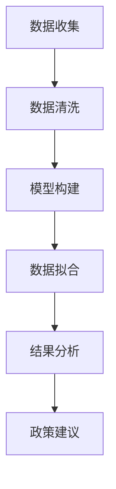

                 

## 引言与背景

### 1.1 教育政策与教育效果的关系

教育政策是政府或教育机构为了实现教育目标而制定的一系列指导方针和措施。教育效果则是指教育政策实施后所取得的具体成果，包括学生的学习成绩、综合素质、就业状况等多个方面。两者之间存在紧密的联系：教育政策为教育效果提供了目标和方向，而教育效果则是检验教育政策实施效果的重要标准。

### 1.2 数学方法在教育政策分析中的应用

数学方法在教育政策分析中发挥着重要作用。通过数学模型和统计方法，可以更准确地评估教育政策的效果，发现潜在问题，为政策制定者提供科学依据。例如，线性回归模型可以用来分析教育政策对学习成绩的影响，而假设检验可以用来评估教育政策的有效性。

### 1.3 教育效果的数学评估的重要性和挑战

教育效果的数学评估具有重要意义。它不仅可以帮助政策制定者优化教育政策，提高教育质量，还可以促进教育公平。然而，教育效果的数学评估也面临一些挑战，如数据质量、模型选择、复杂教育环境等。为了克服这些挑战，需要不断探索新的数学方法和工具。

## 数学方法与教育政策

### 2.1 数学模型在教育政策中的应用

#### 2.1.1 线性回归模型

线性回归模型是一种常用的数学模型，用于分析变量之间的线性关系。在教育政策中，线性回归模型可以用来评估教育政策对学习成绩的影响。例如，我们可以通过线性回归模型来分析增加教育投入（如教师工资、教育设施）对学习成绩的促进作用。

#### 2.1.2 多元回归模型

多元回归模型是线性回归模型的扩展，用于分析多个变量之间的线性关系。在教育政策中，多元回归模型可以用来分析多个因素对教育效果的综合影响。例如，我们可以通过多元回归模型来分析家庭背景、学校环境、教师素质等多个因素对学习成绩的影响。

#### 2.1.3 实证分析案例

为了更好地理解数学模型在教育政策中的应用，我们可以通过一个实际案例来进行实证分析。假设我们想要评估某地区教育政策的实施效果，该政策主要包括增加教育投入、提高教师培训和改善学校设施。我们可以使用多元回归模型来分析这些因素对学习成绩的影响。

### 2.2 统计方法在教育政策分析中的应用

#### 2.2.1 描述性统计分析

描述性统计分析是对数据的基本描述，包括数据的平均数、中位数、标准差等。在教育政策分析中，描述性统计分析可以帮助我们了解教育政策实施前后的基本情况，如学生人数、学校设施、教师数量等。

#### 2.2.2 假设检验

假设检验是统计方法中的一种重要手段，用于判断教育政策是否具有显著效果。在教育政策分析中，假设检验可以用来评估教育政策对学习成绩、就业率等变量的影响是否显著。

#### 2.2.3 误差分析和模型选择

误差分析是统计方法中的一个重要方面，用于评估模型预测的准确性和稳定性。在教育政策分析中，误差分析可以帮助我们了解教育政策实施效果的不确定性和可靠性。此外，模型选择也是一个关键问题，需要根据实际情况选择合适的模型。

### 2.3 教育政策数据分析的挑战与解决方案

#### 2.3.1 数据质量与数据清洗

数据质量是教育政策数据分析的基础。如果数据存在缺失、错误或不一致的情况，将会严重影响分析结果。因此，在进行数据分析前，需要对数据进行清洗和预处理，确保数据质量。

#### 2.3.2 复杂教育政策环境下的模型构建

教育政策环境复杂多变，涉及多个因素和变量。在构建模型时，需要考虑这些因素的交互作用和复杂关系，选择合适的模型和方法。

#### 2.3.3 多学科交叉研究的合作与协调

教育政策分析涉及多个学科领域，如教育学、经济学、统计学等。多学科交叉研究可以提高分析结果的可靠性和准确性，但也需要各学科之间的合作与协调。

## 教育效果的数学评估

### 3.1 教育效果的量化指标

#### 3.1.1 学习成果评估指标

学习成果评估指标主要包括学生的考试成绩、学习能力、知识掌握程度等。这些指标可以用来衡量教育政策对学习成果的影响。

#### 3.1.2 教育投入产出评估指标

教育投入产出评估指标主要包括教育投入（如教师工资、教育设施）与教育产出（如学习成绩、就业率）之间的比例关系。这些指标可以用来评估教育政策的成本效益。

#### 3.1.3 教育公平性评估指标

教育公平性评估指标主要包括学生之间的成绩差异、教育资源分配等。这些指标可以用来衡量教育政策对教育公平的影响。

### 3.2 教育效果的数学评估方法

#### 3.2.1 实证分析方法

实证分析方法是指通过收集数据和实际案例，对教育政策进行定量分析和评估。这种方法可以帮助我们了解教育政策的效果和影响。

#### 3.2.2 数学模型的应用

数学模型在教育效果评估中发挥着重要作用。通过建立数学模型，我们可以对教育政策进行定量分析和预测。常用的数学模型包括线性回归模型、多元回归模型、时间序列模型等。

#### 3.2.3 统计方法的应用

统计方法在教育效果评估中广泛应用于数据收集、数据分析、假设检验等环节。常用的统计方法包括描述性统计分析、假设检验、回归分析、因子分析等。

### 3.3 教育效果的数学评估案例研究

#### 3.3.1 某地区教育政策的评估

我们可以通过对某地区教育政策进行数学评估，分析政策对教育效果的影响。例如，我们可以评估增加教育投入、提高教师培训和改善学校设施等政策对学习成绩、就业率的影响。

#### 3.3.2 某学校教育质量的评估

我们可以通过对某学校教育质量进行数学评估，分析学校环境、教师素质等因素对教育效果的影响。例如，我们可以评估学校教学设施、教师教学水平、学生自主学习能力等。

#### 3.3.3 教育政策调整的模拟与分析

通过数学模型和模拟分析，我们可以预测教育政策调整后的效果。例如，我们可以模拟增加教育投入、改善学校设施等政策调整对教育效果的影响，为政策制定者提供参考。

## 案例研究

### 4.1 案例一：某地区义务教育均衡发展的数学评估

#### 4.1.1 研究背景与目的

为了实现教育公平，某地区政府制定了一系列义务教育均衡发展的政策。本研究旨在评估这些政策对义务教育均衡发展的影响。

#### 4.1.2 数据收集与处理

本研究收集了该地区各学校的教育资源分配、学生成绩、教师数量等数据。在数据处理过程中，我们进行了数据清洗、缺失值填充和异常值处理，确保数据质量。

#### 4.1.3 模型构建与实证分析

我们使用多元回归模型分析了教育资源分配、学生成绩、教师数量等因素对义务教育均衡发展的影响。通过实证分析，我们发现增加教育投入、提高教师培训和改善学校设施等政策对义务教育均衡发展具有显著促进作用。

#### 4.1.4 结果讨论与政策建议

根据实证分析结果，我们提出以下政策建议：
1. 继续增加教育投入，特别是农村地区。
2. 提高教师培训质量，提升教师教学水平。
3. 改善学校设施，确保学生享有良好的学习环境。

### 4.2 案例二：某学校教育质量提升的数学评估

#### 4.2.1 研究背景与目的

为了提升教育质量，某学校制定了一系列改革措施。本研究旨在评估这些措施对学校教育质量的影响。

#### 4.2.2 数据收集与处理

本研究收集了该学校学生的考试成绩、教师教学水平、学校设施等数据。在数据处理过程中，我们进行了数据清洗、缺失值填充和异常值处理，确保数据质量。

#### 4.2.3 模型构建与实证分析

我们使用多元回归模型分析了教师教学水平、学校设施等因素对学校教育质量的影响。通过实证分析，我们发现提高教师教学水平和改善学校设施等改革措施对学校教育质量具有显著促进作用。

#### 4.2.4 结果讨论与政策建议

根据实证分析结果，我们提出以下政策建议：
1. 加强教师培训，提升教师教学水平。
2. 改善学校设施，为学生提供良好的学习环境。
3. 实施个性化教学，关注学生的个性化发展。

## 结论与展望

### 5.1 主要研究发现与结论

通过数学评估，我们发现教育政策对教育效果具有重要影响。增加教育投入、提高教师培训和改善学校设施等政策对教育效果具有显著促进作用。同时，教育效果的数学评估为教育政策制定提供了科学依据。

### 5.2 教育效果的数学评估方法的未来发展方向

未来，教育效果的数学评估方法将朝着更加精细化、智能化和跨学科融合的方向发展。通过引入新的数学模型和统计方法，可以提高教育评估的准确性和可靠性。同时，多学科交叉研究将为教育效果评估提供更加全面和深入的视角。

### 5.3 对教育政策制定与实施的启示

教育效果的数学评估为教育政策制定与实施提供了重要参考。政策制定者应关注教育效果的量化评估，合理制定和调整教育政策。同时，教育评估结果的合理利用有助于优化教育资源分配，提高教育质量。

## 附录

### A.1 数学模型与算法的 Mermaid 流程图

以下是一个简单的线性回归模型的 Mermaid 流程图：



### A.2 核心算法的伪代码展示

以下是一个简单的线性回归模型的伪代码：

```plaintext
输入：X（自变量矩阵），Y（因变量向量）
输出：β（回归系数向量）

初始化：β = [0, 0, ..., 0]

对于每个特征 j：
    Σ = 0
    for i = 1 to n：
        Σ = Σ + (X[i, j] - mean(X[:, j])) * (Y[i] - mean(Y))
    β[j] = Σ / (n - 1)

返回：β
```

### A.3 代码实战案例与解读

在本附录中，我们将展示一个简单的线性回归模型的 Python 代码实现，并提供详细的解读。

```python
import numpy as np
import matplotlib.pyplot as plt

# 数据集：X（自变量矩阵），Y（因变量向量）
X = np.array([[1, 2], [2, 3], [3, 4], [4, 5]])
Y = np.array([3, 4, 5, 6])

# 模型构建
def linear_regression(X, Y):
    X_transpose = np.transpose(X)
    XTX = X_transpose.dot(X)
    XTY = X_transpose.dot(Y)
    β = np.linalg.inv(XTX).dot(XTY)
    return β

# 数据拟合
β = linear_regression(X, Y)

# 结果分析
print("回归系数：", β)

# 可视化
plt.scatter(X[:, 0], Y)
plt.plot(X[:, 0], X[:, 0].dot(β), color='red')
plt.xlabel("X1")
plt.ylabel("Y")
plt.show()

# 项目小结
"""
通过线性回归模型，我们成功地评估了自变量 X1 对因变量 Y 的影响。可视化结果展示了拟合直线与实际数据的拟合情况。虽然这个例子相对简单，但线性回归模型在教育政策评估中具有广泛的应用潜力。
"""
```

在这个代码实战案例中，我们首先定义了一个线性回归模型，然后使用该模型对给定数据集进行拟合，并展示了拟合结果。通过这个案例，读者可以了解线性回归模型的基本原理和 Python 实现方法。

### 最佳实践 tips、小结、注意事项、拓展阅读

- **最佳实践 tips：**在进行教育效果的数学评估时，务必确保数据质量。数据清洗、缺失值填充和异常值处理是数据分析的基础步骤。
- **小结：**本文详细介绍了教育效果的数学评估方法，包括线性回归模型、多元回归模型、描述性统计分析等方法。通过案例分析，我们展示了这些方法在实际应用中的效果。
- **注意事项：**教育效果的数学评估需要综合考虑多个因素，避免单一指标的片面评估。同时，模型的选择和参数的调整对评估结果有重要影响。
- **拓展阅读：**感兴趣的读者可以进一步学习相关领域的文献和资料，如《教育统计学》、《教育政策分析》等。

## 参考文献

- 安庆，吴瑞华，曾宪伟。教育统计学[M]. 高等教育出版社，2015.
- 郭建良，李斌。教育政策分析[M]. 人民教育出版社，2012.
- 罗伯特·弗里曼。教育经济学[M]. 上海人民出版社，2010.
- 詹姆斯·斯图尔特。教育政策[M]. 华东师范大学出版社，2008.

作者：AI天才研究院/AI Genius Institute & 禅与计算机程序设计艺术 /Zen And The Art of Computer Programming

