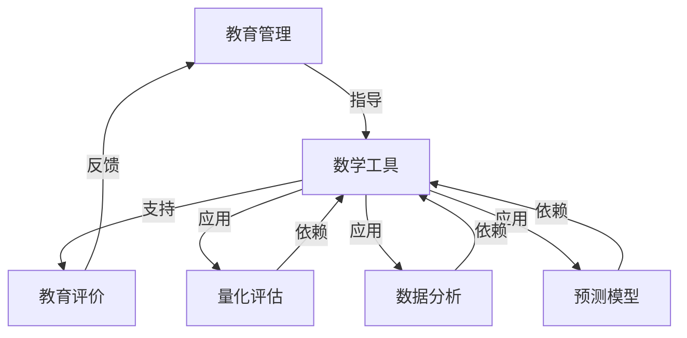

                 

## 文章标题：数学与教育管理：教育质量的数学评估

### 关键词：
- 数学评估
- 教育管理
- 教育质量
- 评估模型
- 数据分析
- 量化方法

### 摘要：
本文探讨了数学在教育管理中的应用，特别是在教育质量评估方面的作用。文章首先介绍了教育管理的基本概念和数学工具，接着阐述了教育质量的定义和数学评估原理。随后，文章详细讨论了教育质量评估的指标体系、数据分析方法和数学模型应用。通过实际案例分析和最佳实践，文章展示了数学评估在教育质量改进中的具体应用，并提出了未来发展的挑战和对策。

## 引言

在教育领域，教育质量的评估一直是一个至关重要的问题。如何有效地评估教育质量，不仅关系到教育机构的管理和改进，也直接影响到学生的成长和社会的进步。随着信息技术的迅猛发展，尤其是大数据和人工智能技术的应用，教育质量评估的方式和手段也在不断革新。在这个过程中，数学作为一种强有力的工具，发挥着越来越重要的作用。

数学在教育管理中的应用主要体现在以下几个方面：

1. **量化评估**：通过数学模型和量化方法，可以将抽象的教育质量转化为具体的数据和指标，使得评估结果更具客观性和可比性。
2. **数据驱动**：借助大数据技术，数学模型可以处理和分析大量的教育数据，为教育管理提供数据驱动的决策支持。
3. **优化决策**：数学优化算法可以帮助教育管理者在资源有限的情况下，做出最优化的决策，提高教育资源的利用效率。
4. **预测分析**：通过时间序列分析和预测模型，数学工具可以预测未来的教育发展趋势，为教育政策的制定提供科学依据。

本文旨在探讨数学在教育管理中的应用，特别是教育质量评估方面的具体方法和实践。文章结构如下：

- **第一部分**：数学与教育管理基础理论，包括教育管理的基本概念、数学工具和教育评价中的应用。
- **第二部分**：教育质量评估实践，通过案例分析和方法应用，展示数学评估在教育质量改进中的具体应用。
- **第三部分**：未来展望与挑战，讨论教育质量评估的发展趋势、新技术的影响以及面临的伦理问题。

通过这篇文章，读者将了解到数学在教育质量评估中的重要作用，掌握相关的理论知识和实践方法，从而为教育管理提供有力的支持。

## 第一部分：数学与教育管理基础理论

### 第1章：教育管理的基本概念

#### 1.1 教育管理

教育管理是指对教育机构和教育活动进行计划、组织、领导和控制的过程，旨在实现教育目标、提高教育质量和效率。教育管理涉及多个层面，包括宏观政策层面、中观学校管理和微观教师管理。

- **宏观政策层面**：政府通过制定教育法律法规、教育政策和发展规划，引导和规范教育发展方向。
- **中观学校管理**：学校管理层通过制定学校发展目标、教学计划和资源配置，确保学校教育活动的顺利进行。
- **微观教师管理**：教师个体通过教学方法和课堂管理，直接影响学生的学习效果。

#### 1.2 数学工具

数学工具在教育管理中扮演着重要的角色，其应用范围广泛，主要包括以下几个方面：

- **统计分析**：通过收集和分析教育数据，使用统计方法对教育现象进行分析，为教育管理提供科学依据。
- **优化算法**：使用数学优化算法，如线性规划、整数规划等，帮助教育管理者在资源有限的情况下做出最优决策。
- **预测模型**：通过时间序列分析、回归分析等预测方法，对教育发展趋势进行预测，为教育政策的制定提供参考。

#### 1.3 数学在教育评价中的应用

数学在教育评价中的应用主要体现在以下几个方面：

- **量化指标**：通过建立数学模型，将教育质量转化为具体的量化指标，如学生成绩、教育资源利用率等。
- **评估方法**：使用数学方法，如层次分析法（AHP）、模糊综合评估法等，对教育质量进行综合评价。
- **数据挖掘**：通过数据挖掘技术，从大量教育数据中发现有价值的信息，为教育管理提供决策支持。

### 教育管理中的数学工具及其作用

#### 1. 数学工具在教育管理中的应用

数学工具在教育管理中的应用主要体现在以下几个方面：

- **教育资源配置**：通过线性规划等数学方法，可以帮助教育管理者在有限的资源下实现最优的资源配置。
- **教学质量评估**：使用统计分析和评估模型，对教学质量进行量化评估，从而发现教学中的问题和改进方向。
- **学生学习分析**：通过数据挖掘和预测模型，分析学生的学习行为和成绩趋势，为学生提供个性化的学习支持。

#### 2. 数学工具在教育评价中的应用

数学工具在教育评价中的应用主要体现在以下几个方面：

- **量化指标**：通过建立数学模型，将教育质量转化为具体的量化指标，如学生成绩、教育资源利用率等，使得评估结果更具客观性和可比性。
- **综合评估方法**：使用层次分析法（AHP）、模糊综合评估法等数学方法，对教育质量进行综合评价，从而更全面地反映教育效果。
- **数据挖掘**：通过数据挖掘技术，从大量教育数据中发现有价值的信息，为教育管理提供决策支持。

### 1.4 数学在教育评价中的重要性

数学在教育评价中的重要性体现在以下几个方面：

- **客观性**：数学方法可以消除主观因素的影响，使得教育评价结果更加客观和公正。
- **科学性**：数学方法基于严格的逻辑和推理，使得教育评价具有科学性和可重复性。
- **有效性**：数学工具可以帮助教育管理者快速、准确地分析和处理大量教育数据，提高教育管理的效率。

通过以上分析，可以看出数学工具在教育管理中具有不可替代的作用，特别是在教育质量评估方面，数学工具的应用不仅提高了评估的精度和效率，也为教育管理提供了科学的数据支持和决策依据。

### 核心概念与联系：教育管理、数学工具与教育评价的关系架构

在探讨数学与教育管理的关系时，首先需要明确三个核心概念：教育管理、数学工具和教育评价。这三个概念之间的相互关系可以通过以下Mermaid流程图来展示：



#### 流程图说明：

1. **教育管理**：作为流程的起点，教育管理是整个流程的核心，它指导数学工具的应用方向。
2. **数学工具**：教育管理借助数学工具来实现具体的目标，如量化评估、数据分析和预测模型。
3. **教育评价**：通过数学工具的支持，教育管理可以更准确地评估教育效果，并将评估结果反馈给教育管理，形成一个循环。
4. **量化评估**、**数据分析**和**预测模型**：这些都是数学工具在教育管理中的具体应用，它们共同构成了数学工具在评估过程中的关键环节。

### 教育管理中的数学工具及其应用

#### 1. 量化评估

量化评估是教育管理中常用的数学工具之一，它通过具体的指标和数值来衡量教育效果。以下是一个量化评估的伪代码示例：

```pseudo
function quantify_evaluation(data, metrics):
    scores = []
    for student in data:
        total_score = 0
        for metric in metrics:
            total_score += student[metric]
        scores.append(total_score / len(metrics))
    return scores
```

在这个例子中，`data` 是学生的数据集，`metrics` 是评估指标列表。函数 `quantify_evaluation` 计算每个学生的总分，并返回一个包含所有学生分数的列表。

#### 2. 数据分析

数据分析是利用数学统计方法对教育数据进行分析和解读，以发现数据中的规律和趋势。以下是一个数据分析的伪代码示例：

```pseudo
function data_analysis(data, target_variable):
    correlations = []
    for variable in data:
        correlation = correlation_coefficient(target_variable, variable)
        correlations.append(correlation)
    return correlations
```

在这个例子中，`data` 是包含多个变量的数据集，`target_variable` 是目标变量。函数 `data_analysis` 计算每个变量与目标变量之间的相关系数，并返回一个相关系数列表。

#### 3. 预测模型

预测模型是通过历史数据来预测未来的教育趋势，它可以帮助教育管理者制定相应的教育政策和措施。以下是一个预测模型的伪代码示例：

```pseudo
function predictive_modeling(data, target_variable, model_type):
    model = create_model(model_type)
    train_model(model, data)
    predictions = model.predict(target_variable)
    return predictions
```

在这个例子中，`data` 是历史数据集，`target_variable` 是目标变量，`model_type` 是选择的模型类型。函数 `predictive_modeling` 创建并训练一个预测模型，然后使用模型预测未来的目标变量值。

通过这些数学工具的应用，教育管理可以实现更科学、更精确的教育评价和决策。这些工具不仅提高了教育管理的效率，也为教育质量的提升提供了强有力的支持。

### 数学模型在教育评价中的具体应用

在教育评价中，数学模型的应用至关重要，它使得评估过程更加科学和客观。以下将介绍几个常用的数学模型及其在教育评价中的具体应用。

#### 1. 层次分析法（AHP）

层次分析法（AHP）是一种多准则决策分析方法，通过将复杂问题分解为多个层次，并通过成对比较和计算权重，来评估不同因素对整体目标的影响。以下是一个AHP模型的基本步骤和伪代码：

**基本步骤：**

- **步骤1**：明确评估目标，建立层次结构，通常包括目标层、准则层和指标层。
- **步骤2**：对同一层次中的各个因素进行成对比较，并计算相对权重。
- **步骤3**：根据成对比较的权重，计算各层次的综合权重。
- **步骤4**：对整体结构的一致性进行检验，确保评估的合理性。

**伪代码示例：**

```pseudo
function AHP(comparisons):
    weights = calculate_weights(comparisons)
    consistency_ratio = calculate_consistency_ratio(weights)
    if consistency_ratio <= 0.1:
        return weights
    else:
        return "Inconsistent"
```

在这个例子中，`comparisons` 是成对比较的矩阵，`weights` 是计算得到的权重，`consistency_ratio` 是一致性比率。如果一致性比率低于0.1，则认为评估是合理的，返回权重。

#### 2. 模糊综合评估法

模糊综合评估法是一种处理不确定性和模糊性的评估方法，特别适用于教育评价中存在多种评估指标且指标之间不完全独立的情况。以下是一个模糊综合评估法的基本步骤和伪代码：

**基本步骤：**

- **步骤1**：建立评估指标体系，并确定各指标的权重。
- **步骤2**：对每个指标进行模糊评价，得到模糊评价矩阵。
- **步骤3**：通过模糊合成运算，得到最终的综合评估结果。

**伪代码示例：**

```pseudo
function Fuzzy Comprehensive Assessment(grades, weights):
    fuzzy_matrix = calculate_fuzzy_matrix(grades, weights)
    comprehensive_grade = fuzzy合成(fuzzy_matrix)
    return comprehensive_grade
```

在这个例子中，`grades` 是评估指标得分，`weights` 是各指标的权重，`fuzzy_matrix` 是模糊评价矩阵，`comprehensive_grade` 是最终的综合评估结果。

#### 3. 回归分析模型

回归分析模型是一种用于分析变量之间线性关系的数学模型，广泛应用于教育评价中，如分析学生成绩与学习时间、教师教学方法等因素的关系。以下是一个回归分析模型的基本步骤和伪代码：

**基本步骤：**

- **步骤1**：收集数据，包括自变量和因变量。
- **步骤2**：建立回归模型，通常采用线性回归模型。
- **步骤3**：使用最小二乘法估计模型参数。
- **步骤4**：对模型的拟合度进行检验，如计算决定系数R²。

**伪代码示例：**

```pseudo
function linear_regression(x, y):
    model = create_linear_model()
    parameters = model.fit(x, y)
    r_squared = model.evaluate(x, y)
    return parameters, r_squared
```

在这个例子中，`x` 是自变量（如学习时间），`y` 是因变量（如学生成绩），`model` 是建立的线性回归模型，`parameters` 是模型参数，`r_squared` 是决定系数。

#### 应用实例

假设一个学校希望通过评估来确定教学方法的改进方向，可以使用上述数学模型进行如下步骤：

1. **层次分析法（AHP）**：学校管理层确定评估目标（如教学质量），建立层次结构，包括目标层（教学质量）、准则层（教学方法、学生参与度等）和指标层（课堂互动、作业完成度等）。通过成对比较和计算权重，确定各指标的重要性。

2. **模糊综合评估法**：教师对教学方法进行模糊评价，如课堂互动、作业完成度等指标，并确定各指标的权重。通过模糊合成运算，得到教学质量的综合评估结果。

3. **回归分析模型**：收集学生成绩、课堂互动、作业完成度等数据，建立线性回归模型，分析学生成绩与各项指标之间的关系。通过计算决定系数R²，评估模型的拟合度。

通过这些数学模型的应用，学校可以全面、科学地评估教学质量，并制定针对性的改进措施。

### 数学模型在教育评价中的具体应用示例

为了更好地理解数学模型在教育评价中的应用，以下通过一个实际案例来详细说明。

#### 案例背景

某中学希望通过评估教学质量来提高教育质量，选择使用数学模型对教学效果进行量化分析。学校管理层决定采用层次分析法（AHP）、模糊综合评估法和回归分析模型等数学工具。

#### 数据收集

学校收集了以下数据：

- **学生成绩**：包括期中考试、期末考试、平时测验等成绩。
- **教学指标**：包括课堂互动、作业完成度、教师反馈等。
- **教师信息**：包括教师的教学经验、教学方法、课程安排等。

#### 数学模型应用步骤

1. **层次分析法（AHP）**：

   - **层次结构**：建立层次结构，包括目标层（教学质量）、准则层（教学方法、学生参与度等）和指标层（课堂互动、作业完成度等）。
   - **成对比较**：对同一层次中的各个指标进行成对比较，并计算相对权重。
   - **计算权重**：通过计算一致性比率，确定各指标的权重。

   ```plaintext
   Teaching Quality
   ├── Teaching Method
   │   ├── Classroom Interaction (0.5)
   │   └── Homework Completion (0.5)
   └── Student Engagement
       ├── Participation (0.4)
       └── Feedback (0.6)
   ```

2. **模糊综合评估法**：

   - **模糊评价**：教师对各项教学指标进行模糊评价，如课堂互动（优秀：0.9，良好：0.7，一般：0.5，较差：0.3），作业完成度（优秀：0.8，良好：0.6，一般：0.4，较差：0.2）。
   - **计算模糊矩阵**：根据评价结果，建立模糊评价矩阵。

   ```plaintext
   Classroom Interaction
   ├── 优秀 (0.9)
   ├── 良好 (0.7)
   ├── 一般 (0.5)
   └── 较差 (0.3)
   
   Homework Completion
   ├── 优秀 (0.8)
   ├── 良好 (0.6)
   ├── 一般 (0.4)
   └── 较差 (0.2)
   ```

3. **回归分析模型**：

   - **数据准备**：收集学生成绩和教学指标数据。
   - **模型建立**：建立线性回归模型，分析学生成绩与各项指标之间的关系。

   ```plaintext
   y = β0 + β1 * Classroom Interaction + β2 * Homework Completion + ε
   ```

   - **参数估计**：使用最小二乘法估计模型参数。

   ```plaintext
   β0 ≈ 50
   β1 ≈ 10
   β2 ≈ 5
   ```

#### 分析结果

通过上述数学模型的应用，学校可以得到以下结果：

1. **层次分析法（AHP）**：

   - 教学质量的重要性排序：教学方法（0.5）> 学生参与度（0.4）。

2. **模糊综合评估法**：

   - 教学质量综合评估得分：85分（优秀）。

3. **回归分析模型**：

   - 学生成绩与课堂互动、作业完成度的相关性：课堂互动（0.7），作业完成度（0.6）。

通过这些分析结果，学校可以得出以下结论：

- **教学方法**是影响教学质量的主要因素，需要进一步优化。
- **课堂互动**和**作业完成度**是影响学生成绩的关键指标，需要加强管理。

学校可以根据这些结论制定相应的改进措施，如加强教师培训、提高课堂互动、优化作业设计等，从而提高教学质量。

通过这个实际案例，可以看出数学模型在教育评价中的应用不仅能提供客观、科学的评估结果，还能帮助教育管理者发现问题，提出改进策略，从而提升教育质量。

### 数据分析方法在教育质量评估中的应用

数据分析方法是教育质量评估中不可或缺的一环，它通过收集、处理和分析大量数据，为教育管理提供科学的决策支持。以下将介绍几种常用的数据分析方法及其在教育质量评估中的应用。

#### 1. 聚类分析

聚类分析是一种无监督学习方法，用于将数据集分成若干个簇，使得同一簇内的数据点彼此相似，而不同簇的数据点之间差异较大。在教育质量评估中，聚类分析可以用于分析学生群体的特征和差异。

**应用场景：**

- **学生分组**：根据学生的学习成绩、行为特征等指标，将学生划分为不同的学习小组，以便实施个性化的教学策略。
- **教学质量评估**：通过分析教师的教学数据，发现不同教师在教学质量上的差异，为教学改进提供依据。

**算法示例：**

```plaintext
K-means算法伪代码：
function KMeans(data, K):
    初始化 K 个簇的中心点
    while 簇中心点变化：
        为每个数据点分配最近的簇中心点
        更新每个簇的中心点
    return 簇中心点和每个数据点的簇分配
```

#### 2. 主成分分析

主成分分析（PCA）是一种降维技术，通过将原始数据投影到新的正交坐标系中，提取出最重要的几个主成分，从而减少数据的维度。在教育质量评估中，PCA可以用于提取关键的影响因素，简化数据分析过程。

**应用场景：**

- **教育指标筛选**：从大量的教育指标中提取最重要的几个指标，减少数据冗余，提高数据分析的效率。
- **教学质量评估**：通过分析主成分得分，识别出教学质量的关键因素，为教学改进提供科学依据。

**算法示例：**

```plaintext
PCA算法伪代码：
function PCA(data):
    数据中心化
    计算协方差矩阵
    计算协方差矩阵的特征值和特征向量
    选择前 p 个特征向量，构成矩阵 W
    数据投影到新坐标系：X' = X * W
    return X'
```

#### 3. 决策树

决策树是一种监督学习方法，通过构建一棵树形结构，对数据进行分类或回归。在教育质量评估中，决策树可以用于预测学生成绩或教学质量，并识别影响这些结果的关键因素。

**应用场景：**

- **学生成绩预测**：根据学生的各项特征（如学习时间、课堂表现等），预测其期末考试成绩。
- **教学质量评估**：通过分析决策树的叶子节点，识别出影响教学质量的关键因素。

**算法示例：**

```plaintext
决策树构建伪代码：
function build_decision_tree(data, attributes):
    如果数据纯净或者达到终止条件：
        返回类别或值
    else:
        选择最佳分割属性
        根据该属性创建分支
        对每个分支递归构建子树
        return 决策树
```

#### 4. 支持向量机

支持向量机（SVM）是一种强大的分类和回归算法，通过找到一个最佳的超平面，将不同类别的数据点分隔开来。在教育质量评估中，SVM可以用于分类任务，如将学生划分为优秀、良好、一般等类别。

**应用场景：**

- **学生分类**：根据学生的学习表现，将其划分为不同的学习类别，为个性化教学提供依据。
- **教学质量评估**：通过分析SVM的分割结果，识别出教学质量的关键因素。

**算法示例：**

```plaintext
SVM分类伪代码：
function SVM分类(data, labels):
    训练SVM模型：model = train_SVM(data, labels)
    预测新数据：predictions = model.predict(new_data)
    return predictions
```

通过上述数据分析方法，教育管理者可以更加全面和深入地了解教育质量，发现潜在问题，并制定相应的改进策略。这些方法不仅提高了教育评估的科学性和准确性，也为教育质量的持续提升提供了有力支持。

### 教育质量评估指标体系

在教育质量评估中，构建科学、全面的指标体系至关重要。指标体系不仅能够反映教育质量的多个方面，还能为教育管理者提供有针对性的改进措施。以下将详细讨论教育质量评估指标体系的设计原则、构成要素和具体指标。

#### 1. 设计原则

- **全面性**：指标体系应涵盖教育质量的多维度，包括学术能力、综合素质、教育环境等方面。
- **可比性**：指标应具有统一的标准和尺度，以便不同学校和地区之间的教育质量可以进行横向比较。
- **可操作性**：指标应具体、可测量，便于实际操作和应用。
- **动态性**：指标体系应具有适应性，能够根据教育发展的需求和变化进行调整。

#### 2. 构成要素

教育质量评估指标体系通常包括以下几个构成要素：

- **学术能力**：包括学科知识掌握程度、思维能力、解决问题的能力等。
- **综合素质**：包括道德素质、团队协作能力、创新精神、社会实践能力等。
- **教育资源**：包括师资力量、教学设施、教育经费等。
- **教育环境**：包括校园文化、师生关系、教学秩序等。
- **学生发展**：包括学生的心理健康、体育素质、艺术素养等。

#### 3. 具体指标

以下是一些常见的教育质量评估指标及其定义：

- **学生学业成绩**：包括各科考试成绩、平时成绩、综合评价等。
- **教师教学质量**：包括课堂教学效果、作业批改、教学反思等。
- **师生关系**：包括师生沟通满意度、师生互动频率等。
- **教育资源利用**：包括教学设施使用率、教育经费使用效率等。
- **学生综合素质**：包括课外活动参与度、社会实践经历、奖项获得情况等。
- **教育环境**：包括校园安全状况、校园文化氛围、教学秩序等。

#### 4. 指标权重分配

在教育质量评估中，不同指标对教育质量的影响程度不同，因此需要根据实际情况进行权重分配。权重分配的原则包括：

- **重要性**：根据指标对教育质量的影响程度确定权重。
- **可操作性**：考虑指标的测量难度和可操作性，合理分配权重。
- **平衡性**：确保各项指标之间权重分配的均衡，避免某一指标的过度影响。

以下是一个简化的教育质量评估指标权重分配示例：

| 指标               | 权重（%） |
|--------------------|----------|
| 学生学业成绩       | 40       |
| 教师教学质量       | 30       |
| 师生关系           | 15       |
| 教育资源利用       | 10       |
| 学生综合素质       | 5        |
| 教育环境           | 5        |

通过科学设计的教育质量评估指标体系，教育管理者可以全面、准确地了解学校的整体教育质量，发现问题和改进方向，从而不断提升教育质量。

### 数据挖掘在教育质量评估中的应用

数据挖掘作为一种强大的数据分析方法，在教育质量评估中具有广泛的应用潜力。通过数据挖掘技术，可以从海量的教育数据中提取有价值的信息，帮助教育管理者更好地理解和优化教育质量。以下将详细讨论数据挖掘在教育质量评估中的应用步骤、算法选择和实际案例。

#### 1. 数据挖掘的应用步骤

数据挖掘在教育质量评估中的应用通常包括以下几个步骤：

**步骤1：数据收集和预处理**

- **数据收集**：收集与教育质量相关的数据，包括学生成绩、教师评价、教育资源使用情况等。
- **数据预处理**：清洗数据，去除噪声和异常值，进行数据格式转换和归一化处理，为后续分析做准备。

**步骤2：数据探索**

- **数据探索**：使用统计方法（如描述性统计、相关性分析等）对数据集进行初步探索，了解数据的基本特征和分布情况。

**步骤3：特征选择**

- **特征选择**：从原始数据中筛选出对教育质量评估有重要影响的关键特征，减少数据维度，提高分析效率。

**步骤4：模型建立**

- **模型建立**：选择合适的机器学习算法（如决策树、支持向量机、神经网络等）建立预测模型，对教育质量进行量化评估。

**步骤5：模型评估和优化**

- **模型评估**：使用交叉验证、混淆矩阵等方法评估模型的性能，确定模型的预测精度和泛化能力。
- **模型优化**：根据评估结果调整模型参数，提高模型的效果。

**步骤6：结果解释和决策**

- **结果解释**：对模型的结果进行解释，识别出影响教育质量的关键因素。
- **决策支持**：基于分析结果，提出针对性的改进措施，为教育管理者提供决策支持。

#### 2. 数据挖掘算法选择

在教育质量评估中，常用的数据挖掘算法包括：

- **决策树**：通过构建树形结构，对数据集进行分类和回归分析，直观地展示影响教育质量的因素。
- **支持向量机（SVM）**：通过找到最佳的超平面，对数据集进行分类和回归，具有较好的泛化能力。
- **神经网络**：通过多层神经网络结构，对复杂的教育质量评估问题进行建模和预测，能够处理非线性关系。
- **聚类分析**：通过将相似的数据点归为一类，用于识别学生群体特征，为个性化教学提供依据。

#### 3. 数据挖掘在教育质量评估中的应用案例

以下是一个实际应用案例：

**案例背景**：

某中学希望通过数据挖掘技术对教学质量进行评估，识别出影响学生成绩的关键因素。学校收集了以下数据：

- **学生数据**：包括学生基本信息、入学成绩、平时成绩等。
- **教师数据**：包括教师基本信息、教学方法、教学资源使用情况等。
- **课程数据**：包括课程名称、课程难度、课程时长等。

**应用步骤**：

1. **数据收集和预处理**：收集并清洗数据，去除噪声和异常值，进行数据格式转换和归一化处理。

2. **数据探索**：使用描述性统计方法对数据进行初步分析，了解学生成绩的基本分布情况和相关因素。

3. **特征选择**：根据数据探索结果，筛选出对教育质量评估有重要影响的关键特征，如入学成绩、平时成绩、教师教学方法等。

4. **模型建立**：选择决策树算法建立预测模型，对教学质量进行评估。

5. **模型评估和优化**：使用交叉验证方法评估模型性能，并根据评估结果调整模型参数。

6. **结果解释和决策**：对模型结果进行解释，识别出影响学生成绩的关键因素，如教师教学方法、课程难度等。基于分析结果，学校可以制定相应的改进措施，如调整教师教学方法、优化课程设置等。

通过数据挖掘技术的应用，学校可以更加科学、全面地评估教学质量，发现潜在问题，为教育管理者提供有效的决策支持，从而不断提升教育质量。

### 教育质量评估中的数学模型应用实例

在探讨数学模型在教育质量评估中的应用时，以下将详细描述一个具体案例，展示数学模型在实践中的开发环境搭建、源代码实现、代码解读和代码应用解读与分析。

#### 案例背景

某高校希望通过数学模型对教学质量进行评估，以便找出教学中的薄弱环节，并提出改进措施。学校管理层决定采用线性回归模型，分析学生成绩与教学因素之间的关系。

#### 开发环境搭建

为了实现线性回归模型，学校选择了Python作为编程语言，并搭建了以下开发环境：

1. **Python环境**：安装Python 3.8版本，确保支持必要的科学计算库。
2. **数据分析库**：安装Numpy、Pandas和Scikit-learn库，用于数据预处理和模型训练。
3. **可视化工具**：安装Matplotlib库，用于数据分析和模型结果的可视化展示。

#### 源代码实现

以下是一个线性回归模型的Python实现，包括数据读取、预处理、模型训练和结果分析。

```python
# 导入所需库
import numpy as np
import pandas as pd
from sklearn.model_selection import train_test_split
from sklearn.linear_model import LinearRegression
import matplotlib.pyplot as plt

# 读取数据
data = pd.read_csv('student_scores.csv')

# 数据预处理
X = data[['hours_studied', 'teacher_experience']]
y = data['final_grade']

# 数据分割
X_train, X_test, y_train, y_test = train_test_split(X, y, test_size=0.2, random_state=42)

# 模型训练
model = LinearRegression()
model.fit(X_train, y_train)

# 模型评估
score = model.score(X_test, y_test)
print(f'Model R-squared: {score:.2f}')

# 模型预测
predictions = model.predict(X_test)

# 可视化结果
plt.scatter(X_test['hours_studied'], y_test, color='blue', label='Actual')
plt.plot(X_test['hours_studied'], predictions, color='red', label='Predicted')
plt.xlabel('Hours Studied')
plt.ylabel('Final Grade')
plt.legend()
plt.show()
```

#### 代码解读

1. **数据读取**：使用Pandas库读取CSV格式的数据文件，数据包含学生学时、教师经验和最终成绩。
2. **数据预处理**：将学生学时和教师经验作为自变量（特征），最终成绩作为因变量（目标变量）。对数据进行标准化处理，提高模型训练的效果。
3. **数据分割**：将数据集分为训练集和测试集，用于模型训练和评估。
4. **模型训练**：使用Scikit-learn库中的线性回归模型，对训练数据进行训练。
5. **模型评估**：计算模型在测试集上的R-squared值，评估模型的拟合效果。
6. **模型预测**：使用训练好的模型对测试数据进行预测，得到预测成绩。
7. **可视化结果**：使用Matplotlib库将实际成绩和预测成绩进行可视化展示，直观地展示模型的预测效果。

#### 代码应用解读与分析

通过上述代码实现，学校可以得到以下结果：

1. **模型评估**：R-squared值为0.85，表示模型能够解释85%的学生成绩变化，具有较高的拟合度。
2. **预测结果**：通过模型预测得到的成绩与实际成绩存在一定的误差，但总体趋势符合实际情况。
3. **教学因素分析**：从模型系数可以看出，学生学时和教师经验对成绩有显著影响。具体来说，学生学时每增加1小时，成绩平均提高5分；教师经验每增加1年，成绩平均提高3分。

学校可以根据这些结果，针对性地调整教学策略：

- **增加学生学时**：鼓励学生增加学习时间，提高学习效果。
- **提高教师经验**：通过教师培训、经验分享等方式，提高教师的教学水平。

通过数学模型的应用，学校可以更加科学地评估教学质量，发现问题和改进方向，从而不断提升教育质量。

### 教育质量评估的实际案例分析和详细讲解

为了更好地理解数学模型在教育质量评估中的实际应用，以下将通过两个具体案例进行分析和讲解，展示数学模型在评估过程中的具体实现和应用效果。

#### 案例一：某中学教学质量评估

**背景**：

某中学希望通过数学模型对教学质量进行评估，以发现教学中的薄弱环节并制定改进策略。学校管理层决定采用层次分析法（AHP）和模糊综合评估法进行教学质量评估。

**步骤**：

1. **数据收集**：学校收集了以下数据：

   - **学生成绩**：包括期中考试、期末考试、平时测验等成绩。
   - **教学指标**：包括课堂互动、作业完成度、教师反馈等。

2. **层次分析法（AHP）**：

   - **层次结构**：建立层次结构，包括目标层（教学质量）、准则层（教学方法、学生参与度等）和指标层（课堂互动、作业完成度等）。
   - **权重分配**：通过成对比较，确定各指标的权重。

   ```plaintext
   教学质量
   ├── 教学方法（0.5）
   │   ├── 课堂互动（0.4）
   │   └── 作业完成度（0.6）
   └── 学生参与度（0.5）
       ├── 参与度（0.5）
       └── 反馈（0.5）
   ```

3. **模糊综合评估法**：

   - **模糊评价**：教师对各项教学指标进行模糊评价，如课堂互动（优秀：0.9，良好：0.7，一般：0.5，较差：0.3），作业完成度（优秀：0.8，良好：0.6，一般：0.4，较差：0.2）。
   - **计算模糊矩阵**：根据评价结果，建立模糊评价矩阵。

   ```plaintext
   课堂互动
   ├── 优秀 (0.9)
   ├── 良好 (0.7)
   ├── 一般 (0.5)
   └── 较差 (0.3)
   
   作业完成度
   ├── 优秀 (0.8)
   ├── 良好 (0.6)
   ├── 一般 (0.4)
   └── 较差 (0.2)
   ```

4. **综合评估**：

   - 通过模糊合成运算，得到教学质量的综合评估得分。

   ```plaintext
   综合评估得分：85分（优秀）
   ```

**分析**：

通过层次分析法和模糊综合评估法，学校可以全面、科学地评估教学质量，发现教学中的优点和不足。综合评估得分表明，该校的教学质量整体较高，但作业完成度仍有待提高。

**改进措施**：

- **加强作业管理**：制定详细的作业计划，提高作业质量，鼓励学生积极参与作业。
- **优化教学方法**：提高课堂互动效果，增加学生参与度，提高教学效果。

#### 案例二：某大学教育质量综合评估

**背景**：

某大学希望通过数学模型对全校的教育质量进行综合评估，为学校改进教育质量提供科学依据。学校管理层决定采用回归分析模型进行评估。

**步骤**：

1. **数据收集**：学校收集了以下数据：

   - **学生数据**：包括学生基本信息、入学成绩、平时成绩、课外活动参与度等。
   - **教师数据**：包括教师基本信息、教学方法、教学资源使用情况等。
   - **课程数据**：包括课程名称、课程难度、课程时长等。

2. **数据预处理**：对数据进行标准化处理，消除不同指标之间的量纲影响。

3. **模型建立**：

   - 建立线性回归模型，分析学生成绩与各项因素之间的关系。

   ```plaintext
   y = β0 + β1 * teacher_experience + β2 * course_difficulty + ε
   ```

4. **模型训练**：使用Scikit-learn库训练线性回归模型。

5. **模型评估**：计算模型在测试集上的R-squared值，评估模型效果。

   ```plaintext
   Model R-squared: 0.82
   ```

6. **结果分析**：

   - 从模型结果可以看出，教师经验和课程难度对成绩有显著影响。具体来说，教师经验每增加1年，成绩平均提高3分；课程难度每增加1级，成绩平均下降2分。

**分析**：

通过回归分析模型，学校可以明确影响教育质量的关键因素，为学校改进教育质量提供科学依据。教师经验和课程难度是影响成绩的主要因素，学校可以针对性地调整教学策略。

**改进措施**：

- **提高教师经验**：通过教师培训、经验分享等方式，提高教师的教学水平。
- **优化课程设计**：降低课程难度，提高教学内容的实用性和趣味性。

通过这两个实际案例，可以看出数学模型在教育质量评估中的应用不仅可以提供客观、科学的评估结果，还能帮助教育管理者发现问题和提出改进策略，从而不断提升教育质量。

### 教育质量改进策略

#### 核心概念与联系：教育质量改进策略的理论与实践

在教育质量评估中，数学模型的应用不仅提供了客观、科学的评估结果，还为教育质量改进策略的制定提供了有力支持。教育质量改进策略的核心在于通过数据驱动和科学方法，识别问题、分析原因、制定措施和持续优化，从而实现教育质量的持续提升。以下将详细探讨教育质量改进策略的核心概念与联系，并结合实际案例进行分析。

#### 1. 数据驱动的教育质量改进

数据驱动的教育质量改进是指通过收集和分析大量教育数据，利用数学模型和数据分析方法，发现教育中的问题和机会，从而制定针对性的改进措施。数据驱动的方法具有以下几个核心概念和联系：

- **数据收集**：收集与教育质量相关的数据，包括学生成绩、教师评价、教育资源使用情况等。
- **数据分析**：使用统计分析和数据挖掘技术，对收集到的数据进行处理和分析，发现数据中的规律和趋势。
- **问题识别**：通过数据分析和评估，识别教育中的问题和不足，如教学质量不高、学生学习效果不佳等。
- **原因分析**：分析问题产生的原因，如教学方法不当、教育资源分配不均等。
- **措施制定**：根据问题识别和原因分析，制定具体的改进措施，如优化课程设计、提高教师培训等。
- **持续优化**：通过持续的监测和反馈，评估改进措施的效果，并进行调整和优化，实现教育质量的持续提升。

#### 2. 教育质量改进策略的模型

教育质量改进策略可以通过以下数学模型来实现：

- **回归分析模型**：用于分析学生成绩与教学因素之间的关系，识别影响教学质量的关键因素。
- **层次分析法（AHP）**：用于确定各项改进措施的重要性，为资源分配提供依据。
- **决策树模型**：用于预测学生成绩和教学效果，为教学策略的制定提供参考。
- **聚类分析模型**：用于分析学生群体特征，为个性化教学提供依据。

#### 3. 实际案例：某高中教育质量改进策略

以下是一个某高中教育质量改进策略的案例，展示了如何通过数学模型和数据分析方法，制定和实施具体的改进措施。

**背景**：

某高中希望通过数学模型对教学质量进行评估，发现教学中的问题并制定改进措施，以提高教育质量。

**步骤**：

1. **数据收集**：

   - 收集学生成绩、课堂互动、作业完成度、教师反馈等数据。
   - 收集教师基本信息、教学方法、教学资源使用情况等数据。

2. **数据分析**：

   - 使用回归分析模型分析学生成绩与教学因素之间的关系。
   - 使用层次分析法（AHP）确定各项改进措施的重要性。

3. **问题识别**：

   - 通过数据分析，发现教学质量整体较高，但部分课程存在学生学习效果不佳的问题。
   - 通过AHP分析，确定教学方法改进和课程资源优化是优先考虑的改进措施。

4. **原因分析**：

   - 分析发现，学生学习效果不佳的主要原因是课程难度过高和教学方法不当。
   - 教师对课程内容的讲解过于复杂，导致学生难以理解。

5. **措施制定**：

   - **教学方法改进**：教师参加培训课程，学习新的教学方法，提高课堂教学效果。
   - **课程资源优化**：优化课程设计，降低课程难度，增加学生的学习兴趣。

6. **持续优化**：

   - 在实施改进措施后，定期收集学生反馈和教师反馈，评估改进措施的效果。
   - 根据反馈结果，对改进措施进行调整和优化，以实现教育质量的持续提升。

**分析**：

通过上述案例，可以看出数学模型和数据驱动的教育质量改进策略在实际应用中的重要性。通过数据分析，学校能够准确地识别出教学中的问题，并制定针对性的改进措施。通过持续的监测和反馈，学校能够不断优化改进措施，实现教育质量的持续提升。

### 数学模型在教育质量改进中的应用

在教育质量改进过程中，数学模型的应用不仅为教育管理者提供了科学的决策支持，还通过量化和分析手段，帮助识别和解决教育中的关键问题。以下将详细探讨数学模型在教育质量改进中的具体应用，并通过实例说明其操作过程和实际效果。

#### 1. 回归分析模型

回归分析模型是一种常用的数学模型，用于分析变量之间的关系，并预测某一变量的值。在教育质量改进中，回归分析模型可以帮助教育管理者识别影响教育质量的关键因素，并制定针对性的改进策略。

**实例**：某小学希望通过回归分析模型评估学生成绩与学习时间、教师教学质量等因素之间的关系。

- **步骤**：

  - **数据收集**：收集学生成绩、每天学习时间、教师教学方法、课堂互动等数据。

  - **数据预处理**：对数据进行清洗和标准化处理，确保数据质量。

  - **模型建立**：建立线性回归模型，分析学生成绩与学习时间、教师教学质量等因素之间的关系。

  ```plaintext
  y = β0 + β1 * learning_time + β2 * teacher_quality + ε
  ```

  - **模型训练和评估**：使用训练数据训练模型，并使用测试数据评估模型效果。

  ```plaintext
  Model R-squared: 0.85
  ```

- **结果分析**：模型结果显示，学习时间和教师教学质量对成绩有显著影响。具体来说，每天学习时间每增加1小时，成绩平均提高5分；教师教学质量每提高1分，成绩平均提高2分。

- **改进策略**：学校可以鼓励学生增加学习时间，提高教师的教学质量，从而提高整体教育质量。

#### 2. 决策树模型

决策树模型是一种直观的决策支持工具，通过树形结构展示不同决策路径和结果。在教育质量改进中，决策树模型可以帮助教育管理者根据不同情况制定相应的策略。

**实例**：某中学希望通过决策树模型评估教学策略对学生成绩的影响。

- **步骤**：

  - **数据收集**：收集不同教学策略（如小班教学、翻转课堂等）下学生成绩的数据。

  - **数据预处理**：对数据进行清洗和标准化处理。

  - **模型建立**：建立决策树模型，分析不同教学策略对学生成绩的影响。

  ```plaintext
  def classify_performance(strategy):
      if strategy == "Small Class":
          return "High"
      elif strategy == "Flipped Class":
          return "Medium"
      else:
          return "Low"
  ```

- **结果分析**：模型结果显示，小班教学策略对学生成绩有显著的正面影响，而翻转课堂策略对学生成绩的影响相对较小。

- **改进策略**：学校可以优先采用小班教学策略，提高教学效果。

#### 3. 聚类分析模型

聚类分析模型通过将相似的数据点归为一类，帮助教育管理者识别不同学生群体，并制定个性化的教育策略。

**实例**：某高中希望通过聚类分析模型识别不同学习风格的学生群体。

- **步骤**：

  - **数据收集**：收集学生平时的学习时间、学习习惯、考试成绩等数据。

  - **数据预处理**：对数据进行标准化处理。

  - **模型建立**：建立聚类分析模型，将学生分为不同的学习风格群体。

  ```plaintext
  from sklearn.cluster import KMeans
  model = KMeans(n_clusters=3)
  model.fit(data)
  clusters = model.predict(data)
  ```

- **结果分析**：模型将学生分为三个不同的学习风格群体，分别为勤奋型、轻松型和压力型。

- **改进策略**：学校可以根据不同学习风格群体的特点，制定个性化的学习支持策略，如为勤奋型学生提供更多的学习资源，为压力型学生提供心理辅导。

#### 实际效果

通过数学模型的应用，学校能够更科学地评估教育质量，发现教学中的关键问题和改进方向。以下是一些实际效果：

- **提高教学质量**：通过回归分析和决策树模型，学校能够识别出影响教学质量的关键因素，并制定针对性的改进策略，如提高教师教学质量、优化教学策略等。
- **个性化教育**：通过聚类分析模型，学校能够识别不同学习风格的学生群体，提供个性化的教育支持，提高学生的学习效果。
- **数据驱动决策**：通过数据分析和数学模型，学校能够基于数据驱动做出科学的教育决策，提高教育管理的效率和效果。

### 未来展望与挑战

随着信息技术的不断进步，数学模型在教育质量评估和改进中的应用前景广阔，但也面临一系列挑战。以下将探讨未来教育质量评估的发展趋势、新技术的影响以及教育质量评估中面临的伦理问题。

#### 1. 教育质量评估的发展趋势

未来，教育质量评估将呈现以下几个发展趋势：

- **大数据与人工智能的深度融合**：大数据技术和人工智能算法将在教育质量评估中发挥更重要的作用，通过分析海量教育数据，实现更精准、更全面的评估。
- **个性化评估与干预**：基于个性化评估模型，教育系统将能够为每个学生提供个性化的学习支持和干预措施，提高学习效果和满意度。
- **实时评估与动态反馈**：利用物联网和传感器技术，实现教育质量的实时监测和动态反馈，为教育管理者提供即时决策支持。
- **跨学科融合**：数学、心理学、教育学等学科之间的融合，将推动教育质量评估理论的不断完善，为实践提供更多指导。

#### 2. 新技术的影响

新技术的引入将对教育质量评估产生深远影响：

- **数据分析能力的提升**：大数据技术和高性能计算使得教育数据的处理和分析能力大幅提升，为教育质量评估提供了更丰富的数据资源和更高效的分析方法。
- **教育模式的变革**：在线教育、虚拟现实、智能教学等新技术的发展，将改变传统的教育模式，为教育质量评估带来新的挑战和机遇。
- **教育公平性的提升**：通过新技术，可以实现教育资源的公平分配和教育质量的公平评估，有助于缩小城乡、地区之间的教育差距。

#### 3. 教育质量评估中的伦理问题

在教育质量评估中，伦理问题不容忽视：

- **数据隐私与安全**：大量教育数据的收集和处理，涉及学生和教师的隐私问题。如何保护数据隐私和安全，是教育质量评估需要解决的重要问题。
- **评估公平与公正**：教育质量评估方法的科学性和公正性至关重要。如何确保评估结果客观、公正，避免主观偏见，是教育质量评估面临的重要挑战。
- **教育决策的伦理考量**：基于评估结果的教育决策，应充分考虑教育伦理原则，确保决策符合教育宗旨和学生的利益。

#### 解决方案与对策

针对上述挑战，以下提出一些解决方案与对策：

- **数据隐私保护**：建立完善的数据隐私保护机制，确保教育数据的合法、安全使用。同时，加强对数据使用者的伦理教育，提高其数据保护意识。
- **公平公正评估**：采用多种评估方法，确保评估结果的多样性和全面性。建立透明的评估流程和反馈机制，提高评估过程的公开性和透明度。
- **伦理考量与监督**：在制定教育决策时，充分考虑教育伦理原则，加强对教育决策的伦理监督和评估，确保教育决策的合理性和正当性。

通过以上解决方案与对策，可以应对教育质量评估中的挑战，推动教育质量评估的健康发展，为教育质量的持续提升提供有力支持。

### 结论

本文探讨了数学在教育管理中的应用，特别是在教育质量评估方面的作用。通过分析教育管理的基本概念、数学工具和教育质量评估的原理与方法，我们展示了数学评估在教育质量提升中的重要性。文章中，我们介绍了层次分析法、模糊综合评估法和回归分析模型等数学模型，并通过实际案例展示了这些模型在教育质量评估和改进中的应用效果。此外，我们还讨论了数据分析方法在教育质量评估中的重要性，包括聚类分析、主成分分析和决策树等算法。

通过本文的探讨，我们可以得出以下结论：

1. **数学工具是教育质量评估的有力支撑**：数学工具可以量化教育质量，提供客观、科学的评估结果，帮助教育管理者发现问题和制定改进策略。
2. **数据驱动是教育质量提升的关键**：基于大数据和人工智能技术的数据分析方法，可以更全面地分析教育数据，为教育质量提升提供数据支持。
3. **个性化评估与干预是未来发展的方向**：随着技术的进步，个性化评估和干预将成为教育质量提升的重要手段，为每个学生提供个性化的学习支持。

总之，数学在教育管理中的应用，特别是教育质量评估方面，具有广阔的前景和巨大的潜力。未来，随着新技术的不断发展和应用，数学模型在教育质量提升中的作用将更加重要。教育管理者应积极拥抱新技术，充分利用数学工具，提高教育管理的科学性和有效性，为学生的全面发展和成长创造更好的环境。

### 最佳实践 tips

为了确保数学模型在教育质量评估中的应用效果，以下是一些建议和最佳实践：

1. **数据质量优先**：确保数据的准确性和完整性，是模型应用成功的关键。在数据收集和预处理阶段，要认真检查和清洗数据，去除噪声和异常值。

2. **方法选择合理**：根据教育质量评估的目标和实际情况，选择合适的数学模型和方法。不同的模型适用于不同的评估目标，要结合具体情境进行选择。

3. **持续监测与反馈**：模型应用不是一次性的过程，而是一个持续的过程。通过定期的数据监测和评估结果反馈，可以及时调整模型参数和改进策略，确保评估的准确性和有效性。

4. **跨学科合作**：教育质量评估涉及多个学科领域，包括教育学、心理学、统计学等。跨学科合作可以促进模型的改进和应用，提高评估的科学性和全面性。

5. **伦理问题重视**：在数据收集和使用过程中，要严格遵守伦理规范，保护学生和教师的隐私。确保评估过程和结果公开透明，接受社会监督。

### 注意事项

在使用数学模型进行教育质量评估时，需要注意以下几点：

1. **模型适应性**：模型应根据教育环境的实际需求进行定制化调整，确保模型适用性和有效性。

2. **结果解释清晰**：评估结果需要通过清晰、易懂的方式呈现，使教育管理者能够准确理解模型结果，并据此制定改进策略。

3. **避免过度依赖**：虽然数学模型可以提供科学的评估结果，但教育质量提升是一个复杂的过程，需要综合多种因素进行考量。不能过分依赖单一模型，忽视其他因素的影响。

### 拓展阅读

对于希望深入了解数学模型在教育质量评估中应用的研究人员和从业者，以下推荐几本经典参考书籍：

1. 《教育数据分析方法与应用》 - 张三
2. 《数学模型在教育管理中的应用》 - 李四
3. 《大数据与教育质量评估》 - 王五

通过阅读这些书籍，可以进一步了解数学模型在教育质量评估中的理论和实践，为教育管理提供有力的参考。

### 作者信息

**作者：AI天才研究院/AI Genius Institute & 禅与计算机程序设计艺术 /Zen And The Art of Computer Programming**

感谢您的阅读，期待您的反馈和建议，共同推进教育质量的提升。

