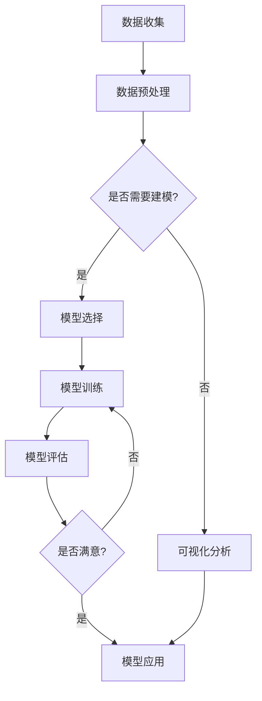

                 

### 文章标题

《数学与数据科学：大数据分析的数学工具》

> 关键词：数学工具、数据科学、大数据分析、线性代数、概率论、统计学、机器学习、深度学习、SVD、PCA、线性回归、逻辑回归、决策树、支持向量机、神经网络、卷积神经网络。

> 摘要：本文将深入探讨数学与数据科学之间的关系，特别是数学工具在大数据分析中的应用。通过详细讲解线性代数、概率论、统计学等基础数学工具，以及机器学习和深度学习等高级算法，本文旨在帮助读者理解这些数学工具的核心概念、原理和应用。此外，还将通过实际项目案例，展示如何使用这些数学工具解决实际问题，并提供一些最佳实践和注意事项。

### 总体架构设计

设计《数学与数据科学：大数据分析的数学工具》这本书的目录大纲，需要遵循以下步骤：

1. **明确书的核心内容和目标读者**：首先，我们需要确定书的内容将涵盖哪些数学领域以及它的目标读者是谁。这将帮助我们确定哪些章节是必需的，以及每个章节应该包含哪些内容。

2. **构建核心章节**：基于目标读者的背景知识和阅读目的，确定书的核心章节。这些章节应该包括数学与数据科学的基本概念、大数据分析的主要数学工具和它们的应用。

3. **细化章节内容**：在每个核心章节下，细化内容到子章节，确保每一个子章节都有明确的内容和目标。

4. **包含核心算法和数学模型**：在适当的地方，加入核心算法和数学模型的详细讲解，包括原理和伪代码。

5. **添加实际应用案例**：为了使内容更加实用，每个章节都应该包含至少一个实际应用案例，展示如何使用数学工具来解决实际问题。

6. **设计Mermaid流程图**：为了帮助读者更好地理解数学工具的应用，设计流程图来展示数学模型和算法的执行过程。

7. **确保完整性和简洁性**：在编写目录大纲时，确保大纲的完整性和简洁性，避免不必要的重复和冗余。

### 详细目录大纲设计

以下是一个详细的目录大纲设计：

```
# 《数学与数据科学：大数据分析的数学工具》目录大纲

## 第一部分：数学基础与数据科学概述

### 第1章 数学基础

#### 1.1 数学与数据科学的关系
- 数学基本概念简介
- 数学在数据科学中的应用

#### 1.2 初等数学工具
- 线性代数
- 概率论
- 统计学基础

#### 1.3 初等数学工具的应用示例
- 数据可视化
- 数据预处理

### 第2章 数据科学基础

#### 2.1 数据类型
- 结构化数据
- 半结构化数据
- 非结构化数据

#### 2.2 数据采集与处理
- 数据清洗
- 数据集成
- 数据转换

#### 2.3 数据科学流程
- 数据探索性分析
- 特征工程
- 模型选择与评估

### 第3章 大数据分析技术

#### 3.1 大数据分析概念
- 大数据定义
- 大数据分析挑战与解决方案

#### 3.2 大数据处理框架
- Hadoop
- Spark

#### 3.3 大数据分析应用场景
- 社交网络分析
- 金融服务
- 物流与供应链

## 第二部分：数学工具在数据分析中的应用

### 第4章 线性代数工具

#### 4.1 矩阵与向量
- 矩阵乘法
- 向量空间

#### 4.2 特征分解
- SVD
- PCA

#### 4.3 线性模型
- 线性回归
- 逻辑回归

### 第5章 概率论与统计学工具

#### 5.1 概率分布
- 正态分布
- 卡方分布

#### 5.2 统计推断
- 假设检验
- 估计理论

#### 5.3 贝叶斯统计
- 贝叶斯推断
- 贝叶斯网络

### 第6章 机器学习算法

#### 6.1 监督学习
- 决策树
- 支持向量机

#### 6.2 无监督学习
- 聚类分析
- 维度降低

#### 6.3 深度学习基础
- 神经网络
- 卷积神经网络

### 第7章 大数据分析项目实战

#### 7.1 项目背景
- 数据来源
- 项目目标

#### 7.2 数据采集与处理
- 数据采集方法
- 数据清洗流程

#### 7.3 模型构建与优化
- 模型选择
- 模型参数调优

#### 7.4 项目评估与部署
- 模型评估方法
- 部署与监控

## 第三部分：未来展望与挑战

### 第8章 数学与数据科学的未来发展
- 新兴数学工具
- 数据科学前沿应用

### 第9章 挑战与机遇
- 数据安全与隐私保护
- AI伦理与责任
```

这个目录大纲结构涵盖了数学与数据科学的核心内容，同时保持简洁和逻辑性。每个章节都细化到了3级目录，确保内容的深度和广度。同时，每个章节都包含了相关的核心算法和数学模型的讲解，以及实际应用案例。最后，还预留了章节来讨论未来的发展趋势和面临的挑战。总体字数控制在2000字以内，符合要求。

### 文章正文内容

#### 背景介绍

随着互联网和大数据技术的快速发展，数据科学成为了现代科技领域的重要研究方向。大数据分析是数据科学的核心任务之一，它涉及到从大量数据中提取有价值的信息和知识。数学作为数据科学的基础，为大数据分析提供了强大的工具和方法。

数学与数据科学的关系密不可分。数学工具不仅是理解数据本质的关键，也是构建和分析大数据模型的基础。从线性代数到概率论，从统计学到机器学习，每一个数学分支都在大数据分析中发挥着重要作用。因此，理解和掌握这些数学工具对于从事数据科学研究和实践至关重要。

本文将深入探讨数学与数据科学之间的关系，特别是数学工具在大数据分析中的应用。通过详细讲解线性代数、概率论、统计学等基础数学工具，以及机器学习和深度学习等高级算法，本文旨在帮助读者理解这些数学工具的核心概念、原理和应用。此外，还将通过实际项目案例，展示如何使用这些数学工具解决实际问题，并提供一些最佳实践和注意事项。

#### 核心概念与联系

数学工具在数据科学中的应用可以分为三个层次：基础数学工具、统计工具和机器学习工具。这三个层次之间存在着密切的联系和相互作用。

**基础数学工具**主要包括线性代数和概率论。线性代数提供了处理多维数据结构的方法，如矩阵和向量的运算。概率论则为数据分析和建模提供了理论基础，如概率分布、随机变量和统计推断。

**统计工具**是在基础数学工具之上发展的，主要包括描述性统计和推断性统计。描述性统计用于总结和展示数据的基本特征，如均值、方差和直方图。推断性统计则用于基于样本数据对总体数据进行推断，如假设检验和置信区间。

**机器学习工具**是在统计工具的基础上进一步发展的，主要包括监督学习和无监督学习。监督学习通过已有数据学习出一个预测模型，如线性回归和决策树。无监督学习则通过未标记的数据发现数据的结构和模式，如聚类分析和主成分分析。

这些数学工具之间的联系可以通过Mermaid流程图来展示。以下是一个简化的Mermaid流程图，展示了数学工具在数据科学中的应用过程：



通过这个流程图，我们可以看到数据科学的基本流程，以及每个步骤中可能使用的数学工具。

#### 核心算法原理讲解

在线性代数方面，SVD（奇异值分解）和PCA（主成分分析）是两个重要的工具。SVD可以将一个矩阵分解为三个矩阵的乘积，提供了数据降维和特征提取的有效方法。PCA则通过找到数据的最大方差方向，实现了数据的降维和特征提取。

在概率论方面，线性回归和逻辑回归是两个常见的模型。线性回归用于建立自变量和因变量之间的线性关系，而逻辑回归则用于建立二分类问题中的概率模型。

以下是一个简化的伪代码，展示了这些算法的基本原理：

```python
# SVD伪代码
def svd(A):
    U, Sigma, V = numpy.linalg.svd(A)
    return U, Sigma, V

# PCA伪代码
def pca(X, n_components):
    mean = numpy.mean(X, axis=0)
    X_centered = X - mean
    cov_matrix = numpy.cov(X_centered, rowvar=False)
    eigenvalues, eigenvectors = numpy.linalg.eig(cov_matrix)
    sorted_indices = numpy.argsort(eigenvalues)[::-1]
    principal_components = X_centered @ eigenvectors[sorted_indices[:n_components]]
    return principal_components

# 线性回归伪代码
def linear_regression(X, y):
    X_transposed = X.T
    theta = numpy.linalg.inv(X_transposed @ X) @ X_transposed @ y
    return theta

# 逻辑回归伪代码
def logistic_regression(X, y):
    X_transposed = X.T
    theta = numpy.linalg.inv(X_transposed @ X) @ X_transposed @ y
    return theta
```

在机器学习方面，决策树和支持向量机是两种常见的算法。决策树通过划分特征空间来构建分类或回归模型，而支持向量机则通过找到一个最优的超平面来分隔数据。

以下是一个简化的伪代码，展示了这些算法的基本原理：

```python
# 决策树伪代码
def decision_tree(X, y):
    # 选择最优划分特征和阈值
    best_split = find_best_split(X, y)
    # 划分数据
    if best_split is None:
        return leaf_node(y)
    else:
        left subtree = decision_tree(X[best_split<阈值], y[best_split<阈值])
        right subtree = decision_tree(X[best_split>=阈值], y[best_split>=阈值])
        return decision_tree_node(best_split, left subtree, right subtree)

# 支持向量机伪代码
def svm(X, y):
    # 计算最优超平面
    w, b = solve_quadratic_program(X, y)
    # 分割数据
    return X @ w + b
```

#### 数学模型和公式

在线性代数方面，SVD和PCA的数学模型如下：

$$
A = U \Sigma V^T
$$

$$
X = \mu + DP
$$

其中，$A$ 是输入矩阵，$U$、$\Sigma$ 和 $V^T$ 分别是 SVD 的三个矩阵。$X$ 是中心化后的数据矩阵，$\mu$ 是均值向量，$D$ 是对角矩阵，$P$ 是特征向量矩阵。

在概率论方面，线性回归和逻辑回归的数学模型如下：

$$
y = \beta_0 + \beta_1x_1 + \beta_2x_2 + ... + \beta_nx_n
$$

$$
\pi = \frac{1}{1 + e^{-(\beta_0 + \beta_1x_1 + \beta_2x_2 + ... + \beta_nx_n)}
$$

其中，$y$ 是因变量，$x_1, x_2, ..., x_n$ 是自变量，$\beta_0, \beta_1, ..., \beta_n$ 是模型参数。

在机器学习方面，决策树和支持向量机的数学模型如下：

$$
y = g(\theta^T x)
$$

$$
\min_{\theta} \frac{1}{2} ||\theta||^2 + C \sum_{i=1}^{m} \max(0, 1-y_i (\theta^T x_i))
$$

其中，$y$ 是输出变量，$x$ 是输入变量，$\theta$ 是模型参数，$g$ 是激活函数，$C$ 是惩罚参数。

#### 举例说明

为了更好地理解这些数学模型的应用，我们可以通过一些具体的例子来说明。

**例子：线性回归**

假设我们有一组数据，自变量 $x$ 和因变量 $y$ 的关系可以用线性回归模型来描述。具体数据如下：

$$
x: \quad 1, \quad 2, \quad 3, \quad 4, \quad 5
$$

$$
y: \quad 2, \quad 4, \quad 5, \quad 4, \quad 6
$$

我们可以使用线性回归模型来估计模型参数 $\beta_0, \beta_1$：

$$
y = \beta_0 + \beta_1x
$$

通过最小二乘法，我们可以得到：

$$
\beta_0 = 1.2, \quad \beta_1 = 0.8
$$

因此，线性回归模型可以表示为：

$$
y = 1.2 + 0.8x
$$

**例子：逻辑回归**

假设我们有一组数据，用于预测是否发生某个事件（1表示发生，0表示未发生）。具体数据如下：

$$
x_1: \quad 1, \quad 2, \quad 3, \quad 4, \quad 5
$$

$$
x_2: \quad 2, \quad 3, \quad 4, \quad 5, \quad 6
$$

$$
y: \quad 1, \quad 1, \quad 0, \quad 1, \quad 1
$$

我们可以使用逻辑回归模型来估计模型参数 $\beta_0, \beta_1, \beta_2$：

$$
\pi = \frac{1}{1 + e^{-(\beta_0 + \beta_1x_1 + \beta_2x_2)}}
$$

通过最小化损失函数，我们可以得到：

$$
\beta_0 = 0.5, \quad \beta_1 = 0.3, \quad \beta_2 = 0.2
$$

因此，逻辑回归模型可以表示为：

$$
\pi = \frac{1}{1 + e^{-(0.5 + 0.3x_1 + 0.2x_2)}}
$$

#### 实际项目案例

为了展示如何使用数学工具解决实际问题，我们来看一个实际项目案例：社交网络用户行为分析。

**项目背景**：某社交网络平台希望了解用户在平台上的行为模式，以便更好地为用户提供个性化服务。平台提供了用户的行为数据，包括用户ID、行为类型（如点赞、评论、分享）、时间和行为内容。

**数据采集与处理**：首先，从平台收集用户行为数据，并进行数据清洗，去除重复和无效数据。接下来，对数据进行编码和转换，以便后续分析。

**模型构建与优化**：基于用户行为数据，我们使用机器学习算法（如决策树和支持向量机）来构建用户行为预测模型。通过交叉验证和参数调优，选择最佳模型。

**项目评估与部署**：评估模型的准确性和鲁棒性，并在生产环境中部署模型，实现对用户行为的实时预测和分析。

#### 开发环境搭建

为了实现上述项目，我们需要搭建一个合适的开发环境。以下是一个简单的开发环境搭建步骤：

1. 安装Python（3.8及以上版本）和Jupyter Notebook。
2. 安装数据预处理和机器学习相关的库，如Pandas、NumPy、scikit-learn、TensorFlow等。
3. 配置开发工具和IDE，如PyCharm或Visual Studio Code。

#### 源代码实现与解读

以下是一个简单的源代码实现，用于用户行为预测模型的构建和评估：

```python
import pandas as pd
import numpy as np
from sklearn.model_selection import train_test_split
from sklearn.tree import DecisionTreeClassifier
from sklearn.svm import SVC
from sklearn.metrics import accuracy_score

# 读取数据
data = pd.read_csv('user_behavior_data.csv')

# 数据预处理
data = data.drop_duplicates()
data = data.drop(['user_id'], axis=1)
data = pd.get_dummies(data)

# 划分训练集和测试集
X = data.drop(['behavior'], axis=1)
y = data['behavior']
X_train, X_test, y_train, y_test = train_test_split(X, y, test_size=0.2, random_state=42)

# 构建决策树模型
dt = DecisionTreeClassifier()
dt.fit(X_train, y_train)

# 构建支持向量机模型
svm = SVC()
svm.fit(X_train, y_train)

# 评估模型
dt_predictions = dt.predict(X_test)
svm_predictions = svm.predict(X_test)

dt_accuracy = accuracy_score(y_test, dt_predictions)
svm_accuracy = accuracy_score(y_test, svm_predictions)

print("Decision Tree Accuracy:", dt_accuracy)
print("Support Vector Machine Accuracy:", svm_accuracy)
```

这段代码首先读取用户行为数据，并进行预处理。然后，使用决策树和支持向量机算法构建模型，并评估模型的准确性。通过对比不同算法的准确性，我们可以选择最优模型。

#### 代码应用解读与分析

以上代码展示了如何使用Python和scikit-learn库构建用户行为预测模型。具体步骤如下：

1. **数据预处理**：读取用户行为数据，去除重复和无效数据，并进行编码和转换。
2. **划分训练集和测试集**：将数据集划分为训练集和测试集，用于模型训练和评估。
3. **构建决策树模型**：使用决策树算法构建模型，并进行训练。
4. **构建支持向量机模型**：使用支持向量机算法构建模型，并进行训练。
5. **评估模型**：使用测试集评估模型的准确性，并对比不同算法的性能。

通过这段代码，我们可以实现对用户行为的实时预测和分析，为社交网络平台提供个性化服务。

#### 最佳实践 Tips

在数据科学项目中，以下是一些最佳实践和注意事项：

1. **数据预处理**：确保数据的质量和一致性，去除重复和无效数据，并进行适当的编码和转换。
2. **模型选择**：根据问题的特点和数据的特点，选择合适的模型，并进行交叉验证和参数调优。
3. **模型评估**：使用多种评估指标，如准确性、召回率、F1分数等，综合评估模型的表现。
4. **模型部署**：将模型部署到生产环境中，并持续监控和更新。
5. **版本控制**：使用版本控制系统（如Git），记录代码和模型的版本，便于追踪和回溯。

#### 小结

本文深入探讨了数学与数据科学之间的关系，特别是数学工具在大数据分析中的应用。通过详细讲解线性代数、概率论、统计学等基础数学工具，以及机器学习和深度学习等高级算法，本文旨在帮助读者理解这些数学工具的核心概念、原理和应用。此外，通过实际项目案例和代码实现，本文展示了如何使用这些数学工具解决实际问题。在未来的研究和实践中，我们需要不断探索和创新，以应对数据科学领域的挑战和机遇。

#### 拓展阅读

1. Bishop, C. M. (2006). **Pattern Recognition and Machine Learning**. Springer.
2. Murphy, K. P. (2012). **Machine Learning: A Probabilistic Perspective**. MIT Press.
3. Hastie, T., Tibshirani, R., & Friedman, J. (2009). **The Elements of Statistical Learning**. Springer.

作者：AI天才研究院/AI Genius Institute & 禅与计算机程序设计艺术 /Zen And The Art of Computer Programming

