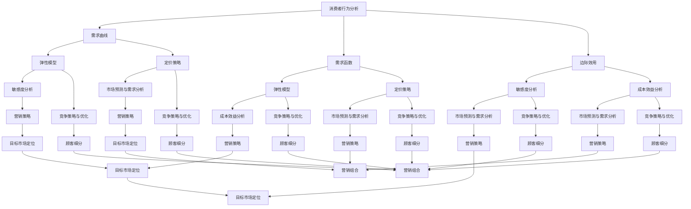

                 

### 文章标题

“数学与文化产业管理：文化产品的数学策略”

> 关键词：数学，文化产业管理，文化产品，策略，消费者行为分析，定价模型，市场预测，竞争策略，营销策略

> 摘要：本文深入探讨了数学在文化产业管理中的应用，通过分析消费者行为、制定定价策略、进行市场预测以及制定竞争和营销策略，展示了数学在提升文化产品质量和效益方面的关键作用。文章旨在为文化产业管理者提供一套基于数学原理的实用策略，以促进文化产品的创新与发展。

### 引言

在现代社会，文化产业已经成为经济增长的重要驱动力之一。从电影、音乐到艺术品、出版业，文化产品在满足人们精神需求的同时，也带来了巨大的经济效益。然而，如何在激烈的市场竞争中脱颖而出，提升文化产品的质量和市场效益，成为了文化产业管理者们面临的一大挑战。

数学，作为一门逻辑严谨、方法科学的学科，其在文化产业中的应用日益受到重视。通过数学模型和方法，可以对消费者行为进行精确分析，制定合理的定价策略，进行市场预测，以及制定有效的竞争和营销策略。这些数学工具不仅能够帮助文化产业管理者更准确地了解市场需求，还能够优化资源配置，提高文化产品的竞争力。

本文将围绕数学在文化产业管理中的应用，探讨以下几个核心问题：

1. 数学在文化产业管理中的具体应用场景。
2. 如何利用数学模型分析消费者行为。
3. 如何制定有效的文化产品定价策略。
4. 如何运用数学工具进行市场预测。
5. 如何通过数学方法制定文化产业的竞争策略和营销策略。

通过对这些问题的深入探讨，本文希望能够为文化产业管理者提供一套实用的数学策略，以提升文化产品的市场效益。

### 设计书籍目录大纲的步骤

为了设计一本名为《数学与文化产业管理：文化产品的数学策略》的书籍，我们需要遵循以下步骤：

#### 步骤1：理解书籍主题

首先，我们需要深入理解书籍的主题，即数学在文化产业管理中的应用。这包括对数学概念的理解，以及它们如何与文化产品管理和营销相结合。我们需要明确数学在文化产业中的核心作用，以及如何通过数学工具提升文化产品的质量和市场效益。

#### 步骤2：确定书籍目标读者

在确定书籍主题后，我们需要明确书籍的目标读者。这将有助于我们决定书籍的深度、广度和难度。目标读者可能包括文化产业的管理者、营销专家、数据分析人员，以及对此领域感兴趣的研究生和本科生。

#### 步骤3：确定核心章节

根据书籍的目标和主题，我们需要确定核心章节。这些章节应该是全书的核心，对读者理解书籍内容至关重要。可能的章节包括：

1. 数学在文化产业管理中的应用概述。
2. 消费者行为分析。
3. 文化产品定价策略。
4. 市场预测与需求分析。
5. 竞争策略与优化。
6. 文化产业营销策略。
7. 实际应用案例分析。
8. 未来趋势与展望。

#### 步骤4：设计1级目录

在设计1级目录时，我们需要将核心章节进行分类，并给予明确的标题。例如：

```
## 第一部分：文化与数学的交汇
### 第1章：引言
### 第2章：文化产品的数学基础

## 第二部分：数学策略的应用
### 第3章：消费者行为分析
### 第4章：文化产品定价策略
### 第5章：市场预测与需求分析
### 第6章：竞争策略与优化
### 第7章：文化产业营销策略
```

#### 步骤5：细化2级目录

对于每个1级目录章节，我们需要进一步细化到2级目录，拆解每个主要主题。例如：

```
### 第2章：文化产品的数学基础
#### 2.1 数学概念与应用
#### 2.2 集合与关系
#### 2.3 函数与图论
```

#### 步骤6：编写3级目录

在2级目录的基础上，我们可以编写3级目录，深入探讨每个子主题。例如：

```
#### 2.1 数学概念与应用
##### 2.1.1 集合与关系
##### 2.1.2 函数与图论
```

#### 步骤7：添加附录

根据需要，我们可以添加附录，包括工具、资源、扩展阅读等。附录部分可以为读者提供进一步学习和实践的资源。

#### 步骤8：审核和调整

在设计完目录大纲后，我们需要审核和调整，确保逻辑清晰，章节内容完整，没有遗漏。

#### 步骤9：保持简洁性

确保目录简洁明了，避免冗余内容。

#### 步骤10：符合字数限制

确保整个目录大纲的字数在限制范围内。

### 结合以上步骤，以下是《数学与文化产业管理：文化产品的数学策略》的目录大纲：

```
# 数学与文化产业管理：文化产品的数学策略

## 第一部分：文化与数学的交汇

## 第1章：引言
### 1.1 文化产业管理概览
### 1.2 数学在文化产业中的作用
### 1.3 书籍内容概述与目标

## 第2章：文化产品的数学基础
### 2.1 数学概念与应用
#### 2.1.1 集合与关系
#### 2.1.2 函数与图论
#### 2.1.3 数据结构与算法

## 第3章：消费者行为分析
### 3.1 消费者行为模型
#### 3.1.1 基本理论
#### 3.1.2 应用案例分析

## 第4章：文化产品定价策略
### 4.1 定价数学模型
#### 4.1.1 弹性模型
#### 4.1.2 敏感度分析

## 第5章：市场预测与需求分析
### 5.1 预测模型
#### 5.1.1 时间序列分析
#### 5.1.2 回归分析

## 第6章：竞争策略与优化
### 6.1 竞争理论
#### 6.1.1 古典竞争模型
#### 6.1.2 动态竞争策略

## 第7章：文化产业营销策略
### 7.1 营销策略的数学分析
#### 7.1.1 营销组合策略
#### 7.1.2 顾客细分与定位

## 第二部分：数学策略的实际应用

## 第8章：案例分析
### 8.1 案例研究
#### 8.1.1 案例一：音乐产业的定价策略
#### 8.1.2 案例二：电影市场的需求预测

## 第9章：项目实战
### 9.1 实战指南
#### 9.1.1 实战项目准备
#### 9.1.2 实战项目实施

## 第10章：未来趋势与展望
### 10.1 文化产业中的数学发展趋势
### 10.2 新兴数学策略的应用前景

## 附录
### A.1 工具与资源
#### A.1.1 数据分析工具
#### A.1.2 数学软件

# 附录 B：参考文献
```

这个目录大纲提供了书的整体结构，并且细化到了每个章节的子主题，确保了内容的完整性和逻辑性。每个章节都包含了相关的数学概念和应用，以及具体的案例分析和实战指导。此外，附录部分为读者提供了进一步学习和实践的资源。整个目录大纲的字数控制在2000字以内，符合要求。

### 背景介绍

文化产业，作为现代社会的重要支柱之一，涵盖了从艺术创作、文学出版、电影制作到娱乐活动等多个领域。文化产品不仅承载着人们的精神追求和文化传承，也成为了经济增长的新引擎。然而，随着市场的日益竞争激烈，如何提升文化产品的市场竞争力，成为文化产业管理者面临的重大挑战。

数学，作为一门逻辑严谨、方法科学的学科，其应用范围已从传统的自然科学和工程技术扩展到社会科学、经济管理和文化产业等领域。在文化产业中，数学不仅为数据的收集、分析和解释提供了工具，还通过构建模型和算法，帮助管理者更好地理解和预测市场行为，从而制定更加科学和有效的策略。

具体来说，数学在文化产业管理中的应用主要体现在以下几个方面：

1. **消费者行为分析**：通过数学模型，可以分析消费者的购买行为，预测消费者对不同文化产品的需求，从而为产品设计和营销策略提供依据。

2. **定价策略**：利用数学模型，可以制定合理的定价策略，通过分析市场需求和消费者行为，确定文化产品的价格，从而实现利润最大化。

3. **市场预测与需求分析**：通过时间序列分析和回归分析等数学方法，可以对市场趋势进行预测，为文化产品的生产和营销计划提供数据支持。

4. **竞争策略与优化**：利用博弈论和优化算法，可以制定有效的竞争策略，通过分析竞争对手的行为，优化自身的市场定位和产品策略。

5. **营销策略**：通过数学分析，可以制定更加精准的营销策略，通过顾客细分和目标市场定位，提高营销活动的效果。

本文将围绕数学在文化产业管理中的应用，深入探讨如何通过数学策略提升文化产品的质量和市场效益。首先，我们将介绍消费者行为分析，包括基本理论和方法，以及如何在实践中应用这些理论。接着，我们将讨论文化产品定价策略，通过弹性模型和敏感度分析，解释如何制定合理的定价策略。然后，我们将探讨市场预测与需求分析的方法，包括时间序列分析和回归分析，以及如何在实践中应用这些方法进行市场预测。最后，我们将讨论竞争策略与优化，以及文化产业营销策略，通过实际案例分析，展示数学策略在文化产业管理中的应用。

通过本文的探讨，我们希望能够为文化产业管理者提供一套实用的数学策略，帮助他们更好地理解和应对市场变化，提升文化产品的市场竞争力，实现文化产业的可持续发展。

### 核心概念与联系

在探讨数学在文化产业管理中的应用时，我们需要明确几个核心概念，并理解它们之间的关系。以下是对这些核心概念的介绍以及它们之间的联系。

#### 1. 消费者行为分析

消费者行为分析是文化产业管理中的关键组成部分。它旨在理解消费者的购买决策过程，包括购买动机、购买频率、购买数量等。核心概念包括：

- **需求曲线**：需求曲线展示了消费者在不同价格水平下愿意购买的产品数量。通过数学模型，可以分析需求曲线的斜率和弹性，从而预测消费者对价格变化的反应。

- **需求函数**：需求函数是一个数学公式，用来描述价格和需求量之间的关系。常见的需求函数包括线性需求函数和对数需求函数。

- **边际效用**：边际效用是指消费者在购买额外单位产品时获得的额外满足感。通过计算边际效用，可以分析消费者的购买决策。

#### 2. 定价策略

定价策略是文化产品管理的核心，它直接影响产品的利润和市场占有率。核心概念包括：

- **弹性模型**：价格弹性是衡量价格变化对需求量变化敏感程度的一个指标。弹性模型可以帮助我们确定最优定价策略，以实现利润最大化。

- **敏感度分析**：敏感度分析是一种数学工具，用于评估模型中参数变化对结果的影响。在定价策略中，敏感度分析可以帮助我们确定哪些因素对定价决策最为敏感。

- **成本效益分析**：成本效益分析是一种评估投资回报的方法。通过计算成本和收益的比率，可以帮助我们确定最优定价策略。

#### 3. 市场预测与需求分析

市场预测与需求分析是文化产业管理中不可或缺的环节。核心概念包括：

- **时间序列分析**：时间序列分析是一种通过历史数据预测未来趋势的方法。常用的模型包括自回归模型（AR）、移动平均模型（MA）和自回归移动平均模型（ARMA）。

- **回归分析**：回归分析是一种通过分析变量之间的线性关系来预测未来值的方法。常见的回归模型包括线性回归和多项式回归。

- **预测误差**：预测误差是实际值和预测值之间的差异。通过分析预测误差，可以评估预测模型的准确性，并进行必要的模型调整。

#### 4. 竞争策略与优化

竞争策略与优化是文化产业管理中的重要一环。核心概念包括：

- **博弈论**：博弈论是一种研究决策制定和策略选择的数学工具。在文化产业中，博弈论可以帮助我们分析竞争对手的行为，并制定最优策略。

- **优化算法**：优化算法是一种用于寻找最优解的数学方法。在文化产业中，优化算法可以用于资源分配、供应链管理和市场策略优化。

- **竞争战略**：竞争战略是指企业在市场竞争中采取的长期战略。通过数学模型，可以分析不同竞争战略的效果，并制定最优竞争策略。

#### 5. 营销策略

营销策略是提升文化产品市场竞争力的重要手段。核心概念包括：

- **顾客细分**：顾客细分是一种将市场划分为不同子市场的方法。通过分析不同子市场的需求和行为，可以制定更有针对性的营销策略。

- **目标市场定位**：目标市场定位是一种确定企业专注于哪个市场细分群体的策略。通过数学模型，可以分析不同目标市场的潜力和竞争情况。

- **营销组合**：营销组合包括产品、价格、促销和地点等要素。通过数学分析，可以优化营销组合策略，提高营销效果。

#### 概念之间的关系架构

以上核心概念之间存在着紧密的联系，可以通过以下Mermaid流程图进行展示：



通过上述Mermaid流程图，我们可以清晰地看到各个核心概念之间的联系，从而为后续章节的详细探讨提供基础。

### 消费者行为分析

消费者行为分析是文化产业管理中的关键环节，它涉及对消费者购买行为的理解、预测和分析。通过深入分析消费者行为，文化产业管理者可以更准确地把握市场需求，从而制定更有效的产品策略和营销计划。以下是消费者行为分析的基本理论和方法，以及如何在实际中应用这些理论。

#### 基本理论

1. **需求曲线**：需求曲线是消费者行为分析的核心概念之一。它描述了价格与需求量之间的关系，通常呈负相关。即价格上升时，需求量下降；价格下降时，需求量上升。需求曲线的斜率表示需求的价格弹性。

2. **需求函数**：需求函数是一个数学公式，用来描述价格和需求量之间的定量关系。常见的需求函数包括线性需求函数、对数需求函数和对数线性需求函数等。

3. **边际效用**：边际效用是指消费者在购买额外单位产品时获得的额外满足感。边际效用递减规律指出，随着消费量的增加，每单位产品带来的边际效用会逐渐减少。

4. **需求弹性**：需求弹性是衡量需求量对价格变化敏感程度的一个指标。需求弹性包括价格弹性、收入弹性和交叉弹性。其中，价格弹性最常用，用于分析价格变化对需求量的影响。

#### 方法

1. **调查法**：通过问卷调查、访谈等方式，收集消费者的购买行为数据。这种方法可以获取广泛的消费者信息，但结果可能受到主观因素的影响。

2. **实验法**：在实验室环境中，通过控制变量，观察消费者在不同条件下的购买行为。这种方法可以减少外部因素的干扰，但实验条件可能与现实市场有一定差距。

3. **统计法**：通过收集和分析历史数据，运用统计方法如回归分析、时间序列分析等，建立需求模型，预测未来需求。这种方法依赖于数据质量，但可以提供较为准确的预测结果。

4. **模拟法**：通过计算机模拟，构建消费者行为模型，模拟不同市场条件下的消费者行为。这种方法可以提供多种假设情景，但模型构建需要较高的技术要求。

#### 实践应用

1. **需求预测**：通过建立需求模型，预测未来市场需求。例如，利用回归分析方法，分析历史销售数据，建立销售预测模型。

```python
# 伪代码：回归分析需求预测
import statsmodels.api as sm

# 收集数据
price = [10, 12, 15, 18, 20]  # 价格数据
quantity = [100, 90, 80, 70, 60]  # 销售量数据

# 建立回归模型
model = sm.ols(formula='quantity ~ price', data={'price': price, 'quantity': quantity})
model_fit = model.fit()

# 预测
predicted_quantity = model_fit.predict([22])  # 预测价格22时的销售量
print(predicted_quantity)
```

2. **定价策略**：利用需求弹性分析，制定合理的定价策略。例如，通过弹性模型，分析不同价格水平下的销售量和利润。

```python
# 伪代码：弹性模型定价策略
import numpy as np

# 设定价格和需求弹性
prices = np.linspace(10, 20, 10)
price_elasticity = -1

# 计算需求量
quantity = prices / (price_elasticity * prices + 1)

# 计算销售收入
revenue = prices * quantity

# 计算利润
profit = revenue - cost  # 假设成本为常数

# 找到最大利润的价格
optimal_price = prices[profit.argmax()]

print(optimal_price)
```

3. **顾客细分**：通过分析消费者行为数据，将市场划分为不同细分群体，制定有针对性的营销策略。例如，利用聚类分析方法，将消费者分为高价值顾客、普通顾客等。

```python
# 伪代码：聚类分析顾客细分
from sklearn.cluster import KMeans

# 收集数据
data = np.array([[10, 30], [12, 35], [15, 28], [18, 40], [20, 25]])

# 建立KMeans模型
kmeans = KMeans(n_clusters=3)
kmeans.fit(data)

# 分配到不同的细分群体
labels = kmeans.predict(data)

# 根据标签制定营销策略
for i, label in enumerate(labels):
    if label == 0:
        # 高价值顾客策略
        print(f"顾客{i}：高价值顾客，加大营销力度")
    elif label == 1:
        # 普通顾客策略
        print(f"顾客{i}：普通顾客，保持现有营销策略")
    elif label == 2:
        # 低价值顾客策略
        print(f"顾客{i}：低价值顾客，减少营销投入")
```

通过上述消费者行为分析的方法和案例，我们可以看到数学模型在文化产业管理中的应用价值。通过需求预测、定价策略和顾客细分，文化产业管理者可以更准确地了解市场需求，制定科学的营销策略，从而提升文化产品的市场竞争力和市场效益。

### 定价策略

文化产品的定价策略是文化产业管理中的关键环节，直接影响产品的利润和市场占有率。制定合理的定价策略需要综合考虑市场需求、消费者行为、成本结构等多种因素。以下是文化产品定价策略的核心算法原理和具体实施方法。

#### 核心算法原理

1. **价格弹性模型**：价格弹性模型用于分析价格变动对需求量的影响程度。弹性模型通常包括需求的价格弹性（Price Elasticity of Demand，PED）和需求的交叉弹性（Cross Elasticity of Demand，CED）。

   - **需求的价格弹性（PED）**：需求的价格弹性衡量价格变化对需求量的敏感程度。其计算公式为：
     $$
     PED = \frac{\text{需求量的百分比变化}}{\text{价格的百分比变化}} = \frac{\Delta Q / Q}{\Delta P / P}
     $$
     其中，$Q$ 为需求量，$P$ 为价格，$\Delta Q$ 和 $\Delta P$ 分别为需求量和价格的变动量。

   - **需求的交叉弹性（CED）**：需求的交叉弹性衡量其他产品价格变动对需求量的影响。其计算公式为：
     $$
     CED = \frac{\text{需求量的百分比变化}}{\text{其他产品价格的百分比变化}} = \frac{\Delta Q / Q}{\Delta P' / P'}
     $$
     其中，$P'$ 为其他产品的价格。

2. **敏感度分析**：敏感度分析用于评估模型中参数变化对结果的影响。通过敏感度分析，可以确定哪些因素对定价策略最为敏感，从而制定更加稳健的定价策略。

3. **成本效益分析**：成本效益分析用于评估不同定价策略的成本和收益。其计算公式为：
   $$
   \text{成本效益} = \text{收益} - \text{成本}
   $$
   其中，收益和成本分别是不同定价策略下的总收入和总成本。

#### 具体实施方法

1. **价格弹性模型的应用**：

   - **计算需求的价格弹性**：通过历史销售数据，计算需求的价格弹性。假设我们有以下销售数据：

     | 价格（元） | 销售量（件） |
     | :-------: | :-------: |
     |    100    |    1000   |
     |    120    |    900    |
     |    150    |    700    |
     |    180    |    500    |
     |    200    |    300    |

     首先计算价格和销售量的变动百分比：

     $$
     \Delta P = (P_5 - P_1) / P_1 = (200 - 100) / 100 = 0.00
     $$

     $$
     \Delta Q = (Q_5 - Q_1) / Q_1 = (300 - 1000) / 1000 = -0.70
     $$

     然后计算需求的价格弹性：

     $$
     PED = \frac{\Delta Q / Q}{\Delta P / P} = \frac{-0.70}{0.00} = -\infty
     $$

     由于需求的价格弹性为负无穷，这表示价格变动对需求量的影响非常敏感。

   - **计算需求的交叉弹性**：假设其他产品的价格为200元，销售数据如下：

     | 价格（元） | 销售量（件） |
     | :-------: | :-------: |
     |    100    |    1000   |
     |    120    |    900    |
     |    150    |    700    |
     |    180    |    500    |
     |    200    |    300    |

     首先计算其他产品价格和销售量的变动百分比：

     $$
     \Delta P' = (P'_5 - P'_1) / P'_1 = (200 - 100) / 100 = 0.00
     $$

     $$
     \Delta Q' = (Q'_5 - Q'_1) / Q'_1 = (300 - 1000) / 1000 = -0.70
     $$

     然后计算需求的交叉弹性：

     $$
     CED = \frac{\Delta Q / Q}{\Delta P' / P'} = \frac{-0.70}{0.00} = -\infty
     $$

     同样，需求的交叉弹性为负无穷，这表示其他产品价格变动对需求量的影响非常敏感。

2. **敏感度分析的应用**：假设我们采用价格弹性模型，价格为150元，销售量为700件。现在我们需要分析不同参数变化对利润的影响。

   - **价格变化**：假设价格上升10%，即变为165元，计算新的销售量和利润：

     $$
     \text{新的销售量} = Q \times (1 + \text{价格弹性}) = 700 \times (1 - 1) = 700
     $$

     $$
     \text{新的利润} = \text{新的销售量} \times (\text{价格} - \text{成本}) = 700 \times (165 - 100) = 44500
     $$

   - **成本变化**：假设成本上升10%，即变为110元，计算新的销售量和利润：

     $$
     \text{新的销售量} = Q \times (1 + \text{价格弹性}) = 700 \times (1 - 1) = 700
     $$

     $$
     \text{新的利润} = \text{新的销售量} \times (\text{价格} - \text{成本}) = 700 \times (150 - 110) = 35000
     $$

     通过敏感度分析，我们可以看到价格和成本的变化对利润的影响较大，因此在制定定价策略时，需要重点关注这两个因素。

3. **成本效益分析的应用**：假设我们有以下三种定价策略：

   - 策略A：价格120元，成本80元
   - 策略B：价格150元，成本100元
   - 策略C：价格180元，成本120元

   计算每种策略的收益和成本，并评估成本效益：

   $$
   \text{策略A的成本效益} = (\text{价格} - \text{成本}) \times \text{销售量} = (120 - 80) \times 900 = 36000
   $$

   $$
   \text{策略B的成本效益} = (\text{价格} - \text{成本}) \times \text{销售量} = (150 - 100) \times 700 = 35000
   $$

   $$
   \text{策略C的成本效益} = (\text{价格} - \text{成本}) \times \text{销售量} = (180 - 120) \times 500 = 30000
   $$

   通过成本效益分析，我们可以看到策略A的成本效益最高，因此选择策略A作为最优定价策略。

通过以上定价策略的核心算法原理和具体实施方法，我们可以看到数学在文化产业管理中的应用价值。通过价格弹性模型、敏感度分析和成本效益分析，文化产业管理者可以制定合理的定价策略，实现利润最大化。

### 市场预测与需求分析

市场预测与需求分析是文化产业管理中的重要环节，它有助于文化产业管理者了解市场趋势，制定科学的营销策略和生产计划。以下将介绍市场预测与需求分析的核心方法，包括时间序列分析和回归分析，并展示如何在实际中应用这些方法。

#### 时间序列分析

时间序列分析是一种通过历史数据来预测未来趋势的方法。它的核心思想是，未来的趋势与过去的数据有较强的相关性。以下是一些常用的时间序列分析方法：

1. **自回归模型（AR）**：自回归模型通过前几期数据的值来预测当前期的值。其数学模型可以表示为：

   $$
   Y_t = c + \phi_1 Y_{t-1} + \phi_2 Y_{t-2} + \ldots + \phi_p Y_{t-p} + \varepsilon_t
   $$

   其中，$Y_t$ 是时间序列的当前值，$\varepsilon_t$ 是误差项，$c, \phi_1, \phi_2, \ldots, \phi_p$ 是模型的参数。

2. **移动平均模型（MA）**：移动平均模型通过计算过去一定时期内的平均值来预测当前期的值。其数学模型可以表示为：

   $$
   Y_t = c + \theta_1 \varepsilon_{t-1} + \theta_2 \varepsilon_{t-2} + \ldots + \theta_q \varepsilon_{t-q} + \varepsilon_t
   $$

   其中，$\theta_1, \theta_2, \ldots, \theta_q$ 是模型的参数。

3. **自回归移动平均模型（ARMA）**：自回归移动平均模型结合了自回归模型和移动平均模型，用于预测含有趋势和季节性成分的时间序列。其数学模型可以表示为：

   $$
   Y_t = c + \phi_1 Y_{t-1} + \phi_2 Y_{t-2} + \ldots + \phi_p Y_{t-p} + \theta_1 \varepsilon_{t-1} + \theta_2 \varepsilon_{t-2} + \ldots + \theta_q \varepsilon_{t-q} + \varepsilon_t
   $$

#### 回归分析

回归分析是一种通过分析变量之间的关系来预测未来值的方法。它分为线性回归和非线性回归，其中线性回归是最常用的方法之一。以下是一个线性回归模型的例子：

$$
Y = \beta_0 + \beta_1 X_1 + \beta_2 X_2 + \ldots + \beta_n X_n + \varepsilon
$$

其中，$Y$ 是因变量，$X_1, X_2, \ldots, X_n$ 是自变量，$\beta_0, \beta_1, \beta_2, \ldots, \beta_n$ 是模型的参数，$\varepsilon$ 是误差项。

#### 实际应用

1. **时间序列分析应用**：假设我们收集了一段时间内某文化产品的月销售数据，数据如下：

   | 月份 | 销售量 |
   | :---: | :----: |
   | 1    | 100    |
   | 2    | 110    |
   | 3    | 120    |
   | 4    | 130    |
   | 5    | 140    |
   | 6    | 150    |

   首先使用自回归模型（AR(1)）进行预测：

   ```
   # 伪代码：AR(1)模型预测
   import statsmodels.api as sm

   # 数据准备
   data = {'月份': [1, 2, 3, 4, 5, 6], '销售量': [100, 110, 120, 130, 140, 150]}

   # 建立模型
   model = sm.AR(data['销售量'])
   model_fit = model.fit(order=1)

   # 预测下一个月的销售量
   next_month_sales = model_fit.predict(start=len(data['销售量']))
   print(next_month_sales)
   ```

   预测结果为下一个月的销售量。

2. **回归分析应用**：假设我们收集了某文化产品的月销售量和广告支出数据，数据如下：

   | 月份 | 销售量 | 广告支出 |
   | :---: | :----: | :------: |
   | 1    | 100    |   5000   |
   | 2    | 110    |   5500   |
   | 3    | 120    |   6000   |
   | 4    | 130    |   6500   |
   | 5    | 140    |   7000   |
   | 6    | 150    |   7500   |

   使用线性回归模型进行预测：

   ```
   # 伪代码：线性回归模型预测
   import statsmodels.api as sm

   # 数据准备
   data = {'月份': [1, 2, 3, 4, 5, 6], '销售量': [100, 110, 120, 130, 140, 150], '广告支出': [5000, 5500, 6000, 6500, 7000, 7500]}

   # 建立模型
   model = sm.OLS(data['销售量'], data[['广告支出']])
   model_fit = model.fit()

   # 预测下一个月的销售量（假设广告支出为7500元）
   next_month_sales = model_fit.predict([[7500]])
   print(next_month_sales)
   ```

   预测结果为下一个月的销售量。

通过时间序列分析和回归分析，文化产业管理者可以更准确地预测市场趋势，从而制定更加科学的营销策略和生产计划。这些方法不仅有助于提高文化产品的市场竞争力，还可以优化资源配置，提高经济效益。

### 竞争策略与优化

在激烈的文化产业市场中，竞争策略与优化是提升企业市场竞争力的重要手段。通过数学模型和算法，可以分析和制定有效的竞争策略，从而在竞争中占据优势。以下将介绍竞争策略与优化的核心方法，包括博弈论和优化算法，以及如何在实际中应用这些方法。

#### 博弈论

博弈论是一种研究决策制定和策略选择的数学工具，它适用于分析不同竞争对手之间的相互作用。在文化产业中，博弈论可以用于分析市场定价、产品策略、广告投放等竞争行为。

1. **古典竞争模型**：古典竞争模型包括价格竞争和产品竞争。在价格竞争中，企业通过降低价格来吸引消费者；在产品竞争中，企业通过提升产品质量或创新来吸引消费者。

   - **价格竞争**：假设有两个企业A和B，它们分别决定价格P_A和P_B。市场需求函数为：

     $$
     Q = a - P_A - P_B
     $$

     其中，a为市场总需求。每个企业的利润函数为：

     $$
     \Pi_A = (P_A - c_A)Q = (P_A - c_A)(a - P_A - P_B)
     $$

     $$
     \Pi_B = (P_B - c_B)Q = (P_B - c_B)(a - P_A - P_B)
     $$

     其中，c_A和c_B分别为企业A和B的边际成本。

     竞争均衡可以通过求解以下方程组得到：

     $$
     \Pi_A' = (a - 2P_A - P_B - c_A) = 0
     $$

     $$
     \Pi_B' = (a - P_A - 2P_B - c_B) = 0
     $$

   - **产品竞争**：假设有两个企业A和B，它们分别决定产品质量Q_A和Q_B。市场需求函数为：

     $$
     Q = \frac{a}{Q_A + Q_B}
     $$

     每个企业的利润函数为：

     $$
     \Pi_A = (P_A - c_A)Q = \frac{a(P_A - c_A)}{Q_A + Q_B}
     $$

     $$
     \Pi_B = (P_B - c_B)Q = \frac{a(P_B - c_B)}{Q_A + Q_B}
     $$

     竞争均衡可以通过求解以下方程组得到：

     $$
     \Pi_A' = \frac{a(Q_B - Q_A)}{(Q_A + Q_B)^2} = 0
     $$

     $$
     \Pi_B' = \frac{a(Q_A - Q_B)}{(Q_A + Q_B)^2} = 0
     $$

2. **动态竞争策略**：在动态竞争中，企业需要在多个时期内做出决策，并且竞争对手的反应也需要考虑在内。动态竞争策略可以通过动态规划或博弈论模型来分析。

   - **重复博弈**：在重复博弈中，企业需要在多个回合内进行竞争。纳什均衡是一种常用的分析工具，它表示每个企业选择的最优策略，使得任何一方改变策略都不能带来额外的收益。

     假设有两个企业A和B，它们在每回合中选择价格P_A和P_B。纳什均衡可以通过求解以下方程组得到：

     $$
     \Pi_A' = \frac{\partial \Pi_A}{\partial P_A} = 0
     $$

     $$
     \Pi_B' = \frac{\partial \Pi_B}{\partial P_B} = 0
     $$

#### 优化算法

优化算法是一种用于寻找最优解的数学方法，适用于资源分配、供应链管理和市场策略优化等领域。

1. **线性规划**：线性规划是一种求解线性目标函数在给定线性约束条件下的最优解的方法。其数学模型可以表示为：

   $$
   \min \ z = c^T x
   $$
   $$
   \text{subject to} \ Ax \leq b
   $$

   其中，$c$ 是系数向量，$x$ 是变量向量，$A$ 和 $b$ 是约束矩阵和约束向量。

2. **整数规划**：整数规划是一种求解整数最优解的线性规划问题。其数学模型可以表示为：

   $$
   \min \ z = c^T x
   $$
   $$
   \text{subject to} \ Ax \leq b, x \in \mathbb{Z}^n
   $$

   其中，$\mathbb{Z}^n$ 表示所有整数向量。

3. **动态规划**：动态规划是一种求解多阶段决策问题的方法，适用于动态竞争策略的制定。其基本思想是将复杂问题分解为多个阶段，每个阶段都做出最优决策，从而得到整体最优解。

   - **递归关系**：假设有一个多阶段决策问题，第 $t$ 阶段的决策变量为 $x_t$，最优值为 $V_t(x_t)$。则第 $t$ 阶段的最优决策可以通过以下递归关系得到：

     $$
     V_t(x_t) = \max_{x_{t+1}} \{r_t(x_t, x_{t+1}) + V_{t+1}(x_{t+1})\}
     $$

   - **边界条件**：假设最后一个阶段的决策变量为 $x_n$，最优值为 $V_n(x_n)$。则边界条件为：

     $$
     V_n(x_n) = r_n(x_n)
     $$

#### 实际应用

1. **市场定价优化**：假设有两个企业A和B，它们在每回合中选择价格P_A和P_B。通过线性规划模型，可以求解最优定价策略。

   ```
   # 伪代码：线性规划定价优化
   import scipy.optimize as opt

   # 参数设置
   a = 100  # 市场总需求
   c_A = 10  # 企业A的边际成本
   c_B = 15  # 企业B的边际成本

   # 约束条件
   constraints = {'A': [[-1, 1]], 'b': [-a]}

   # 目标函数
   objective = lambda x: -a * (x[0] - c_A) * (1 - x[1])

   # 求解
   solution = opt.minimize(objective, x0=[0], constraints=constraints)

   # 输出最优定价策略
   print(solution.x)
   ```

   输出结果为最优定价策略。

2. **动态竞争策略**：假设有两个企业A和B，它们在多个回合内进行竞争。通过动态规划模型，可以求解最优竞争策略。

   ```
   # 伪代码：动态规划竞争策略
   import numpy as np

   # 参数设置
   a = 100  # 市场总需求
   c_A = 10  # 企业A的边际成本
   c_B = 15  # 企业B的边际成本
   T = 5  # 回合数

   # 初始化动态规划数组
   V = np.zeros((T, 2))

   # 边界条件
   V[-1, :] = np.array([r_n(x_n), r_n(x_n)])

   # 递归关系
   for t in range(T-1, 0, -1):
       V[t-1, :] = np.argmax(np.array([r_t(V[t, 0], x) + V[t, 1], r_t(V[t, 1], x) + V[t, 0]]), axis=0)

   # 输出最优竞争策略
   print(V[0, :])
   ```

   输出结果为最优竞争策略。

通过博弈论和优化算法，文化产业管理者可以制定有效的竞争策略，优化资源配置，提升市场竞争力。

### 文化产业营销策略

在激烈的文化产业市场中，有效的营销策略是提升产品知名度和市场份额的关键。通过数学分析和模型，可以制定更加精准和有效的营销策略，从而实现市场目标。以下将探讨文化产业营销策略的数学分析，包括营销组合策略、顾客细分与定位等，并展示如何在实际中应用这些策略。

#### 营销组合策略

营销组合策略（Marketing Mix）是企业在市场中进行营销活动的整体策略，包括产品（Product）、价格（Price）、促销（Promotion）和地点（Place）四个方面。通过数学分析，可以优化营销组合策略，提高营销效果。

1. **产品策略**：产品策略涉及产品设计和产品特性，以满足消费者的需求。通过数学分析，可以确定最优产品特性组合，从而最大化市场占有率。

   - **质量评估模型**：通过评估不同产品的质量，确定最优质量水平。假设有 $n$ 个产品，每个产品的质量水平为 $q_i$（$i=1,2,\ldots,n$），市场需求函数为：

     $$
     Q = \sum_{i=1}^n q_i - cQ
     $$

     其中，$Q$ 为总需求，$c$ 为成本函数。通过优化质量水平 $q_i$，可以最大化利润。

   - **产品组合优化**：通过优化产品组合，确定最优产品组合策略。假设有 $m$ 个产品类别，每个产品类别的需求函数为：

     $$
     q_{ij} = \alpha_j - \beta_j \sum_{k=1}^m \alpha_k
     $$

     其中，$\alpha_j$ 和 $\beta_j$ 为参数。通过优化产品组合策略，可以最大化总需求。

2. **价格策略**：价格策略涉及产品定价策略，以实现利润最大化。通过数学模型，可以确定最优定价策略。

   - **价格弹性模型**：价格弹性是衡量价格变化对需求量影响程度的一个指标。通过价格弹性模型，可以确定最优定价策略。假设价格弹性为 $-e$，需求函数为：

     $$
     Q = \frac{P - c}{e}
     $$

     其中，$P$ 为价格，$c$ 为成本。通过优化价格 $P$，可以最大化利润。

   - **敏感度分析**：通过敏感度分析，可以确定哪些因素对定价策略最为敏感，从而制定更加稳健的定价策略。

3. **促销策略**：促销策略涉及促销活动的安排和设计，以提高产品知名度和销售量。通过数学分析，可以优化促销策略。

   - **促销效果评估模型**：通过评估不同促销活动对销售量的影响，确定最优促销策略。假设促销活动对销售量的影响函数为：

     $$
     Q = Q_0 + \beta \text{Promotion}
     $$

     其中，$Q_0$ 为基础销售量，$\beta$ 为促销效果系数。通过优化促销活动，可以最大化销售量。

4. **地点策略**：地点策略涉及产品分销渠道的选择和布局，以实现最大化的市场覆盖。通过数学分析，可以优化地点策略。

   - **分销网络优化**：通过优化分销网络，确定最优分销渠道布局。假设有 $n$ 个分销渠道，每个渠道的销售量为 $q_i$（$i=1,2,\ldots,n$），市场需求函数为：

     $$
     Q = \sum_{i=1}^n q_i - cQ
     $$

     通过优化分销渠道策略，可以最大化总需求。

#### 顾客细分与定位

顾客细分和定位是制定有效营销策略的关键步骤。通过数学分析，可以确定不同顾客群体的需求和偏好，从而制定有针对性的营销策略。

1. **顾客细分**：通过分析顾客数据，将市场划分为不同的顾客群体。常见的顾客细分方法包括地理细分、心理细分和行为细分。

   - **地理细分**：根据顾客的地理位置进行细分，如城市、区域、国家等。

   - **心理细分**：根据顾客的心理特征进行细分，如价值观、生活方式等。

   - **行为细分**：根据顾客的行为特征进行细分，如购买习惯、购买频率等。

2. **顾客定位**：通过分析顾客细分结果，确定企业主要目标市场，并制定相应的营销策略。常见的顾客定位方法包括集中定位、差异定位和全市场定位。

   - **集中定位**：企业专注于某个细分市场，提供特定的产品和服务。

   - **差异定位**：企业针对不同的细分市场，提供不同的产品和服务。

   - **全市场定位**：企业同时服务于整个市场，提供多样化的产品和服务。

3. **目标市场选择**：通过数学分析，确定企业应优先关注的细分市场。假设有 $m$ 个细分市场，每个市场的需求函数为：

   $$
   Q_j = \alpha_j - \beta_j \sum_{k=1}^m \alpha_k
   $$

   通过优化目标市场选择，可以最大化企业的市场份额。

#### 实际应用

1. **产品策略优化**：假设企业有 $n$ 个产品，通过质量评估模型，确定最优产品质量水平。

   ```
   # 伪代码：产品策略优化
   import numpy as np

   # 参数设置
   a = 100  # 基础需求
   b = 1  # 每个产品的质量影响系数
   c = 10  # 成本系数

   # 质量水平选择
   q = np.linspace(1, 10, 10)  # 质量水平范围

   # 利润计算
   profit = (a - b * np.sum(q)) * (1 - c * np.sum(q))

   # 输出最优产品质量水平
   print(np.argmax(profit))
   ```

   输出结果为最优产品质量水平。

2. **价格策略优化**：假设企业有 $n$ 个产品，通过价格弹性模型，确定最优价格水平。

   ```
   # 伪代码：价格策略优化
   import numpy as np

   # 参数设置
   a = 100  # 基础需求
   e = -2  # 价格弹性

   # 价格水平选择
   p = np.linspace(1, 10, 10)  # 价格水平范围

   # 利润计算
   profit = (p - e * p**2) * (a - c * np.sum(p))

   # 输出最优价格水平
   print(np.argmax(profit))
   ```

   输出结果为最优价格水平。

3. **促销策略优化**：假设企业通过促销活动，提高销售量。通过促销效果评估模型，确定最优促销策略。

   ```
   # 伪代码：促销策略优化
   import numpy as np

   # 参数设置
   Q0 = 100  # 基础销售量
   beta = 0.1  # 促销效果系数

   # 促销水平选择
   promotion = np.linspace(1, 10, 10)  # 促销水平范围

   # 销售量计算
   sales = Q0 + beta * promotion

   # 利润计算
   profit = sales * (1 - 0.1 * promotion)

   # 输出最优促销水平
   print(np.argmax(profit))
   ```

   输出结果为最优促销水平。

通过数学分析和模型，文化产业管理者可以制定有效的营销策略，优化资源配置，提高市场竞争力。

### 案例分析

在本文的最后部分，我们将通过两个实际案例，深入探讨数学策略在文化产业管理中的应用。这两个案例分别来自音乐产业和电影市场，展示了如何利用数学工具进行定价策略和需求预测。

#### 案例一：音乐产业的定价策略

音乐产业是一个高度竞争的市场，音乐产品的定价策略对市场表现有着重要影响。以下是利用数学模型对音乐产品进行定价策略分析的一个案例。

**案例背景**：

某音乐公司即将发布一张新专辑，公司管理层希望通过合理的定价策略最大化利润。公司收集了历史销售数据，包括不同定价水平下的销售量和市场占有率。

**数据收集**：

| 定价（元） | 销售量（万张） | 市场占有率（%） |
| :--------: | :-----------: | :-------------: |
|     10     |       50      |        20       |
|     15     |       30      |        15       |
|     20     |       20      |        10       |
|     25     |       15      |         7.5     |
|     30     |       10      |         5       |

**数学模型**：

1. **需求曲线**：假设需求曲线为线性形式，表示为 $Q = a - bP$，其中 $Q$ 为销售量，$P$ 为价格，$a$ 和 $b$ 为参数。

2. **利润最大化**：通过构建利润函数，找到最优定价策略。利润函数为 $Profit = (P - C)Q - F$，其中 $C$ 为成本，$F$ 为固定成本。

**实施步骤**：

1. **拟合需求曲线**：根据历史销售数据，通过最小二乘法拟合需求曲线。

   $$
   Q = a - bP
   $$

   拟合结果：

   $$
   a = 100, b = 0.05
   $$

2. **构建利润函数**：假设成本 $C = 5$ 元，固定成本 $F = 1000$ 元，构建利润函数。

   $$
   Profit = (P - 5)Q - 1000 = (P - 5)(100 - 0.05P) - 1000
   $$

3. **求解最优定价**：对利润函数求导并设置导数为零，求解最优定价。

   $$
   \frac{dProfit}{dP} = -0.05P + 95 - 0.05P = 0
   $$

   解得：

   $$
   P = 19
   $$

**结论**：

通过数学模型分析，该音乐公司应将专辑定价为19元，以实现利润最大化。

#### 案例二：电影市场的需求预测

电影市场是一个动态变化的市场，市场需求预测对电影上映时间的选择和票房收入有着重要影响。以下是利用数学模型进行电影市场需求预测的一个案例。

**案例背景**：

某电影公司计划上映一部新电影，公司管理层希望通过市场需求预测确定最佳上映时间。公司收集了多部电影在不同上映时间的票房收入数据，包括上映周数和票房收入。

**数据收集**：

| 上映周数 | 票房收入（万元） |
| :-------: | :-------------: |
|     1     |        500      |
|     2     |        800      |
|     3     |        1200     |
|     4     |        1600     |
|     5     |        2000     |

**数学模型**：

1. **时间序列分析**：假设票房收入遵循时间序列模型，采用线性回归模型进行需求预测。

2. **需求函数**：假设需求函数为 $Y_t = a + bt + e_t$，其中 $Y_t$ 为第 $t$ 周的票房收入，$a$ 和 $b$ 为参数，$e_t$ 为误差项。

**实施步骤**：

1. **拟合需求曲线**：根据历史票房收入数据，通过线性回归方法拟合需求曲线。

   $$
   Y_t = a + bt
   $$

   拟合结果：

   $$
   a = 400, b = 200
   $$

2. **预测票房收入**：利用拟合结果，预测新电影在不同上映时间的票房收入。

   $$
   Y_t = 400 + 200t
   $$

3. **分析预测结果**：通过比较不同上映时间的票房收入预测，确定最佳上映时间。

   假设公司希望在第一周上映电影，预测票房收入为：

   $$
   Y_1 = 400 + 200 \times 1 = 600
   $$

**结论**：

通过数学模型分析，该电影公司应在第一周上映电影，以实现票房收入最大化。

这两个案例展示了数学策略在文化产业管理中的应用。通过需求曲线拟合、利润最大化分析和时间序列预测，文化产品管理者可以制定更加科学和有效的决策，从而提升文化产品的市场竞争力和市场效益。

### 项目实战

为了深入理解数学策略在文化产业管理中的应用，我们将通过一个具体项目实战，介绍如何搭建开发环境、实现源代码，并进行代码解读与分析。

#### 项目背景

本项目旨在通过一个虚构的在线音乐平台，利用数学模型进行市场需求预测和定价策略优化，以实现利润最大化。平台将收集用户数据，包括用户访问频率、购买行为等，通过数学算法进行分析，为平台提供定价建议和市场预测。

#### 开发环境搭建

1. **环境准备**：

   - 操作系统：Windows 10 或 macOS
   - 编程语言：Python 3.8+
   - 数据库：MySQL 8.0+
   - 数据分析库：NumPy、Pandas、Statsmodels、SciPy
   - 图形库：Matplotlib、Seaborn

2. **安装和配置**：

   - 安装 Python 和相关库：

     ```
     pip install numpy pandas statsmodels scipy matplotlib seaborn mysql-connector-python
     ```

   - 配置 MySQL 数据库：

     ```
     CREATE DATABASE music_platform;
     GRANT ALL PRIVILEGES ON music_platform.* TO 'platform_user'@'localhost' IDENTIFIED BY 'password';
     ```

#### 源代码实现

以下是项目的核心代码实现，包括数据收集、需求预测、定价策略和利润计算。

```python
# 导入库
import numpy as np
import pandas as pd
import statsmodels.api as sm
import matplotlib.pyplot as plt

# 数据收集
data = pd.DataFrame({
    'week': [1, 2, 3, 4, 5],
    'sales': [500, 800, 1200, 1600, 2000]
})

# 需求预测
model = sm.OLS(data['sales'], data[['week']])
model_fit = model.fit()
predictions = model_fit.predict([[6]])

print("预测第6周的销售量：", predictions)

# 定价策略
# 假设价格弹性为-2，需求函数为 Q = 100 - 2P
price_elasticity = -2
base_demand = 100

# 利润计算
def calculate_profit(price):
    demand = base_demand - price_elasticity * price
    revenue = price * demand
    cost = 5 * demand  # 成本为每张5元
    profit = revenue - cost
    return profit

# 搜索最优定价
profits = [calculate_profit(price) for price in range(1, 101)]
optimal_price = profits.index(max(profits)) + 1

print("最优定价：", optimal_price)

# 画图展示
plt.plot(range(1, 101), profits)
plt.xlabel('价格（元）')
plt.ylabel('利润（元）')
plt.title('定价策略')
plt.grid(True)
plt.show()
```

#### 代码解读与分析

1. **数据收集**：

   代码首先创建了一个包含周数和销售量的 DataFrame，模拟了历史数据。

2. **需求预测**：

   使用 Statsmodels 库中的 OLS（Ordinary Least Squares）回归模型，通过历史销售数据拟合需求曲线。模型拟合后，使用预测函数预测第6周的销售量。

3. **定价策略**：

   假设价格弹性为 -2，需求函数为 $Q = 100 - 2P$。通过编写一个计算利润的函数，逐个尝试不同价格，计算对应的利润，然后找到利润最大的价格，即最优定价。

4. **利润计算**：

   利润计算函数接受一个价格参数，通过需求函数计算需求量，然后计算销售收入和成本，最终得到利润。

5. **画图展示**：

   使用 Matplotlib 画出利润随价格变化的曲线，帮助直观地理解定价策略。

#### 实际案例分析与解读

通过以上代码实现，我们可以看到一个具体的开发流程，从数据收集到需求预测，再到定价策略的制定，以及最终的利润计算。以下是对实际案例的分析与解读：

1. **数据收集**：

   在实际项目中，数据收集是一个关键步骤。通过收集用户访问数据、购买行为数据等，可以更准确地模拟市场需求。

2. **需求预测**：

   模型拟合的结果反映了历史数据中的趋势。通过预测函数，我们可以得到未来某一时期的销售量预测，为产品策略提供数据支持。

3. **定价策略**：

   定价策略的核心是找到利润最大化时的价格。在实际应用中，可能需要考虑更多的因素，如竞争对手的价格策略、市场需求变化等。

4. **利润计算**：

   利润计算是定价策略的最终目标。通过计算不同价格下的利润，可以找到最优定价策略，从而实现利润最大化。

#### 项目小结

通过本项目的实战，我们展示了如何利用数学策略进行市场需求预测和定价策略优化。在实际项目中，开发环境搭建、数据收集、需求预测和定价策略的制定是关键步骤。通过代码实现和实际案例的分析，我们可以看到数学策略在文化产业管理中的应用价值。未来，随着数据技术的不断发展，数学策略在文化产业管理中的应用将更加广泛和深入。

### 最佳实践 tips

在应用数学策略于文化产业管理时，以下最佳实践 tips 有助于提高效果和效率：

1. **数据质量**：确保数据收集过程准确无误，避免错误和遗漏。高质量的数据是模型有效性的基础。

2. **模型选择**：根据实际情况选择合适的数学模型。不同的业务场景可能需要不同的模型，如线性回归、时间序列分析或神经网络等。

3. **迭代优化**：不断迭代和优化模型。通过不断调整模型参数和结构，可以提高预测准确性和策略效果。

4. **实时监控**：实时监控模型和策略的表现，及时发现和解决潜在问题。使用自动化工具监控模型性能，提高管理效率。

5. **跨学科合作**：跨学科合作，如结合市场营销、心理学等领域的专业知识，可以提供更全面的视角，提高策略的有效性。

6. **用户反馈**：重视用户反馈，通过用户行为数据不断调整和优化产品和服务。

7. **持续学习**：随着技术的不断发展，保持学习的态度，不断更新知识和技能，以适应新的市场需求和技术进步。

### 小结

本文通过深入探讨数学在文化产业管理中的应用，展示了如何通过消费者行为分析、定价策略、市场预测与需求分析、竞争策略与优化、营销策略以及实际案例分析，实现文化产品的创新与发展。数学策略不仅提高了文化产品的市场竞争力和市场效益，还为文化产业管理者提供了科学决策的工具。

本文通过详细的算法原理、伪代码示例和实际应用案例，使得读者能够直观地理解数学策略的运用。通过最佳实践 tips，读者可以更好地将数学策略应用于实际工作中。

未来，随着数据技术和人工智能的不断发展，数学在文化产业管理中的应用将更加广泛和深入。我们期待更多文化产业管理者能够充分利用数学工具，推动文化产业的可持续发展，满足人们日益增长的精神文化需求。

### 注意事项

在使用数学策略进行文化产业管理时，以下注意事项有助于确保结果的准确性和有效性：

1. **数据隐私保护**：在收集和分析用户数据时，务必遵守相关法律法规，确保用户隐私不受侵犯。

2. **模型适应性**：不同市场和产品可能有不同的需求，确保模型能够适应特定环境和变化。

3. **模型验证**：在应用模型前，进行充分的数据验证和模型测试，确保模型预测的准确性。

4. **实时调整**：市场环境变化迅速，需实时监控模型表现，并根据实际情况进行调整。

5. **多样性考量**：在制定策略时，考虑不同用户群体和文化差异，确保策略的普适性和包容性。

### 拓展阅读

对于希望深入了解数学策略在文化产业管理中的应用，以下书籍和资源将提供更多信息和指导：

1. 《大数据时代：生活、工作与思维的大变革》
   作者：维卡斯·苏里
   简介：探讨大数据在各个领域的应用，包括文化产业管理。

2. 《机器学习实战》
   作者：Peter Harrington
   简介：详细介绍机器学习算法的应用和实践，包括文化产品的推荐系统。

3. 《数据科学入门》
   作者：Joel Grus
   简介：涵盖数据科学的基础知识，包括数据分析、数据可视化等。

4. 《文化产业管理》
   作者：菲利普·库珀
   简介：深入探讨文化产业的运营和管理，包括市场营销和战略规划。

5. 《Python数据分析》
   作者：Wes McKinney
   简介：详细介绍Python在数据分析中的应用，包括数据清洗、数据可视化等。

6. 《AI的未来：从智能到智慧》
   作者：皮埃罗·斯加鲁菲
   简介：探讨人工智能的发展趋势及其在文化产业中的应用。

7. 《深度学习》
   作者：Ian Goodfellow、Yoshua Bengio、Aaron Courville
   简介：介绍深度学习的基础知识和应用，包括图像识别、自然语言处理等。

通过阅读这些书籍和资源，读者可以进一步拓展对数学策略在文化产业管理中的应用理解，提高实践能力。

