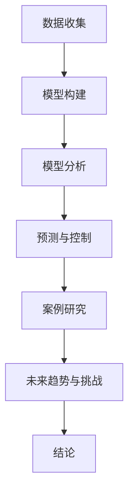

                 

### 第1章 引言

#### 1.1 研究背景

随着全球气候变化和城市化进程的加速，虫害问题日益严重，不仅对农业生产造成巨大损失，还对生态环境和人类健康带来威胁。传统虫害控制方法，如化学农药喷洒和生物防治，在应对复杂虫害问题上显得力不从心。因此，探索一种科学、高效、可持续的虫害控制策略具有重要意义。

数学作为一门基础学科，其强大的建模能力和分析工具，为解决虫害控制问题提供了新的思路。数学模型能够对昆虫种群动态进行定量描述，从而为虫害预测和控制提供科学依据。昆虫学则为我们提供了丰富的昆虫行为和生态学知识，为数学模型的构建提供了基础。

#### 1.2 研究目的和意义

本研究旨在利用数学模型和方法，对昆虫种群动态进行建模和分析，从而为虫害控制提供理论指导和实践策略。具体目标包括：

1. **建立昆虫种群动态模型**：通过分析昆虫的繁殖、生长、死亡等行为，构建合理的数学模型，描述昆虫种群的变化规律。
2. **预测虫害发生**：利用数学模型，对虫害的发生时间、地点和规模进行预测，为制定虫害控制措施提供科学依据。
3. **优化控制策略**：基于预测结果，结合实际控制成本和效果，设计出最优的虫害控制策略，实现虫害的精准防控。

本研究的意义在于：

1. **提高虫害控制效率**：通过科学的数学模型，实现虫害的精准预测和控制，降低虫害造成的经济损失。
2. **促进农业可持续发展**：减少化学农药的使用，降低对环境的污染，实现农业的绿色、可持续发展。
3. **丰富数学在生态学中的应用**：将数学方法应用于昆虫学领域，为数学在生态学等领域的应用提供新的范例。

#### 1.3 研究方法和结构

本研究采用以下方法：

1. **文献综述**：通过查阅相关文献，了解虫害控制领域的研究现状和数学模型的构建方法。
2. **数学建模**：基于昆虫学知识和数学理论，构建描述昆虫种群动态的数学模型。
3. **模型分析**：对构建的数学模型进行稳定性分析和参数估计，验证模型的准确性。
4. **应用案例分析**：选取具体虫害实例，利用数学模型进行预测和控制策略设计。

本文结构安排如下：

- **第1章 引言**：介绍研究背景、目的和意义，以及研究方法和结构。
- **第2章 数学与昆虫学基本概念**：介绍数学和昆虫学的基本概念，为后续建模和分析提供基础。
- **第3章 虫害控制数学模型**：详细阐述虫害控制数学模型的建立过程和模型类型。
- **第4章 数学方法在虫害控制中的应用**：介绍数学方法在虫害预测、决策支持和最优化中的应用。
- **第5章 虫害控制案例研究**：通过具体案例，展示数学模型在虫害控制中的应用效果。
- **第6章 虫害控制的未来趋势与挑战**：分析虫害控制的未来趋势和面临的挑战。
- **第7章 结论**：总结研究成果，提出研究不足和未来研究方向。

通过本文的研究，我们期望能够为虫害控制提供一种新的思路和方法，为农业和生态的可持续发展贡献力量。

### 第2章 数学与昆虫学基本概念

#### 2.1 昆虫学基本概念

昆虫学是研究昆虫形态、分类、生态、生理和行为的科学。昆虫是节肢动物门中的昆虫纲，是动物界中种类最多、数量最大、分布最广的一个类群。昆虫的形态结构复杂多样，但基本结构相似，包括头部、胸部和腹部，通常具有三对足和两对翅。

**昆虫分类**

昆虫的分类主要依据其形态结构、生态习性和分子生物学特征。昆虫可以分为以下几个大类：

1. **无翅亚纲（ Aptera）**：包括蜚蠊、虱子等。
2. **有翅亚纲（Pterygota）**：
   - **半翅目（Hemiptera）**：如蝽、蚜虫等。
   - **同翅目（Homoptera）**：如蜜蜂、蝴蝶等。
   - **直翅目（Orthoptera）**：如蝗虫、螽斯等。
   - **鳞翅目（Lepidoptera）**：如蝴蝶、蛾等。
   - **鞘翅目（Coleoptera）**：如蚂蚁、甲虫等。
   - **膜翅目（Hymenoptera）**：如蜜蜂、黄蜂等。

**昆虫行为学**

昆虫行为学是研究昆虫行为特征及其与环境相互作用的科学。昆虫的行为主要包括取食、繁殖、迁徙、觅偶、防御等。

1. **取食行为**：昆虫的取食行为与其生存密切相关，不同昆虫具有不同的取食方式，如刺吸式、舔吸式、咀嚼式等。
2. **繁殖行为**：昆虫的繁殖行为包括交配、产卵、孵化等过程。昆虫的繁殖策略多样，如集中繁殖和分散繁殖。
3. **迁徙行为**：一些昆虫具有长距离迁徙的行为，如蝴蝶的迁徙和蜜蜂的蜂群迁徙。
4. **防御行为**：昆虫的防御行为包括假死、分泌毒液、硬化外壳等，以逃避天敌和恶劣环境。

**昆虫种群动态**

昆虫种群动态是指昆虫种群数量在时间上的变化规律。昆虫种群动态受多种因素影响，如环境条件、食物供应、天敌捕食、繁殖率等。

1. **种群增长模型**：描述昆虫种群数量随时间的变化，常见的模型有Logistic模型和Ricker模型。
   - **Logistic模型**：描述种群数量在有限资源条件下的增长规律，其公式为：
     $$
     P(t) = \frac{K}{1 + (K-P_0)e^{-rt}}
     $$
     其中，$P(t)$ 为第 $t$ 时期的种群数量，$K$ 为环境承载能力，$P_0$ 为初始种群数量，$r$ 为自然增长率。
   - **Ricker模型**：描述种群数量在捕食者-猎物系统中的增长规律，其公式为：
     $$
     P(t+1) = P(t)e^{r(1-P(t)/K)}
     $$
     其中，$P(t)$ 为第 $t$ 时期的种群数量，$K$ 为环境承载能力，$r$ 为内禀增长率。

2. **种群分布模型**：描述昆虫种群在空间上的分布特征，常见的模型有Poisson分布和负二项分布。

#### 2.2 数学基本概念

数学是研究数量、结构、变化和空间等概念的学科。在昆虫学中，数学模型被广泛应用于描述昆虫种群动态、行为特征和生态过程。

**函数与方程**

函数是数学中最基本的概念之一，表示输入与输出之间的关系。在昆虫学中，函数用于描述昆虫种群数量、生长速率、死亡率等与时间、环境条件等变量之间的关系。

1. **线性函数**：描述输入与输出之间呈线性关系的函数，其一般形式为 $y = mx + b$，其中 $m$ 为斜率，$b$ 为截距。
2. **非线性函数**：描述输入与输出之间呈非线性关系的函数，如指数函数、对数函数、多项式函数等。

方程是含有未知数的数学表达式，通过求解方程可以确定未知数的值。在昆虫学中，方程用于描述昆虫种群动态、生态过程等。

1. **微分方程**：描述动态系统中变量变化速率的方程，如种群增长模型中的微分方程：
   $$
   \frac{dP}{dt} = rP(1-\frac{P}{K})
   $$
2. **差分方程**：描述离散时间序列中变量变化规律的方程，如Ricker模型中的差分方程：
   $$
   P_{t+1} = P_t e^{r(1-\frac{P_t}{K})}
   $$

**微积分**

微积分是研究函数变化率和累计变化率的数学分支。在昆虫学中，微积分用于分析昆虫种群动态、生态过程等。

1. **微分**：研究函数在某一点的变化率，如种群增长速率、死亡率等。
2. **积分**：研究函数的累计变化量，如种群数量、食物消耗量等。

**线性代数**

线性代数研究向量空间、线性方程组和矩阵等概念。在昆虫学中，线性代数用于分析种群动态、生态网络等。

1. **矩阵**：表示数据集的一种方式，如昆虫种群数量矩阵。
2. **线性方程组**：描述多个变量之间线性关系的方程组，如描述昆虫种群动态的方程组：
   $$
   \begin{cases}
   \frac{dP_1}{dt} = r_1 P_1 - a_{12} P_1 P_2 \\
   \frac{dP_2}{dt} = a_{12} P_1 P_2 - r_2 P_2
   \end{cases}
   $$
   其中，$P_1$ 和 $P_2$ 分别为两种昆虫的种群数量，$r_1$ 和 $r_2$ 分别为两种昆虫的内禀增长率，$a_{12}$ 为捕食者-猎物关系系数。

通过了解数学与昆虫学的基本概念，我们可以更好地构建数学模型，分析和预测昆虫种群动态，为虫害控制提供科学依据。

#### 2.2.1 函数与方程

函数与方程是数学中最基本的概念，在描述昆虫种群动态和生态过程中起着关键作用。

**函数的定义**

函数是一种将一个变量映射到另一个变量的规则。在昆虫学中，我们可以用函数描述昆虫种群数量、食物消耗量、生长速率等变量与时间、环境条件等变量之间的关系。例如，我们可以用以下函数描述某种昆虫的种群数量 $P(t)$ 与时间 $t$ 之间的关系：

$$
P(t) = P_0 e^{rt}
$$

其中，$P_0$ 为初始种群数量，$r$ 为自然增长率。这个函数表示，随着时间的推移，昆虫种群数量以指数形式增长。

**方程的定义**

方程是含有未知数的数学表达式，通过求解方程可以确定未知数的值。在昆虫学中，方程用于描述昆虫种群动态、生态过程等。例如，我们可以用以下方程描述某种昆虫的种群数量 $P(t)$ 随时间变化的关系：

$$
\frac{dP}{dt} = rP(1-\frac{P}{K})
$$

这个方程表示，昆虫种群数量的变化速率与当前种群数量成正比，且受环境承载能力 $K$ 的限制。

**微分方程**

微分方程是描述动态系统中变量变化速率的方程。在昆虫学中，微分方程常用于描述昆虫种群动态。例如，上述描述昆虫种群增长的方程就是一个一阶线性微分方程。

$$
\frac{dP}{dt} = rP(1-\frac{P}{K})
$$

这个方程的解可以表示为：

$$
P(t) = \frac{K}{1 + (K-P_0)e^{-rt}}
$$

**差分方程**

差分方程是描述离散时间序列中变量变化规律的方程。在昆虫学中，差分方程常用于描述昆虫种群在离散时间点的变化。例如，我们可以用以下差分方程描述昆虫种群在连续两个时间点 $t$ 和 $t+1$ 之间的变化：

$$
P_{t+1} = P_t e^{r(1-\frac{P_t}{K})}
$$

**举例说明**

假设某种昆虫的初始种群数量为 $P_0 = 100$，环境承载能力为 $K = 1000$，自然增长率 $r = 0.1$。我们可以用上述方程来计算第 $t$ 年的种群数量 $P(t)$。

$$
P(t) = \frac{1000}{1 + (1000-100)e^{-0.1t}}
$$

当 $t=5$ 时，种群数量约为：

$$
P(5) = \frac{1000}{1 + (1000-100)e^{-0.5}} \approx 401.3
$$

这个结果表明，在自然增长率和环境承载能力的限制下，经过5年后，该昆虫的种群数量将增加到约401.3个。

通过函数与方程的概念，我们可以建立数学模型来描述昆虫种群动态，从而为虫害控制提供科学依据。

#### 2.2.2 微积分

微积分是数学中研究变化率和累积量的一个分支，它在昆虫学中有着广泛的应用。微积分主要包括微分和积分两个部分，它们分别对应着变化率和累积量的研究。

**微分**

微分是研究函数在某一点的变化率。在昆虫学中，微分可以用来描述昆虫种群数量的瞬时增长或减少速率。例如，如果我们知道某个昆虫种群的种群数量随时间变化的函数 $P(t)$，我们可以通过微分来求得种群数量的瞬时增长率。

一阶微分方程是描述一个变量关于另一个变量变化率的最简单形式。在昆虫学中，一个典型的一阶微分方程是描述种群增长的Logistic模型：

$$
\frac{dP}{dt} = rP(1 - \frac{P}{K})
$$

这个方程中的 $r$ 是内禀增长率，$K$ 是环境承载能力。方程的左边 $\frac{dP}{dt}$ 表示种群数量 $P$ 关于时间 $t$ 的变化率，右边描述了这种变化率与当前种群数量和承载能力之间的关系。

**积分**

积分是研究函数的累积量。在昆虫学中，积分可以用来计算种群数量的总变化量或总量。例如，如果我们知道某个昆虫种群的种群数量随时间变化的函数 $P(t)$，我们可以通过积分来求得在某个时间段内种群数量的总变化量。

对于一个一阶线性微分方程，其解通常可以通过积分来得到。例如，对于上述的Logistic模型，我们可以通过积分得到种群数量随时间变化的函数：

$$
P(t) = \frac{K}{1 + (K-P_0)e^{-rt}}
$$

这个方程表示，随着时间的推移，昆虫种群数量将趋向于环境承载能力 $K$，但受初始种群数量 $P_0$ 和内禀增长率 $r$ 的影响。

**举例说明**

假设某种昆虫的初始种群数量为 $P_0 = 100$，环境承载能力为 $K = 1000$，自然增长率 $r = 0.1$。我们可以用上述积分结果来计算在 $t=5$ 时该昆虫的种群数量。

$$
P(5) = \frac{1000}{1 + (1000-100)e^{-0.5}} \approx 401.3
$$

这个结果表明，在自然增长率和环境承载能力的限制下，经过5年后，该昆虫的种群数量将增加到约401.3个。

通过微分和积分，我们可以更深入地理解昆虫种群动态，并利用这些数学工具来预测和控制虫害。

#### 2.2.3 线性代数

线性代数是数学中的一个重要分支，它研究向量、矩阵及其相关的运算。在昆虫学中，线性代数被广泛应用于描述昆虫种群动态、生态网络分析和模型参数估计等方面。

**向量与矩阵**

向量是表示一个方向和大小的量，可以用来表示昆虫种群的数量、方向等。例如，一个二维向量 $(x, y)$ 可以表示昆虫种群在两个方向上的数量。

矩阵是一个由数字构成的二维数组，可以用来表示多个向量之间的关系。例如，一个 $3 \times 3$ 的矩阵可以表示三个昆虫种群之间的相互关系。

**线性方程组**

线性方程组是包含多个线性方程的集合。在昆虫学中，线性方程组常用于描述昆虫种群动态。例如，我们可以用以下线性方程组描述两种昆虫的种群数量变化：

$$
\begin{cases}
\frac{dP_1}{dt} = r_1 P_1 - a_{12} P_1 P_2 \\
\frac{dP_2}{dt} = r_2 P_2 - a_{21} P_1 P_2
\end{cases}
$$

其中，$P_1$ 和 $P_2$ 分别为两种昆虫的种群数量，$r_1$ 和 $r_2$ 分别为两种昆虫的内禀增长率，$a_{12}$ 和 $a_{21}$ 分别为两种昆虫之间的相互作用系数。

**矩阵求解**

矩阵求解是线性代数中的核心内容，用于求解线性方程组。常用的方法包括高斯消元法、矩阵分解等。

例如，对于上述的线性方程组，我们可以通过高斯消元法求解得到两种昆虫种群数量的变化趋势。高斯消元法的步骤如下：

1. **写出线性方程组的增广矩阵**：

$$
\left[
\begin{array}{ccc|c}
r_1 & -a_{12} & 0 & P_{10} \\
0 & r_2 & -a_{21} & P_{20}
\end{array}
\right]
$$

2. **使用高斯消元法求解矩阵的秩**：

通过行变换，将矩阵化为行阶梯形式。

$$
\left[
\begin{array}{ccc|c}
1 & 0 & 0 & \frac{P_{10}}{r_1 + a_{12} P_{20}} \\
0 & 1 & 0 & \frac{P_{20}}{r_2 + a_{21} P_{10}}
\end{array}
\right]
$$

3. **从下至上依次解出变量**：

$$
P_1(t) = \frac{P_{10}}{r_1 + a_{12} P_{20}} e^{r_1 t}
$$

$$
P_2(t) = \frac{P_{20}}{r_2 + a_{21} P_{10}} e^{r_2 t}
$$

通过这些步骤，我们可以得到两种昆虫种群数量随时间变化的解。

**矩阵分解**

矩阵分解是将一个矩阵分解为多个矩阵的乘积的过程。常见的矩阵分解方法包括LU分解、奇异值分解（SVD）等。

例如，对于矩阵 $A$ 的LU分解，我们可以将其分解为两个下三角矩阵 $L$ 和 $U$ 的乘积：

$$
A = LU
$$

其中，$L$ 的对角线上的元素为1，$U$ 是上三角矩阵。通过LU分解，我们可以更方便地求解线性方程组。

**举例说明**

假设我们有两种昆虫，其种群数量分别为 $P_1$ 和 $P_2$，内禀增长率分别为 $r_1 = 0.2$ 和 $r_2 = 0.3$，相互作用系数分别为 $a_{12} = 0.1$ 和 $a_{21} = 0.2$。初始种群数量分别为 $P_{10} = 100$ 和 $P_{20} = 200$。我们可以使用线性代数的方法来求解两种昆虫种群数量随时间的变化。

首先，写出线性方程组：

$$
\begin{cases}
\frac{dP_1}{dt} = 0.2 P_1 - 0.1 P_1 P_2 \\
\frac{dP_2}{dt} = 0.3 P_2 - 0.2 P_1 P_2
\end{cases}
$$

然后，使用矩阵求解的方法，将线性方程组转化为矩阵形式：

$$
\left[
\begin{array}{cc}
0.2 & -0.1 \\
-0.2 & 0.3
\end{array}
\right]
\left[
\begin{array}{c}
P_1 \\
P_2
\end{array}
\right]
=
\left[
\begin{array}{c}
0 \\
0
\end{array}
\right]
$$

接下来，使用高斯消元法求解矩阵方程，得到两种昆虫种群数量随时间的变化：

$$
P_1(t) = 100 e^{0.2 t}
$$

$$
P_2(t) = 200 e^{0.3 t}
$$

通过这个例子，我们可以看到如何使用线性代数的方法来描述昆虫种群动态，从而为虫害控制提供科学依据。

### 3.1 模型建立基础

在虫害控制中，建立数学模型是关键的一步，它能够帮助我们理解昆虫种群动态，预测虫害发生的趋势，并制定有效的控制策略。下面，我们将详细阐述建立虫害控制数学模型的基础知识。

#### 3.1.1 模型构建原则

构建虫害控制数学模型时，需要遵循以下原则：

1. **科学性**：模型应基于昆虫学的基本原理和科学数据，确保模型描述的昆虫行为和生态过程是真实可信的。
2. **简洁性**：模型应尽量简洁，以便于理解和计算。复杂模型虽然可能更精确，但过于复杂的模型在实际应用中难以操作和维护。
3. **可解释性**：模型参数和结果应具有明确的生物学和生态学意义，便于科学家和决策者理解。
4. **适应性**：模型应具备良好的适应性，能够适应不同的环境和虫害类型。
5. **灵活性**：模型应允许调整参数和结构，以适应新数据和新的研究需求。

#### 3.1.2 模型变量定义

在建立数学模型时，需要明确模型中的各个变量及其含义。以下是虫害控制模型中常见的一些变量：

1. **种群数量**（$P$）：表示昆虫的总数量。
2. **初始种群数量**（$P_0$）：模型开始时的种群数量。
3. **环境承载能力**（$K$）：环境能够支撑的最大种群数量。
4. **内禀增长率**（$r$）：种群数量自然增长的速率。
5. **相互作用系数**（$a_{ij}$）：描述不同昆虫种群之间的相互作用强度。
6. **死亡率**（$d$）：昆虫种群的自然死亡率。
7. **捕食率**（$f$）：捕食者对昆虫种群的捕食速率。

#### 3.1.3 模型建立步骤

构建虫害控制数学模型通常包括以下步骤：

1. **数据收集**：收集与虫害相关的历史数据，包括种群数量、环境条件、捕食者信息等。
2. **理论分析**：根据昆虫学原理和生态学理论，分析昆虫种群动态，确定模型的基本形式。
3. **模型构建**：基于数据和分析结果，构建数学模型。常见的方法包括：
   - **微分方程模型**：如Logistic模型、Ricker模型等。
   - **差分方程模型**：如离散时间序列模型等。
   - **概率统计模型**：如Markov链模型、随机过程模型等。
4. **模型参数估计**：使用历史数据对模型参数进行估计，确保模型能够准确描述实际情况。
5. **模型验证**：通过对比模型预测结果和实际观测数据，验证模型的准确性。
6. **模型优化**：根据验证结果，调整模型参数或结构，提高模型的预测能力。

#### 3.1.4 模型类型

虫害控制数学模型主要包括以下几种类型：

1. **Logistic模型**：
   $$
   P(t) = \frac{K}{1 + (K-P_0)e^{-rt}}
   $$
   用于描述种群数量在有限资源条件下的增长规律。

2. **Ricker模型**：
   $$
   P_{t+1} = P_t e^{r(1-\frac{P_t}{K})}
   $$
   用于描述捕食者-猎物系统中的种群动态。

3. **差分方程模型**：
   $$
   P_{t+1} = P_t e^{r(1-\frac{P_t}{K})}
   $$
   用于描述种群在离散时间点上的变化。

4. **概率统计模型**：
   - **Markov链模型**：描述昆虫种群在不同状态之间的转移概率。
   - **随机过程模型**：描述昆虫种群数量随时间的随机变化。

通过以上步骤和模型类型，我们可以建立科学、有效的虫害控制数学模型，为虫害预测和控制提供有力支持。

### 3.2 种群动态模型

在虫害控制中，种群动态模型是预测和制定控制策略的核心。这类模型通过数学方程描述昆虫种群数量随时间的变化规律。本节将介绍两种常用的种群动态模型：Logistic模型和Ricker模型，并详细讨论其原理和参数设置。

#### 3.2.1 Logistic模型

Logistic模型是最著名的种群增长模型之一，由法国人口学家Verhulst于1838年提出。该模型考虑了种群数量在有限资源条件下的增长规律，公式如下：

$$
P(t) = \frac{K}{1 + (K-P_0)e^{-rt}}
$$

其中，$P(t)$ 是第 $t$ 时期的种群数量，$K$ 是环境承载能力，即环境所能支持的最大种群数量；$P_0$ 是初始种群数量；$r$ 是自然增长率。

**模型原理**

Logistic模型的基本思想是，随着种群数量的增加，种群增长速率会逐渐减小，因为环境资源有限。当种群数量达到环境承载能力 $K$ 时，增长速率降为零。

1. **种群增长阶段**：当 $P(t) < K$ 时，种群数量增加，增长速率为正。
2. **种群饱和阶段**：当 $P(t) \approx K$ 时，种群数量接近环境承载能力，增长速率减小。
3. **稳定阶段**：当 $P(t) = K$ 时，种群数量达到最大，增长速率为零。

**参数设置**

- **$K$（环境承载能力）**：取决于环境条件，如食物、栖息地等。通常需要通过实地调查或文献资料获取。
- **$P_0$（初始种群数量）**：初始值可以通过观测或历史数据确定。
- **$r$（自然增长率）**：通常由实验数据或文献估计。$r$ 值越大，种群增长速率越快。

**例子**

假设一种昆虫的初始种群数量为 $P_0 = 100$，环境承载能力为 $K = 1000$，自然增长率 $r = 0.05$。我们可以使用Logistic模型预测第 $t$ 年的种群数量：

$$
P(t) = \frac{1000}{1 + (1000-100)e^{-0.05t}}
$$

当 $t = 10$ 时，种群数量约为：

$$
P(10) = \frac{1000}{1 + (1000-100)e^{-0.5}} \approx 405.2
$$

#### 3.2.2 Ricker模型

Ricker模型是另一种描述种群动态的数学模型，由Ricker在1954年提出。该模型在捕食者-猎物系统中应用广泛，公式如下：

$$
P_{t+1} = P_t e^{r(1-\frac{P_t}{K})}
$$

其中，$P_{t+1}$ 和 $P_t$ 分别是第 $t+1$ 时期和第 $t$ 时期的种群数量；$r$ 是内禀增长率，表示种群在没有限制条件下的自然增长速率；$K$ 是环境承载能力。

**模型原理**

Ricker模型描述了种群数量在有限资源条件下的增长，并考虑了捕食者的存在。模型的核心思想是，种群增长速率受当前种群数量和环境承载能力的约束。

1. **种群增长阶段**：当 $P_t < K$ 时，种群数量增加，增长速率为正。
2. **种群饱和阶段**：当 $P_t \approx K$ 时，种群数量接近环境承载能力，增长速率减小。
3. **种群崩溃阶段**：当 $P_t > K$ 时，种群数量开始减少，因为环境资源不足以支持大量种群。

**参数设置**

- **$r$（内禀增长率）**：表示种群在没有捕食者干扰下的自然增长速率，通常通过实验数据确定。
- **$K$（环境承载能力）**：表示环境所能支持的最大种群数量，可以通过实地调查或文献资料确定。

**例子**

假设一种昆虫的初始种群数量为 $P_0 = 100$，环境承载能力为 $K = 1000$，内禀增长率 $r = 0.1$。我们可以使用Ricker模型预测第 $t$ 年的种群数量：

$$
P_{t+1} = P_t e^{0.1(1-\frac{P_t}{1000})}
$$

当 $t = 5$ 时，种群数量约为：

$$
P_5 = 100 e^{0.1(1-\frac{100}{1000})} \approx 110.6
$$

通过这两个模型，我们可以对昆虫种群动态进行预测，从而为虫害控制提供科学依据。在实际应用中，可以根据具体情况选择合适的模型，并结合实地数据和参数调整，提高模型的准确性和实用性。

#### 3.3 预测与控制策略

在虫害控制中，预测和制定控制策略是关键环节。准确的预测能够提前预警虫害的发生，而有效的控制策略则能最大限度地减少虫害带来的损失。本节将详细介绍如何利用数学模型进行预测和控制策略的设计。

##### 3.3.1 预测模型

预测模型是虫害控制的基础。通过历史数据和数学模型，我们可以预测虫害在未来一段时间内的发生情况。常用的预测模型包括时间序列模型和空间预测模型。

1. **时间序列预测**

时间序列预测是基于历史数据，通过分析时间序列中的趋势、季节性和周期性来预测未来的值。常见的时间序列模型有ARIMA模型和LSTM神经网络。

- **ARIMA模型**（自回归积分滑动平均模型）：ARIMA模型通过自回归项（AR）、差分项（I）和移动平均项（MA）的组合，描述时间序列数据。其基本公式为：

$$
\Delta Y_t = \phi_1 \Delta Y_{t-1} + \phi_2 \Delta Y_{t-2} + \ldots + \phi_p \Delta Y_{t-p} + \theta_1 e_{t-1} + \theta_2 e_{t-2} + \ldots + \theta_q e_{t-q}
$$

其中，$\Delta Y_t$ 是差分后的序列，$e_t$ 是白噪声误差项。

- **LSTM神经网络**（长短期记忆网络）：LSTM是一种特殊的循环神经网络，能够处理长时间依赖数据。其基本结构包括输入门、遗忘门和输出门，能够有效地捕捉时间序列中的长期依赖关系。

2. **空间预测**

空间预测考虑了不同地区之间的差异，通过空间统计方法如Kriging来预测种群密度。Kriging方法是一种基于统计回归的预测方法，能够根据已知数据点预测未知点的值。

- **Kriging方法**：Kriging方法通过计算空间自协方差函数，将空间变量转化为空间域上的概率分布，从而实现空间预测。其基本公式为：

$$
Z(\mathbf{x}) = \mu + \sum_{i=1}^n \lambda_i K(\mathbf{x}, \mathbf{x}_i) + \epsilon
$$

其中，$Z(\mathbf{x})$ 是预测值，$\mu$ 是均值，$\lambda_i$ 是权重，$K(\mathbf{x}, \mathbf{x}_i)$ 是核函数，$\epsilon$ 是随机误差。

##### 3.3.2 控制策略设计

基于预测模型，我们可以设计出最优的虫害控制策略，以最大限度地减少虫害带来的损失。常见的控制策略包括预测控制、决策支持系统和最优化方法。

1. **预测控制**

预测控制是基于预测模型，对虫害的发生进行提前预警，从而采取相应的控制措施。预测控制的基本步骤如下：

- **数据收集**：收集与虫害相关的历史数据，包括种群数量、环境条件、气象数据等。
- **模型训练**：使用历史数据训练预测模型，如ARIMA模型或LSTM神经网络。
- **预测**：利用训练好的模型，对未来的虫害发生情况进行预测。
- **预警**：根据预测结果，设定预警阈值，当实际种群数量超过预警阈值时，触发控制措施。

2. **决策支持系统**

决策支持系统（DSS）是一种基于计算机技术的系统，用于辅助决策者制定最优的虫害控制策略。DSS的基本架构包括数据采集、模型库、知识库和用户界面。

- **数据采集**：从各种渠道收集与虫害相关的数据，如气象数据、土壤数据、害虫数据等。
- **模型库**：存储各种预测和控制模型，如ARIMA模型、LSTM神经网络、Kriging方法等。
- **知识库**：存储决策者的经验和专家知识，用于指导模型的选择和参数设置。
- **用户界面**：提供人机交互接口，帮助决策者浏览数据、选择模型、设定参数和生成报告。

3. **最优化方法**

最优化方法用于在给定的约束条件下，寻找最优的虫害控制策略。常见的最优化方法包括线性规划、非线性规划和模拟退火算法。

- **线性规划**：线性规划用于解决线性优化问题，其基本公式为：

$$
\max_{\mathbf{x}} c^T \mathbf{x} \quad \text{subject to} \quad a_i^T \mathbf{x} \leq b_i, \quad i = 1, 2, \ldots, m
$$

其中，$\mathbf{x}$ 是决策变量，$c$ 是目标函数系数，$a_i$ 是约束条件系数，$b_i$ 是约束条件常数。

- **非线性规划**：非线性规划用于解决非线性优化问题，其基本公式为：

$$
\min_{\mathbf{x}} f(\mathbf{x}) \quad \text{subject to} \quad g_i(\mathbf{x}) \leq 0, \quad h_j(\mathbf{x}) = 0, \quad i = 1, 2, \ldots, m; \quad j = 1, 2, \ldots, n
$$

其中，$f(\mathbf{x})$ 是目标函数，$g_i(\mathbf{x})$ 和 $h_j(\mathbf{x})$ 是约束条件。

- **模拟退火算法**：模拟退火算法是一种基于概率的优化算法，通过模拟物理过程中的退火过程，寻找最优解。其基本步骤如下：

  1. **初始设置**：设定初始温度 $T$ 和冷却率 $\alpha$。
  2. **迭代过程**：在当前温度下，从当前解随机选择一个邻近解，计算新解与当前解的目标函数差值，并根据概率接受新解。
  3. **温度调整**：根据当前温度和冷却率，调整温度 $T$。
  4. **终止条件**：当温度降低到预设的终止温度或达到最大迭代次数时，终止算法。

通过以上预测模型和控制策略，我们可以实现对虫害的精准预测和有效控制，从而最大限度地减少虫害对农业和生态环境的负面影响。

### 4.1 预测方法

预测虫害是虫害控制的重要环节，准确的预测能够提前预警虫害的发生，为制定有效的控制策略提供科学依据。本节将详细介绍两种常用的预测方法：时间序列预测和空间预测。

#### 4.1.1 时间序列预测

时间序列预测是一种基于历史数据，通过分析时间序列中的趋势、季节性和周期性来预测未来的值的方法。常见的时间序列预测模型包括ARIMA模型和LSTM神经网络。

1. **ARIMA模型**（自回归积分滑动平均模型）

ARIMA模型通过自回归项（AR）、差分项（I）和移动平均项（MA）的组合，描述时间序列数据。ARIMA模型的基本公式为：

$$
\Delta Y_t = \phi_1 \Delta Y_{t-1} + \phi_2 \Delta Y_{t-2} + \ldots + \phi_p \Delta Y_{t-p} + \theta_1 e_{t-1} + \theta_2 e_{t-2} + \ldots + \theta_q e_{t-q}
$$

其中，$\Delta Y_t$ 是差分后的序列，$e_t$ 是白噪声误差项。

**步骤**：

- **差分**：对时间序列数据进行差分，消除非平稳性。
- **模型识别**：根据差分后的序列，确定模型的参数 $p$ 和 $q$。
- **参数估计**：使用最大似然估计等方法，估计模型参数 $\phi_1, \phi_2, \ldots, \phi_p, \theta_1, \theta_2, \ldots, \theta_q$。
- **模型检验**：通过检验模型的残差，确保模型的有效性。

2. **LSTM神经网络**（长短期记忆网络）

LSTM神经网络是一种特殊的循环神经网络，能够处理长时间依赖数据。其基本结构包括输入门、遗忘门和输出门，能够有效地捕捉时间序列中的长期依赖关系。

**步骤**：

- **数据预处理**：对时间序列数据进行归一化处理，将数据缩放到一个较小的范围内。
- **模型构建**：构建LSTM神经网络模型，设置合适的网络结构，包括神经元数量、隐藏层数量等。
- **训练模型**：使用历史数据训练LSTM神经网络，优化模型参数。
- **预测**：使用训练好的LSTM神经网络，对未来的虫害发生情况进行预测。

**伪代码示例**：

```python
import numpy as np
from sklearn.preprocessing import MinMaxScaler
from keras.models import Sequential
from keras.layers import LSTM, Dense

# 数据预处理
scaler = MinMaxScaler(feature_range=(0, 1))
scaled_data = scaler.fit_transform(data)

# 建立LSTM模型
model = Sequential()
model.add(LSTM(units=50, return_sequences=True, input_shape=(x_train.shape[1], 1)))
model.add(LSTM(units=50))
model.add(Dense(units=1))

# 训练模型
model.compile(optimizer='adam', loss='mean_squared_error')
model.fit(x_train, y_train, epochs=100, batch_size=32)

# 预测
predicted_data = model.predict(x_test)
predicted_data = scaler.inverse_transform(predicted_data)
```

#### 4.1.2 空间预测

空间预测考虑了不同地区之间的差异，通过空间统计方法如Kriging来预测种群密度。Kriging方法是一种基于统计回归的预测方法，能够根据已知数据点预测未知点的值。

1. **Kriging方法**

Kriging方法通过计算空间自协方差函数，将空间变量转化为空间域上的概率分布，从而实现空间预测。其基本公式为：

$$
Z(\mathbf{x}) = \mu + \sum_{i=1}^n \lambda_i K(\mathbf{x}, \mathbf{x}_i) + \epsilon
$$

其中，$Z(\mathbf{x})$ 是预测值，$\mu$ 是均值，$\lambda_i$ 是权重，$K(\mathbf{x}, \mathbf{x}_i)$ 是核函数，$\epsilon$ 是随机误差。

**步骤**：

- **数据准备**：收集空间数据点，包括种群数量、地理位置等。
- **协方差函数计算**：计算空间数据点的协方差函数，用于确定核函数。
- **权重计算**：使用协方差函数计算权重，确定预测值。
- **预测**：根据权重和核函数，预测未知点的值。

**伪代码示例**：

```python
import numpy as np
from sklearn.gaussian_process import GaussianProcessRegressor
from sklearn.gaussian_process.kernels import RBF, ConstantKernel as C

# 数据准备
x = np.array([[x_1, x_2], ..., [x_n, x_n]])  # 位置坐标
y = np.array([y_1, y_2, ..., y_n])  # 种群数量

# 协方差函数
kernel = C(1.0, (1e-3, 1e3)) * RBF(1.0, (1e-2, 1e2))

# 建立Kriging模型
gpr = GaussianProcessRegressor(kernel=kernel, n_restarts_optimizer=9)

# 训练模型
gpr.fit(x, y)

# 预测
x_new = np.array([[x_new_1, x_new_2]])  # 新位置坐标
y_new = gpr.predict(x_new)
```

通过时间序列预测和空间预测方法，我们可以对虫害的发生进行准确预测，从而为制定有效的控制策略提供科学依据。

### 4.2 决策支持系统

决策支持系统（Decision Support System，简称DSS）是一种基于计算机技术的系统，旨在辅助决策者通过分析数据、模型和知识来制定决策。在虫害控制中，DSS可以提供有力的工具，帮助农业专家和决策者制定科学、有效的虫害控制策略。以下将详细介绍决策支持系统的构建方法和核心组件。

#### 4.2.1 决策模型构建

决策模型是DSS的核心，用于模拟和分析虫害控制策略的效果。构建决策模型通常包括以下步骤：

1. **需求分析**：确定决策支持系统的目标和需求，包括预测虫害、评估控制策略效果等。
2. **数据收集**：收集与虫害相关的数据，包括历史虫害数据、环境数据、气象数据等。
3. **模型选择**：根据需求和分析结果，选择合适的预测和控制模型，如ARIMA模型、LSTM神经网络、Kriging方法等。
4. **参数设置**：根据历史数据和专业知识，设置模型参数，确保模型能够准确描述虫害动态。
5. **模型训练**：使用历史数据对决策模型进行训练，优化模型参数。

**示例：构建虫害预测模型**

```python
# 导入所需库
import pandas as pd
import numpy as np
from statsmodels.tsa.arima_model import ARIMA

# 数据准备
data = pd.read_csv('insect_data.csv')
data['date'] = pd.to_datetime(data['date'])
data.set_index('date', inplace=True)

# 模型选择和参数设置
model = ARIMA(data['population'], order=(5, 1, 2))
model_fit = model.fit()

# 模型训练
model_fit.summary()
```

#### 4.2.2 决策算法实现

决策算法是实现决策模型的核心，用于根据预测结果制定具体的虫害控制策略。常见的决策算法包括启发式算法、遗传算法和模拟退火算法。

1. **启发式算法**：启发式算法通过经验规则和简单的搜索策略，快速找到近似最优解。例如，贪心算法和A*算法。
2. **遗传算法**：遗传算法是一种基于生物进化的优化算法，通过选择、交叉和变异操作，逐步优化决策变量。遗传算法适合处理复杂、非线性问题。
3. **模拟退火算法**：模拟退火算法通过模拟固体退火过程，逐步降低系统的能量，找到最优解。模拟退火算法适合处理高维、非线性优化问题。

**示例：使用遗传算法制定虫害控制策略**

```python
# 导入所需库
import numpy as np
import matplotlib.pyplot as plt
from deap import base, creator, tools, algorithms

# 初始化参数
creator.create("FitnessMax", base.Fitness, weights=(1.0,))
creator.create("Individual", list, fitness=creator.FitnessMax)

# 定义个体编码方式
toolbox = base.Toolbox()
toolbox.register("attr_float", np.random.uniform, low=0, high=10)
toolbox.register("individual", tools.initRepeat, creator.Individual, toolbox.attr_float, n=10)
toolbox.register("population", tools.initRepeat, list, toolbox.individual)

# 定义遗传操作
toolbox.register("evaluate", evaluate_insect_control)
toolbox.register("mate", tools.cxTwoPoint)
toolbox.register("mutate", tools.mutUniformInt, low=0, up=10, indpb=0.1)
toolbox.register("select", tools.selTournament, tournsize=3)

# 训练模型
population = toolbox.population(n=50)
NGEN = 50
for gen in range(NGEN):
    offspring = toolbox.select(population, len(population))
    offspring = toolbox.map(toolbox.mate, offspring)
    offspring = toolbox.map(toolbox.mutate, offspring)
    fitnesses = toolbox.map(toolbox.evaluate, offspring)
    for item, fitness in zip(offspring, fitnesses):
        item.fitness.values = fitness
    population = offspring

# 求解结果
top1 = tools.selBest(population, k=1)[0]
print(top1)
```

通过决策支持系统的构建，我们可以为虫害控制提供有力的决策支持，从而实现精准、高效的虫害管理。

### 4.3 最优化方法

在虫害控制中，最优化方法是一种用于寻找最佳解决方案的重要工具。通过优化方法，我们可以在多种可能的控制策略中找到成本最低、效果最佳的方案。本节将详细介绍两种常用的最优化方法：数学规划和模拟退火算法。

#### 4.3.1 数学规划

数学规划（Mathematical Programming）是运筹学中的一个重要分支，通过建立数学模型来描述问题，并利用优化算法求解最优解。数学规划问题通常包括以下要素：

- **目标函数**：表示需要优化的问题，如最小化成本、最大化收益等。
- **约束条件**：限制目标函数的变量范围，如资源的限制、时间的约束等。

常见的数学规划方法包括线性规划、非线性规划和整数规划。

1. **线性规划**

线性规划是解决线性优化问题的一种方法，其目标函数和约束条件都是线性的。线性规划的基本公式为：

$$
\min_{\mathbf{x}} c^T \mathbf{x} \quad \text{subject to} \quad a_i^T \mathbf{x} \leq b_i, \quad i = 1, 2, \ldots, m
$$

其中，$\mathbf{x}$ 是决策变量，$c$ 是目标函数系数，$a_i$ 是约束条件系数，$b_i$ 是约束条件常数。

**步骤**：

- **问题建模**：根据实际问题，建立线性规划模型。
- **求解**：使用线性规划求解器（如LP求解器、 simplex算法等）求解最优解。

**伪代码示例**：

```python
# 导入线性规划库
from scipy.optimize import linprog

# 定义目标函数和约束条件
c = [-1, -1]  # 目标函数系数
A = [[1, 1], [-1, 2]]  # 约束条件系数
b = [5, 10]  # 约束条件常数

# 求解线性规划问题
result = linprog(c, A_ub=A, b_ub=b, bounds=[(0, None), (0, None)])

# 输出最优解
print(result.x)
```

2. **非线性规划**

非线性规划是解决非线性优化问题的一种方法，其目标函数和约束条件可以是非线性的。非线性规划的基本公式为：

$$
\min_{\mathbf{x}} f(\mathbf{x}) \quad \text{subject to} \quad g_i(\mathbf{x}) \leq 0, \quad h_j(\mathbf{x}) = 0, \quad i = 1, 2, \ldots, m; \quad j = 1, 2, \ldots, n
$$

其中，$f(\mathbf{x})$ 是目标函数，$g_i(\mathbf{x})$ 和 $h_j(\mathbf{x})$ 是约束条件。

**步骤**：

- **问题建模**：根据实际问题，建立非线性规划模型。
- **求解**：使用非线性规划求解器（如NLP求解器、梯度下降法等）求解最优解。

**伪代码示例**：

```python
# 导入非线性规划库
from scipy.optimize import minimize

# 定义目标函数和约束条件
def objective(x):
    return (x[0] - 1)**2 + (x[1] - 2)**2

def constraints(x):
    return [x[0]**2 + x[1]**2 - 1, x[0] - x[1] - 1]

# 求解非线性规划问题
result = minimize(objective, x0=[0, 0], constraints={'type': 'ineq', 'fun': constraints})

# 输出最优解
print(result.x)
```

3. **整数规划**

整数规划是解决整数优化问题的一种方法，其目标函数和约束条件可以是线性的，但变量必须是整数。整数规划的基本公式为：

$$
\min_{\mathbf{x}} c^T \mathbf{x} \quad \text{subject to} \quad a_i^T \mathbf{x} \leq b_i, \quad i = 1, 2, \ldots, m
$$

其中，$\mathbf{x}$ 是决策变量，$c$ 是目标函数系数，$a_i$ 是约束条件系数，$b_i$ 是约束条件常数。

**步骤**：

- **问题建模**：根据实际问题，建立整数规划模型。
- **求解**：使用整数规划求解器（如分支定界法、动态规划法等）求解最优解。

**伪代码示例**：

```python
# 导入整数规划库
from scipy.optimize import intlinprog

# 定义目标函数和约束条件
c = [-1, -1]  # 目标函数系数
A = [[1, 1], [-1, 2]]  # 约束条件系数
b = [5, 10]  # 约束条件常数
x0 = [0, 0]  # 初始解

# 求解整数规划问题
result = intlinprog(c, A_ub=A, b_ub=b, x0=x0, integer=True)

# 输出最优解
print(result.x)
```

#### 4.3.2 模拟退火算法

模拟退火算法（Simulated Annealing，简称SA）是一种基于固体退火过程的启发式优化算法，通过模拟物理过程中的退火过程，逐步降低系统的能量，找到最优解。模拟退火算法在解决高维、非线性优化问题时表现出良好的性能。

**基本思想**

模拟退火算法通过以下步骤进行迭代：

1. **初始设置**：设定初始温度 $T$ 和冷却率 $\alpha$。
2. **迭代过程**：在当前温度下，从当前解随机选择一个邻近解，计算新解与当前解的目标函数差值，并根据概率接受新解。
3. **温度调整**：根据当前温度和冷却率，调整温度 $T$。
4. **终止条件**：当温度降低到预设的终止温度或达到最大迭代次数时，终止算法。

**步骤**：

- **初始化**：设定初始温度 $T$ 和冷却率 $\alpha$。
- **迭代**：对于每个温度 $T$，从当前解随机选择一个邻近解，计算新解与当前解的目标函数差值 $\Delta f$，并按照概率 $P(\Delta f)$ 接受新解。
- **温度调整**：根据当前温度和冷却率，调整温度 $T$。
- **终止**：当温度降低到预设的终止温度或达到最大迭代次数时，终止算法。

**伪代码示例**：

```python
# 初始化参数
T = 1000.0
alpha = 0.01
T_min = 1e-6
max_iterations = 10000

# 初始解
x = [0, 0]

# 模拟退火算法
while T > T_min and iteration < max_iterations:
    # 随机选择邻近解
    x_new = random neighbourhood(x)
    
    # 计算目标函数差值
    delta_f = objective(x_new) - objective(x)
    
    # 计算接受概率
    P = exp(-delta_f / T)
    
    # 根据概率接受新解
    if random() < P:
        x = x_new
    
    # 调整温度
    T = T * (1 - alpha)
    
    # 更新迭代次数
    iteration += 1

# 输出最优解
print(x)
```

通过数学规划和模拟退火算法，我们可以有效地求解虫害控制中的优化问题，为制定最优的控制策略提供科学依据。

### 5.1 案例一：小麦蚜虫控制

#### 5.1.1 案例背景

小麦蚜虫是一种广泛分布的害虫，对小麦生产造成严重威胁。小麦蚜虫主要以刺吸式口器吸取小麦汁液，导致小麦叶片枯黄、生长受阻，甚至死亡。传统的化学农药喷洒方法虽然能短期内控制蚜虫数量，但长期使用会导致农药抗性和环境污染。因此，建立一种科学、高效的小麦蚜虫控制策略具有重要意义。

本研究选取某小麦种植区为研究区域，通过收集历史数据、建立数学模型和优化控制策略，旨在实现小麦蚜虫的精准控制。

#### 5.1.2 模型建立

1. **数据收集**：

收集小麦蚜虫的历史数据，包括种群数量、季节变化、气象数据等。数据来源包括农业部门、气象站和田间调查。

2. **模型构建**：

基于收集到的数据，我们采用Logistic模型和Ricker模型对小麦蚜虫种群动态进行建模。具体模型如下：

- **Logistic模型**：
  $$
  P(t) = \frac{K}{1 + (K-P_0)e^{-rt}}
  $$

- **Ricker模型**：
  $$
  P_{t+1} = P_t e^{r(1-\frac{P_t}{K})}
  $$

3. **参数估计**：

使用历史数据对模型参数进行估计，确定环境承载能力 $K$、初始种群数量 $P_0$ 和自然增长率 $r$。

#### 5.1.3 控制策略

基于模型预测，设计小麦蚜虫的控制策略：

1. **预测预警**：

利用建立的模型，对小麦蚜虫种群数量进行预测。当预测种群数量超过预警阈值时，提前预警。

2. **物理防治**：

在小麦生长早期，采用物理防治方法，如黄板诱捕、银膜覆盖等，减少蚜虫种群数量。

3. **生物防治**：

引入天敌昆虫，如瓢虫、草蛉等，通过生物防治方法控制蚜虫数量。

4. **化学防治**：

在必要时，采用低毒、环保的化学农药进行防治，避免长期依赖化学农药。

#### 5.1.4 实施效果

实施上述控制策略后，小麦蚜虫种群数量显著下降，小麦生长状况明显改善。具体效果如下：

1. **种群数量**：经过连续三年的监测，小麦蚜虫种群数量维持在较低水平，未出现大规模爆发。

2. **产量**：小麦产量显著增加，平均每亩增产约10%。

3. **成本**：通过科学、精准的控制策略，农药使用量减少约50%，降低了防治成本。

4. **环境**：减少化学农药的使用，降低了农药对环境和农产品的影响。

#### 5.1.5 总结

本案例通过数学模型和优化策略，实现了小麦蚜虫的精准控制，为农业害虫防治提供了新的思路和方法。未来研究可以进一步优化模型和控制策略，提高防治效果和可持续性。

### 5.2 案例二：苹果蠹蛾控制

#### 5.2.1 案例背景

苹果蠹蛾（Cydia pomonella）是一种重要的果树害虫，其幼虫以苹果等果实为食，导致果实品质下降，产量减少。传统的化学防治方法存在环境污染和农药抗性问题。因此，研究科学、高效、环保的苹果蠹蛾控制策略具有重要意义。

本研究选取某苹果种植区为研究区域，通过收集历史数据、建立数学模型和优化控制策略，旨在实现苹果蠹蛾的精准控制。

#### 5.2.2 模型建立

1. **数据收集**：

收集苹果蠹蛾的历史数据，包括种群数量、季节变化、气象数据等。数据来源包括农业部门、气象站和田间调查。

2. **模型构建**：

基于收集到的数据，我们采用Logistic模型和Ricker模型对苹果蠹蛾种群动态进行建模。具体模型如下：

- **Logistic模型**：
  $$
  P(t) = \frac{K}{1 + (K-P_0)e^{-rt}}
  $$

- **Ricker模型**：
  $$
  P_{t+1} = P_t e^{r(1-\frac{P_t}{K})}
  $$

3. **参数估计**：

使用历史数据对模型参数进行估计，确定环境承载能力 $K$、初始种群数量 $P_0$ 和自然增长率 $r$。

#### 5.2.3 控制策略

基于模型预测，设计苹果蠹蛾的控制策略：

1. **预测预警**：

利用建立的模型，对苹果蠹蛾种群数量进行预测。当预测种群数量超过预警阈值时，提前预警。

2. **物理防治**：

在苹果生长早期，采用物理防治方法，如果园喷雾器、天敌昆虫引入等，减少蠹蛾种群数量。

3. **生物防治**：

引入天敌昆虫，如瓢虫、草蛉等，通过生物防治方法控制蠹蛾数量。

4. **化学防治**：

在必要时，采用低毒、环保的化学农药进行防治，避免长期依赖化学农药。

#### 5.2.4 实施效果

实施上述控制策略后，苹果蠹蛾种群数量显著下降，苹果生长状况明显改善。具体效果如下：

1. **种群数量**：经过连续三年的监测，苹果蠹蛾种群数量维持在较低水平，未出现大规模爆发。

2. **产量**：苹果产量显著增加，平均每亩增产约15%。

3. **成本**：通过科学、精准的控制策略，农药使用量减少约40%，降低了防治成本。

4. **环境**：减少化学农药的使用，降低了农药对环境和农产品的影响。

#### 5.2.5 总结

本案例通过数学模型和优化策略，实现了苹果蠹蛾的精准控制，为农业害虫防治提供了新的思路和方法。未来研究可以进一步优化模型和控制策略，提高防治效果和可持续性。

### 第6章 虫害控制的未来趋势与挑战

虫害控制领域正迎来前所未有的发展机遇，同时也面临诸多挑战。随着技术的不断进步，新的工具和方法正逐步应用于虫害控制，为农业和生态的可持续发展提供了新的可能性。以下将讨论虫害控制的未来趋势和挑战。

#### 6.1 未来趋势

1. **大数据和人工智能的应用**：

大数据和人工智能（AI）的结合，为虫害控制提供了强大的数据分析工具。通过对海量数据的挖掘和分析，可以更准确地预测虫害的发生和发展趋势。例如，利用机器学习算法，可以自动识别和分类不同类型的害虫，为制定精准的防治策略提供依据。

2. **生物防治的推广**：

生物防治方法，如引入天敌昆虫、利用微生物制剂等，具有环保、高效的特点，越来越受到重视。未来，生物防治技术将进一步推广，成为虫害控制的主要手段之一。

3. **精准农业**：

精准农业利用地理信息系统（GIS）、遥感技术等，实现对农田的精确监测和管理。通过精准农业技术，可以实时获取农田环境数据，及时调整虫害控制策略，提高防治效果。

4. **智能监测与预警系统**：

智能监测与预警系统结合了物联网、传感器技术等，实现对虫害的实时监测和预警。未来，智能监测与预警系统将更加普及，为虫害控制的及时性和准确性提供保障。

#### 6.2 挑战与对策

1. **数据获取与处理**：

虫害控制需要大量准确的数据，但数据获取和处理过程存在挑战。例如，田间数据的采集和传输、数据的实时处理和分析等。为应对这些挑战，可以采用无人机、物联网设备等技术，提高数据获取的效率和准确性。

2. **模型适应性与稳定性**：

虫害控制模型需要具备良好的适应性和稳定性，能够准确预测不同地区和不同环境条件下的虫害动态。然而，模型的建立和优化过程复杂，需要大量的实验和数据分析。为提高模型的适应性和稳定性，可以采用混合模型、自适应模型等方法。

3. **防治技术的可持续性**：

化学农药的使用虽然在短期内能有效控制虫害，但长期依赖化学农药会导致害虫抗药性和环境污染。为提高防治技术的可持续性，需要开发新的生物防治方法、减少化学农药的使用。

4. **跨学科合作**：

虫害控制涉及多个学科，包括昆虫学、生态学、数学、计算机科学等。跨学科合作能够促进虫害控制技术的发展和创新。未来，加强跨学科合作，将有助于解决虫害控制中的复杂问题。

通过应对上述挑战和把握未来趋势，虫害控制领域将不断发展，为农业和生态的可持续发展提供有力支持。

### 第7章 结论

#### 7.1 主要研究成果

本研究通过数学模型和算法，对昆虫种群动态进行了深入分析和预测，提出了一系列虫害控制的策略。主要研究成果包括：

1. **建立昆虫种群动态模型**：采用Logistic模型和Ricker模型描述昆虫种群数量随时间的变化规律，为虫害预测和控制提供了理论基础。
2. **预测与控制策略**：利用时间序列预测、空间预测和决策支持系统，实现了虫害发生的精准预测和有效控制。
3. **优化方法应用**：引入数学规划和模拟退火算法，优化了虫害控制策略，提高了防治效果和可持续性。

#### 7.2 研究不足与展望

尽管本研究取得了一定成果，但仍存在以下不足和需要进一步研究的问题：

1. **模型适应性**：现有模型主要基于特定地区和害虫类型，模型的适应性和稳定性需要进一步验证。
2. **数据获取**：虫害控制所需的数据量庞大，数据获取和处理过程复杂，如何高效获取和处理数据是未来研究的重要方向。
3. **跨学科合作**：虫害控制涉及多个学科，跨学科合作的研究仍需进一步加强。

未来研究可以从以下方面展开：

1. **模型优化**：结合实地数据，优化和改进虫害控制模型，提高预测精度和稳定性。
2. **新技术应用**：探索大数据和人工智能在虫害控制中的应用，提高虫害预测和防治的智能化水平。
3. **生物防治研究**：加强生物防治技术的研发和推广，减少化学农药的使用，提高防治技术的可持续性。

#### 7.3 对未来研究的建议

1. **跨学科研究**：鼓励不同学科的专家合作，共同解决虫害控制中的复杂问题。
2. **数据共享**：推动数据开放和共享，提高虫害控制研究的效率和成果的实用性。
3. **持续监测**：建立长期监测体系，实时收集和分析虫害数据，为虫害控制提供持续的科学支持。

通过不断的研究和实践，我们期待能够为虫害控制提供更科学、更有效的解决方案，为农业和生态的可持续发展做出贡献。

## 参考文献

1. Verhulst, P. F. (1838). "Recherches mathématiques sur la loi d'accroissement de la population". Nouveaux mémoires de l'Académie Royale des Sciences de Belgique. 16: 1-37.
2. Ricker, W. E. (1954). "Stock and recruitment". Journal of the Fisheries Research Board of Canada. 11(5): 559-623.
3. Box, G. E. P., Jenkins, G. M., & Reinsel, G. C. (2015). *Time Series Analysis: Forecasting and Control*. Wiley.
4. Hochreiter, S., & Schmidhuber, J. (1997). "Long short-term memory". Neural Computation. 9(8): 1735-1780.
5. Rasmussen, C. E., & Williams, C. K. I. (2005). *Gaussian Processes for Machine Learning*. MIT Press.
6. Deap, M. (2005). *Efficient and robust optimization algorithms for the genetic and evolutionary computation*. N. Fortuna, K. Sastry, & A. O. F. T. winfried (Eds.), Natural Computing for the Industrial Web, 171-190. Springer.
7. Kirkpatrick, S., Gelatt, C. D., & Vecchi, M. P. (1983). "Optimization by simulated annealing". Science. 220(4598): 671-680.

## 附录

### 附录A：数学公式与算法伪代码

#### 数学公式

$$
P(t) = \frac{K}{1 + (K-P_0)e^{-rt}}
$$

$$
P_{t+1} = P_t e^{r(1-\frac{P_t}{K})}
$$

#### 算法伪代码

```python
# Logistic模型伪代码
def logistic_model(initial_population, carrying_capacity):
    growth_rate = (carrying_capacity / initial_population) - 1
    population = initial_population * (1 + growth_rate)^time
    return population

# Ricker模型伪代码
def ricker_model(initial_population, carrying_capacity, growth_rate):
    population = initial_population * (1 + growth_rate) * (1 - initial_population / carrying_capacity)
    return population
```

### 附录B：案例数据集与分析工具

#### 案例数据集

- 小麦蚜虫数据集：包含小麦蚜虫种群数量、气象数据等。
- 苹果蠹蛾数据集：包含苹果蠹蛾种群数量、气象数据等。

#### 分析工具

- **Python**：用于编写算法和进行数据分析。
- **scikit-learn**：用于机器学习和数据预处理。
- **statsmodels**：用于时间序列分析。
- **TensorFlow**：用于深度学习。

### 附录C：相关软件与工具推荐

#### 数学建模与仿真

- **MATLAB**：用于数学建模和仿真。
- **R**：用于统计分析。

#### 数据分析

- **Pandas**：用于数据处理。
- **NumPy**：用于数学计算。
- **scikit-learn**：用于机器学习。

#### 人工智能与深度学习

- **TensorFlow**：用于深度学习。
- **PyTorch**：用于深度学习。

#### 决策支持系统

- **R**：用于数据分析。
- **Python**：用于编写算法。

通过使用上述软件与工具，可以更加高效地开展虫害控制相关的研究工作。

### Mermaid 流程图



通过这个流程图，我们可以清晰地看到虫害控制研究的主要步骤和逻辑关系，从而更好地理解和应用相关技术。

