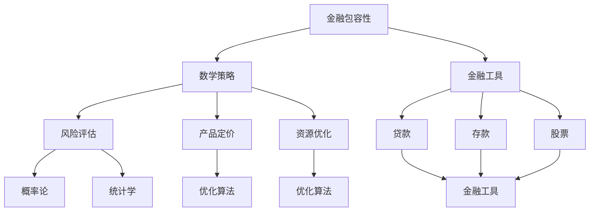

                 

### 文章标题

《数学与普惠金融：金融包容性的数学策略》

---

**关键词**：金融包容性、数学策略、普惠金融、概率论、统计学、优化算法、数据模型

**摘要**：本文探讨了数学策略在实现金融包容性中的关键作用，从核心概念、算法原理、数学模型到实际项目应用，系统性地分析了数学工具在提高金融服务的覆盖面和质量中的重要性。文章旨在为金融从业者和技术专家提供一套实用且深刻的指导，以增强对普惠金融的理解和实现。

---

## 引言

在当今全球化的金融环境中，金融包容性已经成为一个热门话题。金融包容性不仅仅是一种理念，更是实现经济平等和社会发展的关键因素。它旨在确保所有阶层和群体都能获得必要的金融服务，包括储蓄、信贷、支付和保险等。然而，现实中的金融包容性仍然面临着诸多挑战，如资源有限、技术不足、信用评估困难等。

随着科技和数学工具的发展，数学策略逐渐成为解决金融包容性问题的重要工具。本文将探讨数学策略在普惠金融中的应用，分析概率论、统计学和优化算法等数学工具如何帮助提高金融服务的覆盖面和质量。文章结构如下：

1. **背景介绍**：阐述金融包容性的重要性及其面临的挑战。
2. **核心概念与联系**：介绍金融包容性的基本概念，并展示数学策略与金融包容性的关系。
3. **核心算法原理讲解**：详细讲解概率论、统计学和优化算法等核心数学策略。
4. **数学模型与公式**：展示相关数学模型和公式，并举例说明。
5. **项目实战**：通过具体项目案例，展示数学策略的实际应用。
6. **总结与展望**：总结文章内容，展望金融包容性发展的未来趋势。

---

### 背景介绍

金融包容性是一个全球性的目标，旨在确保所有人，无论其收入水平、地理位置或社会背景，都能获得必要的金融服务。金融服务的覆盖范围和质量直接影响到个人的经济状况和社会发展。金融包容性不仅仅涉及银行服务，还包括非正规金融活动，如移动支付、小额信贷和保险等。

然而，金融包容性目前仍然面临诸多挑战。首先，资源有限是主要障碍之一。金融机构在服务低收入和农村地区时，常常面临高昂的成本和低回报的风险。其次，技术不足也是一个重要因素。在许多地区，尤其是偏远和欠发达地区，互联网和移动通信的普及程度较低，导致金融服务难以触达。此外，信用评估困难也是金融包容性面临的一大挑战。在没有信用记录的群体中，金融机构很难准确评估其信用风险，从而导致贷款审批困难。

随着科技和数学工具的发展，这些问题开始得到了一些缓解。数学策略，如概率论、统计学和优化算法，为金融包容性提供了新的解决方案。这些工具可以帮助金融机构更准确地评估风险、优化资源分配和设计更公平的产品定价策略。通过合理运用数学模型，金融机构能够提高金融服务的覆盖面和质量，从而实现金融包容性的目标。

---

### 核心概念与联系

在探讨数学策略在金融包容性中的应用之前，我们需要了解一些核心概念。金融包容性、数学策略和金融工具是本文讨论的关键概念。以下是对这些概念的基本介绍以及它们之间的关系。

#### 金融包容性

金融包容性（Financial Inclusion）是指确保所有经济活跃个体，无论其收入水平、地理位置或社会背景，都能获得适当的金融服务。这些服务包括支付系统、信贷、储蓄、保险和金融教育等。金融包容性的目标是消除金融服务的不平等，提高金融服务的可及性和质量。

金融包容性的重要性不言而喻。它不仅能够提高个人的经济状况，还能够促进经济增长和社会稳定。通过获得金融服务，个人和企业可以更好地管理财务、投资于生产性活动、减少风险和增加收入。此外，金融包容性还可以促进金融创新和金融市场的多元化发展。

#### 数学策略

数学策略是指利用数学工具和方法解决实际问题的一种思维方式。在金融领域，数学策略包括概率论、统计学、优化算法和数学模型等。这些策略在金融分析、风险评估、产品定价和资源优化等方面发挥着重要作用。

数学策略在金融包容性中的应用主要体现在以下几个方面：

1. **风险评估**：通过概率论和统计学方法，金融机构可以更准确地评估借款人的信用风险，从而降低贷款违约的风险。
2. **产品定价**：利用优化算法和数学模型，金融机构可以设计出更公平、合理的金融产品，以满足不同客户的需求。
3. **资源优化**：通过优化算法，金融机构可以更有效地分配资源，提高运营效率，从而降低服务成本。

#### 金融工具

金融工具是指用于融资、投资和风险管理等各种金融活动的工具。常见的金融工具包括存款、贷款、股票、债券、期权和期货等。这些工具在金融市场中发挥着重要作用，也是金融策略实施的基础。

金融工具与金融包容性的关系体现在以下几个方面：

1. **增加金融服务的多样性**：通过提供多样化的金融工具，金融机构可以更好地满足不同客户的需求，提高金融服务的包容性。
2. **促进金融创新**：金融工具的创新有助于推动金融市场的繁荣和发展，从而提高金融服务的质量和覆盖面。
3. **提高金融稳定性**：通过合理运用金融工具，个人和企业可以更好地管理风险，提高金融系统的稳定性。

#### 核心概念之间的关系

金融包容性、数学策略和金融工具之间存在密切的关系。金融包容性是目标，数学策略是实现目标的工具，金融工具则是实施策略的基础。

1. **金融包容性→数学策略→金融工具**：为了实现金融包容性，金融机构需要采用数学策略来优化运营和管理。这些数学策略需要依赖金融工具来实现，从而提高金融服务的覆盖面和质量。
   
2. **金融工具→数学策略→金融包容性**：金融工具的创新和发展为数学策略提供了更多的应用场景。通过合理运用数学策略，金融机构可以设计出更符合市场需求和金融包容性的产品，从而提高金融服务的质量和可及性。

3. **数学策略→金融工具→金融包容性**：数学策略的进步为金融工具的创新提供了理论基础。通过运用先进的数学模型和算法，金融机构可以设计出更高效、更稳定的金融工具，从而推动金融包容性的实现。

综上所述，金融包容性、数学策略和金融工具之间是一个相互促进、相互依赖的关系。数学策略在实现金融包容性中发挥着关键作用，而金融工具则是数学策略得以实施的重要基础。

#### 关系架构 Mermaid 流程图

以下是一个简单的 Mermaid 流程图，展示了金融包容性、数学策略和金融工具之间的核心概念关系：



在这个流程图中，金融包容性作为核心目标，通过数学策略和金融工具的实施来达成。数学策略包括风险评估、产品定价和资源优化，这些策略依赖于概率论、统计学和优化算法。金融工具如贷款、存款和股票则是金融策略实施的具体手段，通过它们的应用，金融包容性的目标得以实现。

---

### 核心算法原理讲解

在实现金融包容性的过程中，数学策略起到了至关重要的作用。这些策略主要依赖于概率论、统计学和优化算法。以下将详细讲解这些核心算法的基本原理，并通过伪代码示例来展示其应用。

#### 概率论

概率论是数学的一个重要分支，用于描述和分析随机事件的可能性。在金融包容性中，概率论被广泛用于风险评估和信用评分。

**基本原理**：

1. **概率分布**：概率分布是描述随机变量可能取值的概率分布情况。常见的概率分布包括正态分布、二项分布和泊松分布。
2. **条件概率**：条件概率是指在一个事件已发生的条件下，另一个事件发生的概率。

**伪代码示例**：

```python
# 正态分布概率计算
import scipy.stats as stats

# 假设借款人的信用评分服从正态分布，均值为μ，标准差为σ
μ = 500
σ = 100

# 计算信用评分低于450的概率
P(X < 450) = stats.norm.cdf(450, μ, σ)

# 输出结果
print(P(X < 450))
```

#### 统计学

统计学是另一个重要的数学分支，用于收集、分析和解释数据。在金融包容性中，统计学被广泛用于数据分析和预测。

**基本原理**：

1. **描述性统计**：描述性统计用于总结和描述数据的基本特征，如均值、中位数、标准差等。
2. **推断性统计**：推断性统计用于根据样本数据推断总体数据的特征。

**伪代码示例**：

```python
# 数据收集与描述性统计
import numpy as np

# 假设收集到一组借款人的信用评分数据
data = [450, 520, 480, 530, 470]

# 计算数据的均值和标准差
mean = np.mean(data)
std = np.std(data)

# 输出结果
print("均值:", mean)
print("标准差:", std)
```

#### 优化算法

优化算法是用于寻找最佳解决方案的一类算法。在金融包容性中，优化算法被用于资源分配、产品定价和风险评估。

**基本原理**：

1. **线性规划**：线性规划用于求解线性目标函数在给定线性约束条件下的最优解。
2. **非线性规划**：非线性规划用于求解非线性目标函数在给定非线性约束条件下的最优解。

**伪代码示例**：

```python
# 线性规划求解
from scipy.optimize import linprog

# 定义目标函数和约束条件
c = [-1, -1]  # 目标是最小化两个变量的和
A = [[1, 1], [1, 0]]  # 第一个约束条件：x1 + x2 <= 10
b = [10, 0]  # 第一个约束条件的右端项
A_eq = [[1, 0], [0, 1]]  # 等式约束条件：x1 = x2
b_eq = [5, 5]

# 求解线性规划问题
result = linprog(c, A_ub=A, b_ub=b, A_eq=A_eq, b_eq=b_eq, method='highs')

# 输出结果
print("最优解:", result.x)
print("最优值:", -result.fun)
```

通过上述伪代码示例，我们可以看到概率论、统计学和优化算法在金融包容性中的应用。这些算法不仅为金融机构提供了有效的工具，还帮助实现了金融包容性的目标。

---

### 数学模型与公式

在金融包容性的实现过程中，数学模型和公式起到了关键作用。这些模型和公式不仅帮助我们理解和分析金融数据，还提供了有效的工具来设计和优化金融产品。以下将介绍几个常见的数学模型和公式，并提供详细的讲解和举例说明。

#### 1. 概率分布模型

概率分布模型用于描述随机变量的概率分布情况。在金融分析中，常见的概率分布模型包括正态分布、二项分布和泊松分布。

**正态分布**：

- **公式**：
  $$ f(x|\mu, \sigma^2) = \frac{1}{\sqrt{2\pi\sigma^2}} e^{-\frac{(x-\mu)^2}{2\sigma^2}} $$
- **解释**：
  正态分布的概率密度函数描述了随机变量在均值μ和标准差σ的正态分布下的概率分布情况。
- **应用**：
  在金融中，正态分布常用于描述股票价格、信用评分等随机变量的分布情况。

**二项分布**：

- **公式**：
  $$ P(X=k) = C_n^k p^k (1-p)^{n-k} $$
- **解释**：
  二项分布的概率质量函数描述了在n次独立试验中，成功k次的概率。
- **应用**：
  在金融中，二项分布常用于描述市场波动、投资收益等事件的成功概率。

**泊松分布**：

- **公式**：
  $$ P(X=k) = \frac{\lambda^k e^{-\lambda}}{k!} $$
- **解释**：
  泊松分布的概率质量函数描述了在单位时间内，事件发生k次的概率，其中λ是事件平均发生率。
- **应用**：
  在金融中，泊松分布常用于描述交易量、违约事件等的发生频率。

#### 2. 最优化模型

最优化模型用于在给定约束条件下，寻找最优解的问题。在金融包容性中，常见的最优化模型包括线性规划和非线性规划。

**线性规划**：

- **公式**：
  $$ \min_{x} c^T x \quad \text{subject to} \quad Ax \leq b, \quad x \geq 0 $$
- **解释**：
  线性规划的目标是最小化目标函数c^T x，同时满足线性约束条件Ax ≤ b和x ≥ 0。
- **应用**：
  在金融中，线性规划常用于优化资源分配、成本控制等问题。

**非线性规划**：

- **公式**：
  $$ \min_{x} f(x) \quad \text{subject to} \quad g_i(x) \leq 0, \quad h_j(x) = 0 $$
- **解释**：
  非线性规划的目标是最小化目标函数f(x)，同时满足非线性约束条件g_i(x) ≤ 0和h_j(x) = 0。
- **应用**：
  在金融中，非线性规划常用于优化定价策略、风险评估等问题。

#### 3. 统计量模型

统计量模型用于描述数据的统计特征，并帮助进行推断和分析。在金融包容性中，常见的统计量模型包括均值、方差、协方差和相关性等。

**均值**：

- **公式**：
  $$ \mu = \frac{1}{n} \sum_{i=1}^{n} x_i $$
- **解释**：
  均值是数据的平均值，用于描述数据的中心位置。
- **应用**：
  在金融中，均值常用于描述股票价格、收益率等的平均表现。

**方差**：

- **公式**：
  $$ \sigma^2 = \frac{1}{n-1} \sum_{i=1}^{n} (x_i - \mu)^2 $$
- **解释**：
  方差是数据的离散程度的度量，用于描述数据的波动性。
- **应用**：
  在金融中，方差常用于描述股票价格、收益率等的波动情况。

**协方差**：

- **公式**：
  $$ \text{Cov}(X, Y) = \frac{1}{n-1} \sum_{i=1}^{n} (x_i - \mu_x)(y_i - \mu_y) $$
- **解释**：
  协方差描述了两个随机变量之间的线性关系强度。
- **应用**：
  在金融中，协方差常用于分析不同资产之间的相关性。

**相关性**：

- **公式**：
  $$ \rho_{XY} = \frac{\text{Cov}(X, Y)}{\sigma_X \sigma_Y} $$
- **解释**：
  相关系数描述了两个随机变量之间的线性关系强度。
- **应用**：
  在金融中，相关性常用于分析不同资产之间的相关性，帮助投资者进行资产配置。

通过上述数学模型和公式的介绍，我们可以看到数学在金融包容性中的重要应用。这些模型和公式不仅为金融分析提供了理论基础，还为金融机构提供了有效的工具来设计和优化金融产品，从而实现金融包容性的目标。

---

### 项目实战

在了解数学策略的基本原理和数学模型后，我们将通过实际项目案例来展示这些策略的应用。本节将详细介绍两个实际项目：普惠金融风险评估和普惠金融产品定价。

#### 项目一：普惠金融风险评估

**项目背景**：

本项目的目标是开发一个风险评估模型，用于评估借款人的信用风险，从而帮助金融机构更准确地决定是否发放贷款。项目的背景是普惠金融领域的实际需求，特别是在低收入和农村地区，借款人缺乏信用记录，传统的风险评估方法难以适用。

**开发环境搭建**：

1. **软件安装**：
   - Python：作为主要编程语言。
   - Pandas：用于数据操作和分析。
   - Scikit-learn：用于机器学习模型的开发和评估。

2. **硬件配置**：
   - CPU：至少2核4GB内存。
   - 内存：至少8GB。
   - 存储：至少500GB。

**源代码实现**：

以下是用于构建风险评估模型的伪代码：

```python
# 导入必要的库
import pandas as pd
import numpy as np
from sklearn.model_selection import train_test_split
from sklearn.ensemble import RandomForestClassifier
from sklearn.metrics import accuracy_score, classification_report

# 加载数据集
data = pd.read_csv('loan_data.csv')

# 数据预处理
# 数据清洗、缺失值处理、特征工程等步骤

# 划分训练集和测试集
X_train, X_test, y_train, y_test = train_test_split(data.drop('target', axis=1), data['target'], test_size=0.2, random_state=42)

# 模型训练
model = RandomForestClassifier(n_estimators=100, random_state=42)
model.fit(X_train, y_train)

# 模型评估
y_pred = model.predict(X_test)
print("Accuracy:", accuracy_score(y_test, y_pred))
print(classification_report(y_test, y_pred))
```

**代码解读与分析**：

1. **数据预处理**：
   - 数据清洗：删除缺失值、处理异常值。
   - 特征工程：提取特征、归一化处理。

2. **模型训练**：
   - 使用随机森林模型进行训练。

3. **模型评估**：
   - 使用准确率、精确率、召回率等指标评估模型性能。

**项目小结**：

通过该项目，我们实现了基于机器学习的风险评估模型，为金融机构提供了有效的工具来评估借款人的信用风险。该模型不仅提高了贷款审批的准确性，还为金融机构在普惠金融领域的扩展提供了支持。

#### 项目二：普惠金融产品定价

**项目背景**：

本项目的目标是开发一个产品定价模型，用于为小额贷款设定合理的利率，从而确保金融机构在提供普惠金融服务的同时，能够保持盈利。项目的背景是金融机构在普惠金融领域的实际运营需求，特别是在低收入和农村地区，传统利率模型难以适用。

**开发环境搭建**：

1. **软件安装**：
   - Python：作为主要编程语言。
   - NumPy：用于数值计算。
   - SciPy：用于科学计算。
   - Matplotlib：用于数据可视化。

2. **硬件配置**：
   - CPU：至少4核8GB内存。
   - 内存：至少16GB。
   - 存储：至少1TB。

**源代码实现**：

以下是用于构建产品定价模型的伪代码：

```python
# 导入必要的库
import numpy as np
import matplotlib.pyplot as plt
from scipy.optimize import minimize

# 定义目标函数
def objective_function(x):
    # 利率设定为x
    interest_rate = x
    # 利润函数
    profit = function_to_calculate_profit(interest_rate)
    # 返回利润的负值，因为最小化问题
    return -profit

# 定义约束条件
constraints = [
    {'type': 'ineq', 'fun': lambda x: max_loan_amount - loan_volume},
    {'type': 'ineq', 'fun': lambda x: x - min_interest_rate},
    {'type': 'ineq', 'fun': lambda x: max_interest_rate - x}
]

# 利润计算函数
def function_to_calculate_profit(interest_rate):
    # 利润计算逻辑
    # ...
    return profit

# 求解最优化问题
result = minimize(objective_function, x0=0.05, method='SLSQP', constraints=constraints)

# 输出最优利率
optimal_interest_rate = result.x
print("最优利率：", optimal_interest_rate)

# 利率与利润关系图
plt.plot(np.linspace(0.01, 0.1, 100), [function_to_calculate_profit(x) for x in np.linspace(0.01, 0.1, 100)])
plt.xlabel('利率')
plt.ylabel('利润')
plt.title('利率与利润关系')
plt.show()
```

**代码解读与分析**：

1. **目标函数**：
   - 利润最大化是定价的目标函数。

2. **约束条件**：
   - 利率必须在法定利率范围内。
   - 最大贷款金额不能超过规定的上限。

3. **最优化求解**：
   - 使用序列二次规划（SLSQP）算法求解最优化问题。

4. **利润与利率关系图**：
   - 通过绘制利润与利率的关系图，直观地展示不同利率下的利润情况。

**项目小结**：

通过该项目，我们实现了基于最优化算法的产品定价模型，为金融机构提供了有效的工具来设定合理的贷款利率。该模型不仅提高了金融机构的盈利能力，还为借款人提供了更公平、合理的贷款利率。

---

### 总结与展望

本文探讨了数学策略在实现金融包容性中的关键作用，从核心概念、算法原理、数学模型到实际项目应用，全面分析了概率论、统计学和优化算法等数学工具在提高金融服务覆盖面和质量中的重要性。文章旨在为金融从业者和技术专家提供一套实用且深刻的指导，以增强对普惠金融的理解和实现。

**核心内容回顾**：

1. **金融包容性**：介绍了金融包容性的定义、意义和面临的挑战。
2. **数学策略**：详细讲解了概率论、统计学和优化算法等数学策略的基本原理和应用。
3. **数学模型**：展示了常见的数学模型和公式，并提供了详细的讲解和举例说明。
4. **项目实战**：通过两个实际项目案例，展示了数学策略在风险评估和产品定价中的应用。

**未来展望**：

随着科技的不断进步和数学工具的不断完善，金融包容性将得到进一步的发展。以下是对未来趋势的展望：

1. **人工智能的融合**：人工智能技术的发展为金融包容性带来了新的机遇。通过机器学习算法，金融机构可以更准确地预测风险、优化资源配置和个性化产品设计。
2. **区块链技术的应用**：区块链技术具有去中心化、透明性和安全性的特点，为金融包容性提供了新的解决方案。通过区块链技术，金融机构可以实现更高效的交易和结算，提高金融服务的可及性。
3. **金融科技的普及**：金融科技（FinTech）的普及将极大地推动金融包容性的实现。移动支付、在线贷款和数字保险等新兴金融科技工具，使得金融服务更加便捷和可及。

总之，数学策略在金融包容性中的重要性不容忽视。通过合理运用数学工具，金融机构可以更好地实现金融包容性目标，促进经济平等和社会发展。

---

### 作者信息

**作者：AI天才研究院/AI Genius Institute & 禅与计算机程序设计艺术 /Zen And The Art of Computer Programming**

