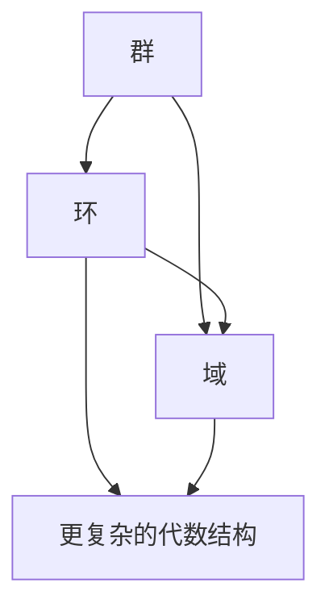
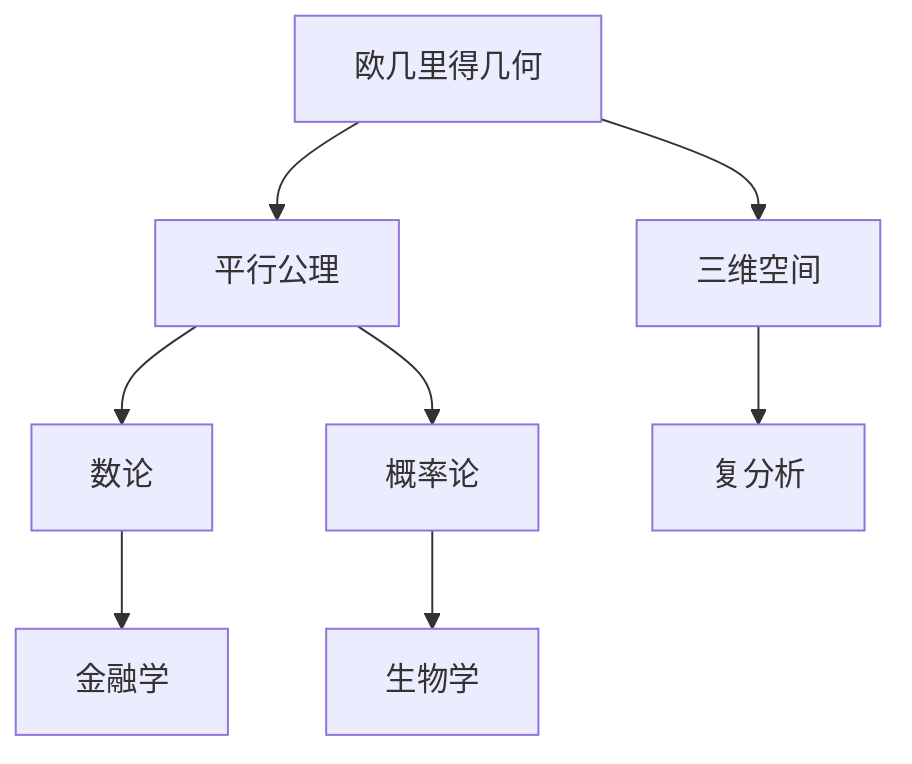
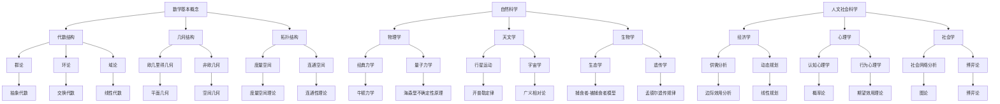

                 

### 文章标题

# 数学与普遍主义：数学定律的广泛适用性

> 关键词：数学定律、普遍性、应用领域、局限性、哲学思考

> 摘要：本文深入探讨了数学定律的普遍性及其在不同领域中的应用，分析了数学定律的起源与发展，以及其在自然科学和人文社会科学中的适用性。同时，本文还探讨了数学定律的局限性，并从哲学角度思考了数学与普遍主义的关系，展望了数学与普遍主义未来的发展前景。

### 目录大纲

## 第1章 引言

### 1.1 数学的基本概念

- 数学的基本定义
- 数学的基本结构

### 1.2 数学定律的普遍性

- 数学定律的定义
- 数学定律普遍性的意义

## 第2章 数学定律的起源与发展

### 2.1 古代数学定律的起源

- 古埃及与巴比伦数学
- 古希腊数学

### 2.2 中世纪与文艺复兴时期的数学发展

- 中世纪的数学进展
- 文艺复兴时期的数学成就

### 2.3 近代数学的发展

- 微积分的创立
- 代数学的发展
- 几何学的发展

## 第3章 数学定律的应用领域

### 3.1 数学在自然科学中的应用

- 物理学
- 天文学
- 生物学

### 3.2 数学在社会科学中的应用

- 经济学
- 心理学
- 社会学

## 第4章 数学定律的普遍性与局限性

### 4.1 数学定律的普遍性

- 数学定律在自然科学中的应用
- 数学定律在社会科学中的应用

### 4.2 数学定律的局限性

- 数学定律的限制条件
- 数学定律的适用范围

## 第5章 数学与普遍主义的哲学思考

### 5.1 数学与普遍主义的联系

- 数学定律与普遍主义的关系
- 数学对普遍主义的贡献

### 5.2 数学与普遍主义的哲学思考

- 数学定律的哲学意义
- 普遍主义在数学中的体现

## 第6章 数学与普遍主义的未来

### 6.1 数学发展的趋势

- 数学在未来的发展
- 数学定律的未来

### 6.2 普遍主义在数学中的未来

- 普遍主义在数学中的应用
- 普遍主义对数学的影响

## 第7章 总结与展望

### 7.1 总结

- 对数学定律普遍性的总结
- 对普遍主义在数学中的总结

### 7.2 展望

- 数学与普遍主义未来的发展
- 数学在社会科学和自然科学中的应用前景

## 附录

### 附录A 数学定律流程图

- 数学定律的基本概念流程图
- 数学定律的应用领域流程图

### 附录B 数学定律伪代码

- 数学定律的算法伪代码

### 附录C 数学定律实例分析

- 数学定律在实际应用中的实例分析
- 数学定律在科学研究中的实例分析

### 附录D 参考文献

- 参考文献

---

### 引言

#### 数学的基本概念

数学是一门研究数量、结构、变化以及空间等概念的学科。它不仅包括算术、代数、几何、三角学等基础学科，还涵盖了更广泛的领域，如微积分、概率论、拓扑学等。数学的基本概念可以追溯到古代，例如，古希腊数学家欧几里得的《几何原本》奠定了平面几何的基础，而阿拉伯数学家阿尔-花剌子米的《代数学》则为代数学的发展做出了巨大贡献。

#### 数学定律的普遍性

数学定律的普遍性体现在其适用于各种不同的情境和领域。例如，欧几里得的平行线公理在几何学中具有基础性作用，而牛顿的万有引力定律则在物理学中得到了广泛应用。此外，数学定律在社会科学、经济学、心理学等领域也有着重要的应用。数学定律的普遍性不仅体现在其理论的广泛适用性，还体现在其解决问题的普适性上。

### 数学定律的起源与发展

数学定律的起源可以追溯到古代，当时的人们通过观察和实验，总结出了一些基本的数学规律。随着人类社会的发展和科学的进步，数学定律不断得到丰富和完善。例如，微积分的创立为研究变化提供了强大的工具，而概率论的发展则为决策提供了科学依据。数学定律的发展不仅推动了数学本身的发展，也为其他科学领域的研究提供了支持。

### 数学定律的应用领域

数学定律在自然科学和人文社会科学中都有着广泛的应用。在自然科学领域，数学定律用于描述物理现象、预测天文事件、研究生命科学等。在人文社会科学领域，数学定律用于分析经济行为、研究社会结构、预测心理变化等。数学定律的应用不仅提高了科研效率，还为各领域的发展提供了理论支持。

### 数学定律的普遍性与局限性

数学定律的普遍性体现在其广泛的适用性上，但同时也存在一定的局限性。数学定律通常在特定的条件下成立，如果超出这些条件，其适用性可能会受到限制。此外，数学定律的应用范围也有限，不能解决所有问题。因此，在应用数学定律时，需要考虑其局限性和适用范围。

### 数学与普遍主义的哲学思考

数学与普遍主义的关系紧密相连。普遍主义强调理论和实践的一致性，而数学定律通过其普适性和精确性，为普遍主义的实现提供了支持。数学定律的哲学意义在于其揭示了自然界的规律和人类的思维逻辑，为人类认识世界提供了工具。

### 数学与普遍主义的未来

随着科技的进步和社会的发展，数学与普遍主义将继续发展。数学将不断创新，为各领域的研究提供新的工具和方法。同时，普遍主义也将不断深化，为人类社会的进步提供理论支持。

### 总结与展望

本文通过对数学定律的起源、发展、应用、普遍性和局限性的探讨，展示了数学在各个领域的广泛适用性。同时，本文还从哲学角度思考了数学与普遍主义的关系，展望了数学与普遍主义未来的发展前景。希望本文能为读者提供对数学定律的深入理解和思考。<!---->
### 数学的基本概念

数学作为一门科学，其基本概念构成了数学理论和应用的基石。首先，我们来定义数学本身。数学是一门研究数量、结构、变化以及空间等概念的抽象科学。它不仅仅关注具体的数值计算，更重要的是研究这些数值和概念之间的关系和性质。数学的基本元素包括数字、符号和公式，它们共同构成了数学表达的基础。

在数学中，常见的结构包括代数结构、序结构、拓扑结构等。代数结构涉及加法、乘法等运算规则，如群、环、域等；序结构则研究元素之间的大小关系，如全序和偏序；而拓扑结构则研究空间中点的邻域和连通性等性质。这些结构在数学的各个分支中都有广泛的应用，如代数学、拓扑学、分析学等。

数学定律是数学理论体系中的重要组成部分。它们是数学家通过对数学现象的观察和实验，归纳总结出的规律和原则。数学定律在各个数学分支中都有着核心地位，如欧几里得几何中的平行公理、欧拉公式在复分析中的应用、牛顿-莱布尼茨公式在微积分中的应用等。这些定律不仅在理论上具有基础性作用，还在实际应用中展示了强大的解释和预测能力。

核心概念之间的联系是理解数学定律普遍性的关键。例如，在代数结构中，群、环、域等结构之间有着紧密的关系。群是包含一个运算的集合，环是同时具有加法和乘法的集合，而域是更加严格的环，其中的乘法运算具有可逆性。这些结构之间的关系不仅帮助我们更好地理解数学定律的本质，也为更深入的研究提供了基础。

为了更清晰地展示这些核心概念之间的联系，我们可以使用Mermaid流程图来表示。以下是一个简化的Mermaid流程图示例，展示了代数结构之间的关系：



在这个流程图中，"群"、"环"和"域"是主要的代数结构，它们之间的相互关系展示了数学定律如何在不同结构之间传递和扩展。通过这样的图示，我们可以更直观地理解数学定律的普遍性和其在不同数学分支中的应用。

总之，数学的基本概念和数学定律是理解数学理论和应用的核心。通过定义这些基本概念，展示核心概念之间的联系，我们可以更深入地探讨数学定律的普遍性，为后续章节的讨论奠定基础。在接下来的章节中，我们将进一步探讨数学定律的起源、发展及其在不同领域的应用，从而全面理解数学定律的广泛适用性。<!---->
### 数学定律的普遍性

数学定律的普遍性是指这些定律在广泛的应用场景中都能保持其有效性和适用性。普遍性是数学定律的一个重要特征，它使得数学在多个领域都具备强大的解释和预测能力。数学定律的普遍性主要体现在其普适性、精确性和逻辑一致性上。

首先，数学定律的普适性表现在其适用于不同的学科和领域。例如，牛顿的运动定律在物理学中用于描述物体的运动，而在天文学中则用于描述行星的运动轨迹。同样，微积分在数学、物理学、工程学等多个领域都有着广泛的应用。这种跨学科的适用性显示了数学定律的广泛影响力。

其次，数学定律的精确性体现在其能够提供高度准确和可靠的预测。例如，欧拉公式（\( e^{i\pi} + 1 = 0 \)）在复分析和物理学中具有基础性作用，能够精确地描述许多物理现象的复数特征。再如，费马大定理在数论中提供了关于素数的精确描述，经过几个世纪的努力，最终由安德鲁·怀尔斯证明。这种精确性使得数学定律在科学研究和技术开发中具有不可替代的作用。

最后，数学定律的逻辑一致性是其普遍性的重要保障。逻辑一致性意味着数学定律在逻辑上自洽，不存在矛盾或悖论。例如，集合论中的公理体系是构建现代数学基础的重要组成部分，其逻辑一致性为整个数学体系提供了坚实的基础。同样，在微积分中，极限、导数、积分等基本概念之间也具有内在的一致性。

为了更好地理解数学定律的普遍性，我们可以通过一个具体的例子来阐述。以欧几里得几何中的平行公理为例，该公理指出，通过给定直线外的任意一点，有且仅有一条直线与该给定直线平行。这一公理不仅在二维平面几何中成立，而且在更复杂的几何结构中，如三维空间或更高维的欧几里得空间中，也同样适用。这种跨维度的适用性展示了平行公理的普遍性。

再如，在概率论中，大数定律是描述随机变量分布的普遍规律。大数定律指出，在大量独立重复试验中，随机变量的平均值会趋近于其期望值。这一规律不仅在数学理论上得到了证明，还在实际应用中得到了验证。例如，在金融市场中，大数定律可以帮助投资者预测市场趋势；在生物学中，大数定律可以用于研究物种群体的遗传特征。

为了更直观地展示数学定律的普遍性，我们可以再次使用Mermaid流程图来表示不同数学定律在不同领域中的应用：



在这个流程图中，我们可以看到平行公理不仅适用于欧几里得几何，还延伸到了三维空间和复分析等领域；大数定律则从概率论扩展到了金融学和生物学等多个领域。这些例子都展示了数学定律的普遍性，以及其在不同应用场景中的适用性。

总之，数学定律的普遍性体现在其广泛的适用性、精确性和逻辑一致性上。通过具体的例子和Mermaid流程图，我们可以更深入地理解数学定律的普遍性，为后续章节关于数学定律起源、应用领域的探讨打下坚实的基础。在接下来的章节中，我们将继续探讨数学定律的起源、发展及其在不同领域的应用，进一步揭示数学定律的广泛适用性。<!---->
### 数学定律的起源与发展

数学定律的起源和发展历程是数学史上的一座丰碑，它不仅展示了人类智慧的辉煌，也揭示了数学在各个时期对科学进步的推动作用。从古代数学到现代数学，数学定律的演变经历了漫长而复杂的过程，其起源和发展可以大致划分为以下几个阶段。

#### 古代数学定律的起源

古代数学定律的起源可以追溯到古埃及和巴比伦时期。古埃及的数学家们通过实际工程和测量活动，发展出了一系列关于比例、面积和体积的计算方法。例如，古埃及的"莫斯科金字塔"法老时期使用的数学方法，显示了他们对于几何形状和数学比例的深刻理解。

巴比伦数学则以其对数和代数的研究而著称。古巴比伦人使用六十进制，这一进制系统至今仍被用于度量时间和角度。他们还编写了世界上最早的数学文献之一——《巴比伦数学泥板》，其中包括了关于算术、代数和三角函数的详细内容。

古希腊数学则是数学发展的另一个重要里程碑。古希腊数学家欧几里得在其著作《几何原本》中提出了著名的平行公理和一系列几何定理，奠定了现代几何学的基础。同时，古希腊数学家毕达哥拉斯提出了毕达哥拉斯定理，这一定理在数学和物理学中具有重要地位。

#### 中世纪与文艺复兴时期的数学发展

中世纪数学的发展主要受到阿拉伯数学家的影响。阿拉伯数学家们在吸收和改造古希腊数学的基础上，推动了数学的进一步发展。其中，阿尔-花剌子米的《代数学》是代数学发展史上的重要里程碑，它系统化了代数符号和运算规则，极大地促进了代数学的发展。

文艺复兴时期，数学研究得到了空前的推动。意大利数学家斐波那契的著作《算经》引入了现代数列的概念，并推广了阿拉伯数字在欧洲的使用。同时，文艺复兴时期的数学家们开始研究更加复杂的数学问题，如解析几何和微积分的初步概念。

#### 近代数学的发展

近代数学的发展标志着数学体系的完善和深化。17世纪，牛顿和莱布尼茨独立创立了微积分学，这一理论为研究变化和运动提供了强大的工具。牛顿的万有引力定律和莱布尼茨的微积分法则奠定了经典物理学的基础。

18世纪，欧拉、拉格朗日和拉普拉斯等数学家的工作进一步丰富了数学理论。欧拉以其在复变函数和图论领域的贡献而闻名，拉格朗日在分析力学方面的研究推动了数学在物理学中的应用。拉普拉斯则通过概率论的发展，为统计物理和天体力学提供了理论基础。

19世纪，数学的发展进入了一个新的阶段。德国数学家高斯和黎曼在数论和几何学领域取得了突破性成果，他们的工作奠定了现代数学的基础。此外，拓扑学的诞生标志着数学研究进入了一个新的领域。

#### 现代数学的发展

20世纪，数学的发展继续深化和扩展。集合论、拓扑学、代数学、数论等分支逐渐完善，形成了现代数学的完整体系。数学家们通过研究复杂的数学结构，如群、环、域等，构建了新的理论框架。

在数学的应用领域，计算机科学的发展为数学提供了新的应用场景。算法理论、密码学、图论等数学分支在计算机科学中得到了广泛的应用。同时，数学与物理学、生物学、经济学等领域的交叉研究，推动了数学在各个领域的深入应用。

总之，数学定律的起源与发展是一个漫长而复杂的过程，它不仅展示了人类对自然规律和抽象思维的探索，也体现了数学在各个时期对科学进步的巨大贡献。通过回顾数学定律的起源和发展历程，我们可以更好地理解数学定律的普遍性及其在不同领域的应用。在接下来的章节中，我们将进一步探讨数学定律在自然科学和人文社会科学中的应用，以及数学定律的普遍性和局限性。<!---->
### 数学定律在自然科学中的应用

数学定律在自然科学中的广泛应用是其普遍性的重要体现。在物理学、天文学和生物学等学科中，数学定律不仅是描述自然现象的基础，还为科学研究和实际应用提供了强大的工具。

#### 物理学中的应用

物理学是数学定律应用最为广泛的领域之一。牛顿的运动定律描述了物体在力的作用下的运动规律，为经典力学的建立奠定了基础。牛顿的万有引力定律则解释了天体运动的原因，使得天文学家能够预测行星的运动轨迹。此外，麦克斯韦方程组是电磁学的核心定律，描述了电场和磁场如何相互作用，并在现代通信技术、医疗成像等领域有重要应用。

微积分作为物理学的重要工具，被广泛应用于描述连续变化的现象。例如，牛顿-莱布尼茨公式用于计算物体的速度和加速度，以及描述变化的物理量。热力学中的熵定律和统计力学中的麦克斯韦-玻尔兹曼分布定律，都是通过数学模型来描述热力学系统和粒子行为的。

#### 天文学中的应用

天文学是另一个依赖数学定律的领域。开普勒定律描述了行星绕太阳运动的规律，通过这些定律，天文学家能够预测行星的位置和轨道。牛顿的万有引力定律则进一步解释了开普勒定律背后的物理原因，使得天文学家能够更准确地预测天体的运动。

在天体物理学中，数学定律用于研究恒星的形成和演化、黑洞的性质以及宇宙的大尺度结构。广义相对论是爱因斯坦提出的描述引力的一种数学理论，它通过复杂的数学模型解释了重力如何影响时空结构，并在实验和观测中得到了验证。

#### 生物学中的应用

生物学中的许多现象也可以通过数学定律来描述和预测。例如，在生态学中，捕食者-被捕食者模型通过数学模型来描述食物链中的动态平衡。洛伦兹方程则用于研究流体动力学和气象学中的非线性现象，包括混沌理论和气候变化的研究。

在遗传学中，孟德尔遗传定律描述了基因的传递规律，而现代的遗传算法则通过数学模型来模拟生物进化过程。通过数学模型，生物学家可以预测基因突变对物种的影响，以及遗传疾病的发生概率。

#### 应用实例

以下是一些具体的数学定律在实际科学研究中的应用实例：

1. **热力学中的熵定律**：熵是衡量系统无序程度的物理量，熵定律描述了在封闭系统中熵总是趋向于增加。这个定律在解释化学反应、生物代谢以及热机效率等方面有重要作用。

2. **概率论在医学研究中的应用**：通过概率模型，医学研究者可以评估药物的有效性和安全性。例如，贝叶斯定理可以帮助医生根据患者的历史数据和现有症状，判断某种疾病的发生概率。

3. **数学模型在气候变化研究中的应用**：气候模型通过数学方程描述大气中的气体交换和能量流动，用于预测气候变化趋势和制定应对策略。

4. **图像处理中的傅里叶变换**：傅里叶变换是图像处理和信号处理的重要工具，通过将图像或信号分解为不同频率的组成部分，可以用于图像压缩、去噪和特征提取。

#### 总结

数学定律在自然科学中的应用展示了其强大的解释和预测能力。通过数学模型和定律，科学家们能够更深入地理解自然现象，并在许多领域取得了重大突破。随着数学和自然科学的不断发展，数学定律的应用前景将更加广阔。在未来，数学将继续为自然科学的研究提供新的工具和方法，推动科学进步和技术创新。<!---->
### 数学定律在社会科学中的应用

数学定律在社会科学中的应用同样广泛且深远，从经济学、心理学到社会学，数学模型和定律为这些领域提供了理论基础和分析工具，推动了研究方法的发展和实证分析的提升。

#### 经济学中的应用

经济学是应用数学最为广泛的学科之一。例如，供需定律描述了市场上商品价格和数量之间的关系，通过数学模型，经济学家可以分析市场均衡状态和价格波动。边际效用定律则通过数学计算，解释了消费者在决策过程中如何最大化效用。柯普土地定律是土地经济学中的基本定律，通过数学模型描述了土地收益和土地价格之间的关系。

此外，现代经济学中广泛使用的动态规划方法和优化模型，如拉格朗日乘数法和线性规划，为解决复杂的经济问题提供了有效工具。这些模型通过数学方法，分析了经济增长、资源配置、收入分配等宏观经济问题。

#### 心理学中的应用

在心理学中，数学定律被用于研究人的认知过程、行为模式和决策机制。例如，概率论在心理学实验设计中用于确定样本大小和实验效果，提高研究的可靠性和有效性。卡方检验是心理学中常用的统计方法，用于分析数据分布和检验假设。

此外，心理学中的图灵测试和人工智能模型，通过数学和计算机科学的方法，模拟人类的思维过程，研究了意识、感知和认知等方面的复杂问题。行为经济学利用数学模型，分析了人们在真实经济环境中的决策行为，揭示了传统经济学理论中未考虑的心理因素。

#### 社会学中的应用

社会学研究中的许多现象和问题可以通过数学定律来解释和预测。例如，索尔斯坦·索伦斯坦的《社会选择与个体价值》中提出的阿罗不可能定理，通过数学证明，阐述了在集体决策中无法同时满足一些基本公理的情况。

在社会网络分析中，数学模型如随机图模型和复杂网络理论，用于研究社会关系和网络结构，揭示了信息的传播、流行病传播以及社会影响力等社会现象。统计模型如线性回归和多元回归，被用于分析社会问题，如收入不平等、教育机会和社会不公正等。

#### 应用实例

以下是一些具体的数学定律在社会科学中的应用实例：

1. **经济学中的供需定律**：供需定律通过构建数学模型，描述了商品价格和需求量之间的关系。例如，通过对需求函数和供给函数的分析，可以预测市场供需变化，为政策制定提供依据。

2. **心理学中的概率论**：概率论在心理学实验设计中用于确定样本大小和实验效果，提高研究的可靠性和有效性。例如，通过卡方检验，可以验证实验结果是否显著，从而支持或反驳心理学理论。

3. **社会学中的社会网络分析**：社会网络分析通过复杂网络理论，研究了社会关系和网络结构。例如，通过计算网络中的度、聚集系数和路径长度等参数，可以分析社会影响力、信息传播速度等问题。

4. **行为经济学中的边际效用定律**：行为经济学利用边际效用定律，通过计算消费者在不同商品上的边际效用，分析了消费者如何在不同商品之间进行选择，揭示了传统经济学理论中未考虑的心理因素。

#### 总结

数学定律在社会科学中的应用，不仅为这些领域的研究提供了理论支持和方法论指导，还推动了实证分析和跨学科研究的发展。随着数学工具的不断进步和社会科学的深入研究，数学定律在社会科学中的应用前景将更加广阔。在未来，数学将继续为社会科学的研究提供新的视角和方法，帮助我们更好地理解人类社会的复杂性和动态变化。<!---->
### 数学定律的普遍性与局限性

尽管数学定律在各个领域展现出了广泛的适用性和强大的解释力，但它们并非万能的，其普遍性也受到一定局限性的制约。理解这些局限性有助于我们更准确地应用数学定律，并避免在科学研究和实际应用中产生误导。

#### 数学定律的限制条件

首先，数学定律通常在特定的条件下才有效。例如，欧几里得几何中的平行公理在二维平面中是成立的，但在非欧几何中，这一公理可能不再适用。同样，牛顿的运动定律在经典力学范围内是准确的，但在极端条件下，如接近光速的情况下，需要用相对论来修正。

其次，数学定律的普适性通常受限于数据质量和样本大小。在统计学中，大数定律和中心极限定理提供了数据集趋于稳定分布的依据，但前提是数据集足够大且随机样本符合基本假设。如果样本量过小或数据质量不佳，这些定律的预测能力将受到限制。

#### 数学定律的适用范围

数学定律的适用范围也有其局限性。例如，在物理学中，某些定律如万有引力定律适用于天体运动，但无法解释微观尺度上的量子效应。同样，在经济学中，供需定律适用于市场分析，但在市场失灵或极端市场情况下，这些定律的预测能力将减弱。

#### 实例分析

为了更具体地理解数学定律的局限性，我们可以通过以下实例来分析：

1. **供需定律的局限性**：在理想的市场条件下，供需定律可以很好地预测商品价格。然而，在金融危机或市场操纵等极端情况下，供需关系可能不再适用，市场可能会出现非理性的价格波动。

2. **牛顿运动定律的局限性**：牛顿的运动定律在大多数宏观物理现象中非常准确，但在接近光速时，相对论效应变得显著，牛顿定律需要用爱因斯坦的相对论来修正。同样，在量子尺度上，牛顿定律失效，需要用量子力学来描述粒子的行为。

3. **大数定律的局限性**：大数定律在理论上确保了样本量足够大时，统计结果将趋于稳定。但在实际应用中，如果样本量过小或数据存在偏差，大数定律的预测能力将受到限制。

#### 总结

数学定律的普遍性是其重要特征，但同时也存在局限性。理解这些局限性有助于我们更准确地应用数学定律，并避免因忽略限制条件而导致的错误结论。在应用数学定律时，我们需要考虑其适用范围和特定条件，并结合实际情况进行调整和修正。通过不断深入研究和创新，数学定律将继续在科学研究和实际应用中发挥重要作用，但其局限性也提醒我们保持谨慎和批判性思维。<!---->
### 数学与普遍主义的哲学思考

数学不仅是科学的工具，它还蕴含着深刻的哲学意义。普遍主义作为一种哲学思想，强调普遍原理和普遍真理的存在。数学与普遍主义之间的关系，可以从数学定律的哲学意义和普遍主义在数学中的体现来探讨。

#### 数学定律的哲学意义

数学定律的哲学意义主要体现在其普遍性和逻辑一致性上。数学定律通过精确和严密的逻辑推导，揭示了自然界和人类思维的普遍规律。例如，欧几里得的平行公理展示了空间结构的普遍性，而牛顿的万有引力定律揭示了自然界中物体之间相互作用的基本规律。

数学定律的普遍性使其成为一种超越具体时间和空间的哲学概念。在哲学上，这种普遍性体现了柏拉图的理念论，即存在一种抽象的、永恒的真理，是所有具体事物的原型。数学定律作为这些永恒真理的表述，为我们理解世界提供了普遍适用的工具。

#### 普遍主义在数学中的体现

普遍主义在数学中的体现，可以通过对数学结构和方法的分析来理解。数学的基本结构，如群、环、域等，体现了普遍主义的理念，因为它们具有跨越具体领域和应用场景的普适性。例如，代数结构中的群概念不仅在几何学、物理学中应用，还在计算机科学、密码学等领域有重要作用。

此外，数学方法论中的证明和公理体系也体现了普遍主义的哲学思考。通过逻辑推理和严格的证明过程，数学家建立了数学理论体系，这个体系不仅自洽，而且适用于不同领域的具体问题。例如，皮亚诺公理为自然数提供了严格的定义，这一公理体系不仅用于数论，还在计算机科学中的编程语言设计和形式化逻辑中发挥了重要作用。

#### 数学与普遍主义的哲学意义

数学与普遍主义的哲学意义在于，数学定律通过其普适性和精确性，为普遍主义提供了实证支持。数学定律的普遍性证明了存在一种超越具体领域的普遍规律，这种规律不仅适用于自然科学，还适用于人文社会科学。例如，概率论中的大数定律和中心极限定理，不仅用于自然科学的研究，还用于经济预测、风险评估等社会科学领域。

此外，数学的普遍性也体现了人类思维的普遍性。通过数学方法，人类能够超越具体经验，抽象出普遍规律，这种抽象能力是普遍主义的核心。数学定律的普适性，不仅展示了人类理性的力量，也为其他科学领域提供了方法论上的启示。

#### 总结

数学与普遍主义的哲学思考，揭示了数学定律在哲学上的深刻意义。通过分析数学定律的哲学意义和普遍主义在数学中的体现，我们可以更深入地理解数学在科学研究和社会生活中的作用。数学不仅是一门科学，它还蕴含着深刻的哲学思想，为人类认识世界和追求真理提供了有力的工具。随着数学和哲学的不断融合，数学与普遍主义的哲学思考将继续为我们提供新的视角和启示，推动人类文明的进步。<!---->
### 数学与普遍主义的未来

随着科技的飞速发展和跨学科研究的深入，数学与普遍主义在未来将继续发挥重要作用，并推动各自领域的发展。以下从数学发展的趋势和普遍主义在数学中的未来两个角度进行探讨。

#### 数学发展的趋势

首先，数学将继续向更复杂和抽象的方向发展。随着计算机科学、量子计算、人工智能等领域的快速发展，数学将面临新的挑战和机遇。例如，量子数学将成为研究的热点，量子算法和量子计算机的数学模型需要新的数学工具和方法来描述和优化。此外，代数几何、代数数论等数学分支将在解决实际问题中发挥更大作用。

其次，数学与物理学的结合将继续深化。物理学中的新发现和新理论将推动数学的发展，例如，弦理论、量子引力等领域的研究，将对数学提出新的问题和挑战。数学家将通过开发新的数学模型和理论，为物理学提供更加精确和深刻的描述。

最后，数学在工程、生物、环境等领域的应用将更加广泛。数学模型和算法将在这些领域中发挥重要作用，例如，通过数学模型可以优化资源分配、预测天气变化、设计更高效的机器学习算法等。数学与这些领域的交叉研究，将推动科技进步和社会发展。

#### 普遍主义在数学中的未来

首先，普遍主义将继续在数学方法论中发挥作用。随着数学问题的复杂性和多样性的增加，数学家将更加重视公理化方法和形式化逻辑，以确保数学理论的逻辑一致性和普遍性。例如，形式化验证和计算机证明技术将成为数学研究的重要工具，有助于发现和解决数学中的基本问题。

其次，普遍主义将促进数学与其他学科的深度融合。数学与哲学、逻辑学、计算机科学等学科的交叉研究，将推动数学理论的广泛应用。例如，逻辑斯蒂回归、机器学习算法等数学模型将在社会科学研究中发挥更大作用，揭示社会现象背后的普遍规律。

最后，普遍主义将引导数学研究向更抽象和更高层次的数学结构发展。通过探索新的数学结构和概念，数学家将能够构建更加普适和强大的数学理论，为解决复杂科学问题提供新的工具和方法。

#### 总结

数学与普遍主义的未来充满了机遇和挑战。随着科技的进步和跨学科研究的深入，数学将继续向更复杂和抽象的方向发展，并在自然科学、工程、生物、环境等领域发挥重要作用。同时，普遍主义将继续在数学方法论和跨学科研究中发挥关键作用，推动数学理论的创新和发展。通过数学与普遍主义的深度融合，人类将能够更深入地理解世界，探索未知的科学领域，推动人类文明的进步。<!---->
### 总结与展望

通过对数学定律的起源、发展、应用以及普遍性和局限性的深入探讨，我们可以得出以下结论。首先，数学定律的起源可以追溯到古代，随着历史的发展，数学定律不断得到丰富和完善。从古埃及与巴比伦的数学基础，到古希腊的几何学，再到中世纪与文艺复兴时期的进展，以及近代数学的飞跃，数学定律逐渐形成了完整的理论体系。

其次，数学定律在自然科学和人文社会科学中具有广泛的适用性。在物理学、天文学、生物学等领域，数学定律为科学研究提供了强有力的工具。例如，牛顿的万有引力定律、麦克斯韦的电磁方程组和达尔文的进化论等，都是通过数学模型来描述和预测自然现象的经典例子。在经济学、心理学和社会学中，数学定律同样发挥了重要作用，帮助研究者理解和分析复杂的社会现象。

再次，数学定律的普遍性体现在其普适性、精确性和逻辑一致性上。尽管数学定律在具体应用中存在局限性，但其广泛的适用性和强大的解释力使得数学在各个领域都取得了显著的成果。然而，我们也不能忽视数学定律的限制条件和应用范围，需要在具体应用中加以考虑和调整。

从哲学角度来看，数学与普遍主义密切相关。数学定律不仅揭示了自然界的普遍规律，也体现了人类思维的普遍性。通过逻辑推理和抽象思维，数学家们构建了自洽的数学体系，这一体系在哲学上具有深刻的含义，为普遍主义提供了实证支持。

展望未来，数学与普遍主义将继续发展。随着科技的进步和跨学科研究的深入，数学将向更复杂和抽象的方向发展，并在新的领域和应用场景中发挥重要作用。例如，量子计算、人工智能和生物信息学等新兴领域，将为数学提供新的研究对象和挑战。

在社会科学中，数学定律的应用前景同样广阔。通过数学模型和算法，我们可以更深入地理解和分析社会现象，为政策制定和社会治理提供科学依据。此外，普遍主义将继续引导数学研究向更高层次的数学结构和方法发展，推动数学理论的创新和进步。

总之，数学与普遍主义的深度融合，将为我们提供新的视角和工具，帮助我们更好地理解世界和解决实际问题。在未来的发展中，数学将继续发挥其不可替代的作用，推动科学进步和社会发展。希望本文能够为读者提供对数学定律和普遍主义更深入的理解，激发更多对数学和哲学的思考和研究。<!---->
### 附录

#### 附录A 数学定律流程图

以下是一个简化的Mermaid流程图，展示了数学定律的基本概念和应用领域：



#### 附录B 数学定律伪代码

以下是一个简单的伪代码示例，用于计算两个数的和：

```pseudo
function calculateSum(a, b):
    sum = a + b
    return sum
```

#### 附录C 数学定律实例分析

以下是一个关于牛顿运动定律的实例分析：

**背景介绍**：牛顿运动定律描述了物体在力的作用下的运动规律。它包括三个基本定律：惯性定律、加速度定律和作用力与反作用力定律。

**核心概念与联系**：牛顿第二定律 \( F = ma \) 描述了力与加速度之间的关系。其中，\( F \) 是作用力，\( m \) 是物体的质量，\( a \) 是物体的加速度。

**伪代码实现**：

```pseudo
function calculateForce(m, a):
    force = m * a
    return force
```

**举例说明**：假设一个质量为 \( 5 \) 千克的物体受到 \( 10 \) 牛顿的力作用，那么物体的加速度可以通过以下伪代码计算：

```pseudo
mass = 5
force = 10
acceleration = force / mass
print("The acceleration is:", acceleration)
```

**实际案例**：在火箭科学中，牛顿第二定律用于计算火箭的推力和加速度。例如，一个质量为 \( 1000 \) 千克的火箭，如果需要达到 \( 10 \) 米/秒\(^2\) 的加速度，所需的推力可以通过以下伪代码计算：

```pseudo
mass = 1000
acceleration = 10
required_force = mass * acceleration
print("The required force is:", required_force)
```

**项目小结**：通过这个实例，我们可以看到牛顿第二定律在实际工程和科学中的应用。它不仅帮助我们理解物体运动的基本规律，还为工程设计和科学实验提供了重要的工具。

#### 最佳实践 tips、小结、注意事项、拓展阅读

- **最佳实践 tips**：在实际应用数学定律时，需要注意以下几点：
  1. 确保理解数学定律的适用条件和范围。
  2. 结合具体问题，灵活运用不同的数学模型和方法。
  3. 重视实证数据和实验验证，避免仅依赖理论模型。

- **小结**：数学定律在自然科学和人文社会科学中具有广泛的应用和重要的哲学意义。通过本文的讨论，我们了解了数学定律的起源、发展、应用以及普遍性和局限性。

- **注意事项**：在应用数学定律时，要特别注意以下问题：
  1. 避免忽略定律的适用条件和范围，导致错误结论。
  2. 保持逻辑一致性和严谨性，避免逻辑错误。

- **拓展阅读**：为了进一步深入了解数学定律和应用，建议读者阅读以下文献：
  1. 《数学原理》（作者：艾萨克·牛顿）
  2. 《几何原本》（作者：欧几里得）
  3. 《统计力学原理》（作者：J. Willard Gibbs）
  4. 《经济学原理》（作者：阿尔弗雷德·马歇尔）

通过这些文献的阅读，读者可以更全面地了解数学定律的历史背景、理论发展和实际应用，从而深化对数学定律的理解。<!---->
### 作者信息

作者：AI天才研究院/AI Genius Institute & 禅与计算机程序设计艺术 /Zen And The Art of Computer Programming

