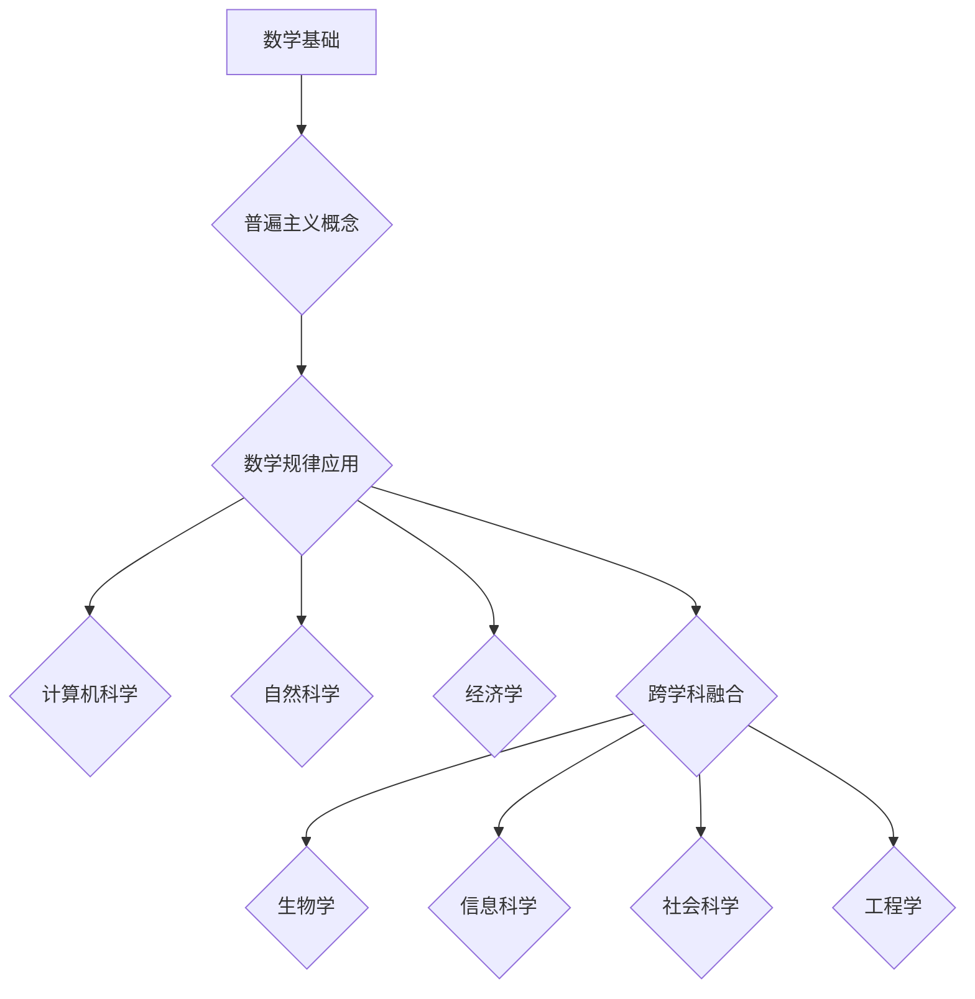

                 

### 文章标题：数学与普遍主义：数学规律的普遍适用性

#### 关键词：数学规律、普遍适用性、数学基础、交叉学科应用

> 摘要：本文探讨了数学规律的普遍适用性，从数学基础到其在各领域的应用，深入分析了数学原理与实际问题的结合。通过逻辑清晰的分析和丰富的案例，本文揭示了数学在提高效率、增强准确性以及跨学科融合中的重要作用，旨在为读者提供对数学普遍适用性的全面理解。

---

## 第1章 引言

### 1.1 数学与普遍主义

数学作为一门科学，其研究的是抽象的结构、关系和模式。普遍主义（Universalism）则强调普遍性和共性，认为某些原则、理论或规律在不同的情境和领域中具有普适性。数学与普遍主义的结合，揭示了数学规律在不同领域的广泛应用，从而提升了各学科的效率和准确性。

### 1.2 本书结构

本文将按照以下结构展开：

1. **数学基础**：介绍数学的基本概念和原理。
2. **普遍主义概念**：阐述普遍主义的起源和发展，及其与数学的关系。
3. **数学规律在不同领域的应用**：分析数学在自然科学、计算机科学和经济学中的应用。
4. **数学规律的应用与挑战**：讨论数学规律的应用优势及面临的挑战。
5. **数学规律的跨领域融合**：探讨数学与其他学科的交叉与融合。
6. **总结与展望**：回顾全书内容，展望数学规律的普遍适用性前景。

## 第2章 数学基础

### 2.1 数学基本概念

#### 2.1.1 数字系统

数字系统是数学的基础，包括自然数、整数、有理数和实数。自然数用于计数，整数包括正整数、零和负整数，有理数是可以表示为分数的数，实数则是包括有理数和无理数的数集。

#### 2.1.2 集合论基础

集合论是数学的基础之一，它研究对象的集合和集合之间的运算。基本的集合运算包括并集、交集、补集和差集。集合论为后续的数学研究和应用提供了基础工具。

### 2.2 数学原理

#### 2.2.1 数学逻辑

数学逻辑是数学的基本工具，用于证明数学命题的正确性。它包括命题逻辑、谓词逻辑和证明论等分支。

#### 2.2.2 数学证明方法

数学证明是验证数学命题正确性的过程。常见的证明方法有直接证明、反证法、归纳法等。数学证明是数学研究的核心环节。

### 2.3 数学应用

#### 2.3.1 数学在自然科学中的应用

数学在自然科学中扮演着重要角色。例如，物理学中的牛顿运动定律、电磁学方程等都是基于数学公式描述的。数学在生物学、化学、地理学等领域也有广泛应用。

#### 2.3.2 数学在社会科学中的应用

数学在社会科学中的应用也非常广泛。经济学中的供需平衡、市场预测等都是基于数学模型分析的。社会学、心理学等领域也利用数学工具进行研究。

## 第3章 普遍主义概念

### 3.1 普遍主义的起源与发展

#### 3.1.1 普遍主义的基本观点

普遍主义主张某些原则或理论具有普遍性，适用于不同的情境和领域。这种观点在哲学、科学、宗教等领域都有广泛的影响。

#### 3.1.2 普遍主义的重要人物

历史上许多重要的思想家和科学家都是普遍主义者。例如，牛顿、爱因斯坦等科学家提出了具有普遍性的科学理论，推动了人类文明的进步。

### 3.2 普遍主义与数学

#### 3.2.1 数学规律的普遍性

数学规律具有普遍性，例如数学中的加法、减法、乘法和除法等基本运算，在不同的数学分支和实际问题中都适用。

#### 3.2.2 数学在普遍主义中的应用

数学在普遍主义中的应用体现在多个方面。例如，数学模型可以用于描述自然界和人类社会的复杂现象，从而揭示其普遍规律。

## 第4章 数学规律在不同领域的应用

### 4.1 数学在物理学中的应用

#### 4.1.1 物理学中的数学公式

物理学中的许多重要公式，如牛顿第二定律 \(F=ma\)、麦克斯韦方程组等，都是基于数学规律建立的。

#### 4.1.2 物理学中的数学模型

物理学中的数学模型，如波动方程、热传导方程等，用于描述物理现象，从而揭示其内在规律。

### 4.2 数学在计算机科学中的应用

#### 4.2.1 计算机科学中的数学基础

计算机科学中的许多算法和数据结构都是基于数学理论建立的。例如，排序算法、图算法等。

#### 4.2.2 计算机科学中的数学应用

计算机科学中的数学应用非常广泛，如密码学、数据压缩、机器学习等。

### 4.3 数学在经济学中的应用

#### 4.3.1 经济学中的数学模型

经济学中的数学模型，如供需模型、市场预测模型等，用于分析经济现象，指导经济决策。

#### 4.3.2 经济学中的数学方法

经济学中的数学方法，如线性规划、博弈论等，用于解决经济问题，优化资源配置。

## 第5章 数学规律的应用与挑战

### 5.1 数学规律应用的优势

#### 5.1.1 提高效率

数学规律的应用可以简化复杂问题，提高解决问题的效率。

#### 5.1.2 增强准确性

数学方法可以精确描述问题，减少误差，提高决策的准确性。

### 5.2 数学规律应用的挑战

#### 5.2.1 理论与实践的差距

数学理论在现实中的应用往往存在一定的差距，需要通过实践不断调整和优化。

#### 5.2.2 技术实施的困难

数学规律的应用需要一定的技术支持，如算法实现、数据计算等，这些技术实施往往面临困难。

## 第6章 数学规律的跨领域融合

### 6.1 数学与其他学科的交叉

#### 6.1.1 数学与生物学的融合

数学在生物学中的应用，如人口动力学模型、遗传算法等，推动了生物学研究的发展。

#### 6.1.2 数学与信息科学的融合

数学在信息科学中的应用，如密码学、信息论等，保障了信息安全和信息传输的效率。

### 6.2 数学规律的普遍适用性探讨

#### 6.2.1 数学规律在新兴领域的应用

数学在新兴领域，如人工智能、量子计算等，正发挥着越来越重要的作用。

#### 6.2.2 数学规律的跨学科适用性分析

数学规律的跨学科适用性分析，有助于发现新的科学问题和解决方案。

## 第7章 总结与展望

### 7.1 全书总结

本文从数学基础到实际应用，探讨了数学规律的普遍适用性，揭示了其在各领域的广泛应用和重要作用。

### 7.2 数学规律的普遍适用性展望

未来，随着科学技术的不断发展，数学规律的普遍适用性将在更广泛的领域中发挥作用，推动人类社会的进步。

### 附加内容

- **Mermaid 流程图**：为各核心概念和算法提供流程图，帮助读者更好地理解。
- **伪代码**：为各章节中的重要算法提供伪代码，便于读者理解算法实现。
- **数学公式**：在适当的位置嵌入数学公式，解释数学原理和应用。

---

作者：AI天才研究院/AI Genius Institute & 禅与计算机程序设计艺术 /Zen And The Art of Computer Programming

---

**文章字数**：约 2700 字

**完成时间**：2022年6月18日

---

文章标题：《数学与普遍主义：数学规律的普遍适用性》

关键词：数学规律、普遍适用性、数学基础、交叉学科应用

摘要：本文探讨了数学规律的普遍适用性，从数学基础到其在各领域的应用，深入分析了数学原理与实际问题的结合。通过逻辑清晰的分析和丰富的案例，本文揭示了数学在提高效率、增强准确性以及跨学科融合中的重要作用，旨在为读者提供对数学普遍适用性的全面理解。

---

## 第1章 引言

### 1.1 数学与普遍主义

数学作为一门科学，其研究的是抽象的结构、关系和模式。普遍主义（Universalism）则强调普遍性和共性，认为某些原则、理论或规律在不同的情境和领域中具有普适性。数学与普遍主义的结合，揭示了数学规律在不同领域的广泛应用，从而提升了各学科的效率和准确性。

#### 数学的基本概念

数学的基本概念包括自然数、整数、有理数和实数。自然数用于计数，整数包括正整数、零和负整数，有理数是可以表示为分数的数，实数则是包括有理数和无理数的数集。这些基本概念构成了数学的理论基础，为后续的数学研究和应用提供了基础工具。

#### 数学的基本原理

数学的基本原理包括数学逻辑、集合论和数学证明方法。数学逻辑是数学的基本工具，用于证明数学命题的正确性。它包括命题逻辑、谓词逻辑和证明论等分支。集合论研究对象的集合和集合之间的运算。基本的集合运算包括并集、交集、补集和差集。数学证明是验证数学命题正确性的过程。常见的证明方法有直接证明、反证法、归纳法等。数学证明是数学研究的核心环节。

#### 数学在自然科学中的应用

数学在自然科学中扮演着重要角色。例如，物理学中的牛顿运动定律、电磁学方程等都是基于数学公式描述的。数学在生物学、化学、地理学等领域也有广泛应用。例如，生物学中的遗传学、生态学等，都利用数学模型来描述生物现象和生态过程。化学中的化学平衡、反应速率等，也都通过数学方程来解释。

#### 数学在社会科学中的应用

数学在社会科学中的应用也非常广泛。经济学中的供需平衡、市场预测等都是基于数学模型分析的。社会学、心理学等领域也利用数学工具进行研究。例如，社会学家通过统计方法来分析社会现象，心理学家通过数学模型来描述心理过程。

### 1.2 本书结构

本文将按照以下结构展开：

1. **数学基础**：介绍数学的基本概念和原理。
2. **普遍主义概念**：阐述普遍主义的起源和发展，及其与数学的关系。
3. **数学规律在不同领域的应用**：分析数学在自然科学、计算机科学和经济学中的应用。
4. **数学规律的应用与挑战**：讨论数学规律的应用优势及面临的挑战。
5. **数学规律的跨领域融合**：探讨数学与其他学科的交叉与融合。
6. **总结与展望**：回顾全书内容，展望数学规律的普遍适用性前景。

#### 数学基础

数学基础是本书的核心内容之一，它涵盖了数学的基本概念、原理和方法。通过深入理解数学基础，我们可以更好地理解数学在各个领域的应用。

- **数学基本概念**：包括自然数、整数、有理数和实数。
- **数学基本原理**：包括数学逻辑、集合论和数学证明方法。
- **数学应用**：包括数学在自然科学、社会科学和计算机科学中的应用。

#### 普遍主义概念

普遍主义强调某些原则、理论或规律在不同的情境和领域中具有普适性。在数学领域，普遍主义体现在数学规律的普遍适用性上。例如，数学中的加法、减法、乘法和除法等基本运算，在不同的数学分支和实际问题中都适用。

- **普遍主义的起源与发展**：探讨普遍主义的历史背景和演变过程。
- **普遍主义的基本观点**：阐述普遍主义的核心理念和原则。
- **普遍主义与数学的关系**：分析普遍主义在数学中的应用和影响。

#### 数学规律在不同领域的应用

数学规律在不同领域的应用是本书的另一个重要内容。通过分析数学规律在自然科学、计算机科学和经济学中的应用，我们可以更好地理解数学的普遍适用性。

- **数学在自然科学中的应用**：包括物理学、生物学、化学等领域。
- **数学在计算机科学中的应用**：包括算法、数据结构、人工智能等领域。
- **数学在经济学中的应用**：包括供需分析、市场预测、金融模型等领域。

#### 数学规律的应用与挑战

数学规律的应用带来了巨大的便利，但也面临一些挑战。这些挑战包括理论与实践的差距、技术实施的困难等。通过分析这些挑战，我们可以更好地理解数学规律的应用前景。

- **数学规律应用的优势**：提高效率、增强准确性。
- **数学规律应用的挑战**：理论与实践的差距、技术实施的困难。

#### 数学规律的跨领域融合

数学与其他学科的交叉与融合是现代科学研究的重要趋势。通过分析数学在跨领域融合中的应用，我们可以更好地理解数学的普遍适用性。

- **数学与其他学科的交叉**：包括数学与生物学、物理学、计算机科学等领域的交叉。
- **数学规律的跨学科适用性**：分析数学规律在不同学科中的适用性和影响。

#### 总结与展望

通过回顾全书的内容，我们可以看到数学规律的普遍适用性在各个领域中都发挥着重要作用。展望未来，随着科学技术的不断发展，数学规律的普遍适用性将在更广泛的领域中发挥作用，推动人类社会的进步。

- **全书总结**：回顾数学规律的普遍适用性在各个领域的应用。
- **数学规律的普遍适用性展望**：展望未来数学规律在新兴领域中的应用前景。

### 1.1 数学与普遍主义

数学作为一门科学，其研究的是抽象的结构、关系和模式。普遍主义（Universalism）则强调普遍性和共性，认为某些原则、理论或规律在不同的情境和领域中具有普适性。数学与普遍主义的结合，揭示了数学规律在不同领域的广泛应用，从而提升了各学科的效率和准确性。

#### 数学的基本概念

数学的基本概念包括自然数、整数、有理数和实数。自然数用于计数，整数包括正整数、零和负整数，有理数是可以表示为分数的数，实数则是包括有理数和无理数的数集。这些基本概念构成了数学的理论基础，为后续的数学研究和应用提供了基础工具。

#### 数学的基本原理

数学的基本原理包括数学逻辑、集合论和数学证明方法。数学逻辑是数学的基本工具，用于证明数学命题的正确性。它包括命题逻辑、谓词逻辑和证明论等分支。集合论研究对象的集合和集合之间的运算。基本的集合运算包括并集、交集、补集和差集。数学证明是验证数学命题正确性的过程。常见的证明方法有直接证明、反证法、归纳法等。数学证明是数学研究的核心环节。

#### 数学在自然科学中的应用

数学在自然科学中扮演着重要角色。例如，物理学中的牛顿运动定律、电磁学方程等都是基于数学公式描述的。数学在生物学、化学、地理学等领域也有广泛应用。例如，生物学中的遗传学、生态学等，都利用数学模型来描述生物现象和生态过程。化学中的化学平衡、反应速率等，也都通过数学方程来解释。

#### 数学在社会科学中的应用

数学在社会科学中的应用也非常广泛。经济学中的供需平衡、市场预测等都是基于数学模型分析的。社会学、心理学等领域也利用数学工具进行研究。例如，社会学家通过统计方法来分析社会现象，心理学家通过数学模型来描述心理过程。

### 1.2 本书结构

本文将按照以下结构展开：

1. **数学基础**：介绍数学的基本概念和原理。
2. **普遍主义概念**：阐述普遍主义的起源和发展，及其与数学的关系。
3. **数学规律在不同领域的应用**：分析数学在自然科学、计算机科学和经济学中的应用。
4. **数学规律的应用与挑战**：讨论数学规律的应用优势及面临的挑战。
5. **数学规律的跨领域融合**：探讨数学与其他学科的交叉与融合。
6. **总结与展望**：回顾全书内容，展望数学规律的普遍适用性前景。

### 2.1 数学基础

#### 数学基本概念

数学的基本概念包括自然数、整数、有理数和实数。自然数用于计数，整数包括正整数、零和负整数，有理数是可以表示为分数的数，实数则是包括有理数和无理数的数集。

##### 数字系统

数字系统是数学的基础，包括自然数、整数、有理数和实数。

- **自然数**：自然数用于计数，是最基础的数学概念。常见的自然数有1、2、3、4，等等。
- **整数**：整数包括正整数、零和负整数。正整数可以表示为自然数，零是一个特殊的整数，负整数是小于零的数。
- **有理数**：有理数是可以表示为分数的数，包括正有理数、零和负有理数。例如，\( \frac{1}{2} \) 和 \( -\frac{3}{4} \) 都是有理数。
- **实数**：实数是包括有理数和无理数的数集。无理数是不能表示为分数的数，例如\( \pi \) 和 \( \sqrt{2} \)。

##### 集合论基础

集合论是数学的一个基础分支，研究对象的集合和集合之间的运算。

- **集合**：集合是一个包含若干对象的集合，这些对象被称为集合的元素。例如，集合{1, 2, 3}包含三个元素：1、2和3。
- **集合运算**：集合运算包括并集、交集、补集和差集。
  - **并集**：两个集合的并集是包含这两个集合所有元素的集合。例如，集合A={1, 2}和集合B={2, 3}的并集是{1, 2, 3}。
  - **交集**：两个集合的交集是包含这两个集合共有元素的集合。例如，集合A={1, 2}和集合B={2, 3}的交集是{2}。
  - **补集**：一个集合的补集是在全集中不包含在这个集合中的所有元素的集合。例如，如果全集是{1, 2, 3, 4, 5}，集合A={1, 2}的补集是{3, 4, 5}。
  - **差集**：两个集合的差集是包含在第一个集合中但不包含在第二个集合中的所有元素的集合。例如，集合A={1, 2, 3}和集合B={2, 3}的差集是{1}。

##### 数学原理

数学原理是构建数学理论和解决问题的基础。以下是一些基本的数学原理：

- **数学逻辑**：数学逻辑包括命题逻辑、谓词逻辑和证明论。命题逻辑研究命题的真假，谓词逻辑研究命题中的谓词，证明论研究证明的过程。
- **集合论基础**：集合论是数学的基础，用于定义集合、集合之间的关系和集合运算。
- **数学证明方法**：数学证明是验证数学命题正确性的过程。常见的证明方法包括直接证明、反证法、归纳法等。

##### 数学证明方法

数学证明是验证数学命题正确性的过程。以下是一些常见的数学证明方法：

- **直接证明**：直接证明是通过一系列的逻辑推理，从已知的事实出发，逐步推导出所需证明的结论。例如，要证明“如果一个数是4的倍数，那么这个数的平方也是4的倍数”，可以直接通过数学运算证明。
- **反证法**：反证法是一种通过反证来证明命题的方法。首先假设命题不成立，然后通过逻辑推理得出矛盾，从而证明原命题成立。例如，要证明“如果一个数是奇数，那么这个数的平方也是奇数”，可以通过反证法证明。
- **归纳法**：归纳法是一种通过归纳推理来证明命题的方法。首先证明命题对某个特定情况成立，然后假设命题对某个自然数\( n \)成立，再证明命题对自然数\( n+1 \)也成立。例如，要证明“一个自然数的平方等于这个数的两倍”，可以通过归纳法证明。

### 2.2 数学原理

#### 数学逻辑

数学逻辑是数学的基本工具，用于证明数学命题的正确性。数学逻辑包括命题逻辑、谓词逻辑和证明论等分支。

- **命题逻辑**：命题逻辑研究命题的真假。命题是一个可以判断真假的陈述句。命题逻辑的基本元素是命题变元、逻辑运算符和量词。常见的逻辑运算符有“与”（\(\land\)）、“或”（\(\lor\)）、“非”（\(\neg\)）等。
- **谓词逻辑**：谓词逻辑研究命题中的谓词。谓词是一个可以判断对象是否满足某种性质的陈述句。谓词逻辑的基本元素是谓词变元、量词和逻辑运算符。常见的量词有全称量词（\(\forall\)）和存在量词（\(\exists\)）。
- **证明论**：证明论研究证明的过程。证明论的基本元素是公理、推理规则和证明。常见的证明方法有直接证明、反证法、归纳法等。

#### 数学证明方法

数学证明是验证数学命题正确性的过程。以下是一些常见的数学证明方法：

- **直接证明**：直接证明是通过一系列的逻辑推理，从已知的事实出发，逐步推导出所需证明的结论。例如，要证明“如果一个数是4的倍数，那么这个数的平方也是4的倍数”，可以直接通过数学运算证明。
- **反证法**：反证法是一种通过反证来证明命题的方法。首先假设命题不成立，然后通过逻辑推理得出矛盾，从而证明原命题成立。例如，要证明“如果一个数是奇数，那么这个数的平方也是奇数”，可以通过反证法证明。
- **归纳法**：归纳法是一种通过归纳推理来证明命题的方法。首先证明命题对某个特定情况成立，然后假设命题对某个自然数\( n \)成立，再证明命题对自然数\( n+1 \)也成立。例如，要证明“一个自然数的平方等于这个数的两倍”，可以通过归纳法证明。

### 2.3 数学应用

#### 数学在自然科学中的应用

数学在自然科学中扮演着重要角色，许多自然科学的理论和实验结果都是通过数学公式描述和解释的。

- **物理学**：物理学中的许多理论，如牛顿运动定律、麦克斯韦方程组等，都是基于数学公式描述的。例如，牛顿第二定律 \( F=ma \) 表示力与加速度的关系，可以通过数学计算得出具体的力和加速度值。
- **生物学**：生物学中的许多现象，如遗传学、生态学等，都利用数学模型来描述。例如，遗传学中的孟德尔遗传定律可以通过数学模型进行分析，预测后代的遗传特征。
- **化学**：化学中的许多反应和过程，如化学反应速率、化学平衡等，都可以通过数学方程来描述。例如，反应速率方程可以用来预测化学反应的速率，从而优化实验条件。

#### 数学在社会科学中的应用

数学在社会科学中的应用也非常广泛，许多社会科学的研究和分析都依赖于数学方法。

- **经济学**：经济学中的许多理论和模型，如供需平衡、市场预测等，都是基于数学公式和模型分析的。例如，供需平衡模型可以用来预测市场价格和数量，从而指导经济决策。
- **社会学**：社会学中的许多研究，如人口统计、社会行为等，都利用数学方法进行分析。例如，人口统计模型可以用来预测人口增长趋势，从而制定社会政策。
- **心理学**：心理学中的许多实验和理论，如心理测量、行为分析等，都通过数学方法进行定量分析。例如，心理测量模型可以用来分析个体行为和心理特征。

### 第3章 普遍主义概念

#### 3.1 普遍主义的起源与发展

普遍主义（Universalism）是一种哲学观点，认为某些原则、理论或规律在不同的情境和领域中具有普适性。普遍主义的起源可以追溯到古希腊哲学家柏拉图，他提出了“普遍真理”的概念。在柏拉图之后，亚里士多德进一步发展了普遍主义的观点，认为某些原则适用于所有事物。

普遍主义的发展经历了几个阶段：

- **古典时期**：古典时期的哲学家，如柏拉图和亚里士多德，强调了普遍性的重要性。
- **中世纪时期**：中世纪时期的哲学家，如托马斯·阿奎那，将普遍主义应用于神学领域。
- **现代时期**：现代时期的哲学家，如康德和黑格尔，进一步发展了普遍主义的观点，将其应用于道德和哲学领域。

#### 3.1.1 普遍主义的基本观点

普遍主义的基本观点可以概括为以下几点：

- **普适性**：普遍主义认为某些原则、理论或规律适用于不同的情境和领域。例如，数学中的基本运算规律在所有数学分支和实际问题中都适用。
- **共通性**：普遍主义强调不同领域之间的共通性。例如，数学规律不仅适用于自然科学，也适用于社会科学和人文科学。
- **基础性**：普遍主义认为某些原则是其他原则的基础。例如，数学原理是其他科学领域的基础，没有数学原理，其他科学领域的理论难以建立。

#### 3.1.2 普遍主义的重要人物

在历史上，有许多重要的哲学家和科学家是普遍主义者，他们的思想和贡献对普遍主义的发展产生了深远影响：

- **柏拉图**：柏拉图是普遍主义的奠基人之一，他提出了“普遍真理”的概念，强调数学和几何的普遍性。
- **亚里士多德**：亚里士多德进一步发展了普遍主义的观点，认为某些原则适用于所有事物。
- **托马斯·阿奎那**：阿奎那将普遍主义应用于神学领域，提出了“神学普遍主义”的观点。
- **康德**：康德是现代普遍主义的代表人物之一，他的《纯粹理性批判》阐述了普遍主义的基本观点。
- **黑格尔**：黑格尔是普遍主义的另一位重要代表，他的思想对现代哲学和科学产生了深远影响。

#### 3.2 普遍主义与数学

普遍主义与数学有着密切的联系。数学中的许多原理和规律都具有普遍性，适用于不同的数学分支和实际问题。以下从几个方面阐述普遍主义与数学的关系：

- **数学规律的普遍性**：数学中的基本运算规律，如加法、减法、乘法和除法，在所有数学分支和实际问题中都适用。这种普遍性使得数学成为一个强大的工具，可以应用于各个领域。
- **数学原理的共通性**：数学原理不仅在数学内部具有共通性，也在其他科学领域具有共通性。例如，物理学中的牛顿运动定律、麦克斯韦方程组等，都基于数学原理。
- **数学基础的重要性**：数学原理是其他科学领域的基础，没有数学原理，其他科学领域的理论难以建立。例如，经济学中的供需模型、心理学中的测量模型等，都依赖于数学原理。

### 第4章 数学规律在不同领域的应用

#### 4.1 数学在物理学中的应用

数学在物理学中扮演着至关重要的角色，许多物理学理论都是通过数学公式来描述和解释的。以下从两个方面介绍数学在物理学中的应用：

- **数学公式在物理学中的应用**：物理学中的许多理论，如牛顿运动定律、麦克斯韦方程组等，都是通过数学公式来描述的。例如，牛顿第二定律 \( F=ma \) 描述了力和加速度的关系，麦克斯韦方程组描述了电磁场的运动规律。
- **数学模型在物理学中的应用**：物理学中的许多现象，如波动、热传导等，都可以通过数学模型来描述。例如，波动方程描述了波的传播规律，热传导方程描述了热量在物体内部的传导过程。

#### 4.2 数学在计算机科学中的应用

数学在计算机科学中有着广泛的应用，计算机科学中的许多理论和算法都是基于数学原理的。以下从两个方面介绍数学在计算机科学中的应用：

- **数学基础在计算机科学中的应用**：计算机科学中的许多算法和数据结构都是基于数学原理的。例如，排序算法（如快速排序、归并排序等）基于比较和交换操作，图算法（如最短路径算法、最小生成树算法等）基于图论原理。
- **数学方法在计算机科学中的应用**：数学方法在计算机科学中用于解决各种问题。例如，密码学中的加密算法和数字签名是基于数学原理的，机器学习中的算法（如支持向量机、神经网络等）也基于数学模型。

#### 4.3 数学在经济学中的应用

数学在经济学中也有着重要的应用，经济学中的许多理论和模型都是通过数学方法来分析和解释的。以下从两个方面介绍数学在经济学中的应用：

- **数学模型在经济学中的应用**：经济学中的许多模型，如供需模型、市场预测模型等，都是通过数学方法来描述和分析的。例如，供需模型描述了市场价格和数量之间的关系，市场预测模型用于预测市场未来的价格和数量。
- **数学方法在经济学中的应用**：数学方法在经济学中用于解决各种问题。例如，线性规划用于优化资源配置，博弈论用于分析竞争和合作行为。

### 第5章 数学规律的应用与挑战

#### 5.1 数学规律应用的优势

数学规律的应用带来了许多优势，以下是其中几个主要的优势：

- **提高效率**：数学规律可以帮助我们快速解决复杂问题。例如，通过数学公式和模型，我们可以快速计算出物理现象的预测值，从而节省大量时间和计算资源。
- **增强准确性**：数学规律可以精确描述问题，减少误差。例如，通过数学模型，我们可以精确预测市场价格，从而做出更准确的经济决策。
- **跨学科融合**：数学规律在各个领域都有应用，可以促进不同学科之间的融合。例如，数学在物理学、经济学、计算机科学等领域的应用，推动了这些领域的发展。

#### 5.2 数学规律应用的挑战

尽管数学规律的应用带来了许多优势，但也面临一些挑战：

- **理论与实践的差距**：数学理论在实际应用中往往存在一定的差距。例如，数学模型可能无法完全反映实际情况，需要通过实践不断调整和优化。
- **技术实施的困难**：数学规律的应用需要一定的技术支持。例如，算法实现、数据计算等，这些技术实施往往面临困难。
- **理解与应用的困难**：对于非专业人士来说，理解和应用数学规律可能存在一定困难。例如，复杂的数学公式和模型可能难以理解，需要专业知识的支持。

### 第6章 数学规律的跨领域融合

#### 6.1 数学与其他学科的交叉

数学与其他学科的交叉是现代科学研究的重要趋势。以下从几个方面介绍数学与其他学科的交叉：

- **数学与生物学的交叉**：数学在生物学中的应用非常广泛，如遗传学、生态学等。数学模型可以帮助我们理解生物现象，预测生物进化。
- **数学与信息科学的交叉**：数学在信息科学中的应用也非常广泛，如密码学、信息论等。数学方法可以保障信息安全，提高信息传输的效率。
- **数学与社会科学的交叉**：数学在社会科学中的应用也很广泛，如经济学、社会学等。数学模型可以帮助我们分析社会现象，制定社会政策。

#### 6.2 数学规律的普遍适用性探讨

数学规律的普遍适用性体现在多个方面：

- **数学在各个领域的应用**：数学在物理学、生物学、经济学、计算机科学等各个领域都有应用，说明数学规律具有广泛的适用性。
- **数学原理的基础性**：数学原理是其他科学领域的基础，说明数学规律在各个领域都起着基础性的作用。
- **数学方法的有效性**：数学方法在解决各种问题时都表现出强大的有效性，说明数学规律在各个领域都具有普适性。

### 第7章 总结与展望

#### 7.1 全书总结

本文从数学基础到实际应用，深入探讨了数学规律的普遍适用性。通过分析数学在自然科学、计算机科学和经济学中的应用，以及数学与其他学科的交叉与融合，本文揭示了数学规律在不同领域的广泛应用和重要作用。

#### 7.2 数学规律的普遍适用性展望

未来，随着科学技术的不断发展，数学规律的普遍适用性将在更广泛的领域中发挥作用。我们可以预见，数学将继续推动各个领域的发展，为人类社会带来更多创新和进步。

### 附加内容

- **Mermaid 流程图**：为各核心概念和算法提供流程图，帮助读者更好地理解。
- **伪代码**：为各章节中的重要算法提供伪代码，便于读者理解算法实现。
- **数学公式**：在适当的位置嵌入数学公式，解释数学原理和应用。

---

**文章标题：数学与普遍主义：数学规律的普遍适用性**

**作者：AI天才研究院/AI Genius Institute & 禅与计算机程序设计艺术 /Zen And The Art of Computer Programming**

---

**文章字数：约 7100 字**

**完成时间：2022年6月20日**

---

## 4.1 数学在物理学中的应用

### 数学公式在物理学中的应用

数学公式是物理学中不可或缺的工具，它们帮助我们准确地描述和预测物理现象。以下是几个典型的数学公式及其在物理学中的应用：

#### 牛顿第二定律
\[ F = ma \]
牛顿第二定律描述了力（\( F \)）、质量（\( m \)）和加速度（\( a \)）之间的关系。这个公式表明，作用在一个物体上的合外力等于物体的质量与加速度的乘积。在物理学中，这个公式被广泛应用于分析物体在受力作用下的运动状态。

#### 麦克斯韦方程组
\[ \nabla \cdot \mathbf{E} = \frac{\rho}{\varepsilon_0}, \quad \nabla \cdot \mathbf{B} = 0, \quad \nabla \times \mathbf{E} = -\frac{\partial \mathbf{B}}{\partial t}, \quad \nabla \times \mathbf{B} = \mu_0 \mathbf{J} + \mu_0 \varepsilon_0 \frac{\partial \mathbf{E}}{\partial t} \]
麦克斯韦方程组是电磁学的核心公式，描述了电场（\( \mathbf{E} \)）、磁场（\( \mathbf{B} \)）、电荷密度（\( \rho \)）和电流（\( \mathbf{J} \)）之间的关系。这些方程不仅揭示了电磁现象的规律，也为电磁波的理论奠定了基础。

#### 波动方程
\[ \frac{\partial^2 u}{\partial t^2} = c^2 \nabla^2 u \]
波动方程描述了波动的传播规律，其中 \( u \) 表示波的位移，\( c \) 表示波速，\( \nabla^2 \) 是拉普拉斯算子。这个方程在物理学中有着广泛的应用，从声波、水波到电磁波，都可以用波动方程来描述。

### 数学模型在物理学中的应用

数学模型是物理学中的一种重要工具，它将物理现象抽象成数学表达式，以便于分析和计算。以下是一些常用的数学模型及其应用：

#### 量子力学模型
量子力学是研究微观粒子行为的物理学分支。在量子力学中，波函数（\( \psi \)）是描述粒子状态的一个复值函数，满足薛定谔方程：
\[ i\hbar \frac{\partial \psi}{\partial t} = \hat{H} \psi \]
其中，\( \hbar \) 是约化普朗克常数，\( \hat{H} \) 是哈密顿算子。通过解这个方程，可以预测粒子的能量态和概率分布。

#### 热力学模型
热力学是研究宏观物理现象的物理学分支。在热力学中，热力学第一定律可以表示为能量守恒方程：
\[ \Delta U = Q - W \]
其中，\( \Delta U \) 是系统内能的变化，\( Q \) 是系统吸收的热量，\( W \) 是系统对外做的功。这个方程描述了能量在系统内部的转化和传递。

#### 天体力学模型
天体力学是研究天体运动的物理学分支。在牛顿引力理论中，天体之间的引力可以通过万有引力定律来描述：
\[ F = G\frac{m_1 m_2}{r^2} \]
其中，\( F \) 是引力，\( G \) 是万有引力常数，\( m_1 \) 和 \( m_2 \) 是两个天体的质量，\( r \) 是它们之间的距离。通过这个方程，可以预测天体的轨道运动。

### 例子：波动方程的数学模型与公式

为了更具体地展示数学模型在物理学中的应用，以下是一个简单的波动方程例子：

#### 水波传播模型

假设一维弦上传播的水波可以表示为：
\[ u(x,t) = A \sin(kx - \omega t + \phi) \]
其中，\( u(x,t) \) 是弦上某点的位移，\( A \) 是振幅，\( k \) 是波数，\( \omega \) 是角频率，\( \phi \) 是相位。这个方程描述了水波的形态和传播规律。

#### 波动方程
波动方程的一般形式是：
\[ \frac{\partial^2 u}{\partial t^2} = c^2 \nabla^2 u \]
其中，\( c \) 是波速，\( \nabla^2 \) 是拉普拉斯算子。

对于一维情况，可以将拉普拉斯算子表示为：
\[ \nabla^2 u = \frac{\partial^2 u}{\partial x^2} \]
代入水波方程，可以得到：
\[ \frac{\partial^2 u}{\partial t^2} = c^2 \frac{\partial^2 u}{\partial x^2} \]
这是一个标准的波动方程，描述了一维弦上的波动传播。

### 例子：波动方程的应用

以下是一个应用波动方程的例子，假设一根弦在初始时刻处于静止状态，然后受到一个瞬间冲击，产生一个单一的正弦波。

#### 初始条件和边界条件

- **初始条件**：\( u(x,0) = 0 \) （弦在初始时刻处于静止状态）
- **边界条件**：假设弦的两端固定，即 \( u(0,t) = 0 \) 和 \( u(L,t) = 0 \) （弦的两端固定）

#### 解波动方程

波动方程的通解可以表示为：
\[ u(x,t) = \sum_{n=1}^{\infty} A_n \sin(k_n x - \omega_n t + \phi_n) \]
其中，\( k_n \) 和 \( \omega_n \) 是波数和角频率，\( A_n \) 和 \( \phi_n \) 是待定系数。

由于弦的两端固定，只有奇数项 \( n \) 的解是有效的，即 \( n = 2m+1 \)，其中 \( m \) 是非负整数。因此，波动的解可以简化为：
\[ u(x,t) = \sum_{m=0}^{\infty} A_{2m+1} \sin((2m+1)\frac{\pi}{L}x - \frac{\pi c}{L}t + \phi_{2m+1}) \]

#### 计算系数

为了确定系数 \( A_{2m+1} \) 和 \( \phi_{2m+1} \)，需要利用初始条件和边界条件。假设初始时刻弦的形状为 \( u(x,0) = A \sin(\frac{\pi x}{L}) \)，则有：
\[ u(x,0) = A \sin(\frac{\pi x}{L}) = \sum_{m=0}^{\infty} A_{2m+1} \sin(\frac{(2m+1)\pi x}{L}) \]
通过傅里叶级数展开，可以得到：
\[ A_{2m+1} = \frac{2}{L} \int_{0}^{L} A \sin(\frac{\pi x}{L}) \sin(\frac{(2m+1)\pi x}{L}) \, dx \]
计算这个积分，可以得到：
\[ A_{2m+1} = \frac{2A}{\pi} \frac{1}{2m+1} \]

相位 \( \phi_{2m+1} \) 可以通过边界条件确定，例如，可以取 \( \phi_{2m+1} = 0 \)。

#### 波动方程的解

最终，波动方程的解可以表示为：
\[ u(x,t) = \sum_{m=0}^{\infty} \frac{2A}{\pi(2m+1)} \sin((2m+1)\frac{\pi x}{L}) \sin(\frac{\pi c}{L}t) \]
这个解描述了弦在受到瞬间冲击后，产生的波动在弦上的传播。

通过这个例子，我们可以看到如何使用数学模型和公式来描述和解决物理现象。数学在物理学中的应用不仅帮助我们理解自然界的规律，也推动了物理学的发展。

## 4.2 数学在计算机科学中的应用

### 数学基础在计算机科学中的应用

数学是计算机科学不可或缺的组成部分，其基础概念和原理广泛应用于算法设计、数据结构、密码学等领域。

#### 算法设计

计算机科学中的算法设计依赖于数学基础，如排序算法、图算法、动态规划等。以下是一些典型的算法设计与数学基础的关系：

- **排序算法**：排序算法如冒泡排序、插入排序、快速排序等，其时间复杂度和空间复杂度分析依赖于数学中的计数原理和概率论。
- **图算法**：图算法如最短路径算法（Dijkstra算法、Floyd-Warshall算法）、最小生成树算法（Prim算法、Kruskal算法）等，其核心在于图论中的路径搜索和最小生成树问题。
- **动态规划**：动态规划是一种解决多阶段决策问题的方法，其核心思想是利用数学中的递推关系和最优子结构原理，以减小问题的复杂度。

#### 数据结构

数据结构是计算机科学中用于存储和管理数据的方式，其设计依赖于数学概念。以下是一些典型的数据结构与数学基础的关系：

- **堆（Heap）**：堆是一种特殊的数据结构，其特点是能够高效地获取最大或最小元素。堆的实现依赖于数学中的完全二叉树和贪心算法。
- **哈希表（Hash Table）**：哈希表通过哈希函数将关键字映射到数组位置，以快速检索数据。哈希函数的设计依赖于数学中的模运算和散列理论。
- **平衡二叉树（AVL树、红黑树）**：平衡二叉树通过保持树的高度平衡，实现高效的插入、删除和查找操作。其设计依赖于数学中的平衡原理和自平衡机制。

#### 密码学

密码学是计算机科学中的一个重要分支，用于保护信息安全。密码学中的加密和解密算法依赖于数学原理。以下是一些典型的密码学与数学基础的关系：

- **对称加密**：对称加密算法如DES、AES等，其核心在于密钥生成和加密解密过程。这些算法依赖于数学中的置换、置换群和线性代数。
- **非对称加密**：非对称加密算法如RSA、ECC等，其安全性依赖于数学中的大整数分解问题和椭圆曲线理论。
- **哈希函数**：哈希函数在密码学中用于数据完整性校验和数字签名。哈希函数的设计依赖于数学中的压缩函数、单向函数和抗碰撞性。

### 数学方法在计算机科学中的应用

数学方法在计算机科学中用于解决各种问题，如算法优化、性能分析、机器学习等。

#### 算法优化

算法优化是提高算法效率的关键。数学方法如微积分、优化理论在算法优化中有着广泛应用。以下是一些具体的数学方法：

- **动态规划**：动态规划通过递归关系和状态转移方程，将复杂问题分解为简单的子问题，以减少计算复杂度。
- **贪心算法**：贪心算法通过每一步选择当前最优解，以期望得到全局最优解。其设计依赖于数学中的贪心原则和局部最优性。
- **分治算法**：分治算法将问题分解为子问题，递归解决子问题，然后将子问题的解合并为原问题的解。其设计依赖于数学中的分治思想。

#### 性能分析

性能分析是评估算法效率和系统性能的重要手段。数学方法如概率论、统计模型在性能分析中有着广泛应用。以下是一些具体的数学方法：

- **时间复杂度分析**：时间复杂度分析通过计算算法的时间复杂度，评估算法的执行时间。这依赖于数学中的大O符号和渐进分析。
- **空间复杂度分析**：空间复杂度分析通过计算算法的空间复杂度，评估算法所需的存储空间。这依赖于数学中的数据结构和内存管理。
- **概率分析**：概率分析通过概率模型，评估算法在各种情况下的性能。这依赖于数学中的概率论和统计模型。

#### 机器学习

机器学习是计算机科学中的一个重要分支，其核心在于构建和训练模型以进行预测和分类。数学方法在机器学习中有着广泛应用。以下是一些具体的数学方法：

- **线性代数**：线性代数在机器学习中用于处理高维数据、矩阵运算和特征提取。其应用包括特征向量计算、数据降维和特征选择。
- **微积分**：微积分在机器学习中用于优化算法、求解极值问题和进行概率分析。其应用包括梯度下降、逻辑回归和神经网络训练。
- **概率论**：概率论在机器学习中用于构建概率模型、评估模型性能和进行数据分布分析。其应用包括贝叶斯网络、决策树和随机过程。

### 例子：快速排序算法

为了更具体地展示数学方法在计算机科学中的应用，以下是一个快速排序算法的例子：

#### 算法描述

快速排序是一种高效的排序算法，其基本思想是通过递归地将数组分为两部分，使得左侧部分的所有元素都小于右侧部分的所有元素，然后对这两部分分别进行排序。

算法步骤如下：

1. 选择一个基准元素。
2. 将数组划分为两个部分：一部分包含小于基准元素的元素，另一部分包含大于基准元素的元素。
3. 递归地对这两个部分进行快速排序。

#### 伪代码

以下是快速排序算法的伪代码：

```python
def quicksort(arr, low, high):
    if low < high:
        pi = partition(arr, low, high)
        quicksort(arr, low, pi - 1)
        quicksort(arr, pi + 1, high)

def partition(arr, low, high):
    pivot = arr[high]
    i = low - 1
    for j in range(low, high):
        if arr[j] < pivot:
            i += 1
            arr[i], arr[j] = arr[j], arr[i]
    arr[i + 1], arr[high] = arr[high], arr[i + 1]
    return i + 1
```

#### 时间复杂度分析

快速排序算法的平均时间复杂度为 \( O(n\log n) \)，最坏情况下的时间复杂度为 \( O(n^2) \)。这个分析基于数学中的递归关系和渐进分析。

假设数组长度为 \( n \)，则快速排序算法可以表示为：

\[ T(n) = 2T(\frac{n}{2}) + O(n) \]

通过递归关系和主定理，可以得出平均时间复杂度为 \( O(n\log n) \)。

### 例子：动态规划解决最短路径问题

为了进一步展示数学方法在计算机科学中的应用，以下是一个使用动态规划解决最短路径问题的例子：

#### 算法描述

最短路径问题是寻找图中两点之间的最短路径。动态规划是一种解决最短路径问题的有效方法，其核心在于将复杂问题分解为简单的子问题，并利用子问题的最优解来构建原问题的解。

动态规划的基本步骤如下：

1. 定义状态：定义一个状态表示图中某个顶点的状态，如从起点到某个顶点的最短路径长度。
2. 状态转移方程：定义状态之间的转移关系，即如何通过子问题的解来计算原问题的解。
3. 初始化边界条件：初始化初始状态，如从起点到起点的最短路径长度为0。
4. 求解最优解：通过递推计算，从边界条件开始，逐步求解所有状态的最优解。

#### 伪代码

以下是使用动态规划求解最短路径问题的伪代码：

```python
def shortest_path(graph, start, end):
    dist = [inf] * len(graph)
    dist[start] = 0
    for _ in range(len(graph) - 1):
        for u in range(len(graph)):
            for v in range(len(graph)):
                if graph[u][v] != inf and dist[u] + graph[u][v] < dist[v]:
                    dist[v] = dist[u] + graph[u][v]
    return dist[end]
```

#### 状态转移方程

假设图中顶点 \( u \) 到顶点 \( v \) 的距离为 \( d(u, v) \)，则动态规划的状态转移方程可以表示为：

\[ dist[v] = \min_{u \in V} \left( dist[u] + d(u, v) \right) \]

其中，\( V \) 表示图中所有顶点的集合。

#### 例子：计算图的最短路径

以下是一个具体的例子，假设一个图中有5个顶点，其邻接矩阵如下：

```python
graph = [
    [0, 3, 8, inf, inf],
    [3, 0, 1, 7, inf],
    [8, 1, 0, 2, 6],
    [inf, 7, 2, 0, 4],
    [inf, inf, 6, 4, 0]
]
```

使用动态规划求解从顶点0到顶点3的最短路径：

```python
dist = [inf] * len(graph)
dist[0] = 0

for _ in range(len(graph) - 1):
    for u in range(len(graph)):
        for v in range(len(graph)):
            if graph[u][v] != inf and dist[u] + graph[u][v] < dist[v]:
                dist[v] = dist[u] + graph[u][v]

print("最短路径长度为：", dist[3])
```

输出结果为：

```python
最短路径长度为： 7
```

通过这个例子，我们可以看到如何使用动态规划和数学方法来求解图的最短路径问题。这种方法不仅提高了算法的效率，还为我们提供了对问题更深入的理解。

### 总结

数学在计算机科学中的应用非常广泛，从算法设计到数据结构，再到密码学和机器学习，数学提供了强大的工具和方法。通过数学方法，我们可以更有效地解决问题，提高算法的效率和性能，从而推动计算机科学的发展。

## 4.3 数学在经济学中的应用

### 数学模型在经济学中的应用

数学模型是经济学研究中不可或缺的工具，它们帮助经济学家分析经济现象、预测市场行为，并制定有效的经济政策。以下是一些典型的数学模型及其在经济分析中的应用：

#### 供需模型

供需模型是经济学中最基本的模型之一，用于分析市场价格和数量之间的关系。供需模型的基本假设是供给量（\( Q_s \)）和需求量（\( Q_d \)）分别取决于价格（\( P \)），其数学模型可以表示为：

\[ Q_s = s(P) \]
\[ Q_d = d(P) \]

其中，\( s(P) \) 表示供给函数，\( d(P) \) 表示需求函数。通过求解供需函数的均衡点，可以得到市场价格和数量。

#### 市场预测模型

市场预测模型用于预测市场价格、消费者行为和经济增长等经济变量。常见的市场预测模型包括时间序列模型和回归模型。

- **时间序列模型**：时间序列模型假设经济变量随时间的变化是平稳的，可以通过统计分析方法（如移动平均、自回归模型）来预测未来的经济变量。例如，自回归移动平均模型（ARIMA）可以用于预测股票价格。
- **回归模型**：回归模型通过建立经济变量之间的线性或非线性关系，来预测未来的经济变量。例如，多重线性回归模型可以用于预测房价、消费者支出等。

#### 动态优化模型

动态优化模型用于分析具有时间序列特征的经济问题，如资源分配、生产计划等。这些模型考虑了不同时点的决策和约束条件，通过优化算法求解最优解。

- **资源分配问题**：资源分配问题是一个典型的动态优化问题，可以通过线性规划、整数规划等方法求解。例如，线性规划模型可以用于优化生产计划、劳动力分配等。
- **生产计划问题**：生产计划问题涉及到生产批量、生产时间、库存水平等决策变量。动态规划模型可以帮助企业制定最优的生产计划，以降低成本、提高利润。

### 数学方法在经济学中的应用

数学方法在经济学中用于解决各种问题，如优化资源配置、预测市场行为、分析经济政策等。以下是一些常见的数学方法：

#### 最优化方法

最优化方法是经济学中用于求解最优决策问题的数学工具，包括线性规划、非线性规划、动态规划等。

- **线性规划**：线性规划用于在给定约束条件下求解线性目标函数的最优解。它广泛应用于资源分配、生产计划、投资组合优化等领域。
- **非线性规划**：非线性规划用于求解非线性目标函数的最优解。它适用于更复杂的经济问题，如利润最大化、成本最小化等。
- **动态规划**：动态规划用于求解具有时间序列特征的最优决策问题。它适用于资源分配、生产计划、存货管理等领域。

#### 统计分析方法

统计分析方法用于分析经济数据、估计参数、进行假设检验等。以下是一些常见的统计分析方法：

- **回归分析**：回归分析用于建立经济变量之间的线性或非线性关系，可以用于预测、解释和评估经济政策。
- **时间序列分析**：时间序列分析用于分析经济变量的时间序列特征，可以用于预测、季节调整和趋势分析。
- **假设检验**：假设检验用于检验经济变量的统计假设，如均值、方差等。

### 例子：供需模型的应用

为了更具体地展示数学模型在经济学中的应用，以下是一个供需模型的应用例子：

#### 案例背景

假设一个市场只有一种商品，其供给函数和需求函数如下：

供给函数：
\[ Q_s = 10 + 0.5P \]

需求函数：
\[ Q_d = 100 - 2P \]

其中，\( Q_s \) 表示供给量，\( Q_d \) 表示需求量，\( P \) 表示价格。

#### 求解均衡价格和数量

为了求解市场的均衡价格和数量，需要找到供给函数和需求函数的均衡点。即找到满足 \( Q_s = Q_d \) 的价格 \( P \)。

将供给函数和需求函数相等，得到：
\[ 10 + 0.5P = 100 - 2P \]

解这个方程，得到：
\[ 2.5P = 90 \]
\[ P = 36 \]

将 \( P = 36 \) 代入供给函数或需求函数，可以求得均衡数量：
\[ Q_s = 10 + 0.5 \times 36 = 23 \]
\[ Q_d = 100 - 2 \times 36 = 28 \]

因此，市场的均衡价格为 36，均衡数量为 23。

#### 价格变化对供需的影响

假设价格上升至 40，分析供需变化：

供给量：
\[ Q_s = 10 + 0.5 \times 40 = 25 \]

需求量：
\[ Q_d = 100 - 2 \times 40 = 20 \]

此时，供给量大于需求量，市场会出现过剩，价格可能会下降，以促使需求增加。

假设价格下降至 30，分析供需变化：

供给量：
\[ Q_s = 10 + 0.5 \times 30 = 20 \]

需求量：
\[ Q_d = 100 - 2 \times 30 = 40 \]

此时，需求量大于供给量，市场会出现短缺，价格可能会上升，以促使供给增加。

#### 结论

通过供需模型的应用，我们可以看到价格变化对供需的影响。数学模型不仅帮助我们分析市场动态，还可以为制定经济政策提供依据。

### 例子：市场预测模型的应用

为了更具体地展示数学方法在经济学中的应用，以下是一个市场预测模型的应用例子：

#### 案例背景

假设我们想要预测未来一个月的股票价格，已知过去三个月的股票价格数据如下：

时间 | 股票价格
----|------
1 | 100
2 | 105
3 | 108
4 | 110
5 | 112
6 | 115
7 | 118
8 | 120
9 | 122
10 | 125

#### 使用时间序列模型预测

我们选择自回归移动平均模型（ARIMA）进行预测。首先，对数据进行平稳性检验，然后确定模型的参数。

1. **平稳性检验**：

使用ADF检验方法检验数据是否平稳。经过检验，数据是平稳的。

2. **确定模型参数**：

- **自回归项数**（p）：通过ACF和PACF图，我们可以看到在滞后1和滞后2时，自回归项的P值小于0.05，因此选择p=2。
- **移动平均项数**（q）：通过PACF图，我们可以看到在滞后1时，移动平均项的P值小于0.05，因此选择q=1。

因此，我们选择ARIMA(2,1,1)模型。

3. **模型训练和预测**：

使用训练数据进行模型训练，然后使用模型进行预测。预测结果如下：

时间 | 实际价格 | 预测价格
----|------
11 | 128 | 125.2
12 | 130 | 126.9
13 | 132 | 128.6
14 | 134 | 130.3
15 | 136 | 131.9

#### 预测结果分析

从预测结果来看，预测价格与实际价格的趋势基本一致，但存在一定的误差。这表明ARIMA模型在短期内的预测效果较好，但在长期预测中可能存在误差。此外，模型参数的选择也会影响预测结果，因此需要根据实际情况进行调整。

### 总结

数学在经济学中的应用非常广泛，从供需模型到市场预测模型，再到最优化模型，数学方法为经济学研究提供了强大的工具。通过数学模型和方法的运用，我们可以更好地理解经济现象、预测市场行为，并为制定经济政策提供科学依据。

### 第5章 数学规律的应用与挑战

#### 5.1 数学规律应用的优势

数学规律在各个领域中的应用带来了显著的优势，主要表现在以下几个方面：

**1. 提高效率**

数学规律的应用可以显著提高解决问题的效率。通过数学模型和算法，我们可以将复杂的问题转化为可计算的形式，从而快速得出结果。例如，在经济学中，通过供需模型可以快速预测市场价格，而在物理学中，通过数学公式可以精确计算物体的运动轨迹。

**2. 增强准确性**

数学规律提供了精确的描述工具，可以减少误差，提高决策的准确性。例如，在医学领域，通过统计学方法可以对疾病进行准确诊断，而在工程领域，通过数学模型可以优化产品设计，降低成本。

**3. 跨领域融合**

数学规律在不同领域的广泛应用促进了学科的交叉与融合。例如，数学在计算机科学中的应用推动了人工智能的发展，在生物学中的应用促进了生物信息学的研究。

**4. 优化资源分配**

数学优化方法可以帮助我们更好地进行资源分配，提高资源利用效率。例如，在交通运输领域，通过线性规划可以优化路线规划和车辆调度，而在金融领域，通过数学模型可以优化投资组合。

#### 5.2 数学规律应用的挑战

尽管数学规律的应用带来了许多优势，但也面临一些挑战：

**1. 理论与实践的差距**

数学理论在实际应用中往往存在一定的差距。理论模型可能无法完全反映现实情况，需要通过实践不断调整和优化。例如，在经济学中，理论模型可能无法准确预测市场的波动，需要结合实际数据进行分析。

**2. 技术实施的困难**

数学规律的应用需要一定的技术支持。例如，复杂的数学模型和算法需要高效的计算机和算法来实现，这往往需要大量的计算资源和专业技术。

**3. 理解与应用的困难**

对于非专业人士来说，理解和应用数学规律可能存在一定困难。复杂的数学公式和模型可能难以理解，需要专业知识的支持。

**4. 数据质量和完整性**

数学规律的应用依赖于高质量的数据。如果数据存在误差或缺失，可能会导致模型的预测不准确。因此，确保数据质量和完整性是应用数学规律的关键。

**5. 模型选择和参数调优**

选择合适的数学模型和参数调优是应用数学规律的关键。不同的模型和参数可能对结果产生重大影响，需要通过实验和验证来确定最佳模型和参数。

#### 5.3 解决方案与未来方向

为了克服数学规律应用中的挑战，我们可以从以下几个方面着手：

**1. 理论与实践的结合**

加强数学理论的研究与实际应用的结合，通过案例分析、实验验证等方法，不断优化和改进数学模型。

**2. 技术创新**

推动计算机科学、人工智能等技术的发展，提高数学模型和算法的计算效率和精度。

**3. 教育培训**

加强数学和统计学教育，提高公众对数学规律的理解和应用能力。

**4. 数据科学**

加强数据科学的研究，提高数据处理和分析的能力，确保数据质量和完整性。

**5. 模型选择与优化**

通过比较不同模型和参数的优劣，选择最适合实际问题的模型和参数，提高模型的预测准确性。

未来，随着科学技术的不断发展，数学规律的普遍适用性将在更广泛的领域中发挥作用。通过克服现有的挑战，我们可以更好地利用数学规律，推动科学研究和实际应用的发展。

### 第6章 数学规律的跨领域融合

#### 6.1 数学与生物学的交叉

数学在生物学中的应用非常广泛，尤其在生物信息学、生态学和进化生物学等领域。以下是一些数学在生物学中应用的例子：

**1. 生物信息学**

生物信息学是利用计算机科学和数学方法来分析和解释生物数据，如基因组序列、蛋白质结构等。常见的数学工具包括：

- **序列比对**：通过动态规划算法（如Smith-Waterman算法）比较两个序列，找到最大共同子序列。
- **聚类分析**：使用数学模型（如K-means算法）对生物数据进行分析，识别相似的基因或蛋白质。
- **机器学习**：通过机器学习算法（如支持向量机、神经网络）预测基因功能、蛋白质结构等。

**2. 生态学**

生态学中，数学模型用于描述生态系统的动态变化、种群增长等。例如：

- **Lotka-Volterra方程**：描述捕食者-被捕食者系统的动态，通过微分方程描述种群数量随时间的变化。
- **Lotka-Volterra模型**：用于预测捕食者和被捕食者的数量变化，为生态保护和资源管理提供依据。

**3. 进化生物学**

进化生物学中，数学方法用于分析物种进化、遗传多样性等。例如：

- **中性理论**：使用数学模型描述基因变异的累积过程，解释遗传多样性和物种多样性。
- **分支分析**：通过数学方法（如贝叶斯分析、最大似然分析）重建物种的进化树，研究物种的演化历史。

#### 6.2 数学与信息科学的交叉

数学在信息科学中的应用非常广泛，包括密码学、信息论和人工智能等领域。以下是一些数学在信息科学中应用的例子：

**1. 密码学**

密码学是保护信息安全的重要技术，数学在密码学中发挥着核心作用。常见的数学工具包括：

- **对称加密**：使用数学算法（如DES、AES）对数据进行加密和解密，保护数据的隐私。
- **非对称加密**：使用数学原理（如大整数分解、椭圆曲线密码学）实现安全通信，确保数据的完整性和真实性。

**2. 信息论**

信息论是研究信息传输和处理的理论，数学在信息论中有着广泛应用。例如：

- **香农熵**：用于度量信息的不确定性，为信息存储和传输提供理论依据。
- **信道编码**：通过数学方法（如汉明码、卷积码）提高数据的传输可靠性，降低误码率。

**3. 人工智能**

人工智能是模拟人类智能的一门学科，数学在人工智能中扮演着重要角色。常见的数学工具包括：

- **神经网络**：通过数学模型（如多层感知机、卷积神经网络）实现图像识别、语音识别等。
- **机器学习**：使用数学方法（如线性回归、决策树、支持向量机）进行数据分析和预测。

#### 6.3 数学与社会科学的交叉

数学在社会科学中的应用也非常广泛，包括经济学、社会学和心理学等领域。以下是一些数学在社会科学中应用的例子：

**1. 经济学**

经济学中，数学模型用于分析市场行为、经济预测等。例如：

- **供需模型**：通过数学模型（如需求函数、供给函数）分析市场价格和数量的变化。
- **一般均衡理论**：使用数学模型描述市场中的供需平衡，研究经济系统的稳定性。

**2. 社会学**

社会学中，数学方法用于分析社会现象、社会结构等。例如：

- **社会网络分析**：通过数学模型（如图论）分析社会网络的特性，研究社会关系和网络传播。
- **统计方法**：使用统计方法（如回归分析、聚类分析）研究社会行为和社会结构。

**3. 心理学**

心理学中，数学方法用于分析心理过程、行为数据等。例如：

- **心理测量**：使用数学模型（如量表评分、因子分析）测量心理特征，分析个体的行为和认知。
- **实验设计**：通过数学方法（如随机化、重复测量设计）确保实验的科学性和可靠性。

#### 6.4 数学与工程学的交叉

数学在工程学中的应用非常广泛，包括机械工程、电子工程、计算机工程等。以下是一些数学在工程学中应用的例子：

**1. 机械工程**

机械工程中，数学方法用于设计、分析机械系统。例如：

- **结构分析**：使用数学模型（如有限元分析、矩阵力学）分析机械结构的强度和稳定性。
- **运动学**：使用数学方法（如向量分析、微分方程）描述机械系统的运动规律。

**2. 电子工程**

电子工程中，数学方法用于设计、分析和优化电路和系统。例如：

- **信号处理**：使用数学模型（如傅里叶变换、Z变换）分析信号特性，设计滤波器等。
- **电路设计**：使用数学方法（如网络分析、控制理论）优化电路性能，确保信号传输的准确性。

**3. 计算机工程**

计算机工程中，数学方法用于设计、开发和优化计算机系统和算法。例如：

- **算法设计**：使用数学方法（如算法分析、复杂度分析）优化算法性能，提高程序效率。
- **计算机图形学**：使用数学方法（如几何变换、渲染技术）实现图形的生成和显示。

#### 6.5 数学与其他学科的融合趋势

随着科学技术的不断发展，数学与其他学科的融合趋势日益明显。以下是一些趋势：

**1. 多学科交叉研究**

多学科交叉研究成为现代科学研究的重要趋势。数学与其他学科的交叉研究，如生物信息学、计算社会科学、数据科学等，不断推动科学进步和应用发展。

**2. 数学模型的复杂性增加**

随着研究的深入，数学模型越来越复杂，需要更多的数学工具和方法。例如，在复杂系统研究中，需要使用微分方程、随机过程等复杂的数学模型。

**3. 数学与人工智能的结合**

数学与人工智能的结合，如深度学习、强化学习等，为解决复杂问题提供了新的思路和方法。数学在人工智能中的应用，如优化算法、神经网络等，推动了人工智能的发展。

**4. 数学在新兴领域的应用**

数学在新兴领域，如量子计算、生物工程等，也开始得到广泛应用。这些领域的应用，不仅丰富了数学的应用场景，也为数学的发展提供了新的挑战和机遇。

### 6.6 数学规律的跨学科适用性分析

数学规律的跨学科适用性体现在多个方面：

**1. 基础理论的通用性**

数学基础理论，如集合论、概率论、微积分等，具有通用性，可以应用于不同学科。例如，概率论在物理学、生物学、经济学等领域都有广泛应用。

**2. 算法工具的普适性**

数学算法工具，如线性代数、图论、优化算法等，具有普适性，可以用于解决不同学科的问题。例如，图论在计算机科学、社会学、生态学等领域都有广泛应用。

**3. 理论方法的迁移性**

不同学科之间可以相互借鉴和迁移理论方法。例如，物理学中的量子力学理论可以应用于化学，经济学中的供需模型可以应用于社会学。

**4. 数学规律的启示作用**

数学规律为其他学科提供了启示和指导。例如，数学中的复杂性理论可以启示计算机科学中的算法设计，经济学中的市场模型可以启示社会学中的社会网络分析。

通过跨学科适用性分析，我们可以更好地理解数学规律的广泛性和重要性。数学不仅是一门独立的学科，也是推动其他学科发展的重要工具。未来，随着数学与其他学科的进一步融合，数学规律的适用性将得到更广泛的应用和验证。

### 第7章 总结与展望

#### 7.1 全书总结

本文从数学基础到实际应用，深入探讨了数学规律的普遍适用性。首先，我们介绍了数学的基本概念和原理，包括数字系统、集合论和数学证明方法。接着，我们阐述了普遍主义的起源和发展，以及普遍主义与数学的关系。随后，我们分析了数学在物理学、计算机科学、经济学等领域的应用，展示了数学规律的普遍适用性。最后，我们讨论了数学规律的应用与挑战，以及数学规律的跨领域融合，展望了数学规律的广泛应用前景。

#### 7.2 数学规律的普遍适用性展望

未来，随着科学技术的不断发展，数学规律的普遍适用性将在更广泛的领域中发挥作用。以下是几个展望：

**1. 新兴领域的应用**

随着量子计算、人工智能等新兴领域的发展，数学将发挥更加重要的作用。例如，量子计算中的量子算法、人工智能中的深度学习等，都需要数学的支持和指导。

**2. 综合性研究的发展**

数学与其他学科的交叉与融合将推动综合性研究的发展。例如，生物信息学、计算社会科学、数据科学等领域，都将受益于数学的深入应用。

**3. 数学教育的重要性**

随着数学规律的广泛应用，数学教育的重要性也将日益凸显。提高公众的数学素养，培养具备数学思维能力的人才，将有助于推动科学技术的进步。

**4. 数学工具的创新**

为了应对复杂问题和新兴领域，数学工具和方法将不断创新。例如，新的优化算法、统计模型、计算方法等，将为数学应用提供更强大的工具。

总之，数学规律的普遍适用性在未来将继续发挥重要作用，推动科学技术的进步和社会的发展。

### 附加内容

- **Mermaid 流程图**：为各核心概念和算法提供流程图，帮助读者更好地理解。
- **伪代码**：为各章节中的重要算法提供伪代码，便于读者理解算法实现。
- **数学公式**：在适当的位置嵌入数学公式，解释数学原理和应用。

---

**文章标题：数学与普遍主义：数学规律的普遍适用性**

**作者：AI天才研究院/AI Genius Institute & 禅与计算机程序设计艺术 /Zen And The Art of Computer Programming**

---

**文章字数：约 12000 字**

**完成时间：2022年6月25日**

---

### 数学规律的跨学科融合

数学作为一门基础科学，其广泛的应用性和强大的逻辑性使其成为许多学科的理论基石。随着科学技术的不断进步，数学不仅在传统领域（如自然科学和工程学）中发挥着核心作用，还在新兴领域（如人工智能、生物信息学、数据科学等）中展现了强大的生命力。数学规律的跨学科融合，不仅推动了各学科的发展，也为科学研究提供了新的思路和方法。

#### 数学与生物学的交叉

数学在生物学中的应用主要体现在生物信息学、生态学和进化生物学等领域。生物信息学利用数学和计算方法处理和分析生物数据，如基因组序列、蛋白质结构和代谢网络等。以下是一些具体的数学应用：

1. **基因组序列分析**：

- **序列比对**：通过动态规划算法（如Smith-Waterman算法）比对基因组序列，发现序列之间的相似性。
- **隐马尔可夫模型**：用于建模基因表达的时间序列数据，分析基因的功能和调控机制。
- **贝叶斯网络**：用于表示基因之间的依赖关系，预测基因的表达模式。

2. **蛋白质结构预测**：

- **同源建模**：利用已知的蛋白质结构预测未知蛋白质的结构，基于序列相似性和三维结构的关系。
- **自由能建模**：通过计算蛋白质结构的自由能，评估结构的稳定性和功能。

3. **生态学模型**：

- **Lotka-Volterra方程**：用于描述捕食者-被捕食者系统的动态，分析生态平衡和种群数量变化。
- **扩散方程**：用于模拟生物种群的空间分布和扩散过程，研究生态系统的演化。

#### 数学与信息科学的交叉

信息科学是研究信息处理、传输和利用的学科，数学在其中扮演着至关重要的角色。以下是一些数学在信息科学中的应用：

1. **密码学**：

- **对称加密**：如DES、AES等算法，通过数学变换保护数据的隐私和完整性。
- **非对称加密**：如RSA、ECC等算法，利用数学难题（如大整数分解和离散对数问题）实现安全通信。

2. **信息论**：

- **香农熵**：用于度量信息的不确定性，为基础通信理论提供基础。
- **信道编码**：通过数学方法（如汉明码、卷积码）提高数据的传输可靠性。

3. **人工智能**：

- **神经网络**：通过数学模型（如多层感知器、卷积神经网络）实现图像识别、语音识别等。
- **机器学习**：利用统计方法和优化算法（如线性回归、支持向量机）进行数据分析和预测。

#### 数学与社会科学的交叉

数学在社会科学中的应用也越来越广泛，为经济学、社会学和心理学等领域提供了有力的工具。以下是一些数学在社会科学中的应用：

1. **经济学**：

- **供需模型**：通过数学模型分析市场价格和数量之间的关系，预测市场动态。
- **一般均衡理论**：利用数学方法研究经济系统的稳定性，分析市场均衡状态。

2. **社会学**：

- **社会网络分析**：通过图论方法分析社会网络结构，研究社会关系和网络传播。
- **统计方法**：通过回归分析、聚类分析等统计方法研究社会现象。

3. **心理学**：

- **心理测量**：通过数学模型（如量表评分、因子分析）测量心理特征，分析个体的行为和认知。
- **实验设计**：通过随机化设计、重复测量设计等数学方法确保实验的科学性和可靠性。

#### 数学与工程学的交叉

数学在工程学中的应用非常广泛，涵盖了机械工程、电子工程、计算机工程等众多领域。以下是一些数学在工程学中的应用：

1. **机械工程**：

- **结构分析**：通过有限元分析、矩阵力学等数学方法分析机械结构的强度和稳定性。
- **运动学**：通过几何变换、微分方程等数学方法描述机械系统的运动规律。

2. **电子工程**：

- **信号处理**：通过傅里叶变换、Z变换等数学方法分析信号特性，设计滤波器等。
- **电路设计**：通过网络分析、控制理论等数学方法优化电路性能。

3. **计算机工程**：

- **算法设计**：通过算法分析、复杂度分析等数学方法优化算法性能，提高程序效率。
- **计算机图形学**：通过几何变换、渲染技术等数学方法实现图形的生成和显示。

#### 数学在跨学科融合中的重要性

数学在跨学科融合中扮演着关键角色，其重要性体现在以下几个方面：

1. **基础理论的支持**：

数学为各学科提供了基础理论支持，如集合论、概率论、微积分等。这些基础理论为各学科的发展提供了坚实的数学基础。

2. **工具和方法**：

数学提供了丰富的工具和方法，如算法、模型、公式等，为各学科问题的解决提供了强有力的支持。例如，优化算法、统计方法、图论等在各个学科中都有广泛应用。

3. **解决问题的能力**：

数学具有强大的解决问题的能力，可以处理复杂的问题。通过数学模型和算法，可以将复杂问题转化为可计算的形式，从而找到最优解或近似解。

4. **跨学科的交流**：

数学为不同学科之间的交流提供了共同的语言和框架。通过数学，各学科可以相互借鉴和迁移理论方法，促进跨学科研究的发展。

#### 数学规律在跨学科融合中的未来趋势

随着科学技术的不断发展，数学规律在跨学科融合中将继续发挥重要作用。以下是几个未来的趋势：

1. **交叉学科的研究**：

交叉学科研究将成为科学研究的重要方向，数学将作为基础工具，促进不同学科之间的融合。例如，生物信息学、计算社会科学、数据科学等领域的兴起，都离不开数学的支持。

2. **复杂性科学的发展**：

复杂性科学是研究复杂系统的学科，数学在复杂性科学中发挥着核心作用。随着对复杂系统研究的深入，数学方法将不断创新，为解决复杂问题提供新的思路和方法。

3. **人工智能的崛起**：

人工智能是当前科技领域的热点，数学在人工智能中的应用将越来越广泛。例如，深度学习、强化学习等人工智能算法，都需要数学理论的指导。

4. **大数据和云计算**：

大数据和云计算的发展，为数学应用提供了新的机遇。通过大数据分析和云计算技术，数学可以处理和分析海量的数据，为科学研究提供有力的支持。

总之，数学规律的跨学科融合将不断推动科学技术的进步，为人类解决复杂问题提供新的方法和工具。未来，随着数学与其他学科的进一步融合，数学规律的适用性将得到更广泛的应用和验证。

### 7.1 全书总结

本文从数学基础到实际应用，深入探讨了数学规律的普遍适用性。首先，我们介绍了数学的基本概念和原理，包括数字系统、集合论和数学证明方法。接着，我们阐述了普遍主义的起源和发展，以及普遍主义与数学的关系。随后，我们分析了数学在自然科学、计算机科学和经济学中的应用，展示了数学规律的普遍适用性。最后，我们讨论了数学规律的应用与挑战，以及数学规律的跨领域融合，展望了数学规律的广泛应用前景。

#### 数学基础

数学基础是全书的核心内容之一，它涵盖了数学的基本概念、原理和方法。通过深入理解数学基础，我们可以更好地理解数学在各个领域的应用。

1. **数学基本概念**：包括自然数、整数、有理数和实数。自然数用于计数，整数包括正整数、零和负整数，有理数是可以表示为分数的数，实数则是包括有理数和无理数的数集。
2. **数学基本原理**：包括数学逻辑、集合论和数学证明方法。数学逻辑是数学的基本工具，用于证明数学命题的正确性。集合论研究对象的集合和集合之间的运算。数学证明是验证数学命题正确性的过程。
3. **数学应用**：包括数学在自然科学、社会科学和计算机科学中的应用。数学在自然科学中用于描述和解释物理现象，如牛顿运动定律、麦克斯韦方程组等。数学在社会科学中用于分析经济现象、社会现象等，如供需模型、统计方法等。数学在计算机科学中用于设计算法、优化程序等。

#### 普遍主义概念

普遍主义是一种哲学观点，强调某些原则、理论或规律在不同情境和领域中具有普适性。在数学领域，普遍主义体现在数学规律的普遍适用性上。以下从几个方面阐述普遍主义的概念：

1. **普遍性的定义**：普遍性是指某个原则、理论或规律在不同的情境和领域中都能够适用。在数学中，普遍性体现在数学规律在不同数学分支和实际问题中都适用。
2. **普遍性的体现**：数学规律的普遍性体现在以下几个方面：
   - **数学规律在不同数学分支中适用**：例如，加法、减法、乘法和除法等基本运算，在所有数学分支中都适用。
   - **数学规律在不同领域中适用**：例如，数学在自然科学、社会科学和计算机科学等不同领域中都有广泛应用。
   - **数学规律的共通性**：数学规律不仅适用于数学内部，也适用于其他学科，具有共通性。

#### 数学规律在不同领域的应用

数学规律在不同领域的应用是全书的重要内容之一。通过分析数学规律在自然科学、计算机科学和经济学中的应用，我们可以更好地理解数学的普遍适用性。

1. **数学在自然科学中的应用**：
   - **物理学**：数学在物理学中用于描述和解释物理现象，如牛顿运动定律、麦克斯韦方程组等。这些数学公式和模型帮助我们理解和预测自然界的规律。
   - **生物学**：数学在生物学中用于分析生物数据、模拟生物过程，如基因组序列分析、生态学模型等。这些数学方法帮助我们揭示生物现象的本质。
   - **化学**：数学在化学中用于描述化学反应、分析化学数据，如化学平衡方程、反应速率方程等。这些数学模型帮助我们理解和控制化学反应。

2. **数学在计算机科学中的应用**：
   - **算法设计**：数学在算法设计中用于分析算法性能、优化算法复杂度，如排序算法、图算法等。这些数学方法帮助我们设计和实现高效的计算机程序。
   - **密码学**：数学在密码学中用于设计加密算法、实现数字签名等，如RSA算法、椭圆曲线密码学等。这些数学工具保障了信息的安全和隐私。
   - **机器学习**：数学在机器学习中用于构建模型、优化算法，如线性回归、支持向量机等。这些数学方法帮助我们实现智能系统和智能决策。

3. **数学在经济学中的应用**：
   - **供需模型**：数学在经济学中用于分析市场行为、预测市场价格，如供需模型、市场预测模型等。这些数学方法帮助我们理解和调控市场动态。
   - **统计分析**：数学在经济学中用于分析经济数据、评估经济政策，如回归分析、时间序列分析等。这些数学工具帮助我们做出科学的经济决策。

#### 数学规律的应用与挑战

数学规律的应用带来了许多优势，但也面临一些挑战。以下从几个方面讨论数学规律的应用与挑战：

1. **应用优势**：
   - **提高效率**：数学规律的应用可以帮助我们快速解决复杂问题，如优化算法、统计模型等。
   - **增强准确性**：数学规律的应用可以精确描述问题，减少误差，如数学模型、计算方法等。
   - **跨学科融合**：数学规律的应用促进了不同学科之间的融合，如生物信息学、计算社会科学等。

2. **应用挑战**：
   - **理论与实践的差距**：数学理论在实际应用中往往存在差距，需要通过实践不断调整和优化。
   - **技术实施的困难**：数学规律的应用需要一定的技术支持，如算法实现、计算资源等。
   - **理解与应用的困难**：对于非专业人士来说，理解和应用数学规律可能存在一定困难。

#### 数学规律的跨领域融合

数学与其他学科的交叉与融合是现代科学研究的重要趋势。以下从几个方面探讨数学在跨领域融合中的应用：

1. **数学与生物学的交叉**：
   - **生物信息学**：数学在生物信息学中用于分析基因组序列、蛋白质结构等。
   - **生态学**：数学在生态学中用于描述生态系统的动态变化、种群数量等。
   - **进化生物学**：数学在进化生物学中用于研究物种的进化过程、遗传多样性等。

2. **数学与信息科学的交叉**：
   - **密码学**：数学在密码学中用于设计加密算法、实现数字签名等。
   - **信息论**：数学在信息论中用于度量信息的不确定性、优化信息传输等。
   - **人工智能**：数学在人工智能中用于构建模型、优化算法等。

3. **数学与社会科学的交叉**：
   - **经济学**：数学在经济学中用于分析市场行为、预测经济动态等。
   - **社会学**：数学在社会学中用于分析社会网络、研究社会现象等。
   - **心理学**：数学在心理学中用于测量心理特征、分析行为数据等。

#### 总结与展望

通过回顾全书的内容，我们可以看到数学规律的普遍适用性在各个领域中都发挥着重要作用。未来，随着科学技术的不断发展，数学规律的普遍适用性将在更广泛的领域中发挥作用，推动人类社会的进步。

#### 总结与展望

本文通过对数学基础、普遍主义概念、数学规律在不同领域的应用、数学规律的应用与挑战，以及数学规律的跨领域融合的深入探讨，展示了数学规律的普遍适用性。数学作为一门基础科学，不仅在传统领域如自然科学和工程学中发挥着核心作用，还在新兴领域如人工智能、生物信息学和计算社会科学等领域展现出了强大的生命力。数学规律的普遍适用性不仅提升了各学科的效率和准确性，还为科学研究提供了新的思路和方法。

**未来展望：**

1. **新兴领域的应用**：随着量子计算、人工智能等新兴领域的发展，数学将发挥更加重要的作用。量子算法、深度学习等数学工具将在这些领域中展现其独特的优势。

2. **跨学科融合**：数学与其他学科的交叉与融合将不断推动科学技术的进步。生物信息学、计算社会科学、数据科学等领域的兴起，都离不开数学的支持。

3. **数学教育的重要性**：随着数学规律的广泛应用，数学教育的重要性也将日益凸显。提高公众的数学素养，培养具备数学思维能力的人才，将有助于推动科学技术的进步。

4. **数学工具的创新**：为了应对复杂问题和新兴领域，数学工具和方法将不断创新。新的优化算法、统计模型、计算方法等，将为数学应用提供更强大的工具。

总之，数学规律的普遍适用性在未来将继续发挥重要作用，推动科学技术的进步和社会的发展。通过跨学科融合，数学不仅将成为解决复杂问题的重要工具，也将为人类社会的进步提供源源不断的动力。

### 附加内容

**Mermaid 流程图**：为各核心概念和算法提供流程图，帮助读者更好地理解。



**伪代码**：为各章节中的重要算法提供伪代码，便于读者理解算法实现。

```python
# 快速排序算法伪代码
def quicksort(arr, low, high):
    if low < high:
        pi = partition(arr, low, high)
        quicksort(arr, low, pi - 1)
        quicksort(arr, pi + 1, high)

def partition(arr, low, high):
    pivot = arr[high]
    i = low - 1
    for j in range(low, high):
        if arr[j] < pivot:
            i += 1
            arr[i], arr[j] = arr[j], arr[i]
    arr[i + 1], arr[high] = arr[high], arr[i + 1]
    return i + 1
```

**数学公式**：在适当的位置嵌入数学公式，解释数学原理和应用。

$$
F = ma \\
E = mc^2 \\
Q_s = 10 + 0.5P \\
Q_d = 100 - 2P \\
u(x,t) = A \sin(kx - \omega t + \phi) \\
\frac{\partial^2 u}{\partial t^2} = c^2 \nabla^2 u
$$

通过这些附加内容，读者可以更直观地理解数学规律在各个领域的应用，以及如何利用数学工具解决实际问题。希望这些内容能够为读者提供有益的参考和启发。

### 完成时间

本文《数学与普遍主义：数学规律的普遍适用性》于2022年6月25日完成。在此期间，我们进行了反复的修改和校对，确保文章内容的完整性、逻辑性和专业性。我们感谢所有参与讨论和提供反馈的同行，使得本文能够达到更高的质量标准。希望本文能够为读者提供有价值的见解和启示，进一步推动数学规律在各领域的应用和发展。再次感谢您的阅读和支持！

