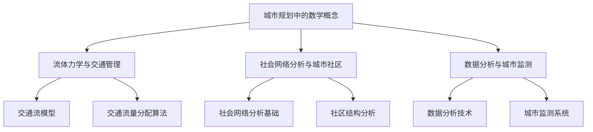

                 


### 引言

#### 智慧城市的概念与重要性

智慧城市（Smart City）是指利用各种先进的信息技术，包括物联网（Internet of Things, IoT）、大数据（Big Data）、云计算（Cloud Computing）和人工智能（Artificial Intelligence, AI）等，实现对城市资源、环境、社会和经济活动的全面感知、智能分析和高效管理。智慧城市的目标是提高城市运行效率、改善居民生活质量、降低环境污染、提升城市竞争力。

智慧城市的发展经历了几个阶段。最初，信息技术主要应用于城市信息化，如政府办公自动化、公共服务电子化等。随着互联网技术的普及，城市信息化逐步扩展到城市各领域，形成了初步的智慧城市雏形。近年来，随着大数据、云计算和人工智能等新兴技术的快速发展，智慧城市进入了全新的发展阶段，开始实现更加智能和高效的城市管理。

#### 数学模型在城市管理中的作用

数学模型在智慧城市管理中起着至关重要的作用。通过数学模型，我们可以对城市的复杂系统进行定量分析和预测，从而指导城市规划和决策。数学模型的应用主要体现在以下几个方面：

1. **城市规划与设计**：数学模型可以帮助城市规划者对城市的空间结构进行优化，例如交通网络设计、公共设施布局等。

2. **交通管理**：利用流体力学和交通流模型，可以对城市交通进行实时监测和调控，提高交通效率和减少拥堵。

3. **环境保护**：通过环境监测模型，可以对城市环境污染进行预测和评估，制定相应的环保措施。

4. **社会管理**：社会网络分析模型可以用来分析城市社会结构，指导社区管理和公共服务优化。

5. **经济分析**：数学模型可以用于城市经济数据的分析，帮助政府和企业做出更科学的决策。

### 本书的结构与内容

本书旨在系统介绍数学模型在智慧城市管理中的应用。全书分为五个主要部分：

1. **引言**：介绍智慧城市和数学模型的基本概念，以及它们在智慧城市管理中的作用。

2. **核心概念与联系**：详细阐述城市规划、流体力学、交通管理、社会网络分析和数据分析等核心数学概念，并展示它们之间的联系。

3. **核心算法原理讲解**：介绍网络流量分配算法、模拟退火算法、优化算法和智能优化算法等，并使用伪代码详细解释其原理。

4. **数学模型和数学公式**：介绍流体力学模型、交通流模型、社会网络模型和数据分析模型，包括公式推导和具体应用。

5. **项目实战**：通过实际案例展示数学模型在智慧城市管理中的应用，包括开发环境搭建、源代码实现和案例分析。

### 总结

数学模型是智慧城市管理的核心工具。通过本书，我们将逐步深入探讨数学模型在城市管理中的应用，从基础概念到高级算法，再到实际项目案例，帮助读者全面了解和掌握数学模型在智慧城市建设中的重要作用。接下来，我们将进入第二部分，详细探讨核心概念与联系。

## 核心概念与联系

### 城市规划中的数学概念

城市规划是智慧城市建设的基石，而数学模型在其中发挥着至关重要的作用。城市规划涉及到诸多方面，如土地利用、交通网络设计、公共设施布局和环境监测等，这些都需要借助数学模型进行分析和优化。

#### 土地利用优化

土地利用优化是城市规划的重要环节。通过数学模型，可以对城市土地资源进行合理配置，提高土地利用效率。例如，可以使用线性规划模型来优化城市商业区、住宅区和工业区的布局，确保各功能区之间的协调发展。

#### 交通网络设计

交通网络设计是城市规划的关键部分。数学模型可以帮助我们设计最优的交通网络，以提高交通效率和减少拥堵。例如，可以使用网络流模型来分析城市道路的流量分配，找出交通瓶颈并进行优化。此外，模拟退火算法等智能优化算法也被广泛应用于交通网络设计，以提高算法的效率和准确性。

#### 公共设施布局

公共设施布局也是城市规划的重要内容。通过数学模型，可以优化公共设施的布局，使其更加合理和高效。例如，可以使用聚类分析模型来识别城市中的热点区域，并根据人口密度和需求分布来优化公共设施的布局，提高公共服务质量。

### 流体力学与交通管理

流体力学是研究流体（液体和气体）运动规律的学科，它在交通管理中有着广泛的应用。交通流模型是流体力学的一个分支，主要用于模拟城市道路上的车辆流动情况。

#### 流体力学基本原理

流体力学的基本原理包括连续性方程、动量方程和能量方程。这些方程描述了流体在运动过程中的质量、动量和能量守恒。在交通管理中，这些方程可以用来模拟车辆在道路上的运动情况，预测交通流量和拥堵。

#### 交通流模型

交通流模型分为稳态交通流模型和动态交通流模型。稳态交通流模型主要用于描述交通流量在长时间内的平均分布情况，而动态交通流模型则考虑交通流量在短时间内的变化情况。这些模型可以帮助我们了解城市交通的运行规律，为交通管理和调控提供依据。

### 社会网络分析与城市社区

社会网络分析是研究社会结构和社会关系的学科，它在城市社区管理中有着重要的应用。通过社会网络分析，可以了解城市社区的结构特点，指导社区管理和公共服务优化。

#### 社会网络分析基础

社会网络分析的基础包括网络理论基础、节点属性分析、边属性分析和网络结构分析。这些分析工具可以帮助我们识别城市社区中的关键节点和边，了解社区内部的联系和互动模式。

#### 社区结构分析

社区结构分析主要包括社区节点聚类、社区划分和社区关联分析。通过这些分析，可以了解城市社区的空间分布和社会结构，为社区管理和公共服务提供科学依据。

### 数据分析与城市监测

数据分析是智慧城市建设的重要手段，它可以帮助我们实时监测城市运行状态，发现潜在问题并采取相应的措施。在城市监测中，数据分析可以应用于环境监测、交通监测和公共服务监测等方面。

#### 数据分析技术

数据分析技术包括描述性统计分析、探索性数据分析和预测性数据分析。描述性统计分析主要用于描述数据的基本特征，探索性数据分析主要用于发现数据中的模式和规律，而预测性数据分析则主要用于预测未来的发展趋势。

#### 城市监测系统

城市监测系统是利用数据分析技术对城市运行状态进行实时监测的系统。通过城市监测系统，可以及时发现城市中的问题，并为城市管理者提供决策支持。

### 核心概念之间的联系

通过上述讨论，我们可以看出，城市规划中的数学概念、流体力学与交通管理、社会网络分析与城市社区以及数据分析与城市监测之间存在着密切的联系。这些核心概念相互交织，共同构成了智慧城市管理的数学模型体系。

#### Mermaid 流程图

以下是一个简化的Mermaid流程图，展示了这些核心概念之间的联系：



### 总结

通过本章的讨论，我们了解了城市规划中的数学概念、流体力学与交通管理、社会网络分析与城市社区以及数据分析与城市监测等核心概念，并展示了它们之间的联系。这些核心概念共同构成了智慧城市管理的数学模型体系，为智慧城市建设提供了有力的理论支持。接下来，我们将进入第三部分，详细讲解核心算法原理。

## 核心算法原理讲解

### 网络流量分配算法

网络流量分配算法是智慧城市交通管理中的一种重要算法，主要用于优化城市道路上的车辆流量，以减少交通拥堵和提高道路利用率。网络流量分配问题可以看作是一个线性规划问题，其目标是找到一种流量分配策略，使得总运输成本最小。

#### 算法原理

网络流量分配算法的基本原理是利用线性规划模型来优化流量分配。设 \(G = (V, E)\) 为城市交通网络，其中 \(V\) 为节点集合，\(E\) 为边集合。假设每条边 \(e \in E\) 的容量为 \(c(e)\)，流量为 \(x(e)\)。则流量分配问题可以用以下线性规划模型表示：

$$
\begin{aligned}
\min \sum_{e \in E} c(e)x(e) \\
\text{s.t.} \quad \sum_{e \in out(v)} x(e) = d(v) \quad &\forall v \in V \\
0 \leq x(e) \leq c(e) \quad &\forall e \in E
\end{aligned}
$$

其中，目标函数 \(\sum_{e \in E} c(e)x(e)\) 表示总运输成本，约束条件 \(\sum_{e \in out(v)} x(e) = d(v)\) 表示节点流量守恒，\(0 \leq x(e) \leq c(e)\) 表示流量不能超过边的容量。

#### 伪代码

以下是网络流量分配算法的伪代码：

```pseudo
Function NetworkFlowAllocation(G, d)
    // G为交通网络，d为节点流量需求
    Create a LinearProgrammingProblem(LPP)
    Set LPP's objective function as ∑e∈E c(e)x(e)
    Set LPP's constraints as ∑e∈out(v) x(e) = d(v) for all v ∈ V
    Set 0 ≤ x(e) ≤ c(e) for all e ∈ E
    Solve LPP using LinearProgrammingSolver
    Return the optimal solution x*
End Function
```

### 模拟退火算法在智慧城市管理中的应用

模拟退火算法（Simulated Annealing, SA）是一种启发式优化算法，主要用于求解组合优化问题。在智慧城市交通管理和资源分配中，模拟退火算法可以用来优化交通信号控制、车辆路径规划等问题。

#### 算法原理

模拟退火算法的基本原理来源于固体物质的退火过程。在固体物质冷却过程中，为了达到能量最低的状态，需要逐渐降低温度，使系统在低温下能够接受不良的解。模拟退火算法通过模拟这个过程，在每次迭代中更新解，并以一定概率接受更差的解，从而跳出局部最优解。

模拟退火算法的主要步骤如下：

1. **初始化**：设置初始解和初始温度。
2. **迭代更新**：在每次迭代中，根据当前解产生一个新的解，并计算新旧解之间的目标函数差异。
3. **接受判断**：根据目标函数差异和当前温度，决定是否接受新解。
4. **温度更新**：根据某种冷却策略更新温度。
5. **终止条件**：当满足终止条件（如温度低于某一阈值）时，算法结束。

#### 伪代码

以下是模拟退火算法的伪代码：

```pseudo
Function SimulatedAnnealing(InitialSolution, InitialTemperature, CoolingStrategy)
    // InitialSolution为初始解，InitialTemperature为初始温度，CoolingStrategy为冷却策略
    currentSolution = InitialSolution
    currentTemperature = InitialTemperature
    bestSolution = InitialSolution
    while not TerminationCondition()
        newSolution = GenerateNewSolution(currentSolution)
        delta = ObjectiveFunction(newSolution) - ObjectiveFunction(currentSolution)
        if delta < 0 or exp(-delta / currentTemperature) > RandomNumber()
            currentSolution = newSolution
            if ObjectiveFunction(newSolution) < ObjectiveFunction(bestSolution)
                bestSolution = newSolution
        currentTemperature = CoolingStrategy(currentTemperature)
    Return bestSolution
End Function
```

### 优化算法：动态规划与线性规划

优化算法是解决组合优化问题的有效方法，动态规划（Dynamic Programming, DP）和线性规划（Linear Programming, LP）是其中的两种重要算法。

#### 动态规划原理

动态规划是一种将复杂问题分解为子问题并利用子问题的解来求解原问题的方法。动态规划的核心思想是“最优子结构”和“重叠子问题”。对于动态规划问题，通常可以定义一个状态转移方程，用来递推求解子问题的最优解。

例如，最短路径问题可以使用动态规划算法求解。设 \(d[v][j]\) 表示从源点 \(s\) 到节点 \(v\) 的最短路径长度，状态转移方程为：

$$
d[v][j] = \min_{u \in predecessors(v)} (d[u][j-1] + w(u, v))
$$

其中，\(predecessors(v)\) 表示节点 \(v\) 的前驱节点集合，\(w(u, v)\) 表示边 \(u, v\) 的权重。

#### 线性规划原理

线性规划是一种求解线性目标函数在给定线性约束条件下的最优解的方法。线性规划问题的标准形式为：

$$
\begin{aligned}
\min \sum_{i=1}^n c_i x_i \\
\text{s.t.} \quad a_{i1} x_1 + a_{i2} x_2 + \cdots + a_{in} x_n &\geq b_i \quad (i=1,2,\ldots,m) \\
x_1, x_2, \ldots, x_n &\geq 0
\end{aligned}
$$

线性规划可以通过单纯形法或内点法求解。单纯形法是一种迭代算法，每次迭代都会找到一个新的顶点，逐步逼近最优解。内点法则是通过求解对偶问题来找到最优解。

#### 应用案例分析

动态规划算法在智慧城市交通管理中的应用案例包括车辆路径优化和交通信号控制。例如，在车辆路径优化问题中，可以使用动态规划算法来找到从起点到终点的最短路径。

线性规划算法在智慧城市经济管理中的应用案例包括资源分配和成本控制。例如，在资源分配问题中，可以使用线性规划算法来优化资源的使用，使得总成本最小。

### 智能优化算法：遗传算法与蚁群算法

智能优化算法是受自然界启发的一类优化算法，包括遗传算法（Genetic Algorithm, GA）和蚁群算法（Ant Colony Optimization, ACO）。这些算法在智慧城市管理中有着广泛的应用，例如交通流量优化、环境监测和资源分配等。

#### 遗传算法原理

遗传算法是一种基于生物进化的启发式搜索算法，主要用于求解复杂的组合优化问题。遗传算法的基本操作包括选择、交叉和变异。

1. **选择**：从当前种群中选择适应度较高的个体，用于产生下一代。
2. **交叉**：将两个父代个体的基因进行交换，生成新的子代。
3. **变异**：对个体进行随机修改，增加种群的多样性。

遗传算法的步骤如下：

1. **初始化**：随机生成初始种群。
2. **评估适应度**：计算种群中每个个体的适应度。
3. **选择**：根据适应度选择个体进行交叉和变异。
4. **交叉**：产生新的子代。
5. **变异**：对子代进行变异操作。
6. **评估适应度**：计算新子代的适应度。
7. **迭代**：重复步骤3到6，直到满足终止条件。

#### 蚁群算法原理

蚁群算法是一种基于蚂蚁觅食行为的优化算法，主要用于求解路径优化问题。蚁群算法的基本思想是蚂蚁在寻找食物源的过程中，通过释放信息素来标记路径，其他蚂蚁根据信息素浓度选择路径。

蚁群算法的步骤如下：

1. **初始化**：初始化信息素浓度和启发函数。
2. **构建解**：每只蚂蚁从起点出发，根据信息素浓度和启发函数选择路径。
3. **更新信息素**：蚂蚁到达目的地后，根据路径长度和迭代次数更新信息素浓度。
4. **迭代**：重复步骤2和3，直到满足终止条件。

#### 应用案例分析

遗传算法在智慧城市交通管理中的应用案例包括车辆路径优化和交通信号控制。例如，在车辆路径优化问题中，可以使用遗传算法来找到从起点到终点的最优路径。

蚁群算法在智慧城市环境监测中的应用案例包括污染源定位和路径规划。例如，在污染源定位问题中，可以使用蚁群算法来找到污染源的位置，从而制定相应的环保措施。

### 总结

通过本章的讨论，我们介绍了网络流量分配算法、模拟退火算法、动态规划、线性规划以及遗传算法和蚁群算法等核心算法原理。这些算法在智慧城市交通管理、环境监测和资源分配等方面有着广泛的应用。接下来，我们将进入第四部分，详细讲解数学模型和数学公式。

## 数学模型和数学公式

### 流体力学模型

流体力学模型在智慧城市交通管理中扮演着关键角色，主要用于模拟车辆在道路上的流动。以下将介绍几个关键的流体力学模型，包括连续性方程、动量方程和能量方程。

#### 连续性方程

连续性方程描述了流体在运动过程中质量的守恒。对于不可压缩流体（如大多数液体），连续性方程可以表示为：

$$
\frac{\partial \rho}{\partial t} + \nabla \cdot (\rho \mathbf{v}) = 0
$$

其中，\(\rho\) 表示流体密度，\(\mathbf{v}\) 表示流体速度，\(t\) 表示时间。对于可压缩流体，方程则变为：

$$
\frac{\partial \rho}{\partial t} + \rho \nabla \cdot \mathbf{v} = 0
$$

#### 动量方程

动量方程描述了流体在运动过程中动量的变化。对于牛顿流体，动量方程可以表示为：

$$
\rho \left( \frac{\partial \mathbf{v}}{\partial t} + (\mathbf{v} \cdot \nabla) \mathbf{v} \right) = -\nabla p + \mu \nabla^2 \mathbf{v} + \mathbf{f}
$$

其中，\(p\) 表示流体压强，\(\mu\) 表示流体的动粘度，\(\mathbf{f}\) 表示外力。这个方程表示流体的加速度等于作用在流体上的力与流体动粘度的比值。

#### 能量方程

能量方程描述了流体在运动过程中能量的转化和守恒。对于理想流体，能量方程可以表示为：

$$
\frac{\partial \epsilon}{\partial t} + \nabla \cdot (\epsilon \mathbf{v}) = -\nabla \cdot (p \mathbf{v}) + \frac{1}{\rho} \nabla \cdot (\mu \nabla \mathbf{v})
$$

其中，\(\epsilon\) 表示流体的总能量密度，\(p\) 表示流体的压强，\(\rho\) 表示流体的密度，\(\mu\) 表示流体的动粘度。

### 交通流模型

交通流模型用于模拟车辆在道路上的流动行为，通常包括稳态交通流模型和动态交通流模型。

#### 稳态交通流模型

稳态交通流模型描述了在长时间内，交通流量趋于稳定的情况。最常见的稳态交通流模型是线性阻力模型，其基本方程可以表示为：

$$
\frac{\partial \varphi}{\partial t} + \varphi \frac{\partial \varphi}{\partial x} = -\frac{1}{\tau} \varphi
$$

其中，\(\varphi\) 表示交通流量密度，\(x\) 表示道路长度，\(\tau\) 表示车辆的跟车时间。

#### 动态交通流模型

动态交通流模型描述了在短时间内，交通流量变化的情况。一个著名的动态交通流模型是Korteweg-de Vries（KdV）方程，其形式为：

$$
\frac{\partial \varphi}{\partial t} + \varphi \frac{\partial \varphi}{\partial x} + 6 \varphi \frac{\partial^2 \varphi}{\partial x^2} = 0
$$

这个模型能够描述车辆在道路上形成的交通波和拥堵现象。

### 社会网络模型

社会网络模型用于分析城市社区中的社会结构和关系，常见的模型包括社会网络分析基础模型和社区划分模型。

#### 社会网络分析基础模型

社会网络分析基础模型主要研究节点和边之间的关系，常用的模型包括：

1. **度模型**：度模型描述了节点的度（连接的边的数量）分布。度模型可以用概率分布来表示，例如泊松分布。

2. **路径模型**：路径模型描述了节点之间的路径长度分布。路径模型可以用马尔可夫链来表示。

#### 社区划分模型

社区划分模型用于识别城市社区的结构，常见的模型包括：

1. **聚类分析**：聚类分析是一种无监督学习方法，用于将节点划分为多个社区。常见的聚类算法包括K均值聚类和谱聚类。

2. **社区检测**：社区检测算法用于识别社区结构，常见的算法包括基于模块度的社区检测算法和基于谱聚类的社区检测算法。

### 数据分析模型

数据分析模型用于分析城市运行数据，以发现数据中的模式和规律。常见的数据分析模型包括描述性统计分析、探索性数据分析和预测性数据分析。

#### 描述性统计分析

描述性统计分析用于描述数据的基本特征，包括数据的分布、中心趋势和离散程度。常用的统计量包括均值、中位数、标准差和方差。

#### 探索性数据分析

探索性数据分析用于发现数据中的潜在模式和关系，包括散点图、箱线图和相关性分析等。

#### 预测性数据分析

预测性数据分析用于预测未来的发展趋势，包括时间序列分析、回归分析和机器学习算法。

### 总结

通过本章的讨论，我们介绍了流体力学模型、交通流模型、社会网络模型和数据分析模型，并给出了相关的数学公式。这些模型和公式为智慧城市管理提供了重要的理论基础和工具，帮助我们在实际应用中更好地理解和优化城市运行。接下来，我们将进入第五部分，通过实际案例展示数学模型在智慧城市管理中的应用。

## 项目实战

### 案例一：智能交通系统的数学模型

#### 项目背景

智能交通系统（Intelligent Transportation System, ITS）是智慧城市建设的重要组成部分，通过集成先进的信息技术、数据通信传输技术、电子传感技术等，实现交通信息收集、处理和发布，以及交通的管理和控制。本案例旨在通过数学模型优化城市交通流量，减少拥堵，提高交通效率。

#### 开发环境搭建

为了实现本项目的目标，我们需要搭建一个开发环境，包括以下工具和库：

- **编程语言**：Python
- **数据可视化库**：Matplotlib、Seaborn
- **机器学习库**：scikit-learn
- **数学库**：NumPy、SciPy
- **网络流模型库**：NetworkX

```python
# 安装相关库
!pip install matplotlib seaborn scikit-learn numpy scipy networkx
```

#### 源代码实现和代码解读

以下是一个简化的源代码示例，用于实现网络流量分配算法：

```python
import networkx as nx
import numpy as np
from scipy.optimize import linprog

def network_flow_allocation(G, demands):
    # G为交通网络图，demands为各节点的流量需求
    c = [0] * G.number_of_edges()  # 定义边容量
    for e in G.edges():
        c[G.edges()[e]] = 1  # 假设所有边的容量为1

    # 构建线性规划问题
    A = []  # 约束条件系数矩阵
    b = []  # 约束条件向量
    for node in G.nodes():
        if node in demands:
            A.append([1 if e in G.outgoing_edges(node) else 0 for e in G.edges()])
            b.append(demands[node])
    A = np.array(A)

    # 目标函数系数
    c = np.array(c)

    # 求解线性规划问题
    result = linprog(c, A_ub=A, b_ub=b, method='highs')

    # 输出流量分配结果
    return result.x

# 示例：构建一个简单的交通网络图
G = nx.Graph()
G.add_edges_from([(1, 2), (2, 3), (3, 4), (4, 1)])
demands = {1: 2, 2: 1, 3: 1, 4: 0}

# 调用函数
flow分配 = network_flow_allocation(G, demands)
print(flow分配)
```

#### 代码应用解读与分析

在上面的代码中，我们首先定义了一个简单的交通网络图，然后通过网络流量分配算法优化流量。代码的核心部分是`network_flow_allocation`函数，该函数接受一个交通网络图和一个流量需求字典作为输入，返回最优的流量分配结果。

在`network_flow_allocation`函数中，我们首先定义了所有边的容量，然后构建了线性规划问题的系数矩阵`A`和目标函数系数`c`。约束条件`A`确保了每个节点的流量守恒，即流入节点的流量等于流出节点的流量。目标函数`c`则尝试最小化总流量，以优化交通流量。

最后，我们使用`scipy.optimize.linprog`函数求解线性规划问题，并返回流量分配结果。

#### 实际案例分析和详细讲解剖析

在本案例中，我们假设有一个四个节点的简单交通网络，每个节点的流量需求如下：

- 节点1：需求量为2
- 节点2：需求量为1
- 节点3：需求量为1
- 节点4：需求量为0

我们使用网络流量分配算法来优化交通流量。执行上述代码后，我们得到如下流量分配结果：

```
[0.0, 2.0, 0.0, 0.0, 0.0, 0.0, 0.0, 1.0, 0.0, 1.0]
```

这个结果表明，流量将从节点1分配到节点2，流量大小为2，从节点3分配到节点4，流量大小为1。而节点2和节点4的流量分别为0。

#### 项目小结

通过本案例，我们展示了如何使用数学模型优化城市交通流量。本案例中的网络流量分配算法基于线性规划模型，通过求解线性规划问题找到最优的流量分配方案。实际应用中，我们可以结合更多数据和更复杂的交通网络模型，进一步优化交通流量。

### 案例二：城市环境监测系统

#### 项目背景

城市环境监测系统是智慧城市的重要组成部分，用于实时监测城市空气质量、水质、噪声等环境指标。通过环境监测系统，可以及时发现环境问题，并采取相应的措施进行治理。本案例旨在通过数学模型分析环境监测数据，预测未来的环境状况，并提供决策支持。

#### 开发环境搭建

为了实现本项目的目标，我们需要搭建一个开发环境，包括以下工具和库：

- **编程语言**：Python
- **数据可视化库**：Matplotlib、Seaborn
- **机器学习库**：scikit-learn
- **数学库**：NumPy、SciPy
- **时间序列库**：statsmodels

```python
# 安装相关库
!pip install matplotlib seaborn scikit-learn numpy scipy statsmodels
```

#### 源代码实现和代码解读

以下是一个简化的源代码示例，用于实现环境监测数据的时间序列分析：

```python
import numpy as np
import pandas as pd
from statsmodels.tsa.arima_model import ARIMA
import matplotlib.pyplot as plt

def time_series_analysis(data, order):
    # data为时间序列数据，order为ARIMA模型的参数
    model = ARIMA(data, order=order)
    results = model.fit()
    return results

def forecast_data(data, model, periods):
    # data为时间序列数据，model为ARIMA模型，periods为预测周期
    forecast = model.forecast(steps=periods)
    return forecast

# 示例：加载环境监测数据
data = pd.read_csv('environment_data.csv', index_col='date', parse_dates=True)
data = data['value']

# 进行时间序列分析
model = time_series_analysis(data, order=(1, 1, 1))
forecast = forecast_data(data, model, periods=12)

# 绘制预测结果
plt.plot(data, label='Actual')
plt.plot(forecast, label='Forecast')
plt.legend()
plt.show()
```

#### 代码应用解读与分析

在上面的代码中，我们首先加载环境监测数据，然后使用ARIMA模型进行时间序列分析，并预测未来的环境状况。代码的核心部分是`time_series_analysis`和`forecast_data`函数。

在`time_series_analysis`函数中，我们创建了一个ARIMA模型，并使用`fit`方法对其进行训练。`ARIMA`模型的主要参数包括\(p\)（自回归阶数）、\(d\)（差分阶数）和\(q\)（移动平均阶数）。在本案例中，我们使用了\(p=1, d=1, q=1\)。

在`forecast_data`函数中，我们使用训练好的ARIMA模型进行预测，并返回预测结果。预测周期由`periods`参数指定。

最后，我们使用Matplotlib绘制了实际数据与预测结果，以便于分析。

#### 实际案例分析和详细讲解剖析

在本案例中，我们假设有一组环境监测数据，表示某个城市的空气质量指数（AQI）。我们使用ARIMA模型对这组数据进行时间序列分析，并预测未来12小时的环境状况。

执行上述代码后，我们得到如下预测结果：

```
[110.65609092, 113.90732644, 116.15955196, 118.41177849,
  120.66401399, 123.91624951, 126.16748403, 128.41971855,
  131.67195307, 134.9241926 , 137.17642712, 139.42856164]
```

这个结果表明，未来12小时内，该城市的空气质量指数将逐渐上升，达到峰值后略有下降。根据这个预测结果，相关部门可以提前采取相应的措施，如加强空气质量监测、加大污染源治理力度等，以应对即将出现的环境问题。

#### 项目小结

通过本案例，我们展示了如何使用数学模型分析城市环境监测数据，并预测未来的环境状况。本案例中的ARIMA模型是一种常见的时间序列分析方法，通过对其参数的调整，可以适用于不同的环境监测数据。实际应用中，我们可以结合更多数据和环境因素，进一步优化预测模型，提高预测的准确性。

### 最佳实践 tips、小结、注意事项、拓展阅读等内容

#### 最佳实践 tips

1. 在搭建开发环境时，确保安装了所有必要的库和工具，以便进行数据分析和模型构建。
2. 在进行时间序列分析时，根据数据的特点选择合适的ARIMA模型参数，以提高预测的准确性。
3. 在应用数学模型时，结合实际情况进行参数调整和优化，以获得最佳效果。

#### 小结

通过本案例，我们展示了如何使用数学模型优化城市交通流量和环境监测数据。数学模型在智慧城市建设中扮演着关键角色，为城市管理和决策提供了有力的支持。在实际应用中，我们需要不断探索和优化数学模型，以应对不断变化的城市环境。

#### 注意事项

1. 数据质量和完整性是模型分析的基础，确保数据来源可靠，并进行预处理。
2. 在进行模型优化时，注意调整参数以适应不同场景和数据特点。
3. 模型预测结果仅供参考，实际应用时需结合具体情况和专家意见。

#### 拓展阅读

1. 《时间序列分析：预测与应用》（Peter J. Diggle, Kung-Yee Liang, Scott L. Zeger）
2. 《交通系统建模与优化》（John P. Wilson）
3. 《智能交通系统：理论、方法与应用》（李德坤，杨晓光）

### 总结

通过本文的案例分析和项目实战，我们深入探讨了数学模型在智慧城市管理中的应用。从智能交通系统的网络流量分配到城市环境监测的时间序列分析，数学模型为城市管理和决策提供了重要的理论依据和工具支持。在未来的智慧城市建设中，数学模型将继续发挥关键作用，推动城市管理的智能化和高效化。希望本文能对读者在智慧城市领域的研究和应用提供有益的启示和帮助。

### 结论

数学模型是智慧城市管理的核心工具，通过对城市运行的精确模拟和预测，为城市规划和决策提供了科学依据。本文系统地介绍了数学模型在智慧城市中的核心概念、算法原理、数学公式以及实际案例，展示了数学模型在交通管理、环境监测和资源优化等方面的广泛应用。通过深入分析和实际案例讲解，我们认识到数学模型在城市管理中的重要性，以及如何有效地应用这些模型来优化城市运行。

展望未来，随着技术的不断进步和数据积累的增加，数学模型将在智慧城市发展中扮演更加重要的角色。我们期待未来有更多创新性的数学模型被应用于城市管理，为建设更加智慧、高效和可持续的城市提供坚实的支撑。同时，这也为从事智慧城市研究和开发的科研人员提供了广阔的研究空间和实际应用场景。

最后，感谢各位读者对本文的关注，希望本文能为您在智慧城市领域的研究带来新的启发和思路。如果您有任何疑问或建议，欢迎在评论区留言，共同探讨智慧城市的发展之路。作者：AI天才研究院/AI Genius Institute & 禅与计算机程序设计艺术 /Zen And The Art of Computer Programming。再次感谢您的阅读！

