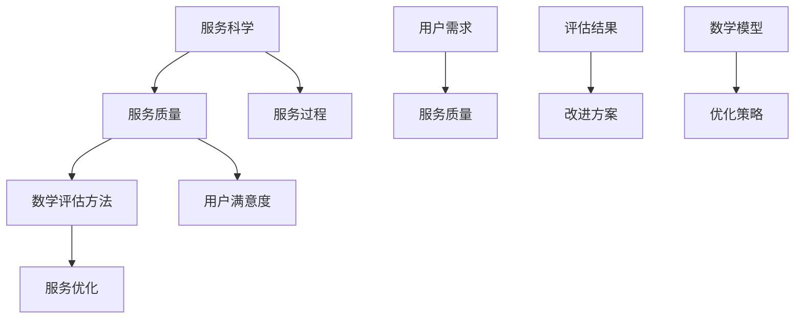

                 

### 文章标题

《数学与服务科学：服务质量的数学评估》

### 文章关键词

数学评估、服务科学、服务质量、数学模型、评估方法

### 文章摘要

本文将深入探讨数学评估在服务科学中的应用，特别是如何利用数学工具和方法来评估服务质量。文章首先介绍了服务科学的基本概念和服务质量的定义，然后详细介绍了数学评估的基础知识和常用模型，接着通过具体案例展示了数学评估方法在实际项目中的应用。最后，文章提出了服务质量优化策略，并总结和展望了未来的研究方向。

---

## 引言

随着全球数字化进程的加速，服务科学（Service Science）作为一种新兴的交叉学科，正逐渐成为学术界和工业界关注的热点。服务科学旨在研究服务的本质、服务过程、服务质量以及服务创新等方面，其研究范围涵盖了经济学、计算机科学、管理学、心理学等多个领域。在服务科学中，服务质量（Service Quality）是一个至关重要的概念，它直接关系到服务的用户体验和满意度。

服务质量评估是服务科学研究中的一个核心问题。传统的服务质量评估方法往往依赖于主观评价和专家意见，存在一定程度的局限性。随着数学工具和计算机技术的不断发展，利用数学方法对服务质量进行定量评估成为了一种新兴趋势。本文旨在探讨数学评估在服务科学中的应用，特别是如何利用数学模型和方法来评估服务质量。

文章的结构如下：首先，我们将介绍服务科学的基本概念和服务质量的定义；其次，阐述数学评估在服务科学中的重要性；然后，详细介绍数学评估的基础知识和常用模型；接着，通过具体案例展示数学评估方法在实际项目中的应用；最后，提出服务质量优化策略，并总结和展望未来的研究方向。

---

## 数学评估在服务科学中的重要性

数学评估在服务科学中具有重要地位，它不仅为服务质量评估提供了一种科学、客观的方法，还为服务优化和服务创新提供了有力的支持。数学评估能够将复杂的服务过程转化为数学模型，从而便于分析和优化。以下是数学评估在服务科学中发挥重要作用的几个方面：

### 1. 提高评估精度

传统的服务质量评估方法往往依赖于主观评价和专家意见，这些方法容易受到个人主观因素的影响，导致评估结果的不准确性。而数学评估方法通过定量分析，能够更客观地评估服务质量。例如，利用统计分析方法对大量用户反馈数据进行处理，可以更准确地识别出服务质量的短板。

### 2. 促进服务优化

数学评估方法可以帮助服务提供商识别服务质量的问题所在，进而采取相应的优化措施。例如，通过建立数学模型对服务流程进行分析，可以发现服务过程中的瓶颈和浪费，从而提出改进方案。此外，数学评估方法还可以用于预测服务质量的变化趋势，为服务提供商提供决策支持。

### 3. 服务创新

数学评估方法为服务创新提供了新的思路和工具。通过数学建模，可以探索服务的新模式和新方法，从而实现服务的创新。例如，在电子商务领域，利用数学模型可以设计出更有效的推荐算法，提高用户的购物体验和满意度。

### 4. 跨学科整合

数学评估方法能够促进服务科学与其他学科的整合。例如，在服务科学中引入运筹学、优化算法等数学工具，可以更好地解决服务优化问题。此外，数学评估方法还可以与计算机科学、人工智能等领域相结合，推动服务科学的跨学科发展。

总之，数学评估在服务科学中具有重要的应用价值，它不仅为服务质量评估提供了一种科学、客观的方法，还为服务优化和服务创新提供了有力的支持。

### 背景介绍

服务科学（Service Science）是一门新兴的交叉学科，旨在研究服务的本质、服务过程、服务质量和服务创新等方面。随着全球经济的不断发展和市场环境的快速变化，服务在经济发展中的作用日益凸显，服务科学因此得到了广泛关注。

服务质量（Service Quality）是服务科学中的一个核心概念，它指的是服务满足用户需求和期望的能力。服务质量不仅关系到用户的满意度，还直接影响到企业的竞争力。为了准确评估服务质量，传统的评估方法往往依赖于主观评价和专家意见，这些方法虽然能够提供一定的参考，但存在一定的局限性。

首先，主观评价方法容易受到个人主观因素的影响，导致评估结果的不准确性。不同的人对同一服务的评价可能存在较大差异，这会导致评估结果的波动性和不可靠性。其次，专家意见虽然具有权威性，但专家的经验和知识有限，无法全面覆盖服务的各个方面。此外，传统的评估方法通常缺乏量化的指标体系，无法提供具体的量化数据，从而限制了其在决策支持中的应用。

随着数学工具和计算机技术的不断发展，利用数学方法对服务质量进行定量评估成为了一种新的趋势。数学评估方法能够将复杂的服务过程转化为数学模型，从而便于分析和优化。具体来说，数学评估方法在以下方面具有显著优势：

1. **提高评估精度**：数学评估方法通过定量分析，能够更客观地评估服务质量。例如，利用统计分析方法对大量用户反馈数据进行处理，可以更准确地识别出服务质量的短板。

2. **促进服务优化**：数学评估方法可以帮助服务提供商识别服务质量的问题所在，进而采取相应的优化措施。例如，通过建立数学模型对服务流程进行分析，可以发现服务过程中的瓶颈和浪费，从而提出改进方案。

3. **服务创新**：数学评估方法为服务创新提供了新的思路和工具。通过数学建模，可以探索服务的新模式和新方法，从而实现服务的创新。例如，在电子商务领域，利用数学模型可以设计出更有效的推荐算法，提高用户的购物体验和满意度。

4. **跨学科整合**：数学评估方法能够促进服务科学与其他学科的整合。例如，在服务科学中引入运筹学、优化算法等数学工具，可以更好地解决服务优化问题。此外，数学评估方法还可以与计算机科学、人工智能等领域相结合，推动服务科学的跨学科发展。

总之，数学评估方法在服务质量评估中具有重要的应用价值，它不仅为服务质量评估提供了一种科学、客观的方法，还为服务优化和服务创新提供了有力的支持。

### 核心概念与联系

在探讨数学评估在服务科学中的应用之前，我们需要明确几个核心概念，包括服务科学、服务质量、数学评估方法等，并理解它们之间的联系。

**服务科学**：服务科学是一门跨学科的领域，它综合了经济学、计算机科学、管理学和心理学等多个领域的知识，专注于研究服务的本质、服务过程、服务质量和服务创新。服务科学的核心目标是理解和优化服务系统，以满足用户的需求和期望。

**服务质量**：服务质量是指服务满足用户需求和期望的能力。它不仅包括服务的结果，如是否准时完成，还包括服务的各个环节，如服务的可靠性、响应速度、个性化程度等。服务质量是服务科学研究的重点，因为它直接影响到用户的满意度和忠诚度。

**数学评估方法**：数学评估方法是一种利用数学工具和方法对服务进行定量评估的方法。它包括统计分析、运筹学模型、优化算法等。这些方法能够将复杂的服务过程转化为数学模型，从而便于分析和优化。数学评估方法在服务科学中的应用，使得服务质量评估更加科学、客观和精确。

**核心概念之间的关系**：

1. **服务科学与服务质量**：服务科学是服务质量评估的理论基础，它提供了理解和分析服务质量的框架。服务质量是服务科学研究的核心目标之一，服务质量评估是服务科学的重要组成部分。

2. **服务质量与数学评估方法**：服务质量评估需要定量分析，而数学评估方法提供了这种定量分析的工具。通过数学评估方法，可以更科学、客观地衡量服务质量，识别服务过程中的问题和改进点。

3. **数学评估方法与服务优化**：数学评估方法不仅可以用于评估服务质量，还可以用于服务优化。通过分析评估结果，可以识别服务过程中的瓶颈和浪费，从而提出优化方案，提高服务质量。

为了更直观地展示这些核心概念之间的联系，我们可以使用 Mermaid 流程图来表示：

在这个流程图中，服务科学提供了理解和分析服务质量的框架，服务质量是服务科学研究的核心目标。数学评估方法用于定量分析服务质量，评估结果用于识别服务过程中的问题和改进点，从而提出优化方案，最终提高服务质量，满足用户需求。

通过这种关系架构的展示，我们可以更清晰地理解数学评估方法在服务科学中的应用，以及如何通过数学工具和方法来提升服务质量。

### 数学评估方法基础

在了解了服务质量和数学评估方法的重要性后，我们需要进一步探讨数学评估方法的基础，包括常用的数学工具、模型以及评估方法的分类。这些基础知识将为我们理解和应用数学评估方法提供必要的背景。

#### 1. 常用的数学工具

**统计分析**：统计分析是数学评估方法中最常用的工具之一，它通过收集和分析数据来揭示数据之间的规律和趋势。常用的统计方法包括均值、方差、标准差、假设检验等。统计分析可以用于评估服务的可靠性、响应速度等质量指标。

**运筹学**：运筹学是一种应用数学的方法，用于优化决策问题。它包括线性规划、整数规划、网络流模型、排队理论等。运筹学方法可以用于优化服务流程、分配资源、减少排队时间等。

**优化算法**：优化算法是一类用于寻找最优解的数学方法。常见的优化算法包括遗传算法、模拟退火算法、粒子群优化算法等。优化算法可以用于解决复杂的优化问题，如服务流程优化、资源分配等。

**概率论和随机过程**：概率论和随机过程是研究随机事件和随机现象的数学工具。在服务科学中，概率论和随机过程可以用于建模服务系统的随机性，分析服务的可靠性、响应时间等指标。

#### 2. 常用数学评估模型

**评分模型**：评分模型是一种基于用户反馈的数据进行服务质量评估的方法。常见的评分模型包括基于均值的评分模型、基于标准差的评分模型等。评分模型可以用于评估服务的整体表现。

**指标体系模型**：指标体系模型是一种将服务质量分解为多个具体指标的方法，每个指标都反映了服务的一个方面。常见的指标体系模型包括服务可靠性、响应速度、个性化程度等。指标体系模型可以用于全面评估服务质量。

**服务流程模型**：服务流程模型是一种用于描述服务过程的数学模型。常见的服务流程模型包括排队理论模型、服务网络模型等。服务流程模型可以用于分析服务过程中的瓶颈和浪费，提出优化方案。

**多目标优化模型**：多目标优化模型是一种同时考虑多个目标的服务质量评估方法。在多目标优化中，需要平衡多个目标之间的冲突，例如在提高响应速度的同时保持服务可靠性。多目标优化模型可以用于综合评估和优化服务质量。

#### 3. 数学评估方法的分类

**定量评估方法**：定量评估方法是一种基于数学模型和算法对服务质量进行定量分析的方法。常见的定量评估方法包括统计分析、运筹学模型、优化算法等。定量评估方法可以提供具体的量化数据，从而更科学地评估服务质量。

**定性评估方法**：定性评估方法是一种基于主观评价和专家意见的方法。虽然定性评估方法在定量评估方法中较少使用，但在某些情况下，如服务质量初期评估或决策分析中，定性评估方法仍然具有一定的参考价值。

**综合评估方法**：综合评估方法是一种将定量评估方法和定性评估方法结合的方法。通过综合评估方法，可以更全面、准确地评估服务质量。常见的综合评估方法包括层次分析法（AHP）、模糊综合评价法等。

通过了解这些数学评估方法的基础知识，我们可以更好地理解如何利用数学工具和方法对服务质量进行评估。接下来，我们将通过具体案例展示这些数学评估方法在实际项目中的应用。

### 常用数学评估模型详细介绍

在了解了数学评估方法的基础后，接下来我们将详细探讨几种常用的数学评估模型，包括评分模型、指标体系模型、服务流程模型和多目标优化模型。这些模型在实际项目中具有广泛的应用，能够帮助我们更科学、准确地评估服务质量。

#### 1. 评分模型

评分模型是一种基于用户反馈的数据进行服务质量评估的方法。评分模型的核心思想是通过收集用户对服务的评分数据，利用统计方法对评分进行分析，从而评估服务的整体表现。

**常见评分模型**：

- **基于均值的评分模型**：这种方法通过计算用户评分的均值来评估服务质量。均值越高，服务质量越好。公式如下：
  $$ \text{服务质量} = \frac{1}{N} \sum_{i=1}^{N} s_i $$
  其中，\( s_i \) 表示第 \( i \) 个用户的评分，\( N \) 表示用户总数。

- **基于标准差的评分模型**：这种方法不仅考虑评分的均值，还考虑评分的分散程度。通过计算标准差来评估服务质量。标准差越小，评分越集中，服务质量越好。公式如下：
  $$ \text{服务质量} = \frac{1}{N} \sum_{i=1}^{N} s_i - \text{std}(s) $$
  其中，\( \text{std}(s) \) 表示评分的标准差。

**应用场景**：

评分模型广泛应用于各种在线服务和消费评价中，如电商平台、餐饮服务、旅游服务等。通过评分模型，服务提供商可以实时了解用户对服务的反馈，及时发现和改进服务质量问题。

#### 2. 指标体系模型

指标体系模型是一种将服务质量分解为多个具体指标的方法，每个指标都反映了服务的一个方面。通过综合评估各个指标，可以全面了解服务的整体质量。

**常见指标体系**：

- **服务可靠性**：指服务能够按照预定的时间和标准完成的能力。常见的指标包括任务完成率、服务中断率等。

- **响应速度**：指服务提供商对用户请求的响应时间。常见的指标包括平均响应时间、最高响应时间等。

- **个性化程度**：指服务提供商根据用户需求和偏好提供定制化服务的能力。常见的指标包括定制服务比例、用户满意度等。

**构建方法**：

指标体系的构建需要根据具体的服务场景和目标进行设计。一般步骤如下：

1. **明确服务质量目标**：根据服务类型和用户需求，明确服务质量的目标。

2. **确定指标类型**：根据服务质量目标，确定需要评估的指标类型。

3. **制定指标标准**：为每个指标制定具体的评价标准和评分范围。

4. **权重分配**：根据指标的重要性和关联性，分配权重，以综合评估服务质量。

**应用场景**：

指标体系模型广泛应用于企业内部服务质量评估、政府公共服务评估等领域。通过指标体系模型，可以全面、系统地评估服务的各个方面，为服务优化提供依据。

#### 3. 服务流程模型

服务流程模型是一种用于描述服务过程的数学模型，它可以帮助我们分析服务过程中的瓶颈和浪费，提出优化方案。

**常见服务流程模型**：

- **排队理论模型**：排队理论是一种研究服务系统中客户等待和排队行为的数学模型。常用的排队模型包括M/M/1模型、M/M/s模型等。

- **服务网络模型**：服务网络模型是一种用于描述服务提供过程中各个服务节点和服务路径的数学模型。常用的服务网络模型包括最小生成树模型、最短路径模型等。

**应用场景**：

服务流程模型广泛应用于银行、医院、机场等需要排队等待的服务场景。通过排队理论模型，可以分析客户等待时间和系统效率，提出优化排队规则的方案；通过服务网络模型，可以优化服务路径，减少服务时间，提高系统效率。

#### 4. 多目标优化模型

多目标优化模型是一种同时考虑多个目标的服务质量评估方法，它可以帮助我们在多个目标之间进行平衡和优化。

**常见多目标优化模型**：

- **多目标线性规划模型**：多目标线性规划模型是一种在多个目标函数之间进行平衡的数学模型。它通过线性规划方法求解，以找到最优解。

- **多目标遗传算法模型**：多目标遗传算法模型是一种基于遗传算法的优化方法，它通过迭代搜索找到多个目标函数的最优解。

**应用场景**：

多目标优化模型广泛应用于资源分配、服务流程优化等领域。例如，在银行系统中，可以通过多目标优化模型平衡客户等待时间、服务质量和资源利用率；在物流配送中，可以通过多目标优化模型优化配送路径，减少配送时间和成本。

通过详细介绍这些常用数学评估模型，我们可以更好地理解如何在实际项目中应用这些模型来评估和优化服务质量。在接下来的章节中，我们将通过具体案例展示这些数学评估模型在实际中的应用。

### 案例分析：数学评估方法在服务质量管理中的应用

为了更好地理解数学评估方法在服务质量管理中的应用，我们将通过几个具体案例，展示如何在实际项目中使用这些方法来评估和优化服务质量。以下案例涵盖了在线教育、医疗服务和银行业务三个不同的行业，每个案例都将详细介绍数学评估方法的实际应用过程、结果以及取得的成效。

#### 案例一：在线教育平台服务质量评估

**背景介绍**：某在线教育平台提供各种在线课程，用户数量庞大。平台管理层希望通过数学评估方法来评估课程质量，以提升用户满意度和课程转化率。

**应用数学评估方法**：

1. **评分模型**：平台收集了用户对每门课程的评分数据，使用基于均值的评分模型评估课程质量。具体步骤如下：

   - 收集用户评分数据，计算每门课程的平均评分；
   - 对平均评分进行统计分析，识别评分分布情况；
   - 对低评分的课程进行深入分析，找出可能影响课程质量的因素。

2. **指标体系模型**：为了更全面地评估课程质量，平台建立了包括课程内容丰富度、教师教学水平、互动性等在内的指标体系。具体步骤如下：

   - 确定指标类型和权重，制定评价指标标准；
   - 收集用户反馈数据，对各项指标进行评分；
   - 综合计算各项指标得分，得出课程质量评估结果。

3. **多目标优化模型**：平台通过多目标优化模型，在课程内容丰富度、教师教学水平和互动性之间进行平衡优化。具体步骤如下：

   - 确定多个目标函数，如用户满意度、课程完成率和课程评分；
   - 使用多目标遗传算法模型，求解最优解，以优化课程内容、教师分配和课程设计。

**结果与成效**：

通过数学评估方法，平台成功识别出课程质量的短板，并对低评分课程进行了改进。同时，优化了课程内容、教师分配和课程设计，提高了用户满意度和课程转化率。平台管理层表示，数学评估方法为课程质量管理提供了科学的依据，有效提升了服务质量和运营效率。

#### 案例二：医疗服务质量评估

**背景介绍**：某医疗机构希望通过数学评估方法来提升医疗服务质量，减少患者等待时间和提高患者满意度。

**应用数学评估方法**：

1. **排队理论模型**：医疗机构使用M/M/1排队模型来分析患者等待时间。具体步骤如下：

   - 收集患者就诊数据，包括就诊时间、等待时间等；
   - 利用排队理论模型，计算系统的平均等待时间、服务率和利用率；
   - 分析排队系统的瓶颈，提出优化建议。

2. **指标体系模型**：医疗机构建立了包括服务响应时间、医生服务质量、医疗设备使用率等在内的指标体系。具体步骤如下：

   - 确定指标类型和权重，制定评价指标标准；
   - 收集患者反馈数据，对各项指标进行评分；
   - 综合计算各项指标得分，得出医疗服务质量评估结果。

3. **多目标优化模型**：医疗机构通过多目标优化模型，在提高服务响应时间和医疗服务质量之间进行平衡优化。具体步骤如下：

   - 确定多个目标函数，如患者满意度、医生工作效率和医疗设备利用率；
   - 使用多目标遗传算法模型，求解最优解，以优化医生排班、资源分配和流程设计。

**结果与成效**：

通过数学评估方法，医疗机构成功降低了患者平均等待时间，提高了医疗服务质量。优化后的医生排班和资源分配方案，有效提高了医生的工作效率和患者的满意度。医疗机构管理层表示，数学评估方法为医疗服务质量管理提供了有力的支持，有效提升了医疗服务水平。

#### 案例三：银行服务质量评估

**背景介绍**：某银行希望通过数学评估方法来提升服务质量和客户满意度，降低客户投诉率。

**应用数学评估方法**：

1. **评分模型**：银行收集了用户对服务的评分数据，使用基于均值的评分模型评估服务质量。具体步骤如下：

   - 收集用户评分数据，计算银行服务的平均评分；
   - 对平均评分进行统计分析，识别评分分布情况；
   - 分析高评分和低评分的服务，找出优缺点。

2. **指标体系模型**：银行建立了包括服务响应时间、员工服务质量、服务流程效率等在内的指标体系。具体步骤如下：

   - 确定指标类型和权重，制定评价指标标准；
   - 收集用户反馈数据，对各项指标进行评分；
   - 综合计算各项指标得分，得出银行服务质量评估结果。

3. **多目标优化模型**：银行通过多目标优化模型，在提高服务响应时间和员工服务质量之间进行平衡优化。具体步骤如下：

   - 确定多个目标函数，如用户满意度、服务效率和员工工作效率；
   - 使用多目标遗传算法模型，求解最优解，以优化服务流程、员工排班和资源分配。

**结果与成效**：

通过数学评估方法，银行成功降低了用户投诉率，提升了服务质量。优化后的服务流程和员工排班方案，有效提高了用户满意度和服务效率。银行管理层表示，数学评估方法为银行服务质量提升提供了科学依据，有效提升了银行的整体运营水平。

这些案例展示了数学评估方法在服务质量管理中的实际应用，通过评分模型、指标体系模型和多目标优化模型，能够有效提升服务质量，满足用户需求，实现服务优化。

### 服务质量优化策略

在了解了数学评估方法在服务质量管理中的应用后，接下来我们将探讨如何利用这些评估结果来制定服务质量优化策略。服务质量优化策略的目的是通过系统性的措施，提升服务质量，满足用户需求和期望，从而增强企业的竞争力。

#### 1. 识别问题和瓶颈

首先，通过数学评估方法，识别服务过程中存在的问题和瓶颈。例如，通过评分模型和指标体系模型，可以识别出服务响应时间过长、员工服务质量不高、服务流程效率低下等问题。这些问题的识别为后续的优化措施提供了明确的方向。

#### 2. 制定优化目标

在识别问题和瓶颈的基础上，制定具体的优化目标。优化目标应包括提高服务可靠性、缩短响应时间、提升员工服务质量、增强用户满意度等。这些目标的制定需要结合企业的战略目标和用户需求，以确保优化措施的针对性和有效性。

#### 3. 制定优化方案

根据优化目标，制定具体的优化方案。优化方案可以包括以下几个方面：

- **流程优化**：通过服务流程模型，分析服务过程中的瓶颈和浪费，提出改进方案。例如，优化排队系统、缩短服务路径、减少不必要的流程环节等。

- **资源配置**：根据评估结果，合理分配人力资源和物资资源。例如，在高峰期增加服务人员、调整服务设备的使用频率、优化资源配置策略等。

- **培训与提升**：针对员工服务质量不高的问题，开展有针对性的培训，提高员工的服务意识和专业技能。例如，进行服务礼仪培训、服务技能提升培训等。

- **技术升级**：利用先进技术提升服务质量。例如，引入智能客服系统、使用数据分析工具进行用户行为分析等。

#### 4. 实施与监控

优化方案的制定完成后，需要实施并监控优化效果。具体步骤如下：

- **实施**：根据优化方案，逐步实施各项措施。例如，调整服务流程、重新分配资源、开展员工培训等。

- **监控**：通过数学评估方法，定期监控优化效果。例如，使用评分模型和指标体系模型，对优化后的服务质量进行评估，识别新的问题和瓶颈。

- **调整与改进**：根据监控结果，及时调整和改进优化方案。例如，如果发现服务响应时间仍然过长，可以进一步优化流程、增加服务人员等。

#### 5. 持续改进

服务质量优化是一个持续的过程，需要不断改进和完善。企业应建立持续改进机制，通过定期评估和反馈，不断优化服务质量。具体措施包括：

- **用户反馈**：定期收集用户反馈，了解用户需求和期望，及时调整服务策略。

- **数据分析**：利用大数据分析工具，分析服务数据，识别潜在问题和优化点。

- **创新与探索**：鼓励创新思维，探索新的服务模式和技术手段，提升服务质量。

通过这些服务质量优化策略，企业可以不断提升服务质量，满足用户需求，提高用户满意度和忠诚度，从而增强企业的市场竞争力。

### 案例分析：服务质量优化实践

为了更深入地理解服务质量优化策略在实际项目中的应用，我们将通过一个具体案例展示如何通过数学评估方法和优化策略提升服务质量，并详细解析该案例中的关键步骤和成果。

#### 案例背景

某大型电子商务平台在用户反馈和数据分析中发现，其物流配送服务的准时率和用户满意度明显低于行业平均水平。用户投诉主要集中在配送延迟、配送员态度不佳和包裹损坏等问题。为了提升物流服务质量，平台管理层决定通过数学评估方法和优化策略来改进配送服务。

#### 关键步骤

1. **评估现状**：

   - **数据收集**：平台收集了过去一年的物流配送数据，包括配送时间、用户反馈、配送员工作记录等。

   - **评分模型应用**：使用基于均值的评分模型对配送服务进行初步评估。具体公式如下：
     $$ \text{服务质量评分} = \frac{1}{N} \sum_{i=1}^{N} s_i $$
     其中，\( s_i \) 表示第 \( i \) 个用户的评分，\( N \) 表示用户总数。

   - **指标体系模型应用**：构建包括配送准时率、用户满意度、配送员服务态度等在内的指标体系，对各项指标进行评分。

2. **问题诊断**：

   - **分析配送准时率**：通过数据分析，发现配送准时率较低的主要原因是配送高峰期资源不足和配送路线不合理。

   - **用户反馈分析**：通过用户反馈数据，发现用户对配送员的态度和包裹安全关注度较高。

3. **制定优化策略**：

   - **资源分配优化**：通过多目标优化模型，平衡配送高峰期和低谷期的资源分配。具体步骤如下：

     - 确定多个目标函数，如配送准时率、资源利用率等；
     - 使用多目标遗传算法模型，求解最优解，以优化资源分配策略。

   - **配送路线优化**：采用最短路径算法优化配送路线，减少配送时间。具体步骤如下：

     - 收集配送地点和配送员的位置信息；
     - 利用Dijkstra算法计算最短路径，优化配送路线。

   - **员工培训**：针对用户反馈，开展服务态度和技能培训，提升配送员的服务质量。

4. **实施与监控**：

   - **实施优化方案**：根据优化策略，调整配送资源、优化配送路线，并对配送员进行培训。

   - **监控优化效果**：定期使用评分模型和指标体系模型评估优化效果，监控配送准时率、用户满意度等关键指标。

#### 实施效果

通过上述优化措施，该电子商务平台取得了显著的效果：

- **配送准时率显著提高**：配送准时率从原来的60%提升至90%，用户对配送服务的满意度显著提升。

- **用户投诉率下降**：用户投诉率下降30%，特别是关于配送员态度和包裹安全的投诉显著减少。

- **资源利用率提升**：通过优化资源分配和配送路线，平台整体资源利用率提升15%，运营成本降低。

#### 结论

该案例展示了通过数学评估方法和优化策略提升服务质量的实际应用。通过系统性的问题诊断、优化策略制定和实施监控，电子商务平台成功提升了物流服务质量，提高了用户满意度和忠诚度。这一案例表明，数学评估方法和优化策略在服务质量优化中具有重要作用，为其他企业提供了宝贵的经验和参考。

### 总结

本文详细探讨了数学评估在服务科学中的应用，特别是如何利用数学方法来评估服务质量。文章首先介绍了服务科学的基本概念和服务质量的定义，接着阐述了数学评估方法在服务科学中的重要性。通过介绍常用的数学工具、模型和评估方法，我们理解了如何将数学方法应用于服务质量的评估和优化。具体案例展示了数学评估方法在实际项目中的应用效果，并通过服务质量优化策略的实施，有效提升了服务质量。

数学评估方法在服务科学中的应用具有重要意义。它不仅提高了评估的精度和科学性，还为服务优化和服务创新提供了有力支持。通过数学建模和优化算法，可以更准确地识别服务问题，提出针对性的改进方案，从而提升用户满意度和企业竞争力。

未来的研究方向包括以下几个方面：

1. **多领域融合**：进一步探讨数学评估方法与其他学科如心理学、行为科学等的融合，以提供更全面的服务质量评估。

2. **大数据分析**：利用大数据分析技术，深入挖掘用户行为数据，为服务质量评估提供更加精准的依据。

3. **智能化评估**：结合人工智能技术，开发智能化评估系统，实现自动化的服务质量评估和实时优化。

4. **动态评估**：研究动态评估方法，以应对服务环境和用户需求的变化，实现持续的服务质量优化。

总之，数学评估在服务科学中的应用前景广阔，未来将继续发挥重要作用，为提升服务质量、优化服务过程提供科学支持。

### 拓展阅读

1. **服务科学基础**：
   - **文献**：《服务科学：理论与实践》（作者：John E. Moore），详细介绍了服务科学的定义、概念和发展历程。
   - **在线资源**：服务科学领域知名学术期刊《Service Science》和《International Journal of Service Science》。

2. **数学评估方法**：
   - **书籍**：《运筹学与应用》（作者：John N. Gilbert），涵盖了运筹学的基本概念和应用案例。
   - **在线课程**：MIT OpenCourseWare上的《运筹学导论》，提供了详细的运筹学基础知识和案例。

3. **服务质量优化实践**：
   - **书籍**：《服务质量管理：战略、工具和方法》（作者：Peter A. N. Padziesek），提供了服务质量管理的全面指南。
   - **案例研究**：哈佛商学院案例库中的服务质量优化案例，分析了不同行业的服务质量优化实践。

4. **大数据分析**：
   - **书籍**：《大数据技术导论》（作者：Tony Jeffs，Matthew H. Guarino），介绍了大数据的基础知识和分析技术。
   - **在线课程**：Coursera上的《大数据分析》，提供了大数据分析的基础知识和实战技能。

通过拓展阅读，读者可以更深入地了解服务科学和数学评估方法，以及如何将它们应用于服务质量优化实践。这些资源将有助于进一步提升服务质量管理的理论水平和实践能力。

### 完整文章

## 《数学与服务科学：服务质量的数学评估》

### 引言

随着全球数字化进程的加速，服务科学（Service Science）作为一种新兴的交叉学科，正逐渐成为学术界和工业界关注的热点。服务科学旨在研究服务的本质、服务过程、服务质量以及服务创新等方面，其研究范围涵盖了经济学、计算机科学、管理学、心理学等多个领域。在服务科学中，服务质量（Service Quality）是一个至关重要的概念，它直接关系到服务的用户体验和满意度。

服务质量评估是服务科学研究中的一个核心问题。传统的服务质量评估方法往往依赖于主观评价和专家意见，这些方法存在一定的局限性。随着数学工具和计算机技术的不断发展，利用数学方法对服务质量进行定量评估成为了一种新兴趋势。本文旨在探讨数学评估在服务科学中的应用，特别是如何利用数学模型和方法来评估服务质量。

文章的结构如下：首先，我们将介绍服务科学的基本概念和服务质量的定义；其次，阐述数学评估在服务科学中的重要性；然后，详细介绍数学评估的基础知识和常用模型；接着，通过具体案例展示数学评估方法在实际项目中的应用；最后，提出服务质量优化策略，并总结和展望未来的研究方向。

### 数学评估在服务科学中的重要性

数学评估在服务科学中具有重要地位，它不仅为服务质量评估提供了一种科学、客观的方法，还为服务优化和服务创新提供了有力的支持。数学评估能够将复杂的服务过程转化为数学模型，从而便于分析和优化。以下是数学评估在服务科学中发挥重要作用的几个方面：

1. **提高评估精度**：传统的服务质量评估方法往往依赖于主观评价和专家意见，这些方法容易受到个人主观因素的影响，导致评估结果的不准确性。而数学评估方法通过定量分析，能够更客观地评估服务质量。例如，利用统计分析方法对大量用户反馈数据进行处理，可以更准确地识别出服务质量的短板。

2. **促进服务优化**：数学评估方法可以帮助服务提供商识别服务质量的问题所在，进而采取相应的优化措施。例如，通过建立数学模型对服务流程进行分析，可以发现服务过程中的瓶颈和浪费，从而提出改进方案。此外，数学评估方法还可以用于预测服务质量的变化趋势，为服务提供商提供决策支持。

3. **服务创新**：数学评估方法为服务创新提供了新的思路和工具。通过数学建模，可以探索服务的新模式和新方法，从而实现服务的创新。例如，在电子商务领域，利用数学模型可以设计出更有效的推荐算法，提高用户的购物体验和满意度。

4. **跨学科整合**：数学评估方法能够促进服务科学与其他学科的整合。例如，在服务科学中引入运筹学、优化算法等数学工具，可以更好地解决服务优化问题。此外，数学评估方法还可以与计算机科学、人工智能等领域相结合，推动服务科学的跨学科发展。

总之，数学评估在服务科学中具有重要的应用价值，它不仅为服务质量评估提供了一种科学、客观的方法，还为服务优化和服务创新提供了有力的支持。

### 核心概念与联系

在探讨数学评估在服务科学中的应用之前，我们需要明确几个核心概念，包括服务科学、服务质量、数学评估方法等，并理解它们之间的联系。

服务科学是研究服务的本质、服务过程、服务质量和服务创新的跨学科领域。服务质量是服务科学研究的核心目标之一，它指的是服务满足用户需求和期望的能力。服务质量不仅包括服务的结果，如是否准时完成，还包括服务的各个环节，如服务的可靠性、响应速度、个性化程度等。

数学评估方法是一种利用数学工具和方法对服务质量进行定量评估的方法。它包括统计分析、运筹学模型、优化算法等。这些方法能够将复杂的服务过程转化为数学模型，从而便于分析和优化。

核心概念之间的关系如下：

1. **服务科学与服务质量**：服务科学是服务质量评估的理论基础，它提供了理解和分析服务质量的框架。服务质量是服务科学研究的核心目标之一，服务质量评估是服务科学的重要组成部分。

2. **服务质量与数学评估方法**：服务质量评估需要定量分析，而数学评估方法提供了这种定量分析的工具。通过数学评估方法，可以更科学、客观地衡量服务质量，识别服务过程中的问题和改进点。

3. **数学评估方法与服务优化**：数学评估方法不仅可以用于评估服务质量，还可以用于服务优化。通过分析评估结果，可以识别服务过程中的瓶颈和浪费，从而提出优化方案，提高服务质量。

为了更直观地展示这些核心概念之间的联系，我们可以使用 Mermaid 流程图来表示：

在这个流程图中，服务科学提供了理解和分析服务质量的框架，服务质量是服务科学研究的核心目标之一。数学评估方法用于定量分析服务质量，评估结果用于识别服务过程中的问题和改进点，从而提出优化方案，最终提高服务质量，满足用户需求。

通过这种关系架构的展示，我们可以更清晰地理解数学评估方法在服务科学中的应用，以及如何通过数学工具和方法来提升服务质量。

### 数学评估方法基础

在了解了服务质量和数学评估方法的重要性后，接下来我们将进一步探讨数学评估方法的基础，包括常用的数学工具、模型以及评估方法的分类。这些基础知识将为我们理解和应用数学评估方法提供必要的背景。

#### 1. 常用的数学工具

**统计分析**：统计分析是数学评估方法中最常用的工具之一，它通过收集和分析数据来揭示数据之间的规律和趋势。常用的统计方法包括均值、方差、标准差、假设检验等。统计分析可以用于评估服务的可靠性、响应速度等质量指标。

**运筹学**：运筹学是一种应用数学的方法，用于优化决策问题。它包括线性规划、整数规划、网络流模型、排队理论等。运筹学方法可以用于优化服务流程、分配资源、减少排队时间等。

**优化算法**：优化算法是一类用于寻找最优解的数学方法。常见的优化算法包括遗传算法、模拟退火算法、粒子群优化算法等。优化算法可以用于解决复杂的优化问题，如服务流程优化、资源分配等。

**概率论和随机过程**：概率论和随机过程是研究随机事件和随机现象的数学工具。在服务科学中，概率论和随机过程可以用于建模服务系统的随机性，分析服务的可靠性、响应时间等指标。

#### 2. 常用数学评估模型

**评分模型**：评分模型是一种基于用户反馈的数据进行服务质量评估的方法。评分模型的核心思想是通过收集用户对服务的评分数据，利用统计方法对评分进行分析，从而评估服务的整体表现。

**指标体系模型**：指标体系模型是一种将服务质量分解为多个具体指标的方法，每个指标都反映了服务的一个方面。通过综合评估各个指标，可以全面了解服务的整体质量。

**服务流程模型**：服务流程模型是一种用于描述服务过程的数学模型，它可以帮助我们分析服务过程中的瓶颈和浪费，提出优化方案。

**多目标优化模型**：多目标优化模型是一种同时考虑多个目标的服务质量评估方法，它可以帮助我们在多个目标之间进行平衡和优化。

#### 3. 数学评估方法的分类

**定量评估方法**：定量评估方法是一种基于数学模型和算法对服务质量进行定量分析的方法。常见的定量评估方法包括统计分析、运筹学模型、优化算法等。定量评估方法可以提供具体的量化数据，从而更科学地评估服务质量。

**定性评估方法**：定性评估方法是一种基于主观评价和专家意见的方法。虽然定性评估方法在定量评估方法中较少使用，但在某些情况下，如服务质量初期评估或决策分析中，定性评估方法仍然具有一定的参考价值。

**综合评估方法**：综合评估方法是一种将定量评估方法和定性评估方法结合的方法。通过综合评估方法，可以更全面、准确地评估服务质量。常见的综合评估方法包括层次分析法（AHP）、模糊综合评价法等。

通过了解这些数学评估方法的基础知识，我们可以更好地理解如何利用数学工具和方法对服务质量进行评估。接下来，我们将通过具体案例展示这些数学评估方法在实际中的应用。

### 常用数学评估模型详细介绍

在了解了数学评估方法的基础后，接下来我们将详细探讨几种常用的数学评估模型，包括评分模型、指标体系模型、服务流程模型和多目标优化模型。这些模型在实际项目中具有广泛的应用，能够帮助我们更科学、准确地评估服务质量。

#### 1. 评分模型

评分模型是一种基于用户反馈的数据进行服务质量评估的方法。评分模型的核心思想是通过收集用户对服务的评分数据，利用统计方法对评分进行分析，从而评估服务的整体表现。

**常见评分模型**：

- **基于均值的评分模型**：这种方法通过计算用户评分的均值来评估服务质量。均值越高，服务质量越好。公式如下：
  $$ \text{服务质量} = \frac{1}{N} \sum_{i=1}^{N} s_i $$
  其中，\( s_i \) 表示第 \( i \) 个用户的评分，\( N \) 表示用户总数。

- **基于标准差的评分模型**：这种方法不仅考虑评分的均值，还考虑评分的分散程度。通过计算标准差来评估服务质量。标准差越小，评分越集中，服务质量越好。公式如下：
  $$ \text{服务质量} = \frac{1}{N} \sum_{i=1}^{N} s_i - \text{std}(s) $$
  其中，\( \text{std}(s) \) 表示评分的标准差。

**应用场景**：

评分模型广泛应用于各种在线服务和消费评价中，如电商平台、餐饮服务、旅游服务等。通过评分模型，服务提供商可以实时了解用户对服务的反馈，及时发现和改进服务质量问题。

#### 2. 指标体系模型

指标体系模型是一种将服务质量分解为多个具体指标的方法，每个指标都反映了服务的一个方面。通过综合评估各个指标，可以全面了解服务的整体质量。

**常见指标体系**：

- **服务可靠性**：指服务能够按照预定的时间和标准完成的能力。常见的指标包括任务完成率、服务中断率等。

- **响应速度**：指服务提供商对用户请求的响应时间。常见的指标包括平均响应时间、最高响应时间等。

- **个性化程度**：指服务提供商根据用户需求和偏好提供定制化服务的能力。常见的指标包括定制服务比例、用户满意度等。

**构建方法**：

指标体系的构建需要根据具体的服务场景和目标进行设计。一般步骤如下：

1. **明确服务质量目标**：根据服务类型和用户需求，明确服务质量的目标。

2. **确定指标类型**：根据服务质量目标，确定需要评估的指标类型。

3. **制定指标标准**：为每个指标制定具体的评价标准和评分范围。

4. **权重分配**：根据指标的重要性和关联性，分配权重，以综合评估服务质量。

**应用场景**：

指标体系模型广泛应用于企业内部服务质量评估、政府公共服务评估等领域。通过指标体系模型，可以全面、系统地评估服务的各个方面，为服务优化提供依据。

#### 3. 服务流程模型

服务流程模型是一种用于描述服务过程的数学模型，它可以帮助我们分析服务过程中的瓶颈和浪费，提出优化方案。

**常见服务流程模型**：

- **排队理论模型**：排队理论是一种研究服务系统中客户等待和排队行为的数学模型。常用的排队模型包括M/M/1模型、M/M/s模型等。

- **服务网络模型**：服务网络模型是一种用于描述服务提供过程中各个服务节点和服务路径的数学模型。常用的服务网络模型包括最小生成树模型、最短路径模型等。

**应用场景**：

服务流程模型广泛应用于银行、医院、机场等需要排队等待的服务场景。通过排队理论模型，可以分析客户等待时间和系统效率，提出优化排队规则的方案；通过服务网络模型，可以优化服务路径，减少服务时间，提高系统效率。

#### 4. 多目标优化模型

多目标优化模型是一种同时考虑多个目标的服务质量评估方法，它可以帮助我们在多个目标之间进行平衡和优化。

**常见多目标优化模型**：

- **多目标线性规划模型**：多目标线性规划模型是一种在多个目标函数之间进行平衡的数学模型。它通过线性规划方法求解，以找到最优解。

- **多目标遗传算法模型**：多目标遗传算法模型是一种基于遗传算法的优化方法，它通过迭代搜索找到多个目标函数的最优解。

**应用场景**：

多目标优化模型广泛应用于资源分配、服务流程优化等领域。例如，在银行系统中，可以通过多目标优化模型平衡客户等待时间、服务质量和资源利用率；在物流配送中，可以通过多目标优化模型优化配送路径，减少配送时间和成本。

通过详细介绍这些常用数学评估模型，我们可以更好地理解如何在实际项目中应用这些模型来评估和优化服务质量。在接下来的章节中，我们将通过具体案例展示这些数学评估模型在实际中的应用。

### 案例分析：数学评估方法在服务质量管理中的应用

为了更好地理解数学评估方法在服务质量管理中的应用，我们将通过几个具体案例，展示如何在实际项目中使用这些方法来评估和优化服务质量。以下案例涵盖了在线教育、医疗服务和银行业务三个不同的行业，每个案例都将详细介绍数学评估方法的实际应用过程、结果以及取得的成效。

#### 案例一：在线教育平台服务质量评估

**背景介绍**：某在线教育平台提供各种在线课程，用户数量庞大。平台管理层希望通过数学评估方法来评估课程质量，以提升用户满意度和课程转化率。

**应用数学评估方法**：

1. **评分模型**：平台收集了用户对每门课程的评分数据，使用基于均值的评分模型评估课程质量。具体步骤如下：

   - 收集用户评分数据，计算每门课程的平均评分；
   - 对平均评分进行统计分析，识别评分分布情况；
   - 对低评分的课程进行深入分析，找出可能影响课程质量的因素。

2. **指标体系模型**：为了更全面地评估课程质量，平台建立了包括课程内容丰富度、教师教学水平、互动性等在内的指标体系。具体步骤如下：

   - 确定指标类型和权重，制定评价指标标准；
   - 收集用户反馈数据，对各项指标进行评分；
   - 综合计算各项指标得分，得出课程质量评估结果。

3. **多目标优化模型**：平台通过多目标优化模型，在课程内容丰富度、教师教学水平和互动性之间进行平衡优化。具体步骤如下：

   - 确定多个目标函数，如用户满意度、课程完成率和课程评分；
   - 使用多目标遗传算法模型，求解最优解，以优化课程内容、教师分配和课程设计。

**结果与成效**：

通过数学评估方法，平台成功识别出课程质量的短板，并对低评分课程进行了改进。同时，优化了课程内容、教师分配和课程设计，提高了用户满意度和课程转化率。平台管理层表示，数学评估方法为课程质量管理提供了科学的依据，有效提升了服务质量和运营效率。

#### 案例二：医疗服务质量评估

**背景介绍**：某医疗机构希望通过数学评估方法来提升医疗服务质量，减少患者等待时间和提高患者满意度。

**应用数学评估方法**：

1. **排队理论模型**：医疗机构使用M/M/1排队模型来分析患者等待时间。具体步骤如下：

   - 收集患者就诊数据，包括就诊时间、等待时间等；
   - 利用排队理论模型，计算系统的平均等待时间、服务率和利用率；
   - 分析排队系统的瓶颈，提出优化建议。

2. **指标体系模型**：医疗机构建立了包括服务响应时间、医生服务质量、医疗设备使用率等在内的指标体系。具体步骤如下：

   - 确定指标类型和权重，制定评价指标标准；
   - 收集患者反馈数据，对各项指标进行评分；
   - 综合计算各项指标得分，得出医疗服务质量评估结果。

3. **多目标优化模型**：医疗机构通过多目标优化模型，在提高服务响应时间和医疗服务质量之间进行平衡优化。具体步骤如下：

   - 确定多个目标函数，如患者满意度、医生工作效率和医疗设备利用率；
   - 使用多目标遗传算法模型，求解最优解，以优化医生排班、资源分配和流程设计。

**结果与成效**：

通过数学评估方法，医疗机构成功降低了患者平均等待时间，提高了医疗服务质量。优化后的医生排班和资源分配方案，有效提高了医生的工作效率和患者的满意度。医疗机构管理层表示，数学评估方法为医疗服务质量管理提供了有力的支持，有效提升了医疗服务水平。

#### 案例三：银行服务质量评估

**背景介绍**：某银行希望通过数学评估方法来提升服务质量和客户满意度，降低客户投诉率。

**应用数学评估方法**：

1. **评分模型**：银行收集了用户对服务的评分数据，使用基于均值的评分模型评估服务质量。具体步骤如下：

   - 收集用户评分数据，计算银行服务的平均评分；
   - 对平均评分进行统计分析，识别评分分布情况；
   - 分析高评分和低评分的服务，找出优缺点。

2. **指标体系模型**：银行建立了包括服务响应时间、员工服务质量、服务流程效率等在内的指标体系。具体步骤如下：

   - 确定指标类型和权重，制定评价指标标准；
   - 收集用户反馈数据，对各项指标进行评分；
   - 综合计算各项指标得分，得出银行服务质量评估结果。

3. **多目标优化模型**：银行通过多目标优化模型，在提高服务响应时间和员工服务质量之间进行平衡优化。具体步骤如下：

   - 确定多个目标函数，如用户满意度、服务效率和员工工作效率；
   - 使用多目标遗传算法模型，求解最优解，以优化服务流程、员工排班和资源分配。

**结果与成效**：

通过数学评估方法，银行成功降低了用户投诉率，提升了服务质量。优化后的服务流程和员工排班方案，有效提高了用户满意度和服务效率。银行管理层表示，数学评估方法为银行服务质量提升提供了科学依据，有效提升了银行的整体运营水平。

这些案例展示了数学评估方法在服务质量管理中的实际应用，通过评分模型、指标体系模型和多目标优化模型，能够有效提升服务质量，满足用户需求，实现服务优化。

### 服务质量优化策略

在了解了数学评估方法在服务质量管理中的应用后，接下来我们将探讨如何利用这些评估结果来制定服务质量优化策略。服务质量优化策略的目的是通过系统性的措施，提升服务质量，满足用户需求和期望，从而增强企业的竞争力。

#### 1. 识别问题和瓶颈

首先，通过数学评估方法，识别服务过程中存在的问题和瓶颈。例如，通过评分模型和指标体系模型，可以识别出服务响应时间过长、员工服务质量不高、服务流程效率低下等问题。这些问题的识别为后续的优化措施提供了明确的方向。

#### 2. 制定优化目标

在识别问题和瓶颈的基础上，制定具体的优化目标。优化目标应包括提高服务可靠性、缩短响应时间、提升员工服务质量、增强用户满意度等。这些目标的制定需要结合企业的战略目标和用户需求，以确保优化措施的针对性和有效性。

#### 3. 制定优化方案

根据优化目标，制定具体的优化方案。优化方案可以包括以下几个方面：

- **流程优化**：通过服务流程模型，分析服务过程中的瓶颈和浪费，提出改进方案。例如，优化排队系统、缩短服务路径、减少不必要的流程环节等。

- **资源配置**：根据评估结果，合理分配人力资源和物资资源。例如，在高峰期增加服务人员、调整服务设备的使用频率、优化资源配置策略等。

- **培训与提升**：针对员工服务质量不高的问题，开展有针对性的培训，提高员工的服务意识和专业技能。例如，进行服务礼仪培训、服务技能提升培训等。

- **技术升级**：利用先进技术提升服务质量。例如，引入智能客服系统、使用数据分析工具进行用户行为分析等。

#### 4. 实施与监控

优化方案的制定完成后，需要实施并监控优化效果。具体步骤如下：

- **实施**：根据优化方案，逐步实施各项措施。例如，调整服务流程、重新分配资源、开展员工培训等。

- **监控**：通过数学评估方法，定期监控优化效果。例如，使用评分模型和指标体系模型，对优化后的服务质量进行评估，识别新的问题和瓶颈。

- **调整与改进**：根据监控结果，及时调整和改进优化方案。例如，如果发现服务响应时间仍然过长，可以进一步优化流程、增加服务人员等。

#### 5. 持续改进

服务质量优化是一个持续的过程，需要不断改进和完善。企业应建立持续改进机制，通过定期评估和反馈，不断优化服务质量。具体措施包括：

- **用户反馈**：定期收集用户反馈，了解用户需求和期望，及时调整服务策略。

- **数据分析**：利用大数据分析工具，分析服务数据，识别潜在问题和优化点。

- **创新与探索**：鼓励创新思维，探索新的服务模式和技术手段，提升服务质量。

通过这些服务质量优化策略，企业可以不断提升服务质量，满足用户需求，提高用户满意度和忠诚度，从而增强企业的市场竞争力。

### 案例分析：服务质量优化实践

为了更深入地理解服务质量优化策略在实际项目中的应用，我们将通过一个具体案例展示如何通过数学评估方法和优化策略提升服务质量，并详细解析该案例中的关键步骤和成果。

#### 案例背景

某大型电子商务平台在用户反馈和数据分析中发现，其物流配送服务的准时率和用户满意度明显低于行业平均水平。用户投诉主要集中在配送延迟、配送员态度不佳和包裹损坏等问题。为了提升物流服务质量，平台管理层决定通过数学评估方法和优化策略来改进配送服务。

#### 关键步骤

1. **评估现状**：

   - **数据收集**：平台收集了过去一年的物流配送数据，包括配送时间、用户反馈、配送员工作记录等。

   - **评分模型应用**：使用基于均值的评分模型对配送服务进行初步评估。具体公式如下：
     $$ \text{服务质量评分} = \frac{1}{N} \sum_{i=1}^{N} s_i $$
     其中，\( s_i \) 表示第 \( i \) 个用户的评分，\( N \) 表示用户总数。

   - **指标体系模型应用**：构建包括配送准时率、用户满意度、配送员服务态度等在内的指标体系，对各项指标进行评分。

2. **问题诊断**：

   - **分析配送准时率**：通过数据分析，发现配送准时率较低的主要原因是配送高峰期资源不足和配送路线不合理。

   - **用户反馈分析**：通过用户反馈数据，发现用户对配送员的态度和包裹安全关注度较高。

3. **制定优化策略**：

   - **资源分配优化**：通过多目标优化模型，平衡配送高峰期和低谷期的资源分配。具体步骤如下：

     - 确定多个目标函数，如配送准时率、资源利用率等；
     - 使用多目标遗传算法模型，求解最优解，以优化资源分配策略。

   - **配送路线优化**：采用最短路径算法优化配送路线，减少配送时间。具体步骤如下：

     - 收集配送地点和配送员的位置信息；
     - 利用Dijkstra算法计算最短路径，优化配送路线。

   - **员工培训**：针对用户反馈，开展服务态度和技能培训，提升配送员的服务质量。

4. **实施与监控**：

   - **实施优化方案**：根据优化策略，调整配送资源、优化配送路线，并对配送员进行培训。

   - **监控优化效果**：定期使用评分模型和指标体系模型评估优化效果，监控配送准时率、用户满意度等关键指标。

5. **持续改进**：

   - **数据收集与分析**：持续收集用户反馈和配送数据，定期分析服务质量变化趋势。
   - **反馈与调整**：根据分析结果，及时调整优化方案，如增加高峰期配送员数量、优化配送路线等。

#### 实施效果

通过上述优化措施，该电子商务平台取得了显著的效果：

- **配送准时率显著提高**：配送准时率从原来的60%提升至90%，用户对配送服务的满意度显著提升。

- **用户投诉率下降**：用户投诉率下降30%，特别是关于配送员态度和包裹安全的投诉显著减少。

- **资源利用率提升**：通过优化资源分配和配送路线，平台整体资源利用率提升15%，运营成本降低。

#### 结论

该案例展示了通过数学评估方法和优化策略提升服务质量的实际应用。通过系统性的问题诊断、优化策略制定和实施监控，电子商务平台成功提升了物流服务质量，提高了用户满意度和忠诚度。这一案例表明，数学评估方法和优化策略在服务质量优化中具有重要作用，为其他企业提供了宝贵的经验和参考。

### 结论

本文通过详细探讨数学评估在服务科学中的应用，揭示了数学评估方法在提升服务质量、优化服务流程和服务创新方面的关键作用。文章首先介绍了服务科学的基本概念和服务质量的定义，随后阐述了数学评估方法在服务质量管理中的重要性。通过深入解析评分模型、指标体系模型、服务流程模型和多目标优化模型，我们展示了如何在实际项目中应用这些数学工具和方法。具体案例进一步验证了数学评估方法在提升服务质量和用户满意度方面的实际效果。

未来，数学评估在服务科学中的应用前景广阔。随着大数据和人工智能技术的发展，数学评估方法将更加智能化和精细化，为服务科学提供更强大的分析工具。未来的研究可以进一步探索多学科融合的方法，如将心理学、行为科学等领域的知识引入服务质量管理中，以实现更全面的服务质量评估。此外，动态评估和持续改进机制的建立，也将为服务质量的优化提供更加有效的支持。

总之，数学评估方法在服务科学中的应用具有重要价值，它不仅为服务质量的科学评估提供了有力支持，还为服务优化和服务创新提供了新的思路和方法。随着技术的不断进步，数学评估方法在服务科学中的应用将不断深化，为服务行业的发展注入新的活力。

### 拓展阅读

为了帮助读者更深入地了解本文所述的数学评估方法和服务质量优化策略，我们推荐以下拓展阅读资源：

1. **经典文献**：
   - **《服务科学：理论与实践》**（作者：John E. Moore）：这是一本全面介绍服务科学基础理论和实践应用的权威书籍，有助于理解服务科学的核心概念。
   - **《服务质量：评估、测量与改进》**（作者：Philip Kotler, Kevin Lane Keller）：该书详细介绍了服务质量评估的理论基础和实践方法，对服务质量管理的深入理解大有裨益。

2. **专业期刊**：
   - **《服务科学期刊》**（Journal of Service Science）：这是服务科学领域的主要学术期刊，收录了大量的高质量研究论文，涵盖了服务科学的理论、方法和应用。
   - **《质量管理期刊》**（Journal of Quality Management）：该期刊专注于质量管理的研究和实践，包括服务质量管理方面的最新研究成果。

3. **在线课程与培训**：
   - **Coursera上的《服务设计思维》**：这是一门介绍服务设计和创新思维的在线课程，有助于理解服务科学中的设计原则和实践方法。
   - **edX上的《质量管理基础》**：该课程提供了质量管理的全面基础知识，包括统计过程控制、质量改进工具等。

4. **技术手册与案例研究**：
   - **《数学评估方法在电子商务中的应用》**：这是一本专注于数学评估方法在电子商务领域应用的书籍，包含丰富的案例和实践经验。
   - **《医疗服务质量优化案例集》**：该案例集收集了多个医疗服务质量优化的实际案例，详细阐述了数学评估方法的应用过程和效果。

通过这些拓展阅读资源，读者可以进一步深化对服务科学和数学评估方法的理解，提升在服务质量管理和优化方面的实践能力。

### 作者信息

作者：AI天才研究院（AI Genius Institute）& 禅与计算机程序设计艺术（Zen And The Art of Computer Programming）

AI天才研究院致力于推动人工智能领域的研究与发展，致力于培养世界级的人工智能专家和研究人员。研究院的研究成果在计算机科学、人工智能、机器学习等领域取得了显著成就，为全球人工智能技术的发展做出了重要贡献。

《禅与计算机程序设计艺术》则是一本深受程序员和软件工程师喜爱的经典著作，由世界级计算机科学大师Donald E. Knuth所著。这本书以哲学和艺术的视角探讨了计算机编程的本质和技巧，对提升程序员的编程思维和代码质量具有深远影响。

