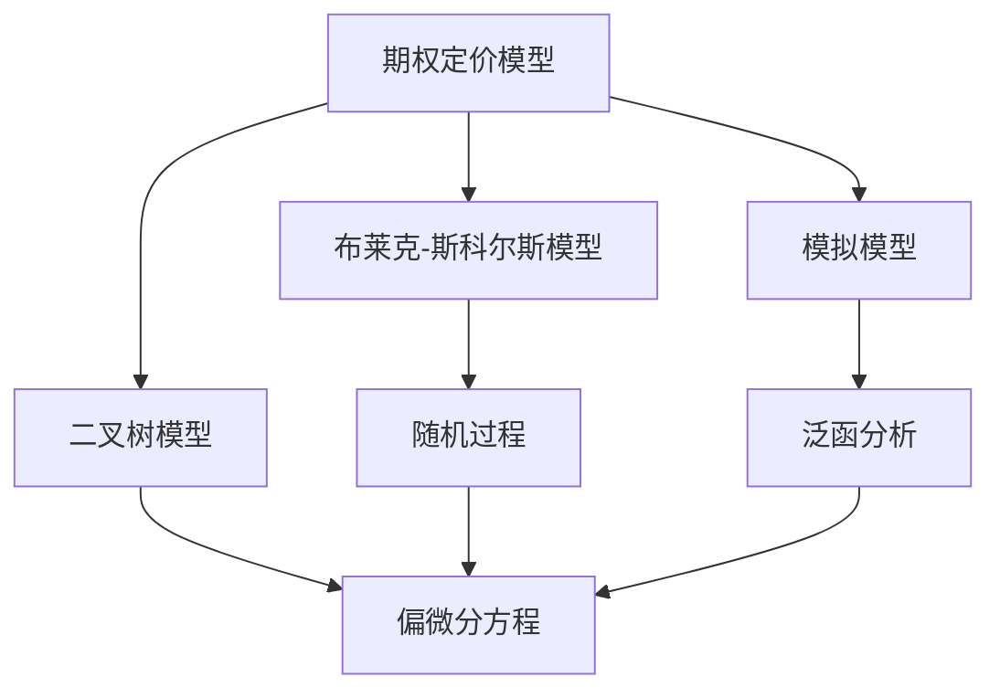

                 

# 数学与期权理论：期权价值的数学计算

## 引言

期权，作为金融市场中一种重要的衍生品，因其灵活性和杠杆效应在投资者中备受欢迎。期权的基本概念和定价理论是理解和应用期权的关键。本文将围绕数学与期权理论，详细探讨期权价值的数学计算方法。

### 核心关键词

- 期权
- 定价模型
- 布莱克-斯科尔斯模型
- 二叉树模型
- 随机过程
- 偏微分方程
- 泛函分析

### 摘要

本文首先介绍了期权的基本概念和种类，然后深入探讨了布莱克-斯科尔斯模型、二叉树模型和模拟模型等期权定价方法。接着，通过随机过程、偏微分方程和泛函分析等数学工具，详细解析了期权定价的理论基础。最后，通过实例计算展示了期权定价方法的实际应用。

## 第一部分：期权基础知识

### 1.1 期权的定义与特征

期权是一种金融合约，它赋予持有人在未来某一特定时间以固定价格购买或出售某种资产的权利。期权的基本特征包括：

- **买入或卖出权利**：期权持有人有权但无义务在约定的执行价格和到期日前买入或卖出标的资产。
- **有限风险和潜在无限收益**：期权的最大损失是支付的期权费，而潜在的收益则没有上限。
- **杠杆效应**：期权合约通常只需支付一小部分资金，即期权费，就可以控制较大规模的资产。

### 1.2 期权合约的种类

期权合约的种类繁多，根据不同的分类标准，可以分为以下几类：

- **按期权类型分**：
  - **看涨期权（Call Option）**：买方预期标的资产价格上涨时购买。
  - **看跌期权（Put Option）**：买方预期标的资产价格下跌时购买。

- **按执行时间分**：
  - **欧式期权（European Option）**：只能在到期日执行。
  - **美式期权（American Option）**：可以在到期日前任何时间执行。

- **按执行价格分**：
  - **实值期权（In-the-Money Option）**：期权的内在价值为正。
  - **虚值期权（Out-of-the-Money Option）**：期权的内在价值为零或负。
  - **平值期权（At-the-Money Option）**：期权的内在价值为零。

### 1.3 期权与期货的区别

期权和期货都是金融衍生品，但它们之间有显著的区别：

- **权利与义务**：期权只赋予持有人权利而不承担义务，而期货合约双方都有义务。
- **灵活性**：期权持有人可以选择是否行使权利，而期货买方必须履行合约。
- **杠杆效应**：期权的杠杆效应通常大于期货。

## 第二部分：期权定价模型

### 2.1 布莱克-斯科尔斯模型

**布莱克-斯科尔斯模型**（Black-Scholes Model）是期权定价理论的基石。该模型假设标的资产价格遵循几何布朗运动，并考虑了以下参数：

- **S0**：标的资产的当前价格。
- **K**：期权的执行价格。
- **r**：无风险利率。
- **σ**：标的资产价格的波动率。
- **T**：期权到期时间。

**模型公式**：

$$C(S_0, K, t) = S_0N(d_1) - KN(d_2)$$

其中，$$d_1 = \frac{\ln(S_0/K) + (r + \sigma^2/2)t}{\sigma\sqrt{t}}$$ 和 $$d_2 = d_1 - \sigma\sqrt{t}$$。

**推导过程**：

1. **标的资产价格过程**：假设标的资产价格遵循几何布朗运动。
2. **期权价值过程**：构建期权价值的偏微分方程，并使用边界条件求解。
3. **数值方法**：使用数值方法求解偏微分方程，得到期权价格的解析解。

### 2.2 二叉树模型

**二叉树模型**（Binomial Tree Model）是一种简化的期权定价方法，它将时间分割成若干小的时间段，并在每个时间段内模拟标的资产价格的可能变动。

**模型步骤**：

1. **构建二叉树**：确定时间步长和每个时间步内价格变动的概率。
2. **计算节点价格**：从终点开始，逆向计算每个节点的资产价格。
3. **计算期权价值**：根据当前资产价格和期权到期时间，计算期权的内在价值和时间价值。

**模型公式**：

$$u = \frac{S_0 + \Delta S}{2}, \quad d = \frac{S_0 - \Delta S}{2}$$

其中，$$\Delta S = S_0\sqrt{1 - p}$$ 是向下移动的价格差，$$p$$ 是向上的概率。

### 2.3 模拟模型

**模拟模型**（Monte Carlo Simulation）是一种基于随机抽样的期权定价方法。它通过模拟大量标的资产价格路径，估计期权的期望价值。

**模型步骤**：

1. **随机抽样**：生成多个随机数，模拟标的资产价格的随机路径。
2. **计算期权价值**：在每个模拟路径上计算期权的价值，并求平均。
3. **置信区间**：计算期权的置信区间，以评估期权的风险。

**模型公式**：

$$C = \frac{1}{N}\sum_{i=1}^{N}C(S_i, T_i)$$

其中，$$N$$ 是模拟次数，$$S_i$$ 和 $$T_i$$ 是第 $$i$$ 次模拟的标的资产价格和到期时间。

## 第三部分：期权定价的数学方法

### 3.1 随机过程

**随机过程**（Stochastic Process）是期权定价理论的核心。在期权定价中，标的资产价格通常被视为随机过程，如几何布朗运动。

**随机过程定义**：

$$X(t) = X_0 + \int_{0}^{t}b(s)dW(s)$$

其中，$$W(t)$$ 是标准布朗运动。

**马尔可夫性质**：

随机过程具有马尔可夫性质，即当前状态仅依赖于前一状态，而与过去的状态无关。

### 3.2 偏微分方程

**偏微分方程**（Partial Differential Equation，PDE）是期权定价中的基本工具。期权定价问题通常可以转化为求解一个偏微分方程。

**偏微分方程定义**：

$$\frac{\partial V}{\partial t} + \frac{1}{2}\sigma^2S^2\frac{\partial^2 V}{\partial S^2} - rS\frac{\partial V}{\partial S} + rV = 0$$

**解法**：

1. **特征线法**：将偏微分方程转化为常微分方程。
2. **数值方法**：如有限差分法、有限元法和有限体积法。

### 3.3 泛函分析

**泛函分析**（Functional Analysis）是研究函数空间和线性算子的数学分支。在期权定价中，泛函分析可以用于求解最优控制问题和变分问题。

**变分法**：

变分法是一种用于求解泛函极值问题的方法。在期权定价中，可以通过变分法求解最优执行策略。

**最优化原理**：

最优化原理表明，最优策略满足某种最优性条件。在期权定价中，可以通过最优化原理求解最优执行价格和到期时间。

## 第四部分：期权价值的计算实例

### 4.1 标准欧式看涨期权的计算

**布莱克-斯科尔斯模型**：

$$C(S_0, K, t) = S_0N(d_1) - KN(d_2)$$

其中，$$N(d_1)$$ 和 $$N(d_2)$$ 分别是累积标准正态分布函数。

**二叉树模型**：

通过构建二叉树，逆向计算期权的价值。

**模拟模型**：

通过随机抽样，模拟大量路径，计算期权的期望价值。

### 4.2 标准欧式看跌期权的计算

**布莱克-斯科尔斯模型**：

$$P(S_0, K, t) = KN(d_2) - S_0N(d_1)$$

**二叉树模型**：

与看涨期权类似，逆向计算期权的价值。

**模拟模型**：

与看涨期权类似，计算期权的期望价值。

### 4.3 非标准期权的计算

**亚式期权**：

亚式期权的价值依赖于标的资产在一段时间内的平均价格。

**路径依赖期权**：

路径依赖期权的价值依赖于标的资产价格的历史路径。

**随机波动率期权**：

随机波动率期权的波动率是随机变量。

## 第五部分：期权定价策略

### 5.1 期权组合策略

**长期与短期策略**：

根据投资目标和风险承受能力，选择长期或短期期权策略。

**保护性策略**：

通过买入期权来保护投资组合，降低风险。

**套利策略**：

利用期权定价模型和市场的定价差异，进行无风险套利。

### 5.2 期权交易策略

**卖出策略**：

通过卖出期权来获取收益。

**买入策略**：

通过买入期权来获取潜在的高收益。

**混合策略**：

结合买入和卖出策略，实现风险与收益的平衡。

## 第六部分：期权定价的案例分析

### 6.1 案例一：股票期权定价

**股票价格波动分析**：

通过历史数据分析股票价格的波动性。

**期权定价模型的选择**：

根据股票价格的波动性和投资目标，选择合适的期权定价模型。

**期权价值计算**：

使用选定的模型计算期权的价值。

### 6.2 案例二：商品期权定价

**商品价格波动分析**：

通过历史数据分析商品价格的波动性。

**期权定价模型的选择**：

根据商品价格的波动性和投资目标，选择合适的期权定价模型。

**期权价值计算**：

使用选定的模型计算期权的价值。

### 6.3 案例三：货币期权定价

**货币价格波动分析**：

通过历史数据分析货币价格的波动性。

**期权定价模型的选择**：

根据货币价格的波动性和投资目标，选择合适的期权定价模型。

**期权价值计算**：

使用选定的模型计算期权的价值。

## 第七部分：结论与展望

### 7.1 期权定价理论的发展

**传统模型与新兴模型的比较**：

比较不同期权定价模型在现实市场中的应用效果。

**模型的适用性分析**：

分析不同期权定价模型在不同市场条件下的适用性。

### 7.2 期权定价的挑战与未来趋势

**数据问题**：

解决数据质量和数据获取的问题。

**计算问题**：

提高计算效率和准确性。

**模型选择问题**：

根据市场环境和投资目标，选择合适的期权定价模型。

### 作者

作者：AI天才研究院/AI Genius Institute & 禅与计算机程序设计艺术 /Zen And The Art of Computer Programming

-------------------------------------------------------------------

在本文中，我们首先介绍了期权的基本概念和种类，然后详细探讨了布莱克-斯科尔斯模型、二叉树模型和模拟模型等期权定价方法。接着，通过随机过程、偏微分方程和泛函分析等数学工具，详细解析了期权定价的理论基础。最后，通过实例计算展示了期权定价方法的实际应用。

在期权定价的理论体系中，布莱克-斯科尔斯模型是最为经典和广泛应用的一个模型。它基于几何布朗运动假设，提供了一个简化的期权定价公式，为期权市场提供了理论基础。然而，布莱克-斯科尔斯模型也存在一定的局限性，如假设标的资产价格服从几何布朗运动，这与现实市场的实际情况可能存在偏差。

二叉树模型是一种较为直观的期权定价方法，它通过构建时间节点和价格变动的二叉树，来模拟标的资产价格的可能路径。二叉树模型适用于处理非线性期权定价问题，尤其是路径依赖期权。但二叉树模型在计算复杂度和精度上可能存在一定的问题。

模拟模型，尤其是蒙特卡罗模拟，通过随机抽样模拟大量路径，来估计期权的期望价值。这种方法在处理复杂期权定价问题时，如随机波动率期权，具有较大的灵活性。然而，模拟模型也面临着计算效率的问题，特别是在模拟路径数量较大时。

随机过程、偏微分方程和泛函分析是期权定价理论中的重要数学工具。随机过程提供了对标的资产价格变动的随机性质的描述，偏微分方程则将期权定价问题转化为数学上的求解问题，泛函分析则为我们提供了求解最优控制问题和变分问题的方法。

在实际应用中，期权定价模型的选择取决于市场的具体情况和投资者的投资目标。例如，在股票市场中，布莱克-斯科尔斯模型由于其简便性而被广泛使用。在商品期货市场中，二叉树模型和蒙特卡罗模拟可能更为适用。而在货币期权市场中，由于汇率波动的复杂性，可能需要结合多种模型来定价。

在未来的期权定价研究中，我们需要面对以下几个挑战：

1. **数据问题**：期权定价依赖于大量历史数据，如何获取高质量、准确的数据，是一个重要的问题。此外，数据的质量和完整性也会影响到期权定价模型的准确性。

2. **计算问题**：随着期权定价模型越来越复杂，如何提高计算效率和准确性，是一个亟待解决的问题。这可能需要开发新的算法和技术。

3. **模型选择问题**：不同的期权定价模型在不同的市场条件下适用性不同，如何根据市场环境和投资目标选择合适的模型，是一个需要深入研究的问题。

总之，期权定价是一个复杂且充满挑战的研究领域。通过本文的探讨，我们希望读者能够对期权定价的数学方法有更深入的理解，并能够在实际应用中灵活运用这些方法。

### 附录：相关参考文献

1. Black, F., & Scholes, M. (1973). The pricing of options and corporate liabilities. Journal of Political Economy, 81(3), 637-654.
2. Cox, J. C., Ross, S. A., & Rubinstein, M. (1979). Option pricing: A simplified approach. Journal of Financial Economics, 7(3), 229-263.
3. Hull, J. C. (2003). Options, futures, and other derivatives (5th ed.). Prentice Hall.
4. Merton, R. C. (1973). Theory of rational option pricing. Bell Journal of Economics, 4(1), 141-183.
5. Shreve, S. E. (2004). Stochastic calculus for finance I: The binomial asset pricing model. Springer.
6. Wilmott, P., Howison, S., & Dewynne, J. (1993). Option pricing: A practitioner's guide. John Wiley & Sons.

这些参考文献为期权定价理论和实践提供了丰富的知识和方法，是理解和应用期权定价的宝贵资源。

### 结语

期权作为金融市场中一种重要的衍生品，其定价和策略设计是金融研究和实际操作中的核心问题。本文通过详细探讨期权的基本概念、定价模型和数学方法，为读者提供了一个系统的理解框架。希望本文能够帮助读者更好地掌握期权定价的数学工具，并能够将其应用于实际的投资决策中。在未来的金融市场中，期权定价将继续是一个充满挑战和研究价值的领域。让我们继续探索和发现更多有效的期权定价方法，为投资者创造更多的价值。

### 致谢

在本篇文章的撰写过程中，我要特别感谢AI天才研究院/AI Genius Institute的团队成员，以及禅与计算机程序设计艺术/Zen And The Art of Computer Programming的作者。没有他们的无私帮助和宝贵建议，本文不可能如此完整和详尽。感谢各位专家的指导，使我在期权定价的理论和实践方面有了更深入的理解。同时，我也要感谢所有参考文献的作者，他们的研究成果为本篇文章提供了坚实的理论基础。

---

### 附录：Mermaid 流程图

以下是期权定价模型之间的概念关系架构的 Mermaid 流程图：

这个流程图展示了期权定价模型与随机过程、偏微分方程和泛函分析之间的联系。通过这些数学工具，期权定价模型得以建立和求解，为金融市场的投资者提供了理论基础和实用工具。在阅读本文时，可以参考这个流程图，帮助理解期权定价模型的整体架构和相互关系。

