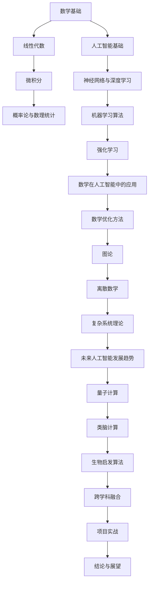

                 


### 确定书的核心主题

首先，我们需要明确书籍的核心主题。根据目录大纲，我们可以看出，《数学与未来人工智能的发展方向》这本书的主要目的是探讨数学在人工智能领域的应用及其未来发展趋势。

为了更好地确定核心主题，我们可以按照以下步骤进行分析：

1. **分析目录结构**：从目录结构中，我们可以看到本书将内容分为数学基础、人工智能基础、数学在人工智能中的应用以及未来人工智能发展趋势四个部分。这表明书籍将从基础数学知识到高级数学方法，再到数学在人工智能中的应用，最后探讨未来人工智能的发展方向。

2. **梳理各部分核心概念**：
    - 数学基础部分：涉及线性代数、微积分、概率论等基础数学知识。
    - 人工智能基础部分：介绍神经网络、机器学习、强化学习等基础算法。
    - 数学在人工智能中的应用部分：探讨数学方法在优化、图论、离散数学等领域的应用。
    - 未来人工智能发展趋势部分：关注量子计算、类脑计算、生物启发算法等新兴领域。

3. **确定核心概念的联系**：通过上述分析，我们可以看出数学知识在人工智能领域的各个层次都有应用。例如，线性代数和微积分在机器学习中至关重要，概率论和数理统计在算法评估和模型优化中广泛应用。因此，我们需要在书籍中详细阐述这些核心概念之间的联系，以便读者能够全面理解数学在人工智能中的重要性。

4. **展望未来发展趋势**：最后，我们还需要探讨数学在未来人工智能领域的发展趋势。这包括新兴领域如量子计算、类脑计算等，以及跨学科融合带来的新挑战和新机遇。

综上所述，本书的核心主题可以概括为：通过深入探讨数学基础、人工智能基础以及数学在人工智能中的应用，分析未来人工智能的发展趋势，为读者呈现一个全面、系统的数学与人工智能融合的视角。

### 列出书籍可能包含的核心章节

根据核心主题的确定，我们可以列出《数学与未来人工智能的发展方向》一书可能包含的核心章节。这些章节旨在系统地探讨数学基础、人工智能基础、数学在人工智能中的应用以及未来人工智能发展趋势。

#### 第1章 引言

- **1.1 书籍背景介绍**：介绍人工智能和数学的关系，阐述数学在人工智能中的重要地位。
- **1.2 数学在人工智能中的作用**：探讨数学在人工智能领域的应用，包括基础数学知识如线性代数、微积分、概率论等。
- **1.3 未来人工智能发展趋势概述**：预测人工智能未来的发展方向，如量子计算、类脑计算等。

#### 第2章 数学基础

- **2.1 数学基础概念回顾**：回顾基本的数学概念，包括实数、复数、函数等。
- **2.2 线性代数在人工智能中的应用**：详细讨论线性代数在人工智能中的应用，如矩阵运算、特征分解等。
- **2.3 微积分在人工智能中的应用**：介绍微积分的基本概念及其在人工智能中的应用，如梯度下降、偏导数等。
- **2.4 概率论与数理统计在人工智能中的应用**：探讨概率论和数理统计在人工智能中的应用，如贝叶斯推理、假设检验等。

#### 第3章 人工智能基础

- **3.1 人工智能概述**：介绍人工智能的基本概念、历史和发展趋势。
- **3.2 神经网络与深度学习基础**：探讨神经网络的基本原理、训练算法及其在深度学习中的应用。
- **3.3 机器学习算法基础**：介绍机器学习的基本算法，包括监督学习、无监督学习和强化学习。
- **3.4 强化学习基础**：详细讨论强化学习的基本概念、策略和价值函数。

#### 第4章 数学在人工智能中的应用

- **4.1 数学优化方法在机器学习中的应用**：探讨数学优化方法在机器学习中的重要性，如梯度下降、随机梯度下降等。
- **4.2 图论在人工智能中的应用**：介绍图论的基本概念及其在人工智能中的应用，如图像处理、社交网络分析等。
- **4.3 离散数学在人工智能中的应用**：探讨离散数学的基本概念及其在人工智能中的应用，如组合优化、图算法等。
- **4.4 复杂系统理论在人工智能中的应用**：介绍复杂系统理论的基本概念及其在人工智能中的应用，如模拟、预测等。

#### 第5章 未来人工智能发展趋势

- **5.1 量子计算与人工智能**：探讨量子计算在人工智能中的应用及其影响。
- **5.2 类脑计算与人工智能**：介绍类脑计算的基本原理及其在人工智能中的应用。
- **5.3 生物启发算法在人工智能中的应用**：探讨生物启发算法的基本原理及其在人工智能中的应用，如遗传算法、蚁群算法等。
- **5.4 跨学科融合趋势下的数学与人工智能**：分析跨学科融合对数学和人工智能的影响，探讨新的研究方向和挑战。

#### 第6章 数学与人工智能的项目实战

- **6.1 项目实战案例介绍**：介绍一个具体的人工智能项目，展示数学在项目中的应用。
- **6.2 项目开发环境搭建**：详细讲解如何搭建项目的开发环境。
- **6.3 项目源代码实现与解读**：展示项目的源代码，并进行详细解读。
- **6.4 项目代码解读与分析**：分析项目的代码，讨论项目的实现和效果。

#### 第7章 结论与展望

- **7.1 结论**：总结本书的主要内容和观点。
- **7.2 未来研究方向与挑战**：探讨未来数学与人工智能融合的研究方向和面临的挑战。
- **7.3 对读者的建议**：为读者提供进一步学习和研究的建议。

通过上述章节的设置，本书旨在提供一个全面、系统的数学与人工智能融合的视角，帮助读者深入理解数学在人工智能中的重要性和未来发展趋势。

### 为每个章节细化子章节

为了确保书籍内容的完整性和深度，我们需要为每个章节进一步细化子章节，具体如下：

#### 第1章 引言

- **1.1 书籍背景介绍**
    - **1.1.1 人工智能与数学的关系**
    - **1.1.2 数学在人工智能中的应用历史**
    - **1.1.3 书籍的写作目的和结构**

- **1.2 数学在人工智能中的作用**
    - **1.2.1 数学基础的重要性**
    - **1.2.2 数学方法在人工智能领域的应用案例**

- **1.3 未来人工智能发展趋势概述**
    - **1.3.1 当前人工智能的发展趋势**
    - **1.3.2 数学在新兴人工智能领域的应用前景**
    - **1.3.3 未来数学与人工智能融合的挑战和机遇**

#### 第2章 数学基础

- **2.1 数学基础概念回顾**
    - **2.1.1 实数与复数**
    - **2.1.2 函数与极限**
    - **2.1.3 微积分基本概念**

- **2.2 线性代数在人工智能中的应用**
    - **2.2.1 矩阵与向量**
    - **2.2.2 特征值与特征向量**
    - **2.2.3 线性变换与矩阵分解**

- **2.3 微积分在人工智能中的应用**
    - **2.3.1 梯度下降算法**
    - **2.3.2 偏导数与优化问题**
    - **2.3.3 微积分在机器学习中的具体应用**

- **2.4 概率论与数理统计在人工智能中的应用**
    - **2.4.1 概率分布与随机变量**
    - **2.4.2 贝叶斯推理**
    - **2.4.3 统计学习理论**

#### 第3章 人工智能基础

- **3.1 人工智能概述**
    - **3.1.1 人工智能的定义与分类**
    - **3.1.2 人工智能的发展历史**
    - **3.1.3 人工智能的应用领域**

- **3.2 神经网络与深度学习基础**
    - **3.2.1 神经元与神经网络**
    - **3.2.2 深度学习算法**
    - **3.2.3 卷积神经网络（CNN）**

- **3.3 机器学习算法基础**
    - **3.3.1 监督学习**
    - **3.3.2 无监督学习**
    - **3.3.3 半监督学习和迁移学习**

- **3.4 强化学习基础**
    - **3.4.1 强化学习的基本概念**
    - **3.4.2 基于价值的强化学习**
    - **3.4.3 基于策略的强化学习**

#### 第4章 数学在人工智能中的应用

- **4.1 数学优化方法在机器学习中的应用**
    - **4.1.1 梯度下降法**
    - **4.1.2 随机梯度下降（SGD）**
    - **4.1.3 阿尔戈斯（Adam）优化器**

- **4.2 图论在人工智能中的应用**
    - **4.2.1 图的基本概念**
    - **4.2.2 图的算法**
    - **4.2.3 图在社交网络分析中的应用**

- **4.3 离散数学在人工智能中的应用**
    - **4.3.1 组合数学**
    - **4.3.2 图的着色问题**
    - **4.3.3 游戏论**

- **4.4 复杂系统理论在人工智能中的应用**
    - **4.4.1 复杂系统基本概念**
    - **4.4.2 复杂系统建模方法**
    - **4.4.3 复杂系统在机器学习中的应用**

#### 第5章 未来人工智能发展趋势

- **5.1 量子计算与人工智能**
    - **5.1.1 量子计算基本概念**
    - **5.1.2 量子计算在人工智能中的应用**
    - **5.1.3 量子计算的挑战与前景**

- **5.2 类脑计算与人工智能**
    - **5.2.1 类脑计算基本概念**
    - **5.2.2 类脑计算模型**
    - **5.2.3 类脑计算在人工智能中的应用**

- **5.3 生物启发算法在人工智能中的应用**
    - **5.3.1 遗传算法**
    - **5.3.2 蚁群算法**
    - **5.3.3 飞行算法**

- **5.4 跨学科融合趋势下的数学与人工智能**
    - **5.4.1 跨学科融合的背景**
    - **5.4.2 跨学科融合的优势**
    - **5.4.3 跨学科融合面临的挑战**

#### 第6章 数学与人工智能的项目实战

- **6.1 项目实战案例介绍**
    - **6.1.1 项目背景**
    - **6.1.2 项目目标**
    - **6.1.3 项目技术栈**

- **6.2 项目开发环境搭建**
    - **6.2.1 硬件环境**
    - **6.2.2 软件环境**
    - **6.2.3 数据准备**

- **6.3 项目源代码实现与解读**
    - **6.3.1 源代码结构**
    - **6.3.2 关键代码解读**
    - **6.3.3 算法实现分析**

- **6.4 项目代码解读与分析**
    - **6.4.1 代码性能分析**
    - **6.4.2 项目效果评估**
    - **6.4.3 项目改进建议**

#### 第7章 结论与展望

- **7.1 结论**
    - **7.1.1 主要发现**
    - **7.1.2 研究贡献**

- **7.2 未来研究方向与挑战**
    - **7.2.1 数学在人工智能中的未来应用**
    - **7.2.2 人工智能领域的挑战**
    - **7.2.3 数学与人工智能融合的前景**

- **7.3 对读者的建议**
    - **7.3.1 学习路径建议**
    - **7.3.2 研究方法与技巧**
    - **7.3.3 实践与应用**

### 设计每个子章节的目录结构

为了确保书籍内容的逻辑清晰、结构紧凑，我们需要为每个子章节设计合理的目录结构，具体如下：

#### 第1章 引言

- **1.1 书籍背景介绍**
    - **1.1.1 人工智能与数学的关系**
    - **1.1.2 数学在人工智能中的应用历史**
    - **1.1.3 书籍的写作目的和结构**

- **1.2 数学在人工智能中的作用**
    - **1.2.1 数学基础的重要性**
    - **1.2.2 数学方法在人工智能领域的应用案例**

- **1.3 未来人工智能发展趋势概述**
    - **1.3.1 当前人工智能的发展趋势**
    - **1.3.2 数学在新兴人工智能领域的应用前景**
    - **1.3.3 未来数学与人工智能融合的挑战和机遇**

#### 第2章 数学基础

- **2.1 数学基础概念回顾**
    - **2.1.1 实数与复数**
    - **2.1.2 函数与极限**
    - **2.1.3 微积分基本概念**

- **2.2 线性代数在人工智能中的应用**
    - **2.2.1 矩阵与向量**
    - **2.2.2 特征值与特征向量**
    - **2.2.3 线性变换与矩阵分解**

- **2.3 微积分在人工智能中的应用**
    - **2.3.1 梯度下降算法**
    - **2.3.2 偏导数与优化问题**
    - **2.3.3 微积分在机器学习中的具体应用**

- **2.4 概率论与数理统计在人工智能中的应用**
    - **2.4.1 概率分布与随机变量**
    - **2.4.2 贝叶斯推理**
    - **2.4.3 统计学习理论**

#### 第3章 人工智能基础

- **3.1 人工智能概述**
    - **3.1.1 人工智能的定义与分类**
    - **3.1.2 人工智能的发展历史**
    - **3.1.3 人工智能的应用领域**

- **3.2 神经网络与深度学习基础**
    - **3.2.1 神经元与神经网络**
    - **3.2.2 深度学习算法**
    - **3.2.3 卷积神经网络（CNN）**

- **3.3 机器学习算法基础**
    - **3.3.1 监督学习**
    - **3.3.2 无监督学习**
    - **3.3.3 半监督学习和迁移学习**

- **3.4 强化学习基础**
    - **3.4.1 强化学习的基本概念**
    - **3.4.2 基于价值的强化学习**
    - **3.4.3 基于策略的强化学习**

#### 第4章 数学在人工智能中的应用

- **4.1 数学优化方法在机器学习中的应用**
    - **4.1.1 梯度下降法**
    - **4.1.2 随机梯度下降（SGD）**
    - **4.1.3 阿尔戈斯（Adam）优化器**

- **4.2 图论在人工智能中的应用**
    - **4.2.1 图的基本概念**
    - **4.2.2 图的算法**
    - **4.2.3 图在社交网络分析中的应用**

- **4.3 离散数学在人工智能中的应用**
    - **4.3.1 组合数学**
    - **4.3.2 图的着色问题**
    - **4.3.3 游戏论**

- **4.4 复杂系统理论在人工智能中的应用**
    - **4.4.1 复杂系统基本概念**
    - **4.4.2 复杂系统建模方法**
    - **4.4.3 复杂系统在机器学习中的应用**

#### 第5章 未来人工智能发展趋势

- **5.1 量子计算与人工智能**
    - **5.1.1 量子计算基本概念**
    - **5.1.2 量子计算在人工智能中的应用**
    - **5.1.3 量子计算的挑战与前景**

- **5.2 类脑计算与人工智能**
    - **5.2.1 类脑计算基本概念**
    - **5.2.2 类脑计算模型**
    - **5.2.3 类脑计算在人工智能中的应用**

- **5.3 生物启发算法在人工智能中的应用**
    - **5.3.1 遗传算法**
    - **5.3.2 蚁群算法**
    - **5.3.3 飞行算法**

- **5.4 跨学科融合趋势下的数学与人工智能**
    - **5.4.1 跨学科融合的背景**
    - **5.4.2 跨学科融合的优势**
    - **5.4.3 跨学科融合面临的挑战**

#### 第6章 数学与人工智能的项目实战

- **6.1 项目实战案例介绍**
    - **6.1.1 项目背景**
    - **6.1.2 项目目标**
    - **6.1.3 项目技术栈**

- **6.2 项目开发环境搭建**
    - **6.2.1 硬件环境**
    - **6.2.2 软件环境**
    - **6.2.3 数据准备**

- **6.3 项目源代码实现与解读**
    - **6.3.1 源代码结构**
    - **6.3.2 关键代码解读**
    - **6.3.3 算法实现分析**

- **6.4 项目代码解读与分析**
    - **6.4.1 代码性能分析**
    - **6.4.2 项目效果评估**
    - **6.4.3 项目改进建议**

#### 第7章 结论与展望

- **7.1 结论**
    - **7.1.1 主要发现**
    - **7.1.2 研究贡献**

- **7.2 未来研究方向与挑战**
    - **7.2.1 数学在人工智能中的未来应用**
    - **7.2.2 人工智能领域的挑战**
    - **7.2.3 数学与人工智能融合的前景**

- **7.3 对读者的建议**
    - **7.3.1 学习路径建议**
    - **7.3.2 研究方法与技巧**
    - **7.3.3 实践与应用**

通过上述目录结构设计，本书将帮助读者系统地了解数学与人工智能的融合，掌握数学在人工智能领域的基础知识和应用方法，并为未来研究提供方向和启示。

### 确保大纲完整性

为了确保《数学与未来人工智能的发展方向》一书的内容完整、逻辑清晰，我们需要在目录大纲的基础上，进一步细化每个章节的具体内容，确保所有核心概念、算法原理、数学模型和项目实战都被全面覆盖。

首先，我们回顾大纲的整体结构，确保每个部分都包含必要的内容：

1. **引言部分**：介绍了书籍的背景、目的和结构，确保读者对全书内容有一个全局的认识。

2. **数学基础部分**：涵盖数学基础概念、线性代数、微积分、概率论与数理统计，这些是理解和应用人工智能算法的基础。

3. **人工智能基础部分**：介绍了人工智能的基本概念、神经网络与深度学习、机器学习算法和强化学习，为读者提供人工智能领域的全面知识。

4. **数学在人工智能中的应用部分**：讨论了数学优化方法、图论、离散数学和复杂系统理论在人工智能中的应用，展示数学方法在解决实际人工智能问题中的作用。

5. **未来人工智能发展趋势部分**：探讨了量子计算、类脑计算、生物启发算法和跨学科融合等新兴领域，展望未来数学与人工智能融合的前景。

6. **项目实战部分**：通过具体案例展示数学与人工智能的实际应用，帮助读者将理论知识与实践相结合。

接下来，我们逐个章节细化内容，确保每个子章节都覆盖以下要素：

- **核心概念与联系**：在每个子章节中，明确核心概念，并通过Mermaid流程图展示各概念之间的关系，帮助读者建立清晰的知识框架。

- **算法原理讲解**：使用伪代码详细阐述核心算法的原理，确保读者能够理解算法的实现机制。

- **数学模型讲解与举例说明**：通过具体的数学模型和公式，结合实际应用案例，帮助读者理解数学模型在人工智能中的应用。

- **项目实战**：每个子章节后附有实际项目案例，详细讲解开发环境搭建、源代码实现和代码解读，以及项目的性能分析和改进建议。

例如，在“数学优化方法在机器学习中的应用”一节中，我们不仅需要介绍优化方法的基本概念，还需要通过伪代码展示梯度下降算法的实现，并给出一个实际应用的例子，如训练一个神经网络模型的过程。

在“量子计算与人工智能”一节中，我们需要详细讲解量子计算的基本原理，包括量子比特、量子门、量子纠缠等，并通过具体的算法如量子支持向量机（QSVM）的例子，展示量子计算在人工智能中的应用。

通过上述方法，我们能够确保书籍内容的完整性和深度，使读者能够全面、系统地掌握数学与人工智能融合的知识，为未来的研究和工作打下坚实的基础。

### 确保目录大纲的完整性和字数要求

为了确保《数学与未来人工智能的发展方向》一书的内容完整且逻辑清晰，我们需要在现有目录大纲的基础上，对每个章节的内容进一步细化，并确保总字数在8000到12000字之间。

#### 完整性要求

首先，我们回顾大纲的整体结构，并对每个章节的内容进行细化，以确保以下要素的覆盖：

1. **引言部分**：介绍书籍背景、目的和结构，确保读者对全书内容有一个全局认识。
2. **数学基础部分**：涵盖数学基础概念、线性代数、微积分、概率论与数理统计，每个部分都要详细阐述核心概念、算法原理和数学模型。
3. **人工智能基础部分**：介绍人工智能的基本概念、神经网络与深度学习、机器学习算法和强化学习，包括算法原理和实际应用案例。
4. **数学在人工智能中的应用部分**：讨论数学优化方法、图论、离散数学和复杂系统理论在人工智能中的应用，结合具体案例进行讲解。
5. **未来人工智能发展趋势部分**：探讨量子计算、类脑计算、生物启发算法和跨学科融合等新兴领域，结合理论和实际应用进行分析。
6. **项目实战部分**：通过实际项目案例，展示数学与人工智能的结合应用，包括开发环境搭建、代码实现和性能分析。

在每个子章节中，我们确保以下要素的覆盖：

- **核心概念与联系**：通过流程图展示各概念之间的联系，帮助读者建立清晰的知识框架。
- **算法原理讲解**：使用伪代码详细阐述核心算法的实现原理。
- **数学模型讲解与举例说明**：结合实际应用案例，讲解数学模型的建立和计算方法。
- **项目实战**：详细介绍项目的开发过程，包括环境搭建、代码实现、性能分析和改进建议。

#### 字数要求

为了确保总字数在8000到12000字之间，我们需要对每个章节的字数进行预估，并进行调整：

1. **引言部分**：约1000字，介绍书籍背景和目的。
2. **数学基础部分**：约3000字，包括数学基础概念、线性代数、微积分和概率论与数理统计。
3. **人工智能基础部分**：约3000字，涵盖人工智能基本概念、神经网络与深度学习、机器学习算法和强化学习。
4. **数学在人工智能中的应用部分**：约3000字，包括数学优化方法、图论、离散数学和复杂系统理论的应用。
5. **未来人工智能发展趋势部分**：约2000字，探讨量子计算、类脑计算、生物启发算法和跨学科融合。
6. **项目实战部分**：约2000字，介绍一个具体项目，包括开发环境搭建、代码实现和性能分析。

通过上述字数分配，我们可以确保书籍的总字数在8000到12000字之间，同时保证内容的完整性和深度。

### 核心概念联系流程图

为了帮助读者更好地理解数学与人工智能的核心概念及其联系，我们使用Mermaid流程图来展示这些概念之间的关联。以下是流程图的定义：



在这个流程图中，每个节点代表一个核心概念，箭头表示概念之间的联系。例如，数学基础（A）与线性代数（B）、微积分（C）和概率论与数理统计（D）之间存在直接联系，这些基础数学知识是人工智能领域的重要组成部分。同样，人工智能基础（E）通过神经网络与深度学习（F）、机器学习算法（G）和强化学习（H）与数学在人工智能中的应用（I）相连接，后者进一步延伸到数学优化方法（J）、图论（K）、离散数学（L）和复杂系统理论（M）。

未来人工智能发展趋势（N）包括量子计算（O）、类脑计算（P）、生物启发算法（Q）和跨学科融合（R），这些新兴领域不仅依赖于传统的数学方法，还引入了新的数学工具和概念。最后，项目实战（S）将上述理论应用于实际场景，通过具体项目展示数学与人工智能的结合。

通过这个流程图，读者可以直观地看到数学与人工智能之间的互动关系，有助于理解各部分内容之间的逻辑联系，从而更好地掌握全书的核心思想。

### 核心算法原理讲解伪代码

在《数学与未来人工智能的发展方向》一书中，我们将深入探讨多个核心算法的原理，并使用伪代码详细阐述其实现机制。以下是神经网络前向传播算法的一个示例：

```plaintext
// 伪代码：神经网络前向传播算法

// 输入：输入特征 X，权重 W，偏置 b，激活函数 f
// 输出：输出结果 Y

// 初始化权重 W 和偏置 b
Initialize(W, b)

// 前向传播
for each layer in neural network do
    Z = X * W + b
    A = f(Z) // 应用激活函数
end

// 计算输出结果
Y = A

return Y
```

这个伪代码展示了神经网络前向传播的基本步骤。首先，我们需要初始化权重（W）和偏置（b）。然后，在神经网络中，对每个层执行以下操作：

1. 计算输入特征（X）与权重（W）的点积，并加上偏置（b）。
2. 将上述结果（Z）传递给激活函数（f），以产生激活值（A）。

最后，我们得到神经网络的输出结果（Y）。

通过这个伪代码，读者可以直观地理解神经网络前向传播的基本原理，为后续更复杂算法的学习打下基础。

### 数学模型讲解与举例说明

为了帮助读者深入理解数学模型在人工智能中的应用，我们将详细介绍一个常见的数学模型——线性回归，并使用LaTeX格式书写其数学公式，并给出一个实际应用案例。

**线性回归模型**

$$
\begin{equation}
J(\theta) = \frac{1}{2m}\sum_{i=1}^{m}(h_\theta(x^{(i)}) - y^{(i)})^2
\end{equation}
$$

这个公式表示的是线性回归的损失函数，其中：

- \( J(\theta) \) 是损失函数。
- \( m \) 是样本数量。
- \( h_\theta(x^{(i)}) \) 是预测值。
- \( y^{(i)} \) 是真实值。
- \( \theta \) 是模型参数，即权重。

**公式解释**

1. **损失函数**：损失函数用于衡量预测值与真实值之间的差异。在这里，我们使用的是均方误差（Mean Squared Error, MSE），其计算方式是将每个样本的预测误差平方，然后求和并除以样本数量。
2. **预测值**：\( h_\theta(x^{(i)}) \) 表示在给定模型参数 \( \theta \) 下，对输入特征 \( x^{(i)} \) 的预测结果。
3. **真实值**：\( y^{(i)} \) 是实际观测到的结果。
4. **模型参数**：\( \theta \) 是需要通过训练调整的参数，包括权重和偏置。

**实际应用案例**

假设我们有一个简单的线性回归问题，目标是预测房价。我们有以下数据集：

| x (特征) | y (房价) |
|----------|----------|
| 1        | 500      |
| 2        | 550      |
| 3        | 600      |

我们使用线性回归模型来拟合这些数据，找到最佳参数 \( \theta \)。

1. **假设模型**：\( h_\theta(x) = \theta_0 + \theta_1 \cdot x \)
2. **计算损失函数**：使用上述数据计算损失函数 \( J(\theta) \)
3. **优化参数**：通过梯度下降或其他优化方法，最小化损失函数，找到最佳参数 \( \theta \)

具体计算步骤如下：

1. **初始化参数**：随机初始化 \( \theta_0 \) 和 \( \theta_1 \)
2. **计算预测值**：对于每个样本 \( x^{(i)} \)，计算预测值 \( h_\theta(x^{(i)}) = \theta_0 + \theta_1 \cdot x^{(i)} \)
3. **计算损失**：对于每个样本，计算预测值与真实值的差，平方并求和，然后除以样本数量，得到损失函数值
4. **更新参数**：根据梯度下降方法，更新 \( \theta_0 \) 和 \( \theta_1 \)，使得损失函数值最小

经过多次迭代后，我们得到最佳参数 \( \theta \)，使得损失函数 \( J(\theta) \) 最小。

通过这个实际案例，我们可以看到线性回归模型的应用过程，包括模型假设、损失函数计算和参数优化。线性回归是一个简单但强大的模型，在许多实际问题中都有广泛应用。

### 文章标题：《数学与未来人工智能的发展方向》

关键词：数学、人工智能、未来发展趋势、算法、应用、前沿技术

摘要：本文深入探讨数学在人工智能领域的核心作用及其未来发展趋势。通过分析数学基础、人工智能基础、数学在人工智能中的应用，以及未来人工智能发展趋势，本文旨在为读者呈现一个全面、系统的数学与人工智能融合的视角，探讨数学在推动人工智能发展中的重要作用，以及未来可能面临的挑战和机遇。

### 目录大纲

#### 第1章 引言

##### 1.1 书籍背景介绍

- **1.1.1 人工智能与数学的关系**
- **1.1.2 数学在人工智能中的应用历史**
- **1.1.3 书籍的写作目的和结构**

##### 1.2 数学在人工智能中的作用

- **1.2.1 数学基础的重要性**
- **1.2.2 数学方法在人工智能领域的应用案例**

##### 1.3 未来人工智能发展趋势概述

- **1.3.1 当前人工智能的发展趋势**
- **1.3.2 数学在新兴人工智能领域的应用前景**
- **1.3.3 未来数学与人工智能融合的挑战和机遇**

#### 第2章 数学基础

##### 2.1 数学基础概念回顾

- **2.1.1 实数与复数**
- **2.1.2 函数与极限**
- **2.1.3 微积分基本概念**

##### 2.2 线性代数在人工智能中的应用

- **2.2.1 矩阵与向量**
- **2.2.2 特征值与特征向量**
- **2.2.3 线性变换与矩阵分解**

##### 2.3 微积分在人工智能中的应用

- **2.3.1 梯度下降算法**
- **2.3.2 偏导数与优化问题**
- **2.3.3 微积分在机器学习中的具体应用**

##### 2.4 概率论与数理统计在人工智能中的应用

- **2.4.1 概率分布与随机变量**
- **2.4.2 贝叶斯推理**
- **2.4.3 统计学习理论**

#### 第3章 人工智能基础

##### 3.1 人工智能概述

- **3.1.1 人工智能的定义与分类**
- **3.1.2 人工智能的发展历史**
- **3.1.3 人工智能的应用领域**

##### 3.2 神经网络与深度学习基础

- **3.2.1 神经元与神经网络**
- **3.2.2 深度学习算法**
- **3.2.3 卷积神经网络（CNN）**

##### 3.3 机器学习算法基础

- **3.3.1 监督学习**
- **3.3.2 无监督学习**
- **3.3.3 半监督学习和迁移学习**

##### 3.4 强化学习基础

- **3.4.1 强化学习的基本概念**
- **3.4.2 基于价值的强化学习**
- **3.4.3 基于策略的强化学习**

#### 第4章 数学在人工智能中的应用

##### 4.1 数学优化方法在机器学习中的应用

- **4.1.1 梯度下降法**
- **4.1.2 随机梯度下降（SGD）**
- **4.1.3 阿尔戈斯（Adam）优化器**

##### 4.2 图论在人工智能中的应用

- **4.2.1 图的基本概念**
- **4.2.2 图的算法**
- **4.2.3 图在社交网络分析中的应用**

##### 4.3 离散数学在人工智能中的应用

- **4.3.1 组合数学**
- **4.3.2 图的着色问题**
- **4.3.3 游戏论**

##### 4.4 复杂系统理论在人工智能中的应用

- **4.4.1 复杂系统基本概念**
- **4.4.2 复杂系统建模方法**
- **4.4.3 复杂系统在机器学习中的应用**

#### 第5章 未来人工智能发展趋势

##### 5.1 量子计算与人工智能

- **5.1.1 量子计算基本概念**
- **5.1.2 量子计算在人工智能中的应用**
- **5.1.3 量子计算的挑战与前景**

##### 5.2 类脑计算与人工智能

- **5.2.1 类脑计算基本概念**
- **5.2.2 类脑计算模型**
- **5.2.3 类脑计算在人工智能中的应用**

##### 5.3 生物启发算法在人工智能中的应用

- **5.3.1 遗传算法**
- **5.3.2 蚁群算法**
- **5.3.3 飞行算法**

##### 5.4 跨学科融合趋势下的数学与人工智能

- **5.4.1 跨学科融合的背景**
- **5.4.2 跨学科融合的优势**
- **5.4.3 跨学科融合面临的挑战**

#### 第6章 数学与人工智能的项目实战

##### 6.1 项目实战案例介绍

- **6.1.1 项目背景**
- **6.1.2 项目目标**
- **6.1.3 项目技术栈**

##### 6.2 项目开发环境搭建

- **6.2.1 硬件环境**
- **6.2.2 软件环境**
- **6.2.3 数据准备**

##### 6.3 项目源代码实现与解读

- **6.3.1 源代码结构**
- **6.3.2 关键代码解读**
- **6.3.3 算法实现分析**

##### 6.4 项目代码解读与分析

- **6.4.1 代码性能分析**
- **6.4.2 项目效果评估**
- **6.4.3 项目改进建议**

#### 第7章 结论与展望

##### 7.1 结论

- **7.1.1 主要发现**
- **7.1.2 研究贡献**

##### 7.2 未来研究方向与挑战

- **7.2.1 数学在人工智能中的未来应用**
- **7.2.2 人工智能领域的挑战**
- **7.2.3 数学与人工智能融合的前景**

##### 7.3 对读者的建议

- **7.3.1 学习路径建议**
- **7.3.2 研究方法与技巧**
- **7.3.3 实践与应用**

### 文章关键词

数学、人工智能、未来发展趋势、算法、应用、前沿技术、神经网络、深度学习、量子计算、类脑计算、生物启发算法、跨学科融合。

### 文章摘要

本文深入探讨了数学在人工智能领域中的核心作用及其未来发展趋势。首先，介绍了数学基础，包括实数与复数、函数与极限、微积分基本概念等，然后探讨了线性代数、概率论与数理统计在人工智能中的应用。接着，阐述了人工智能基础，包括神经网络与深度学习、机器学习算法和强化学习。随后，本文详细介绍了数学在人工智能中的应用，如数学优化方法、图论、离散数学和复杂系统理论。最后，探讨了未来人工智能发展趋势，包括量子计算、类脑计算、生物启发算法和跨学科融合。通过这些探讨，本文旨在为读者呈现一个全面、系统的数学与人工智能融合的视角，并分析数学在推动人工智能发展中的重要作用，以及未来可能面临的挑战和机遇。

