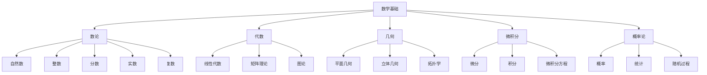

                 

### 文章标题：数学与未来人才培养的新要求

> 关键词：数学教育、人才培养、未来社会、人工智能、教育改革

> 摘要：本文从数学在人才培养中的地位与作用出发，探讨了未来社会对人才培养的新需求。通过分析数学的核心概念、算法原理、数学模型与人工智能应用，本文提出了数学教育改革的方向与实践案例，以及数学教育在人才培养中的角色与定位。旨在为教育工作者、学生和家长提供关于数学教育的新视角和参考。

### 绪论

数学作为一门基础学科，在人才培养中具有重要的地位和作用。自古以来，数学被认为是训练人类逻辑思维、解决问题和抽象能力的重要工具。然而，随着科技的发展和社会的进步，未来社会对人才培养提出了更高的要求，尤其是数学素养的要求。数学不仅是一门学科，更是一种思维方式、一种解决问题的工具。

#### 数学在人才培养中的地位与作用

数学在人才培养中具有以下几个方面的作用：

1. **培养逻辑思维能力**：数学强调逻辑推理、证明和抽象，通过数学学习，学生可以培养严谨的逻辑思维能力和分析问题的能力。
2. **提高问题解决能力**：数学提供了一种系统化、规范化的解决问题的方法，学生可以通过数学学习，掌握解决实际问题的方法和技能。
3. **培养创新精神和创造力**：数学问题往往具有多样性和复杂性，通过解决数学问题，学生可以培养创新精神和创造力。
4. **增强跨学科能力**：数学与自然科学、社会科学、工程技术等领域有着密切的联系，数学素养有助于学生理解和应用其他学科的知识。

#### 未来社会对人才培养的新需求

未来社会是一个信息化的、全球化的、高度复杂和动态变化的社会。这种社会环境对人才培养提出了新的要求：

1. **创新能力与思维能力的培养**：未来社会需要具有创新精神和创新能力的人才，数学作为一种培养逻辑思维和抽象能力的工具，对于培养创新能力具有重要意义。
2. **综合素质与跨学科能力的培养**：未来社会需要具有综合素质和跨学科能力的人才，数学作为一种跨学科的通用语言，有助于学生理解和应用其他学科的知识。
3. **适应性和灵活性的培养**：未来社会变化快速，需要具有适应性和灵活性的人才，数学作为一种解决复杂问题的工具，有助于学生培养这种能力。

#### 数学教育的发展趋势与挑战

随着未来社会对人才培养的新需求，数学教育也面临着新的发展趋势和挑战：

1. **教育模式的创新**：传统的数学教育模式过于强调知识的传授，而忽视了学生的能力和素质的培养。未来数学教育需要更加注重学生的自主学习和创新能力培养。
2. **教学内容的拓展**：未来数学教育需要更加注重数学与其他学科的交叉融合，拓展学生的知识视野。
3. **教育技术的应用**：随着信息技术的快速发展，教育技术已经成为数学教育的重要辅助工具，未来数学教育需要更加注重教育技术的应用。
4. **教育评价的创新**：传统的教育评价方式往往过于强调知识点的掌握，而忽视了学生的能力和素质的培养。未来数学教育需要更加注重学生的综合素质和能力的评价。

综上所述，数学在人才培养中具有重要的地位和作用，未来社会对人才培养提出了新的要求，数学教育也面临着新的发展趋势和挑战。本文旨在探讨数学教育的发展方向和改革实践，为教育工作者、学生和家长提供关于数学教育的新视角和参考。在接下来的章节中，我们将深入探讨数学的核心概念、算法原理、数学模型与人工智能应用，以及数学教育改革的方向与实践案例。

### 数学核心概念与联系

要深入理解数学教育的发展，我们首先需要明确数学的核心概念及其相互之间的联系。数学不仅仅是数字和公式的堆砌，而是一种逻辑严密、结构完整的知识体系。以下是数学核心概念的介绍及其内在联系。

#### 数学基本概念

数学的基本概念是数学知识的基石，包括但不限于：

1. **数**：数的概念是数学的核心，从自然数、整数、分数到实数和复数，每个层次都有其独特的性质和应用。
2. **函数**：函数是数学中描述变量之间关系的工具，它为理解和分析各种现象提供了数学模型。
3. **集合**：集合是数学中最基本的结构之一，用于描述一组对象的集合，是定义其他数学概念的基础。
4. **几何**：几何研究的是形状、大小和位置关系，通过几何，我们能够理解和解决许多实际问题和抽象问题。

#### 数学基本原理

数学的基本原理是数学理论的支撑，包括：

1. **逻辑推理**：逻辑推理是数学证明的核心，通过逻辑推理，我们可以从已知的事实推出新的结论。
2. **数学归纳法**：数学归纳法是一种证明方法，它通过验证基础情况并展示递推关系，来证明一个数学命题对所有自然数都成立。
3. **极限与连续性**：极限和连续性是微积分的基础，它们描述了变量在某个点的行为，并为我们提供了分析和解决复杂问题的工具。
4. **欧拉公式**：欧拉公式（\( e^{i\pi} + 1 = 0 \)）是数学中一个深刻的等式，它将指数函数、三角函数和复数结合起来，展示了数学的统一性。

#### 数学知识结构

数学的知识结构可以通过以下图示来展示：



上述图示展示了数学的主要分支及其相互之间的联系，每个分支又包含若干子领域，这些子领域共同构成了数学的完整知识体系。

#### 数学知识结构图

为了更直观地理解数学知识结构，我们可以使用以下Mermaid流程图：


通过这些核心概念和知识结构的展示，我们可以更好地理解数学的本质和其在人才培养中的重要作用。在接下来的章节中，我们将进一步探讨数学算法原理、数学模型及其在人工智能中的应用。

#### 数学算法原理讲解

在数学领域，算法是解决问题的核心工具。以下我们将介绍几个常见的数学算法，通过伪代码详细阐述其工作原理，并分析其在实际应用中的场景。

##### 算法A：快速排序（Quick Sort）

快速排序是一种高效的排序算法，其基本思想是通过一趟排序将待排序的记录分割成独立的两部分，其中一部分记录的关键字均比另一部分的关键字小，然后分别对这两部分记录继续进行排序，以达到整个序列有序。

**伪代码：**

```
QUICKSORT(A, low, high)
    if low < high
        pivot = PARTITION(A, low, high)
        QUICKSORT(A, low, pivot - 1)
        QUICKSORT(A, pivot + 1, high)
```

**伪代码说明：**
1. **PARTITION函数**：选择一个基准值（pivot），将数组分为两部分，一部分比pivot小，另一部分比pivot大。
2. **递归调用**：对小于pivot的子数组进行快速排序，对大于pivot的子数组进行快速排序。

**应用场景：**
- **数据处理**：在大规模数据处理中，快速排序常用于数据排序，如数据库查询优化、搜索引擎索引等。

##### 算法B：二分查找（Binary Search）

二分查找是一种在有序数组中查找特定元素的算法。它的工作原理是通过不断将查找范围缩小一半，逐步逼近目标元素。

**伪代码：**

```
BINARYSEARCH(A, low, high, x)
    if low > high
        return -1
    mid = (low + high) / 2
    if A[mid] == x
        return mid
    else if A[mid] > x
        return BINARYSEARCH(A, low, mid - 1, x)
    else
        return BINARYSEARCH(A, mid + 1, high, x)
```

**伪代码说明：**
1. **递归调用**：通过计算中间索引mid，将查找范围缩小一半。
2. **终止条件**：当查找范围超出数组边界或找到目标元素时，递归终止。

**应用场景：**
- **搜索引擎**：在搜索引擎中，二分查找用于快速定位关键词在索引中的位置。
- **金融分析**：在金融数据分析中，二分查找用于查找特定数据点的位置，如股票价格的历史数据。

##### 算法C：K-Means聚类

K-Means聚类是一种无监督学习算法，用于将数据集分成若干个聚类，每个聚类内的数据点相似度较高，而不同聚类之间的数据点相似度较低。

**伪代码：**

```
KMEANS(A, K)
    初始化K个聚类中心
    while not converged
        assign each data point to the nearest cluster center
        update cluster centers
        check for convergence
```

**伪代码说明：**
1. **初始化**：随机选择K个数据点作为初始聚类中心。
2. **迭代过程**：重复执行以下步骤，直到聚类中心不再变化或达到迭代次数上限：
   - 将每个数据点分配给最近的聚类中心。
   - 计算新的聚类中心。

**应用场景：**
- **图像处理**：在图像分割和特征提取中，K-Means聚类用于将图像划分为不同的区域。
- **市场细分**：在市场分析中，K-Means聚类用于分析消费者群体的特征，从而进行市场细分。

通过以上算法的介绍，我们可以看到数学算法在数据处理和分析中的广泛应用。这些算法不仅提高了计算效率，还为解决实际问题提供了有效的工具。在接下来的章节中，我们将进一步探讨数学模型与公式，以及它们在各个领域中的应用。

#### 数学模型与公式详解

数学模型是用于描述和分析实际问题的数学结构，而数学公式则是这些模型的数学表达。在数学教育中，掌握基础和高级的数学模型与公式对于理解和应用数学知识至关重要。以下将介绍几种常见的数学模型及其公式，并结合实际案例进行详细讲解。

##### 基础数学模型

###### 模型A：线性回归模型

线性回归模型用于描述两个或多个变量之间的线性关系。其数学公式为：

$$
y = \beta_0 + \beta_1 \cdot x + \epsilon
$$

其中，\( y \) 是因变量，\( x \) 是自变量，\( \beta_0 \) 是截距，\( \beta_1 \) 是斜率，\( \epsilon \) 是误差项。

**实际案例：**

假设我们要分析房价与房屋面积之间的关系，通过收集多个房屋的数据，可以使用线性回归模型来预测新房屋的售价。

- 数据集：房屋面积（平方米）和售价（万元）
  | 房屋面积 | 售价 |
  |----------|------|
  | 80       | 100  |
  | 90       | 110  |
  | 100      | 130  |
  | 110      | 150  |

通过计算，我们得到线性回归模型：

$$
售价 = 80 + 1.5 \cdot 房屋面积
$$

利用这个模型，当房屋面积为100平方米时，预测的售价为：

$$
售价 = 80 + 1.5 \cdot 100 = 230 \text{万元}
$$

###### 模型B：牛顿迭代法

牛顿迭代法是一种用于求解非线性方程的方法。其迭代公式为：

$$
x_{n+1} = x_n - \frac{f(x_n)}{f'(x_n)}
$$

其中，\( x_n \) 是第 \( n \) 次迭代的值，\( f(x) \) 是待求解的方程，\( f'(x) \) 是 \( f(x) \) 的导数。

**实际案例：**

求解方程 \( f(x) = x^2 - 2 = 0 \) 的根。

初始值 \( x_0 = 1 \)，通过迭代计算，我们得到：

- \( x_1 = 1 - \frac{1^2 - 2}{2 \cdot 1} = 1.5 \)
- \( x_2 = 1.5 - \frac{1.5^2 - 2}{2 \cdot 1.5} = 1.4167 \)
- \( x_3 = 1.4167 - \frac{1.4167^2 - 2}{2 \cdot 1.4167} = 1.4142 \)

经过几次迭代，我们得到的近似根为 \( x \approx 1.4142 \)。

##### 高级数学模型

###### 模型C：梯度下降法

梯度下降法是一种用于求解最优化问题的方法。其迭代公式为：

$$
x_{n+1} = x_n - \alpha \cdot \nabla f(x_n)
$$

其中，\( x_n \) 是第 \( n \) 次迭代的值，\( \alpha \) 是学习率，\( \nabla f(x_n) \) 是函数 \( f(x) \) 在 \( x_n \) 处的梯度。

**实际案例：**

求解函数 \( f(x) = x^2 \) 的最小值。

初始值 \( x_0 = 1 \)，学习率 \( \alpha = 0.1 \)，通过迭代计算，我们得到：

- \( x_1 = 1 - 0.1 \cdot 2 \cdot 1 = 0.8 \)
- \( x_2 = 0.8 - 0.1 \cdot 2 \cdot 0.8 = 0.64 \)
- \( x_3 = 0.64 - 0.1 \cdot 2 \cdot 0.64 = 0.512 \)

经过多次迭代，当梯度趋近于零时，我们可以得到近似的最小值点 \( x \approx 0 \)。

###### 模型D：马尔可夫模型

马尔可夫模型用于描述一个系统状态的变化过程，其状态转移矩阵为：

$$
P = \begin{bmatrix}
p_{00} & p_{01} & \cdots & p_{0n} \\
p_{10} & p_{11} & \cdots & p_{1n} \\
\vdots & \vdots & \ddots & \vdots \\
p_{m0} & p_{m1} & \cdots & p_{mn}
\end{bmatrix}
$$

其中，\( p_{ij} \) 表示系统从状态 \( i \) 转移到状态 \( j \) 的概率。

**实际案例：**

假设一个公司员工的离职状态可以用一个马尔可夫模型来描述，状态转移矩阵如下：

$$
P = \begin{bmatrix}
0.8 & 0.2 \\
0.1 & 0.9
\end{bmatrix}
$$

表示员工在当前状态（非离职状态和离职状态）下，下一期仍然保持该状态的几率。

通过这个模型，我们可以预测未来某个时间点员工的离职概率。例如，如果当前有80%的员工处于非离职状态，则下一期仍有80%的概率保持非离职状态。

通过上述基础和高级数学模型的介绍，我们可以看到数学模型在解决实际问题和数据分析中的广泛应用。掌握这些模型和公式，不仅能够帮助我们更好地理解数学的本质，还能够提升我们的问题解决能力和数据分析能力。在接下来的章节中，我们将进一步探讨数学与人工智能的紧密联系，以及数学在人工智能中的应用。

### 数学与人工智能

随着人工智能技术的迅猛发展，数学作为其基础学科，在其中发挥着不可或缺的作用。人工智能算法依赖于数学模型和公式的支持，而这些数学工具在算法设计、优化和实际应用中扮演着关键角色。

#### 数学在人工智能中的应用

1. **线性代数**：线性代数是人工智能的基础，其在机器学习、深度学习和神经网络中得到了广泛应用。例如，线性代数中的矩阵运算用于计算权重和偏置，优化算法依赖于矩阵求导和矩阵分解等方法。

2. **概率论与统计**：概率论和统计是人工智能算法设计的重要工具。例如，在深度学习中，概率分布用于表示数据的不确定性，贝叶斯定理和最大似然估计用于模型参数的估计和优化。

3. **微积分**：微积分在优化算法中起着至关重要的作用。通过求导和积分，我们可以找到最优解，并调整模型参数以实现更好的性能。例如，梯度下降法和其变种在优化神经网络参数时广泛应用。

4. **图论**：图论在社交网络分析、推荐系统和自然语言处理等领域具有广泛应用。图结构可以用于表示复杂的关系网络，图论算法可以用于路径搜索、社区发现和聚类分析等任务。

#### 数学与人工智能的发展趋势

1. **数据驱动方法**：随着数据量的爆炸性增长，数据驱动方法在人工智能中占据主导地位。数学模型用于从海量数据中提取特征和模式，以便进行有效的学习和预测。

2. **深度学习与神经网络**：深度学习作为人工智能的重要分支，其核心在于多层神经网络的设计和优化。数学工具，如反向传播算法和优化算法，用于训练和调整神经网络的结构和参数。

3. **智能优化算法**：数学优化算法在人工智能中的应用日益广泛，如遗传算法、模拟退火算法和粒子群优化算法等。这些算法通过模拟自然进化过程，寻找复杂问题的最优解。

4. **跨学科融合**：人工智能与数学、统计学、计算机科学、物理学等多学科的交叉融合，推动了人工智能技术的发展。数学模型在跨学科研究中提供了强大的工具和支持。

#### 数学与人工智能的未来需求

1. **高效算法**：随着人工智能应用的不断扩大，对高效算法的需求日益增长。数学在算法优化和复杂性问题求解中发挥着重要作用，需要进一步研究和开发新的数学方法。

2. **多模态数据融合**：人工智能在处理多模态数据（如文本、图像、语音等）时，需要利用数学模型进行数据融合和特征提取。未来，如何更好地融合多模态数据，提高模型性能，是数学研究的重要方向。

3. **智能推理与决策**：人工智能系统需要具备智能推理和决策能力，这依赖于数学模型的支持。未来，数学在逻辑推理、不确定性推理和决策理论等领域的研究，将为人工智能的发展提供新的思路和工具。

总之，数学在人工智能发展中起着至关重要的作用。通过数学模型的构建和算法的优化，人工智能技术将不断突破现有的局限，为人类社会带来更多的创新和变革。在接下来的章节中，我们将探讨数学教育改革的方向和实践，为培养未来人工智能领域的人才提供参考。

#### 数学教育改革的方向与实践

随着人工智能和科技的快速发展，传统数学教育模式已经难以满足未来社会对人才培养的需求。数学教育改革成为提高学生综合素质和跨学科能力的重要手段。以下将探讨数学教育改革的方向和目标，并介绍一些成功的实践案例。

##### 教育模式的创新

1. **项目导向学习**：传统的课堂教学模式过于注重知识点的传授，而忽视了学生的实际应用能力。项目导向学习通过实际项目让学生动手实践，培养解决问题的能力。例如，在数学课程中，可以设置数据分析和建模项目，让学生利用所学知识解决实际问题。

2. **探究式学习**：探究式学习鼓励学生主动探索和发现知识，培养他们的探究精神和创新能力。通过提出问题、设计实验和数据分析，学生能够在探索过程中深化对数学概念的理解。

3. **跨学科教学**：数学与其他学科的融合是培养跨学科能力的重要途径。在数学教育中，可以引入物理学、计算机科学、经济学等学科的知识，让学生在学习数学的同时，拓宽视野，提高综合素质。

##### 教学内容的拓展

1. **增加应用性内容**：传统的数学教育往往偏重理论，忽视了应用。改革后的数学教育应增加应用性内容，如数据分析、概率统计、算法设计等，让学生了解数学在现实世界中的应用。

2. **跨学科知识融合**：通过跨学科知识的融合，可以让学生更好地理解数学与其他学科的联系。例如，在数学课程中，可以引入计算机编程和算法设计的知识，让学生掌握如何使用数学工具解决实际问题。

3. **历史和哲学教育**：数学的发展离不开历史和哲学的背景。通过介绍数学的发展历程和哲学思考，可以激发学生对数学的兴趣和热情，提高他们的数学素养。

##### 教育技术的应用

1. **在线教育平台**：随着互联网技术的发展，在线教育平台为数学教育提供了新的手段。通过在线平台，学生可以随时随地进行学习，教师可以提供丰富的教学资源和互动平台。

2. **教育数据分析**：利用教育数据分析，可以了解学生的学习情况，针对性地进行教学调整。例如，通过分析学生的学习数据，教师可以识别学生的薄弱环节，提供个性化的辅导。

3. **虚拟现实技术**：虚拟现实技术可以模拟复杂的数学场景，提供沉浸式的学习体验。例如，通过虚拟现实，学生可以直观地理解几何图形的空间关系，提高学习效果。

##### 成功的实践案例

1. **STEM教育**：STEM（科学、技术、工程和数学）教育模式强调多学科的融合，培养学生的综合能力。在美国，许多学校已经将STEM教育纳入数学课程，通过项目式学习和实验，提高学生的数学素养和实际应用能力。

2. ** flipped classroom**：翻转课堂是一种以学生为中心的教学模式，通过在线学习平台提供教学视频，学生在课外观看视频进行预习，课堂上则进行讨论和实践。这种方式改变了传统的教学模式，提高了学生的学习积极性和参与度。

3. **探究实验室**：一些学校建立了数学探究实验室，提供各种数学实验工具和软件，让学生在实验中探索数学概念和原理。通过动手操作和实验，学生可以更加直观地理解数学知识，提高学习效果。

通过以上方向和实践，数学教育改革将更好地满足未来社会对人才培养的新需求，培养学生的创新能力、问题解决能力和跨学科能力。在接下来的章节中，我们将探讨未来社会对人才培养的新要求，以及数学教育在人才培养中的角色和定位。

### 未来人才培养与数学教育

随着科技的飞速发展，未来社会对人才培养提出了新的要求，这些要求不仅体现在创新能力、思维能力的培养上，还包括综合素质和跨学科能力的提升。数学教育在满足这些新要求中发挥着关键作用。

#### 未来社会对人才培养的新要求

1. **创新能力与思维能力的培养**：未来社会是一个高度竞争和变革的环境，创新能力成为人才的核心竞争力。思维能力，特别是逻辑思维、批判性思维和创造性思维，是创新能力的基础。数学教育通过培养逻辑推理和抽象能力，能够有效地提升学生的思维能力。

2. **综合素质与跨学科能力的培养**：未来社会需要具备综合素质的人才，这包括沟通能力、协作能力、领导能力和适应能力。此外，跨学科能力在解决复杂问题和应对多变环境时至关重要。数学教育通过与其他学科的交叉融合，有助于学生形成综合性的知识体系。

3. **适应性与灵活性的培养**：未来社会变化快速，对人才的适应性和灵活性提出了更高的要求。数学教育通过培养学生解决复杂问题的能力，增强他们的适应性和灵活性。

#### 数学教育在人才培养中的角色与定位

1. **培养数学思维与逻辑分析能力**：数学教育不仅仅是传授知识，更重要的是培养数学思维和逻辑分析能力。通过数学问题的解决，学生能够学会如何分析问题、构建模型和设计解决方案。这种思维能力在各个领域都有广泛的应用。

2. **培养解决实际问题的能力**：数学教育强调理论与实践的结合，通过实际案例和项目，学生可以学会如何将数学知识应用于实际问题中。这种能力不仅有助于他们在学术研究中取得成功，也能在职业生涯中应对各种挑战。

3. **促进跨学科合作**：数学作为一种跨学科的通用语言，有助于学生理解和应用其他学科的知识。通过数学与其他学科的融合，学生可以形成更全面的视角，提高跨学科合作的能力。

#### 实现未来人才培养的数学教育策略

1. **课程内容的多样化**：数学教育应包含基础知识和应用知识，课程内容应涵盖不同领域的数学应用，如数据科学、计算机科学、工程学和经济学等。

2. **教学方法的创新**：传统的教学方法应与探究式学习和项目导向学习相结合，鼓励学生主动探索和参与。教师应运用现代教育技术，如在线平台和虚拟现实，提供丰富的学习资源。

3. **跨学科合作**：学校应鼓励数学与其他学科的交叉教学和项目合作，培养学生跨学科解决问题的能力。

4. **个性化教育**：根据学生的兴趣和特长，提供个性化的数学教育，让学生在特定领域深入学习和探索。

总之，未来社会对人才培养的新要求为数学教育带来了新的挑战和机遇。通过培养数学思维、逻辑分析能力、解决实际问题的能力和跨学科合作能力，数学教育将在未来人才培养中发挥重要作用。在接下来的章节中，我们将总结本文的主要观点，并提出一些建议和注意事项。

### 总结与展望

本文从数学在人才培养中的地位与作用出发，探讨了未来社会对人才培养的新需求。我们分析了数学的核心概念、算法原理、数学模型与人工智能应用，并提出了数学教育改革的方向和实践案例。具体内容总结如下：

1. **数学教育的重要性**：数学在培养逻辑思维能力、问题解决能力和创新能力方面具有重要作用。
2. **未来社会的新需求**：未来社会对人才培养提出了创新能力、综合素质和跨学科能力的培养要求。
3. **数学教育的改革方向**：教育模式的创新、教学内容的拓展、教育技术的应用是数学教育改革的关键。
4. **数学与人工智能的结合**：数学在人工智能中的应用日益广泛，数学模型和算法是人工智能算法设计的基础。

为了更好地应对未来社会的挑战，我们提出以下建议：

1. **加强数学基础教育**：重视数学基础知识的掌握，培养学生的数学思维和逻辑分析能力。
2. **注重跨学科教学**：通过跨学科教学，培养学生的综合素质和跨学科能力。
3. **应用现代教育技术**：利用在线教育平台和虚拟现实技术，提供丰富的学习资源和沉浸式的学习体验。
4. **个性化教育**：根据学生的兴趣和特长，提供个性化的数学教育，激发学生的学习兴趣和潜能。

注意事项：

1. **平衡理论与实践**：在数学教育中，要注重理论与实践的结合，让学生在解决实际问题的过程中加深对数学概念的理解。
2. **关注学生个体差异**：每个学生都有其独特的学习风格和能力，教育者应根据学生的个体差异进行有针对性的教学。
3. **持续教学反思**：教育者应不断反思教学方法和效果，根据学生的学习反馈调整教学策略，以提高教学质量。

展望未来，数学教育将在培养具备创新精神、综合素质和跨学科能力的优秀人才中发挥更为重要的作用。通过不断改革和创新，数学教育将为未来社会的进步和发展提供强有力的支持。

### 附录

#### 附录A 数学教育参考资源

1. **《数学教育的艺术》**：作者：乔治·波利亚
   - 简介：本书通过丰富的实例和案例，探讨了数学教育的艺术，提供了许多有效的教学策略和方法。

2. **《数学思维》**：作者：安德斯·莫勒-斯特里尔
   - 简介：本书从认知心理学的角度，分析了数学思维的内在机制，为数学教育提供了新的理论依据。

3. **《数学探索》**：作者：马丁·加德纳
   - 简介：本书通过趣味性的数学问题，激发了读者对数学的兴趣，适合广大数学爱好者阅读。

#### 附录B 数学模型与算法应用实例

1. **线性回归模型实例**：
   - 数据集：房价与房屋面积
   - 模型公式：\( 售价 = 截距 + 斜率 \cdot 房屋面积 \)
   - 应用场景：预测房屋售价

2. **牛顿迭代法实例**：
   - 方程：\( x^2 - 2 = 0 \)
   - 迭代公式：\( x_{n+1} = x_n - \frac{f(x_n)}{f'(x_n)} \)
   - 应用场景：求解非线性方程

3. **K-Means聚类实例**：
   - 数据集：学生成绩
   - 模型公式：通过迭代计算聚类中心，将学生成绩分为不同的聚类
   - 应用场景：学生成绩分析

通过这些参考资源和实例，读者可以更深入地了解数学教育的理论和实践，提升自身的数学素养和应用能力。扩展阅读将有助于深化对数学教育改革和人才培养的理解。

