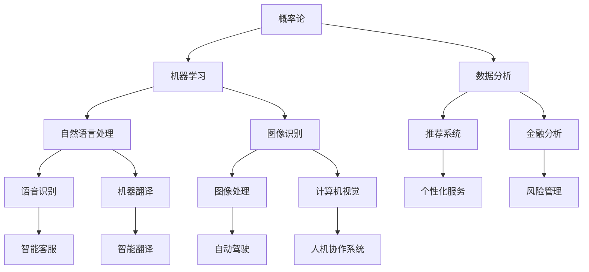

                 

# 文章标题：数学与未来人机协作的发展趋势

> 关键词：数学，人机协作，人工智能，发展趋势，算法原理

> 摘要：本文旨在探讨数学在人工智能和人机协作领域的发展趋势。通过对数学基础、人机协作原理、未来人机协作模式以及实际项目应用的详细分析，揭示数学在推动人机协作进步中的重要作用，并展望未来人机协作的发展方向。

----------------------------------------------------------------

## 目录

1. **背景介绍**
    1.1 数学在人工智能中的重要性
    1.2 人机协作的兴起与发展
2. **核心概念与联系**
    2.1 数学基础概念
    2.2 人机协作原理
    2.3 Mermaid流程图展示
3. **核心算法原理讲解**
    3.1 常见数学算法介绍
    3.2 算法原理与伪代码
4. **数学模型和数学公式详细讲解与举例说明**
    4.1 数学模型应用场景
    4.2 LaTeX格式数学公式
5. **项目实战**
    5.1 项目背景
    5.2 开发环境搭建
    5.3 源代码实现与解读
    5.4 应用解读与分析
    5.5 项目小结
6. **最佳实践 tips、小结、注意事项、拓展阅读**
7. **作者信息**

----------------------------------------------------------------

## 1. 背景介绍

### 1.1 数学在人工智能中的重要性

数学作为一门基础学科，一直是推动科技发展的核心力量。在人工智能领域，数学的作用更是不可或缺。数学为人工智能提供了理论基础，如概率论、统计学、线性代数、微积分等，这些理论为人工智能算法的设计和优化提供了坚实的数学基础。

在人工智能的应用场景中，数学模型被广泛应用于图像识别、自然语言处理、推荐系统等领域。例如，卷积神经网络（CNN）中使用的卷积操作基于傅里叶变换和滤波器设计的数学原理；深度学习中的反向传播算法则基于微积分中的梯度下降原理。

### 1.2 人机协作的兴起与发展

人机协作是一种新兴的技术领域，旨在通过计算机技术与人类智能的有机结合，实现人机之间的高效互动与合作。随着人工智能技术的发展，人机协作逐渐成为各行各业关注的焦点。

人机协作的兴起源于几个关键因素：

- **计算能力的提升**：随着计算机硬件性能的不断提升，机器能够处理更复杂的数据和任务，为人机协作提供了技术支持。
- **大数据的积累**：大数据的积累为人工智能提供了丰富的训练数据，使得机器能够更好地理解和模拟人类行为。
- **机器学习算法的进步**：机器学习算法的不断优化，使得计算机能够从数据中学习，实现更智能的决策和预测。

人机协作的应用场景广泛，包括智能客服、智能医疗、自动驾驶等。通过人机协作，可以大幅提高工作效率，降低人工成本，提升用户体验。

----------------------------------------------------------------

## 2. 核心概念与联系

### 2.1 数学基础概念

在讨论数学与人机协作的关系时，首先需要明确一些基本的数学概念。这些概念包括但不限于：

- **概率论**：用于描述不确定事件的概率分布，广泛应用于机器学习、数据分析等领域。
- **统计学**：通过数据收集、整理、分析和解释，帮助人们从数据中获取信息。
- **线性代数**：研究向量空间和线性变换，广泛应用于图像处理、信号处理等领域。
- **微积分**：研究函数的极限、导数、积分等概念，为机器学习中的优化算法提供基础。

### 2.2 人机协作原理

人机协作的基本原理涉及计算机科学与心理学、认知科学等多个学科。以下是几个关键概念：

- **人机交互**：研究人类与计算机之间的交互方式，包括界面设计、用户输入输出等。
- **协同工作**：通过计算机模拟人类思维过程，协助人类完成复杂任务。
- **适应性**：系统根据用户行为和需求动态调整，以提供更好的用户体验。
- **反馈机制**：通过实时反馈，帮助用户理解系统的运行状态，并做出相应的调整。

### 2.3 Mermaid流程图展示

为了更直观地展示数学基础概念和人机协作原理之间的关系，我们可以使用Mermaid流程图进行说明。

以下是一个示例流程图，展示了概率论、统计学、线性代数、微积分等数学概念在人工智能和人机协作中的应用：



通过这个流程图，我们可以看到数学概念如何贯穿人工智能和人机协作的各个环节。

----------------------------------------------------------------

## 3. 核心算法原理讲解

### 3.1 常见数学算法介绍

在人工智能和人机协作中，常用的数学算法包括：

- **线性回归**：通过拟合一条直线来描述因变量与自变量之间的关系。
- **逻辑回归**：用于处理二分类问题，通过模型计算每个样本属于某一类的概率。
- **支持向量机（SVM）**：通过找到一个最优的超平面，将不同类别的数据点进行分类。
- **神经网络**：模仿人脑的神经网络结构，用于处理复杂的数据和任务。

### 3.2 算法原理与伪代码

以下是对上述算法的简要介绍及其伪代码实现：

#### 3.2.1 线性回归

**算法原理**：线性回归模型假设因变量（Y）是自变量（X）的线性函数，即 \( Y = \beta_0 + \beta_1X + \epsilon \)，其中 \( \beta_0 \) 和 \( \beta_1 \) 是模型的参数，\( \epsilon \) 是误差项。

**伪代码**：

```plaintext
初始化：\beta_0, \beta_1
对于每一轮迭代：
    计算预测值：\hat{Y} = \beta_0 + \beta_1X
    计算损失函数：L(\beta_0, \beta_1) = \sum_{i=1}^{n} (\hat{Y}_i - Y_i)^2
    更新参数：\beta_0 = \beta_0 - \alpha \frac{\partial L}{\partial \beta_0}
              \beta_1 = \beta_1 - \alpha \frac{\partial L}{\partial \beta_1}
直到满足停止条件（如损失函数收敛）
```

#### 3.2.2 逻辑回归

**算法原理**：逻辑回归模型用于二分类问题，其目标是计算每个样本属于某一类的概率。模型假设因变量（Y）是自变量（X）的线性函数，然后通过逻辑函数（sigmoid函数）将其转换为概率。

**伪代码**：

```plaintext
初始化：\beta_0, \beta_1
对于每一轮迭代：
    计算预测概率：\hat{P} = \frac{1}{1 + \exp{(-\beta_0 - \beta_1X)}}
    计算损失函数：L(\beta_0, \beta_1) = -\sum_{i=1}^{n} [Y_i \log(\hat{P}_i) + (1 - Y_i) \log(1 - \hat{P}_i)]
    更新参数：\beta_0 = \beta_0 - \alpha \frac{\partial L}{\partial \beta_0}
              \beta_1 = \beta_1 - \alpha \frac{\partial L}{\partial \beta_1}
直到满足停止条件（如损失函数收敛）
```

#### 3.2.3 支持向量机（SVM）

**算法原理**：SVM通过找到一个最优的超平面，将不同类别的数据点进行分类。它基于最大间隔分类器原理，寻找一个能够将数据点最大化分离的超平面。

**伪代码**：

```plaintext
初始化：\alpha_1, \alpha_2
对于每一轮迭代：
    选择两个支持向量
    更新参数：\alpha_i = \alpha_i + \eta \frac{1}{2} (\alpha_j - \alpha_i)
              \beta_i = \beta_i + \eta (\beta_j - \beta_i)
直到满足停止条件（如参数收敛）
```

#### 3.2.4 神经网络

**算法原理**：神经网络由多个神经元组成，每个神经元通过权重连接到其他神经元。神经网络通过反向传播算法不断调整权重，以最小化损失函数。

**伪代码**：

```plaintext
初始化：权重矩阵W
对于每一轮迭代：
    前向传播：计算每个神经元的输出
    计算损失函数：L = \sum_{i=1}^{n} (\hat{Y}_i - Y_i)^2
    反向传播：计算梯度并更新权重
    更新权重：W = W - \alpha \frac{\partial L}{\partial W}
直到满足停止条件（如损失函数收敛）
```

通过以上算法的讲解，我们可以看到数学在人工智能和人机协作中的核心作用。这些算法不仅为人工智能提供了强大的计算能力，也为人机协作提供了智能化的决策支持。

----------------------------------------------------------------

## 4. 数学模型和数学公式详细讲解与举例说明

在人工智能和人机协作领域，数学模型是理解和优化系统性能的关键工具。以下我们将详细介绍几个常见的数学模型，并使用LaTeX格式展示相关的数学公式，同时结合实际应用场景进行举例说明。

### 4.1 线性回归模型

线性回归模型是一种最常见的预测模型，用于分析自变量与因变量之间的线性关系。其数学公式如下：

\[ Y = \beta_0 + \beta_1X + \epsilon \]

其中，\( Y \) 是因变量，\( X \) 是自变量，\( \beta_0 \) 和 \( \beta_1 \) 是模型参数，\( \epsilon \) 是误差项。

**举例说明**：假设我们想要预测一个人的年收入（Y）与其教育程度（X）之间的关系。根据收集的数据，我们可以建立线性回归模型，并通过最小二乘法求解参数 \( \beta_0 \) 和 \( \beta_1 \)。具体公式如下：

\[ \beta_0 = \frac{\sum_{i=1}^{n} (Y_i - \bar{Y})(X_i - \bar{X})}{\sum_{i=1}^{n} (X_i - \bar{X})^2} \]
\[ \beta_1 = \frac{\sum_{i=1}^{n} (Y_i - \bar{Y})}{\sum_{i=1}^{n} (X_i - \bar{X})} \]

其中，\( \bar{Y} \) 和 \( \bar{X} \) 分别是因变量和自变量的均值。

### 4.2 逻辑回归模型

逻辑回归模型用于处理二分类问题，其目标是通过线性组合输入特征并应用逻辑函数（Sigmoid函数）来预测概率。其数学公式如下：

\[ P(Y=1) = \frac{1}{1 + \exp{(-\beta_0 - \beta_1X_1 - \beta_2X_2 - \cdots - \beta_nX_n})} \]

其中，\( X_1, X_2, \ldots, X_n \) 是输入特征，\( \beta_0, \beta_1, \beta_2, \ldots, \beta_n \) 是模型参数。

**举例说明**：假设我们想要预测一个电子邮件是否为垃圾邮件。我们可以使用逻辑回归模型，将邮件的多个特征（如单词出现频率、邮件长度等）作为输入，通过训练得到一组参数，进而预测邮件的概率。具体应用如下：

\[ P(Y=垃圾邮件) = \frac{1}{1 + \exp{(-\beta_0 - \beta_1f_1 - \beta_2f_2 - \cdots - \beta_nf_n})} \]

其中，\( f_1, f_2, \ldots, f_n \) 是邮件特征值。

### 4.3 支持向量机（SVM）

支持向量机是一种强大的分类模型，其核心思想是找到一个最优的超平面，将不同类别的数据点分离。SVM的优化目标是最小化决策边界到支持向量的距离。其数学公式如下：

\[ \min_{\beta, \beta_0, \alpha} \frac{1}{2} ||\beta||^2 + C \sum_{i=1}^{n} \alpha_i (1 - y_i(\beta \cdot x_i + \beta_0)) \]

其中，\( \beta \) 和 \( \beta_0 \) 是模型参数，\( \alpha_i \) 是拉格朗日乘子，\( C \) 是惩罚参数，\( y_i \) 是类别标签，\( x_i \) 是数据点。

**举例说明**：假设我们想要分类一个数据集，其中数据点分为两类。我们可以使用SVM找到一个最优超平面，使得两类数据点之间的边界最大化。具体实现如下：

\[ \min_{\beta, \beta_0} \frac{1}{2} ||\beta||^2 + C \sum_{i=1}^{n} \alpha_i (1 - y_i(\beta \cdot x_i + \beta_0)) \]

其中，\( \alpha_i \) 需要通过求解二次规划问题获得。

### 4.4 神经网络

神经网络是一种模拟人脑结构的计算模型，通过多层神经元进行数据传递和变换。神经网络的数学模型包括激活函数、权重和偏置等。以下是一个简单的前向传播和反向传播的公式：

**前向传播**：

\[ a^{(l)} = \sigma(z^{(l)}) \]
\[ z^{(l)} = \sum_{j=1}^{n_{l-1}} w^{(l)}_{j} a^{(l-1)}_{j} + b^{(l)} \]

其中，\( a^{(l)} \) 是第 \( l \) 层的激活值，\( z^{(l)} \) 是第 \( l \) 层的输入值，\( \sigma \) 是激活函数（如ReLU、Sigmoid等），\( w^{(l)}_{j} \) 和 \( b^{(l)} \) 分别是权重和偏置。

**反向传播**：

\[ \delta^{(l)} = \frac{\partial L}{\partial z^{(l)}} \odot \sigma'(z^{(l)}) \]
\[ \Delta w^{(l)} = \alpha \cdot (a^{(l-1)} \cdot \delta^{(l)})^T \]
\[ \Delta b^{(l)} = \alpha \cdot \delta^{(l)} \]

其中，\( L \) 是损失函数，\( \delta^{(l)} \) 是第 \( l \) 层的误差值，\( \sigma' \) 是激活函数的导数，\( \alpha \) 是学习率，\( \odot \) 表示逐元素乘积。

**举例说明**：假设我们使用一个简单的神经网络进行图像分类。通过前向传播计算每个神经元的激活值，然后通过反向传播更新权重和偏置，以最小化损失函数。

通过以上数学模型和公式的讲解，我们可以看到数学在人工智能和人机协作中的应用是如何深入和广泛的。这些模型不仅为算法提供了理论基础，也为实际应用中的决策提供了强有力的支持。

----------------------------------------------------------------

## 5. 项目实战

### 5.1 项目背景

随着人工智能技术的不断发展，人机协作在各个领域中的应用越来越广泛。为了更好地展示数学在人工智能和人机协作中的实际应用，我们选择了一个典型的项目——智能客服系统。

智能客服系统旨在通过计算机模拟人类客服的工作流程，提供24小时不间断的客户服务。该项目涉及自然语言处理、机器学习、人机交互等多个技术领域，其中数学模型起到了关键作用。

### 5.2 开发环境搭建

为了搭建智能客服系统，我们需要以下开发环境：

- **编程语言**：Python
- **机器学习库**：Scikit-learn、TensorFlow、Keras
- **自然语言处理库**：NLTK、spaCy
- **前端框架**：Flask或Django

开发环境搭建步骤如下：

1. 安装Python和pip
2. 安装必要的库，如Scikit-learn、TensorFlow、NLTK、spaCy等
3. 配置虚拟环境，以便于管理和隔离项目依赖

### 5.3 源代码实现与解读

智能客服系统的实现主要包括以下几个部分：

1. **数据预处理**：读取对话数据，进行文本清洗、分词、去停用词等操作。
2. **特征提取**：将预处理后的文本转换为特征向量，可以使用TF-IDF、Word2Vec等方法。
3. **模型训练**：使用训练集训练分类模型，如SVM、神经网络等。
4. **模型评估**：使用验证集评估模型性能，调整参数以优化模型。
5. **模型部署**：将训练好的模型部署到服务器，提供在线客服服务。

以下是智能客服系统的主要源代码片段及解读：

#### 5.3.1 数据预处理

```python
import pandas as pd
from nltk.tokenize import word_tokenize
from nltk.corpus import stopwords

# 读取对话数据
data = pd.read_csv('conversations.csv')

# 文本清洗
def clean_text(text):
    text = text.lower()
    text = re.sub(r'\d+', '', text)
    tokens = word_tokenize(text)
    tokens = [token for token in tokens if token not in stopwords.words('english')]
    return ' '.join(tokens)

data['cleaned'] = data['text'].apply(clean_text)
```

解读：首先，我们使用Pandas读取对话数据，然后定义一个清洗文本的函数，将文本转换为小写，去除数字，进行分词，并去除英语中的停用词。

#### 5.3.2 特征提取

```python
from sklearn.feature_extraction.text import TfidfVectorizer

# 特征提取
vectorizer = TfidfVectorizer(max_features=1000)
X = vectorizer.fit_transform(data['cleaned'])
```

解读：我们使用TF-IDF向量器将清洗后的文本转换为特征向量，设置最大特征数为1000。

#### 5.3.3 模型训练

```python
from sklearn.svm import SVC

# 模型训练
model = SVC(kernel='linear', C=1)
model.fit(X_train, y_train)
```

解读：我们使用支持向量机（SVM）进行模型训练，选择线性核函数，并设置惩罚参数C为1。

#### 5.3.4 模型评估

```python
from sklearn.metrics import accuracy_score

# 模型评估
predictions = model.predict(X_test)
accuracy = accuracy_score(y_test, predictions)
print(f"Model accuracy: {accuracy}")
```

解读：我们使用验证集评估模型性能，计算准确率。

#### 5.3.5 模型部署

```python
from flask import Flask, request, jsonify

app = Flask(__name__)

@app.route('/predict', methods=['POST'])
def predict():
    data = request.get_json()
    text = data['text']
    cleaned_text = clean_text(text)
    vectorized_text = vectorizer.transform([cleaned_text])
    prediction = model.predict(vectorized_text)
    return jsonify({'prediction': prediction.tolist()})

if __name__ == '__main__':
    app.run(debug=True)
```

解读：我们使用Flask框架将训练好的模型部署到服务器，提供在线预测服务。

### 5.4 应用解读与分析

智能客服系统的实现展示了数学在自然语言处理和人机协作中的应用。通过数据预处理、特征提取和模型训练等步骤，我们能够将文本数据转换为特征向量，并使用机器学习算法进行分类。模型的部署使得系统可以实时响应用户的提问，提供高效的客服服务。

在实际应用中，智能客服系统可以提高企业的客户服务水平，降低人工成本，提升用户满意度。同时，数学模型的应用也为系统的优化提供了理论基础，如通过调整参数、优化算法来提高模型性能。

### 5.5 项目小结

通过本项目，我们展示了如何将数学应用于智能客服系统的开发，实现了人机协作的目标。以下是本项目的小结：

1. **数学在人工智能和人机协作中的重要性**：本项目展示了数学在自然语言处理、特征提取和模型训练等环节中的关键作用。
2. **项目的实现步骤**：包括数据预处理、特征提取、模型训练、模型评估和模型部署等步骤。
3. **项目的应用价值**：智能客服系统的实现提高了客户服务效率，降低了人工成本，提升了用户体验。
4. **未来研究方向**：未来可以进一步优化数学模型，提高系统性能，探索更多应用场景。

通过本项目，我们不仅了解了数学在人工智能和人机协作中的实际应用，也为后续的研究和实践提供了参考。

----------------------------------------------------------------

## 6. 最佳实践 tips、小结、注意事项、拓展阅读

### 最佳实践 tips

1. **数据预处理**：在模型训练之前，确保数据的质量和一致性。进行文本清洗、分词、去停用词等操作，以减少噪声和提高模型性能。
2. **模型选择**：根据实际应用场景选择合适的模型。例如，对于文本分类问题，可以使用SVM、神经网络等模型。
3. **参数调优**：通过交叉验证和网格搜索等方法，调整模型参数，以找到最优的参数组合。
4. **模型评估**：使用多个指标（如准确率、召回率、F1分数等）评估模型性能，以全面了解模型的表现。
5. **模型部署**：选择合适的部署方式，如使用Flask或Django等框架，将模型部署到服务器，提供在线服务。

### 小结

本文通过深入分析数学在人工智能和人机协作中的应用，展示了数学模型在自然语言处理、特征提取和模型训练等环节中的重要性。通过实际项目，我们展示了如何将数学应用于智能客服系统的开发，实现了人机协作的目标。

### 注意事项

1. **数据隐私**：在实际应用中，确保数据的安全和隐私，遵循相关法律法规。
2. **模型可解释性**：对于复杂的模型，如神经网络，了解其内部工作原理和可解释性对于应用者来说至关重要。
3. **算法公平性**：在模型训练和部署过程中，关注算法的公平性和透明性，避免出现歧视性问题。

### 拓展阅读

1. **《深度学习》**：Goodfellow, I., Bengio, Y., & Courville, A. (2016). 《深度学习》（英文版）
2. **《机器学习》**：Tom Mitchell (1997). 《机器学习》（英文版）
3. **《数据科学入门》**：John D. Kelleher, Brian Mac Namee, and Aidan McLaughlin (2015). 《数据科学入门》（英文版）
4. **《人工智能：一种现代的方法》**：Stuart Russell and Peter Norvig (2020). 《人工智能：一种现代的方法》（英文版）

通过本文和拓展阅读，读者可以深入了解数学在人工智能和人机协作中的应用，为未来的研究和实践提供指导。

----------------------------------------------------------------

## 作者信息

**作者：AI天才研究院/AI Genius Institute & 禅与计算机程序设计艺术 /Zen And The Art of Computer Programming**

