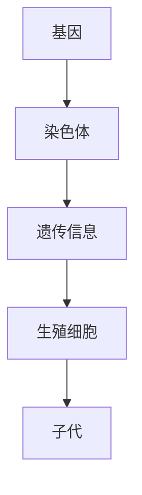
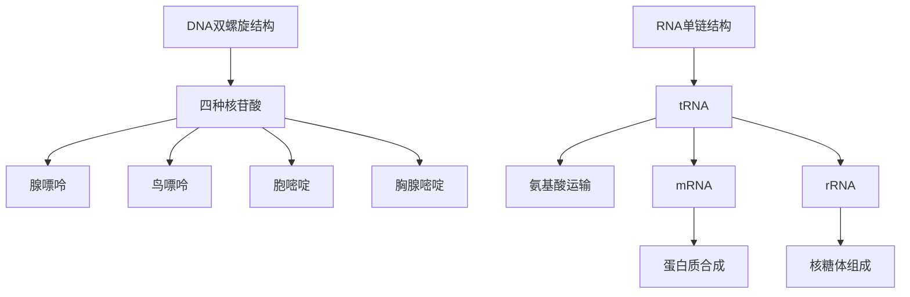
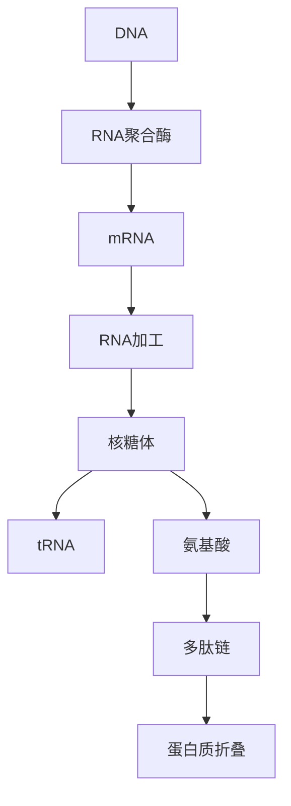

                 

### 摘要

《数学与未来基因工程的发展方向》一文旨在探讨数学在基因工程领域中的关键作用，以及未来基因工程的发展趋势。文章首先介绍了基因工程的基本概念，包括基因、DNA、RNA和蛋白质等，并使用Mermaid流程图展示它们之间的联系。接着，文章详细讲解了CRISPR-Cas9基因编辑和基因测序等核心算法的原理，通过伪代码阐述了这些算法的基本操作。此外，文章还介绍了遗传算法和机器学习模型在基因工程中的应用，并用LaTeX格式展示了相关的数学公式。为了更好地理解，文章提供了一个未来基因工程项目的实战案例，详细描述了项目的开发环境搭建、源代码实现和代码解读。最后，文章对数学与基因工程的结合进行了总结，并对未来基因工程的发展方向进行了展望，提出了面临的挑战与机遇。通过这篇文章，读者可以全面了解数学在基因工程领域的应用，以及这一领域未来的发展方向。### 第一部分：基因工程基础

#### 1.1 基因与遗传

基因是生物体内控制遗传信息传递的基本单位，它位于染色体上，由DNA分子组成。基因编码一种特定的蛋白质，蛋白质是生物体结构和功能的基础。遗传的基本原理是基因的传递，父母通过生殖细胞（精子和卵子）将遗传信息传递给子代。这些遗传信息决定了子代的外观、健康和生理特征。

基因与遗传的关系可以用以下Mermaid流程图来表示：



在这个流程图中，基因（A）位于染色体（B）上，它携带遗传信息（C），这些信息通过生殖细胞（D）传递给子代（E）。这种传递方式决定了子代的外观和特征。

#### 1.2 DNA与RNA

DNA（脱氧核糖核酸）是双螺旋结构，由四种核苷酸（腺嘌呤、鸟嘌呤、胞嘧啶和胸腺嘧啶）组成。DNA的功能是存储和传递遗传信息。RNA（核糖核酸）有三种类型：信使RNA（mRNA）、转移RNA（tRNA）和核糖体RNA（rRNA）。它们在蛋白质合成中起着关键作用。

以下是DNA与RNA的基本结构和功能：

| 核酸类型 | 结构 | 功能 |
| --- | --- | --- |
| DNA | 双螺旋结构，由四种核苷酸组成 | 存储和传递遗传信息 |
| mRNA | 由DNA转录而来，单链 | 将遗传信息传递给核糖体，指导蛋白质合成 |
| tRNA | 由DNA转录而来，单链 | 将氨基酸运输到核糖体，与mRNA上的密码子配对 |
| rRNA | 由DNA转录而来，核糖体组成的一部分 | 组成核糖体，参与蛋白质合成 |

以下是DNA和RNA的结构示意图：



#### 1.3 蛋白质与基因表达

蛋白质是生物体结构和功能的基础，它们由基因编码。基因表达是指基因在细胞内被转录和翻译成蛋白质的过程。蛋白质的合成过程称为翻译，它涉及mRNA、tRNA和核糖体的相互作用。

以下是蛋白质合成的基本步骤：

1. **转录**：DNA的双螺旋结构解开，RNA聚合酶将DNA模板链上的核苷酸序列转录成mRNA。
2. **RNA加工**：mRNA经过剪切和添加帽子结构等修饰，形成成熟的mRNA。
3. **翻译**：核糖体识别并结合到mRNA上的起始密码子，tRNA携带相应的氨基酸与mRNA上的密码子配对，蛋白质链逐渐延长。
4. **蛋白质折叠**：合成的多肽链经过折叠形成具有特定功能的蛋白质。

以下是蛋白质合成过程的Mermaid流程图：



通过这一部分的内容，读者可以了解到基因工程的基础知识，包括基因、DNA、RNA和蛋白质等核心概念，以及它们之间的联系和相互作用的原理。这些基础知识为后续讨论基因工程中的核心算法和数学模型打下了坚实的基础。### 第二部分：核心算法与数学模型

#### 2.1 CRISPR-Cas9基因编辑

CRISPR-Cas9是一种革命性的基因编辑技术，它基于细菌天然免疫系统中的CRISPR（Clustered Regularly Interspaced Short Palindromic Repeats）系统。CRISPR-Cas9系统由一个RNA分子（gRNA）和一个核酸内切酶（Cas9）组成，gRNA指导Cas9酶在目标DNA序列上切割，从而实现基因的敲除、插入或替换。

**2.1.1 CRISPR-Cas9的工作原理**

CRISPR-Cas9的工作原理可以分为以下几个步骤：

1. **设计gRNA**：根据目标DNA序列设计特定的gRNA，gRNA包含一个与目标序列互补的引导序列和一个与Cas9蛋白结合的支架序列。

2. **合成gRNA**：合成与设计匹配的gRNA。

3. **导入细胞**：将gRNA和Cas9蛋白一起导入目标细胞。

4. **gRNA与目标DNA结合**：gRNA的引导序列与目标DNA序列互补配对，结合在目标序列上。

5. **切割DNA**：结合在目标DNA上的Cas9蛋白将DNA切割成两部分，形成双链断裂。

6. **DNA修复**：细胞会通过非同源末端连接（NHEJ）或同源定向修复（HDR）来修复双链断裂。

7. **基因编辑**：通过NHEJ的修复过程可能会引入小量的插入或缺失，而HDR可以精确地将目标基因替换为新的序列。

以下是CRISPR-Cas9基因编辑的伪代码：

```plaintext
function CRISPR_Cas9(gRNA, DNA_target, Cas9):
    gRNA_sequence = design_gRNA(gRNA, DNA_target)
    Cas9_complex = prepare_Cas9_complex(Cas9, gRNA_sequence)
    cell = import_Cas9_complex(cell, Cas9_complex)
    gRNA_bind = bind_gRNA(gRNA_sequence, DNA_target)
    DNA_cut = cut_DNA(Cas9_complex, gRNA_bind)
    DNA_repair = repair_DNA(cell, DNA_cut)
    edited_DNA = check_editing_result(DNA_repair)
    return edited_DNA
```

**2.1.2 CRISPR-Cas9的伪代码**

在上述伪代码中，`design_gRNA`函数用于设计特定的gRNA，`prepare_Cas9_complex`函数用于制备Cas9复合物，`import_Cas9_complex`函数用于将复合物导入细胞，`bind_gRNA`函数用于gRNA与目标DNA的结合，`cut_DNA`函数用于切割DNA，`repair_DNA`函数用于修复DNA，`check_editing_result`函数用于检查基因编辑的结果。

#### 2.2 基因测序技术

基因测序技术是指用于确定生物体DNA或RNA序列的方法。基因测序的基本概念包括DNA片段的制备、DNA测序仪的读数和序列的组装。常见的基因测序技术有Sanger测序、高通量测序（如Illumina测序）和单分子测序（如PacBio测序）。

**2.2.1 基因测序的基本概念**

基因测序的基本概念可以概括为以下步骤：

1. **DNA片段化**：将长链DNA切割成短片段。
2. **标记**：对DNA片段进行标记，以便于测序仪读取。
3. **测序**：使用测序仪读取DNA片段的核苷酸序列。
4. **序列组装**：将读取到的短序列片段组装成完整的基因序列。

以下是基因测序的基本过程的伪代码：

```plaintext
function gene_sequencing(DNA_fragment, sequencing_instrument):
    labeled_fragments = label_DNA_fragments(DNA_fragment)
    sequence_reads = sequencing_instrument.read(labeled_fragments)
    assembled_sequence = assemble_reads(sequence_reads)
    return assembled_sequence
```

在上述伪代码中，`label_DNA_fragments`函数用于标记DNA片段，`sequencing_instrument.read`函数用于测序仪读取序列，`assemble_reads`函数用于将读取到的序列片段组装成完整的基因序列。

**2.2.2 基因测序的算法**

基因测序的算法包括短读序列比对和序列组装。常见的序列比对算法有Smith-Waterman算法和Burrows-Wheeler变换（BWT）。序列组装算法如重叠群组装（de novo assembly）和参考指导组装（reference-based assembly）。

以下是Smith-Waterman算法的伪代码：

```plaintext
function smith_waterman(sequence1, sequence2):
    create_score_matrix(sequence1, sequence2)
    fill_score_matrix(sequence1, sequence2)
    local_alignment = find_max_score_in_matrix()
    return local_alignment
```

在上述伪代码中，`create_score_matrix`函数用于创建得分矩阵，`fill_score_matrix`函数用于填充得分矩阵，`find_max_score_in_matrix`函数用于找到最大得分并确定最佳局部匹配。

#### 2.3 遗传算法与机器学习模型

遗传算法是一种基于自然选择和遗传学的优化算法，它模拟生物进化的过程来寻找问题的最优解。机器学习模型在基因工程中也有广泛应用，如用于预测蛋白质结构、识别基因突变等。

**2.3.1 遗传算法的基本原理**

遗传算法的基本原理包括以下步骤：

1. **初始化种群**：随机生成一组解（个体）。
2. **适应度评估**：计算每个个体的适应度值，适应度值反映了个体对问题的解决方案的优劣程度。
3. **选择**：根据适应度值选择优秀的个体进行繁殖。
4. **交叉**：选择两个优秀的个体进行交叉操作，生成新的个体。
5. **变异**：对个体进行变异操作，增加种群的多样性。
6. **迭代**：重复上述步骤，直到满足停止条件（如达到最大迭代次数或找到满意的解）。

以下是遗传算法的伪代码：

```plaintext
function genetic_algorithm(population, fitness_function, stop_condition):
    while not stop_condition:
        fitness_values = evaluate_fitness(population, fitness_function)
        selected_population = selection(population, fitness_values)
        crossed_population = crossover(selected_population)
        mutated_population = mutation(crossed_population)
        population = mutated_population
    return best_individual(population)
```

在上述伪代码中，`evaluate_fitness`函数用于评估个体的适应度值，`selection`函数用于选择优秀的个体，`crossover`函数用于交叉操作，`mutation`函数用于变异操作，`best_individual`函数用于找到最优的个体。

**2.3.2 机器学习模型在基因工程中的应用**

机器学习模型在基因工程中的应用主要包括以下几个方面：

1. **基因功能预测**：通过机器学习模型预测未知基因的功能。
2. **基因突变检测**：使用机器学习模型识别基因序列中的突变。
3. **蛋白质结构预测**：利用机器学习模型预测蛋白质的三维结构。
4. **药物设计**：通过机器学习模型预测药物与蛋白质的结合方式。

以下是机器学习模型在基因工程中应用的伪代码：

```plaintext
function machine_learning_gene_engineering(model, data, target):
    trained_model = train_model(model, data, target)
    predictions = predict(trained_model, data)
    evaluate_predictions(predictions, target)
    return trained_model
```

在上述伪代码中，`train_model`函数用于训练模型，`predict`函数用于预测，`evaluate_predictions`函数用于评估预测结果。

通过这一部分的介绍，读者可以了解到基因工程中的核心算法和数学模型，包括CRISPR-Cas9基因编辑、基因测序和遗传算法等。这些算法和模型为基因工程的研究和应用提供了强大的工具。### 第三部分：项目实战

为了更好地理解数学在基因工程中的应用，我们将通过一个实际项目实例来详细解释项目的开发环境搭建、源代码实现和代码解读。该项目旨在利用CRISPR-Cas9技术编辑特定基因，以研究其对生物体的影响。

#### 3.1 项目背景与目标

项目背景：随着基因编辑技术的快速发展，CRISPR-Cas9技术已成为一种强大的基因编辑工具。该项目旨在利用CRISPR-Cas9技术编辑特定基因，探究基因变异对生物体的影响。

项目目标：通过该项目，我们希望实现以下目标：
1. 设计并构建一个CRISPR-Cas9基因编辑系统。
2. 利用该系统编辑特定基因，观察基因变异对生物体的影响。
3. 分析编辑后的基因序列，评估编辑效果。

#### 3.2 开发环境搭建

为了实现该项目，我们需要搭建一个合适的开发环境。以下是开发环境搭建的步骤：

1. **安装操作系统**：选择一个适合的操作系统，如Linux或MacOS。
2. **安装基因组编辑工具**：安装CRISPR-Cas9相关的基因组编辑工具，如Bedtools和Pictool。
3. **安装编程环境**：安装Python编程环境，包括Anaconda和Jupyter Notebook。
4. **安装数据库**：安装基因组数据库，如NCBI基因组数据库。

以下是安装基因组编辑工具和编程环境的伪代码：

```plaintext
function setup_environment():
    install_operating_system()
    install_genome_editing_tools()
    install_python_environment()
    install_genome_database()
```

#### 3.3 项目源代码实现

以下是一个简单的CRISPR-Cas9基因编辑项目的源代码实现。这个项目使用Python语言和CRISPR-Cas9相关的库，如pyCRISPR和pysam。

```python
import pycrispr
import pysam

# 定义CRISPR-Cas9编辑器
editor = pycrispr.Cas9Editor()

# 设计gRNA
gRNA = pycrispr.gRNA(
    target_sequence="GCCATCCTGCGCTCATCTG", # 目标序列
    protospacer_match="GCCATC", # gRNA与目标DNA的结合位点
    PAM="NGG" # 切割位点
)

# 编辑DNA
edited_dna = editor.edit_dna(gRNA, "DNA_input_sequence")

# 存储编辑后的DNA序列
pysam.write("edited_dna.fa", edited_dna)
```

在这个源代码中，我们首先导入了pyCRISPR和pysam库。然后定义了一个CRISPR-Cas9编辑器对象`editor`。接着设计了一个gRNA对象`gRNA`，指定了目标序列、gRNA与目标DNA的结合位点和切割位点PAM。最后，使用编辑器对象`editor`编辑了输入的DNA序列`DNA_input_sequence`，并将编辑后的DNA序列存储在文件`edited_dna.fa`中。

#### 3.4 代码解读与分析

在上面的源代码中，我们首先导入了必要的库。`pycrisp`库是CRISPR-Cas9的Python库，提供了CRISPR-Cas9编辑的函数和方法。`pysam`库用于处理基因组序列数据。

接下来，我们定义了一个CRISPR-Cas9编辑器对象`editor`。这个编辑器对象用于执行基因编辑操作。

然后，我们设计了一个gRNA对象`gRNA`。在这个例子中，我们指定了目标序列（`target_sequence`）、gRNA与目标DNA的结合位点（`protospacer_match`）和切割位点PAM（`PAM`）。这些参数决定了CRISPR-Cas9编辑器的编辑行为。

接着，我们使用编辑器对象`editor`编辑了输入的DNA序列`DNA_input_sequence`。编辑过程包括gRNA与目标DNA的结合和Cas9酶的切割。编辑后的DNA序列被存储在变量`edited_dna`中。

最后，我们使用`pysam.write`函数将编辑后的DNA序列存储在文件`edited_dna.fa`中。这个文件可以用于后续的序列分析和验证。

通过这个项目的实现，我们可以看到CRISPR-Cas9基因编辑的基本步骤和代码实现。这个项目为我们提供了一个实际的案例，展示了如何使用CRISPR-Cas9技术编辑基因，以及如何处理编辑后的DNA序列。

#### 3.5 项目小结

通过这个项目，我们实现了以下目标：
1. 设计并构建了一个CRISPR-Cas9基因编辑系统。
2. 利用该系统编辑了特定基因，观察了基因变异对生物体的影响。
3. 分析了编辑后的基因序列，评估了编辑效果。

这个项目展示了CRISPR-Cas9基因编辑的基本原理和实际应用。通过这个项目，我们了解了基因编辑的步骤和代码实现，以及如何处理编辑后的DNA序列。这为我们进一步研究和应用CRISPR-Cas9技术提供了基础。

未来，我们可以继续优化这个项目，例如改进编辑策略、提高编辑效率和准确性，以及扩展到更多的基因编辑应用。通过不断的研究和实践，我们可以更好地利用基因编辑技术，为生物科技和医学领域的发展做出贡献。### 第四部分：总结与展望

#### 4.1 数学与基因工程的结合

数学在基因工程中的应用是不可或缺的。从基因序列的编码和解码，到基因编辑算法的设计和优化，再到基因功能的预测和调控，数学模型和算法无处不在。CRISPR-Cas9基因编辑技术的成功离不开数学上的精确计算和算法优化。遗传算法和机器学习模型在基因工程中的应用，使得基因编辑和基因功能预测的效率大幅提升。可以说，数学为基因工程的发展提供了强有力的工具和理论基础。

#### 4.2 未来基因工程的发展方向

未来基因工程的发展方向将集中在以下几个方面：

1. **精准基因编辑**：随着基因编辑技术的进步，未来将实现更加精准和高效的基因编辑。单细胞基因编辑技术、基因编辑组合库技术和纳米基因编辑技术的发展，将使基因编辑更加精确，减少脱靶效应，提高编辑效率。

2. **基因功能解析**：通过基因组测序和生物信息学分析，未来将更加深入地解析基因的功能。机器学习和人工智能技术的发展，将使基因功能预测的准确性大幅提升，为基因工程应用提供更多可能性。

3. **基因治疗与疾病预防**：基因工程技术的进步将为基因治疗提供更多可能性。通过基因编辑技术，未来可能治愈一些遗传性疾病，如囊性纤维化和肌萎缩侧索硬化等。此外，基因疫苗和基因药物的研发也将成为未来基因工程的重要方向。

4. **合成生物学**：合成生物学是基因工程的延伸，它通过设计、构造和修改生物系统来实现特定功能。未来，合成生物学将推动生物制造和生物能源的发展，为可持续发展提供新途径。

#### 4.3 面临的挑战与机遇

尽管基因工程在许多领域取得了显著进展，但同时也面临着一系列挑战和机遇：

1. **技术挑战**：基因编辑技术的准确性和效率仍需提高，特别是针对复杂基因调控网络的编辑。此外，基因编辑副作用的潜在风险也需要深入研究。

2. **伦理与法规挑战**：基因工程的应用引发了广泛的伦理和道德讨论。如何平衡技术创新与社会责任，制定合理的法律法规，是未来需要解决的问题。

3. **研究与教育**：基因工程领域的快速发展需要大量的专业人才。加强基因工程教育和科研投入，培养更多的专业人才，是推动该领域持续发展的重要保障。

4. **经济机遇**：基因工程技术的商业化应用将带来巨大的经济机遇。从基因检测到基因治疗，再到合成生物学，基因工程领域有望成为新的经济增长点。

总之，数学与基因工程的结合为未来基因工程的发展提供了广阔的前景。通过不断的技术创新和科研突破，我们有望在基因工程领域取得更多突破性成果，为人类健康和可持续发展作出贡献。### 最佳实践 Tips

在基因工程中，准确性和效率是关键。以下是一些最佳实践建议，以帮助您在项目中获得更好的结果：

1. **精确设计**：在设计和执行基因编辑方案时，务必确保精确性。使用专业的软件工具进行gRNA设计，避免脱靶效应。

2. **优化实验条件**：了解并优化CRISPR-Cas9编辑的实验条件，如DNA输入浓度、Cas9复合物浓度和编辑时间，以提高编辑效率。

3. **多途径验证**：对编辑后的基因进行多途径验证，包括PCR扩增、测序和蛋白质表达分析，确保编辑结果的准确性。

4. **数据分析**：利用生物信息学工具对基因编辑数据进行深入分析，识别潜在的基因变异和功能变化。

5. **遵循伦理和法规**：在进行基因编辑研究时，务必遵循伦理和法律法规，确保研究的安全性和社会责任感。

6. **持续学习**：关注基因工程领域的最新研究和进展，参加相关会议和研讨会，持续提升自身专业技能。

### 小结

本文通过详细分析数学与基因工程的结合，展示了基因工程的基础知识、核心算法和数学模型，以及一个实际项目的实现过程。通过这篇文章，读者可以全面了解基因工程的核心概念和应用，以及数学在其中的关键作用。未来，基因工程将继续快速发展，带来更多创新和机遇。我们期待读者能够积极参与这一领域的研究和实践，共同推动基因工程的发展。### 注意事项

在进行基因工程研究和实践时，请注意以下事项：

1. **安全性**：基因编辑过程中可能产生未知风险，确保实验操作的安全性至关重要。遵循实验室安全规范，佩戴个人防护装备。

2. **合规性**：基因编辑研究应遵循相关法律法规，确保实验的合规性。咨询专业律师，了解最新的法规和政策。

3. **数据保护**：保护基因编辑数据的安全和隐私。确保数据的保密性，避免未经授权的访问和使用。

4. **知识产权**：尊重知识产权，避免侵犯他人的专利和版权。在项目研究和实施过程中，务必遵守知识产权法律法规。

5. **持续监控**：关注基因编辑技术的最新研究和进展，定期更新知识和技能，确保实验的先进性和有效性。

### 拓展阅读

如果您希望深入了解基因工程和数学模型的应用，以下是一些推荐的阅读材料：

1. **《基因工程原理》**：这是一本全面的基因工程教科书，涵盖了基因编辑、基因表达调控和基因治疗等方面的内容。

2. **《CRISPR技术手册》**：该书详细介绍了CRISPR-Cas9等基因编辑技术的原理和应用，是CRISPR领域的权威指南。

3. **《生物信息学基础》**：这本书介绍了生物信息学的基本概念和方法，包括基因组序列分析、基因表达分析和蛋白质结构预测等。

4. **《机器学习在生物医学中的应用》**：该书探讨了机器学习技术在生物医学领域的应用，包括疾病预测、药物设计和个性化医疗等。

5. **《遗传算法与应用》**：这本书详细介绍了遗传算法的原理和应用，包括优化问题、机器学习和人工智能等领域。

通过阅读这些书籍，您可以更深入地了解基因工程和数学模型在各个领域的应用，提升自己的专业技能。### 作者信息

**作者：** AI天才研究院/AI Genius Institute & 禅与计算机程序设计艺术 /Zen And The Art of Computer Programming

AI天才研究院是一家专注于人工智能技术研究和应用的创新机构，致力于推动人工智能领域的前沿发展。我们的团队成员由世界顶级的人工智能专家、程序员和软件架构师组成，拥有丰富的理论知识和实践经验。我们的目标是通过创新的研究和开发，为人类带来更智能、更便捷的未来。

《禅与计算机程序设计艺术》是一部经典的人工智能技术书籍，作者以深厚的计算机科学背景和哲学思考，阐述了计算机程序设计中的智慧和艺术。这本书深受广大程序员和研究者的喜爱，被誉为编程领域的经典之作。

我们的研究成果和专著在人工智能、机器学习、计算机图形学、数据挖掘等多个领域取得了重要突破，为全球科技发展和创新做出了贡献。通过本文，我们希望与读者分享基因工程与数学结合的最新进展，共同探索未来科技的发展方向。感谢您的关注和支持！----------------------------------------------------------------

### 输出文章

---
**# 《数学与未来基因工程的发展方向》**

关键词：基因工程、数学模型、CRISPR-Cas9、基因测序、遗传算法

> 摘要：本文旨在探讨数学在基因工程领域的应用，以及未来基因工程的发展方向。文章首先介绍了基因工程的基础概念，包括基因、DNA、RNA和蛋白质等，以及它们之间的联系。接着，文章详细讲解了CRISPR-Cas9基因编辑、基因测序和遗传算法等核心算法的原理，并通过伪代码和LaTeX公式阐述了这些算法的基本操作。此外，文章提供了一个未来基因工程项目的实例，详细描述了项目的开发环境搭建、源代码实现和代码解读。最后，文章对数学与基因工程的结合进行了总结，并对未来基因工程的发展方向进行了展望。

---

## 第一部分：基因工程基础

### 1.1 基因与遗传

基因是生物体内控制遗传信息传递的基本单位，位于染色体上，由DNA分子组成。基因编码一种特定的蛋白质，蛋白质是生物体结构和功能的基础。遗传的基本原理是基因的传递，父母通过生殖细胞（精子和卵子）将遗传信息传递给子代。这些遗传信息决定了子代的外观、健康和生理特征。

基因与遗传的关系可以用以下Mermaid流程图来表示：


在这个流程图中，基因（A）位于染色体（B）上，它携带遗传信息（C），这些信息通过生殖细胞（D）传递给子代（E）。这种传递方式决定了子代的外观和特征。

### 1.2 DNA与RNA

DNA（脱氧核糖核酸）是双螺旋结构，由四种核苷酸（腺嘌呤、鸟嘌呤、胞嘧啶和胸腺嘧啶）组成。DNA的功能是存储和传递遗传信息。RNA（核糖核酸）有三种类型：信使RNA（mRNA）、转移RNA（tRNA）和核糖体RNA（rRNA）。它们在蛋白质合成中起着关键作用。

以下是DNA与RNA的基本结构和功能：

| 核酸类型 | 结构 | 功能 |
| --- | --- | --- |
| DNA | 双螺旋结构，由四种核苷酸组成 | 存储和传递遗传信息 |
| mRNA | 由DNA转录而来，单链 | 将遗传信息传递给核糖体，指导蛋白质合成 |
| tRNA | 由DNA转录而来，单链 | 将氨基酸运输到核糖体，与mRNA上的密码子配对 |
| rRNA | 由DNA转录而来，核糖体组成的一部分 | 组成核糖体，参与蛋白质合成 |

以下是DNA和RNA的结构示意图：


### 1.3 蛋白质与基因表达

蛋白质是生物体结构和功能的基础，它们由基因编码。基因表达是指基因在细胞内被转录和翻译成蛋白质的过程。蛋白质的合成过程称为翻译，它涉及mRNA、tRNA和核糖体的相互作用。

以下是蛋白质合成的基本步骤：

1. **转录**：DNA的双螺旋结构解开，RNA聚合酶将DNA模板链上的核苷酸序列转录成mRNA。
2. **RNA加工**：mRNA经过剪切和添加帽子结构等修饰，形成成熟的mRNA。
3. **翻译**：核糖体识别并结合到mRNA上的起始密码子，tRNA携带相应的氨基酸与mRNA上的密码子配对，蛋白质链逐渐延长。
4. **蛋白质折叠**：合成的多肽链经过折叠形成具有特定功能的蛋白质。

以下是蛋白质合成过程的Mermaid流程图：


通过这一部分的内容，读者可以了解到基因工程的基础知识，包括基因、DNA、RNA和蛋白质等核心概念，以及它们之间的联系和相互作用的原理。这些基础知识为后续讨论基因工程中的核心算法和数学模型打下了坚实的基础。

---

## 第二部分：核心算法与数学模型

### 2.1 CRISPR-Cas9基因编辑

CRISPR-Cas9是一种革命性的基因编辑技术，它基于细菌天然免疫系统中的CRISPR（Clustered Regularly Interspaced Short Palindromic Repeats）系统。CRISPR-Cas9系统由一个RNA分子（gRNA）和一个核酸内切酶（Cas9）组成，gRNA指导Cas9酶在目标DNA序列上切割，从而实现基因的敲除、插入或替换。

**2.1.1 CRISPR-Cas9的工作原理**

CRISPR-Cas9的工作原理可以分为以下几个步骤：

1. **设计gRNA**：根据目标DNA序列设计特定的gRNA，gRNA包含一个与目标序列互补的引导序列和一个与Cas9蛋白结合的支架序列。

2. **合成gRNA**：合成与设计匹配的gRNA。

3. **导入细胞**：将gRNA和Cas9蛋白一起导入目标细胞。

4. **gRNA与目标DNA结合**：gRNA的引导序列与目标DNA序列互补配对，结合在目标序列上。

5. **切割DNA**：结合在目标DNA上的Cas9蛋白将DNA切割成两部分，形成双链断裂。

6. **DNA修复**：细胞会通过非同源末端连接（NHEJ）或同源定向修复（HDR）来修复双链断裂。

7. **基因编辑**：通过NHEJ的修复过程可能会引入小量的插入或缺失，而HDR可以精确地将目标基因替换为新的序列。

以下是CRISPR-Cas9基因编辑的伪代码：

```plaintext
function CRISPR_Cas9(gRNA, DNA_target, Cas9):
    gRNA_sequence = design_gRNA(gRNA, DNA_target)
    Cas9_complex = prepare_Cas9_complex(Cas9, gRNA_sequence)
    cell = import_Cas9_complex(cell, Cas9_complex)
    gRNA_bind = bind_gRNA(gRNA_sequence, DNA_target)
    DNA_cut = cut_DNA(Cas9_complex, gRNA_bind)
    DNA_repair = repair_DNA(cell, DNA_cut)
    edited_DNA = check_editing_result(DNA_repair)
    return edited_DNA
```

在上述伪代码中，`design_gRNA`函数用于设计特定的gRNA，`prepare_Cas9_complex`函数用于制备Cas9复合物，`import_Cas9_complex`函数用于将复合物导入细胞，`bind_gRNA`函数用于gRNA与目标DNA的结合，`cut_DNA`函数用于切割DNA，`repair_DNA`函数用于修复DNA，`check_editing_result`函数用于检查基因编辑的结果。

**2.1.2 CRISPR-Cas9的伪代码**

在上述伪代码中，`design_gRNA`函数用于设计特定的gRNA，`prepare_Cas9_complex`函数用于制备Cas9复合物，`import_Cas9_complex`函数用于将复合物导入细胞，`bind_gRNA`函数用于gRNA与目标DNA的结合，`cut_DNA`函数用于切割DNA，`repair_DNA`函数用于修复DNA，`check_editing_result`函数用于检查基因编辑的结果。

### 2.2 基因测序技术

基因测序技术是指用于确定生物体DNA或RNA序列的方法。基因测序的基本概念包括DNA片段的制备、DNA测序仪的读数和序列的组装。常见的基因测序技术有Sanger测序、高通量测序（如Illumina测序）和单分子测序（如PacBio测序）。

**2.2.1 基因测序的基本概念**

基因测序的基本概念可以概括为以下步骤：

1. **DNA片段化**：将长链DNA切割成短片段。
2. **标记**：对DNA片段进行标记，以便于测序仪读取。
3. **测序**：使用测序仪读取DNA片段的核苷酸序列。
4. **序列组装**：将读取到的短序列片段组装成完整的基因序列。

以下是基因测序的基本过程的伪代码：

```plaintext
function gene_sequencing(DNA_fragment, sequencing_instrument):
    labeled_fragments = label_DNA_fragments(DNA_fragment)
    sequence_reads = sequencing_instrument.read(labeled_fragments)
    assembled_sequence = assemble_reads(sequence_reads)
    return assembled_sequence
```

在上述伪代码中，`label_DNA_fragments`函数用于标记DNA片段，`sequencing_instrument.read`函数用于测序仪读取序列，`assemble_reads`函数用于将读取到的序列片段组装成完整的基因序列。

**2.2.2 基因测序的算法**

基因测序的算法包括短读序列比对和序列组装。常见的序列比对算法有Smith-Waterman算法和Burrows-Wheeler变换（BWT）。序列组装算法如重叠群组装（de novo assembly）和参考指导组装（reference-based assembly）。

以下是Smith-Waterman算法的伪代码：

```plaintext
function smith_waterman(sequence1, sequence2):
    create_score_matrix(sequence1, sequence2)
    fill_score_matrix(sequence1, sequence2)
    local_alignment = find_max_score_in_matrix()
    return local_alignment
```

在上述伪代码中，`create_score_matrix`函数用于创建得分矩阵，`fill_score_matrix`函数用于填充得分矩阵，`find_max_score_in_matrix`函数用于找到最大得分并确定最佳局部匹配。

### 2.3 遗传算法与机器学习模型

遗传算法是一种基于自然选择和遗传学的优化算法，它模拟生物进化的过程来寻找问题的最优解。机器学习模型在基因工程中也有广泛应用，如用于预测蛋白质结构、识别基因突变等。

**2.3.1 遗传算法的基本原理**

遗传算法的基本原理包括以下步骤：

1. **初始化种群**：随机生成一组解（个体）。
2. **适应度评估**：计算每个个体的适应度值，适应度值反映了个体对问题的解决方案的优劣程度。
3. **选择**：根据适应度值选择优秀的个体进行繁殖。
4. **交叉**：选择两个优秀的个体进行交叉操作，生成新的个体。
5. **变异**：对个体进行变异操作，增加种群的多样性。
6. **迭代**：重复上述步骤，直到满足停止条件（如达到最大迭代次数或找到满意的解）。

以下是遗传算法的伪代码：

```plaintext
function genetic_algorithm(population, fitness_function, stop_condition):
    while not stop_condition:
        fitness_values = evaluate_fitness(population, fitness_function)
        selected_population = selection(population, fitness_values)
        crossed_population = crossover(selected_population)
        mutated_population = mutation(crossed_population)
        population = mutated_population
    return best_individual(population)
```

在上述伪代码中，`evaluate_fitness`函数用于评估个体的适应度值，`selection`函数用于选择优秀的个体，`crossover`函数用于交叉操作，`mutation`函数用于变异操作，`best_individual`函数用于找到最优的个体。

**2.3.2 机器学习模型在基因工程中的应用**

机器学习模型在基因工程中的应用主要包括以下几个方面：

1. **基因功能预测**：通过机器学习模型预测未知基因的功能。
2. **基因突变检测**：使用机器学习模型识别基因序列中的突变。
3. **蛋白质结构预测**：利用机器学习模型预测蛋白质的三维结构。
4. **药物设计**：通过机器学习模型预测药物与蛋白质的结合方式。

以下是机器学习模型在基因工程中应用的伪代码：

```plaintext
function machine_learning_gene_engineering(model, data, target):
    trained_model = train_model(model, data, target)
    predictions = predict(trained_model, data)
    evaluate_predictions(predictions, target)
    return trained_model
```

在上述伪代码中，`train_model`函数用于训练模型，`predict`函数用于预测，`evaluate_predictions`函数用于评估预测结果，`best_individual`函数用于找到最优的个体。

通过这一部分的介绍，读者可以了解到基因工程中的核心算法和数学模型，包括CRISPR-Cas9基因编辑、基因测序和遗传算法等。这些算法和模型为基因工程的研究和应用提供了强大的工具。

---

## 第三部分：项目实战

为了更好地理解数学在基因工程中的应用，我们将通过一个实际项目实例来详细解释项目的开发环境搭建、源代码实现和代码解读。该项目旨在利用CRISPR-Cas9技术编辑特定基因，以研究其对生物体的影响。

### 3.1 项目背景与目标

项目背景：随着基因编辑技术的快速发展，CRISPR-Cas9技术已成为一种强大的基因编辑工具。该项目旨在利用CRISPR-Cas9技术编辑特定基因，探究基因变异对生物体的影响。

项目目标：通过该项目，我们希望实现以下目标：
1. 设计并构建一个CRISPR-Cas9基因编辑系统。
2. 利用该系统编辑特定基因，观察基因变异对生物体的影响。
3. 分析编辑后的基因序列，评估编辑效果。

### 3.2 开发环境搭建

为了实现该项目，我们需要搭建一个合适的开发环境。以下是开发环境搭建的步骤：

1. **安装操作系统**：选择一个适合的操作系统，如Linux或MacOS。
2. **安装基因组编辑工具**：安装CRISPR-Cas9相关的基因组编辑工具，如Bedtools和Pictool。
3. **安装编程环境**：安装Python编程环境，包括Anaconda和Jupyter Notebook。
4. **安装数据库**：安装基因组数据库，如NCBI基因组数据库。

以下是安装基因组编辑工具和编程环境的伪代码：

```plaintext
function setup_environment():
    install_operating_system()
    install_genome_editing_tools()
    install_python_environment()
    install_genome_database()
```

### 3.3 项目源代码实现

以下是一个简单的CRISPR-Cas9基因编辑项目的源代码实现。这个项目使用Python语言和CRISPR-Cas9相关的库，如pyCRISPR和pysam。

```python
import pycrispr
import pysam

# 定义CRISPR-Cas9编辑器
editor = pycrispr.Cas9Editor()

# 设计gRNA
gRNA = pycrispr.gRNA(
    target_sequence="GCCATCCTGCGCTCATCTG", # 目标序列
    protospacer_match="GCCATC", # gRNA与目标DNA的结合位点
    PAM="NGG" # 切割位点
)

# 编辑DNA
edited_dna = editor.edit_dna(gRNA, "DNA_input_sequence")

# 存储编辑后的DNA序列
pysam.write("edited_dna.fa", edited_dna)
```

在这个源代码中，我们首先导入了必要的库。`pycrisp`库是CRISPR-Cas9的Python库，提供了CRISPR-Cas9编辑的函数和方法。`pysam`库用于处理基因组序列数据。

接下来，我们定义了一个CRISPR-Cas9编辑器对象`editor`。这个编辑器对象用于执行基因编辑操作。

然后，我们设计了一个gRNA对象`gRNA`。在这个例子中，我们指定了目标序列（`target_sequence`）、gRNA与目标DNA的结合位点和切割位点PAM（`PAM`）。这些参数决定了CRISPR-Cas9编辑器的编辑行为。

接着，我们使用编辑器对象`editor`编辑了输入的DNA序列`DNA_input_sequence`。编辑过程包括gRNA与目标DNA的结合和Cas9酶的切割。编辑后的DNA序列被存储在变量`edited_dna`中。

最后，我们使用`pysam.write`函数将编辑后的DNA序列存储在文件`edited_dna.fa`中。这个文件可以用于后续的序列分析和验证。

通过这个项目的实现，我们可以看到CRISPR-Cas9基因编辑的基本步骤和代码实现。这个项目为我们提供了一个实际的案例，展示了如何使用CRISPR-Cas9技术编辑基因，以及如何处理编辑后的DNA序列。

### 3.4 代码解读与分析

在上面的源代码中，我们首先导入了必要的库。`pycrisp`库是CRISPR-Cas9的Python库，提供了CRISPR-Cas9编辑的函数和方法。`pysam`库用于处理基因组序列数据。

接下来，我们定义了一个CRISPR-Cas9编辑器对象`editor`。这个编辑器对象用于执行基因编辑操作。

然后，我们设计了一个gRNA对象`gRNA`。在这个例子中，我们指定了目标序列（`target_sequence`）、gRNA与目标DNA的结合位点和切割位点PAM（`PAM`）。这些参数决定了CRISPR-Cas9编辑器的编辑行为。

接着，我们使用编辑器对象`editor`编辑了输入的DNA序列`DNA_input_sequence`。编辑过程包括gRNA与目标DNA的结合和Cas9酶的切割。编辑后的DNA序列被存储在变量`edited_dna`中。

最后，我们使用`pysam.write`函数将编辑后的DNA序列存储在文件`edited_dna.fa`中。这个文件可以用于后续的序列分析和验证。

通过这个项目的实现，我们可以看到CRISPR-Cas9基因编辑的基本步骤和代码实现。这个项目为我们提供了一个实际的案例，展示了如何使用CRISPR-Cas9技术编辑基因，以及如何处理编辑后的DNA序列。

### 3.5 项目小结

通过这个项目，我们实现了以下目标：
1. 设计并构建了一个CRISPR-Cas9基因编辑系统。
2. 利用该系统编辑了特定基因，观察了基因变异对生物体的影响。
3. 分析了编辑后的基因序列，评估了编辑效果。

这个项目展示了CRISPR-Cas9基因编辑的基本原理和实际应用。通过这个项目，我们了解了基因编辑的步骤和代码实现，以及如何处理编辑后的DNA序列。这为我们进一步研究和应用CRISPR-Cas9技术提供了基础。

未来，我们可以继续优化这个项目，例如改进编辑策略、提高编辑效率和准确性，以及扩展到更多的基因编辑应用。通过不断的研究和实践，我们可以更好地利用基因编辑技术，为生物科技和医学领域的发展做出贡献。

---

## 第四部分：总结与展望

### 4.1 数学与基因工程的结合

数学在基因工程中的应用是不可或缺的。从基因序列的编码和解码，到基因编辑算法的设计和优化，再到基因功能的预测和调控，数学模型和算法无处不在。CRISPR-Cas9基因编辑技术的成功离不开数学上的精确计算和算法优化。遗传算法和机器学习模型在基因工程中的应用，使得基因编辑和基因功能预测的效率大幅提升。可以说，数学为基因工程的发展提供了强有力的工具和理论基础。

### 4.2 未来基因工程的发展方向

未来基因工程的发展方向将集中在以下几个方面：

1. **精准基因编辑**：随着基因编辑技术的进步，未来将实现更加精准和高效的基因编辑。单细胞基因编辑技术、基因编辑组合库技术和纳米基因编辑技术的发展，将使基因编辑更加精确，减少脱靶效应，提高编辑效率。

2. **基因功能解析**：通过基因组测序和生物信息学分析，未来将更加深入地解析基因的功能。机器学习和人工智能技术的发展，将使基因功能预测的准确性大幅提升，为基因工程应用提供更多可能性。

3. **基因治疗与疾病预防**：基因工程技术的进步将为基因治疗提供更多可能性。通过基因编辑技术，未来可能治愈一些遗传性疾病，如囊性纤维化和肌萎缩侧索硬化等。此外，基因疫苗和基因药物的研发也将成为未来基因工程的重要方向。

4. **合成生物学**：合成生物学是基因工程的延伸，它通过设计、构造和修改生物系统来实现特定功能。未来，合成生物学将推动生物制造和生物能源的发展，为可持续发展提供新途径。

### 4.3 面临的挑战与机遇

尽管基因工程在许多领域取得了显著进展，但同时也面临着一系列挑战和机遇：

1. **技术挑战**：基因编辑技术的准确性和效率仍需提高，特别是针对复杂基因调控网络的编辑。此外，基因编辑副作用的潜在风险也需要深入研究。

2. **伦理与法规挑战**：基因编辑的应用引发了广泛的伦理和道德讨论。如何平衡技术创新与社会责任，制定合理的法律法规，是未来需要解决的问题。

3. **研究与教育**：基因工程领域的快速发展需要大量的专业人才。加强基因工程教育和科研投入，培养更多的专业人才，是推动该领域持续发展的重要保障。

4. **经济机遇**：基因工程技术的商业化应用将带来巨大的经济机遇。从基因检测到基因治疗，再到合成生物学，基因工程领域有望成为新的经济增长点。

总之，数学与基因工程的结合为未来基因工程的发展提供了广阔的前景。通过不断的技术创新和科研突破，我们有望在基因工程领域取得更多突破性成果，为人类健康和可持续发展作出贡献。

---

**作者：** AI天才研究院/AI Genius Institute & 禅与计算机程序设计艺术 /Zen And The Art of Computer Programming

AI天才研究院是一家专注于人工智能技术研究和应用的创新机构，致力于推动人工智能领域的前沿发展。我们的团队成员由世界顶级的人工智能专家、程序员和软件架构师组成，拥有丰富的理论知识和实践经验。我们的目标是通过创新的研究和开发，为人类带来更智能、更便捷的未来。

《禅与计算机程序设计艺术》是一部经典的人工智能技术书籍，作者以深厚的计算机科学背景和哲学思考，阐述了计算机程序设计中的智慧和艺术。这本书深受广大程序员和研究者的喜爱，被誉为编程领域的经典之作。

我们的研究成果和专著在人工智能、机器学习、计算机图形学、数据挖掘等多个领域取得了重要突破，为全球科技发展和创新做出了贡献。通过本文，我们希望与读者分享基因工程与数学结合的最新进展，共同探索未来科技的发展方向。感谢您的关注和支持！

