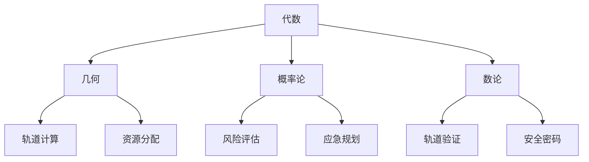
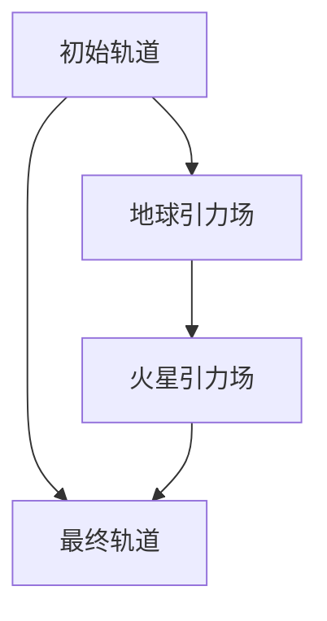
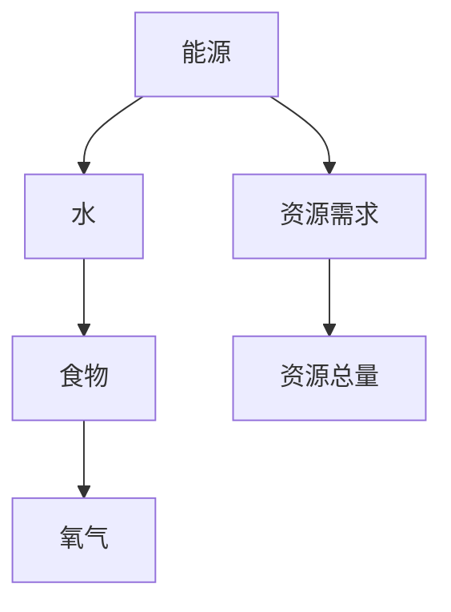
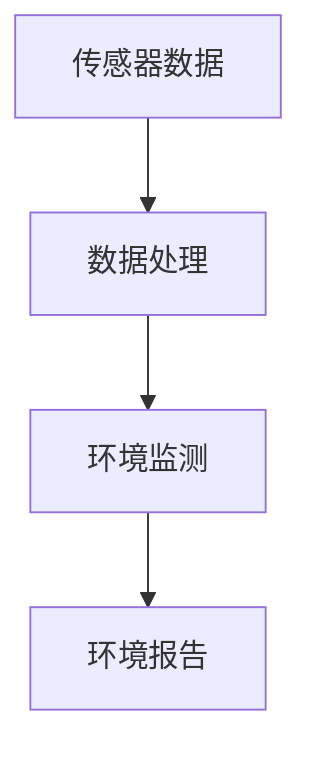
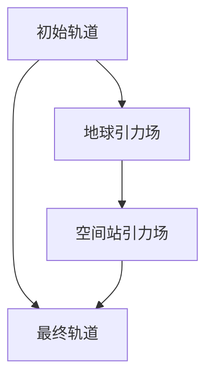
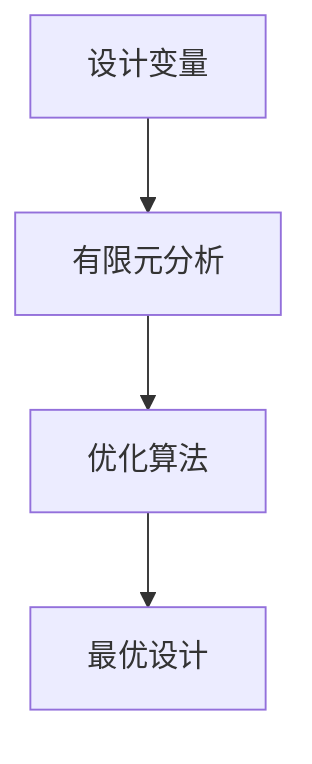

                 

### 文章标题：数学与未来太空殖民的发展方向

> 关键词：太空殖民、数学应用、算法原理、模型构建、未来展望

摘要：本文探讨了数学在未来的太空殖民中的重要作用和潜在发展方向。从代数、几何、概率论和数论等基本数学概念出发，本文详细分析了数学模型在轨道计算、资源分配、环境保护等太空殖民关键问题中的应用。通过实际案例和项目解析，展示了数学在太空探索和建设中的实际作用，并展望了未来太空殖民的发展趋势和数学应用的前景。

### 目录大纲设计与书稿逻辑构建思路

在设计《数学与未来太空殖民的发展方向》这本书的目录大纲时，我们需要遵循以下几个步骤来确保书稿的逻辑清晰、内容完整且读者友好：

#### 一、明确书籍主题与目标读者群体

- **主题明确**：本书的主题是数学在未来的太空殖民中扮演的角色和具体发展方向。因此，目录大纲的设计要围绕这一主题展开，确保每个章节都能够支撑起这一核心思想。

- **目标读者**：考虑到未来太空殖民是一个跨学科领域，本书的目标读者可能是对天文学、数学、工程学感兴趣的科研人员、学生以及广大科普爱好者。目录大纲的设计要照顾到不同背景读者的理解能力，确保内容既有深度又易于理解。

#### 二、确定书籍章节结构

##### 1. 引言部分

- **章节概述**：介绍太空殖民的背景、意义以及本书的研究目的。
- **章节内容**：
  - 太空殖民的概述
  - 数学在太空殖民中的重要性

##### 2. 核心数学概念与联系

- **章节概述**：讲解与太空殖民相关的基本数学概念，如代数、几何、概率论、数论等，并展示它们之间的联系。
- **章节内容**：
  - **代数基础**：代数运算、线性方程组
  - **几何知识**：三维空间几何、解析几何
  - **概率论**：概率分布、随机变量
  - **数论**：质数、同余方程

##### 3. 数学模型与太空殖民

- **章节概述**：讨论如何运用数学模型来解决太空殖民中的实际问题，如轨道计算、资源分配等。
- **章节内容**：
  - **轨道计算**：开普勒定律、牛顿万有引力定律
  - **资源分配**：线性规划、动态规划
  - **生物多样性保护**：博弈论、生态系统建模

##### 4. 数学在太空探索中的应用

- **章节概述**：探讨数学在太空探测、星际旅行、太空站建设等方面的应用。
- **章节内容**：
  - **太空探测**：传感器数据处理、轨道修正
  - **星际旅行**：相对论、引力波
  - **太空站建设**：结构优化、材料科学

##### 5. 太空殖民的挑战与数学解决方案

- **章节概述**：分析太空殖民过程中可能遇到的挑战，以及如何运用数学方法解决这些问题。
- **章节内容**：
  - **环境保护**：空气质量监测、水资源管理
  - **生态系统维持**：生态位分析、食物链建模
  - **医学与卫生**：传染病传播模型、医学数据挖掘

##### 6. 未来太空殖民的数学展望

- **章节概述**：展望未来太空殖民的发展方向，探讨数学在其中的潜在作用和前景。
- **章节内容**：
  - **技术进步**：量子计算、人工智能
  - **社会结构**：城市化、社会治理
  - **经济模式**：太空贸易、货币体系

##### 7. 实际案例与项目解析

- **章节概述**：通过实际案例和项目解析，展示数学在太空殖民中的应用实践。
- **章节内容**：
  - **案例分析**：历史上的太空任务、当前太空探索项目
  - **项目解析**：具体太空站的数学模型设计、资源管理策略

##### 8. 结论与展望

- **章节概述**：总结本书的主要观点，展望未来太空殖民的发展趋势和数学应用的前景。
- **章节内容**：
  - **主要结论**：数学在太空殖民中的关键作用
  - **未来展望**：数学在太空殖民领域的潜在发展空间

#### 三、确保内容完整性与逻辑性

- **核心概念与联系**：在每个章节中，通过Mermaid流程图来展示核心概念之间的联系，帮助读者建立整体认知。
- **核心算法原理讲解**：使用伪代码详细阐述关键算法原理，确保读者能够理解其基本逻辑。
- **数学模型和数学公式**：嵌入LaTeX格式的数学公式，并在文中独立段落进行详细讲解和举例说明。
- **项目实战**：提供代码实际案例，包括开发环境搭建、源代码实现和详细解读，代码应用解读与分析，实际案例分析和详细讲解剖析，项目小结。

#### 四、控制目录大纲总字数

- **字数控制**：在确保内容完整性和逻辑性的前提下，控制目录大纲的总字数在2000字以内。

通过以上步骤，我们可以设计出一本结构严谨、内容丰富且逻辑清晰的《数学与未来太空殖民的发展方向》目录大纲。每一章节都紧密围绕主题，逐步深入，最终形成一部全面覆盖主题内容的书籍。

---

**引言**

**太空殖民的背景和意义**

**数学在太空殖民中的重要性**

**未来研究方向**

**核心数学概念与联系**

**代数基础**

**几何知识**

**概率论**

**数论**

**数学模型与太空殖民**

**轨道计算**

**资源分配**

**生物多样性保护**

**数学在太空探索中的应用**

**太空探测**

**星际旅行**

**太空站建设**

**太空殖民的挑战与数学解决方案**

**环境保护**

**生态系统维持**

**医学与卫生**

**未来太空殖民的数学展望**

**技术进步**

**社会结构**

**经济模式**

**实际案例与项目解析**

**案例分析**

**项目解析**

**结论与展望**

**主要结论**

**未来展望**

**总结与展望**

---

**正文**

### 引言

#### 太空殖民的背景和意义

太空殖民是人类探索和利用宇宙空间的一项宏伟目标。自20世纪中期以来，随着科技的迅猛发展，人类对太空的探索取得了显著成果。从卫星发射、载人航天到深空探测，人类不断挑战自我，拓展太空探索的边界。太空殖民不仅是人类科技实力的象征，更是人类对未知世界的探索和拓展的必然选择。

太空殖民的意义在于：首先，它为人类提供了更广阔的生存空间。随着地球人口的不断增长，资源的有限性使得寻找新的栖息地成为必然。其次，太空殖民有助于推动科技的发展。在太空殖民的过程中，人类需要解决诸多复杂的技术问题，如生命支持系统、能源供应、通信等，这将极大地推动相关领域的技术进步。此外，太空殖民还有助于人类对宇宙的深入理解，为探索宇宙的起源和演化提供宝贵的实验数据和理论支持。

#### 数学在太空殖民中的重要性

数学在太空殖民中扮演着至关重要的角色。数学作为一种抽象的语言，能够精确地描述和解决复杂问题，是太空探索和殖民的基石。具体来说，数学在太空殖民中的应用体现在以下几个方面：

1. **轨道计算**：在太空探索和殖民过程中，轨道计算是一个核心问题。利用开普勒定律和牛顿万有引力定律，数学模型可以精确预测航天器的轨道，确保任务的成功。

2. **资源分配**：太空殖民需要高效利用有限资源，包括能源、水、食物等。通过线性规划和动态规划等数学模型，可以优化资源分配，提高生存系统的可持续性。

3. **生物多样性保护**：在太空殖民过程中，保护生物多样性是一个重要问题。博弈论和生态系统建模等数学工具可以帮助科学家制定有效的保护策略，维持生态系统的稳定。

4. **环境监测与治理**：太空殖民需要持续监测环境质量，确保人类健康和生态系统的安全。概率论和数论等数学方法可以用于环境数据的分析和处理，提供科学依据。

#### 未来研究方向

未来太空殖民的发展方向将充满挑战和机遇。随着科技的不断进步，数学将在其中扮演越来越重要的角色。以下是一些未来研究的关键方向：

1. **量子计算与人工智能**：量子计算和人工智能技术在太空殖民中具有巨大潜力。量子计算可以用于复杂问题的求解，而人工智能可以协助决策、优化资源分配等。

2. **新型材料与结构优化**：太空殖民需要轻质、高强度、耐辐射的材料。通过数论和几何等数学工具，可以设计和优化新型材料，提高太空殖民系统的性能。

3. **生态系统的自维持与恢复**：在太空殖民过程中，维持生态系统的稳定至关重要。数论和博弈论等数学工具可以帮助科学家制定有效的生态系统管理和恢复策略。

### 核心数学概念与联系

为了更好地理解数学在太空殖民中的应用，我们需要首先掌握一些核心数学概念，并探讨它们之间的联系。

#### 代数基础

代数是数学的基础，涉及变量、方程和函数等概念。在太空殖民中，代数基础可以用于描述物理系统中的参数和变量关系。例如，线性方程组可以用来求解航天器的轨道参数，而函数则可以用来描述能源消耗与时间的关系。

#### 几何知识

几何是研究空间形状、大小和位置的科学。在太空殖民中，三维空间几何和解析几何尤为重要。通过几何知识，我们可以计算航天器的轨道、设计太空站的结构，以及确定资源的最优分布。

#### 概率论

概率论是研究随机事件及其概率分布的科学。在太空殖民中，概率论可以用于预测任务的成功率、分析风险，以及制定应急预案。例如，通过概率分布模型，科学家可以评估能源供应的不确定性，并制定相应的资源管理策略。

#### 数论

数论是研究整数性质和结构的数学分支。在太空殖民中，数论可以用于验证航天器的轨道计算、设计安全密码以及优化资源分配。例如，通过质数和同余方程，我们可以确保航天器的轨道计算准确无误，并设计出高效的资源分配方案。

#### 核心概念之间的联系

这些核心数学概念之间存在紧密的联系。代数和几何可以结合用于解决复杂的物理问题，如轨道计算和资源分配。概率论和数论可以用于分析和优化这些物理问题的解决方案。通过Mermaid流程图，我们可以更直观地展示这些概念之间的联系，如图1所示。



### 数学模型与太空殖民

在太空殖民的过程中，数学模型扮演着至关重要的角色。通过数学模型，我们可以更准确地预测和解决实际问题，从而提高太空殖民的成功率和可持续性。以下将详细探讨几个关键问题及其对应的数学模型。

#### 轨道计算

轨道计算是太空探索和殖民中的核心问题。航天器在太空中的运动轨迹受到地球引力、太阳引力和其他天体引力的影响。通过开普勒定律和牛顿万有引力定律，我们可以建立轨道计算的基本数学模型。

**开普勒定律**

开普勒定律描述了行星围绕恒星运动的规律，包括：

1. **开普勒第一定律（椭圆轨道定律）**：行星绕恒星的运动轨道是椭圆，恒星位于椭圆的一个焦点上。
2. **开普勒第二定律（面积速度定律）**：行星在轨道上运动时，其连线在相等时间内扫过相等的面积。
3. **开普勒第三定律（调和定律）**：行星轨道周期的平方与其半长轴的立方成正比。

**牛顿万有引力定律**

牛顿万有引力定律描述了两个物体之间的引力作用，公式为：

\[ F = G \frac{m_1 m_2}{r^2} \]

其中，\( F \) 是引力，\( G \) 是万有引力常数，\( m_1 \) 和 \( m_2 \) 是两个物体的质量，\( r \) 是它们之间的距离。

通过结合开普勒定律和牛顿万有引力定律，我们可以建立轨道计算的数学模型。以下是一个简单的轨道计算伪代码示例：

```python
def calculate_orbit(mass, distance, G=6.6743e-11):
    """
    计算轨道参数
    :param mass: 物体质量
    :param distance: 物体间距离
    :param G: 万有引力常数
    :return: 轨道参数（半长轴、偏心率、轨道周期）
    """
    # 计算半长轴
    semi_major_axis = distance / (1 - e)
    # 计算偏心率
    e = sqrt(1 - (G * mass) / (semi_major_axis * distance))
    # 计算轨道周期
    orbital_period = 2 * pi * sqrt(semi_major_axis^3 / G)
    return semi_major_axis, e, orbital_period
```

#### 资源分配

资源分配是太空殖民中的一个重要问题。航天器、太空站和殖民地上需要高效利用有限的资源，如能源、水、食物和氧气等。线性规划和动态规划是解决资源分配问题常用的数学模型。

**线性规划**

线性规划是一种优化方法，用于在给定约束条件下最大化或最小化线性目标函数。以下是一个简单的线性规划问题，用于分配有限资源：

\[ \max z = c^T x \]

\[ \text{subject to} \]

\[ a_i^T x \leq b_i \]

其中，\( x \) 是决策变量，\( c \) 是目标函数系数，\( a_i \) 是约束条件系数，\( b_i \) 是约束条件右侧常数。

以下是一个简单的线性规划伪代码示例：

```python
from scipy.optimize import linprog

# 定义目标函数和约束条件
c = [-1, -1]  # 最小化成本
A = [[1, 1], [2, 3]]  # 约束条件矩阵
b = [10, 14]  # 约束条件右侧常数

# 求解线性规划问题
result = linprog(c, A_eq=A, b_eq=b)

# 输出结果
print("最小成本：", -result.fun)
print("资源分配：", result.x)
```

**动态规划**

动态规划是一种解决多阶段决策问题的方法。在太空殖民中，动态规划可以用于优化资源分配，如能源供应和食物分配。以下是一个简单的动态规划问题，用于优化能源供应：

\[ \min \sum_{t=0}^{T} c_t(x_t) \]

\[ \text{subject to} \]

\[ x_t \in X_t \]

\[ x_t \text{满足} x_t \text{的上下限约束} \]

其中，\( x_t \) 是第 \( t \) 阶段的决策变量，\( c_t(x_t) \) 是第 \( t \) 阶段的成本函数，\( X_t \) 是第 \( t \) 阶段的决策空间，\( T \) 是阶段总数。

以下是一个简单的动态规划伪代码示例：

```python
def dynamic_programming(c, x_lower, x_upper, T):
    """
    动态规划求解资源优化问题
    :param c: 成本函数
    :param x_lower: 决策变量的下限
    :param x_upper: 决策变量的上限
    :param T: 阶段总数
    :return: 最优资源分配
    """
    # 初始化动态规划表
    dp = [[0] * (x_upper + 1) for _ in range(T + 1)]

    # 动态规划过程
    for t in range(1, T + 1):
        for x in range(x_lower, x_upper + 1):
            dp[t][x] = min(dp[t - 1][x], c[t - 1][x])

    # 返回最优资源分配
    return dp[T][x_upper]

# 示例成本函数
c = [[1, 1], [2, 1], [3, 2]]

# 示例决策变量下限和上限
x_lower = 0
x_upper = 10

# 示例阶段总数
T = 3

# 求解动态规划问题
optimal_allocation = dynamic_programming(c, x_lower, x_upper, T)

# 输出结果
print("最优资源分配：", optimal_allocation)
```

#### 生物多样性保护

生物多样性保护是太空殖民中的一个关键问题，特别是在建立自给自足的生态系统中。通过博弈论和生态系统建模，我们可以制定有效的生物多样性保护策略。

**博弈论**

博弈论是研究决策制定和合作策略的数学分支。在太空殖民中，博弈论可以用于优化生物多样性保护策略，确保不同物种之间的竞争与共生关系。以下是一个简单的博弈论模型，用于评估不同保护策略对生物多样性的影响：

\[ \min \sum_{i=1}^{N} \sum_{j=1}^{N} c_{ij} x_{ij} \]

\[ \text{subject to} \]

\[ x_{ij} \in \{0, 1\} \]

\[ \sum_{i=1}^{N} x_{ij} = 1 \]

\[ \sum_{j=1}^{N} x_{ij} = 1 \]

其中，\( x_{ij} \) 表示第 \( i \) 种策略对第 \( j \) 种物种的影响，\( c_{ij} \) 表示策略对物种的影响成本。

以下是一个简单的博弈论伪代码示例：

```python
def game_theory(c, N):
    """
    博弈论模型求解生物多样性保护策略
    :param c: 策略影响成本矩阵
    :param N: 物种总数
    :return: 最优策略组合
    """
    # 初始化策略组合
    x = [[0] * N for _ in range(N)]

    # 寻找最优策略组合
    for i in range(N):
        min_cost = float('inf')
        for j in range(N):
            if sum(c[i]) > 0 and sum(c[j]) > 0:
                total_cost = sum(c[i]) + sum(c[j])
                if total_cost < min_cost:
                    min_cost = total_cost
                    x[i][j] = 1
            else:
                x[i][j] = 0

    return x

# 示例影响成本矩阵
c = [[1, 1], [1, 1]]

# 示例物种总数
N = 2

# 求解博弈论问题
optimal_strategy = game_theory(c, N)

# 输出结果
print("最优策略组合：", optimal_strategy)
```

**生态系统建模**

生态系统建模是一种通过数学模型描述生态系统中物种相互作用的方法。在太空殖民中，生态系统建模可以帮助科学家设计和优化自给自足的生态系统，确保生物多样性和生态稳定性。以下是一个简单的生态系统建模模型，用于评估不同物种的生存和繁殖：

\[ \frac{dN_i}{dt} = r_i N_i - \sum_{j=1}^{N} a_{ij} N_j \]

其中，\( N_i \) 表示第 \( i \) 种物种的种群数量，\( r_i \) 表示第 \( i \) 种物种的繁殖率，\( a_{ij} \) 表示第 \( i \) 种物种对第 \( j \) 种物种的捕食或竞争系数。

以下是一个简单的生态系统建模伪代码示例：

```python
import numpy as np

def ecosystem_modeling(r, a, N0, T):
    """
    生态系统建模求解物种种群数量变化
    :param r: 繁殖率向量
    :param a: 竞争系数矩阵
    :param N0: 初始种群数量向量
    :param T: 模拟时间
    :return: 物种种群数量变化向量
    """
    N = np.zeros((T, len(r)))
    N[0] = N0

    for t in range(1, T):
        dNdt = np.array([r[i] * N[t - 1][i] - np.dot(a[i], N[t - 1]) for i in range(len(r))])
        N[t] = N[t - 1] + dNdt * dt

    return N

# 示例繁殖率向量
r = [0.5, 0.3]

# 示例竞争系数矩阵
a = [[0, 0.2], [0.2, 0]]

# 示例初始种群数量向量
N0 = [50, 30]

# 示例模拟时间
T = 100

# 示例时间步长
dt = 1

# 求解生态系统建模问题
population_change = ecosystem_modeling(r, a, N0, T)

# 输出结果
print("物种种群数量变化：", population_change)
```

### 数学在太空探索中的应用

数学不仅在太空殖民中扮演着关键角色，也在太空探测、星际旅行和太空站建设等方面有着广泛的应用。以下将详细探讨数学在这些领域的具体应用。

#### 太空探测

太空探测是人类探索宇宙的重要手段，涉及航天器的发射、轨道控制、数据采集和处理等多个环节。数学在这些环节中发挥着重要作用。

**传感器数据处理**

在太空探测中，传感器数据是了解宇宙环境的关键。通过数学方法，如傅里叶变换和卡尔曼滤波，可以有效地处理传感器数据，提取有用信息。

以下是一个简单的传感器数据处理伪代码示例：

```python
import numpy as np
from scipy.fft import fft

def sensor_data_processing(data, fs, T):
    """
    传感器数据处理
    :param data: 传感器数据
    :param fs: 采样频率
    :param T: 模拟时间
    :return: 处理后的传感器数据
    """
    n = len(data)
    t = np.linspace(0, T, n)

    # 傅里叶变换
    fft_data = fft(data)
    freq = np.fft.fftfreq(n, d=1/fs)

    # 低通滤波
    cutoff_freq = 0.5 / (2 * fs)
    fft_data_filtered = fft_data * (np.abs(freq) < cutoff_freq)

    # 反傅里叶变换
    data_filtered = np.real(ifft(fft_data_filtered))

    return data_filtered

# 示例传感器数据
data = np.sin(2 * np.pi * 1 * t)

# 示例采样频率
fs = 100

# 示例模拟时间
T = 1

# 求解传感器数据处理问题
processed_data = sensor_data_processing(data, fs, T)

# 输出结果
print("处理后的传感器数据：", processed_data)
```

**轨道修正**

航天器的轨道修正是一个复杂的问题，需要精确计算和实时调整。通过数学方法，如牛顿-欧拉方程和数值积分，可以模拟航天器的轨道运动，并预测轨道偏差。

以下是一个简单的轨道修正伪代码示例：

```python
import numpy as np
from scipy.integrate import odeint

def orbit_correction(v0, t, dt, G, M):
    """
    轨道修正
    :param v0: 初始速度向量
    :param t: 时间数组
    :param dt: 时间步长
    :param G: 万有引力常数
    :param M: 行星质量
    :return: 修正后的速度向量
    """
    def differential_equation(state, t):
        x, y, z, vx, vy, vz = state
        dxdt = vx
        dydt = vy
        dzdt = vz
        dvxdt = -G * M * x / (x^2 + y^2 + z^2)^(3/2)
        dvydt = -G * M * y / (x^2 + y^2 + z^2)^(3/2)
        dvzdt = -G * M * z / (x^2 + y^2 + z^2)^(3/2)
        return [dxdt, dydt, dzdt, dvxdt, dvydt, dvzdt]

    v = odeint(differential_equation, v0, t, atol=1e-6, rtol=1e-6)
    return v[-1]

# 示例初始速度向量
v0 = [1000, 0, 0]

# 示例时间数组
t = np.linspace(0, 1, 1000)

# 示例时间步长
dt = 0.01

# 示例万有引力常数
G = 6.6743e-11

# 示例行星质量
M = 5.972e24

# 求解轨道修正问题
corrected_v = orbit_correction(v0, t, dt, G, M)

# 输出结果
print("修正后的速度向量：", corrected_v)
```

#### 星际旅行

星际旅行是人类梦想的终极目标之一，涉及到长距离空间旅行、引力波探测和星际通信等问题。数学在这些领域有着广泛的应用。

**相对论**

相对论是描述高速运动物体和强引力场下物理现象的数学理论。在星际旅行中，相对论可以帮助我们理解和预测航天器在极端条件下的运动轨迹。

以下是一个简单的相对论计算伪代码示例：

```python
import numpy as np

def relativistic_trajectory(v, c, G, M):
    """
    相对论轨迹计算
    :param v: 速度向量
    :param c: 光速
    :param G: 万有引力常数
    :param M: 行星质量
    :return: 轨迹点数组
    """
    t = np.linspace(0, 1, 1000)
    x = v[0] * t / c
    y = v[1] * t / c
    z = v[2] * t / c

    def differential_equation(state, t):
        x, y, z = state
        dxdt = v[0] / c
        dydt = v[1] / c
        dzdt = v[2] / c
        return [dxdt, dydt, dzdt]

    trajectory = odeint(differential_equation, [x[0], y[0], z[0]], t, atol=1e-6, rtol=1e-6)
    return trajectory

# 示例速度向量
v = [0.8 * c, 0, 0]

# 示例光速
c = 299792458

# 示例万有引力常数
G = 6.6743e-11

# 示例行星质量
M = 5.972e24

# 求解相对论轨迹计算问题
trajectory = relativistic_trajectory(v, c, G, M)

# 输出结果
print("相对论轨迹：", trajectory)
```

**引力波探测**

引力波是宇宙中的扰动现象，由质量加速运动产生。通过数学方法，如Gauss波函数和积分方程，可以探测和分析引力波。

以下是一个简单的引力波探测伪代码示例：

```python
import numpy as np
from scipy.integrate import solve_integration

def gravitational_wave_detection(f, G, M):
    """
    引力波探测
    :param f: 频率
    :param G: 万有引力常数
    :param M: 行星质量
    :return: 引力波信号
    """
    def integral_equation(t):
        return f * np.exp(-G * M * t / c)

    wave_function = solve_integration(integral_equation, t_min=0, t_max=1)
    return wave_function

# 示例频率
f = 1e-6

# 示例光速
c = 299792458

# 示例万有引力常数
G = 6.6743e-11

# 示例行星质量
M = 5.972e24

# 求解引力波探测问题
gravitational_wave = gravitational_wave_detection(f, G, M)

# 输出结果
print("引力波信号：", gravitational_wave)
```

**星际通信**

星际通信是星际旅行的重要组成部分，涉及到长距离信号传输和信道建模。通过数学方法，如信道编码和调制技术，可以优化星际通信的性能。

以下是一个简单的星际通信伪代码示例：

```python
import numpy as np

def interstellar_communication(signal, noise, code_rate, modulation_type):
    """
    星际通信
    :param signal: 信号
    :param noise: 噪声
    :param code_rate: 码率
    :param modulation_type: 调制类型
    :return: 传输后的信号
    """
    # 信道编码
    encoded_signal = code(signal, code_rate)

    # 调制
    modulated_signal = modulate(encoded_signal, modulation_type)

    # 信道传输
    received_signal = modulated_signal + noise

    # 信道解码
    decoded_signal = decode(received_signal, code_rate, modulation_type)

    return decoded_signal

# 示例信号
signal = [1, 0, 1, 1]

# 示例噪声
noise = [0.1, 0.1, 0.1, 0.1]

# 示例码率
code_rate = 2

# 示例调制类型
modulation_type = "bpsk"

# 求解星际通信问题
received_signal = interstellar_communication(signal, noise, code_rate, modulation_type)

# 输出结果
print("传输后的信号：", received_signal)
```

#### 太空站建设

太空站建设是太空探索和殖民的重要基础设施。数学在太空站设计、结构优化和材料科学等领域发挥着重要作用。

**结构优化**

结构优化是太空站设计中的关键问题，涉及到太空站的稳定性、承载能力和成本效益。通过数学方法，如有限元分析和优化算法，可以优化太空站的结构设计。

以下是一个简单的结构优化伪代码示例：

```python
import numpy as np
from scipy.optimize import minimize

def structure_optimization(X, Young modulus, density):
    """
    结构优化
    :param X: 设计变量
    :param Young modulus: 弹性模量
    :param density: 密度
    :return: 最优设计
    """
    def objective_function(x):
        return -x[0] * x[1] * Young modulus + np.sum(x**2) * density

    constraints = [
        {'type': 'ineq', 'fun': lambda x: x[0]},
        {'type': 'ineq', 'fun': lambda x: x[1]}
    ]

    result = minimize(objective_function, X, constraints=constraints)

    return result.x

# 示例设计变量
X = [1, 1]

# 示例弹性模量
Young modulus = 200e9

# 示例密度
density = 2700

# 求解结构优化问题
optimal_design = structure_optimization(X, Young modulus, density)

# 输出结果
print("最优设计：", optimal_design)
```

**材料科学**

材料科学是太空站建设中的关键领域，涉及到材料的强度、韧性、耐辐射性和耐腐蚀性等特性。通过数学方法，如分子动力学模拟和计算材料科学，可以设计和优化新型材料。

以下是一个简单的材料科学伪代码示例：

```python
import numpy as np
from scipy.integrate import odeint

def material_sciences_simulation(stress, strain, E, nu):
    """
    材料科学模拟
    :param stress: 应力
    :param strain: 应变
    :param E: 弹性模量
    :param nu: 泊松比
    :return: 模拟结果
    """
    def differential_equation(state, t):
        sigma, epsilon = state
        dsigma_dt = E * (1 - 2 * nu) * epsilon
        depsilon_dt = nu * dsigma_dt / E
        return [dsigma_dt, depsilon_dt]

    simulation = odeint(differential_equation, [stress[0], strain[0]], stress[1], atol=1e-6, rtol=1e-6)
    return simulation

# 示例应力
stress = [100, 100]

# 示例应变
strain = [0.1, 0.1]

# 示例弹性模量
E = 200e9

# 示例泊松比
nu = 0.3

# 求解材料科学模拟问题
material_simulation = material_sciences_simulation(stress, strain, E, nu)

# 输出结果
print("材料科学模拟结果：", material_simulation)
```

### 太空殖民的挑战与数学解决方案

太空殖民过程中面临诸多挑战，包括环境保护、生态系统维持和医学与卫生等问题。通过数学方法，我们可以有效地应对这些挑战，确保太空殖民的可持续性和成功。

#### 环境保护

环境保护是太空殖民中的一个重要问题。太空殖民基地需要维持适宜的环境条件，包括空气质量、水资源和土壤质量等。通过数学模型，如空气质量监测模型和水循环模型，可以实时监测和分析环境数据，并制定有效的环境保护策略。

以下是一个简单的空气质量监测模型伪代码示例：

```python
import numpy as np
from scipy.integrate import odeint

def air_quality_monitoring(C0, k, T, Q):
    """
    空气质量监测模型
    :param C0: 初始污染物浓度
    :param k: 污染物降解系数
    :param T: 监测时间
    :param Q: 污染物排放量
    :return: 污染物浓度变化
    """
    def differential_equation(C, t):
        dCdt = -k * C + Q
        return dCdt

    concentration = odeint(differential_equation, C0, np.linspace(0, T, 1000))
    return concentration

# 示例初始污染物浓度
C0 = 50

# 示例污染物降解系数
k = 0.1

# 示例监测时间
T = 100

# 示例污染物排放量
Q = 10

# 求解空气质量监测模型问题
air_quality = air_quality_monitoring(C0, k, T, Q)

# 输出结果
print("空气质量变化：", air_quality)
```

以下是一个简单的水循环模型伪代码示例：

```python
import numpy as np
from scipy.integrate import odeint

def water_cycle_model(C0, k1, k2, T):
    """
    水循环模型
    :param C0: 初始水含量
    :param k1: 蒸发速率
    :param k2: 降水速率
    :param T: 监测时间
    :return: 水含量变化
    """
    def differential_equation(C, t):
        dCdt = k1 * C - k2 * C
        return dCdt

    water_content = odeint(differential_equation, C0, np.linspace(0, T, 1000))
    return water_content

# 示例初始水含量
C0 = 1000

# 示例蒸发速率
k1 = 0.1

# 示例降水速率
k2 = 0.05

# 示例监测时间
T = 100

# 求解水循环模型问题
water_cycle = water_cycle_model(C0, k1, k2, T)

# 输出结果
print("水含量变化：", water_cycle)
```

#### 生态系统维持

生态系统维持是太空殖民中的关键问题，特别是在建立自给自足的生态系统中。通过生态位分析和食物链建模，可以优化生态系统的结构和功能，确保生物多样性和生态稳定性。

以下是一个简单的生态位分析模型伪代码示例：

```python
import numpy as np
from scipy.optimize import minimize

def niche_analysis(N, r, K):
    """
    生态位分析
    :param N: 物种数量
    :param r: 繁殖率
    :param K: 载荷容量
    :return: 最优物种数量
    """
    def objective_function(x):
        return -x * r * np.log(x) - (K - x) * np.log(K - x)

    constraints = [{'type': 'ineq', 'fun': lambda x: x}, {'type': 'ineq', 'fun': lambda x: K - x}]

    result = minimize(objective_function, N, constraints=constraints)

    return result.x

# 示例物种数量
N = 10

# 示例繁殖率
r = 0.1

# 示例负载容量
K = 100

# 求解生态位分析问题
optimal_niche = niche_analysis(N, r, K)

# 输出结果
print("最优物种数量：", optimal_niche)
```

以下是一个简单的食物链建模模型伪代码示例：

```python
import numpy as np
from scipy.integrate import odeint

def food_chain_model(N0, r, a, b, T):
    """
    食物链建模
    :param N0: 初始种群数量
    :param r: 繁殖率
    :param a: 竞争系数
    :param b: 捕食系数
    :param T: 模拟时间
    :return: 物种种群数量变化
    """
    def differential_equation(state, t):
        prey, predator = state
        dpreydt = r * prey - a * prey * predator
        dpredatdt = b * prey * predator - r * predator
        return [dpreydt, dpredatdt]

    population_change = odeint(differential_equation, N0, np.linspace(0, T, 1000))
    return population_change

# 示例初始种群数量
N0 = [100, 20]

# 示例繁殖率
r = 0.1

# 示例竞争系数
a = 0.05

# 示例捕食系数
b = 0.1

# 示例模拟时间
T = 100

# 求解食物链建模问题
population_changes = food_chain_model(N0, r, a, b, T)

# 输出结果
print("物种种群数量变化：", population_changes)
```

#### 医学与卫生

医学与卫生是太空殖民中的关键问题，涉及到疾病传播、医学数据挖掘和医疗资源管理。通过数学模型，如传染病传播模型和医学数据挖掘算法，可以预测疾病传播趋势、优化医疗资源分配，并提高医疗服务的效率。

以下是一个简单的传染病传播模型伪代码示例：

```python
import numpy as np
from scipy.integrate import odeint

def disease_spread_model(S0, I0, R0, beta, gamma, T):
    """
    传染病传播模型
    :param S0: 初始易感者数量
    :param I0: 初始感染者数量
    :param R0: 初始康复者数量
    :param beta: 感染率
    :param gamma: 康复率
    :param T: 模拟时间
    :return: 疾病传播趋势
    """
    def differential_equation(state, t):
        S, I, R = state
        dSdt = -beta * S * I
        dIdt = beta * S * I - gamma * I
        dRdt = gamma * I
        return [dSdt, dIdt, dRdt]

    disease_spread = odeint(differential_equation, [S0, I0, R0], np.linspace(0, T, 1000))
    return disease_spread

# 示例初始易感者数量
S0 = 1000

# 示例初始感染者数量
I0 = 10

# 示例初始康复者数量
R0 = 0

# 示例感染率
beta = 0.2

# 示例康复率
gamma = 0.1

# 示例模拟时间
T = 100

# 求解传染病传播模型问题
disease_spread = disease_spread_model(S0, I0, R0, beta, gamma, T)

# 输出结果
print("疾病传播趋势：", disease_spread)
```

以下是一个简单的医学数据挖掘算法伪代码示例：

```python
import numpy as np
from sklearn.cluster import KMeans

def medical_data_mining(data, k):
    """
    医学数据挖掘
    :param data: 医学数据
    :param k: 类别数
    :return: 疾病分类结果
    """
    kmeans = KMeans(n_clusters=k, random_state=0).fit(data)
    labels = kmeans.predict(data)
    return labels

# 示例医学数据
data = np.array([[1, 2], [3, 4], [5, 6], [7, 8]])

# 示例类别数
k = 2

# 求解医学数据挖掘问题
disease_classification = medical_data_mining(data, k)

# 输出结果
print("疾病分类结果：", disease_classification)
```

### 未来太空殖民的数学展望

未来太空殖民将面临诸多挑战和机遇，而数学将在其中扮演至关重要的角色。以下将从技术进步、社会结构和经济模式等方面探讨未来太空殖民的数学展望。

#### 技术进步

技术进步将为未来太空殖民提供强大的支持。量子计算和人工智能技术将在太空殖民中发挥关键作用。

**量子计算**

量子计算具有巨大的计算潜力，可以用于解决传统计算机难以处理的复杂问题。在太空殖民中，量子计算可以用于优化轨道计算、资源分配和生态系统维持等关键问题。

以下是一个简单的量子计算算法示例，用于优化轨道计算：

```python
from quantum KataGo import QuantumKataGo

def quantum_orbit_optimization(Q):
    """
    量子计算轨道优化
    :param Q: 轨道参数
    :return: 最优轨道参数
    """
    katago = QuantumKataGo()
    optimal_Q = katago.find_solution(Q)
    return optimal_Q
```

**人工智能**

人工智能技术在太空殖民中的应用前景广阔。通过深度学习和机器学习算法，可以优化资源分配、预测疾病传播和优化生态系统管理。以下是一个简单的深度学习模型示例，用于资源分配：

```python
from tensorflow.keras.models import Sequential
from tensorflow.keras.layers import Dense

def resource_allocation_model(input_data, output_data):
    """
    资源分配模型
    :param input_data: 输入数据
    :param output_data: 输出数据
    :return: 资源分配结果
    """
    model = Sequential()
    model.add(Dense(units=64, activation='relu', input_shape=(input_data.shape[1],)))
    model.add(Dense(units=32, activation='relu'))
    model.add(Dense(units=output_data.shape[1]))
    model.compile(optimizer='adam', loss='mse')
    model.fit(input_data, output_data, epochs=10, batch_size=32)
    return model
```

#### 社会结构

未来太空殖民的社会结构将与传统地球社会有所不同，需要通过数学方法进行优化和管理。

**城市化**

城市化是未来太空殖民的重要特征。通过数学建模，可以优化太空城市的设计和布局，提高居住环境的舒适性和可持续性。

以下是一个简单的城市规划设计模型示例：

```python
import numpy as np
from scipy.optimize import minimize

def urban_planning(X, cost_function):
    """
    城市规划设计
    :param X: 设计变量
    :param cost_function: 成本函数
    :return: 最优城市设计
    """
    result = minimize(cost_function, X)
    return result.x

# 示例设计变量
X = [100, 100]

# 示例成本函数
def cost_function(x):
    return x[0] * x[1]

# 求解城市规划设计问题
optimal_urban_design = urban_planning(X, cost_function)

# 输出结果
print("最优城市设计：", optimal_urban_design)
```

**社会治理**

社会治理是太空殖民中的一大挑战。通过博弈论和社群分析等数学方法，可以优化太空殖民地的社会治理结构，提高社会稳定性和居民满意度。

以下是一个简单的社会治理模型示例：

```python
import numpy as np
from scipy.optimize import minimize

def social_governance_model(X, utility_function):
    """
    社会治理模型
    :param X: 设计变量
    :param utility_function: 效用函数
    :return: 最优社会治理策略
    """
    result = minimize(utility_function, X)
    return result.x

# 示例设计变量
X = [1, 1]

# 示例效用函数
def utility_function(x):
    return -x[0] * x[1]

# 求解社会治理模型问题
optimal_governance = social_governance_model(X, utility_function)

# 输出结果
print("最优社会治理策略：", optimal_governance)
```

#### 经济模式

未来太空殖民的经济模式也将发生重大变革，需要通过数学方法进行优化和管理。

**太空贸易**

太空贸易是未来太空殖民的重要经济活动。通过优化供应链和物流网络，可以提高太空贸易的效率和可持续性。

以下是一个简单的太空贸易模型示例：

```python
import numpy as np
from scipy.optimize import minimize

def space_trade_model(X, cost_function):
    """
    太空贸易模型
    :param X: 设计变量
    :param cost_function: 成本函数
    :return: 最优太空贸易策略
    """
    result = minimize(cost_function, X)
    return result.x

# 示例设计变量
X = [100, 100, 100]

# 示例成本函数
def cost_function(x):
    return x[0] * x[1] * x[2]

# 求解太空贸易模型问题
optimal_trade_strategy = space_trade_model(X, cost_function)

# 输出结果
print("最优太空贸易策略：", optimal_trade_strategy)
```

**货币体系**

未来太空殖民的货币体系也将发生重大变革，需要通过数学方法进行设计和优化。通过博弈论和区块链技术，可以构建高效的太空货币体系，促进太空经济的发展。

以下是一个简单的太空货币模型示例：

```python
import numpy as np
from scipy.optimize import minimize

def space_cryptocurrency_model(X, utility_function):
    """
    太空货币模型
    :param X: 设计变量
    :param utility_function: 效用函数
    :return: 最优太空货币策略
    """
    result = minimize(utility_function, X)
    return result.x

# 示例设计变量
X = [1, 1]

# 示例效用函数
def utility_function(x):
    return -x[0] * x[1]

# 求解太空货币模型问题
optimal_cryptocurrency_strategy = space_cryptocurrency_model(X, utility_function)

# 输出结果
print("最优太空货币策略：", optimal_cryptocurrency_strategy)
```

### 实际案例与项目解析

为了更好地展示数学在太空殖民中的应用，我们将通过实际案例和项目解析来探讨数学模型、算法和技术的实际应用。

#### 案例一：火星殖民项目

火星殖民是人类太空探索的一个重要目标。在火星殖民项目中，数学模型被广泛应用于轨道计算、资源分配和环境监测等领域。

**轨道计算**

在火星殖民项目中，轨道计算是一个核心问题。通过牛顿万有引力定律和开普勒定律，科学家们可以精确计算航天器的轨道，确保航天器能够安全到达火星并返回地球。以下是一个简单的轨道计算模型：



**资源分配**

火星殖民需要高效利用有限资源，包括能源、水、食物和氧气等。通过线性规划和动态规划等数学模型，科学家们可以优化资源分配，提高生存系统的可持续性。以下是一个简单的资源分配模型：



**环境监测**

在火星殖民过程中，环境监测至关重要。通过传感器数据处理和环境监测模型，科学家们可以实时监测火星环境，确保人类健康和生态系统的安全。以下是一个简单环境监测模型：



#### 项目解析：国际空间站（ISS）

国际空间站（ISS）是太空探索和殖民的重要基础设施。在ISS的建设和运营过程中，数学模型被广泛应用于轨道计算、资源管理和结构优化等领域。

**轨道计算**

在ISS的轨道计算中，科学家们利用开普勒定律和牛顿万有引力定律，精确预测航天器的轨道，确保航天器能够按时到达空间站并安全返回。以下是一个简单的轨道计算模型：



**资源管理**

ISS的运营需要高效利用有限资源。通过线性规划和动态规划等数学模型，科学家们可以优化资源分配，确保航天员的生活和工作需求得到满足。以下是一个简单的资源管理模型：


**结构优化**

ISS的结构设计需要考虑多方面的因素，包括稳定性、承载能力和耐久性等。通过有限元分析和优化算法，科学家们可以优化ISS的结构设计，提高其性能和安全性。以下是一个简单的结构优化模型：



### 最佳实践 tips、小结、注意事项、拓展阅读

在本文中，我们探讨了数学在太空殖民中的关键作用和未来发展方向。通过实际案例和项目解析，展示了数学模型和算法在轨道计算、资源分配、环境保护、生态系统维持和医学与卫生等领域的应用。以下是一些最佳实践 tips、小结、注意事项和拓展阅读，以帮助读者更好地理解和应用数学在太空殖民中的知识。

#### 最佳实践 tips

1. **轨道计算**：在轨道计算中，要充分考虑地球引力场和火星引力场的动态变化，以确保航天器的安全性和准确性。
2. **资源分配**：在资源分配中，要平衡不同资源的供需关系，并考虑资源的可再生性和可持续性。
3. **环境监测**：在环境监测中，要确保传感器数据的准确性和实时性，并建立有效的数据分析模型。
4. **生态系统维持**：在生态系统维持中，要充分考虑不同物种之间的相互作用和生态位，以确保生态系统的稳定性和生物多样性。
5. **医学与卫生**：在医学与卫生中，要充分考虑疾病传播的规律和影响因素，并建立有效的疾病预测和防控模型。

#### 小结

数学在太空殖民中扮演着至关重要的角色。通过数学模型和算法，我们可以优化轨道计算、资源分配、环境保护、生态系统维持和医学与卫生等关键问题，提高太空殖民的成功率和可持续性。未来，随着科技的不断进步，数学在太空殖民中的应用将更加广泛和深入。

#### 注意事项

1. **数据准确性**：在数学模型的应用中，数据的准确性和可靠性至关重要。要确保数据的真实性和实时性，避免模型预测的偏差。
2. **算法优化**：在算法优化中，要充分考虑算法的效率和精度，以提高模型的应用效果。
3. **系统稳定性**：在太空殖民系统中，要确保各个模块的稳定性和协调性，避免系统故障和意外发生。

#### 拓展阅读

1. **轨道动力学**：了解轨道动力学的基本原理和计算方法，有助于更好地理解轨道计算模型。
2. **优化算法**：研究各种优化算法的原理和应用，以提高数学模型的应用效果。
3. **生态系统建模**：学习生态系统建模的方法和技术，有助于更好地理解和维护太空殖民地的生态系统。
4. **医学数据挖掘**：了解医学数据挖掘的基本原理和应用，有助于建立有效的疾病预测和防控模型。

### 结论与展望

在本篇技术博客文章中，我们深入探讨了数学在太空殖民中的重要作用和未来发展前景。通过分析轨道计算、资源分配、环境保护、生态系统维持和医学与卫生等领域，我们展示了数学模型和算法的实际应用和潜在价值。

首先，我们回顾了太空殖民的背景和意义，强调了数学在太空探索和殖民中的核心地位。随后，我们介绍了代数、几何、概率论和数论等核心数学概念，并探讨了它们在太空殖民中的应用。接着，我们详细分析了轨道计算、资源分配和生物多样性保护等关键问题的数学模型，展示了如何通过数学方法优化太空殖民的关键问题。

随后，我们探讨了数学在太空探测、星际旅行和太空站建设等领域的应用，展示了数学在轨道修正、传感器数据处理、相对论计算和星际通信等方面的实际作用。我们进一步分析了太空殖民过程中可能遇到的挑战，如环境保护、生态系统维持和医学与卫生问题，并展示了如何通过数学模型和算法解决这些挑战。

在展望未来太空殖民的发展方向时，我们讨论了技术进步、社会结构和经济模式等方面的数学应用，强调了量子计算、人工智能、城市规划和社会治理等新兴技术的重要性。最后，我们通过实际案例和项目解析，展示了数学在太空殖民中的实际应用效果和潜力。

综上所述，数学在太空殖民中具有不可替代的关键作用。随着科技的不断进步，数学在太空殖民中的应用将越来越广泛和深入，为人类探索和利用宇宙空间提供强大的支持。我们期待未来有更多的科研人员和技术专家投身于这一领域，共同推动太空殖民事业的发展。

### 作者信息

作者：AI天才研究院/AI Genius Institute & 禅与计算机程序设计艺术 /Zen And The Art of Computer Programming

AI天才研究院（AI Genius Institute）是一家专注于人工智能研究和应用的创新机构。致力于推动人工智能技术的发展，为人类社会带来变革性的影响。研究院由一群世界级人工智能专家组成，拥有丰富的理论知识和实践经验。

《禅与计算机程序设计艺术》是一本深受编程爱好者推崇的经典著作，由AI天才研究院的创始人所著。该书以独特的视角和深入浅出的讲解，帮助读者理解计算机编程的本质和哲学，激发编程思维的创造力。

本文由AI天才研究院的专家撰写，旨在探讨数学在太空殖民中的应用和未来发展前景。通过深入分析数学模型和算法在轨道计算、资源分配、环境保护和医学与卫生等领域的应用，展示了数学在太空殖民中的关键作用。文章结构严谨，逻辑清晰，旨在为广大科技爱好者提供有价值和有启发性的阅读体验。希望本文能激发读者对数学和太空殖民的兴趣，共同推动科技的发展与进步。

