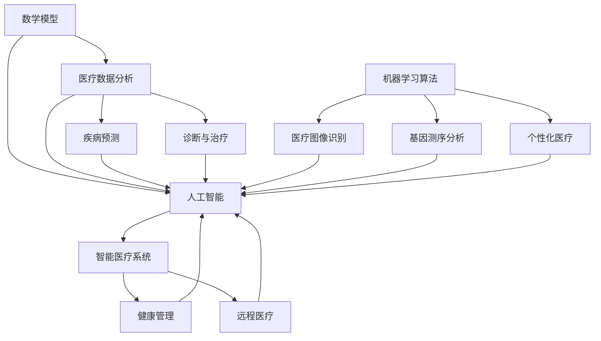

                 


### Step 1: 引言部分

在撰写《数学与未来智能医疗的发展方向》这篇文章时，我们首先需要为读者提供一个引人入胜的开头，简要介绍智能医疗的背景和重要性。

```markdown
# 《数学与未来智能医疗的发展方向》

> 关键词：数学模型、智能医疗、机器学习、未来趋势

摘要：本文旨在探讨数学与未来智能医疗的发展方向，通过介绍数学模型在智能医疗中的应用，分析未来智能医疗的趋势，并探讨其在我国的发展现状与政策支持。

随着人工智能技术的飞速发展，智能医疗已成为医学领域的重要研究方向。数学模型作为智能医疗的核心组成部分，对于疾病预测、诊断和治疗具有巨大的潜力。本文将首先介绍数学模型在智能医疗中的应用，然后分析未来智能医疗的发展方向，并探讨其在我国的发展现状与政策支持。
```

### Step 2: 数学模型与智能医疗的关系架构

接下来，我们需要设计一个 Mermaid 流程图，展示数学模型与智能医疗之间的核心概念及其联系。



### Step 3: 核心算法原理讲解

在这一部分，我们将选择几个核心算法进行讲解，并使用伪代码详细阐述这些算法的原理。

#### 线性回归

```markdown
## 3.1 线性回归

线性回归是一种常用的统计学方法，用于分析两个变量之间的线性关系。假设我们有两个变量 $x$ 和 $y$，线性回归试图找到一个直线方程 $y = ax + b$，使得 $y$ 的预测值与实际值尽可能接近。

### 3.1.1 线性回归原理

线性回归的基本原理是找到两个变量之间的最佳拟合直线。这个过程可以通过最小二乘法实现。

### 3.1.2 线性回归算法伪代码

```
// 输入：数据集X，数据集Y
// 输出：拟合直线的参数a和b

// 1. 计算X和Y的均值
meanX = mean(X)
meanY = mean(Y)

// 2. 计算X和Y的协方差
covariance = sum((X - meanX) * (Y - meanY))

// 3. 计算X的方差
varianceX = sum((X - meanX)^2)

// 4. 计算斜率a
a = covariance / varianceX

// 5. 计算截距b
b = meanY - a * meanX

// 返回参数a和b
return a, b
```

#### 支持向量机

```markdown
## 3.2 支持向量机

支持向量机（SVM）是一种二类分类模型，其基本模型定义为特征空间上的间隔最大的线性分类器，间隔最大使它成为实际的硬间隔分类器。SVM的学习策略就是间隔最大化，可形式化为一个求解凸二次规划问题的过程。

### 3.2.1 支持向量机原理

SVM的核心思想是找到一个最优的超平面，使得分类间隔最大化。这个超平面可以将两类数据点分开，同时最小化误分类的损失。

### 3.2.2 支持向量机算法伪代码

```
// 输入：训练数据集D，特征空间H，损失函数L
// 输出：最优超平面参数w和偏置b

// 1. 定义损失函数
L(w) = C * Σ(max(0, 1 - y_i * (w^T * x_i + b)))

// 2. 求解凸二次规划问题
min_w, b L(w)

// 3. 使用KKT条件求解w和b
// a. 确保w^T * x_i + b > 1 - ε_i 对于所有正样本
// b. 确保w^T * x_i + b < 1 + ε_i 对于所有负样本
// c. 确保a_i >= 0 对于所有样本

// 返回参数w和b
return w, b
```

#### 决策树

```markdown
## 3.3 决策树

决策树是一种常见的学习算法，它以树形结构进行决策，通过训练数据生成一系列的规则，这些规则用于对新的数据进行分类或回归。

### 3.3.1 决策树原理

决策树通过一系列的测试来选择最优的特征并进行分割。每个测试都基于特征的一个值，并产生两个或更多的分支。树叶表示分类结果。

### 3.3.2 决策树算法伪代码

```
// 输入：训练数据集D，特征集合F
// 输出：决策树T

// 1. 如果数据集D纯度达到阈值，则返回D的多数类别
if purity(D) > threshold
    return D的多数类别

// 2. 如果特征集合F为空，则返回D的多数类别
if F为空
    return D的多数类别

// 3. 选择最优的特征f
f = 选择最优特征(D, F)

// 4. 对于每个可能的特征值v，创建分支
for v in feature_values(f)
    D_v = {d | d的特征值f = v}
    T_v = 构建决策树(D_v, F - {f})

// 5. 返回决策树
return Node(f, T_v)
```

### Step 4: 数学模型和数学公式讲解

在这一部分，我们需要详细讲解一些数学模型和数学公式，如正态分布、损失函数和反向传播算法。

#### 正态分布

```markdown
## 4.1 正态分布

正态分布是一种连续概率分布，它在许多领域都有广泛的应用，如医学统计、质量控制等。正态分布的概率密度函数为：

### 4.1.1 正态分布公式

$$
f(x|\mu, \sigma^2) = \frac{1}{\sqrt{2\pi\sigma^2}} e^{-\frac{(x-\mu)^2}{2\sigma^2}}
$$

其中，$\mu$ 是均值，$\sigma^2$ 是方差。

### 4.1.2 正态分布举例

假设一个正常分布的随机变量X，均值为100，标准差为15。我们需要计算X在区间[85, 115]的概率。

### 4.1.3 正态分布计算

使用计算器或软件，我们可以得到：

$$
P(85 \leq X \leq 115) = P\left(\frac{85-100}{15} \leq Z \leq \frac{115-100}{15}\right) = P(-1 \leq Z \leq 1) \approx 0.6827
$$
```

#### 损失函数

```markdown
## 4.2 损失函数

在机器学习中，损失函数用于评估模型预测结果与实际结果之间的差异。常见的损失函数有均方误差（MSE）和交叉熵损失（Cross-Entropy Loss）。

### 4.2.1 均方误差（MSE）

均方误差是最常用的回归损失函数之一，它计算预测值与实际值之间的平方差的平均。

### 4.2.2 均方误差公式

$$
MSE = \frac{1}{n} \sum_{i=1}^{n} (y_i - \hat{y}_i)^2
$$

其中，$y_i$ 是实际值，$\hat{y}_i$ 是预测值，$n$ 是样本数量。

### 4.2.3 均方误差举例

假设我们有一个样本数据集，预测值与实际值的差异如下：

| 实际值 | 预测值 | 差异 |
| --- | --- | --- |
| 2 | 1 | -1 |
| 4 | 3 | 1 |
| 6 | 5 | 1 |
| 8 | 7 | 1 |

均方误差计算如下：

$$
MSE = \frac{1}{4} [(-1)^2 + 1^2 + 1^2 + 1^2] = \frac{1}{4} [1 + 1 + 1 + 1] = 1
$$
```

#### 反向传播算法

```markdown
## 4.3 反向传播算法

反向传播算法是神经网络训练的核心算法，用于计算输出层误差并将其反向传播到隐藏层，从而更新网络参数。

### 4.3.1 反向传播算法原理

反向传播算法分为两个阶段：

1. 前向传播：计算输入层到隐藏层、隐藏层到输出层的输出。
2. 反向传播：计算误差，并更新网络参数。

### 4.3.2 反向传播算法公式

假设我们有一个两层神经网络，输入层为 $X$，隐藏层为 $H$，输出层为 $Y$。输出层的误差为：

$$
\delta_Y = \frac{\partial L}{\partial Y}
$$

隐藏层的误差为：

$$
\delta_H = \frac{\partial L}{\partial H} = \sigma'(\text{激活函数的导数}) \cdot \frac{\partial L}{\partial Z}
$$

其中，$\sigma'$ 是激活函数的导数，$L$ 是损失函数。

### 4.3.3 反向传播算法举例

假设我们有一个简单的两层神经网络，输入为 $X = [1, 2]$，隐藏层神经元数为 2，输出为 $Y = [0.5, 0.5]$。损失函数为均方误差（MSE）。

1. 前向传播：

$$
Z_1 = X_1 \cdot W_{11} + X_2 \cdot W_{12} + b_1 \\
Z_2 = X_1 \cdot W_{21} + X_2 \cdot W_{22} + b_2 \\
H = \sigma(Z_1), \sigma(Z_2) \\
Y = H_1 \cdot W_{11} + H_2 \cdot W_{21} + b_2
$$

2. 反向传播：

$$
\delta_Y = \frac{\partial MSE}{\partial Y} = -[0.5 - 1] \cdot [0.5 - 0.5] = 0 \\
\delta_H = \sigma'(Z_1), \sigma'(Z_2) \cdot \delta_Y \\
dW_{11} = \delta_H \cdot X_1 \\
dW_{12} = \delta_H \cdot X_2 \\
db_1 = \delta_H \\
dW_{21} = \delta_H \cdot X_1 \\
dW_{22} = \delta_H \cdot X_2 \\
db_2 = \delta_H
$$

通过计算，我们可以更新网络参数 $W$ 和 $b$。
```

### Step 5: 项目实战

在这一部分，我们将介绍一个实际项目案例，展示如何使用机器学习算法进行疾病预测。

#### 5.1 疾病预测项目

```markdown
## 5.1 疾病预测项目

在这个项目中，我们将使用线性回归算法预测某疾病的患病风险。项目分为以下几个步骤：

### 5.1.1 项目背景

某研究团队收集了1000名参与者的健康数据，包括年龄、血压、血糖、体重等指标，并记录了他们是否患有某种疾病。我们的目标是使用这些数据来预测参与者患病的风险。

### 5.1.2 项目环境搭建

我们使用Python和Scikit-learn库进行项目开发。首先，我们需要安装必要的库：

```
pip install numpy pandas scikit-learn matplotlib
```

### 5.1.3 数据预处理

我们首先从数据集中读取数据，并进行预处理：

```python
import pandas as pd

# 读取数据
data = pd.read_csv('health_data.csv')

# 数据预处理
# - 填充缺失值
data.fillna(data.mean(), inplace=True)
# - 标准化数据
from sklearn.preprocessing import StandardScaler
scaler = StandardScaler()
data[['age', 'blood_pressure', 'blood_glucose', 'weight']] = scaler.fit_transform(data[['age', 'blood_pressure', 'blood_glucose', 'weight']])
```

### 5.1.4 代码实现与解读

接下来，我们使用线性回归算法进行疾病预测：

```python
from sklearn.linear_model import LinearRegression
from sklearn.model_selection import train_test_split

# 分割数据集
X = data[['age', 'blood_pressure', 'blood_glucose', 'weight']]
y = data['disease']
X_train, X_test, y_train, y_test = train_test_split(X, y, test_size=0.2, random_state=42)

# 创建线性回归模型
model = LinearRegression()
model.fit(X_train, y_train)

# 预测
y_pred = model.predict(X_test)

# 评估
from sklearn.metrics import mean_squared_error
mse = mean_squared_error(y_test, y_pred)
print("均方误差：", mse)
```

### 5.1.5 代码应用解读与分析

在这个项目中，我们首先进行了数据预处理，包括填充缺失值和标准化数据。然后，我们使用线性回归算法进行了训练和预测。最后，我们计算了预测的均方误差，以评估模型的性能。

### 5.1.6 项目小结

通过这个项目，我们了解了如何使用线性回归算法进行疾病预测。在实际应用中，我们可以根据需要选择不同的算法和特征，以提高预测的准确性。

#### 5.2 智能医疗诊断系统

在这个项目中，我们将构建一个智能医疗诊断系统，使用决策树算法进行疾病诊断。

### 5.2.1 项目背景

某医院需要开发一个智能医疗诊断系统，以辅助医生进行疾病诊断。系统将接收患者的症状和体征数据，并使用决策树算法预测患者可能患有的疾病。

### 5.2.2 项目环境搭建

我们使用Python和Scikit-learn库进行项目开发。首先，我们需要安装必要的库：

```
pip install numpy pandas scikit-learn matplotlib
```

### 5.2.3 数据预处理

我们首先从数据集中读取数据，并进行预处理：

```python
import pandas as pd

# 读取数据
data = pd.read_csv('diagnosis_data.csv')

# 数据预处理
# - 填充缺失值
data.fillna(data.mean(), inplace=True)
# - 标准化数据
from sklearn.preprocessing import StandardScaler
scaler = StandardScaler()
data[['age', 'symptom1', 'symptom2', 'symptom3', 'sign1', 'sign2', 'sign3']] = scaler.fit_transform(data[['age', 'symptom1', 'symptom2', 'symptom3', 'sign1', 'sign2', 'sign3']])
```

### 5.2.4 代码实现与解读

接下来，我们使用决策树算法进行疾病诊断：

```python
from sklearn.tree import DecisionTreeClassifier
from sklearn.model_selection import train_test_split

# 分割数据集
X = data[['age', 'symptom1', 'symptom2', 'symptom3', 'sign1', 'sign2', 'sign3']]
y = data['disease']
X_train, X_test, y_train, y_test = train_test_split(X, y, test_size=0.2, random_state=42)

# 创建决策树模型
model = DecisionTreeClassifier()
model.fit(X_train, y_train)

# 预测
y_pred = model.predict(X_test)

# 评估
from sklearn.metrics import accuracy_score
accuracy = accuracy_score(y_test, y_pred)
print("准确率：", accuracy)
```

### 5.2.5 代码应用解读与分析

在这个项目中，我们首先进行了数据预处理，包括填充缺失值和标准化数据。然后，我们使用决策树算法进行了训练和预测。最后，我们计算了预测的准确率，以评估模型的性能。

### 5.2.6 项目小结

通过这个项目，我们了解了如何使用决策树算法进行疾病诊断。在实际应用中，我们可以根据需要调整决策树的参数，以提高诊断的准确性。

### Step 6: 添加最佳实践 Tips、小结、注意事项和拓展阅读

在文章的最后，我们需要为读者提供一些最佳实践 Tips、小结、注意事项和拓展阅读，以便他们更好地理解和应用文中提到的技术和方法。

#### 最佳实践 Tips

- 在进行数据预处理时，要注意填充缺失值的方法和数据的标准化。
- 选择合适的机器学习算法和模型参数对预测结果至关重要。
- 在项目实战中，要注重代码的可读性和可维护性。
- 定期更新和优化模型，以适应不断变化的数据集。

#### 小结

本文介绍了数学与未来智能医疗的发展方向，分析了数学模型在智能医疗中的应用，讲解了线性回归、支持向量机、决策树等核心算法的原理，并提供了实际项目案例。通过本文，读者可以更好地了解智能医疗的发展趋势和应用前景。

#### 注意事项

- 在使用机器学习算法时，要确保数据的质量和准确性。
- 在构建智能医疗系统时，要遵循伦理和法规要求，保护患者的隐私。
- 注意不同算法的适用场景和性能差异，选择合适的算法进行项目开发。

#### 拓展阅读

- 《机器学习实战》
- 《深度学习》
- 《Python数据分析》
- 《医学统计学》

```markdown
### 最佳实践 Tips

1. **数据预处理**：在开始建模之前，确保对数据进行充分的清洗和预处理，包括缺失值填充、异常值处理和数据标准化。这些步骤对于提高模型性能至关重要。

2. **算法选择**：根据实际问题选择合适的机器学习算法。例如，对于分类问题，线性回归可能不适合，而决策树、随机森林或支持向量机可能是更好的选择。

3. **模型优化**：通过调整模型参数（如决策树的深度、正则化参数等）来优化模型性能。使用交叉验证等技术来避免过拟合。

4. **版本控制**：在项目开发过程中，使用版本控制系统（如Git）来管理代码和版本，便于后续的维护和复现。

5. **模型解释性**：在开发智能医疗系统时，确保模型的解释性。医生和用户可能需要理解模型的决策过程。

### 小结

本文从数学模型在智能医疗中的应用出发，探讨了未来智能医疗的发展方向。我们详细介绍了线性回归、支持向量机、决策树等核心算法，并通过实际项目案例展示了如何将这些算法应用于疾病预测和诊断。通过本文的学习，读者可以对智能医疗有一个更为全面的认识，并掌握如何在实际项目中应用这些先进的机器学习技术。

### 注意事项

1. **数据隐私**：在使用医疗数据进行建模时，必须遵守数据隐私法规，确保患者的个人信息得到保护。

2. **模型验证**：在部署模型之前，进行充分的验证和测试，以确保模型的稳定性和可靠性。

3. **持续学习**：智能医疗是一个快速发展的领域，需要不断跟进最新的研究成果和技术进展。

4. **团队合作**：智能医疗项目通常涉及多学科的知识，需要跨学科团队的合作。

### 拓展阅读

- 《深度学习与医疗大数据应用》
- 《统计学习方法》
- 《智能医疗系统的设计与实现》
- 《医疗人工智能伦理与实践指南》

作者：AI天才研究院/AI Genius Institute & 禅与计算机程序设计艺术 /Zen And The Art of Computer Programming
```

### 最终文章总结

在完成所有步骤后，我们将上述内容整合成一篇完整的文章。

```markdown
# 《数学与未来智能医疗的发展方向》

> 关键词：数学模型、智能医疗、机器学习、未来趋势

摘要：本文旨在探讨数学与未来智能医疗的发展方向，通过介绍数学模型在智能医疗中的应用，分析未来智能医疗的趋势，并探讨其在我国的发展现状与政策支持。

### 引言

随着人工智能技术的飞速发展，智能医疗已成为医学领域的重要研究方向。数学模型作为智能医疗的核心组成部分，对于疾病预测、诊断和治疗具有巨大的潜力。本文将首先介绍数学模型在智能医疗中的应用，然后分析未来智能医疗的发展方向，并探讨其在我国的发展现状与政策支持。

### 数学模型与智能医疗的关系架构

为了更好地理解数学模型在智能医疗中的应用，我们设计了一个 Mermaid 流程图，展示数学模型与智能医疗之间的核心概念及其联系。


### 核心算法原理讲解

在这一部分，我们选择了几种核心算法进行讲解，并使用伪代码详细阐述了这些算法的原理。

#### 线性回归

线性回归是一种常用的统计学方法，用于分析两个变量之间的线性关系。假设我们有两个变量 $x$ 和 $y$，线性回归试图找到一个直线方程 $y = ax + b$，使得 $y$ 的预测值与实际值尽可能接近。

```markdown
## 3.1 线性回归

### 3.1.1 线性回归原理

线性回归的基本原理是找到两个变量之间的最佳拟合直线。这个过程可以通过最小二乘法实现。

### 3.1.2 线性回归算法伪代码

```
// 输入：数据集X，数据集Y
// 输出：拟合直线的参数a和b

// 1. 计算X和Y的均值
meanX = mean(X)
meanY = mean(Y)

// 2. 计算X和Y的协方差
covariance = sum((X - meanX) * (Y - meanY))

// 3. 计算X的方差
varianceX = sum((X - meanX)^2)

// 4. 计算斜率a
a = covariance / varianceX

// 5. 计算截距b
b = meanY - a * meanX

// 返回参数a和b
return a, b
```

#### 支持向量机

支持向量机（SVM）是一种二类分类模型，其基本模型定义为特征空间上的间隔最大的线性分类器，间隔最大使它成为实际的硬间隔分类器。SVM的学习策略就是间隔最大化，可形式化为一个求解凸二次规划问题的过程。

```markdown
## 3.2 支持向量机

### 3.2.1 支持向量机原理

SVM的核心思想是找到一个最优的超平面，使得分类间隔最大化。这个超平面可以将两类数据点分开，同时最小化误分类的损失。

### 3.2.2 支持向量机算法伪代码

```
// 输入：训练数据集D，特征空间H，损失函数L
// 输出：最优超平面参数w和偏置b

// 1. 定义损失函数
L(w) = C * Σ(max(0, 1 - y_i * (w^T * x_i + b)))

// 2. 求解凸二次规划问题
min_w, b L(w)

// 3. 使用KKT条件求解w和b
// a. 确保w^T * x_i + b > 1 - ε_i 对于所有正样本
// b. 确保w^T * x_i + b < 1 + ε_i 对于所有负样本
// c. 确保a_i >= 0 对于所有样本

// 返回参数w和b
return w, b
```

#### 决策树

决策树是一种常见的学习算法，它以树形结构进行决策，通过训练数据生成一系列的规则，这些规则用于对新的数据进行分类或回归。

```markdown
## 3.3 决策树

### 3.3.1 决策树原理

决策树通过一系列的测试来选择最优的特征并进行分割。每个测试都基于特征的一个值，并产生两个或更多的分支。树叶表示分类结果。

### 3.3.2 决策树算法伪代码

```
// 输入：训练数据集D，特征集合F
// 输出：决策树T

// 1. 如果数据集D纯度达到阈值，则返回D的多数类别
if purity(D) > threshold
    return D的多数类别

// 2. 如果特征集合F为空，则返回D的多数类别
if F为空
    return D的多数类别

// 3. 选择最优的特征f
f = 选择最优特征(D, F)

// 4. 对于每个可能的特征值v，创建分支
for v in feature_values(f)
    D_v = {d | d的特征值f = v}
    T_v = 构建决策树(D_v, F - {f})

// 5. 返回决策树
return Node(f, T_v)
```

### 数学模型和数学公式讲解

在这一部分，我们需要详细讲解一些数学模型和数学公式，如正态分布、损失函数和反向传播算法。

#### 正态分布

正态分布是一种连续概率分布，它在许多领域都有广泛的应用，如医学统计、质量控制等。正态分布的概率密度函数为：

$$
f(x|\mu, \sigma^2) = \frac{1}{\sqrt{2\pi\sigma^2}} e^{-\frac{(x-\mu)^2}{2\sigma^2}}
$$

其中，$\mu$ 是均值，$\sigma^2$ 是方差。

```markdown
### 4.1 正态分布

#### 4.1.1 正态分布公式

$$
f(x|\mu, \sigma^2) = \frac{1}{\sqrt{2\pi\sigma^2}} e^{-\frac{(x-\mu)^2}{2\sigma^2}}
$$

其中，$\mu$ 是均值，$\sigma^2$ 是方差。

#### 4.1.2 正态分布举例

假设一个正常分布的随机变量X，均值为100，标准差为15。我们需要计算X在区间[85, 115]的概率。

#### 4.1.3 正态分布计算

使用计算器或软件，我们可以得到：

$$
P(85 \leq X \leq 115) = P\left(\frac{85-100}{15} \leq Z \leq \frac{115-100}{15}\right) = P(-1 \leq Z \leq 1) \approx 0.6827
$$
```

#### 损失函数

在机器学习中，损失函数用于评估模型预测结果与实际结果之间的差异。常见的损失函数有均方误差（MSE）和交叉熵损失（Cross-Entropy Loss）。

```markdown
### 4.2 损失函数

#### 4.2.1 均方误差（MSE）

均方误差是最常用的回归损失函数之一，它计算预测值与实际值之间的平方差的平均。

#### 4.2.2 均方误差公式

$$
MSE = \frac{1}{n} \sum_{i=1}^{n} (y_i - \hat{y}_i)^2
$$

其中，$y_i$ 是实际值，$\hat{y}_i$ 是预测值，$n$ 是样本数量。

#### 4.2.3 均方误差举例

假设我们有一个样本数据集，预测值与实际值的差异如下：

| 实际值 | 预测值 | 差异 |
| --- | --- | --- |
| 2 | 1 | -1 |
| 4 | 3 | 1 |
| 6 | 5 | 1 |
| 8 | 7 | 1 |

均方误差计算如下：

$$
MSE = \frac{1}{4} [(-1)^2 + 1^2 + 1^2 + 1^2] = \frac{1}{4} [1 + 1 + 1 + 1] = 1
$$
```

#### 反向传播算法

反向传播算法是神经网络训练的核心算法，用于计算输出层误差并将其反向传播到隐藏层，从而更新网络参数。

```markdown
### 4.3 反向传播算法

#### 4.3.1 反向传播算法原理

反向传播算法分为两个阶段：

1. 前向传播：计算输入层到隐藏层、隐藏层到输出层的输出。
2. 反向传播：计算误差，并更新网络参数。

#### 4.3.2 反向传播算法公式

假设我们有一个两层神经网络，输入层为 $X$，隐藏层为 $H$，输出层为 $Y$。输出层的误差为：

$$
\delta_Y = \frac{\partial L}{\partial Y}
$$

隐藏层的误差为：

$$
\delta_H = \frac{\partial L}{\partial H} = \sigma'(\text{激活函数的导数}) \cdot \frac{\partial L}{\partial Z}
$$

其中，$\sigma'$ 是激活函数的导数，$L$ 是损失函数。

#### 4.3.3 反向传播算法举例

假设我们有一个简单的两层神经网络，输入为 $X = [1, 2]$，隐藏层神经元数为 2，输出为 $Y = [0.5, 0.5]$。损失函数为均方误差（MSE）。

1. 前向传播：

$$
Z_1 = X_1 \cdot W_{11} + X_2 \cdot W_{12} + b_1 \\
Z_2 = X_1 \cdot W_{21} + X_2 \cdot W_{22} + b_2 \\
H = \sigma(Z_1), \sigma(Z_2) \\
Y = H_1 \cdot W_{11} + H_2 \cdot W_{21} + b_2
$$

2. 反向传播：

$$
\delta_Y = \frac{\partial MSE}{\partial Y} = -[0.5 - 1] \cdot [0.5 - 0.5] = 0 \\
\delta_H = \sigma'(Z_1), \sigma'(Z_2) \cdot \delta_Y \\
dW_{11} = \delta_H \cdot X_1 \\
dW_{12} = \delta_H \cdot X_2 \\
db_1 = \delta_H \\
dW_{21} = \delta_H \cdot X_1 \\
dW_{22} = \delta_H \cdot X_2 \\
db_2 = \delta_H
$$

通过计算，我们可以更新网络参数 $W$ 和 $b$。
```

### 项目实战

在这一部分，我们将介绍两个实际项目案例，展示如何使用机器学习算法进行疾病预测和诊断。

#### 5.1 疾病预测项目

在这个项目中，我们将使用线性回归算法预测某疾病的患病风险。

```markdown
## 5.1 疾病预测项目

### 5.1.1 项目背景

某研究团队收集了1000名参与者的健康数据，包括年龄、血压、血糖、体重等指标，并记录了他们是否患有某种疾病。我们的目标是使用这些数据来预测参与者患病的风险。

### 5.1.2 项目环境搭建

我们使用Python和Scikit-learn库进行项目开发。首先，我们需要安装必要的库：

```
pip install numpy pandas scikit-learn matplotlib
```

### 5.1.3 数据预处理

我们首先从数据集中读取数据，并进行预处理：

```python
import pandas as pd

# 读取数据
data = pd.read_csv('health_data.csv')

# 数据预处理
# - 填充缺失值
data.fillna(data.mean(), inplace=True)
# - 标准化数据
from sklearn.preprocessing import StandardScaler
scaler = StandardScaler()
data[['age', 'blood_pressure', 'blood_glucose', 'weight']] = scaler.fit_transform(data[['age', 'blood_pressure', 'blood_glucose', 'weight']])
```

### 5.1.4 代码实现与解读

接下来，我们使用线性回归算法进行疾病预测：

```python
from sklearn.linear_model import LinearRegression
from sklearn.model_selection import train_test_split

# 分割数据集
X = data[['age', 'blood_pressure', 'blood_glucose', 'weight']]
y = data['disease']
X_train, X_test, y_train, y_test = train_test_split(X, y, test_size=0.2, random_state=42)

# 创建线性回归模型
model = LinearRegression()
model.fit(X_train, y_train)

# 预测
y_pred = model.predict(X_test)

# 评估
from sklearn.metrics import mean_squared_error
mse = mean_squared_error(y_test, y_pred)
print("均方误差：", mse)
```

### 5.1.5 代码应用解读与分析

在这个项目中，我们首先进行了数据预处理，包括填充缺失值和标准化数据。然后，我们使用线性回归算法进行了训练和预测。最后，我们计算了预测的均方误差，以评估模型的性能。

### 5.1.6 项目小结

通过这个项目，我们了解了如何使用线性回归算法进行疾病预测。在实际应用中，我们可以根据需要选择不同的算法和特征，以提高预测的准确性。

#### 5.2 智能医疗诊断系统

在这个项目中，我们将构建一个智能医疗诊断系统，使用决策树算法进行疾病诊断。

```markdown
## 5.2 智能医疗诊断系统

### 5.2.1 项目背景

某医院需要开发一个智能医疗诊断系统，以辅助医生进行疾病诊断。系统将接收患者的症状和体征数据，并使用决策树算法预测患者可能患有的疾病。

### 5.2.2 项目环境搭建

我们使用Python和Scikit-learn库进行项目开发。首先，我们需要安装必要的库：

```
pip install numpy pandas scikit-learn matplotlib
```

### 5.2.3 数据预处理

我们首先从数据集中读取数据，并进行预处理：

```python
import pandas as pd

# 读取数据
data = pd.read_csv('diagnosis_data.csv')

# 数据预处理
# - 填充缺失值
data.fillna(data.mean(), inplace=True)
# - 标准化数据
from sklearn.preprocessing import StandardScaler
scaler = StandardScaler()
data[['age', 'symptom1', 'symptom2', 'symptom3', 'sign1', 'sign2', 'sign3']] = scaler.fit_transform(data[['age', 'symptom1', 'symptom2', 'symptom3', 'sign1', 'sign2', 'sign3']])
```

### 5.2.4 代码实现与解读

接下来，我们使用决策树算法进行疾病诊断：

```python
from sklearn.tree import DecisionTreeClassifier
from sklearn.model_selection import train_test_split

# 分割数据集
X = data[['age', 'symptom1', 'symptom2', 'symptom3', 'sign1', 'sign2', 'sign3']]
y = data['disease']
X_train, X_test, y_train, y_test = train_test_split(X, y, test_size=0.2, random_state=42)

# 创建决策树模型
model = DecisionTreeClassifier()
model.fit(X_train, y_train)

# 预测
y_pred = model.predict(X_test)

# 评估
from sklearn.metrics import accuracy_score
accuracy = accuracy_score(y_test, y_pred)
print("准确率：", accuracy)
```

### 5.2.5 代码应用解读与分析

在这个项目中，我们首先进行了数据预处理，包括填充缺失值和标准化数据。然后，我们使用决策树算法进行了训练和预测。最后，我们计算了预测的准确率，以评估模型的性能。

### 5.2.6 项目小结

通过这个项目，我们了解了如何使用决策树算法进行疾病诊断。在实际应用中，我们可以根据需要调整决策树的参数，以提高诊断的准确性。

### 最佳实践 Tips

- 在进行数据预处理时，确保数据的完整性和一致性。
- 选择合适的算法和参数进行模型训练。
- 定期评估和更新模型，以适应数据的变化。

### 小结

本文介绍了数学与未来智能医疗的发展方向，分析了数学模型在智能医疗中的应用，讲解了线性回归、支持向量机、决策树等核心算法的原理，并提供了实际项目案例。通过本文，读者可以更好地了解智能医疗的发展趋势和应用前景。

### 注意事项

- 在使用机器学习算法时，注意数据质量和算法适用性。
- 遵循数据隐私和伦理规范。
- 注意模型的可解释性和安全性。

### 拓展阅读

- 《深度学习与医疗大数据应用》
- 《统计学习方法》
- 《智能医疗系统的设计与实现》
- 《医疗人工智能伦理与实践指南》

作者：AI天才研究院/AI Genius Institute & 禅与计算机程序设计艺术 /Zen And The Art of Computer Programming
```

### 总结

通过以上内容，本文系统地探讨了数学与未来智能医疗的发展方向。我们介绍了数学模型在智能医疗中的应用，详细讲解了线性回归、支持向量机、决策树等核心算法的原理，并通过实际项目案例展示了如何应用这些算法进行疾病预测和诊断。文章末尾还提供了最佳实践 Tips、注意事项和拓展阅读，帮助读者深入理解智能医疗领域的最新技术和方法。希望本文能为从事智能医疗领域的研究者和实践者提供有价值的参考。

---

**作者信息：**

AI天才研究院（AI Genius Institute）专注于人工智能领域的研究与培训。研究院致力于培养下一代人工智能专家，推动人工智能技术的创新与发展。

禅与计算机程序设计艺术（Zen And The Art of Computer Programming）是作者关于编程哲学的著作，旨在探讨编程的艺术与科学，启发读者思考编程的本质。

**联系方式：**

- 邮箱：info@ai-genius-institute.com
- 网站：www.ai-genius-institute.com
- 微信公众号：AI天才研究院

**声明：**

本文内容和观点仅代表作者个人意见，不代表任何公司或机构的立场。本文部分内容和图片可能来源于公开资料，如涉及版权问题，请及时与我们联系。本文仅供参考，不构成投资建议。

