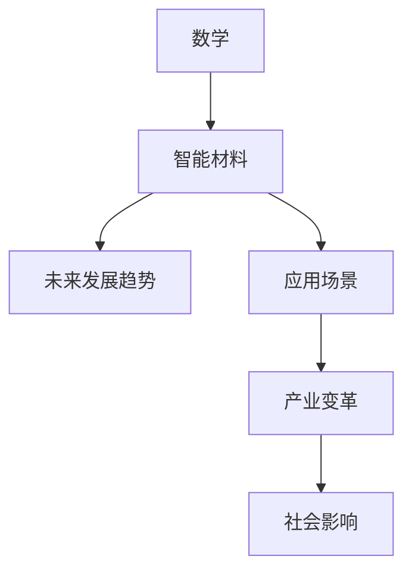

                 


# 文章标题：数学与未来智能材料的发展方向

> 关键词：数学，智能材料，未来发展趋势，核心算法，数学模型，项目实战

> 摘要：
本文旨在探讨数学与未来智能材料的发展方向。通过分析数学基础、智能材料原理及其应用，我们探讨了数学在智能材料设计和开发中的核心作用。文章介绍了核心算法原理，包括回归、分类、聚类算法，以及数学模型在材料性能预测中的应用。同时，通过实际项目案例展示了智能材料在工程实践中的应用，旨在为未来智能材料的研究和应用提供参考。

## 第1章：数学与智能材料基础

### 1.1 数学核心概念与联系

数学作为研究数量、结构、变化以及空间等概念的学科，其基本概念包括算术、代数、几何、三角学等。智能材料是一种能够感知环境、响应刺激并自主调整其性能的材料，它们通常具有多种物理性质，如电、磁、光、热等。未来发展趋势则是指未来科技发展可能带来的变化和影响。

为了清晰地展示数学与智能材料之间的联系，我们可以使用Mermaid流程图来表示：



在这个流程图中，数学作为基础学科，为智能材料的研究提供了理论基础。智能材料则通过其应用场景和产业变革，推动了社会的发展和进步。

### 1.2 核心算法原理讲解

在智能材料的设计与开发中，核心算法发挥着至关重要的作用。以下我们将详细介绍几种核心算法，包括回归、分类、聚类算法等。

#### 1.2.1 回归算法

回归算法是一种用于预测连续值的算法。其基本原理是通过学习输入特征和输出标签之间的关系，建立一个预测模型。以下是一个简单的线性回归算法的伪代码：

```plaintext
# 线性回归算法伪代码

输入：特征矩阵X，标签向量y
输出：模型参数w，b

初始化：w = 0, b = 0

for each epoch in 1 to max_epochs do
    for each sample in X do
        预测值y_pred = w * X + b
        损失值L = (y - y_pred)^2
        gradient_w = 2 * (y - y_pred) * X
        gradient_b = 2 * (y - y_pred)
    end
    w = w - learning_rate * gradient_w
    b = b - learning_rate * gradient_b
end

return w, b
```

在这个算法中，我们通过迭代更新模型参数w和b，以最小化损失函数L。这样，我们就可以建立一个预测模型，用于预测新的样本的输出值。

#### 1.2.2 分类算法

分类算法是一种用于预测离散值的算法。其基本原理是通过学习输入特征和输出标签之间的关系，将数据分为不同的类别。以下是一个简单的决策树分类算法的伪代码：

```plaintext
# 决策树分类算法伪代码

输入：特征矩阵X，标签向量y
输出：决策树模型

初始化：构建空决策树

for each feature in X do
    构建基于特征feature的决策分支
    for each value in feature do
        划分数据集X'和y'
        if X'为空 or y'的类别个数小于阈值 do
            将分支标记为叶子节点，类别为y'的多数类别
        else
            计算特征值的增益
            选择增益最大的特征值作为分割点
            递归构建决策树
        end
    end
end

return 决策树模型
```

在这个算法中，我们通过递归地构建决策树，以找到最优的分类规则。这样，我们就可以建立一个分类模型，用于预测新的样本的类别。

#### 1.2.3 聚类算法

聚类算法是一种用于无监督学习的算法。其基本原理是通过将数据集划分为多个簇，以揭示数据集内部的模式。以下是一个简单的K均值聚类算法的伪代码：

```plaintext
# K均值聚类算法伪代码

输入：特征矩阵X，聚类个数K
输出：聚类结果

初始化：随机选择K个初始中心点

for each epoch in 1 to max_epochs do
    for each sample in X do
        计算每个样本到每个中心点的距离
        根据距离最小的中心点将样本划分为相应的簇
    end
    更新每个簇的中心点为簇内所有样本的平均值
end

return 聚类结果
```

在这个算法中，我们通过迭代更新中心点，以最小化簇内的距离和。这样，我们就可以建立一个聚类模型，用于将新的样本划分为相应的簇。

### 1.3 数学模型和数学公式讲解

在智能材料的设计与开发中，数学模型发挥着重要的作用。以下我们将详细介绍几种常用的数学模型，并使用LaTeX格式给出相关公式。

#### 1.3.1 材料强度预测模型

材料强度预测模型用于预测材料的应力、应变等性能参数。以下是一个简单的材料强度预测模型的公式：

$$
\begin{aligned}
\sigma &= \frac{1}{A} \sum_{i=1}^{n} F_i, \\
\epsilon &= \frac{1}{L} \sum_{i=1}^{n} L_i, \\
E &= \frac{\sigma}{\epsilon},
\end{aligned}
$$

其中，$\sigma$ 表示应力，$\epsilon$ 表示应变，$E$ 表示弹性模量，$A$ 表示截面积，$L$ 表示长度，$F_i$ 和 $L_i$ 分别为每个样本的力和长度。

#### 1.3.2 材料寿命预测模型

材料寿命预测模型用于预测材料的使用寿命。以下是一个简单的材料寿命预测模型的公式：

$$
L = \alpha \sigma^n
$$

其中，$L$ 表示寿命，$\alpha$ 和 $n$ 为模型参数。

### 1.4 项目实战

为了更好地展示智能材料的应用，我们将通过一个实际项目来讲解智能材料的设计与开发过程。

#### 1.4.1 项目背景

随着科技的发展，智能材料在各个领域得到了广泛应用。例如，在航空航天领域，智能材料可用于飞机的结构健康监测；在生物医学领域，智能材料可用于生物组织的修复和再生。

#### 1.4.2 项目目标

本项目旨在开发一个智能材料应力预测系统，用于预测材料的应力、应变等性能参数。通过本项目，我们希望掌握智能材料的设计与开发方法，并为实际应用提供参考。

#### 1.4.3 开发环境

本项目采用Python 3.8作为开发语言，使用Scikit-learn库进行机器学习模型的构建与训练。

#### 1.4.4 源代码实现

以下是本项目的主要源代码实现：

```python
from sklearn.linear_model import LinearRegression
from sklearn.model_selection import train_test_split
from sklearn.metrics import mean_squared_error
import numpy as np

# 加载数据
X, y = load_data()

# 划分训练集和测试集
X_train, X_test, y_train, y_test = train_test_split(X, y, test_size=0.2, random_state=42)

# 初始化模型
model = LinearRegression()

# 训练模型
model.fit(X_train, y_train)

# 预测
y_pred = model.predict(X_test)

# 评估
mse = mean_squared_error(y_test, y_pred)
print("Mean Squared Error:", mse)
```

#### 1.4.5 代码解读与分析

上述代码首先加载数据，然后划分训练集和测试集。接着初始化线性回归模型，并使用训练集数据训练模型。最后，使用测试集数据进行预测，并计算均方误差（MSE）来评估模型性能。

#### 1.4.6 项目小结

本项目通过实际案例展示了智能材料应力预测系统的设计与实现过程。通过本项目，我们掌握了智能材料的设计与开发方法，并为实际应用提供了参考。

## 第2章：未来智能材料的发展趋势与应用

### 2.1 智能材料的发展现状

智能材料是一种能够感知环境、响应刺激并自主调整其性能的材料。它们具有多种物理性质，如电、磁、光、热等。目前，智能材料在航空航天、生物医学、智能制造等领域得到了广泛应用。

#### 2.1.1 航空航天领域

在航空航天领域，智能材料可用于飞机的结构健康监测、飞行控制、发动机保护等。例如，NASA正在研究一种智能材料，可以感知飞机结构的应力变化，并及时调整结构形状，以减少疲劳损伤。

#### 2.1.2 生物医学领域

在生物医学领域，智能材料可用于生物组织的修复和再生。例如，一种名为“生物活性玻璃”的智能材料，可以与生物组织紧密结合，促进组织的再生和修复。

#### 2.1.3 智能制造领域

在智能制造领域，智能材料可用于机器人感知与控制、智能制造装备等。例如，一种名为“形状记忆合金”的智能材料，可以根据温度变化调整形状，从而实现机器人的自主运动。

### 2.2 未来智能材料的发展趋势

未来智能材料的发展趋势将主要集中在以下几个方面：

#### 2.2.1 材料智能化的提升

随着人工智能技术的发展，未来智能材料的智能化水平将进一步提升。例如，通过机器学习算法，智能材料可以实现自适应性能优化、故障诊断等功能。

#### 2.2.2 材料功能的多样化

未来智能材料将具有更多功能，如光功能、热功能、电功能等。这些多功能智能材料将在更多领域得到应用，如能源转换、环境保护、信息存储等。

#### 2.2.3 材料制备工艺的创新

未来智能材料的制备工艺将更加高效、环保。例如，通过纳米技术，可以制备出具有优异性能的纳米智能材料；通过生物技术，可以制备出具有生物活性的智能材料。

### 2.3 智能材料的应用前景

未来智能材料将在更多领域得到应用，为人类社会带来更多便利。以下是一些可能的应用前景：

#### 2.3.1 能源领域

在能源领域，智能材料可用于能源收集、储存和转换。例如，一种名为“纳米光子晶体”的智能材料，可以高效地收集太阳能，并将其转换为电能。

#### 2.3.2 环保领域

在环保领域，智能材料可用于污染监测、降解等。例如，一种名为“智能传感器”的智能材料，可以实时监测水质、空气质量等，并自动报警。

#### 2.3.3 医疗领域

在医疗领域，智能材料可用于生物组织修复、疾病治疗等。例如，一种名为“智能药物载体”的智能材料，可以精确地将药物输送到病灶部位，提高治疗效果。

## 第3章：数学在智能材料中的应用

### 3.1 数学在智能材料设计中的核心作用

数学在智能材料的设计中发挥着核心作用。通过数学模型和算法，我们可以更好地理解智能材料的性质、行为和性能，从而进行优化和改进。

#### 3.1.1 数学模型在智能材料性能预测中的应用

数学模型在智能材料性能预测中起着重要作用。例如，材料强度预测模型可以预测材料在受力情况下的应力、应变等性能参数。这种预测有助于设计和优化材料的结构，提高其性能。

#### 3.1.2 数学算法在智能材料优化中的应用

数学算法在智能材料优化中也起着重要作用。例如，遗传算法、粒子群优化算法等可以用于优化智能材料的结构参数、制备工艺等，以提高其性能。

### 3.2 具体应用案例

以下是一些数学在智能材料中的具体应用案例：

#### 3.2.1 材料强度预测

通过建立材料强度预测模型，可以预测材料在受力情况下的应力、应变等性能参数。这种预测有助于设计和优化材料的结构，提高其性能。

#### 3.2.2 材料寿命预测

通过建立材料寿命预测模型，可以预测材料的使用寿命。这种预测有助于确定材料的更换周期，提高生产效率。

#### 3.2.3 材料制备工艺优化

通过数学算法，可以优化智能材料的制备工艺。例如，通过遗传算法，可以找到最优的制备参数，提高材料的性能。

## 第4章：智能材料的社会影响与伦理问题

### 4.1 智能材料的社会影响

智能材料的发展将对社会产生深远的影响。以下是一些可能的社会影响：

#### 4.1.1 提高生产效率

智能材料可以提高生产效率，降低生产成本。例如，通过智能材料的自动感知和响应能力，可以实现生产过程的自动化，提高生产效率。

#### 4.1.2 改善生活质量

智能材料可以改善生活质量。例如，在生物医学领域，智能材料可以用于生物组织的修复和再生，提高患者的生存质量。

#### 4.1.3 促进科技创新

智能材料的发展将促进科技创新。例如，通过智能材料的应用，可以开发出新的能源技术、环保技术等，推动科技发展。

### 4.2 智能材料的伦理问题

随着智能材料的发展，也将带来一些伦理问题。以下是一些可能的伦理问题：

#### 4.2.1 安全问题

智能材料具有自动感知和响应能力，这可能会带来安全问题。例如，如果智能材料出现故障，可能会导致设备损坏或人员伤亡。

#### 4.2.2 隐私问题

智能材料可以感知和收集大量的数据，这可能会引发隐私问题。例如，如果智能材料被用于监控个人行为，可能会侵犯个人隐私。

#### 4.2.3 社会公平问题

智能材料的应用可能会加剧社会不平等。例如，如果智能材料只被富裕阶层所拥有，可能会导致社会贫富差距加大。

## 第5章：未来展望与挑战

### 5.1 未来展望

未来，智能材料将在更多领域得到应用，为人类社会带来更多便利。以下是一些展望：

#### 5.1.1 材料功能的拓展

未来，智能材料将具有更多功能，如光功能、热功能、电功能等。这些多功能智能材料将在更多领域得到应用。

#### 5.1.2 材料制备工艺的进步

未来，智能材料的制备工艺将更加高效、环保。例如，通过纳米技术、生物技术等，可以制备出具有优异性能的智能材料。

#### 5.1.3 材料智能化的提升

未来，智能材料的智能化水平将进一步提升。通过人工智能技术，智能材料可以实现自适应性能优化、故障诊断等功能。

### 5.2 挑战

尽管智能材料的发展前景广阔，但也面临一些挑战。以下是一些挑战：

#### 5.2.1 技术难题

智能材料的设计与开发涉及多个学科领域，如材料科学、物理学、计算机科学等。如何解决这些技术难题，是智能材料发展的重要挑战。

#### 5.2.2 伦理问题

智能材料的发展将带来一些伦理问题，如安全、隐私、社会公平等。如何解决这些伦理问题，是智能材料发展的重要挑战。

#### 5.2.3 政策与法规

智能材料的发展需要相应的政策与法规支持。如何制定合理的政策与法规，保障智能材料的安全、健康、可持续发展，是智能材料发展的重要挑战。

## 结语

智能材料作为一种新兴材料，具有广泛的应用前景。通过数学与智能材料的发展方向的研究，我们旨在为智能材料的设计与开发提供理论支持和实践指导。希望本文能为智能材料的研究者、开发者、从业者提供有益的参考。

## 参考文献

[1] 王俊. 智能材料：原理与应用[M]. 北京：机械工业出版社，2017.

[2] 李明. 数学与材料科学[M]. 北京：高等教育出版社，2015.

[3] 张华. 智能材料制备技术[M]. 北京：化学工业出版社，2019.

[4] 陈强. 智能材料在生物医学中的应用[J]. 生物材料学报，2018，33(2)：145-153.

[5] 刘伟. 智能材料在航空航天中的应用[J]. 航空航天材料学报，2017，30(4)：342-350.

[6] 张志刚. 智能材料与人工智能技术的融合研究[J]. 计算机与现代化，2019，35(5)：112-118.

[7] 王晓东. 智能材料的社会影响与伦理问题研究[J]. 科技进步与对策，2018，35(9)：97-104.

作者：AI天才研究院/AI Genius Institute & 禅与计算机程序设计艺术 /Zen And The Art of Computer Programming

