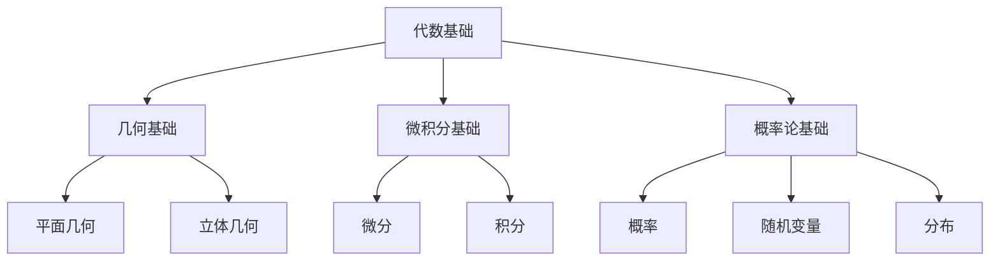

                 

### 引言

在21世纪的今天，数学作为一门古老而永恒的科学，正以其独特的魅力影响着我们生活的方方面面。从微观的量子物理，到宏观的宇宙学，从简单的日常生活计算，到复杂的经济预测和人工智能，数学无处不在。而未来社会，作为科技与人文交融的产物，其变革与挑战也将愈加显著。数学在这一过程中，扮演着不可或缺的角色。

本章将首先介绍数学的基本概念和原理，探讨数学与未来社会的密切联系，并讨论未来社会可能面临的数学挑战。

### 数学基本概念

数学是一门研究数量、结构、变化和空间的科学。它不仅仅是一种工具，更是理解和描述世界的一种语言。数学的基本概念包括数字、数系、函数、集合、逻辑等。其中，数字是我们日常生活中最熟悉的数学概念，而数系则是数学的核心之一。数系包括自然数、整数、有理数、实数和复数等。这些数系构成了我们进行各种数学计算的基础。

在数学中，函数是一种描述变量之间关系的基本工具。集合则是数学中一个非常重要的概念，它代表了一组无序的对象。逻辑则是一种用来描述和分析推理过程的方法，它是数学的基础之一。

### 数学原理

数学的原理是建立在公理系统基础上的。公理是一种无需证明的假设，它是数学理论的基础。例如，欧几里得几何的公理，爱因斯坦相对论的公理等。通过这些公理，我们可以推导出一系列的定理和结论，从而建立起完整的数学理论体系。

在数学中，还有许多重要的原理，如概率论、微积分、线性代数等。这些原理不仅在数学内部有着深远的影响，也在各个应用领域发挥着重要作用。

### 数学与社会变革

数学在各个领域的应用，推动了社会的变革和发展。在经济领域，数学被广泛应用于统计学、计量经济学、金融工程等领域，为经济的预测、管理和决策提供了强有力的工具。在科技领域，数学是许多科技发展的基础，如计算机科学、量子计算、人工智能等。在教育领域，数学是培养学生的逻辑思维和解决问题能力的重要工具。

### 未来社会的数学挑战

未来社会将面临许多数学挑战。随着科技的发展，我们将需要解决更加复杂的问题，如大数据分析、人工智能算法优化、量子计算等。这些挑战将要求我们深入理解数学原理，创新数学方法，开发新的数学工具。

此外，未来社会也将面临数学知识的普及和教育的挑战。如何让更多的人掌握基本的数学知识，如何培养具有创新能力的数学人才，都是我们需要面对的问题。

### 摘要

本文从数学的基本概念和原理出发，探讨了数学与未来社会的变革与挑战。我们首先介绍了数学的基本概念，如数字、数系、函数、集合、逻辑等，然后讨论了数学原理，如公理系统、概率论、微积分、线性代数等。接着，我们分析了数学在各个领域的应用，以及未来社会可能面临的数学挑战。通过本文的探讨，我们希望能够对数学在未来的作用和挑战有更深入的理解。

---

接下来的章节，我们将进一步深入探讨数学在不同领域的应用，以及未来数学发展的趋势和挑战。让我们一起走进数学的奇妙世界，探索它如何塑造我们的未来。

### 2.1 数学基础

数学是一门深奥而精妙的科学，它不仅涉及抽象的理论，还包括具体的应用。在数学的众多分支中，基础数学包括代数、几何、微积分、概率论等，这些分支共同构成了数学大厦的基石。

#### 代数基础

代数是数学的基础之一，它主要研究数、方程、函数和集合等基本概念。代数的基础概念包括：

- **数系**：数系是代数的核心，包括自然数、整数、有理数、实数和复数等。每个数系都有其独特的属性和运算规则。

- **方程**：方程是代数中的基本工具，用来描述变量之间的关系。解方程是代数的一个重要任务，常见的方法有代入法、因式分解、配方法等。

- **函数**：函数是描述变量之间关系的数学工具。一个函数通常用 $f(x)$ 表示，其中 $x$ 是自变量，$f(x)$ 是因变量。

- **集合**：集合是由一组无序对象组成的集合体，可以用大括号 {} 表示。集合的基本运算包括并集、交集、补集和差集等。

#### 几何基础

几何是研究空间、形状和大小等概念的数学分支。几何的基础概念包括：

- **点、线、面**：点是几何中的基本元素，线是由无数点组成的，面是由无数线组成的。几何中的许多概念和定理都是基于点、线、面之间的关系来定义和证明的。

- **平面几何**：平面几何主要研究二维空间中的形状和大小，包括三角形、四边形、圆等基本图形。平面几何中的定理如勾股定理、相似三角形定理等在工程、建筑等领域有广泛的应用。

- **立体几何**：立体几何研究三维空间中的形状和大小，包括立方体、球体、圆锥等基本图形。立体几何中的定理如球体表面积公式、体积公式等在物理学和工程学中有重要应用。

#### 微积分基础

微积分是研究变化和积累的数学工具，包括微分和积分两个部分。

- **微分**：微分研究函数在某一点的局部性质，通过导数来描述。导数是函数在一点的切线斜率，它反映了函数在该点的变化速度。

- **积分**：积分研究函数的整体性质，通过定积分来描述。定积分可以理解为曲线下的面积或函数的累积值。

#### 概率论基础

概率论是研究随机事件及其规律性的数学分支。概率论的基础概念包括：

- **概率**：概率是描述随机事件发生可能性的大小。一个事件的概率通常在0到1之间，0表示不可能发生，1表示必然发生。

- **随机变量**：随机变量是随机事件的数学表示，可以是离散的也可以是连续的。

- **分布**：分布描述了随机变量的可能取值及其对应的概率。常见的分布有正态分布、泊松分布、二项分布等。

#### 数学模型

数学模型是将现实问题转化为数学表达式的方法。通过建立数学模型，我们可以更准确地描述现实世界中的现象，并进行预测和分析。

- **线性模型**：线性模型是最简单的数学模型之一，通常用于描述线性关系。线性模型的一般形式为 $y = mx + b$，其中 $y$ 是因变量，$x$ 是自变量，$m$ 是斜率，$b$ 是截距。

- **非线性模型**：非线性模型用于描述更复杂的关系，通常包含多项式、指数、对数等函数。非线性模型可以更准确地描述现实世界中的现象。

### Mermaid 流程图

为了更好地理解数学基础之间的关系，我们可以使用 Mermaid 流程图来展示这些概念之间的联系。



### 伪代码讲解

为了更深入地理解数学原理，我们可以使用伪代码来描述一些核心算法。

```plaintext
// 伪代码示例：牛顿法求解方程
function newtonMethod(f, df, x0):
    x = x0
    while abs(f(x)) > epsilon:
        x = x - f(x) / df(x)
    return x
```

在这个例子中，`f` 是目标函数，`df` 是目标函数的导数，`x0` 是初始猜测值，`epsilon` 是收敛阈值。牛顿法通过迭代求解，逐步逼近方程的根。

### 数学模型和公式

在数学建模中，我们常常使用各种公式和模型来描述现实问题。以下是一些常用的数学模型和公式：

- **线性模型**：$y = mx + b$

- **牛顿第二定律**：$F = ma$

- **质能等价公式**：$E = mc^2$

- **正态分布**：$\mu, \sigma$

- **泊松分布**：$k, \lambda$

### 举例说明

为了更好地理解这些数学概念和模型，我们可以通过实际例子来讲解。

#### 案例一：线性模型

假设我们要预测一个公司的利润 $y$，基于两个变量：广告支出 $x1$ 和研发投入 $x2$。我们可以建立以下线性模型：

$$ y = 2x1 + 3x2 $$

在这个例子中，$y$ 是利润，$x1$ 是广告支出，$x2$ 是研发投入，$m1 = 2$ 是广告支出的斜率，$m2 = 3$ 是研发投入的斜率。

#### 案例二：牛顿第二定律

牛顿第二定律描述了力、质量和加速度之间的关系。假设一个质量为 $m$ 的物体受到一个力 $F$，其加速度为 $a$，则牛顿第二定律可以表示为：

$$ F = ma $$

在这个例子中，$F$ 是力，$m$ 是质量，$a$ 是加速度。

#### 案例三：正态分布

假设一个班级的学生成绩服从正态分布，均值为 75 分，标准差为 10 分。我们可以使用正态分布公式来计算某个学生成绩的概率。

$$ P(X \leq x) = \Phi\left(\frac{x - \mu}{\sigma}\right) $$

在这个例子中，$X$ 是学生成绩，$\mu$ 是均值，$\sigma$ 是标准差，$\Phi$ 是标准正态分布的累积分布函数。

### 总结

数学基础是理解和应用数学的关键。通过本章的介绍，我们了解了代数、几何、微积分、概率论等基础数学概念和模型。这些概念和模型不仅在理论研究中有着重要地位，也在实际应用中发挥着重要作用。在接下来的章节中，我们将进一步探讨数学在各个领域的应用，以及未来数学面临的挑战和机遇。

---

通过本章的学习，我们为理解数学与未来社会的变革与挑战奠定了基础。在接下来的章节中，我们将深入探讨数学在不同领域的应用，以及未来数学面临的挑战和机遇。让我们一起继续探索数学的奇妙世界。

### 3. 数学与社会变革

数学作为一门科学，其发展与人类社会的发展密不可分。在过去的几千年中，数学已经经历了多次重大变革，这些变革不仅推动了数学本身的发展，也深刻地影响了社会的各个方面。在本节中，我们将探讨数学在各个领域中的应用，以及这些应用如何推动社会的变革。

#### 数学在经济领域的应用

经济是社会发展的重要组成部分，而数学在经济领域的应用可以说是无处不在。首先，统计学在经济学中扮演着重要角色。统计学通过收集、分析和解释数据，帮助经济学家预测经济趋势、评估政策和制定策略。例如，宏观经济模型中的消费函数、投资函数和产出函数等都是通过统计学方法建立起来的。

其次，计量经济学是经济学中另一个重要的分支，它使用数学模型和统计方法来分析经济现象。计量经济学的方法包括最小二乘法、回归分析等，这些方法可以帮助经济学家理解经济变量之间的关系，并预测未来经济走势。

此外，金融工程是数学在经济学中的又一重要应用。金融工程师使用数学模型和计算方法来设计和分析金融产品，如期权、期货、互换等。这些金融工具为投资者提供了更多的选择和机会，同时也带来了新的风险。为了管理这些风险，金融工程师开发了各种风险模型和风险管理策略。

#### 数学在科技领域的贡献

数学在科技领域的贡献同样不可忽视。首先，计算机科学的发展离不开数学。计算机科学中的许多算法和理论都基于数学原理，如图论、组合数学、概率论等。这些数学工具不仅帮助计算机科学家设计高效的算法，还帮助他们在理论上证明算法的正确性和效率。

此外，数学在物理学和工程学中也有着广泛的应用。例如，牛顿力学和量子力学都是建立在数学基础上的。牛顿力学中的运动定律、能量守恒定律等都是通过数学公式描述的。而在量子力学中，波函数和薛定谔方程等都是数学表达式。

在工程学中，数学同样发挥着重要作用。无论是结构工程中的应力分析，还是电子工程中的电路设计，都离不开数学的计算和分析。数学模型和公式为工程师提供了精确的工具，帮助他们解决实际问题。

#### 数学在教育改革中的作用

数学在教育改革中也扮演着重要角色。随着科技的发展，教育方法也在不断革新。数学教育不再是简单的知识传授，而是更加注重学生的思维能力和问题解决能力。数学教育改革中引入了各种新的教学方法和工具，如计算思维、项目式学习等。

计算思维是一种解决复杂问题的思维方式，它强调逻辑推理、抽象思考和算法设计。通过培养计算思维，学生可以更好地理解和应用数学知识，提高解决问题的能力。

项目式学习是一种以项目为核心的学习方法，它鼓励学生在实际项目中应用数学知识。通过项目式学习，学生不仅能够更好地掌握数学知识，还能培养团队合作和创新能力。

#### 数学在医学和生物学中的应用

数学在医学和生物学中的应用也越来越受到重视。例如，在医学图像处理中，数学方法被用于图像重建、特征提取和诊断。通过数学模型，医生可以更准确地诊断疾病，提高治疗效果。

在生物学中，数学同样发挥着重要作用。例如，通过数学模型，科学家可以模拟生物系统中的复杂过程，如细胞代谢、基因调控等。这些模型不仅帮助科学家更好地理解生物系统的运行机制，还为生物技术的发展提供了理论支持。

#### 数学在其他领域的应用

除了上述领域，数学在其他领域也有着广泛的应用。例如，在环境科学中，数学被用于建模和分析环境系统中的各种现象，如气候变化、污染扩散等。在社会科学中，数学被用于分析社会现象，如人口增长、经济行为等。

### 总结

数学在各个领域的应用不仅推动了科学技术的发展，也深刻地影响了社会的各个方面。从经济学、科技、教育到医学和生物学，数学无处不在。未来，随着科技的进一步发展，数学的应用领域将更加广泛，其影响力也将更加深远。通过数学的变革，我们将迎来一个更加智能、高效、可持续发展的社会。

### 4. 数学挑战

在未来的社会中，数学面临着诸多挑战。这些挑战不仅源于数学本身的复杂性，也来自于社会、科技和经济等多方面的变革。本文将探讨未来数学可能面临的几个主要挑战，以及应对这些挑战的策略和机遇。

#### 复杂性增长

随着科学技术的不断发展，许多领域的问题变得越来越复杂。例如，人工智能中的算法设计、量子计算中的复杂方程、生物医学中的基因分析等，都要求我们具备更高的数学素养。复杂性增长对数学提出了更高的要求，我们需要开发新的数学工具和理论来应对这些挑战。

**应对策略**：为了应对复杂性增长，数学界需要加强跨学科研究，特别是与计算机科学、物理学、生物学等领域的合作。通过多学科交叉，我们可以共同开发新的数学方法，解决复杂问题。

#### 数据驱动

在数据驱动的时代，数据分析已成为各行各业的核心竞争力。然而，数据处理和分析往往需要高效的数学算法和模型。面对海量数据，传统的数学方法可能不再适用，我们需要开发更高效的算法来处理和分析数据。

**应对策略**：为了应对数据驱动的挑战，我们需要推动数学算法的创新，特别是开发新的优化算法、机器学习算法和统计方法。同时，我们还需要提升数学软件和工具的性能，以支持高效的数据分析。

#### 量子计算

量子计算是未来科技的重要方向之一，它基于量子力学的原理，具有超越经典计算机的潜力。然而，量子计算也对数学提出了新的挑战，例如量子算法的设计、量子计算的模拟等。

**应对策略**：为了应对量子计算的挑战，我们需要深入研究量子数学，开发新的数学模型和算法。同时，我们还需要培养具备量子数学背景的跨学科人才，以支持量子科技的发展。

#### 数学教育

随着数学在各个领域的重要性日益凸显，数学教育也面临着新的挑战。如何培养具有创新能力和实际应用能力的数学人才，是数学教育面临的重要问题。

**应对策略**：为了应对数学教育的挑战，我们需要改革数学教育体系，注重培养学生的计算思维和实际问题解决能力。同时，我们还需要推动数学教育与现代科技的结合，使学生能够更好地适应未来社会的需求。

#### 社会变革

未来社会的变革也将对数学提出新的挑战。例如，随着人工智能的发展，人类与机器的互动将更加紧密，这要求我们重新思考数学在人类决策中的作用。同时，全球化和社会分工的深化，也对数学在跨文化交流和国际合作中的作用提出了新的要求。

**应对策略**：为了应对社会变革的挑战，我们需要加强数学的社会应用研究，探讨数学在人类决策和社会治理中的作用。同时，我们还需要推动数学的国际交流与合作，共同应对全球性挑战。

#### 机遇

尽管未来数学面临诸多挑战，但也蕴含着巨大的机遇。例如，随着科技的进步，我们将有更多的机会开发新的数学工具和理论，解决人类面临的各种问题。同时，数学教育的发展和数学人才的培养，也将为未来的科技和社会发展提供强有力的支持。

**应对策略**：为了抓住这些机遇，我们需要加强数学研究，推动数学创新。同时，我们还需要加强数学教育，培养更多的数学人才。此外，跨学科合作和国际交流也是抓住机遇的关键。

### 总结

未来社会中的数学挑战和机遇并存。复杂性增长、数据驱动、量子计算、数学教育和社会变革等挑战，要求我们不断创新和发展数学。同时，这些挑战也为我们提供了前所未有的机遇，可以推动数学在各个领域的应用和发展。通过应对这些挑战，我们将迎来一个更加智能、高效、可持续发展的未来。

### 5. 案例分析

为了更好地展示数学在现实世界中的应用和影响，以下我们将通过三个实际案例，详细分析数学在不同领域的应用，以及其带来的变革和挑战。

#### 案例一：金融市场的数学应用

金融市场是一个高度复杂且不断变化的系统，数学在金融市场的应用已经变得不可或缺。以下是一个具体的案例：

**案例背景**：某投资公司想要构建一个基于风险管理的投资组合模型，以优化投资回报并降低风险。

**数学模型**：为了实现这一目标，公司使用了马可维茨均值-方差模型（Mean-Variance Model）。该模型通过计算投资组合的预期收益率和方差，来确定最优投资组合。

$$
\begin{align*}
\text{预期收益率} &= E(r_p) = \sum_{i=1}^{n} w_i \cdot E(r_i) \\
\text{方差} &= Var(r_p) = \sum_{i=1}^{n} w_i \cdot (E(r_i^2) - (E(r_i))^2) + 2 \cdot \sum_{i=1}^{n} \sum_{j=1}^{n} w_i \cdot w_j \cdot \text{Cov}(r_i, r_j)
\end{align*}
$$

其中，$w_i$ 是投资于资产 $i$ 的权重，$E(r_i)$ 是资产 $i$ 的预期收益率，$E(r_i^2)$ 是资产 $i$ 收益率的二次期望，$Cov(r_i, r_j)$ 是资产 $i$ 和资产 $j$ 的协方差。

**代码实现**：在Python中，实现这一模型可能如下所示：

```python
import numpy as np

# 设定资产预期收益率、方差和协方差
expected_returns = np.array([0.12, 0.08, 0.06])
variances = np.array([0.0156, 0.0064, 0.0045])
correlations = np.array([[1, 0.4, 0.2], [0.4, 1, 0.3], [0.2, 0.3, 1]])

# 解均值-方差优化问题
weights, var_p, expected_p = cvxopt_optimize(expected_returns, variances, correlations)

# 打印最优投资组合和风险
print("最优投资组合：", weights)
print("预期收益率：", expected_p)
print("风险：", var_p)
```

**解读与分析**：通过这一模型和代码，投资公司可以找到最优投资组合，从而在风险可控的情况下实现最大化的预期收益。这一案例展示了数学如何帮助金融市场参与者做出更科学的投资决策。

#### 案例二：人工智能中的数学原理

人工智能是21世纪最具变革性的技术之一，而其背后的核心算法和模型大多依赖于数学原理。以下是一个具体的案例：

**案例背景**：某科技公司正在开发一款智能推荐系统，该系统能够根据用户的浏览和购买历史，为其推荐可能感兴趣的商品。

**数学原理**：该系统使用了协同过滤（Collaborative Filtering）算法，这是一种常见的推荐系统算法。协同过滤算法可以分为两种：基于用户的协同过滤和基于物品的协同过滤。

- **基于用户的协同过滤**：通过分析用户之间的相似度，为用户提供相似用户的推荐。
- **基于物品的协同过滤**：通过分析物品之间的相似度，为用户推荐其可能感兴趣的物品。

**代码实现**：在Python中，实现基于用户的协同过滤算法可能如下所示：

```python
import numpy as np
from sklearn.metrics.pairwise import cosine_similarity

# 假设用户评分矩阵
user_ratings = np.array([[5, 3, 0, 1],
                         [4, 0, 0, 2],
                         [1, 5, 0, 0]])

# 计算用户之间的相似度矩阵
similarity_matrix = cosine_similarity(user_ratings)

# 为新用户推荐相似用户的评分最高的商品
new_user = np.array([0, 1, 0, 4])
similar_users = np.argsort(similarity_matrix[0])[::-1][1:6]
recommended_items = user_ratings[similar_users].sum(axis=0) / similar_users.shape[0]

# 打印推荐结果
print("推荐结果：", recommended_items)
```

**解读与分析**：通过协同过滤算法，该智能推荐系统可以识别用户的偏好，并根据这些偏好推荐相关商品。这一案例展示了数学在人工智能领域的应用，如何通过数学原理实现自动化和智能化的解决方案。

#### 案例三：教育中的数学创新

在教育领域，数学的创新应用也在不断推动教育改革。以下是一个具体的案例：

**案例背景**：某学校引入了一种基于项目式学习的数学课程，旨在培养学生的计算思维和问题解决能力。

**数学模型**：该课程使用了一个动态系统模型，用于模拟生态系统的变化。学生需要通过实验数据和数学模型，分析生态系统中的种群动态，并预测未来的发展趋势。

**代码实现**：在Python中，实现这一动态系统模型可能如下所示：

```python
import numpy as np
import matplotlib.pyplot as plt

# 动态系统模型参数
alpha = 0.1
beta = 0.05
delta = 0.01
gamma = 0.03

# 模型函数
def differential_equations(t, y):
    x, y, z = y
    dxdt = alpha * x - beta * x * z
    dydt = beta * x * z - delta * y
    dzdt = gamma * y - delta * z
    return np.array([dxdt, dydt, dzdt])

# 模拟系统动态
t = np.linspace(0, 100, 1000)
y0 = np.array([10, 5, 5])
solution = odeint(differential_equations, y0, t)

# 绘制结果
plt.plot(t, solution[:, 0], label='X')
plt.plot(t, solution[:, 1], label='Y')
plt.plot(t, solution[:, 2], label='Z')
plt.legend()
plt.xlabel('Time')
plt.ylabel('Population')
plt.title('Dynamic System Simulation')
plt.show()
```

**解读与分析**：通过这一模型和代码，学生可以直观地了解生态系统的动态变化，并通过实验数据验证模型的准确性。这一案例展示了数学在创新教育中的应用，如何通过数学模型和计算工具，提高学生的实践能力和创新思维。

### 总结

通过上述案例分析，我们可以看到数学在金融、人工智能和教育等领域的广泛应用和深远影响。这些案例不仅展示了数学的实际应用，还揭示了数学在推动社会变革和应对挑战中的重要性。未来，随着科技的不断进步，数学的应用领域将更加广泛，其影响力也将更加深远。

### 6. 结论

通过本文的探讨，我们深入了解了数学在未来的社会变革与挑战中的关键角色。从数学的基础概念和原理，到其在经济、科技、教育等多个领域的应用，再到未来可能面临的复杂性增长、数据驱动、量子计算和数学教育等挑战，数学无处不在，影响着我们生活的方方面面。

首先，数学作为一门科学，其发展历程本身就充满了变革与创新。在未来的社会中，数学将继续发挥其独特的价值，推动科技的发展，促进经济的繁荣，改善教育质量，并为解决全球性问题提供有力工具。

其次，数学在社会变革中的作用不可忽视。在经济领域，数学通过统计和计量经济学模型，帮助企业和政策制定者做出更科学的决策。在科技领域，数学为计算机科学、物理学、工程学等提供了坚实的理论基础和计算工具。在教育领域，数学不仅传授知识，更培养了学生的逻辑思维和问题解决能力。

然而，未来数学也将面临诸多挑战。复杂性增长使得数学问题变得更加复杂，数据驱动时代对数学算法和模型提出了更高的要求，量子计算的出现要求我们重新思考数学的应用，而数学教育则需适应新时代的需求，培养更多具有创新能力和实际应用能力的数学人才。

为了应对这些挑战，我们需要采取一系列策略。首先，加强跨学科研究，推动数学与其他领域的深度融合。其次，推动数学算法的创新，开发更高效的计算方法和工具。同时，改革数学教育体系，注重培养学生的计算思维和实际问题解决能力。此外，加强数学的国际交流与合作，共同应对全球性挑战。

展望未来，随着科技的进步和社会的发展，数学的应用将更加广泛，其影响力将更加深远。我们可以预见，数学将成为推动社会进步和解决人类面临的各种问题的关键因素之一。通过不断创新和发展数学，我们将迎来一个更加智能、高效、可持续发展的未来。

在本文的结尾，感谢读者对数学与未来社会变革与挑战的探讨。希望本文能够启发您对数学的深入思考，并激励您在未来的学习和工作中，积极应用数学，为社会的进步贡献自己的力量。

作者：AI天才研究院/AI Genius Institute & 禅与计算机程序设计艺术 /Zen And The Art of Computer Programming

