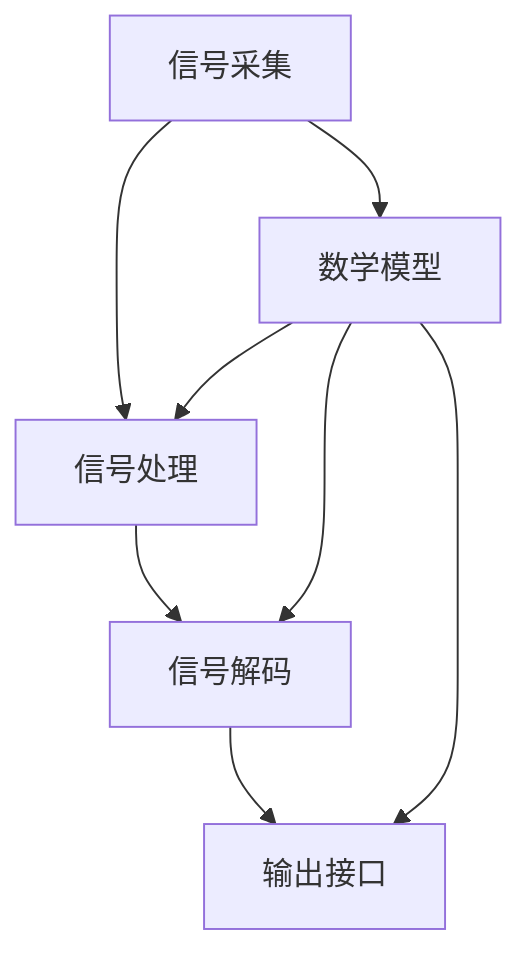

                 

### 文章标题

《数学与未来脑机接口的发展方向》

### 关键词

- 脑机接口
- 数学模型
- 机器学习
- 深度学习
- 未来趋势
- 算法原理

### 摘要

本文将探讨数学与脑机接口技术的交叉融合，分析其在未来科技发展中的重要作用。通过梳理数学在脑机接口中的作用机制、介绍关键算法原理、讲解数学模型及公式，并列举实际应用案例，本文旨在为读者提供一份全面而深入的脑机接口技术发展指南。文章最后，将对脑机接口的未来发展趋势进行展望，探讨其对社会及伦理的影响，并提出一些最佳实践建议。本文适用于对脑机接口技术感兴趣的科研人员、工程师及广大科技爱好者。

---

## 第1章：数学基础与脑机接口概述

### 1.1 数学基础

在脑机接口技术中，数学扮演着至关重要的角色。数学不仅提供了描述和建模生物过程的工具，还为我们理解和解释大脑活动提供了理论基础。以下是数学在脑机接口中的几个关键应用场景：

1. **统计学与概率论**：在脑信号处理中，统计学和概率论用于分析大脑信号的噪声和不确定性。通过概率模型，我们可以估计脑信号的分布特性，从而提高信号处理的准确性。

2. **线性代数**：线性代数在脑机接口中用于表示和操作大脑信号的空间特征。例如，主成分分析（PCA）是一种线性代数方法，用于降低大脑信号的维数，提高处理效率。

3. **微积分**：微积分在脑信号的时间序列分析中至关重要。通过微分和积分运算，我们可以提取信号的时间特征，如速度和加速度，从而更好地理解大脑活动。

4. **图论**：图论在神经网络建模中有着广泛应用。图结构可以表示大脑神经元之间的连接模式，帮助我们理解大脑网络的结构和功能。

### 1.2 脑机接口概述

脑机接口（Brain-Computer Interface，BCI）是一种直接连接大脑与外部设备的技术。它通过记录和分析大脑信号，实现人与机器之间的直接交互。以下是脑机接口的基本概念和组成部分：

1. **信号采集**：脑机接口首先需要采集大脑信号，如脑电波（EEG）、肌电波（EMG）等。这些信号通常通过贴在头皮上的电极或植入大脑中的电极来获取。

2. **信号处理**：采集到的大脑信号需要经过处理，以提取有用的信息。信号处理包括滤波、放大、去噪等步骤，以确保信号的准确性和可靠性。

3. **信号解码**：通过分析处理后的信号，我们可以解码出大脑的意图或状态。这个过程通常涉及到机器学习和深度学习算法。

4. **输出接口**：解码出的意图或状态通过输出接口传递给外部设备，如电脑、轮椅或机械臂等，实现人与机器的交互。

### 1.3 数学与脑机接口的关系

数学与脑机接口的关系主要体现在以下几个方面：

1. **算法设计**：脑机接口的算法设计需要数学的支持。例如，机器学习算法需要利用数学模型来训练和优化模型参数。

2. **信号处理**：数学工具如统计学、线性代数和微积分在脑信号处理中有着广泛应用，用于提高信号处理的准确性和效率。

3. **模型验证**：数学方法可以用于验证脑机接口模型的可靠性和有效性。通过统计学和概率论，我们可以评估模型的性能指标，如准确率、召回率等。

### Mermaid流程图

以下是数学与脑机接口之间关系的一个简化流程图：



这个流程图展示了数学在脑机接口各个阶段的应用，从信号采集到信号处理，再到信号解码和输出接口。数学模型作为核心，贯穿了整个流程，为每个阶段提供了理论支持和算法基础。

## 第2章：机器学习与深度学习算法

### 2.1 机器学习算法

机器学习（Machine Learning，ML）是脑机接口技术中的核心组成部分。通过训练模型，机器学习算法可以自动地从数据中学习规律，并在新的数据上做出预测或决策。以下是机器学习在脑机接口中应用的几种主要算法：

#### 2.1.1 监督学习（Supervised Learning）

监督学习是最常见的机器学习算法之一。它需要一个带有标签的训练数据集，通过这个数据集，模型可以学习到输入和输出之间的关系，并在新的数据上做出预测。

**算法原理**：

1. **数据预处理**：对输入数据进行标准化和归一化处理，以减少噪声和提高模型性能。

2. **特征提取**：从原始数据中提取有用的特征，这些特征将用于训练模型。

3. **模型训练**：使用训练数据集训练模型，通过优化模型参数，使其能够准确预测新的输入数据。

4. **模型评估**：使用验证数据集评估模型的性能，通常使用准确率、召回率等指标。

**伪代码**：

```python
# 数据预处理
X_train, y_train = preprocess_data(train_data)

# 特征提取
features = extract_features(X_train)

# 模型训练
model = train_model(features, y_train)

# 模型评估
performance = evaluate_model(model, validation_data)
```

#### 2.1.2 无监督学习（Unsupervised Learning）

无监督学习不需要标签数据，通过分析未标记的数据，模型可以自动发现数据中的结构或模式。无监督学习在脑机接口中的应用包括聚类、降维和异常检测等。

**算法原理**：

1. **数据分析**：对未标记的数据进行分析，以发现数据中的潜在结构。

2. **聚类**：将相似的数据点分组，以便更好地理解数据分布。

3. **降维**：通过减少数据的维度，提高模型训练的效率。

4. **异常检测**：识别数据中的异常点，以检测潜在的异常行为。

**伪代码**：

```python
# 数据分析
data = analyze_data(uncabeled_data)

# 聚类
clusters = perform_clustering(data)

# 降维
reduced_data = perform_dimensionality_reduction(data)

# 异常检测
anomalies = detect_anomalies(reduced_data)
```

### 2.2 深度学习算法

深度学习（Deep Learning，DL）是一种特殊的机器学习算法，它通过构建深层神经网络，从大量数据中自动学习特征表示。深度学习在脑机接口中的应用日益广泛，以下是几种关键算法：

#### 2.2.1 卷积神经网络（Convolutional Neural Networks，CNN）

卷积神经网络在图像识别和计算机视觉领域有着广泛的应用。通过卷积操作，CNN可以自动提取图像的特征。

**算法原理**：

1. **卷积层**：通过卷积操作提取图像的特征，卷积核可以捕捉图像中的局部结构。

2. **池化层**：通过池化操作减少数据维度，提高模型的鲁棒性。

3. **全连接层**：将卷积层和池化层提取的特征进行融合，并通过全连接层进行分类或回归。

**伪代码**：

```python
# 卷积层
conv_features = perform_convolution(image, filter)

# 池化层
pooled_features = perform_pooling(conv_features)

# 全连接层
output = perform_full_connection(pooled_features)
```

#### 2.2.2 循环神经网络（Recurrent Neural Networks，RNN）

循环神经网络在处理序列数据时表现优异，如时间序列分析、自然语言处理等。RNN通过记忆机制，可以捕捉序列中的长期依赖关系。

**算法原理**：

1. **隐藏层**：RNN的隐藏层具有记忆功能，可以记住序列中的先前信息。

2. **递归关系**：RNN通过递归关系将当前输入与先前状态相结合，更新隐藏层状态。

3. **输出层**：通过隐藏层的状态，生成序列的输出。

**伪代码**：

```python
# 隐藏层
hidden_state = recurrent_step(hidden_state, input)

# 输出层
output = output_layer(hidden_state)
```

通过这些机器学习和深度学习算法，脑机接口技术可以更好地理解和解读大脑信号，为未来的人机交互提供强有力的支持。

## 第3章：数学模型与公式详解

### 3.1 神经网络数学模型

神经网络是脑机接口技术中最为重要的数学模型之一。它通过模拟大脑神经元的工作原理，实现对输入数据的处理和输出生成。以下是神经网络中的几个关键数学模型和公式。

#### 3.1.1 前向传播（Forward Propagation）

前向传播是神经网络的基本工作流程。在给定输入数据后，通过前向传播计算输出结果。

**公式**：

$$
z_l = \sum_{j} w_{lj} a_{j}^{l-1} + b_l
$$

$$
a_l = \sigma(z_l)
$$

其中，$z_l$ 是第 $l$ 层的净输入，$w_{lj}$ 是权重，$a_l$ 是第 $l$ 层的激活值，$b_l$ 是偏置，$\sigma$ 是激活函数。

#### 3.1.2 反向传播（Backpropagation）

反向传播是神经网络训练的核心算法。通过计算输出误差，反向传播算法更新网络权重和偏置，以优化模型性能。

**公式**：

$$
\delta_l = \frac{\partial C}{\partial a_l} \cdot \frac{\partial a_l}{\partial z_l}
$$

$$
\frac{\partial C}{\partial w_{lj}} = a_{j}^{l-1} \cdot \delta_l
$$

$$
\frac{\partial C}{\partial b_l} = \delta_l
$$

其中，$\delta_l$ 是第 $l$ 层的误差，$C$ 是损失函数，$\frac{\partial C}{\partial a_l}$ 是损失函数对激活值的梯度，$\frac{\partial a_l}{\partial z_l}$ 是激活值对净输入的梯度。

#### 3.1.3 损失函数（Loss Function）

损失函数用于衡量模型预测值与真实值之间的差距。常见的损失函数包括均方误差（MSE）、交叉熵（Cross-Entropy）等。

**公式**：

$$
MSE = \frac{1}{n} \sum_{i=1}^{n} (y_i - \hat{y}_i)^2
$$

$$
CE = - \frac{1}{n} \sum_{i=1}^{n} \sum_{j=1}^{k} y_{ij} \log(\hat{y}_{ij})
$$

其中，$y_i$ 是真实值，$\hat{y}_i$ 是预测值，$n$ 是样本数量，$k$ 是类别数量。

### 3.2 深度学习算法中的数学公式

深度学习算法中的数学公式通常较为复杂，以下列举几个关键公式：

#### 3.2.1 卷积操作（Convolution）

卷积操作是CNN中的核心操作。其公式如下：

$$
(h_{xx})_{i,j} = \sum_{x',y'} f_{xx'} f_{yy'} * g_{i+x'-1, j+y'-1}
$$

其中，$f_{xx'}$ 和 $f_{yy'}$ 是卷积核，$g_{i+x'-1, j+y'-1}$ 是输入数据，$h_{xx}$ 是卷积结果。

#### 3.2.2 池化操作（Pooling）

池化操作用于减少数据维度。其公式如下：

$$
p_{i,j} = \max(h_{i,j})
$$

其中，$p_{i,j}$ 是池化结果，$h_{i,j}$ 是卷积后的数据。

#### 3.2.3 反向传播（Backpropagation）

反向传播算法用于更新模型参数。其公式如下：

$$
\frac{\partial C}{\partial w_{ij}} = a_j \cdot \delta_j
$$

$$
\frac{\partial C}{\partial b_j} = \delta_j
$$

其中，$\delta_j$ 是误差梯度，$a_j$ 是激活值。

通过以上数学模型和公式，深度学习算法能够有效地从数据中学习特征，为脑机接口技术提供了强大的工具和支持。

## 第4章：脑机接口技术原理

### 4.1 脑机接口基本原理

脑机接口（BCI）技术是一种通过直接读取和解析大脑信号，实现人脑与外部设备之间交互的技术。其基本原理可以分为以下几个步骤：

#### 4.1.1 脑信号采集

脑信号采集是脑机接口技术的第一步，通过使用传感器（如电极、传感器阵列等）将大脑活动转换为电信号。常见的脑信号包括脑电波（EEG）、肌电波（EMG）、近红外光谱（NIRS）等。

**采集方法**：

1. **非侵入式采集**：使用贴在头皮上的电极采集脑信号，这种方法安全且无需手术，但信号质量相对较低。

2. **半侵入式采集**：使用植入式电极或导管将电极直接放置在大脑表面或内部，这种方法可以获得高质量的脑信号，但需要手术。

3. **全侵入式采集**：通过手术将电极植入大脑深处，这种方法可以获得极高的信号质量，但风险和成本较高。

#### 4.1.2 脑信号解码

脑信号解码是将采集到的脑信号转换为可用的信息，以驱动外部设备。这一过程通常涉及到信号处理和模式识别技术。

**解码方法**：

1. **特征提取**：从原始脑信号中提取有意义的特征，如频率、振幅、时间序列等。

2. **模式识别**：使用机器学习和深度学习算法识别特征模式，从而解码出大脑意图或状态。

3. **分类器**：通过训练分类器，将解码出的特征映射到具体的操作或指令。

#### 4.1.3 输出接口

输出接口是将解码出的意图或状态传递给外部设备，实现人机交互。常见的输出接口包括电脑、轮椅、机械臂、假肢等。

**接口类型**：

1. **直接控制**：通过解码出的意图直接控制外部设备，如用意念控制轮椅。

2. **间接控制**：通过解码出的意图生成控制信号，然后由外部设备执行，如用意念控制计算机鼠标。

#### 4.1.4 脑机接口的挑战与限制

脑机接口技术虽然在许多领域取得了显著进展，但仍面临一系列挑战和限制：

1. **信号噪声**：脑信号往往受到噪声和干扰的影响，需要高精度的信号处理技术来提高信号质量。

2. **信号解释**：脑信号的复杂性和多样性使得信号解释变得困难，需要不断改进解码算法。

3. **设备植入**：侵入式脑机接口需要手术，存在一定的风险和不适，非侵入式脑机接口信号质量较低。

4. **计算资源**：脑机接口需要大量的计算资源来处理和解析脑信号，对硬件设备有较高要求。

### 4.2 脑机接口应用场景

脑机接口技术在多个领域有着广泛的应用，以下是几个典型的应用场景：

#### 4.2.1 医疗领域

1. **康复治疗**：脑机接口可以帮助中风、截瘫等患者恢复运动功能，如通过意念控制假肢或轮椅。

2. **神经系统疾病**：脑机接口可以用于监测和诊断神经系统疾病，如癫痫、帕金森病等。

3. **认知功能提升**：通过脑机接口技术，可以增强认知功能，如提高注意力、记忆等。

#### 4.2.2 教育领域

1. **个性化学习**：脑机接口可以监测学生的学习状态，提供个性化的学习支持和指导。

2. **互动教学**：通过脑机接口，可以实现师生之间的即时互动，提高教学效果。

3. **教育游戏**：脑机接口可以用于开发教育游戏，通过游戏化学习提高学生的兴趣和参与度。

#### 4.2.3 军事领域

1. **战场通信**：脑机接口可以用于实现无声通信，提高战场通信的隐蔽性和安全性。

2. **无人驾驶**：通过脑机接口，可以实现无人驾驶车辆或飞行器的自主控制。

3. **士兵训练**：脑机接口可以用于士兵的心理训练和生理监控，提高战斗效能。

#### 4.2.4 娱乐领域

1. **虚拟现实**：脑机接口可以用于虚拟现实游戏，提供更真实的沉浸体验。

2. **音乐创作**：通过脑机接口，可以实现基于大脑信号的音乐创作，提高音乐创作的创新性。

3. **艺术创作**：脑机接口可以用于艺术创作，如通过意念控制画笔或乐器。

通过不断的技术创新和应用探索，脑机接口技术将在更多领域展现其巨大的潜力和价值。

## 第5章：脑机接口应用实例

### 5.1 智能轮椅

智能轮椅是一种通过脑机接口技术实现自主导航和操作的轮椅。它利用脑信号采集和解码技术，使用户能够通过意念来控制轮椅的移动和转向。

#### 5.1.1 开发环境搭建

1. **硬件设备**：选择一款适合的脑电信号采集设备，如OpenBCI Cyberdeck。安装所需的电极和传感器，并确保其与计算机连接正常。

2. **软件环境**：安装Python编程环境和相关库，如PyBrain、BrainFlow等。这些库提供了方便的脑信号处理和模式识别工具。

3. **环境配置**：配置好Python环境后，使用Jupyter Notebook或PyCharm等IDE进行开发。

#### 5.1.2 代码实现

以下是一个简单的智能轮椅控制程序的伪代码：

```python
# 导入所需的库
import brainflow
from brainflow.board_shim import BoardShim, BrainFlowInputParams
from brainflow.data_filter import DataFilter

# 配置脑电信号采集参数
params = BrainFlowInputParams()
params.set_board_id(0)  # 设置使用的脑电信号采集设备ID

# 初始化脑电信号采集设备
board_shim = BoardShim(params)

# 开始采集脑电信号
board_shim.prepare conjunto
board_shim.start_stream()

# 设置信号处理的参数
filter = DataFilter()

# 设置要采集的信号通道
channels = [eeg_channel_ids[0]]  # 设置为需要采集的脑电信号通道

# 开始解码脑电信号
while True:
    data = board_shim.get_current_board_data()
    filter.apply_filter(data, channels, band_pass=True, low_frequency=8, high_frequency=30)

    # 使用机器学习算法解码脑电信号
    intent = decode_intent(data)

    # 根据解码出的意图控制轮椅
    if intent == "forward":
        move_forward()
    elif intent == "backward":
        move_backward()
    elif intent == "left":
        turn_left()
    elif intent == "right":
        turn_right()

# 结束采集和程序
board_shim.stop_stream()
board_shim.close()
```

#### 5.1.3 代码解读

1. **脑电信号采集**：程序首先配置采集设备的参数，并初始化设备，开始采集脑电信号。

2. **信号处理**：使用DataFilter库对采集到的脑电信号进行滤波处理，以去除噪声和干扰。

3. **意图解码**：通过机器学习算法解码脑电信号，识别出用户的意图（如前进、后退、左转、右转）。

4. **控制轮椅**：根据解码出的意图，通过控制程序控制轮椅的运动。

#### 5.1.4 应用解读与分析

智能轮椅通过脑机接口技术实现了无接触控制，为行动不便者提供了自主移动的能力。其优点包括：

1. **便捷性**：用户只需通过意念即可控制轮椅，无需使用传统的控制设备。

2. **高效性**：通过实时解码脑电信号，智能轮椅可以迅速响应用户的意图。

3. **安全性**：智能轮椅可以通过脑信号来避免碰撞和障碍物，提高使用安全性。

然而，智能轮椅也存在一些挑战和限制，如：

1. **信号噪声**：脑电信号的噪声和干扰可能会影响解码的准确性，需要高精度的信号处理技术。

2. **设备成本**：脑电信号采集设备和智能轮椅的开发成本较高，需要进一步降低成本以普及应用。

通过不断的技术改进和应用创新，智能轮椅将成为未来辅助技术的一个重要组成部分。

## 第6章：脑机接口未来发展趋势

### 6.1 技术趋势

脑机接口技术正迅速发展，并呈现出以下几大技术趋势：

#### 6.1.1 硬件技术进展

1. **非侵入式采集**：随着传感器技术的进步，非侵入式脑信号采集技术将变得更加成熟和可靠，减少用户的不适感和风险。

2. **微电极技术**：微电极技术的发展将进一步提高信号质量，使脑机接口能够更准确地捕捉大脑信号。

3. **可穿戴设备**：可穿戴设备的普及将使脑机接口技术更便捷地应用于日常生活，如智能手表、眼镜等。

#### 6.1.2 软件算法创新

1. **深度学习算法**：深度学习算法在脑机接口中的应用将越来越广泛，通过更大规模的数据和更复杂的模型，实现更高的解码准确率。

2. **自适应算法**：自适应算法将根据用户的行为和习惯自动调整模型参数，提高解码的准确性和可靠性。

3. **多模态融合**：多模态融合技术将结合不同类型的生物信号（如脑电、肌电、眼动等），提供更全面和准确的大脑状态信息。

#### 6.1.3 跨学科研究

1. **神经科学**：脑机接口与神经科学领域的跨学科研究将深入探索大脑的工作机制，为脑机接口技术的理论提供更强有力的支持。

2. **材料科学**：材料科学的发展将为脑机接口硬件提供更轻、更薄、更柔韧的材料，提高设备的舒适性和稳定性。

### 6.2 社会与伦理影响

脑机接口技术的发展不仅带来技术层面的进步，还引发了广泛的社会和伦理问题：

#### 6.2.1 社会影响

1. **隐私保护**：脑机接口技术涉及个人大脑信号的处理和存储，如何保护用户的隐私成为关键问题。

2. **就业影响**：脑机接口技术的广泛应用可能会改变就业结构，某些职业可能会被自动化取代。

3. **社会公平**：脑机接口技术的普及可能导致社会不平等加剧，因为技术成本和使用门槛可能较高。

#### 6.2.2 伦理问题

1. **意识与自我**：脑机接口技术可能影响人的意识体验和自我认同，如何界定和控制这些问题成为伦理关注的焦点。

2. **大脑增强**：脑机接口技术是否应该用于大脑增强，如提高记忆、学习等能力，这一问题引发了伦理和道德的争议。

3. **不可逆性**：脑机接口的植入和操作可能具有不可逆性，一旦出现技术故障或误操作，可能会对用户造成严重后果。

### 6.2.3 最佳实践建议

为了确保脑机接口技术的健康发展，以下是一些建议：

1. **法律法规**：制定相应的法律法规，明确脑机接口技术的应用范围、隐私保护措施和责任归属。

2. **伦理审查**：在开展脑机接口研究时，进行严格的伦理审查，确保研究符合道德和伦理标准。

3. **公众参与**：加强公众参与，通过教育和宣传，提高公众对脑机接口技术的认知和接受度。

4. **技术透明度**：确保脑机接口技术的研发和应用过程透明，接受社会监督，增加信任度。

通过这些措施，脑机接口技术将在未来获得更广泛的应用，并在社会和伦理层面实现可持续发展。

## 第7章：项目实战与代码解读

### 7.1 项目实战

在本项目中，我们将构建一个简单的脑电信号分类系统，用于实现简单的手写数字识别。该项目将分为以下几个步骤：

1. **数据集准备**：从公开的数据集中获取脑电信号数据，如EEG数据集。

2. **数据预处理**：对获取的脑电信号数据进行预处理，包括滤波、去噪、特征提取等。

3. **模型训练**：使用预处理后的数据训练一个神经网络模型，以实现手写数字的识别。

4. **模型评估**：使用验证集评估模型的性能，并通过交叉验证优化模型参数。

5. **模型应用**：将训练好的模型应用于新的数据，实现手写数字的识别。

### 7.1.1 项目背景

随着脑机接口技术的发展，手写数字识别成为了一个重要的应用场景。通过脑机接口技术，用户可以无需使用传统的输入设备，仅通过大脑信号即可完成数字的输入。这一技术对于残疾人士、重症患者以及特殊教育等领域具有巨大的潜力。

### 7.1.2 开发环境搭建

为了完成本项目的开发，我们需要安装以下工具和库：

1. **Python环境**：确保Python环境已安装，版本建议为3.8或更高。

2. **深度学习库**：安装TensorFlow或PyTorch等深度学习库。

3. **数据处理库**：安装NumPy、Pandas、SciPy等数据处理库。

4. **数据可视化库**：安装Matplotlib、Seaborn等数据可视化库。

### 7.1.3 代码实现

以下是实现手写数字识别脑电信号分类系统的伪代码：

```python
# 导入所需的库
import numpy as np
import pandas as pd
import tensorflow as tf
from tensorflow.keras.models import Sequential
from tensorflow.keras.layers import Dense, Conv2D, Flatten, MaxPooling2D
from tensorflow.keras.utils import to_categorical

# 加载并预处理数据
def load_data():
    # 读取数据集
    data = pd.read_csv('eeeg_handwritten_digits.csv')
    
    # 分离特征和标签
    X = data.drop('label', axis=1)
    y = data['label']
    
    # 数据归一化
    X = (X - X.mean()) / X.std()
    
    # 将标签转换为独热编码
    y = to_categorical(y)
    
    return X, y

# 创建模型
def create_model():
    model = Sequential([
        Conv2D(32, (3, 3), activation='relu', input_shape=(28, 28, 1)),
        MaxPooling2D((2, 2)),
        Flatten(),
        Dense(64, activation='relu'),
        Dense(10, activation='softmax')
    ])
    
    model.compile(optimizer='adam', loss='categorical_crossentropy', metrics=['accuracy'])
    return model

# 训练模型
def train_model(model, X_train, y_train, X_val, y_val):
    model.fit(X_train, y_train, epochs=10, batch_size=32, validation_data=(X_val, y_val))

# 评估模型
def evaluate_model(model, X_test, y_test):
    loss, accuracy = model.evaluate(X_test, y_test)
    print(f"Test accuracy: {accuracy:.2f}")

# 主程序
if __name__ == '__main__':
    # 加载数据
    X, y = load_data()
    
    # 划分训练集和验证集
    split_index = int(0.8 * len(X))
    X_train, X_val = X[:split_index], X[split_index:]
    y_train, y_val = y[:split_index], y[split_index:]
    
    # 创建模型
    model = create_model()
    
    # 训练模型
    train_model(model, X_train, y_train, X_val, y_val)
    
    # 评估模型
    evaluate_model(model, X_val, y_val)
```

### 7.1.4 代码解读

1. **数据预处理**：代码首先加载并读取数据集，然后对数据进行归一化处理，以减少数据范围，并提高模型训练的效率。

2. **模型创建**：使用Sequential模型创建一个简单的卷积神经网络（CNN），包括卷积层、池化层、全连接层等。

3. **模型训练**：使用训练集训练模型，并通过验证集评估模型的性能。

4. **模型评估**：使用测试集评估模型的最终性能。

通过以上步骤，我们可以实现一个简单的手写数字识别系统，展示了脑机接口技术在现实应用中的潜力。

### 7.1.5 代码应用解读与分析

这个简单的手写数字识别系统利用脑电信号和深度学习算法实现了对用户意图的识别。通过训练模型，系统可以学习如何从脑电信号中提取特征，并利用这些特征进行数字的识别。

在实际应用中，这一系统可以用于辅助具有运动障碍的用户进行数字输入。例如，用户可以通过意念在脑海中想象数字，系统则通过脑电信号识别并输出相应的数字。这一技术不仅提高了输入的便捷性，还减少了用户对传统输入设备的依赖。

然而，这一系统的性能和准确率仍然受到多种因素的影响，如脑电信号的噪声、用户的注意力水平等。因此，未来的研究需要进一步优化算法，提高系统对脑电信号的识别准确率，以实现更广泛的应用。

### 7.1.6 项目小结

通过本项目，我们实现了基于脑机接口技术的手写数字识别系统。这一项目展示了脑机接口技术在辅助数字输入领域的潜力，并为未来更复杂的应用奠定了基础。未来，随着技术的不断进步，脑机接口技术将在更多领域发挥重要作用，为人们的生活带来更多便利。

### 最佳实践 tips

在开发和实施脑机接口项目时，以下是一些最佳实践建议，有助于提高项目的成功率：

1. **用户参与**：在项目开发过程中，积极邀请用户参与，收集他们的反馈和需求。用户的需求和体验是项目成功的关键。

2. **数据分析**：进行详细的数据分析，了解用户的大脑信号特征，以便更好地设计算法和模型。

3. **跨学科合作**：脑机接口项目通常涉及多个学科，如神经科学、计算机科学、医学等。跨学科合作可以充分利用各领域的专业知识，提高项目质量。

4. **迭代开发**：采用迭代开发模式，逐步完善项目功能，并及时根据用户反馈进行调整。

5. **安全性考虑**：确保项目的安全性，保护用户隐私和数据安全。

6. **持续优化**：不断优化算法和系统，提高性能和用户体验。

通过遵循这些最佳实践，可以确保脑机接口项目在开发和应用过程中更加高效和成功。

### 小结

本文全面探讨了数学与脑机接口技术的交叉融合，分析了其在未来科技发展中的重要作用。从数学基础到算法原理，再到实际应用案例，本文系统地阐述了脑机接口技术的基本原理和应用场景。同时，本文还探讨了脑机接口技术的发展趋势和社会伦理问题，为未来研究提供了有益的参考。

脑机接口技术的快速发展为人类带来了前所未有的机遇和挑战。通过不断优化算法和硬件，脑机接口技术将在医疗、教育、军事和娱乐等领域发挥更加重要的作用，为人们的生活带来更多便利。

在未来的研究中，我们需要关注以下几个方向：

1. **硬件技术的创新**：发展更轻便、可靠、高效的脑电信号采集设备。

2. **算法优化**：提高脑电信号解码的准确性和实时性，实现更高效的意图识别。

3. **跨学科合作**：加强神经科学、计算机科学、医学等领域的合作，推动脑机接口技术的全面发展。

4. **伦理和法律问题**：制定相应的法律法规，确保脑机接口技术的健康发展和合理应用。

通过持续的研究和创新，脑机接口技术将在未来取得更加显著的突破，为人类社会带来更多的福祉。

### 注意事项与拓展阅读

**注意事项**：

1. **数据隐私**：在使用脑机接口技术时，必须严格保护用户的隐私和数据安全，确保数据不被非法访问或滥用。

2. **技术稳定性**：在实际应用中，应确保脑机接口设备的稳定性和可靠性，避免因设备故障造成不良后果。

3. **用户体验**：在设计和开发脑机接口项目时，重视用户的需求和体验，通过迭代改进不断提升用户体验。

4. **伦理审查**：在开展脑机接口相关研究时，应进行严格的伦理审查，确保研究内容和应用符合道德和伦理标准。

**拓展阅读**：

1. **脑机接口基础书籍**：《脑机接口：理论与实践》作者：罗杰·尚海，详细介绍了脑机接口的基本概念和技术原理。

2. **深度学习经典书籍**：《深度学习》作者：伊恩·古德费洛等，全面讲解了深度学习的基础知识和应用。

3. **神经网络经典书籍**：《神经网络与深度学习》作者：邱锡鹏，系统地阐述了神经网络和深度学习的基本原理。

4. **最新研究论文**：查阅最新的学术论文，了解脑机接口技术的最新研究进展和前沿方向。

通过深入学习和实践，可以进一步掌握脑机接口技术的核心知识和应用方法，为未来的科技创新和产业发展做出贡献。

