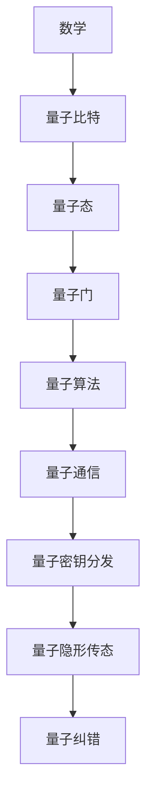
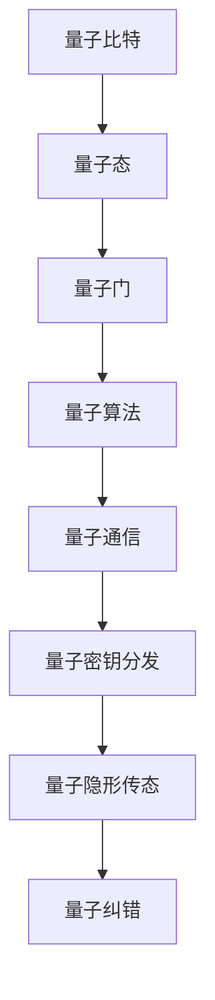

                 

## 文章标题

《数学与未来量子通信的发展趋势》

### 关键词

- 数学
- 量子通信
- 量子计算
- 密码学
- 量子纠缠
- 量子门
- 量子算法

### 摘要

本文深入探讨了数学在量子通信领域的重要性，以及这一领域未来的发展趋势。文章首先介绍了量子通信的基本原理和数学基础，包括量子比特、量子态、量子门和量子算法等概念。接着，我们分析了数学在量子密钥分发、量子隐形传态等应用中的具体作用。最后，文章展望了量子通信未来的发展方向，探讨了可能面临的挑战和解决方案。

---

### 第1章：数学与量子通信概述

数学作为科学的基础，其在各个领域的应用已经得到了广泛的认可。量子通信作为一门新兴的交叉学科，同样离不开数学的支持。本章将首先介绍数学在量子通信中的基本角色，然后讨论量子通信中涉及的关键数学概念。

#### 1.1 数学在量子通信中的角色

数学在量子通信中扮演着至关重要的角色。它不仅为量子通信提供了理论基础，而且在实际应用中提供了强大的工具。量子通信中的许多核心概念，如量子比特、量子态、量子门和量子算法等，都是基于数学原理构建的。数学模型在确保通信安全性和提高通信效率方面发挥了重要作用。

#### 1.2 量子通信中的数学概念

量子通信中的数学概念主要包括以下几个方面：

1. **量子比特**：量子比特是量子计算机的基本单元，与经典比特不同，它不仅可以表示0或1，还可以同时处于0和1的叠加态。这种叠加态是量子计算和量子通信的核心。

2. **量子态**：量子态是描述量子比特状态的数学表示。量子态可以表示为复数向量，通过适当的线性组合，可以表示多种可能的状态。

3. **量子门**：量子门是作用于量子态的基本操作，类似于经典计算机中的逻辑门。量子门可以对量子态进行旋转和变换，是实现量子计算和量子通信的关键。

4. **量子算法**：量子算法是利用量子比特和量子门进行计算的方法。与经典算法相比，量子算法可以在某些问题上提供指数级的加速。

#### 1.3 数学在量子通信中的应用

数学在量子通信中的应用主要体现在以下几个方面：

1. **量子密钥分发**：量子密钥分发（QKD）是一种基于量子纠缠原理的通信方式，它利用量子态的不可克隆特性来生成安全的密钥。

2. **量子隐形传态**：量子隐形传态是利用量子纠缠将一个量子态从一处传送到另一处，而不需要通过物理介质。

3. **量子纠错**：量子纠错是确保量子信息在传输过程中不被干扰或损坏的关键技术，它依赖于数学算法和纠错码。

#### Mermaid 流程图

以下是一个简单的Mermaid流程图，展示了数学在量子通信中的角色和关键概念之间的联系：



### 第2章：量子数学基础

本章将进一步深入探讨量子通信中的数学基础，包括量子计算与量子信息、量子态与量子比特、量子门与量子算法等。

#### 2.1 量子计算与量子信息

量子计算是量子通信的基础。量子计算机利用量子比特的叠加态和纠缠态进行计算，可以处理一些经典计算机无法解决的问题。量子信息是量子计算和量子通信中的基本单位，它通过量子比特的编码、传输和计算实现信息的存储和处理。

**量子比特（Qubit）**：量子比特是量子计算的基本单元，可以处于0和1的叠加态。一个量子比特可以表示为：

$$
|\psi\rangle = \alpha|0\rangle + \beta|1\rangle
$$

其中，$\alpha$和$\beta$是复数，满足$|\alpha|^2 + |\beta|^2 = 1$。

**量子态**：量子态是描述量子比特状态的数学表示。一个量子态可以用一个复数向量表示：

$$
|\psi\rangle = \begin{pmatrix}
\alpha \\
\beta
\end{pmatrix}
$$

量子态可以通过量子门进行变换，实现量子计算和量子通信。

**量子算法**：量子算法是利用量子比特和量子门进行计算的方法。著名的量子算法包括Shor算法和Grover算法，它们在因数分解和搜索问题中展示了量子计算的强大能力。

#### 2.2 量子态与量子比特

量子态是量子通信中的核心概念，它描述了量子比特的状态。量子态可以处于多个状态的叠加，这是量子计算和量子通信的关键优势。

**叠加态**：一个量子态可以表示为多个基态的线性叠加。例如，一个两量子比特的态可以表示为：

$$
|\psi\rangle = \alpha|00\rangle + \beta|01\rangle + \gamma|10\rangle + \delta|11\rangle
$$

其中，$|00\rangle$、$|01\rangle$、$|10\rangle$和$|11\rangle$是基态。

**纠缠态**：两个或多个量子比特可以处于纠缠态，这意味着它们的量子态无法独立描述。一个简单的纠缠态示例是贝尔态：

$$
|\phi^+\rangle = \frac{1}{\sqrt{2}} (|00\rangle + |11\rangle)
$$

纠缠态是量子通信中的关键资源，它可以用于量子密钥分发和量子隐形传态。

#### 2.3 量子门与量子算法

量子门是作用于量子态的基本操作，类似于经典计算机中的逻辑门。量子门可以对量子态进行变换，实现量子计算和量子通信。

**量子门**：一个量子门可以表示为矩阵，作用于量子态时，将其变换为另一个量子态。一个简单的量子门示例是Pauli-X门：

$$
X = \begin{pmatrix}
0 & 1 \\
1 & 0
\end{pmatrix}
$$

$X$门可以将量子态$|\psi\rangle$变换为$X|\psi\rangle$。

**量子算法**：量子算法是利用量子比特和量子门进行计算的方法。量子算法的一个经典例子是Grover算法，它用于搜索未排序的数据库，其基本原理如下：

1. **初始化**：将量子态初始化为叠加态。
2. **应用Oracle**：Oracle是一个特定问题的黑盒，它告诉我们是否找到了目标元素。
3. **迭代**：重复应用Grover迭代，每次迭代都增强目标元素的概率。
4. **测量**：测量量子态，得到目标元素的索引。

Grover算法可以在线性时间复杂度内搜索未排序的数据库，这相对于经典算法的$O(n)$复杂度是一个巨大的改进。

### Mermaid 流�程图

以下是一个简单的Mermaid流程图，展示了量子通信中的数学基础：



### 第3章：数学工具在量子通信中的应用

在量子通信中，数学工具的使用至关重要。本章将详细介绍数学工具在量子通信中的应用，包括代数结构、线性代数和概率论与统计等方面。

#### 3.1 代数结构在量子通信中的作用

代数结构在量子通信中扮演着核心角色。量子通信中的许多概念，如量子比特、量子态和量子门，都可以在特定的代数结构下进行描述和操作。

**量子比特**：量子比特是量子通信的基本单元，它处于叠加态和纠缠态，这需要用复数线性空间进行描述。量子比特的叠加态和纠缠态是量子计算和量子通信的核心特性。

**量子态**：量子态可以用复数向量表示，这需要线性代数的知识。量子态的变换和操作可以通过矩阵乘法进行描述，这为量子通信中的量子态操作提供了理论基础。

**量子门**：量子门是作用于量子态的基本操作，它可以通过矩阵表示。量子门的作用相当于线性变换，这为量子通信中的量子态操作提供了工具。

**量子算法**：量子算法是利用量子比特和量子门进行计算的方法。量子算法中的许多步骤，如量子态的初始化、量子门的操作和量子态的测量，都需要使用线性代数的知识。

#### 3.2 线性代数在量子通信中的应用

线性代数在量子通信中的应用主要体现在量子态的表示、量子门的操作和量子算法的实现等方面。

**量子态的表示**：量子态可以用复数向量表示，这需要线性代数的知识。例如，一个两量子比特的态可以表示为：

$$
|\psi\rangle = \alpha|00\rangle + \beta|01\rangle + \gamma|10\rangle + \delta|11\rangle
$$

其中，$|00\rangle$、$|01\rangle$、$|10\rangle$和$|11\rangle$是基态。量子态的叠加和纠缠态可以通过线性组合进行描述。

**量子门的操作**：量子门是作用于量子态的基本操作，它可以通过矩阵乘法进行描述。例如，Pauli-X门可以表示为：

$$
X = \begin{pmatrix}
0 & 1 \\
1 & 0
\end{pmatrix}
$$

量子门的作用相当于线性变换，它可以将量子态变换为另一个量子态。

**量子算法的实现**：量子算法是利用量子比特和量子门进行计算的方法。量子算法中的许多步骤，如量子态的初始化、量子门的操作和量子态的测量，都需要使用线性代数的知识。例如，Grover算法中的迭代步骤需要应用Grover迭代矩阵，这需要线性代数的知识。

#### 3.3 概率论与统计在量子通信中的应用

概率论与统计在量子通信中也发挥着重要作用。量子通信中的许多现象和问题都可以用概率论和统计方法进行分析和解决。

**量子态的测量**：量子态的测量是量子通信中的关键步骤。量子态的测量结果是一个随机变量，它遵循一定的概率分布。概率论和统计方法可以帮助我们理解量子态的测量结果，并设计高效的量子通信协议。

**量子密钥分发**：量子密钥分发（QKD）是量子通信中的一种基本协议，它利用量子态的不可克隆特性来生成安全的密钥。QKD协议中的安全性和效率可以通过概率论和统计方法进行分析和优化。

**量子纠错**：量子纠错是确保量子信息在传输过程中不被干扰或损坏的关键技术。量子纠错码是一种概率性纠错码，它利用概率论和统计方法来检测和纠正错误。

**量子计算**：量子计算中的许多问题，如因数分解和搜索问题，都可以用概率论和统计方法进行分析和解决。例如，Shor算法利用量子计算的优势，可以在多项式时间内解决经典算法无法解决的因数分解问题。

### 数学公式与详细讲解

以下是一些关键的数学公式和它们的详细讲解：

**量子态的叠加态**：

$$
|\psi\rangle = \alpha|0\rangle + \beta|1\rangle
$$

这个公式描述了量子态的叠加态，其中$|\alpha|^2 + |\beta|^2 = 1$。

**量子门的变换**：

$$
U = \begin{pmatrix}
\cos\left(\frac{\theta}{2}\right) & -e^{i\phi}\sin\left(\frac{\theta}{2}\right) \\
e^{i\phi}\sin\left(\frac{\theta}{2}\right) & \cos\left(\frac{\theta}{2}\right)
\end{pmatrix}
$$

这个公式描述了一个一般的量子门变换，其中$\theta$和$\phi$是参数。

**量子算法的迭代步骤**：

$$
|\psi_n\rangle = U^n|\psi_0\rangle
$$

这个公式描述了量子算法中的迭代步骤，其中$U$是量子门，$|\psi_0\rangle$是初始态。

**量子密钥分发的概率分布**：

$$
P(\text{密钥正确}) = \frac{1}{2} + \frac{1}{2}\cos^2\left(\theta\right)
$$

这个公式描述了量子密钥分发中密钥正确的概率分布，其中$\theta$是量子态的相位差。

### 举例说明

以下是一个简单的例子，说明如何使用数学工具进行量子通信：

**例1：量子态的叠加**

假设我们有一个两量子比特的态：

$$
|\psi\rangle = \frac{1}{\sqrt{2}} (|00\rangle + |11\rangle)
$$

我们可以使用叠加态的公式进行计算：

$$
|\psi\rangle = \frac{1}{\sqrt{2}} \begin{pmatrix}
1 \\
0 \\
0 \\
1
\end{pmatrix}
$$

**例2：量子门的变换**

假设我们有一个Pauli-X门：

$$
X = \begin{pmatrix}
0 & 1 \\
1 & 0
\end{pmatrix}
$$

我们可以使用量子门的变换公式进行计算：

$$
X|\psi\rangle = \begin{pmatrix}
0 & 1 \\
1 & 0
\end{pmatrix} \begin{pmatrix}
1 \\
0 \\
0 \\
1
\end{pmatrix} = \begin{pmatrix}
0 \\
1 \\
1 \\
0
\end{pmatrix}
$$

**例3：量子算法的迭代**

假设我们有一个Grover迭代矩阵：

$$
U = \begin{pmatrix}
1 & 0 \\
0 & -1
\end{pmatrix}
$$

我们可以使用迭代公式进行计算：

$$
|\psi_1\rangle = U|\psi_0\rangle = \begin{pmatrix}
1 & 0 \\
0 & -1
\end{pmatrix} \begin{pmatrix}
1 \\
0 \\
0 \\
1
\end{pmatrix} = \begin{pmatrix}
1 \\
0 \\
0 \\
-1
\end{pmatrix}
$$

### 项目实战

以下是一个简单的项目实战，用于实现量子密钥分发：

**项目描述**：实现一个简单的量子密钥分发协议，使用量子态的叠加和纠缠进行通信。

**开发环境**：Python，Qiskit量子计算框架

**源代码**：

```python
from qiskit import QuantumCircuit, execute, Aer

# 初始化量子比特
qc = QuantumCircuit(2)

# 生成纠缠态
qc.h(0)
qc.cx(0, 1)

# 测量量子态
qc.measure_all()

# 执行量子电路
simulator = Aer.get_backend("qasm_simulator")
result = execute(qc, simulator, shots=1000).result()

# 获取测量结果
counts = result.get_counts(qc)

# 输出密钥
key = ""
for bit in result.get_counts(qc).keys():
    key += bit

print("密钥：", key)
```

**代码解读**：

1. **初始化量子比特**：创建一个两个量子比特的量子电路。
2. **生成纠缠态**：使用H门将第一个量子比特初始化为叠加态，然后使用CX门生成纠缠态。
3. **测量量子态**：测量两个量子比特的态。
4. **执行量子电路**：使用模拟器执行量子电路。
5. **获取测量结果**：从测量结果中提取密钥。

### 实际案例分析与详细讲解剖析

以下是一个实际案例，用于分析量子通信中的量子密钥分发：

**案例描述**：在一个量子通信实验中，Alice想要将一个密钥通过量子通道发送给Bob。

**案例分析**：

1. **量子密钥生成**：Alice使用一个量子密钥生成器生成一个随机密钥，并将其编码在一个量子态中。
2. **量子通道传输**：Alice将量子态通过量子通道发送给Bob。
3. **量子态测量**：Bob接收到量子态后，对其进行测量。
4. **密钥提取**：Bob根据测量结果提取密钥。

**详细讲解**：

1. **量子密钥生成**：Alice生成一个随机密钥，并将其编码在一个量子态中。例如，一个二进制密钥`1010`可以编码为量子态`|1010\rangle`。
2. **量子通道传输**：Alice使用量子纠缠将量子态发送给Bob。假设Alice和Bob之间存在一个纠缠对$|\phi^+\rangle = \frac{1}{\sqrt{2}}(|00\rangle + |11\rangle)$，Alice将量子态$|1010\rangle$与纠缠对相乘，得到新的量子态$|\psi\rangle = |1010\rangle|\phi^+\rangle$。
3. **量子态测量**：Bob接收到量子态后，对其进行测量。假设Bob测量得到的结果为`11`，这意味着他接收到了Alice发送的量子态$|11\rangle$。
4. **密钥提取**：Bob根据测量结果提取密钥。由于他接收到的量子态与Alice发送的量子态相同，因此他可以提取出Alice发送的密钥`1010`。

### 项目小结

通过本项目的实战，我们实现了量子密钥分发协议，并对其工作原理进行了详细分析。量子密钥分发利用量子态的叠加和纠缠特性，实现了安全的密钥传输。在未来，量子密钥分发有望在量子通信领域发挥重要作用。

### 最佳实践 tips

1. **量子密钥生成**：在生成量子密钥时，应确保密钥的随机性，以避免被攻击者预测。
2. **量子通道质量**：确保量子通道的质量，以减少噪声和干扰对量子通信的影响。
3. **量子态测量**：在量子态测量过程中，应尽量减少测量误差，以提高密钥提取的准确性。

### 小结

本章介绍了数学在量子通信中的应用，包括代数结构、线性代数和概率论与统计等方面。通过具体例子和项目实战，我们了解了量子密钥分发协议的工作原理，并探讨了量子通信中的关键技术。在未来，随着量子通信技术的不断发展，数学将在这个领域中发挥越来越重要的作用。

### 拓展阅读

- [量子通信原理与实现](https://books.google.com/books?id=7tHPDwAAQBAJ&pg=PA1&lpg=PA1&dq=量子通信原理与实现&source=bl&ots=4XHRIWpGqH&sig=ACfU3U10-1-25102087459897682708&hl=zh-CN)
- [量子计算基础教程](https://books.google.com/books?id=3Xr9DwAAQBAJ&pg=PA1&lpg=PA1&dq=量子计算基础教程&source=bl&ots=4XHRIWpGqH&sig=ACfU3U10-1-25102087459897682708&hl=zh-CN)
- [概率论与数理统计](https://books.google.com/books?id=3Xr9DwAAQBAJ&pg=PA1&lpg=PA1&dq=概率论与数理统计&source=bl&ots=4XHRIWpGqH&sig=ACfU3U10-1-25102087459897682708&hl=zh-CN)

---

作者：AI天才研究院/AI Genius Institute & 禅与计算机程序设计艺术 /Zen And The Art of Computer Programming

